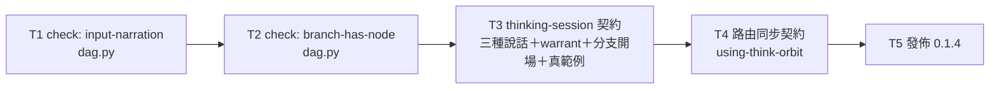

# Plan: think-orbit 透明度兩面對等（對話面＋檔案面）

**Source brief**: docs/loom/specs/2026-08-19-think-orbit-transparency-both-faces.md
Goal: 讓 think-orbit 在討論當下就把推理講出來（講在動作之前，不等回答），並讓每個節點檔即使
    在口頭講過之後仍能獨立成立——body 首段交代承接誰／多說什麼／什麼會垮；兩條新的機械閘
    （body 未提及任何 input、分支只有假設沒有節點）把這兩件事釘住；粒度與既有上限規則不動。
Stage: finishing
**Total tasks**: 5
**Critical-path depth**: 5 (≤5)
**Execution order**: sequential
**Plan-document-reviewer verdict**: PASS (2026-08-19, round 2)

## Task-flow diagram

每一步都與前一步共用檔案（T1→T2 同為 `dag.py`／`test_dag.py`；T3→T4 同為 `test_skill_md.py`），
且 T3 的範例必須通過 T1／T2 新增的規則，因此全鏈為真實依賴，無可平行化的葉節點。
`Independent: true` 一個都沒有，這是檔案重疊與語意依賴的結果，不是漏標。

## Open Questions

N/A — no unresolved question: brief 的 OQ-1（`inputs: []` 節點不適用 `input-narration`）與 OQ-2（headless 情境義務不變）皆已於 2026-08-19 定案並寫回 brief。

## Steps

- step 1: 機械閘（兩條新的 check 規則）
- step 2: 契約（核心 skill 的授權文字＋範例，路由同步）
- step 3: 發佈

## Task 1 — `check` 規則 `input-narration`

- Description: Add a `input-narration` rule to `_CHECK_RULES` in `think-orbit/scripts/dag.py`. A node whose `inputs` is non-empty violates the rule when its prose body contains the `id` of NO load-bearing input (`load_bearing: true`) — naming at least one is enough. Special case: when a node has inputs but NONE are load-bearing, it must name at least one of its non-load-bearing inputs instead; without this branch such a node could never satisfy the rule. Emit one violation line per offending node, in the same `<relpath>: <rule>: <message>` shape the existing rules use. Nodes with empty or absent `inputs` are never flagged — resolved OQ-1; the exemption mirrors the existing `origin == "research"` carve-out in the `fact-source` rule rather than inventing a second exemption mechanism. An input entry carrying no `ref` is skipped (it is `_rule_ref`'s violation to report, not this rule's). The id must be matched with an ASCII-only word boundary whose excluded class is `[A-Za-z0-9_-]` — NOT plain substring containment and NOT Python's `\b`. The hyphen is in the class so a short id does not match inside a kebab-case sibling (`goal` inside `goal-v2`) or an ordinary compound (`goal-setting`). The dot is deliberately NOT in the class: excluding it would stop `This rests on fact1.` from matching — an id at the end of an English sentence, the common case — in exchange for catching dot-versioned sibling ids like `fact1.1`, which is rare. Measured both ways before deciding; the dot-versioned collision is accepted residual risk, recorded here rather than left implicit. Plain containment lets `fact1` match inside a sibling id `fact10`; `\b` is defined by `\w`, which includes CJK in Unicode mode, so `fact1的證據` would stop matching (measured: `\b` gives False there, the ASCII-only boundary gives True). The rule verifies that the id was NAMED; it must not judge whether the surrounding sentence explains anything. **Spec revised mid-task after measurement — see the plan's `## Notes`; the summary-keyword arm from the first specification is deleted, not kept as a fallback.**
- Module: think-orbit/scripts
- Files touched: think-orbit/scripts/dag.py, think-orbit/scripts/test_dag.py, think-orbit/skills/thinking-session/SKILL.md
- Context paths:
  - /Users/kouko/.supacode/repos/monkey-skills/strage-dag-skill/think-orbit/scripts/dag.py
  - /Users/kouko/.supacode/repos/monkey-skills/strage-dag-skill/think-orbit/skills/thinking-session/references/node-schema.md
  - /Users/kouko/.supacode/repos/monkey-skills/strage-dag-skill/docs/loom/dogfood/2026-08-19-think-orbit-real-material.md
- Acceptance:
  - RED: `test_check_flags_a_node_whose_body_names_none_of_its_inputs` in `think-orbit/scripts/test_dag.py` — fails because no `input-narration` rule exists.
  - GREEN: the test passes, and asserts five cases: (a) a node whose body names none of its load-bearing inputs' ids yields exactly one `input-narration` line; (b) a node whose body names every load-bearing input's id inside a sentence yields none; (c) a node whose body only paraphrases the upstream topic WITHOUT naming any id yields exactly one line — this is the case the deleted keyword arm got wrong, and it must be pinned as a violation, not as a pass; (d) a node with `inputs: []` yields none; (e) a node naming its load-bearing input but not its non-load-bearing one yields none; (f) a node with several load-bearing inputs that names only ONE of them yields none — the threshold is at least one, measured; (g) a node whose inputs are all non-load-bearing and which names none of them yields exactly one line; (h) the reciprocal of (g) — a node whose inputs are all non-load-bearing and which DOES name at least one yields none, so the special branch is pinned in both directions rather than only negatively; (i) a node that leaves its load-bearing input unnamed while naming a non-load-bearing one yields exactly one line, which pins the load-bearing preference itself (mutating the rule to count any input equally must turn this test red); (j) an id that appears only as a prefix of a longer sibling id — body discusses `fact10`, load-bearing input is `fact1` — yields exactly one line, and an id immediately followed by CJK text with no space yields none; (k) a short id that appears only inside a kebab-case sibling id — body discusses `goal-v2`, load-bearing input is `goal` — yields exactly one line, while an id at the end of an English sentence (`… rests on fact1.`) yields none. At least one fixture body is Traditional Chinese. `python3 -m pytest think-orbit/scripts/ -q` is green — including `test_skill_md.py::test_thinking_session_minimal_examples_pass_check`, which requires the ONE shipped example this rule newly catches (`nodes/referral_scales.md` in `think-orbit/skills/thinking-session/SKILL.md`, which declares `q4_goal` load-bearing but never names it) to name `q4_goal` in its body. That single-line edit is the whole of this task's SKILL.md scope; Task 3 still owns replacing every placeholder example with real content.
- Dependencies: none
- Independent: false
- Brief item covered: BI-3 — `check` rule `input-narration`
- Status: done(e3c41ef5)
- Gloss: 把量到的「8 個有上游的節點，0 個交代了上游」釘成可機械偵測的違規；只驗有沒有提到，不驗寫得好不好。

## Task 2 — `check` 規則 `branch-has-node`

- Description: Add a `branch-has-node` rule to `_CHECK_RULES` in `think-orbit/scripts/dag.py`. A branch id that appears on one or more assumptions but on no node is a violation — one line naming the branch id. A branch carrying at least one node is silent. A project-wide assumption (no `branch` key at all) is out of scope for this rule and must not be flagged, preserving the project-wide-assumption behaviour shipped in 0.1.2.
- Module: think-orbit/scripts
- Files touched: think-orbit/scripts/dag.py, think-orbit/scripts/test_dag.py
- Context paths:
  - /Users/kouko/.supacode/repos/monkey-skills/strage-dag-skill/think-orbit/scripts/dag.py
  - /Users/kouko/.supacode/repos/monkey-skills/strage-dag-skill/docs/loom/dogfood/2026-08-19-think-orbit-real-material.md
- Acceptance:
  - RED: `test_check_flags_a_branch_carried_only_by_assumptions` in `think-orbit/scripts/test_dag.py` — fails because no `branch-has-node` rule exists.
  - GREEN: the test passes and asserts three cases: (a) a branch id carried only by assumptions yields exactly one `branch-has-node` line naming that branch; (b) a branch with at least one node yields none; (c) an assumption with no `branch` key (project-wide) yields none. `python3 -m pytest think-orbit/scripts/ -q` is green.
- Dependencies: Task 1 completes first
- Independent: false
- Brief item covered: BI-4 — a branch must contain a node (mechanical half; the authoring half is Task 3)
- Status: done(536776a1)
- Gloss: 擋掉檢查點看到的那四條「只裝假設、沒有主張」的空分支，順帶讓每分支 ≤3 假設的上限重新有意義。

## Task 3 — thinking-session 的授權契約與範例

- Description: Rewrite the speech and node-authoring contract in `think-orbit/skills/thinking-session/SKILL.md` and `think-orbit/skills/thinking-session/references/node-schema.md`. Four changes, one file pair, one module. (1) Replace the blanket "Everything else is silent file writing … no progress narration" sentence with a three-way classification: progress narration stays banned; reasoning-aloud is REQUIRED, stated at the granularity "before the action, not after the thought" — one or two sentences naming what you are about to claim and what it stands on, written before the node file, never awaiting a reply; the three interrupts are unchanged. (2) State that this skill is a deliberate exception to a host-level terse / no-narration preference, naming the reason: transparency is the product here. (3) Add the warrant duty — every node body's first paragraph names which upstream node it stands on RESTATED IN PROSE rather than cited as a bare `ref` id, what this step adds, and what would collapse it; state explicitly that the file must stand alone even though the same reasoning was already spoken. (4) Add the branch-opening rule: when a branch opens, each path first gets one CLAIM node stating that path's position, and the branch's assumptions are filed under that CLAIM — this is the authoring half of the rule Task 2 enforces mechanically, and it is what restores the meaning of the existing three-assumptions-per-branch cap (three assumptions supporting one claim, not three assumptions standing alone). (5) Replace the placeholder worked examples (`Body text in short paragraphs.` in SKILL.md, `Longer body text explaining the goal.` / `Optional body with more detail.` / `Optional body with supporting detail.` in node-schema.md) with real bodies that demonstrate the warrant duty, and add at least one example node carrying non-empty `inputs` so the example set exercises Task 1's rule. Both files' word budgets have ample headroom (SKILL.md body is 1929 words against a 4500 cap) — do not move material to a new reference file.
- Module: think-orbit/skills/thinking-session
- Files touched: think-orbit/skills/thinking-session/SKILL.md, think-orbit/skills/thinking-session/references/node-schema.md, think-orbit/scripts/test_skill_md.py
- Context paths:
  - /Users/kouko/.supacode/repos/monkey-skills/strage-dag-skill/think-orbit/skills/thinking-session/SKILL.md
  - /Users/kouko/.supacode/repos/monkey-skills/strage-dag-skill/think-orbit/skills/thinking-session/references/node-schema.md
  - /Users/kouko/.supacode/repos/monkey-skills/strage-dag-skill/think-orbit/scripts/test_skill_md.py
  - /Users/kouko/.supacode/repos/monkey-skills/strage-dag-skill/docs/loom/specs/2026-08-19-think-orbit-transparency-both-faces.md
- Acceptance:
  - RED: ONE new test function `test_thinking_session_states_the_transparency_contract` in `think-orbit/scripts/test_skill_md.py` — fails because the body still carries the blanket silence sentence and never requires reasoning-aloud. Its shape follows the existing multi-clause-in-one-function convention of `think-orbit/scripts/test_skill_md.py:68`, which asserts word cap, required literals, the views prohibition and the interrupt tokens inside a single function.
  - GREEN: that one test passes, asserting all five clauses internally — (a) the body still bans progress narration; (b) it requires reasoning-aloud; (c) it states the before-the-action granularity; (d) it names the host-preference exception; (e) the string `Everything else is` (verified contiguous in this file) is gone; (f) SKILL.md and node-schema.md both state the three-part warrant duty and the stands-alone-even-if-spoken rule; (g) the branch-opening rule is stated; (h) no example body is a self-describing placeholder and at least one example node carries non-empty `inputs` whose body names them. The pre-existing `test_thinking_session_minimal_examples_pass_check` still passes with Tasks 1 and 2's rules active, and the SKILL.md body stays under `WORD_CAP`. `python3 -m pytest think-orbit/scripts/ -q` is green.
- Dependencies: Task 2 completes first
- Independent: false
- Brief item covered: BI-1 — three kinds of speech in the contract (core skill half); BI-2 — warrant duty on every node body; BI-4 — a branch must contain a node (authoring half: a branch opens with a CLAIM, assumptions filed under it); BI-5 — replace the placeholder worked examples
- Status: done(1a0bd897)
- Gloss: 這一步是根因的修正——推理被講出來，body 才有東西可寫；範例同時換成真的，因為 agent 會照抄示範。

## Task 4 — 路由 skill 同步同一份契約

- Description: Update `think-orbit/skills/using-think-orbit/SKILL.md` so the router states the same three-way speech classification instead of its current blanket "Everything else is silent file writing: no forms, no per-node confirmation, no progress narration" summary, and so its "do not narrate the whole graph" line reads as a prohibition on re-listing the DAG rather than on reasoning-aloud. The router states the classification in one short paragraph and points at `thinking-session` as the SSOT for the detail — it must not restate the warrant duty's three parts or the interrupt table. Router body has headroom (1000 words against a 2500 cap).
- Module: think-orbit/skills/using-think-orbit
- Files touched: think-orbit/skills/using-think-orbit/SKILL.md, think-orbit/scripts/test_skill_md.py
- Context paths:
  - /Users/kouko/.supacode/repos/monkey-skills/strage-dag-skill/think-orbit/skills/using-think-orbit/SKILL.md
  - /Users/kouko/.supacode/repos/monkey-skills/strage-dag-skill/think-orbit/skills/thinking-session/SKILL.md
  - /Users/kouko/.supacode/repos/monkey-skills/strage-dag-skill/think-orbit/scripts/test_skill_md.py
- Acceptance:
  - RED: `test_router_states_the_three_kinds_of_speech` in `think-orbit/scripts/test_skill_md.py` — fails because the router body still carries the blanket silence summary.
  - GREEN: the test passes, asserting the router body (a) requires reasoning-aloud, (b) still bans progress narration, (c) no longer matches the whitespace-tolerant pattern `silent\s+file\s+writing`, and (d) does not restate the warrant duty's three parts (SSOT stays in `thinking-session`). The pattern must be whitespace-tolerant, NOT a plain substring: the router's current text wraps as `is silent file` / `writing: no forms`, so the contiguous string `silent file writing` is absent from this file today and a plain `in` check would pass before any edit — a false green. Router body stays under `ROUTER_WORD_CAP`. `python3 -m pytest think-orbit/scripts/ -q` is green.
- Dependencies: Task 3 completes first
- Independent: false
- Brief item covered: BI-1 — three kinds of speech in the contract (router half)
- Status: done(90278aa5)
- Gloss: 兩個 skill 說相反的話，agent 會挑安靜的那個聽；路由講同一套，但細節只留在核心 skill 一處。

## Task 5 — 發佈 0.1.4

- Description: Release think-orbit 0.1.4. Bump `think-orbit/.claude-plugin/plugin.json` to `0.1.4`, regenerate the Codex mirror with `python3 scripts/sync_codex_manifests.py think-orbit` (never hand-edit `.codex-plugin/plugin.json`), update the hardcoded version literal in `think-orbit/scripts/test_plugin_manifest.py`, and add a `## [0.1.4]` CHANGELOG entry describing the transparency contract and the two new check rules.
- Module: think-orbit
- Files touched: think-orbit/.claude-plugin/plugin.json, think-orbit/.codex-plugin/plugin.json, think-orbit/CHANGELOG.md, think-orbit/scripts/test_plugin_manifest.py
- Context paths:
  - /Users/kouko/.supacode/repos/monkey-skills/strage-dag-skill/think-orbit/CHANGELOG.md
  - /Users/kouko/.supacode/repos/monkey-skills/strage-dag-skill/think-orbit/scripts/test_plugin_manifest.py
  - /Users/kouko/.supacode/repos/monkey-skills/strage-dag-skill/scripts/sync_codex_manifests.py
- Acceptance:
  - RED: `test_manifest_marketplace_and_codex_mirror_are_consistent` in `think-orbit/scripts/test_plugin_manifest.py` — fails on the version literal once it is set to `0.1.4` while `plugin.json` still says `0.1.3`.
  - GREEN: the test passes; `python3 scripts/sync_codex_manifests.py --check think-orbit` exits 0; `python3 scripts/check-skill-structure.py think-orbit` reports all 3 skills PASS; `python3 scripts/check-marketplace-description-sync.py` exits 0; `python3 -m pytest think-orbit/scripts/ -q` is green.
- Dependencies: Task 4 completes first
- Independent: false
- Brief item covered: BI-6 — release 0.1.4
- Status: done(9ac79910)
- Gloss: 沒 bump 版本，marketplace 的 update 會靜默 no-op，改好的契約不會裝到任何一台機器上。

## Notes

- **T1 的規格於執行中被量測推翻並改寫（2026-08-19，round-2 審查後）。** 原規格允許「body 提到上游的
  `summary` 關鍵詞」即算交代。拿真實專案（使用者本機的私有專案目錄（路徑不入公開 repo），
  10 個帶 `inputs` 的節點）實跑：關鍵詞那條路 **10/10 全數放行**，包含其中一個 CLAIM 節點
  ——它的 body 從未提及三個上游中的任何一個，只是在談同一個主題。加了 27 個中文功能詞停用清單也無效，
  審查者立刻用 `他們`／`目前` 重現同一個缺陷，而該類詞是開放集合。根因是**詞彙重疊分不出「交代了上游」
  與「在講同一件事」**，而同一條推理鏈上的節點必然在講同一件事。只認 id 的那條路 **2/10**，
  正好復現檢查點 §F-T12-02 的人工判讀。規格因此改走「認 id」這條路。
  三輪重派上限是針對**同一份規格**計算的；本次是規格變更，計數重置，並在此明載以免看起來像規避上限。

  **同一則紀錄的第二段：門檻本身又被量測修正一次。** 改走認 id 之後的第一版寫成
  「body 必須點名**每個**承重上游的 id」。實跑通過 1/10，而且通過的是一個沒有任何承重上游的 FACT
  （該節點沒有任何承重上游，空集合為真），人工判定寫得好的那兩個 DECISION 反而**不及格**
  ——它們各有 4 個與 3 個承重上游，只點名其中一部分。**比語料中最好的人寫節點還嚴的規則是校準錯誤。**
  最終規格是「**至少**點名一個承重上游」，通過 2/10 且正好是那兩個節點。量測同時揭出一個邊界：
  有上游但無任何承重上游的節點在只認承重的規則下永遠無法及格，故加一條分支——
  這種節點改為必須點名其非承重上游中的至少一個。
- **T1 的 `Files touched` 於執行中最小幅擴充**，加入 `think-orbit/skills/thinking-session/SKILL.md`。
  原計畫假設出貨範例與新規則相容，實跑推翻：`nodes/referral_scales.md` 宣告 `q4_goal` 為承重上游，
  body 卻從未提及它，於是 T1 一上線 `test_thinking_session_minimal_examples_pass_check` 立刻轉紅。
  一道閘門不得把自己造成的紅樹留給後面的任務——那正是 stale-green-light 的溫床——所以由 T1 修掉它，
  範圍僅限那一個範例的 body 加上 id。T3 仍然負責把全部佔位符範例換成真實內容（BI-5 未縮減）。
  這是實作階段揭露的計畫缺陷，不是範圍蔓延。
- **審查者的 round-1 反例（`我們`／否定句那組）已由審查者本人撤回**，不得在後續文件中當成有效反例引用；
  真正有效的反例是 `他們`／`目前`，而它們現在也一併被新規格淘汰（新規格根本不看關鍵詞）。

- **深度為 5，貼著上限，這是刻意的取捨。** 每一步都與前一步共用檔案（T1→T2 的 `dag.py`／`test_dag.py`，
  T3→T4 的 `test_skill_md.py`），且 T3 的範例必須通過 T1／T2 的新規則。若把 T3 的四項改動再拆成
  四個任務，深度會變 8 而違反上限；本 repo 既有慣例是**一個 pytest 函式在內部斷言一份散文契約的數個子句**
  （`test_skill_md.py:68` 的 `test_thinking_session_skill_names_cli_verbs_interrupts_view_prohibition_and_word_cap`
  即在單一函式內斷言字數上限、必要字串、視圖禁令與三個 interrupt token）。T3 依此慣例，
  RED 為**單一測試函式**、內部涵蓋八個子句——不是數個具名測試函式。
  （修訂紀錄：round 1 的計畫誤把該先例描述成「一個任務數個具名測試」並據此鋪陳 T3，
  審查指出兩者是不同慣例；已改為與先例一致的單函式形狀。）
- **`Independent: true` 一個都沒有**是檔案重疊與語意依賴的結果，不是漏標；本計畫無可平行化的葉節點。
- **T5 每次都要改測試裡的版本字面值**：`test_plugin_manifest.py` 把版本硬寫成字面值，
  每次 bump 都得改那一行。此摩擦已於 PR #710 標記，本計畫不順手修——修它屬另一改動，
  會讓本 arc 的審查範圍變糊。
- **不動的東西**（brief §Out of Scope 的執行面提醒）：節點粒度、`≤3 假設/分支`、
  `paragraph-form` 的 2–4 句規則、三張衍生視圖、線性閱讀視圖（Part 2 的 `render mainline` 已涵蓋）。
- **External surfaces**: N/A — 全部改動僅涉及 Python 標準函式庫與 repo 內既有腳本，無新的外部相依。
