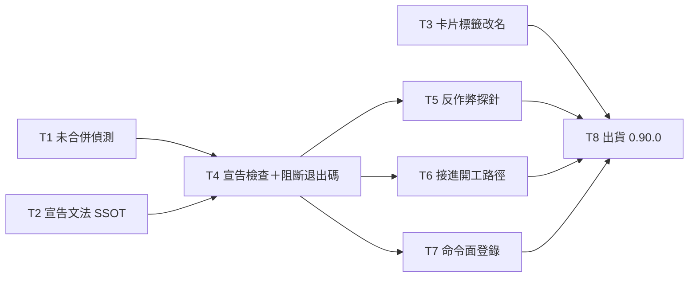

# Plan: 方向佇列閘

**Source brief**: docs/loom/specs/2026-08-20-direction-queue-gate.md
Goal: 開工前，倉庫狀態與宣告的佇列若對不上，流程會停下來問一個必須回答的問題，而答案落進提交的 brief——不是多印一行報告讓人滑過去。
Stage: finishing
Steps:
  1. 三路平行起跑：未合併偵測、宣告文法 SSOT、卡片標籤改名
  2. 兩個檢查合流成一支 CLI 與阻斷退出碼
  3. 反作弊探針＋接進開工路徑＋命令面登錄
  4. 出貨
Total tasks: 8
Critical-path depth: 4 (≤5)
Execution order: parallel-where-possible
Plan-document-reviewer verdict: PASS (2026-08-20, round 2 + delta confirmation)

## Task-flow diagram

## Open Questions

N/A — no unresolved question: both triggers are decided, both are computable from repo state alone, and the blocking contract is transcribed from `check_onramp_choice.py`, a gate already shipped in this repo.

## Task 1 — 未合併的方向改動偵測

- **Description**: Create `loom-code/scripts/check_direction_freshness.py` with a function that reports every commit reachable from any ref but not from `HEAD` which modifies `docs/loom/DIRECTION.md` or a backlog entry file currently named in `## Now`.
  - Resolve the `## Now` entry names by parsing the section's `- <name> — <description>` lines, then map each name to `docs/loom/backlog/<name>.md`.
  - For each local branch, take the intersection of two file sets: files the branch itself changed since its merge-base with the base branch, and files whose content still differs from the base branch. A file in both is an unlanded change.
  - Ancestry is the wrong test here and must not be used. Under squash merge a landed branch's tip is not an ancestor of the base branch, so `merge-base --is-ancestor` reports every branch unmerged — measured on this repo: 6 of 6.
  - Shell out to git for this check. `backlog_index.py` deliberately avoids git (`backlog_index.py:60,70-73,502`) and that boundary stays intact — this is why the check lives in a new script rather than a new flag on the old one.
  - Report each hit as `<branch> — <path> (tip <date>)` so one glance is enough to dismiss a false positive.
  - This check REPORTS; it never blocks. It is a heuristic with a known false-positive class, and a heuristic must not gate work.
  - A repo with no `docs/loom/DIRECTION.md`, or no `## Now` section, is not a violation: return an empty list.
- **Module**: loom-code/scripts
- **Files touched**: loom-code/scripts/check_direction_freshness.py, loom-code/scripts/test_check_direction_freshness.py
- **Context paths**:
  - loom-code/scripts/backlog_index.py
  - loom-code/scripts/check_onramp_choice.py
  - docs/loom/DIRECTION.md
- **Acceptance**:
  - RED: `loom-code/scripts/test_check_direction_freshness.py::test_reports_unlanded_change_to_a_now_entry` — builds a throwaway git repo with a `## Now` entry, changes that entry file on a side branch, and asserts the function reports it. Fails today because the module does not exist.
  - GREEN: the test passes; sibling tests assert that a side branch whose change was squash-landed onto the base yields an empty list, that a side branch touching unrelated files yields an empty list, and that a missing `DIRECTION.md` yields an empty list rather than raising.
- **External surfaces**: git CLI — `git merge-base`, and `git diff --name-only` in both the base-to-branch and branch-to-base directions.
  - Measured against a WIDER sample than the algorithm's own governing set, because `## Now` is empty on this repo today, so the real governing set is `{docs/loom/DIRECTION.md}` alone. The sample substituted every file under `docs/loom/backlog/`.
  - On that sample, across the 6 branches touching it: the intersection test flags 2 and clears 4, correctly clearing a squash-merged branch whose content had landed. Ancestry misreports all 6 as unmerged.
  - On the real governing set today, the same algorithm flags exactly 1 branch (`feat/requirement-identity-hybrid`, via `DIRECTION.md`) — and that one is the admitted false-positive class, since its change landed and `main` has edited the file since.
  - Two earlier drafts of this bullet stated numbers that did not reproduce: the first cited `git log --all --not HEAD` with a count of four, read off a `head -5` truncation of an 18-commit result; the second reported the wide-sample numbers using the task's own term `governing files`, which names a narrower set.
- **Dependencies**: none
- **Independent**: true
- **Brief item covered**: BI-1
- **Status**: done(a4452250)
- **Gloss**: 抓「有人改了方向、但那個改動還沒進主線」——kumiko 就是這裡靜默了九天。它只報告不擋，因為它是啟發式的

## Task 2 — `## Queue relation` 宣告文法

- **Description**: Add a `## Queue relation` section to `loom-code/skills/brainstorming/references/handoff-brief-format.md` defining a closed grammar with exactly three canonical forms, in the same shape the `## Design-side on-ramp` line already uses in that file.
  - `in-queue: <entry-name>` — this arc is the queue entry of that name.
  - `unqueued — <reason>` — this arc is not in the queue, and the reason is stated.
  - `displaces: <entry-name> — <reason>` — this arc goes before a queued entry, and the reason is stated.
  - State that any other wording is unresolved and never treated as a pass, matching the on-ramp line's own rule.
  - State that `pending` is what the agent writes until the user has answered, and is never the agent's own default.
- **Module**: loom-code/skills/brainstorming/references
- **Files touched**: loom-code/skills/brainstorming/references/handoff-brief-format.md, loom-code/scripts/test_queue_relation_grammar.py
- **Context paths**:
  - loom-code/skills/brainstorming/references/handoff-brief-format.md
  - loom-code/scripts/check_onramp_choice.py
- **Acceptance**:
  - RED: `loom-code/scripts/test_queue_relation_grammar.py::test_handoff_format_states_three_canonical_queue_forms` — asserts the file names all three forms verbatim and states the unresolved rule. Fails today because the section does not exist.
  - GREEN: the test passes, and it fails when any one of the three forms is deleted AND when the unresolved-wording rule is reversed to say other wording is accepted.
- **Dependencies**: none
- **Independent**: true
- **Brief item covered**: BI-2
- **Status**: done(3d68081a)
- **Gloss**: 把「這支弧跟佇列是什麼關係」寫成三選一的封閉文法，機器判得了，不用揣測

## Task 3 — 卡片標籤 `goal:` 改名 `end-state:`

- **Description**: Change the progress card's rendered label for the plan's `Goal:` field from `goal:` to `end-state:` in `loom-code/scripts/plan_card.py`, and update the field-order spec in `loom-code/hooks/family-relay.md` §(a2) to match.
  - The plan schema field keeps the name `Goal:` — only the rendered label changes. No plan file is edited by this task.
  - The reason is a live collision: the host's built-in `/goal` holds a session-scoped directive, and both surfaces are now read by the same person in the same session.
  - `end-state:` is chosen because `plan-format.md` defines the field as transcribed from the brief's Smallest End State, so the label names its own provenance.
  - `test_progress_tooling_shipped.py:79` pins the literal `"goal:" in shim.stdout`. That assertion is updated in this task; leaving it would make the suite red, and it is the consumer this plan's first draft failed to enumerate.
- **Module**: loom-code/scripts
- **Files touched**: loom-code/scripts/plan_card.py, loom-code/scripts/test_plan_card.py, loom-code/scripts/test_progress_tooling_shipped.py, loom-code/hooks/family-relay.md, loom-design/scripts/pipeline/test_family_relay_progress_card.py
- **Context paths**:
  - loom-code/hooks/family-relay.md
  - loom-code/skills/writing-plans/references/plan-format.md
- **Acceptance**:
  - RED: `loom-code/scripts/test_plan_card.py::test_card_labels_the_goal_field_end_state` — asserts the rendered card's first line starts with `end-state: ` and that no line starts with `goal: `. Fails today because the label is `goal:`.
  - GREEN: the test passes; the shim pin in `test_progress_tooling_shipped.py` asserts the new label; `loom-design/scripts/pipeline/test_family_relay_progress_card.py` still passes against the updated §(a2); the full suite is green.
- **Dependencies**: none
- **Independent**: true
- **Brief item covered**: BI-5
- **Status**: done(3fde401c)
- **Gloss**: 解決卡片的 `goal:` 跟 Claude Code 內建 `/goal` 撞名——同一個詞現在指兩個範圍不同的東西

## Task 4 — 宣告檢查與阻斷退出碼

- **Description**: Add a second check to `check_direction_freshness.py` that reads a brief and reports a violation when its `## Queue relation` line is absent, malformed, or `pending`, and give the script a CLI whose exit codes route the caller.
  - Only the queue-relation check gates. Exit 2 means STOP-and-ask and is reached solely by a missing, malformed or `pending` declaration — never by Task 1's heuristic.
  - Exit 0 when the declaration resolves, exit 1 for an unreadable path.
  - Task 1's findings print on every run, including exit 2, so the reader meets them while already stopped rather than in a report they can scroll past.
  - Exit 2 prints the question the caller must relay verbatim, in the same shape `check_onramp_choice.py` prints its own.
  - Both checks run in one invocation so the caller has one gate to wire, not two.
  - A named entry in an `in-queue:` or `displaces:` value must exist in `## Now`; a name that is not there is a violation, because a typo would otherwise silently satisfy the gate.
- **Module**: loom-code/scripts
- **Files touched**: loom-code/scripts/check_direction_freshness.py, loom-code/scripts/test_check_direction_freshness.py
- **Context paths**:
  - loom-code/scripts/check_onramp_choice.py
  - loom-code/skills/brainstorming/references/handoff-brief-format.md
- **Acceptance**:
  - RED: `loom-code/scripts/test_check_direction_freshness.py::test_missing_queue_relation_exits_two_with_a_relayable_question` — runs the CLI against a brief with no `## Queue relation` section and asserts exit 2 plus a question string on stderr. Fails today because the check does not exist.
  - GREEN: the test passes; sibling tests assert exit 0 on each of the three canonical forms, exit 2 on `pending`, exit 2 on a named entry absent from `## Now`, exit 1 on a missing file, and exit 0 with the advisory printed when Task 1's check has findings but the declaration resolves.
- **Dependencies**: Tasks 1, 2 complete first
- **Independent**: false
- **Brief item covered**: BI-2, BI-3
- **Status**: done(539aa070)
- **Gloss**: 兩個檢查合成一道閘，違規時退出碼是「停下來問」而不是「印個警告」

## Task 5 — 反作弊探針

- **Description**: Add `loom-code/scripts/test_check_direction_freshness_no_skip.py` proving neither check can pass by matching nothing, mirroring `test_check_field_microstructure_no_skip.py`.
  - Prove the unmerged check fires on a repo it should flag, so a regex or path bug that matches nothing cannot read as clean.
  - Prove the queue-relation check rejects an empty brief rather than treating an absent section as satisfied.
  - Each probe must go RED when its target branch in the production code is deleted, and RED again when the target's claim is reversed in place.
- **Module**: loom-code/scripts
- **Files touched**: loom-code/scripts/test_check_direction_freshness_no_skip.py
- **Context paths**:
  - loom-code/scripts/test_check_field_microstructure_no_skip.py
  - loom-code/scripts/check_direction_freshness.py
- **Acceptance**:
  - RED: `loom-code/scripts/test_check_direction_freshness_no_skip.py::test_unmerged_check_cannot_pass_by_matching_nothing` — fails before the probe file exists.
  - GREEN: both probes pass, and the implementer reports the four mutation runs — delete and reverse, for each of the two checks — all RED.
- **Dependencies**: Task 4 completes first
- **Independent**: true
- **Brief item covered**: BI-3
- **Status**: done(765d96b3)
- **Gloss**: 這個 repo 有前科：檢查因為什麼都沒比對到而假裝通過。這支證明它不會

## Task 6 — 接進開工路徑並宣告停等契約

- **Description**: Wire the gate into `loom-code/skills/writing-plans/SKILL.md` as an unconditional intake gate alongside the existing on-ramp gate, and add one line to `loom-code/skills/brainstorming/SKILL.md` telling the brief's author to write the `## Queue relation` line.
  - The writing-plans entry states the three exits and what the caller does on each, in its own sentence, not spliced into the on-ramp gate's paragraph.
  - The exit-2 contract is: STOP, do not draft, relay the printed question verbatim, wait for the user's answer, write it into the brief, re-run.
  - Point at `handoff-brief-format.md` for the grammar; do not restate the three forms in either skill file.
  - `writing-plans/SKILL.md` sits near its word ceiling. If the addition would cross it, report that an extraction is needed rather than raising the cap.
- **Module**: loom-code/skills
- **Files touched**: loom-code/skills/writing-plans/SKILL.md, loom-code/skills/brainstorming/SKILL.md, loom-code/scripts/test_writing_plans_queue_gate.py
- **Context paths**:
  - loom-code/skills/writing-plans/SKILL.md
  - loom-code/skills/brainstorming/SKILL.md
- **Acceptance**:
  - RED: `loom-code/scripts/test_writing_plans_queue_gate.py::test_skill_md_declares_the_queue_gate` — asserts the SKILL.md paragraph names the script, all three exits with their meanings bound in one clause each, and the stop-relay-wait-record duty. Fails today because the paragraph does not exist.
  - GREEN: the test passes and goes RED both when the exit-code sentence is deleted and when the exit numbers are swapped; `scripts/check-skill-structure.py loom-code` passes with the word cap unchanged.
- **Dependencies**: Task 4 completes first
- **Independent**: true
- **Brief item covered**: BI-3, BI-4
- **Status**: done(765d96b3)
- **Gloss**: 讓這道閘真的在開工時被跑到，而不是躺在 scripts 目錄裡；停等契約寫成契約而不是建議

## Task 7 — 命令面登錄

- **Description**: Add an entry for `check_direction_freshness.py` to the commands section of `AGENTS.md`, stating both modes, the exact invocation, and all three exit codes with what each means.
  - Transcribe the exit semantics from the script, not from this plan.
  - Verify each documented invocation by running it and recording the observed exit code.
- **Module**: repo root
- **Files touched**: AGENTS.md
- **Context paths**:
  - AGENTS.md
  - loom-code/scripts/check_direction_freshness.py
- **Acceptance**:
  - RED: a grep for `check_direction_freshness` in `AGENTS.md` returns nothing, and `python3 loom-code/scripts/check_direction_freshness.py --help` exits 0 — so the runnable verb exists with no declared entry point.
  - GREEN: the entry exists, names all three exit codes, and the implementer reports the observed exit code from running each documented invocation.
- **Dependencies**: Task 4 completes first
- **Independent**: true
- **Brief item covered**: BI-3
- **Status**: done(765d96b3)
- **Gloss**: 新的可執行動詞要在命令面上有登錄，不然它等於不存在

## Task 8 — loom-code 0.89.0 → 0.90.0 出貨

- **Description**: Bump `loom-code/.claude-plugin/plugin.json` and `loom-code/.codex-plugin/plugin.json` to 0.90.0 and add the CHANGELOG entry.
  - The entry names the new gate, its two triggers, the three exit codes, and the card label rename.
  - It also records what this arc deliberately did NOT build, and that the reason was measurement rather than cost.
- **Module**: loom-code
- **Files touched**: loom-code/.claude-plugin/plugin.json, loom-code/.codex-plugin/plugin.json, loom-code/CHANGELOG.md
- **Context paths**:
  - loom-code/CHANGELOG.md
- **Acceptance**:
  - RED: `loom-code/scripts/test_plugin_manifest.py` — the shipping-version pin fails against 0.90.0 until both manifests are bumped.
  - GREEN: both manifests read 0.90.0, the CHANGELOG entry is present, and the full suite is green.
- **Dependencies**: Tasks 3, 5, 6, 7 complete first
- **Independent**: false
- **Brief item covered**: BI-1, BI-2, BI-3, BI-4, BI-5
- **Status**: done(7ba65d5d)
- **Gloss**: 沒有 bump 的話 marketplace 端 `plugin update` 會靜默 no-op，改了等於沒改

## Notes

Kickoff decision: the gate lives in a NEW script rather than a flag on `backlog_index.py`, because that module states in its own comments that it avoids git shell-outs, and the unmerged check requires them. Keeping the boundary intact costs one file.

Kickoff decision: both checks share one CLI and one invocation, so the caller wires one gate. The alternative — two scripts, two gate sentences — doubles the drift surface in skill prose, which is the defect class this repo keeps producing.

Recorded at plan time: the trigger evidence is n=1. Two control projects measured zero instances of both trigger conditions, so this gate will never fire in them. That is the intended cost profile — a gate that is silent where there is no conflict — but it also means the design is validated by one project only, and the first real firing outside that project is the observation that would confirm or refute it.

Recorded at plan time: `writing-plans/SKILL.md` was at 4232 words. CORRECTED 2026-08-20 — the cap stated here was 4420, which does not reproduce: `scripts/check-skill-structure.py:305` sets `WORD_HARD_CAP = 4500`. The 4420 figure was carried from an earlier arc's memory rather than re-read, which is the same defect this arc caught twice in implementer reports. Task 6 must fit inside that headroom or report an extraction; raising the cap an eighteenth time is out of scope, per `docs/loom/memory/a-cap-raised-at-every-touch-is-not-a-cap.md`.

Recorded at plan time, after five measurement probes: no offline git signal cleanly separates "this change never landed" from "it landed and the base branch has since changed the same file". Ancestry fails under squash merge (6 of 6 branches misreported); upstream and remote presence fail because merged branches lose their remote; blob-in-history fails because a squash reshapes the content. The intersection test in Task 1 is the best of the five, clearing 4 of 6 correctly, and its residual false-positive class is a branch whose change landed in reshaped form. That residual is why Task 1 reports and Task 4's declaration check is the only thing that blocks — a heuristic must not gate work, and an exact declaration can.

Recorded at plan time, round 2: the plan-document-reviewer's single remaining finding was that Task 1's measurement reused the task's own defined term for a wider sample. Corrected in place with both figures stated separately. The round cap of 2 is exceeded by this fix deliberately — the plan passed 16 of 17 checks with every structural check green, and the finding is a wording correction inside one bullet rather than a signal that the brief needs revisiting, which is what the cap exists to catch. The fix was confirmed by the same reviewer, delta-scoped, rather than by a third full round.

Amendment skip note: the header's verdict and stage were stamped from the reviewer's returned result — stamping the verdict, no re-review.

## Decision Log

- 2026-08-20 — Task 3's scope is extended to three sites the rename made false, outside its declared `Files touched`: `check_field_microstructure.py`'s runtime violation message and docstring, its test's docstring, and `plan-format.md:171` — all of which still tell a plan author that `plan_card` folds content into "the card's single `goal:` line", a line the card no longer emits. Recorded rather than briefed: it is a two-way door, and the distinction that decides it is that these strings were correct before this arc and were made wrong BY it, which makes them this arc's debt rather than pre-existing debt the surgical-edit rule would leave alone. The repo's own memory entry `error-message-text-is-not-the-rules-statement.md`, written one day earlier, states that a checker's user-facing strings are part of its rule's contract surface — this is the first instance since. Verified before deciding: none of the three files appears in any other task's `Files touched`, so the parallel-dispatch disjointness oracle still holds.

- 2026-08-20 — Task 1's ban on ancestry was derived independently by measurement, and only afterwards found to have prior art in this repo: `loom-code/scripts/review_scope.py` already documents that a squash merge leaves `merge-base..HEAD` carrying already-squashed foreign commits whose patch-ids changed, so rebase's duplicate-skip cannot drop them. The two modules are NOT duplicates — `review_scope.py` asks whether the CURRENT branch's base is fresh against the remote tip; Task 1 asks whether OTHER branches carry governing-file changes that never landed. Recorded because a future reader who finds both will otherwise suspect one of reimplementing the other, and because the corroboration strengthens the ban: two independent derivations, one measured on this repo's six branches and one written down months earlier.

- 2026-08-20 — Task 4 converges at PASS_WITH_NOTES with one 🟢 residual carried as debt rather than a fourth iteration on the same message: the em-dash hint now fires on every unresolved case, including a name that is simply not an entry, where it points at a formatting cause that does not exist. Not false, but unwarranted. Recorded rather than fixed because the reviewer graded it optional and because the message has already been rewritten twice; a third pass buys wording, not correctness. Worth knowing for whoever touches it next: the reviewer found, while grading the strictness decision, that `DIRECTION.md`'s charter declares `## Now` GENERATED and never hand-edited — so the hyphen case can only arise from a charter violation or a generator bug, which is a stronger justification for keeping the strict separator than the one the implementer gave.

- 2026-08-20 — Task 7's `AGENTS.md` entry lost its inline grammar and gained a pointer, reversing an instruction the orchestrator had already relayed. Two review arms disagreed: code-quality judged inlining defensible for a command reference, spec-review judged it a second copy that will drift. The spec arm won on evidence, not on argument — `AGENTS.md:198-201` records the `review_scope.py` entry's own history of the same restatement drifting to three different counts before it stopped restating. The orchestrator's error was relaying the first arm's judgement as settled before the second reported; parallel arms exist so they can disagree, and closing that early wastes the second opinion. Exit-1's wording was tightened in the same pass on the spec arm's recommendation.

- 2026-08-20 — Recorded from Task 6's review, not filed as a gap by it: the queue-gate pin's exit-0 assertion matches the substring `resolv`, which `unresolved` also contains, so that one assertion passes even when the exit numbers are swapped. The test as a whole still goes RED via its exit-2 assertion, which is why the arm passed it. Noted because the arc has spent five findings on assertions that pin a location rather than a claim, and this is the same defect surviving inside a test written to guard against it — a latent one, waiting for the sibling assertion to change. CORRECTED 2026-08-20 — the latent defect no longer exists: the quality arm demonstrated it live by editing the paragraph to say the opposite and watching the test stay green, and the assertion was then hardened to require `resolves` present AND `unresolved` absent in the same clause. This entry described a live state and was left describing a state that had been fixed — the same record-goes-stale shape the whole-branch review filed against it as a finding.

- 2026-08-20 — Task 8's Acceptance named `loom-code/scripts/test_plugin_manifest.py` as the shipping-version pin. That file does not exist in this plugin; the real pin is `test_docs_review_blocking_class.py::test_plugin_version_and_changelog_at_<version>`, plus a second one in `test_plan_document_reviewer_check19.py` asserting the Check 19 version tag tracks `plugin.json`. The implementer found both by grep after the bump reddened them, and fixed both — they are self-declared move-with-every-bump pins, not incidental breakage, so the five-file diff is correct and the three-file instruction was wrong. Recorded because the citation was written from memory of a sibling plugin and survived two rounds of plan review: a plan can cite a `file:line` that does not exist and still pass, because the reviewer checks that the field is present and plausible, not that the path resolves. The cheap guard is to run `ls` on every path a plan's Acceptance names before dispatching it.
