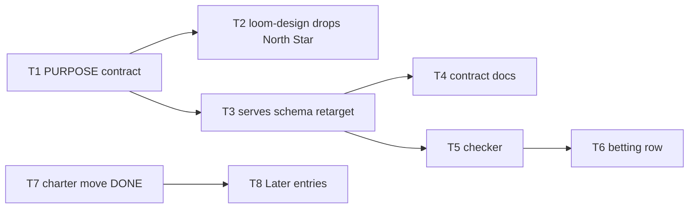

# Plan: purpose layer + serves link

Source brief: docs/loom/specs/2026-08-20-north-star-serves-link.md
Goal: 給長期目的一個自己的檔案，讓每次押注都必須連回它，沒有它就提醒你補
Stage: finishing
Total tasks: 9
Critical-path depth: 4 (≤5)
Execution order: parallel-where-possible
Plan-document-reviewer verdict: PASS (2026-08-20, round 3)

## Task-flow diagram

## Open Questions

N/A — no unresolved question: the brief's three open questions were all resolved by the user on 2026-08-20 and are recorded [RESOLVED] there.

## Task 1 — PURPOSE.md 的格式契約與 scaffold

- **Description**: Define the `PURPOSE.md` artifact and make `loom_init.py` scaffold it.
  - Two fields only: `**Why:**` one sentence on why the product exists, and `**Done when:**` one checkable condition meaning it is met.
  - `Done when:` is deliberately not `Success:` — the grammar forces a condition rather than an aspiration, and it names something reachable, which is what makes renewal necessary.
  - Ship a template at `loom-code/scripts/templates/PURPOSE.md` and instantiate it from `loom_init.py` alongside the existing `DIRECTION.md` and `backlog-README.md` instantiations.
  - The template's body must be a prompt to the author, never pre-filled prose that would pass a later check while saying nothing.
- **Module**: loom-code/scripts/templates
- **Files touched**: loom-code/scripts/templates/PURPOSE.md, loom-code/scripts/loom_init.py, loom-code/scripts/test_loom_init.py
- **Context paths**:
  - loom-code/scripts/loom_init.py
  - loom-code/scripts/templates/DIRECTION.md
  - loom-code/scripts/test_loom_init.py
- **Acceptance**:
  - RED: a test asserting `loom_init.py` on a bare tmp_path repo creates `docs/loom/PURPOSE.md` carrying both `**Why:**` and `**Done when:**`.
    - The same test asserts the scaffolded file contains no pre-filled purpose prose — only the prompt.
  - GREEN: that test passes and the existing `test_loom_init.py` suite stays green.
- **Dependencies**: none
- **Independent**: false
- **Brief item covered**: "A `PURPOSE.md` artifact: one line of why the product exists (`Why:`) and one checkable condition that means it is met (`Done when:`)"
- **Status**: done(pending)
- **Gloss**: 新增一份兩行的檔案，回答「這個專案為了什麼」

## Task 2 — loom-design 交出 North Star

- **Description**: Remove `## North Star` from loom-design's PRINCIPLES.md contract; PRINCIPLES.md keeps only principles.
  - `validate_principles_output.py`: drop the `_NORTH_STAR` requirement and its error messages; the file's valid-iff list loses invariant 1.
  - `principles-rules.md`: delete the `## Required section — ## North Star` section and its format block; point readers at `PURPOSE.md` instead.
  - `product-principles/SKILL.md`: the authoring contract stops instructing a `## North Star` section; its description and body drop the term.
  - Do NOT edit any repo's actual `PRINCIPLES.md` — kumiko's migration happens in that repo, per the brief's Out of Scope.
- **Module**: loom-design/skills/product-principles
- **Files touched**: loom-design/scripts/principles/validate_principles_output.py, loom-design/skills/product-principles/references/principles-rules.md, loom-design/skills/product-principles/references/canon-product.md, loom-design/skills/product-principles/references/question-sets.md, loom-design/skills/product-principles/SKILL.md, loom-design/README-product-principles.md, loom-design/scripts/principles/test_product_principles_skill.py, loom-design/scripts/principles/test_validate_principles_output.py, loom-design/scripts/principles/test_principles_rules_sections.py
- **Context paths**:
  - loom-design/scripts/principles/validate_principles_output.py
  - loom-design/skills/product-principles/references/principles-rules.md
  - loom-design/skills/product-principles/SKILL.md
- **Acceptance**:
  - RED: a test asserting a PRINCIPLES.md with NO `## North Star` section validates clean, and that none of the three files instructs writing one.
    - Existing tests that pin `## North Star` must be retired in the same task, not left asserting a retired rule. `test_principles_rules_sections.py:55` is one such pin — confirmed live.
  - GREEN: that test passes and the full `loom-design/scripts/` suite stays green.
- **Dependencies**: Task 1 completes first
- **Independent**: false
- **Brief item covered**: "`## North Star` moves OUT of loom-design's `PRINCIPLES.md` contract. PRINCIPLES.md keeps only product / design / engineering principles."
- **Status**: done(pending)
- **Gloss**: PRINCIPLES.md 淨化成純原則，不再兼差裝目的

## Task 3 — serves 驗證改探測 PURPOSE.md

- **Description**: Retarget the already-committed `serves:` validation from `PRINCIPLES.md` to `PURPOSE.md`.
  - `1fe7b2c1` shipped `_principles_path_for`, which probes `store.parent / "PRINCIPLES.md"`. Rename and repoint it at `PURPOSE.md`.
  - Reproduced live before this change: running the committed validator against kumiko's store returns FAIL on both COMMITTED-NEXT entries. That is the defect this task closes.
  - The grammar, the COMMITTED-NEXT condition, and the field registration are unchanged — only the probed filename moves.
- **Module**: loom-code/scripts/backlog_index.py
- **Files touched**: loom-code/scripts/backlog_index.py, loom-code/scripts/test_backlog_index.py
- **Context paths**:
  - loom-code/scripts/backlog_index.py
  - loom-code/scripts/test_backlog_index.py
- **Acceptance**:
  - RED: the existing exemption test is retargeted so a COMMITTED-NEXT entry with no `serves` validates clean when the repo has no `PURPOSE.md`, and is REJECTED when it has one.
    - A second assertion: the presence of `PRINCIPLES.md` alone no longer makes the requirement fire.
  - GREEN: both pass and the `test_backlog_index.py` suite stays green.
- **Dependencies**: Task 1 completes first
- **Independent**: false
- **Brief item covered**: "Backlog entries gain a `serves:` frontmatter field, REQUIRED when `status: COMMITTED-NEXT`"
- **Status**: done(pending)
- **Gloss**: 已提交的檢查改看新檔案，否則會打壞 kumiko

## Task 4 — 契約文件改寫條件

- **Description**: Update the `serves:` contract text already written into both backlog READMEs so it names `PURPOSE.md`.
  - The two files are `docs/loom/backlog/README.md` and `loom-code/scripts/templates/backlog-README.md`.
  - State that the field is required when `status: COMMITTED-NEXT`, and that a repo with no `docs/loom/PURPOSE.md` is PROMPTED for one at betting rather than silently exempt.
  - Do not restate the status vocabulary.
- **Module**: docs (backlog contract)
- **Files touched**: loom-code/scripts/templates/backlog-README.md, docs/loom/backlog/README.md, loom-code/scripts/test_loom_init.py
- **Context paths**:
  - docs/loom/backlog/README.md
  - loom-code/scripts/templates/backlog-README.md
  - loom-code/scripts/backlog_index.py
- **Acceptance**:
  - RED: the existing `test_backlog_readmes_document_serves_contract` is extended to assert both files name `PURPOSE.md` and neither names `PRINCIPLES.md` in the serves contract.
  - GREEN: that test passes.
- **Dependencies**: Task 3 completes first
- **Independent**: false
- **Brief item covered**: "Backlog entries gain a `serves:` frontmatter field, REQUIRED when `status: COMMITTED-NEXT`"
- **Status**: done(pending)
- **Gloss**: 契約文件跟著改指新檔案

## Task 5 — 檢查器改讀 PURPOSE.md，缺檔改成提示

- **Description**: Retarget `check_north_star_link.py` at `PURPOSE.md` and change its absent-file behaviour from silent exemption to a prompt.
  - The script exists on disk from the previous wave; it currently reads `PRINCIPLES.md` `## North Star`.
  - Read the whole `PURPOSE.md` body as opaque text. It MUST NOT parse for `**Why:**`, `**Done when:**`, `**Goal:**`, or `**Success:**` — no label in that file is mechanically enforced.
  - Absent `PURPOSE.md` is no longer exit 0 N/A. It becomes exit 2 with a question asking the user to write one, per the brief's foundational-artifact decision.
  - Exit 1 stays reserved for an unreadable or absent store path.
- **Module**: loom-code/scripts/check_north_star_link.py
- **Files touched**: loom-code/scripts/check_north_star_link.py, loom-code/scripts/test_check_north_star_link.py
- **Context paths**:
  - loom-code/scripts/check_north_star_link.py
  - loom-code/scripts/check_onramp_choice.py
  - loom-code/scripts/backlog_index.py
- **Acceptance**:
  - RED: four assertions on tmp_path fixtures.
    - exit 0 when every COMMITTED-NEXT entry is well-formed and `PURPOSE.md` exists.
    - exit 2 naming the offending entry when one lacks a well-formed `serves:` line.
    - exit 2 asking for a `PURPOSE.md` when the file is absent but COMMITTED-NEXT entries exist.
    - exit 1 on a missing store path.
    - A source assertion that none of the four bold labels appears as a literal.
  - GREEN: all pass.
- **Dependencies**: Task 3 completes first
- **Independent**: false
- **Brief item covered**: "`loom-code/scripts/check_north_star_link.py` — exit 0 resolved, exit 1 unreadable path, exit 2 prints the question and STOPs to ask"
- **Status**: done(pending)
- **Gloss**: 押注時真正跑的檢查；沒有 PURPOSE.md 會叫你補，不會放行

## Task 6 — 押注提示先唸 PURPOSE，押完跑檢查

- **Description**: Extend the Backlog-close check row in `finishing-a-development-branch/SKILL.md` with the purpose duty.
  - BEFORE listing betting candidates, print `docs/loom/PURPOSE.md` verbatim so the user decides against it rather than from memory.
  - When `PURPOSE.md` is absent, say so loudly and offer to write one — never silently omit the print.
  - AFTER the user promotes an entry, run `check_north_star_link.py`. Treat exit 2 as STOP-and-ask: relay the printed question, wait, record the answer in the entry's `serves:` line, re-run.
  - Write this as its own paragraph, never spliced into the existing row's sentences, which carry pins.
- **Module**: loom-code/skills/finishing-a-development-branch
- **Files touched**: loom-code/skills/finishing-a-development-branch/SKILL.md, loom-code/scripts/test_finishing_purpose_row.py
- **Context paths**:
  - loom-code/skills/finishing-a-development-branch/SKILL.md
  - loom-code/scripts/check_north_star_link.py
  - loom-code/scripts/test_writing_plans_queue_gate.py
- **Acceptance**:
  - RED: a test modelled on `test_writing_plans_queue_gate.py` asserting four conditions on the SKILL.md text.
    - It names `check_north_star_link.py`.
    - It binds each of exits 0 / 1 / 2 to its meaning in its own clause, and the exit-0 clause does not contain the word for its opposite.
    - It states the print-before-listing duty and the absent-file prompt duty.
    - It states the exit-2 stop / relay / wait / record / re-run duty.
  - GREEN: that test passes.
- **Dependencies**: Task 5 completes first
- **Independent**: false
- **Brief item covered**: "The betting prompt prints `PURPOSE.md` before listing candidates, then runs the checker. When `PURPOSE.md` is ABSENT it prompts for one"
- **Status**: done(pending)
- **Gloss**: 押注時你會先看到目的，缺了會被叫去補

## Task 7 — 憲章搬家

- **Description**: Move the 18-line Charter block out of DIRECTION.md and its template into `loom-code/hooks/family-reception.md`. SHIPPED on this branch; retained for the ledger.
  - Six rules moved verbatim; `ROADMAP.md` pointers retargeted across five plugins; two backlog READMEs' false SSOT claim corrected.
  - The moved rule 1 had its missing `--direction-write` path argument restored — the two pre-move copies disagreed and the defective one had been moved.
- **Module**: loom-code/hooks/family-reception.md
- **Files touched**: docs/loom/DIRECTION.md, loom-code/scripts/templates/DIRECTION.md, loom-code/hooks/family-reception.md, loom-code/ROADMAP.md, investing-toolkit/ROADMAP.md, legal-toolkit/ROADMAP.md, philosophers-toolkit/ROADMAP.md, systems-thinking-toolkit/ROADMAP.md, docs/loom/backlog/README.md, loom-code/scripts/templates/backlog-README.md, loom-code/scripts/test_loom_init.py
- **Context paths**:
  - docs/loom/DIRECTION.md
  - loom-code/hooks/family-reception.md
- **Acceptance**:
  - RED: each charter rule appears in `family-reception.md` and in NEITHER `docs/loom/DIRECTION.md` nor the template.
  - GREEN: passes; `--direction-check` exits 0 against the shortened file.
- **Dependencies**: none
- **Independent**: false
- **Brief item covered**: "The 18-line charter header moves to `loom-code/hooks/family-reception.md` (SHIPPED on this branch)"
- **Status**: done(pending)
- **Gloss**: 讀者不必再滑過 18 行「關於這個檔案的規則」

## Task 8 — Later 三條轉成 backlog 條目

- **Description**: Convert DIRECTION.md's three `## Later` lines into OPEN backlog entries, then remove the section.
  - The three lines are 投資線營運指標敘事層, loom 機制 Codex 移植線, and obsidian wiki 知識線深化.
  - Each becomes one `status: OPEN` entry carrying `name` / `description` / `status` / `origin` / `start` per the store contract.
  - Remove `## Later` from `docs/loom/DIRECTION.md` and from the loom-init template, then regenerate with `backlog_index.py --write`.
  - `## Now`, `## Next` and `## On-ramp standing choices` are untouched — all three are machine-read contracts.
- **Module**: docs/loom/backlog
- **Files touched**: docs/loom/DIRECTION.md, loom-code/scripts/templates/DIRECTION.md, docs/loom/BACKLOG.md, docs/loom/backlog/
- **Context paths**:
  - docs/loom/DIRECTION.md
  - docs/loom/backlog/README.md
- **Acceptance**:
  - RED: a test asserting `docs/loom/DIRECTION.md` has no `## Later` heading while the other three sections remain.
    - The same test asserts three OPEN entries exist whose descriptions carry the three lane themes.
  - GREEN: passes and `backlog_index.py --validate` exits 0.
- **Dependencies**: Task 7 completes first
- **Independent**: false
- **Brief item covered**: "`## Later`'s three entries become backlog entries and the section is removed"
- **Status**: done(pending)
- **Gloss**: 那三條從散文變成能被 --ready 撈到、能被押注的條目

## Task 9 — 兄弟 skill 改指 PURPOSE.md

- **Description**: Retarget the four loom-design skills that derive from or check against the North Star so they name `PURPOSE.md`.
  - Confirmed live: `using-loom-design/SKILL.md`, `design-system/SKILL.md`, `design-system/references/design-md-schema.md`, and `completeness-critic/SKILL.md` all instruct reading "the North Star" from PRINCIPLES.md.
  - This is a distinct assertion from Task 2: that task RETIRES the section from the authoring contract; this one REPOINTS the consumers at its new home. Splitting them keeps each to one failing test.
  - Do not change what any skill does with the purpose — only where it reads it from.
- **Module**: loom-design/skills
- **Files touched**: loom-design/skills/using-loom-design/SKILL.md, loom-design/skills/design-system/SKILL.md, loom-design/skills/design-system/references/design-md-schema.md, loom-design/skills/completeness-critic/SKILL.md
- **Context paths**:
  - loom-design/skills/using-loom-design/SKILL.md
  - loom-design/skills/design-system/SKILL.md
  - loom-design/skills/completeness-critic/SKILL.md
- **Acceptance**:
  - RED: a test asserting no loom-design skill instructs reading a North Star section out of `PRINCIPLES.md`, and that each of the four files names `PURPOSE.md` instead.
  - GREEN: that test passes and the full `loom-design/scripts/` suite stays green.
- **Dependencies**: Task 2 completes first
- **Independent**: false
- **Brief item covered**: "`## North Star` moves OUT of loom-design's `PRINCIPLES.md` contract. PRINCIPLES.md keeps only product / design / engineering principles."
- **Status**: done(pending)
- **Gloss**: 四個下游 skill 改去新檔案讀目的

## Notes

- Leg C（T1-T2）是新增的一腿：`PURPOSE.md` 的層與 loom-design 的交接。Leg A 現在依賴它。
- 已提交的 `1fe7b2c1` 目前會讓 kumiko 的 store 驗不過，T3 是修這件事，出貨前必須完成。
- T7/T8 都動 `docs/loom/DIRECTION.md` 與同一份模板，必須循序。
- Kickoff decision: `serves:` 只在押注時問，不加 commit 閘門（brief OQ-1）。
- 監看條件（brief 的 conditional reversal）：若多數押注只能寫 `serves: unrelated`，該撤掉這個機制而非收緊它。這是未來的觸發條件，不是本弧的任務。
- Kickoff decision: 強制的是「必須回答」，不是「必須有內容」——空 repo 不擋（brief OQ-3）。
