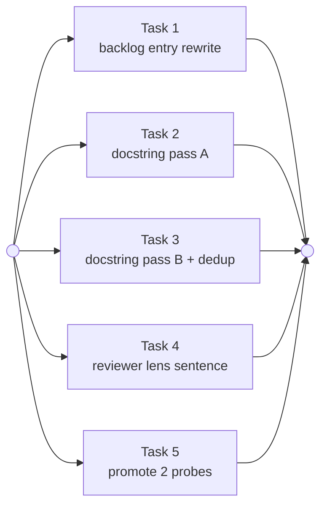

# Plan: code-as-spec writing rule

Source brief: docs/loom/specs/2026-08-21-code-as-spec-writing-rule.md
Goal: 四份工件改成「散文只寫程式碼顯示不了的東西」，並把 oracle 的兩個能力宣稱從會消失的暫存檔升級成常設測試
Stage: finishing
Total tasks: 7
Critical-path depth: 2 (≤5)
Execution order: parallel-where-possible
Plan-document-reviewer verdict: PASS (2026-08-21, round 4 + delta-confirmed) — Tasks 6 and 7 added during execution; their review is folded into the whole-branch review, see Notes

## Task-flow diagram

All five tasks sit at one dependency level: their `Files touched` are pairwise
disjoint, and no task reads a symbol, string, or claim another task writes.
The one shared constant — the new test file's path — is pinned by this plan in
both Task 1 and Task 5 rather than discovered by either, so neither waits on
the other.

## Open Questions

N/A — no unresolved question: the three forks this arc reached were each put to kouko and answered before planning started (promote two probes not four; state the reviewer-lens coverage gap and file it as debt rather than close it; fix the prose duplications in this PR).

## Notes

- **Every RED anchor in this plan was executed against the working tree before
  it was written down.** The first draft of this plan transcribed sentences a
  survey agent had quoted, and four of six RED claims were false — the quoted
  sentences wrap across physical lines, and `grep` is line-oriented. The
  anchors below are the phrases that actually occupy one line, with the counts
  the commands actually returned. This is the defect class the arc is about,
  and it was committed inside the plan about it, which is why it is recorded
  here rather than quietly fixed.
- **Round-1 PASS was amended, so this plan re-reviews.** The round-1 reviewer
  flagged one genuinely ambiguous sentence class — an interface-contract
  sentence a caller relies on, which is also derivable from the body — and
  noted two fresh-context implementers could split on it. Tasks 2 and 3 now
  carry Ousterhout's interface-versus-implementation line plus a worked pair
  verified in the tree. That is a scope change to two tasks, not one of the
  three amendment kinds that skip re-review.
- **Round-2 PASS was amended once more, so this plan re-reviews again.** Round 2
  named a residual shape the interface/implementation split does not decide: one
  sentence carrying both a caller-facing guarantee and the mechanism delivering
  it. Tasks 2 and 3 now say to split such a sentence rather than pick a side,
  with a worked case verified in the tree. Picking a side would have been wrong
  either way, which is why this was worth a round rather than a note.
- **A fresh-eyes pass after round 3 found two task-breaking facts and one
  brief/plan contradiction, so this plan re-reviews once more — delta only.**
  (a) Task 4's implied site, Rule 9, sits inside a `distribute.py`-managed
  region that CI byte-compares; the task now pins the hand-authored Role
  contract list and forbids a new dimension. (b) Task 5's "run the oracle on a
  `tmp_path` copy" could never fail — the oracle's ledger test resolves a repo
  path that a copied tree lacks; the task now asserts in-process on the AST
  leg's own expression, and names the two by-design survivors. (c) The brief's
  BI-7 still claimed a duplication the plan had downgraded; BI-7 is retired,
  BI-8 carries only the verified one. None of these were findable by reading
  the plan alone — each came from opening the file the plan pointed at.
  Round 4 then caught a false reason INSIDE this amendment: "a new
  `dimension_scores` key breaks the push gate" — the gate checks only that
  the block exists (`loom_gate_markers.py:872-873`). The instruction stood;
  the reason was rewritten to the true one. Same defect class, fourth
  occurrence in this arc's own planning artifacts.
- **Task 6 was added during execution, and its re-review is folded into the
  whole-branch review rather than a fifth plan round.** Task 5's mutation run
  discovered a coverage gap nobody knew about — `leaky_scopes` analyses one
  file at a time, so a guard around a helper that delegates its read to an
  imported module is invisible to it. The test asserts the gap rather than
  papering over it, which under this repo's own convention obliges a filed
  entry the test can name. That is Task 6. The plan's own amendment rule would
  send this back to the plan-document-reviewer; the whole-branch reviewer sees
  the same artifacts with more context, so the round is spent there instead.
  Recorded here because a skipped review is a silent gap unless it is named.
- **Two implementers hit the same rule gap independently, on different files.**
  Deleting a docstring's summary sentence left the surviving qualifier
  dangling with no antecedent — "Archived entries are never returned:" with
  nothing establishing what is returned. The rule said what to delete and
  never said the remainder must still stand alone. Four plan-review rounds
  missed it because all four asked whether the rule was decidable, not whether
  applying it left readable prose. Both sites are fixed; the rule text below
  and the reviewer lens Task 4 ships both need the missing clause, which is
  Task 7.
- **Round 3 PASSed and amending stopped there, deliberately.** Round 3 raised a
  wording polish — say "the mechanism clause(s), wherever they fall" rather than
  "split it", since a mechanism clause can sit between two guarantee clauses.
  Its own three-sentence test decided every case under the current wording,
  including that sandwiched one. Three rounds each adding a carve-out to the
  previous round's carve-out is the signal a rule has converged, not the signal
  to keep polishing; the caution travels in the implementer dispatch packet
  instead, where it is read, and the plan stops here.
- **One claimed duplication did not survive verification.** The oracle's
  `_FS_CALLS` rationale IS carried twice (`fail-OPEN` appears on two lines).
  The second claim — that the module docstring's contract is restated in the
  assert messages — is not a duplication: the docstring states a contract for
  a reader, the asserts carry operator-facing failure messages. Task 3 treats
  it as a judgment item to resolve and justify, not a mandated deletion.
- **Shared constant, pinned here, not discovered by an implementer**: the
  promoted tests live at `loom-code/scripts/test_oracle_capability_claims.py`.
  Task 5 creates it; Task 1 cites it by path with no line number. Neither task
  may rename it.
- **Fresh-context requirement on Tasks 2 and 3** (from
  `docs/loom/memory/prose-shipped-with-a-mechanism-describes-the-road-not-taken.md`):
  each must be dispatched to an implementer that has NOT held this arc's design
  intent in working memory, and must judge each sentence against the finished
  code it sits on — never against remembered intent.
- **Stale premise to correct, not carry**
  (`docs/loom/plans/2026-08-21-dissolve-direction-layer.md` DL-32 vs DL-35):
  DL-32's "18 mutants / 0 survivors" was superseded by DL-35's "21 mutants /
  2 survivors, both survivors being tuple handlers where `FileNotFoundError`
  still catches". Task 5 must recompute rather than transcribe either number.

## Task 1 — 改寫已過時的 backlog 條目

- Description: Rewrite the superseded backlog entry so its recommendation matches what was actually decided, rename the file to a slug naming the rule rather than the dropped checkers, and regenerate the index.
  - Checker 1 (a load-bearing superlative must carry a pin) is DROPPED — record the reason: judgment-type, high false-positive rate, and the historical measurement found superlatives are not a dominant sub-kind, so its 4/8 back-test over-fitted.
  - Checker 2 (an existence claim must be a resolvable path) is DEMOTED to "extend `loom-code/scripts/check_doc_citations.py`", and stays filed rather than built.
  - The code-as-spec writing rule replaces both as the entry's recommendation, in the Ousterhout formulation the brief's `## Decision` states.
  - The `start:` condition becomes the deferred A/B on `writing-plans`'s queue-gate paragraph.
  - Cite `loom-code/scripts/test_oracle_capability_claims.py` by path with no line number as where the oracle's claims are now pinned.
  - Point at the full alternatives comparison rather than restating it: one line naming `docs/loom/specs/2026-08-21-code-as-spec-writing-rule.md` by path, no line number. This is the entry's own demoted Checker 2 applied to itself — an existence claim written as a path a checker can resolve.
  - Add no Mermaid. The comparison it would draw is already a table in the brief, which is where this repo's visual routing sends option comparisons.
- Module: docs/loom/backlog
- Files touched: docs/loom/backlog/2026-08-21-checkers-for-load-bearing-superlatives-and-existence-claims.md, docs/loom/backlog/2026-08-21-code-as-spec-writing-rule-and-its-deferred-ab.md, docs/loom/BACKLOG.md
- Context paths:
  - docs/loom/backlog/README.md
  - docs/loom/backlog/2026-08-21-checkers-for-load-bearing-superlatives-and-existence-claims.md
  - docs/loom/specs/2026-08-21-code-as-spec-writing-rule.md
  - loom-code/scripts/check_doc_citations.py
- Acceptance:
  - RED: `grep -rq 'a load-bearing superlative needs a pin' docs/loom/backlog/` exits 0 today (verified) and must exit 1 when done.
  - RED: `python3 loom-code/scripts/backlog_index.py --check --store docs/loom/backlog` exits 1 while the renamed entry and the generated index disagree.
  - GREEN: `backlog_index.py --validate` and `--check` both exit 0 against `docs/loom/backlog`.
  - GREEN: the new entry's frontmatter carries `name` identical to its filename stem, `status: open`, and a `start:` naming the A/B.
  - GREEN: the body states no count it has not enumerated — direction, not magnitude.
- External surfaces: N/A — repo-internal markdown plus an existing repo script.
- Dependencies: none
- Independent: true
- Brief item covered: BI-1, BI-6
- Status: done(7c8dbf6f)
- Gloss: 讓那筆條目停止說謊——它現在還寫著要蓋一個已經被判死的檢查器。

## Task 2 — docstring 逐句分類（第一組三個腳本）

- Description: Apply the writing rule to the docstrings and comments of three scripts, changing no executable line.
  - DELETE every sentence restating what the code shows: structure, counts, branch enumerations, call-site paraphrases, one-line restatements of the `if` directly below.
  - KEEP every sentence stating intent, an invariant, a stated bound, a trade-off, a rejected alternative, or a cross-file design reason.
  - Judge each sentence against the finished code it sits on. Do not judge against design intent recalled from anywhere else.
  - A sentence naming what a check does NOT catch is a bound, not a restatement — keep it.
  - The split runs along interface versus implementation, NOT along derivability. Derivable-from-the-body is not by itself a reason to delete.
  - INTERFACE — what a CALLER needs to use the thing: a parameter default, an accepted value range, what it raises, what it returns on empty input. KEEP, even when a reader could recover it from the body.
  - IMPLEMENTATION — how the body reaches that result: its branches, its loop, its call sequence, its counts. DELETE when the code shows it.
  - When ONE sentence carries both — a guarantee a caller relies on, plus the mechanism that delivers it — do not pick a side. Split it: keep the guarantee, drop the mechanism clause.
  - Worked case for that split, verified in the tree: `check_onramp_choice.py:93-95` says continuation lines are joined in before the grammar is applied, then points at `_join_blockquote_continuation`.
  - Keep that a multi-line value is not silently truncated; drop the pointer at the helper. That file belongs to Task 3 — quoted here as the shared example, not to be touched by this task.
  - Worked pair, verified in the tree, so the line is not left to taste. KEEP `backlog_index.py:6-8` — the `--store` default and the fact it covers the live tier and its `archive/` subdirectory; a caller passing no store needs it.
  - REWRITE `live_entries`'s first paragraph rather than deleting it. Its mechanism half restates the list comprehension below and goes; its interface half stays.
  - The interface half is the returned display name — the frontmatter `name`, falling back to the filename stem — in a deterministic order. That is what a caller gets.
  - This bullet said DELETE in the version the implementers executed, and both deleted the whole paragraph faithfully. Two whole-branch reviewers caught the loss. A worked example that says DELETE where the rule says KEEP beats the rule; the example is the operative instruction.
  - KEEP the archive-override rationale and the `Raises` note that follow: the first is a reason, the second is interface.
  - ADD, where deleting a restatement leaves a docstring with no reason at all: the reason, the goal, the expected effect, and how the implementation choice was made.
  - Every added sentence must come from a record — a Decision Log entry in `docs/loom/plans/`, a file in `docs/loom/memory/`, or a commit message reachable by `git log -S` on the code it describes. Cite the source in the report.
  - When no record carries the reason, write NOTHING and list that docstring in the report as an unsourced gap. Inventing a plausible rationale is the exact defect this arc exists to stop, and is worse here than silence.
- Module: loom-code/scripts (prose only)
- Files touched: loom-code/scripts/backlog_index.py, loom-code/scripts/check_queue_relation.py, loom-code/scripts/check_north_star_link.py
- Context paths:
  - loom-code/scripts/test_gate_scripts_fail_loud_on_unreadable_input.py
  - docs/loom/specs/2026-08-21-code-as-spec-writing-rule.md
- Acceptance:
  - RED: `grep -c '"""(i) filename stem == frontmatter name."""' loom-code/scripts/backlog_index.py` returns 1 today (verified) and must return 0.
  - RED: `grep -c 'every live (non-archived)' loom-code/scripts/check_queue_relation.py` returns 1 today (verified) and must return 0.
  - GREEN: `python3 -m pytest loom-code/scripts/ scripts/ .claude/hooks/ -q` passes with a count no lower than 1790.
  - GREEN: `git diff -U0` over the three files shows no changed line outside a docstring or comment.
  - GREEN: the report lists every deleted sentence and, for each, the code fact it restated.
  - GREEN: the report lists every added sentence with the record it came from, and every docstring deliberately left without a reason because no record carried one.
- External surfaces: N/A — pure internal prose.
- Dependencies: none
- Independent: true
- Brief item covered: BI-2
- Status: done(59ba54eb)
- Gloss: 三個腳本的註解只留程式碼講不出來的話；不動任何一行會執行的程式碼。

## Task 3 — docstring 逐句分類（第二組三個腳本）＋一處已驗證的重複

- Description: Apply the same writing rule, under the same fresh-read discipline and the same no-executable-change constraint, to three further scripts.
  - Remove the verified duplication: the `_FS_CALLS` rationale about `is_file`/`is_dir`/`exists` and the unreadable PARENT is carried twice — once above the `frozenset`, once inside it. Keep one copy, at the site a reader meets first.
  - Resolve one judgment item and justify the outcome either way in the report: whether the module docstring's stated contract is redundant against the three assert messages that encode it, or whether the two serve different readers.
  - KEEP `leaky_scopes`'s "What this DOES and does NOT catch" section and the `EXEMPT_LEAK_COUNT` pinning rationale — both are bounds, and both are the worked example this whole rule was derived from.
  - Use Task 2's interface-versus-implementation split verbatim, including its worked pair. Both tasks must classify the same kind of sentence the same way.
  - INTERFACE (parameter default, accepted range, what it raises, what it returns on empty input) is KEEP even when derivable; how the body gets there is DELETE when the code shows it.
  - A sentence carrying both a caller-facing guarantee and the mechanism delivering it is split, not sided: keep the guarantee, drop the mechanism clause.
  - ADD, where deleting a restatement leaves a docstring with no reason at all: the reason, the goal, the expected effect, and how the implementation choice was made — under the same sourcing rule as Task 2.
  - Every added sentence must come from a record (`docs/loom/plans/` Decision Log, `docs/loom/memory/`, or a commit reachable by `git log -S`), cited in the report. No record → write nothing and list the gap. Do not invent.
- Module: loom-code/scripts (prose only)
- Files touched: loom-code/scripts/check_onramp_choice.py, loom-code/scripts/archive_change_folder.py, loom-code/scripts/test_gate_scripts_fail_loud_on_unreadable_input.py
- Context paths:
  - docs/loom/specs/2026-08-21-code-as-spec-writing-rule.md
- Acceptance:
  - RED: `grep -c 'fail-OPEN' loom-code/scripts/test_gate_scripts_fail_loud_on_unreadable_input.py` returns 2 today (verified) and must return 1.
  - RED: `grep -q 'Path-safety guard (OpenSpec #412 bug class), shared by both units: an' loom-code/scripts/archive_change_folder.py` exits 0 today (verified) and must exit 1.
  - GREEN: `python3 -m pytest loom-code/scripts/ scripts/ .claude/hooks/ -q` passes with a count no lower than 1790.
  - GREEN: `git diff -U0` over the three files shows no changed line outside a docstring, comment, or assert message.
  - GREEN: `grep -q 'What this DOES and does NOT catch' loom-code/scripts/test_gate_scripts_fail_loud_on_unreadable_input.py` still exits 0.
  - GREEN: the report lists every added sentence with the record it came from, every unsourced gap left blank, and the judgment call's outcome with its reasoning.
- External surfaces: N/A — pure internal prose.
- Dependencies: none
- Independent: true
- Brief item covered: BI-2, BI-8
- Status: done(55672f02)
- Gloss: 另外三個腳本同樣處理，並清掉 oracle 裡確實寫了兩次的那段理由。

## Task 4 — reviewer 加一句審查透鏡，並寫明它管不到哪裡

- Description: Add one reviewer-lens sentence to the branch reviewer's prompt, and state its coverage limit in the same edit.
  - The lens: for every changed sentence describing a mechanism, ask whether the code can show it; when it can, flag the sentence for deletion.
  - The limit, stated adjacent to the lens: it binds contract-class `.md` (skills, agents) and script docstrings — it does not reach generated records such as backlog entries and plans.
  - Match the voice of the surrounding rule text. Add no new heading, and rename none.
  - Site: the hand-authored `## Role contract — behavioral rules` numbered list, as its next item. Nowhere else.
  - Three regions of this file are machine-managed: everything between a `<!-- BEGIN … managed by loom-code/scripts/distribute.py -->` marker and its `<!-- END … -->`. Rule 9 sits inside one of them.
  - Touch none of those regions. An edit there fails `verify-drift.py` in CI, or is overwritten on the next distribute.
  - Not a new dimension: do not add a row to the `### Dimensions` table or a key to `dimension_scores`. The push gate checks only that the block exists, not its keys — a new key would ship silently as a schema change no consumer was told about. A behavioural rule is the right shape.
- Module: loom-code/agents
- Files touched: loom-code/agents/code-reviewer.md
- Context paths:
  - loom-code/agents/code-reviewer.md
  - docs/loom/memory/a-docs-reviewer-dimension-sentence-gates-templates-not-generated-instances.md
  - docs/loom/specs/2026-08-21-code-as-spec-writing-rule.md
- Acceptance:
  - RED: `grep -q 'can the code show this' loom-code/agents/code-reviewer.md` exits 1 today (verified) and must exit 0.
  - GREEN: the coverage-limit statement sits adjacent to the lens sentence, naming generated records as out of reach.
  - GREEN: `git diff --stat` shows `loom-code/agents/code-reviewer.md` as the only file this task changed.
  - GREEN: `git diff` adds no line beginning with `#`.
  - GREEN: `python3 loom-code/scripts/verify-drift.py` exits 0 after the edit — the managed regions are byte-identical to their sources.
  - GREEN: every added line falls between the `## Role contract — behavioral rules` heading and the first `<!-- BEGIN` marker.
- External surfaces: N/A — agent prompt prose.
- Dependencies: none
- Independent: true
- Brief item covered: BI-3, BI-5
- Status: done(69ba7e9a)
- Gloss: 給下一輪審查一個透鏡，同時誠實標註它的覆蓋邊界，不讓它被當成全面防護。

## Task 5 — 把兩個探針升級成常設測試

- Description: Create a test file asserting the two capability claims the oracle makes about itself, replacing two probes that live only in an ephemeral scratchpad.
  - Claim A: no mutant of a filesystem-guard handler in the FAMILY survives an oracle run.
  - Claim B: every known escape shape is caught — bare `path.open()`, class-method read, plain from-import, aliased from-import, aliased module import, `os.path` from-import.
  - Both tests invoke the oracle's own production symbol IN-PROCESS: import `leaky_scopes` and `_MODULE_SCOPE` from the oracle module and assert on `leaky_scopes(source) & {"main", _MODULE_SCOPE}` — the exact expression the oracle's AST leg asserts.
  - Never a re-implementation of that expression, and never the oracle file run as a subprocess.
  - Why not a subprocess on a `tmp_path` copy, stated so nobody re-tries it: the oracle's ledger test resolves `docs/loom/backlog/…` relative to its own parent directories, and a copied tree lacks that path.
  - So under a copy the oracle exits non-zero for every input, and every mutant reads as killed whether or not it was detected. That is a test that cannot fail.
  - Mutate SOURCE TEXT in memory, read once from the real file; write nothing under `loom-code/scripts/`, not even transiently.
  - Expected survivor set, asserted rather than "fixed": the two tuple handlers `except (subprocess.CalledProcessError, FileNotFoundError, OSError)` in `check_onramp_choice.py` and `check_queue_relation.py`.
  - They guard a `subprocess.run` call, not a filesystem call, so the oracle has no jurisdiction over them and their mutants survive by design. Assert that exact set with that reason; a third survivor is a finding.
  - The oracle's classification leg skips `test_*` files, so this new module needs no `EXEMPT` entry — do not edit the oracle.
  - Extend mutation discovery past the bare `except OSError` form so tuple handlers are covered; where a mutant legitimately survives, assert the survivor SET explicitly, never a total.
  - Do not depend on the anchor string `def find_offending_entry(` the source probe spliced against; synthesize each escape shape as its own file under `tmp_path`.
- Module: loom-code/scripts
- Files touched: loom-code/scripts/test_oracle_capability_claims.py
- Context paths:
  - loom-code/scripts/test_gate_scripts_fail_loud_on_unreadable_input.py
  - /private/tmp/claude-501/-Users-kouko-GitHub-monkey-skills/49436ab7-96bb-4604-9ed5-d58c897265f8/scratchpad/probes-backup/mutate.py
  - /private/tmp/claude-501/-Users-kouko-GitHub-monkey-skills/49436ab7-96bb-4604-9ed5-d58c897265f8/scratchpad/probes-backup/inject.py
  - docs/loom/memory/a-mutation-test-must-run-the-production-assertion.md
  - docs/loom/memory/a-no-mutation-test-cannot-baseline-off-shared-fixture-state.md
- Acceptance:
  - RED: load a scratch copy of the oracle module (under `tmp_path`, via `importlib`) with its import-alias resolution removed — the escape-shape test must go red against it. Record the command and its output.
  - RED: make the mutation test's kill predicate always-true in a scratch copy of the new test — it must go green on a known-unguarded input where the real predicate goes red; that proves the predicate is load-bearing. Record the command and its output.
  - GREEN: `python3 -m pytest loom-code/scripts/test_oracle_capability_claims.py -q` passes.
  - GREEN: the same tests pass inside a full `python3 -m pytest loom-code/scripts/ scripts/ .claude/hooks/ -q` run, proving no order dependence.
  - GREEN: `git status --short` shows no modification under `loom-code/scripts/` other than the new file, after the suite has run.
- External surfaces: `[FRAGILE]` The source probes spliced text into `check_north_star_link.py` at a verbatim anchor that rots on that file's next edit; the promoted tests must not reproduce that coupling.
- Dependencies: none
- Independent: true
- Brief item covered: BI-4
- Status: done(9a3d5150)
- Gloss: 兩個原本只活在暫存檔的驗證變成常設測試——它們是目前唯一抓得到那類缺陷的可執行工具。

## Task 6 — 把 oracle 的跨檔案盲區歸檔，並讓測試指向它

- Description: File the cross-module coverage gap Task 5 discovered as a backlog entry, and make the test that asserts the gap name that entry by path.
  - The gap: `leaky_scopes` parses one file at a time. A guard around a top-level helper whose own body delegates the filesystem read to a symbol imported from another module is invisible to it — the callee is neither in `_FS_CALLS` nor a locally tracked leaky scope.
  - Two sites carry it today: `check_queue_relation.py`'s guard around `live_bet_names`, and `check_north_star_link.py`'s guard around `find_bet_entries`. Both delegate to `backlog_index.live_entries`.
  - Consequence to record: removing either guard would let an OSError reach `main` unguarded and the oracle would not notice. The guards are correct; the oracle cannot prove they are needed.
  - Precedent to follow, not invent: the oracle already pins a deferred gap this way — `EXEMPT_LEAK_COUNT` plus `EXEMPT_LEAK_LEDGER` naming a filed entry, with a test that fails when the two drift apart.
- Module: docs/loom/backlog
- Files touched: docs/loom/backlog/2026-08-21-leaky-scopes-cannot-see-a-guard-over-a-cross-module-delegating-helper.md, loom-code/scripts/test_oracle_capability_claims.py, docs/loom/BACKLOG.md
- Context paths:
  - docs/loom/backlog/README.md
  - loom-code/scripts/test_oracle_capability_claims.py
  - loom-code/scripts/test_gate_scripts_fail_loud_on_unreadable_input.py
- Acceptance:
  - RED: `grep -q '2026-08-21-leaky-scopes-cannot-see-a-guard-over-a-cross-module-delegating-helper' loom-code/scripts/test_oracle_capability_claims.py` exits 1 today and must exit 0.
  - GREEN: `python3 loom-code/scripts/backlog_index.py --validate --store docs/loom/backlog` and `--check --store docs/loom/backlog` both exit 0.
  - GREEN: `python3 -m pytest loom-code/scripts/ scripts/ .claude/hooks/ -q` passes with a count no lower than 1818.
  - GREEN: the entry states the two affected call sites by `file:symbol`, never by line number.
- External surfaces: N/A — repo-internal markdown plus one test-file comment.
- Dependencies: Task 5 completes first
- Independent: false
- Brief item covered: BI-4
- Status: done(f5c26ffa)
- Gloss: 讓那個新發現的盲區有一個歸檔位置，而不是只活在一句註解裡。

## Task 7 — 補上規則缺的那一句：刪完之後剩下的必須還能獨立讀

- Description: Two implementers independently left a dangling qualifier after deleting a docstring's summary sentence. The rule and the reviewer lens both say what to delete and neither says the remainder must still read on its own. Close that.
  - Extend the reviewer lens in `loom-code/agents/code-reviewer.md` — the Role contract item Task 4 added — with the missing check: after a mechanism sentence is flagged for deletion, the surviving text must still stand alone; a qualifier left without its antecedent is a new defect, not a clean removal.
  - Keep it inside the same numbered item. Do not add a heading, a dimension, or a `dimension_scores` key, and do not touch any `distribute.py`-managed region.
  - Record the lesson in the repo's practice-memory store as a new file under `docs/loom/memory/`, following that store's own README for filename and shape. The filename IS the lesson.
  - The evidence to record, both verified in this branch's history: `backlog_index.py`'s `live_entries` opened "Archived entries are never returned:" and `archive_change_folder.py`'s `_validate_change_id` opened "Wording is unit-agnostic on purpose:".
  - Each is a qualifier whose subject had just been deleted. Two implementers, two files, no contact between them — which is what makes it a rule gap rather than an implementer's slip.
  - Record what the four plan-review rounds asked, and did not: all four tested whether the rule was decidable; none tested whether applying it left readable prose. That is the transferable part.
- Module: loom-code/agents
- Files touched: loom-code/agents/code-reviewer.md, docs/loom/memory/a-deletion-rule-must-say-the-remainder-still-stands-alone.md
- Context paths:
  - loom-code/agents/code-reviewer.md
  - docs/loom/memory/README.md
  - docs/loom/plans/2026-08-21-code-as-spec-writing-rule.md
- Acceptance:
  - RED: `grep -q 'stand alone' loom-code/agents/code-reviewer.md` exits 1 today and must exit 0.
  - RED: `ls docs/loom/memory/a-deletion-rule-must-say-the-remainder-still-stands-alone.md` fails today and must succeed.
  - GREEN: `python3 loom-code/scripts/verify-drift.py` exits 0.
  - GREEN: the added text sits inside the existing Role contract item, adding no new numbered item and no heading.
  - GREEN: `python3 -m pytest loom-code/scripts/ scripts/ .claude/hooks/ -q` passes with a count no lower than 1818.
- External surfaces: N/A — agent prompt prose plus one memory file.
- Dependencies: Task 4 completes first
- Independent: false
- Brief item covered: BI-3
- Status: done(51c20004)
- Gloss: 這個 PR 自己做出來的透鏡，第一次真用就發現它不完整——補上「刪完要能讀」那一句。
