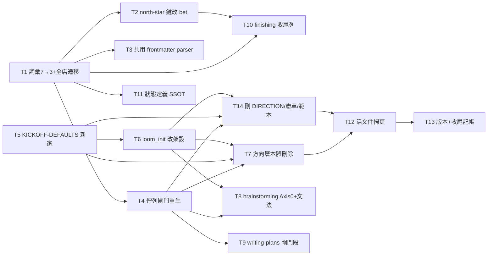

# Plan: dissolve-direction-layer

Source brief: docs/loom/specs/2026-08-20-dissolve-direction-layer.md
Goal: backlog store 成為「接下來做什麼」的唯一紀錄——status 三詞 open/bet/closed
    加 blocked: 欄位；DIRECTION.md 與其產生器、憲章、新鮮度警報全數刪除；
    佇列閘門改對 bet 條目解析、無佇列層時大聲 N/A；下注維持 user-only。
Stage: planning
Steps:
    1. 詞彙核心與開場預設新家（雙線並行起步）
    2. 讀取端跟上（north-star 鍵／共用 parser／閘門重生／init／定義 SSOT）
    3. 方向層本體刪除與三處 skill 文字改寫
    4. 全庫活文件掃更
    5. 版本、CHANGELOG 與 backlog 收尾記帳
**Total tasks**: 14
**Critical-path depth**: 5 (≤5)
**Execution order**: parallel-where-possible
**Plan-document-reviewer verdict**: PASS — user waiver (2026-08-21). The last reviewer verdict on this content was NEEDS_REVISION (round 8); its three gaps were fixed and the user declined round 9, routing the residual risk to SDD's per-task triad and the whole-branch review. This is a recorded human decision, NOT a reviewer PASS — see `## Notes` §Review close-out.

## Task-flow diagram



## Open Questions

N/A — no unresolved question: the two forks this arc raised (the standing-choices new home; the `blocked:` field) are both recorded as Decisions in the brief, and the user resolved the vocabulary word (`bet`) and the promotion authority (user-only) in conversation on 2026-08-21.

## Task 1 — 詞彙 7→3、blocked 欄位、archive 塌縮、全店遷移

- **Description**: Collapse the status vocabulary to `open`/`bet`/`closed`, add the optional `blocked: <reason>` field, collapse the archive-tier invariants, and migrate every live store entry in the same change so `--validate` stays green.
  - Replace `CLOSED_STATUS_VOCABULARY` (backlog_index.py:174, seven legacy words) with exactly `open`, `bet`, `closed`; retire `ARCHIVED_STATUS` machinery.
  - `build_ready` (backlog_index.py:606) lists `bet` first then `open`, excluding any entry carrying a `blocked:` field; `blocked:` is legal only on `open` entries (a violation otherwise).
  - Archive tier: invariants iii/iv (backlog_index.py:14-21, `status: archived` agreement + `archived:` date field) collapse to one rule — an entry under `archive/` must carry `status: closed`.
  - Migrate **every** live entry the store holds at execution time — never a fixed count, since this arc itself files new entries as it runs. Map by legacy word: `OPEN`/`PARKED`/`UPSTREAM` → `open`; `SHIPPED`/`CLOSED — SUPERSEDED` → `closed` (evidence stays as body lines).
  - Add `blocked: <reason>` to each entry migrated from `PARKED` or `UPSTREAM`, the reason distilled from that entry's own `start:` line or body.
  - Exhaustiveness is mechanical, not counted: after the migration `grep -l -E '^status: (OPEN|PARKED|UPSTREAM|SHIPPED|CLOSED|COMMITTED-NEXT|archived)' docs/loom/backlog/2026-*.md` must return nothing.
  - Snapshot for orientation only (measured 2026-08-21, moves as entries are filed): 140 entries — OPEN 106, PARKED 12, SHIPPED 16, `CLOSED — SUPERSEDED` 4, UPSTREAM 2, COMMITTED-NEXT 0, archived 0.
  - Regenerate BACKLOG.md with sections in the order `## bet` → `## open` → `## closed`.
  - test_backlog_index.py:142 notes fixtures coupled to the real store's state — the migration and the vocabulary change must land together to keep the suite green.
- **Module**: loom-code/scripts/backlog_index.py（含測試與 store 資料鎖步）
- **Files touched**: loom-code/scripts/backlog_index.py, loom-code/scripts/test_backlog_index.py, docs/loom/backlog/2026-*.md (every dated entry file, status-line migration; excludes README.md), docs/loom/BACKLOG.md
- **Context paths**:
  - /Users/kouko/GitHub/monkey-skills/loom-code/scripts/backlog_index.py
  - /Users/kouko/GitHub/monkey-skills/docs/loom/backlog/README.md
  - /Users/kouko/GitHub/monkey-skills/docs/loom/specs/2026-08-20-dissolve-direction-layer.md
- **Acceptance**:
  - **RED**: test_backlog_index.py::test_vocabulary_open_bet_closed — a fixture entry with `status: bet` validates clean and `status: COMMITTED-NEXT` is a vocabulary violation. Fails today because CLOSED_STATUS_VOCABULARY (backlog_index.py:174) lists the seven legacy words and no lowercase form.
    - Companion assertions in the same file: `blocked:` on an `open` entry excludes it from `build_ready` output; `blocked:` on a `closed` entry is a violation; an entry under `archive/` with `status: closed` is clean and `status: archived` is a vocabulary violation.
  - **GREEN**: `pytest loom-code/scripts/test_backlog_index.py` passes; `python3 loom-code/scripts/backlog_index.py --validate` exits 0 against the migrated real store; `--write` regenerates BACKLOG.md with exactly the three sections.
    - Exhaustiveness: the legacy-word grep in the Description returns no file — no entry is left behind whatever the store's size at execution time.
- **Dependencies**: none
- **Independent**: true
- **Brief item covered**: BI-2
- **Status**: pending
- **Gloss**: 狀態詞從 7 收斂到 3、「被擋住」變成欄位，store 裡每一筆條目一次遷移完——這是整個新詞彙的地基。

## Task 2 — check_north_star_link 觸發鍵改 bet

- **Description**: Re-key the betting-moment checker from the literal `COMMITTED-NEXT` to `bet`: a live `bet` entry must carry a well-formed `serves:` line; zero live `bet` entries exits 0.
  - The literal appears in the docstring contract (check_north_star_link.py:2,14,27-29) and the status comparison in the scan; update both, and the test fixtures that mint entries.
- **Module**: loom-code/scripts/check_north_star_link.py
- **Files touched**: loom-code/scripts/check_north_star_link.py, loom-code/scripts/test_check_north_star_link.py
- **Context paths**:
  - /Users/kouko/GitHub/monkey-skills/loom-code/scripts/check_north_star_link.py
  - /Users/kouko/GitHub/monkey-skills/loom-code/scripts/backlog_index.py
- **Acceptance**:
  - **RED**: test_check_north_star_link.py::test_bet_entry_without_serves_exits_2 — a fixture store holding one `status: bet` entry with no `serves:` line makes the checker exit 2.
    - Fails today because the checker keys on `COMMITTED-NEXT` (check_north_star_link.py:27-29) and sees a `bet` entry as nothing-to-check (exit 0).
  - **GREEN**: `pytest loom-code/scripts/test_check_north_star_link.py` passes; no occurrence of `COMMITTED-NEXT` remains in either file.
    - Scoped sweep: the arc sweep pattern (`## Notes` §Arc sweep pattern) over this task's `Files touched` returns nothing — test_check_north_star_link.py:7 names `test_check_direction_freshness.py`, a file Task 4 deletes.
- **Dependencies**: Task 1 completes first
- **Independent**: true
- **Brief item covered**: BI-8
- **Status**: pending
- **Gloss**: 「每筆押注要對長期目標交代」的檢查跟上新詞——沒有這步，serves: 檢查會對所有 bet 視而不見。

## Task 3 — archive_change_folder 共用 frontmatter parser（2026-08-02 發現 1 順風）

- **Description**: Make archive_change_folder.py read entry status through backlog_index.parse_frontmatter instead of its own first-match regex `_read_status`, so the two readers can no longer disagree on duplicate keys.
  - Sanctioned rider: the brief's Out of Scope names finding 1 of docs/loom/backlog/2026-08-02-backlog-index-two-frontmatter-readers-disagree-on-duplicate-keys.md as riding this arc; findings 2-4 stay open (Task 13 records the pass-by note).
- **Module**: loom-code/scripts/archive_change_folder.py
- **Files touched**: loom-code/scripts/archive_change_folder.py, loom-code/scripts/test_archive_change_folder.py
- **Context paths**:
  - /Users/kouko/GitHub/monkey-skills/loom-code/scripts/archive_change_folder.py
  - /Users/kouko/GitHub/monkey-skills/loom-code/scripts/backlog_index.py
  - /Users/kouko/GitHub/monkey-skills/docs/loom/backlog/2026-08-02-backlog-index-two-frontmatter-readers-disagree-on-duplicate-keys.md
- **Acceptance**:
  - **RED**: test_archive_change_folder.py::test_duplicate_status_keys_read_last_wins — a fixture whose frontmatter carries `status: closed` then `status: open` must be read as `open` (last-wins) by the archiver, matching backlog_index.
    - Fails today because `_read_status` (archive_change_folder.py:153) regex-searches first match and reads `closed`.
  - **GREEN**: `pytest loom-code/scripts/test_archive_change_folder.py` passes; `_read_status` either delegates to `parse_frontmatter` or is deleted.
- **Reuse-adequacy**:
  - **Observed**: backlog_index.parse_frontmatter resolves duplicate frontmatter keys last-wins, where archive_change_folder._read_status regex-search resolves first-match — the two readers disagree on the same bytes — read docs/loom/backlog/2026-08-02-backlog-index-two-frontmatter-readers-disagree-on-duplicate-keys.md:17
  - **Intended**: the archiver's status read delegates to parse_frontmatter (backlog_index.py:263) so both readers return the same value for any entry, duplicate keys included.
- **Dependencies**: Task 1 completes first
- **Independent**: true
- **Brief item covered**: none — rider sanctioned by the brief's §Out of Scope (finding 1 of the 2026-08-02 entry rides this arc's touch of backlog_index.py)
- **Status**: pending
- **Gloss**: 兩個讀同一份 frontmatter 的程式從此只有一個答案——修掉一個潛伏的「驗證說活、封存說死」分歧。

## Task 4 — 佇列閘門重生：check_direction_freshness.py → check_queue_relation.py

- **Description**: Rename the gate script to check_queue_relation.py, delete the unlanded-direction advisory (half A), resolve `in-queue:`/`displaces:` names against live `bet` store entries, list candidate names in the `unresolved` question, and report a loud N/A at exit 0 when the repo has no queue layer.
  - Delete `find_unlanded_direction_changes`, `_governing_files`, `_parse_now_entry_names` and the CLI advisory print (check_direction_freshness.py:63-189, :341-343).
  - `resolve_queue_relation` validates cited names against entries with `status: bet` under docs/loom/backlog/ instead of DIRECTION.md `## Now`; zero live bets keeps `unqueued — <reason>` as the resolvable answer.
  - No docs/loom/backlog/ store → exit 0 printing `queue-relation: N/A — no queue layer in this repo (docs/loom/backlog/ absent)` — loud, never silent, mirroring loom-memory's posture.
  - `build_queue_relation_question` (was :276) lists the live bet names it holds instead of the literal `<entry-name>` placeholder.
  - Delete test_check_direction_freshness.py and test_check_direction_freshness_no_skip.py; rework test_queue_relation_grammar.py against the new resolver and add the N/A and candidate-listing cases there.
- **Module**: loom-code/scripts/check_queue_relation.py（改名自 check_direction_freshness.py）
- **Files touched**: loom-code/scripts/check_direction_freshness.py (delete), loom-code/scripts/check_queue_relation.py (new), loom-code/scripts/test_check_direction_freshness.py (delete), loom-code/scripts/test_check_direction_freshness_no_skip.py (delete), loom-code/scripts/test_queue_relation_grammar.py
- **Context paths**:
  - /Users/kouko/GitHub/monkey-skills/loom-code/scripts/check_direction_freshness.py
  - /Users/kouko/GitHub/monkey-skills/loom-code/scripts/backlog_index.py
  - /Users/kouko/GitHub/monkey-skills/loom-code/skills/brainstorming/references/handoff-brief-format.md
- **Acceptance**:
  - **RED**: test_queue_relation_grammar.py::test_in_queue_resolves_against_bet_entry_without_direction_md — a brief citing `in-queue: <name>` resolves (exit 0) against a fixture store whose entry `<name>` carries `status: bet`, with no DIRECTION.md present.
    - Fails today because resolution reads DIRECTION.md `## Now` (check_direction_freshness.py:78-96).
    - Companion assertions: no store → exit 0 with the `queue-relation: N/A` line on stdout; `unresolved` exit 2 output contains every live bet name and no literal `<entry-name>` placeholder.
  - **GREEN**: `pytest loom-code/scripts/test_queue_relation_grammar.py` passes; the two deleted test files are gone; `python3 loom-code/scripts/check_queue_relation.py docs/loom/specs/2026-08-20-dissolve-direction-layer.md` exits 0 with no advisory output.
    - Scoped sweep: the arc sweep pattern (`## Notes` §Arc sweep pattern) over this task's `Files touched` returns nothing — test_queue_relation_grammar.py:145-146 names the deleted script in prose.
- **Dependencies**: Task 1 completes first
- **Independent**: true
- **Brief item covered**: BI-3
- **Status**: pending
- **Gloss**: 閘門的三個病一次修完——別名不再指向已死的功能、STOP 訊息終於列出可選名稱、沒佇列層的 repo 不再被永遠擋住。

## Task 5 — on-ramp 常設選擇搬進 KICKOFF-DEFAULTS.md

- **Description**: Move the standing-choices home from DIRECTION.md to a new docs/loom/KICKOFF-DEFAULTS.md; check_onramp_choice.py loads from the new path and git-guard.py's messages name it.
  - Create docs/loom/KICKOFF-DEFAULTS.md carrying the one existing standing line (row 1 standing direct, 2026-08-18) under the same `## On-ramp standing choices` heading grammar.
  - Two surfaces key on the old name and BOTH move: the file path the loader opens, and the literal `(DIRECTION.md)` the brief's `standing` grammar requires.
  - The section heading `## On-ramp standing choices` (check_onramp_choice.py:131) is the one anchor that does NOT change, so a future standing-default section can join the file without touching the parser.
  - check_onramp_choice.py:147 locates the new file; the section-heading grammar (:131) is unchanged.
  - `_FIRED_STANDING` (check_onramp_choice.py:119-122) requires the literal `\(DIRECTION\.md\)` in the brief's on-ramp value line; re-point that literal to `(KICKOFF-DEFAULTS.md)`, and the module docstring's grammar lines (:12, :21) with it.
  - The same literal is the brief-grammar SSOT — update `handoff-brief-format.md:90` and `:199`, and the instruction that emits it at `brainstorming/SKILL.md:114`, in this same task so no window exists where the emitter and the parser disagree.
  - Those same two files also name DIRECTION.md as the *source file* the standing choice is read from — `brainstorming/SKILL.md:112` and `handoff-brief-format.md:93` — and both move with the grammar.
  - `test_brainstorming_axis0.py:130,:132` pins that wording (`"standing" in low` / `"direction.md" in low`); re-point both assertions here, in the task that changes the text they read, or the suite goes red from this task onward.
  - git-guard.py's advice string (:152 `(DIRECTION.md)`) and unreadable-file error (:657-661) re-point to KICKOFF-DEFAULTS.md.
  - Every existing test fixture hardcoding `(DIRECTION.md)` in a `standing` value line must move too — test_check_onramp_choice.py (6 occurrences) and test_git_guard.py — otherwise the suite stays green while the shipped grammar is broken.
  - The parenthesized literal is NOT the whole surface: `check_onramp_choice.py` names DIRECTION on many more lines than the parenthesized form, and a grep for `(DIRECTION\.md)` sees exactly one of them.
  - This task owns all of them, and the GREEN sweep below — not any enumeration — is the exhaustiveness authority.
  - Two are user-visible and would otherwise point at a deleted file: `build_question`'s STOP text (:233, emitted as git-guard's own block note) and the `--repo-root` argparse help (:284).
  - The rest are docstrings and identifiers: :21, :142, :185, :256, the `DIRECTION_STANDING_HEADING` constant name (:131), and the :125-131 comment cross-referencing `backlog_index.py`'s `DIRECTION_NOW_HEADING` — code Task 7 deletes, so that cross-reference dies with it.
  - Historical briefs keep `(DIRECTION.md)`: they are frozen records that were true when written, and no gate re-runs against them (git-guard fires only on newly ADDED plan files).
- **Module**: loom-code/scripts/check_onramp_choice.py（含 git-guard 訊息鎖步）
- **Files touched**: docs/loom/KICKOFF-DEFAULTS.md (new), loom-code/scripts/check_onramp_choice.py, loom-code/scripts/test_check_onramp_choice.py, loom-code/hooks/git-guard.py, loom-code/scripts/test_git_guard.py, loom-code/skills/brainstorming/references/handoff-brief-format.md, loom-code/skills/brainstorming/SKILL.md, loom-code/scripts/test_brainstorming_axis0.py
- **Context paths**:
  - /Users/kouko/GitHub/monkey-skills/loom-code/scripts/check_onramp_choice.py
  - /Users/kouko/GitHub/monkey-skills/loom-code/hooks/git-guard.py
  - /Users/kouko/GitHub/monkey-skills/docs/loom/DIRECTION.md
- **Acceptance**:
  - **RED**: test_check_onramp_choice.py::test_standing_choices_load_from_kickoff_defaults — `load_standing` resolves row 1 from a fixture repo whose only choices file is docs/loom/KICKOFF-DEFAULTS.md.
    - Fails today because the loader reads docs/loom/DIRECTION.md (check_onramp_choice.py:147).
    - Companion assertion in the same file: a brief line reading `fired: rows 1 — standing direct (KICKOFF-DEFAULTS.md)` resolves, and the old-spelling line is `unresolved` — this is the assertion the 6 existing fixtures would otherwise keep green.
    - The negative fixture must BUILD the old spelling so that no file in this task's set contains the substring `DIRECTION` — split INSIDE the matched token, e.g. `"(" + "DIREC" + "TION" + ".md)"`.
    - Splitting around the parentheses does not work: the sweep's first alternative is the bare token, not the parenthesized form.
    - The checkable constraint is the substring, not the parenthesized literal. An exclusion entry instead would start a list that grows until the oracle means nothing.
  - **GREEN**: `pytest loom-code/scripts/test_check_onramp_choice.py loom-code/scripts/test_git_guard.py` passes.
    - The CLI leg must exercise the `standing` branch: a scratch brief whose line reads `fired: rows 1 — standing direct (KICKOFF-DEFAULTS.md)` exits 0, and the same line spelling `(DIRECTION.md)` exits 2.
    - A `not fired` brief cannot serve as that leg — `resolve` returns at check_onramp_choice.py:199-200 before `standing` is consulted, so it exits 0 whether or not the loader was re-pointed.
    - Scoped sweep over the files this task SOLELY owns — check_onramp_choice.py, test_check_onramp_choice.py, git-guard.py, test_git_guard.py, KICKOFF-DEFAULTS.md — using the arc sweep pattern (`## Notes` §Arc sweep pattern): returns nothing.
    - The three files shared with Task 8 (brainstorming/SKILL.md, handoff-brief-format.md, test_brainstorming_axis0.py) get a line-scoped leg instead: the standing-choice grammar and source-file lines this task owns carry no DIRECTION reference.
    - Their whole-file sweep belongs to Task 8, which lands last on that set.
- **Dependencies**: none
- **Independent**: true
- **Brief item covered**: BI-4
- **Status**: pending
- **Gloss**: 常設選擇有了自己的小檔案，檔名就是它唯一的職責——DIRECTION.md 因此少掉最後一個活著的讀者。

## Task 6 — loom_init 改架設面（KICKOFF-DEFAULTS 範本進、DIRECTION 範本退場準備）

- **Description**: loom_init.py scaffolds docs/loom/KICKOFF-DEFAULTS.md from a new template instead of DIRECTION.md, and its refuse-precondition drops DIRECTION.md in favour of KICKOFF-DEFAULTS.md; update family-reception row 5's wording in lockstep.
  - Add loom-code/scripts/templates/KICKOFF-DEFAULTS.md (heading + grammar comment, ~10 lines); stop instantiating templates/DIRECTION.md (loom_init.py:175) — the template file itself is deleted in Task 14.
  - Refusal precondition: refuse when docs/loom/backlog/ OR docs/loom/KICKOFF-DEFAULTS.md exists (was: backlog or DIRECTION.md, loom_init.py:30).
  - family-reception.md row 5 (:72) re-words its precondition to name KICKOFF-DEFAULTS.md; the file's 100-line budget is not exceeded (line-for-line edit).
  - That row is not the file's only DIRECTION content: :89 and :96 (the standing-choices recording instruction) re-point to KICKOFF-DEFAULTS.md, and the whole `## DIRECTION.md charter` section (:113-115) is DELETED rather than re-worded — its referent `direction-charter.md` dies in Task 14.
  - test_loom_init.py's DIRECTION-era assertions go in this task, before Task 14 deletes their subjects: the template-existence checks (:103, :133), the charter-rules block (:426-560), and the scaffold-existence assertions naming DIRECTION (:141-151, :215-217, :392).
  - Drop the `--direction-check` smoke invocation (loom_init.py:76) from the scaffold verification list.
  - Update the module docstring (loom_init.py:8, :30, :35, :76, :183) explicitly — it still calls DIRECTION.md the scaffolded "direction skeleton" and documents `--direction-check` diff semantics; leaving it to incidental edits is how a docstring drifts from its own module.
- **Module**: loom-code/scripts/loom_init.py
- **Files touched**: loom-code/scripts/loom_init.py, loom-code/scripts/test_loom_init.py, loom-code/scripts/templates/KICKOFF-DEFAULTS.md (new), loom-code/hooks/family-reception.md
- **Context paths**:
  - /Users/kouko/GitHub/monkey-skills/loom-code/scripts/loom_init.py
  - /Users/kouko/GitHub/monkey-skills/loom-code/hooks/family-reception.md
  - /Users/kouko/GitHub/monkey-skills/loom-code/scripts/templates/backlog-README.md
- **Acceptance**:
  - **RED**: test_loom_init.py::test_scaffold_creates_kickoff_defaults_not_direction — a fresh scaffold target ends up with docs/loom/KICKOFF-DEFAULTS.md and no docs/loom/DIRECTION.md. Fails today because loom_init instantiates templates/DIRECTION.md (loom_init.py:175) and ships no KICKOFF-DEFAULTS template.
  - **GREEN**: `pytest loom-code/scripts/test_loom_init.py` passes; family-reception.md row 5 names KICKOFF-DEFAULTS.md and the file stays within its 100-non-empty-line budget.
    - Scoped sweep (this task's exhaustiveness authority): `grep -n 'DIRECTION' loom-code/hooks/family-reception.md loom-code/scripts/loom_init.py loom-code/scripts/test_loom_init.py` returns nothing.
- **Dependencies**: Task 5 completes first
- **Independent**: true
- **Brief item covered**: BI-4
- **Status**: pending
- **Gloss**: 新採用 loom 的 repo 從此拿到的是「backlog＋目的＋設定檔」三件套，不再連同整個方向層一起被架設。

## Task 7 — 方向層本體刪除

- **Description**: Delete the direction half of backlog_index.py — the `--direction-write` / `--direction-check` verbs and the five functions behind them — together with the direction-half tests.
  - Delete `_direction_path_for`, `build_direction_now`, `_direction_section_bounds`, `splice_direction_now`, `find_direction_violations` and their CLI plumbing from backlog_index.py.
  - Drop the direction-half tests from test_backlog_index.py and delete test_direction_later_backlog.py.
- **Module**: loom-code/scripts/backlog_index.py（方向半邊）
- **Files touched**: loom-code/scripts/backlog_index.py, loom-code/scripts/test_backlog_index.py, loom-code/scripts/test_direction_later_backlog.py (delete)
- **Context paths**:
  - /Users/kouko/GitHub/monkey-skills/loom-code/scripts/backlog_index.py
  - /Users/kouko/GitHub/monkey-skills/docs/loom/DIRECTION.md
- **Acceptance**:
  - **RED**: test_backlog_index.py::test_direction_verbs_removed — invoking the CLI with `--direction-write` is rejected as an unknown argument.
    - Fails today because the parser registers both direction verbs (backlog_index.py CLI, per loom_init.py:76 smoke list).
  - **GREEN**: `pytest loom-code/scripts/test_backlog_index.py` passes.
    - Scoped sweep: the arc sweep pattern (`## Notes` §Arc sweep pattern) over this task's `Files touched` returns nothing — this replaces the earlier case-sensitive lowercase grep, which could not see backlog_index.py:100/:105's uppercase docstring lines.
- **Dependencies**: Tasks 4, 5, 6 complete first
- **Independent**: false
- **Brief item covered**: BI-6
- **Status**: pending
- **Gloss**: 物化視圖和它的產生器、憲章、範本在同一步消失——到這步為止，repo 裡再沒有任何活機制讀寫 DIRECTION.md。

## Task 8 — brainstorming Axis 0 與佇列文法 SSOT 改寫

- **Description**: Rewrite brainstorming's Axis-0 queue read to `--ready` only (drop the DIRECTION.md `## Now`/`## Next` read), update the loom-init offer's precondition, and rewrite handoff-brief-format.md's Queue relation grammar to resolve names against live `bet` store entries.
  - SKILL.md:81-92: ready check unchanged; the DIRECTION read sentence goes; the no-queue-layer offer keys on "no docs/loom/backlog/ store and no docs/loom/KICKOFF-DEFAULTS.md".
  - handoff-brief-format.md `## Queue relation`: names cited by `in-queue:`/`displaces:` must exist as `status: bet` entries in docs/loom/backlog/; the empty-queue resting-state paragraph re-worded from `## Now` to "no live bet entries".
  - Update test_brainstorming_axis0.py and test_brainstorming_backlog_read.py pins to the new wording.
  - Scope guard: this task edits the Axis-0 queue-read and `## Queue relation` sections only.
  - The on-ramp `standing` grammar rows in the same two files (handoff-brief-format.md:90/:199, SKILL.md:114) belong to Task 5, which is transitively upstream via Task 6 and lands first — do not re-edit them here.
  - This task lands LAST on the brainstorming file set, so it carries the whole-file sweep for it — including any DIRECTION content Task 5 was scoped out of (SKILL.md:81/:92, handoff-brief-format.md:105).
- **Module**: loom-code/skills/brainstorming/
- **Files touched**: loom-code/skills/brainstorming/SKILL.md, loom-code/skills/brainstorming/references/handoff-brief-format.md, loom-code/scripts/test_brainstorming_axis0.py, loom-code/scripts/test_brainstorming_backlog_read.py
- **Context paths**:
  - /Users/kouko/GitHub/monkey-skills/loom-code/skills/brainstorming/SKILL.md
  - /Users/kouko/GitHub/monkey-skills/loom-code/skills/brainstorming/references/handoff-brief-format.md
- **Acceptance**:
  - **RED**: test_brainstorming_axis0.py::test_axis0_reads_ready_not_direction — the Axis-0 section instructs the `--ready` read and contains no instruction to read DIRECTION.md. Fails today because SKILL.md:81-82 instructs reading `## Now` and `## Next`.
  - **GREEN**: `pytest loom-code/scripts/test_brainstorming_axis0.py loom-code/scripts/test_brainstorming_backlog_read.py` passes; handoff-brief-format.md's Queue relation section names the store, not `## Now`.
    - Whole-file sweep for the brainstorming set (this task lands last on it): the arc sweep pattern (`## Notes` §Arc sweep pattern) over brainstorming/SKILL.md, references/handoff-brief-format.md, test_brainstorming_axis0.py, test_brainstorming_backlog_read.py returns nothing.
- **Dependencies**: Tasks 4, 6 complete first
- **Independent**: false
- **Brief item covered**: BI-3
- **Status**: pending
- **Gloss**: 開工時的佇列讀取只剩一個動作（--ready），brief 文法的裁判也從已刪的區段換成 store 本身。

## Task 9 — writing-plans 閘門段落改寫

- **Description**: Rewrite writing-plans SKILL.md's Queue-relation gate paragraph (:117): the script is check_queue_relation.py, exit 0 covers both resolved and the loud no-queue-layer N/A, and the unconditional wording is replaced by the layered posture; update the pin test.
  - The paragraph keeps STOP-on-exit-2 and relay-verbatim duties; the sentence about the advisory ("prints on every run") is deleted with the advisory.
- **Module**: loom-code/skills/writing-plans/SKILL.md
- **Files touched**: loom-code/skills/writing-plans/SKILL.md, loom-code/scripts/test_writing_plans_queue_gate.py
- **Context paths**:
  - /Users/kouko/GitHub/monkey-skills/loom-code/skills/writing-plans/SKILL.md
  - /Users/kouko/GitHub/monkey-skills/loom-code/scripts/test_writing_plans_queue_gate.py
- **Acceptance**:
  - **RED**: test_writing_plans_queue_gate.py::test_gate_paragraph_names_queue_relation_script — the gate paragraph invokes check_queue_relation.py and documents the N/A posture. Fails today because SKILL.md:117 names check_direction_freshness.py and the advisory sentence.
  - **GREEN**: `pytest loom-code/scripts/test_writing_plans_queue_gate.py` passes.
    - Scoped sweep: the arc sweep pattern (`## Notes` §Arc sweep pattern) over this task's `Files touched` returns nothing.
- **Dependencies**: Task 4 completes first
- **Independent**: true
- **Brief item covered**: BI-3
- **Status**: pending
- **Gloss**: 計畫入口的閘門說明跟上新腳本名與「沒佇列層就大聲 N/A」的新姿勢——skill 文字與程式行為重新對齊。

## Task 10 — finishing 收尾列重寫（下注入 store、user-only 不變）

- **Description**: Rewrite the Backlog-close row and Purpose-linked betting step in finishing-a-development-branch SKILL.md (:185, :189): drop every `--direction-write` clause, trigger the betting prompt on "store present and zero live `bet` entries", and keep user-only promotion verbatim.
  - Status flip wording: SHIPPED / CLOSED — SUPERSEDED → `closed` (evidence line unchanged); promotion wording: edits status to `bet`.
  - The PURPOSE.md print-before-candidates duty and the check_north_star_link invocation stay; the DIRECTION-refresh N/A sentences go.
  - Add one pointer sentence to the status-definition block in the store README (Task 11's SSOT) — point, don't copy.
  - test_finishing_backlog_close.py:145-160 holds two tests pinning the literal `--direction-write docs/loom/DIRECTION.md` and the no-DIRECTION.md skip clause; both go in this task, not by inference.
- **Module**: loom-code/skills/finishing-a-development-branch/SKILL.md
- **Files touched**: loom-code/skills/finishing-a-development-branch/SKILL.md, loom-code/scripts/test_finishing_backlog_close.py
- **Context paths**:
  - /Users/kouko/GitHub/monkey-skills/loom-code/skills/finishing-a-development-branch/SKILL.md
  - /Users/kouko/GitHub/monkey-skills/docs/loom/specs/2026-08-20-dissolve-direction-layer.md
- **Acceptance**:
  - **RED**: test_finishing_backlog_close.py::test_close_out_row_bets_on_store_without_direction — the row triggers the betting prompt on a store with zero live bets, contains no `--direction-write`, and keeps the agents-never-auto-promote sentence.
    - Fails today because the betting clause is gated on DIRECTION.md existing (SKILL.md:185).
  - **GREEN**: `pytest loom-code/scripts/test_finishing_backlog_close.py` passes; the row's only regeneration commands are `--write` (index) and the north-star check.
    - Scoped sweep: the arc sweep pattern (`## Notes` §Arc sweep pattern) over this task's `Files touched` returns nothing.
- **Dependencies**: Tasks 1, 2 complete first
- **Independent**: true
- **Brief item covered**: BI-9
- **Status**: pending
- **Gloss**: 下注職責活著、只換了掛鉤——從「DIRECTION.md 存在才問」變成「store 沒有活注就問」；代打下注依然被明文禁止。

## Task 11 — 狀態詞定義 SSOT（BI-11）

- **Description**: Write the status-definition block — the four-row table (open/bet/closed/blocked:) lifted verbatim from the brief's BI-11 seed — into templates/backlog-README.md, mirror it into the instantiated docs/loom/backlog/README.md, and purge both files' DIRECTION-era content.
  - The template is SSOT; the repo README is its instantiated functional copy (existing repo pattern); the six DIRECTION.md references in the template (and the store README's five) are removed or re-worded in the same edit.
- **Module**: loom-code/scripts/templates/backlog-README.md
- **Files touched**: loom-code/scripts/templates/backlog-README.md, docs/loom/backlog/README.md
- **Context paths**:
  - /Users/kouko/GitHub/monkey-skills/docs/loom/specs/2026-08-20-dissolve-direction-layer.md
  - /Users/kouko/GitHub/monkey-skills/loom-code/scripts/templates/backlog-README.md
- **Acceptance**:
  - **RED**: diagnostic — `grep -c '| .bet. |' loom-code/scripts/templates/backlog-README.md` returns 0 today (no definition table exists in either README).
  - **GREEN**: both files carry the four-row definition table with rows byte-matching the brief's seed.
    - Scoped sweep: the arc sweep pattern (`## Notes` §Arc sweep pattern) over both files returns nothing — docs/loom/backlog/README.md:107/:110/:166 carry `--direction-write` and `direction-charter.md` on lowercase-only lines an uppercase grep cannot see.
- **Review-weight**: prose
- **Dependencies**: Task 1 completes first
- **Independent**: true
- **Brief item covered**: BI-11
- **Status**: pending
- **Gloss**: 每個狀態詞的意思、誰能設、何時翻動、附帶義務，白紙黑字只寫一份——skill 全部用指向，不各自改寫。

## Task 12 — 全庫活文件掃更（凍結紀錄不動）

- **Description**: Sweep every live (non-frozen) surface that references DIRECTION.md or the retired vocabulary and re-word it to the new mechanism; frozen records (docs/loom/specs/, plans/, audits/, memory/, backlog entry bodies, CHANGELOGs) are untouched by design.
  - Sweep **every** live surface this task owns, never a frozen list — the enumeration below is orientation, and the scoped sweep in GREEN is the exhaustiveness authority.
  - Two AGENTS.md lines carry the layer only in lowercase and would survive an uppercase-only pass: `:237` documents `--direction-write` / `--direction-check`, and `:252` documents `check_direction_freshness.py` — both name verbs and a script this arc deletes.
  - Orientation snapshot of the surfaces and their DIRECTION.md reference counts, measured 2026-08-20 (moves as neighbouring tasks land):

    | File | Refs | File | Refs |
    |---|---:|---|---:|
    | AGENTS.md | 4 | investing-toolkit/ROADMAP.md | 1 |
    | loom-code/README.md | 1 | legal-toolkit/ROADMAP.md | 1 |
    | loom-code/README.ja.md | 1 | philosophers-toolkit/ROADMAP.md | 1 |
    | loom-code/README.zh-TW.md | 1 | philosophers-toolkit/README.md | 1 |
    | loom-code/PRODUCT-SPEC.md | 1 | philosophers-toolkit/README.ja.md | 1 |
    | loom-code/TECH-SPEC.md | 1 | philosophers-toolkit/README.zh-TW.md | 1 |
    | loom-code/ROADMAP.md | 1 | systems-thinking-toolkit/ROADMAP.md | 1 |
    | docs/loom/README.md | 1 | | |
- **Module**: repo docs（活文件面）
- **Files touched**: AGENTS.md, loom-code/README.md, loom-code/README.ja.md, loom-code/README.zh-TW.md, loom-code/PRODUCT-SPEC.md, loom-code/TECH-SPEC.md, loom-code/ROADMAP.md, docs/loom/README.md, investing-toolkit/ROADMAP.md, legal-toolkit/ROADMAP.md, philosophers-toolkit/ROADMAP.md, philosophers-toolkit/README.md, philosophers-toolkit/README.ja.md, philosophers-toolkit/README.zh-TW.md, systems-thinking-toolkit/ROADMAP.md
- **Context paths**:
  - /Users/kouko/GitHub/monkey-skills/docs/loom/specs/2026-08-20-dissolve-direction-layer.md
- **Acceptance**:
  - **RED**: diagnostic — the arc sweep pattern (`## Notes` §Arc sweep pattern) over this task's `Files touched` reports files today.
  - **GREEN**: that same sweep returns nothing, and `git status` shows no change under docs/loom/specs/, docs/loom/plans/, docs/loom/audits/, docs/loom/memory/.
- **Review-weight**: prose
- **Dependencies**: Task 7 completes first
- **Independent**: true
- **Brief item covered**: BI-1
- **Status**: pending
- **Gloss**: 活文件全面改口、歷史紀錄一字不動——grep 以後還找得到 ## Now，但那只是化石，不再是機制。

## Task 13 — 版本、CHANGELOG 與 backlog 收尾記帳

- **Description**: Bump loom-code to 0.92.0 (plugin.json + marketplace.json sync), write the CHANGELOG entry, and record the arc's three backlog bookkeeping notes, then regenerate the index.
  - Append to docs/loom/backlog/2026-08-10-loom-lacks-a-milestone-layer-between-plan-stage-and-direction.md: option (a) (DIRECTION.md bets grow a parts-checklist) is foreclosed by this arc — DIRECTION.md no longer exists.
  - Append to docs/loom/backlog/2026-08-02-backlog-index-two-frontmatter-readers-disagree-on-duplicate-keys.md: finding 1 shipped via this arc (Task 3); findings 2-4 were passed by on this touch and stay open.
  - File a new entry: kumiko-zaiku-app-icons migration (its DIRECTION.md holds a live 2-entry `## Now`; the new validator fails loudly and names the replacement word — the migration follows this arc's shipped mechanism).
  - Re-run `--write` and `--validate` after the notes land.
  - Run the arc's single exhaustiveness oracle last, as a close-out verification over every task's work. It must be shape-independent — an uppercase-only pattern was blind to five files naming the layer only in lowercase (`check_direction_freshness.py`, `direction_freshness`, `--direction-write`).
  - Content leg: the arc sweep pattern over `loom-code/ docs/loom/backlog/README.md` must return nothing (33 files under loom-code/ today, every one owned by a task in this plan; the store charter is included because it is a live instantiated copy that sits outside loom-code/).
  - Filename leg, because the content leg cannot see a path: `find loom-code docs/loom -name '*DIRECTION*' -not -path '*/__pycache__/*'` must return nothing (2 files today).
  - Two exclusions are deliberate: `CHANGELOG.md` is frozen history, and `mermaid.min.js` is a vendored library whose own `DIRECTIONAL_*` arrow constants are unrelated to this layer.
  - If the oracle reports any file, **STOP and report it** — do not edit outside this task's own `Files touched`. A hit means an upstream task under-declared its surface, which is a plan defect to surface, not a file to quietly patch here.
- **Module**: loom-code/.claude-plugin/plugin.json（含 marketplace 同步與記帳鎖步）
- **Files touched**: loom-code/.claude-plugin/plugin.json, .claude-plugin/marketplace.json, loom-code/CHANGELOG.md, docs/loom/backlog/2026-08-10-loom-lacks-a-milestone-layer-between-plan-stage-and-direction.md, docs/loom/backlog/2026-08-02-backlog-index-two-frontmatter-readers-disagree-on-duplicate-keys.md, docs/loom/backlog/2026-08-21-kumiko-zaiku-app-icons-queue-layer-migration.md (new), docs/loom/BACKLOG.md
- **Context paths**:
  - /Users/kouko/GitHub/monkey-skills/loom-code/CHANGELOG.md
  - /Users/kouko/GitHub/monkey-skills/.claude-plugin/marketplace.json
- **Acceptance**:
  - **RED**: diagnostic — plugin.json still reads 0.91.0 today; the two note lines and the kumiko entry do not exist.
  - **GREEN**: plugin.json and marketplace.json both read 0.92.0; CHANGELOG.md carries the 0.92.0 entry; the two notes and the new entry are present; `--validate` exits 0 and BACKLOG.md is regenerated.
    - Both oracle legs return nothing: no live file under `loom-code/` still names the layer in any spelling, and no path under `loom-code/` or `docs/loom/` still carries DIRECTION in its filename.
    - This is also the brief's success-criterion leg that no other task asserts — the lowercase `direction_freshness` / `--direction-write` sweep is inside the content leg's alternation.
- **Dependencies**: Tasks 8, 9, 10, 11, 12, 14 complete first
- **Independent**: false
- **Brief item covered**: none — release administration (version bump required by the repo's skill-content-PR rule) plus close-out bookkeeping the brief's §Out of Scope names (kumiko entry, milestone note, findings 2-4 note)
- **Status**: pending
- **Gloss**: 版本推進、變更紀錄、三筆記帳一次落地——沒有 bump，marketplace 更新會靜默 no-op。

## Task 14 — 刪除 DIRECTION.md、憲章與範本三個檔案

- **Description**: Delete the three artifacts that constituted the direction layer's document side, once no live reader remains.
  - docs/loom/DIRECTION.md (this repo's instance), loom-code/hooks/direction-charter.md (the charter governing who may edit it), loom-code/scripts/templates/DIRECTION.md (the scaffold template loom_init stopped instantiating in Task 6).
- **Module**: docs/loom/（方向層文件面）
- **Files touched**: docs/loom/DIRECTION.md (delete), loom-code/hooks/direction-charter.md (delete), loom-code/scripts/templates/DIRECTION.md (delete)
- **Context paths**:
  - /Users/kouko/GitHub/monkey-skills/docs/loom/DIRECTION.md
  - /Users/kouko/GitHub/monkey-skills/loom-code/hooks/direction-charter.md
- **Acceptance**:
  - **RED**: diagnostic — all three paths exist today (`test -f` succeeds on each).
  - **GREEN**: none of the three paths exists; the full package suite (`pytest loom-code/scripts/`) stays green, proving no live reader depended on them.
    - The suite can only stay green because Task 6 already removed test_loom_init.py's assertions that these three artifacts exist (:103, :465, :470 and the charter block) — without that prerequisite this GREEN is unachievable, not merely risky.
- **Dependencies**: Tasks 4, 5, 6 complete first
- **Independent**: true
- **Brief item covered**: BI-5
- **Status**: pending
- **Gloss**: 三個檔案的葬禮——讀者都改完之後才動手，套件全綠就是「沒人還在讀它們」的證明。

## Notes

- **Review close-out (why this plan ships without a reviewer PASS).** Eight
  plan-document-reviewer rounds ran; round 3 returned PASS, and every round
  after it was triggered by a content change (the `KICKOFF-DEFAULTS.md`
  naming ruling) or by a gap the previous round's own revision introduced.
  Rounds 4-8 each found real defects, all authored by the planning agent,
  none a reviewer false positive. Round 8 additionally refuted the round-7
  structural claim that one shared sweep pattern removes the defect class —
  the constructed-string workaround it proposed still contained the matched
  token. Round 8's three gaps were fixed; the user then decided (2026-08-21)
  that further plan-time self-review had passed the point of diminishing
  returns, since the residual defect class is acceptance-leg precision —
  exactly what an implementer executes and what SDD's spec-reviewer and
  code-quality-reviewer grade per task, with the whole-branch review before
  merge as the final gate. The plan's structure (14 tasks, the dependency
  DAG, file ownership, depth 5) went unchallenged from round 3 onward.

- **Arc sweep pattern (defined once, cited by every task).** Every
  DIRECTION-clearing acceptance leg in this plan uses THIS pattern over
  that task's own `Files touched` — never a hand-written variant. Rounds
  4-7 each lost a differently-shaped reference to an ad-hoc grep, so the
  pattern is now a single named thing:

  ```
  grep -rlE 'DIRECTION|direction_freshness|direction-charter|--direction-(write|check)|find_direction_|_direction_' <paths> --exclude=CHANGELOG.md --exclude=mermaid.min.js --exclude-dir=__pycache__
  ```

  Task 13 runs it repo-wide as the arc's oracle; every other task runs it
  scoped to its own files. Because the scoped legs use the same pattern,
  Task 13's STOP rule becomes a backstop rather than the first line of
  defence.


- **輸入綁定**：本計畫由 brief 明確交付（`docs/loom/specs/2026-08-20-dissolve-direction-layer.md`）。repo 內兩個非封存 change-folder（`docs/loom/2026-07-12-us-sec-primary-source-layer`、`docs/loom/2026-07-19-8k-prose-kpi-intake`）屬 7 月各自弧的產物、已被各自的計畫消費，與本弧無關——未綁定。
- **凍結紀錄清單**（Task 12 明文不碰）：`docs/loom/specs/`、`docs/loom/plans/`、`docs/loom/audits/`、`docs/loom/memory/`、backlog 條目內文的歷史敘述、各 CHANGELOG 既有條目。`docs/loom/memory/gate-the-recorded-choice-not-the-detour.md` 內的 `(DIRECTION.md)` 字樣是當時文法的紀錄，保留。
- **kumiko 遷移**明確在 brief §Out of Scope——本弧只保證驗證器大聲失敗並指名替代詞（遷移指引），遷移本身是 Task 13 立案的新條目。
- **審查 round 8 修正**：round 7 的結構主張（共用樣式底下沒有更低一層）被推翻，而且推翻的是我自己犯的低級錯——我要求負向 fixture 用 `"(" + "DIRECTION" + ".md)"` 組字串以避開掃描，但樣式的第一個分支就是裸 `DIRECTION`，那個 token 原封不動地在字串裡，實測直接命中。已改為拆在 token 內部（`"DIREC" + "TION"`），並把約束改寫成可檢查的形式：「這個任務的檔案集內不得含子字串 DIRECTION」。另兩個真 gap：任務 5 的掃描範圍涵蓋了三個它無權編輯（屬任務 8）的檔案，驗收因此不可能達成——改為只掃獨佔檔案、共用檔案改行級判準、整檔掃描移交最後落地的任務 8；任務 11 沒有引用共用樣式且它的 `docs/loom/backlog/README.md` 在 oracle 範圍（`loom-code/`）之外，:107/:110/:166 三處小寫引用無人看得到——已引用共用樣式並把 oracle 內容腿擴及該檔。順帶把任務 10 漏掉的 test_finishing_backlog_close.py:145-160 寫進描述。
- **審查 round 7 修正（同一個病、低一層）**：round 6 我修好了頂層 oracle 的樣式，卻讓每個任務自己的 scoped grep 繼續用手寫弱樣式——於是 AGENTS.md 的小寫死動詞、兩支測試 prose 裡的已刪腳本名、brainstorming 兩處「來源檔」引用、以及 test_brainstorming_axis0.py 兩條釘住舊措辭的斷言，全部逃過各自任務的驗收。修法是把樣式變成**全弧只定義一次的具名物**（`## Notes` §Arc sweep pattern），任務 2、4、5、7、9、12 的驗收全部改為引用它、範圍是各自的 `Files touched`；任務 13 的 repo-wide oracle 因此退居 backstop 而非第一道防線。另修一個真正的矛盾：任務 5 要求測試裡放一條「舊字串應被拒絕」的負向斷言，但那個字串本身會觸發 oracle——改為在 fixture 裡組字串（`"(" + "DIRECTION" + ".md)"`）而不是加排除項，因為排除清單一旦開始長，oracle 就失去意義。
- **審查 round 6 修正**：round 5 我設計的 oracle **自己有盲點**——它只認大寫 `DIRECTION`，而 `writing-plans/SKILL.md`、`check_north_star_link.py` 等五個檔案只用小寫形式（`check_direction_freshness.py`／`direction_freshness`／`--direction-write`）提及這一層，而那正是 brief 成功判準第 2 條用的 grep。已改為形狀無關的 alternation（今天 33 檔，逐一確認全部已被任務宣告），並補上內容 grep 看不到的檔名腿（`find -name '*DIRECTION*'`，今天 2 檔）。同輪另修四項：任務 13 的 Dependencies 補上任務 14（原本只有流程圖有這條邊、欄位沒有，欄位才是權威）；任務 12 的 grep 加 `--exclude=CHANGELOG.md`（原本會掃到它自己宣告不得碰的凍結歷史，GREEN 不可能達成）；任務 6 補齊 family-reception 的其餘四處 DIRECTION（含整節 `## DIRECTION.md charter` 刪除）與 test_loom_init.py 的 DIRECTION 時代斷言——沒有這一步，任務 14 的「套件全綠」在 :103／:465／:470 三條存在性斷言下不可能達成；任務 5 的行數計數移除（同一個計數漂移習慣）。
- **審查 round 5 修正（方法改變，不只是補丁）**：前四輪每一輪都用手選 grep 樣式列舉引用面，每一輪都有不同形狀的引用逃掉（括號字面值→裸路徑／docstring／識別字／argparse help／跨檔註解）。根因是拿列舉當窮盡性保證——這一弧在 round 2 對 backlog 條目已經學過同一個教訓，但沒有推廣到引用面。修法：**任務 13 新增全弧唯一的機械 oracle**（`grep -rl 'DIRECTION' loom-code/`，排除凍結的 CHANGELOG 與 vendored mermaid.min.js，今天 28 檔、必須歸零），任務 5 與任務 12 的清單降級為定位用快照、各自帶 scoped grep 當本任務的判準。oracle 命中時任務 13 只回報不修改——命中代表上游任務漏宣告，那是計畫缺陷不是可以就地補的檔案。同輪另修：任務 5 的 CLI 驗收原本用 `not fired` 的 brief，永遠碰不到 `standing` 分支（check_onramp_choice.py:199-200 就 return），改為新舊字串一正一反兩條斷言；任務 6 指向刪除範本檔的任務由 7 更正為 14（round 1 拆任務時留下的死引用）。
- **審查 round 4 修正**：檔名改動的影響面比原本寫的大。`(DIRECTION.md)` 這個字面值不只出現在 git-guard 的建議訊息，它是 `_FIRED_STANDING` 正則的必要部分（check_onramp_choice.py:119-122）、brief 文法 SSOT（handoff-brief-format.md:90/:199）、以及產生該字串的指示（brainstorming/SKILL.md:114）。原計畫只改了路徑與建議訊息，會出貨一個「檔案叫 KICKOFF-DEFAULTS.md、但每份新 brief 仍被迫寫 (DIRECTION.md) 才過閘」的狀態，且因為 6 個既有 fixture 寫死舊字串，整包測試會保持綠燈——靜默出貨。整組字面值改動收進任務 5（含 fixture），任務 8 因此與任務 5 共用兩個檔案而改為 `Independent: false`。我在 round 4 前自己加的那條「機器只認區段標題」bullet 是錯的，已改寫為兩個介面都搬、只有區段標題不動。
- **檔名裁決（單向門）**：新檔名為 `docs/loom/KICKOFF-DEFAULTS.md`，使用者於 2026-08-21 kickoff 簡報中拍板。大寫是量測 monkey-skills 與 kumiko 兩個 repo 的 `docs/loom/` 慣例後的結論——大寫＝loom 機制認得的標準工件（BACKLOG／DIRECTION／INDEX／PRINCIPLES／SCOPE），小寫＝repo 自開的臨時文件（codex-verification／decisions／params）；本檔被三個機制解析，屬前者。檔名走白話（KICKOFF-DEFAULTS 而非 ONRAMP-CHOICES），精確性由檔內的機器錨點區段標題承擔。
- **user-only 下注**：使用者於 2026-08-21 對話中裁定維持（同時立案 `2026-08-21-lane-level-standing-bet-…` 為未來的 lane 級擴充）。
- **審查 round 2 修正**：Task 1 的遷移指示由固定筆數（139＋分項數字）改為動態指示「執行時 store 裡的每一筆」，窮盡性改由機械 grep 保證。原因是這一弧自己會邊跑邊立新條目——`2026-08-21-lane-level-standing-bet-…` 就是本 session 依使用者裁決立的，立完 store 就從 139 變 140，計畫抄下的數字當場過期。brief 的 139 是有日期戳的 2026-08-20 快照，本身沒錯，不修。
- **審查 round 1 修正**：Task 7 的 `Independent` 由 true 改 false（與 Task 1 共用 `backlog_index.py` 與 `test_backlog_index.py`——依賴鏈本來就保證它排在後面，但 Check 14 對檔案重疊是無條件的）；Task 1 的 `Files touched` glob 收窄為 `2026-*.md`，因為 `*.md` 字面上會匹配 Task 11 要改的 `README.md`；Task 3 的 `Observed` 引用錨點由 :20 改為 :17（宣稱所在行）。
- **BI-7 與 BI-10 的認領**：兩者各自被「主要指涉是別的 BI」的任務實際交付，依 plan-format 的 tie-break（主要指涉＝RED 斷言的那一項）不重複掛牌。BI-7（半個 A 的未落地提醒與三支專屬測試）由 Task 4 的 GREEN 證明（兩支測試檔刪除、閘門執行無提醒輸出）；BI-10（archive 層兩條不變式）由 Task 1 的 companion 斷言證明（`archive/` 下 `status: closed` 乾淨、`status: archived` 為詞彙違規）。coverage checker 對兩者只發 warning，不阻擋。
- **`test_finishing_archive_step.py`**（change-folder 封存步驟測試）與 backlog archive 層無關，不在本計畫範圍；若 Task 1 的塌縮意外波及，該測試會在套件層跑掛並回報。
