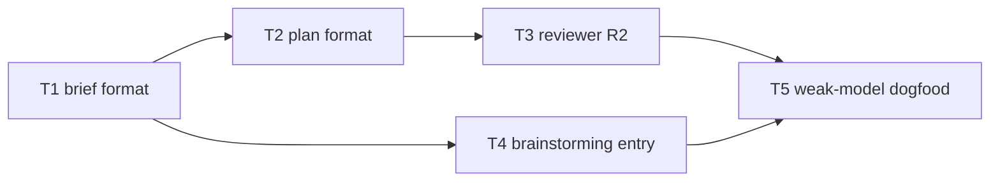

# Plan: make anchor-primary citations concrete for code and configuration

**Source brief**: docs/loom/specs/2026-08-22-anchor-primary-code-anchors.md
Goal: Teach authors and reviewers which stable anchors to choose for prose,
code, and configuration, then cold-read the rule with a weak model.
Stage: finishing
Steps:
    1. Add artifact-type guidance to the brief format
    2. Update the plan format and brainstorming entry
    3. Propagate the reviewer R2 guidance
    4. Run the weak-model dogfood
**Total tasks**: 5
**Critical-path depth**: 4
**Execution order**: sequential
**Plan-document-reviewer verdict**: PASS

## Task-flow diagram

## Open Questions

N/A — no unresolved question: the brief fixes the artifact categories and the dogfood acceptance criterion.

## Task 1 — Add artifact-type anchors to the brief format

- **Description**: Add a compact prose/code/config anchor choice guide to the Current State Evidence explanation and copyable template.
- **Module**: loom-code/skills/brainstorming
- **Files touched**: loom-code/skills/brainstorming/references/handoff-brief-format.md, loom-code/scripts/test_anchor_primary_brief_format.py
- **Context paths**:
  - loom-code/skills/brainstorming/references/handoff-brief-format.md
- **Acceptance**:
  - **RED**: `test_anchor_primary_brief_format.py::test_current_state_evidence_is_anchor_primary` requires the three artifact categories and fails before the guide exists.
  - **GREEN**: The guide names stable heading/distinctive phrase for prose, program structures or distinctive literals for code, and key path plus value fragment for config/data; the existing package test suite passes.
- **Dependencies**: none
- **Independent**: false
- **Brief item covered**: BI-1
- **Status**: done(97f390fe)

## Task 2 — Add artifact-type anchors to the plan format

- **Description**: Add the compact guide to Stated Facts and lock it in the existing plan-format test.
- **Module**: loom-code/skills/writing-plans
- **Files touched**: loom-code/skills/writing-plans/references/plan-format.md, loom-code/scripts/test_anchor_primary_plan_format.py
- **Context paths**:
  - loom-code/skills/writing-plans/references/plan-format.md
- **Acceptance**:
  - **RED**: `test_anchor_primary_plan_format.py::test_stated_facts_is_anchor_primary` requires the artifact-type guide and fails before the wording exists.
  - **GREEN**: The plan rule names the artifact categories and the package test suite passes.
- **Dependencies**: Task 1 completes first
- **Independent**: false
- **Brief item covered**: BI-1
- **Status**: done(dedc0a30)

## Task 3 — Add artifact-type anchors to reviewer R2

- **Description**: Add the compact guide to reviewer R2, propagate its SSOT, and lock it in the existing reviewer-contract test.
- **Module**: loom-code/scripts
- **Files touched**: loom-code/scripts/_reviewer-discipline.md, loom-code/scripts/test_anchor_primary_reviewer_contracts.py
- **Context paths**:
  - loom-code/scripts/_reviewer-discipline.md
  - loom-code/scripts/distribute.py
- **Acceptance**:
  - **RED**: `test_anchor_primary_reviewer_contracts.py::test_r2_is_anchor_primary_at_ssot` requires the artifact-type guide and fails before the wording exists.
  - **GREEN**: Reviewer R2 names the artifact categories, `distribute.py` keeps reviewer copies synchronized, and the package test suite passes.
- **Dependencies**: Task 2 completes first
- **Independent**: false
- **Brief item covered**: BI-2
- **Status**: done(678157b3)

## Task 4 — Correct the brainstorming entry contract

- **Description**: Replace the retained `file:line` Current State Evidence instruction with anchor-primary wording and lock it in the existing author-surface test.
- **Module**: loom-code/skills/brainstorming
- **Files touched**: loom-code/skills/brainstorming/SKILL.md, loom-code/scripts/test_anchor_primary_brief_format.py
- **Context paths**:
  - loom-code/skills/brainstorming/SKILL.md
- **Acceptance**:
  - **RED**: `test_anchor_primary_brief_format.py::test_brief_author_surfaces_are_anchor_primary` asserts the entry requires path plus anchor and rejects `file:line`.
  - **GREEN**: The entry and the canonical brief format agree, and the package test suite passes.
- **Dependencies**: Task 1 completes first
- **Independent**: false
- **Brief item covered**: BI-3
- **Status**: done(be85e0d7)

## Task 5 — Cold-read the guidance with a weak model

- **Description**: Give a weak model a fixed prose/code/config fixture and the shipped author guidance; record whether it produces path-plus-anchor citations using appropriate artifact-specific anchors without extra coaching.
- **Module**: docs/loom/dogfood
- **Files touched**: docs/loom/dogfood/2026-08-22-anchor-primary-code-anchor-weak-model.md
- **Context paths**:
  - docs/loom/specs/2026-08-22-anchor-primary-code-anchors.md
- **Acceptance**:
  - **RED**: The recorded dogfood fixture rubric’s `code-anchor-kind` diagnostic rejects a line-only or generic-anchor response.
  - **GREEN**: A weak-model response passes every fixture category, or a failure is recorded verbatim and blocks close-out for remediation.
- **Dependencies**: Tasks 3, 4 complete first
- **Independent**: false
- **Brief item covered**: BI-4
- **Status**: done(3de65fb5)
