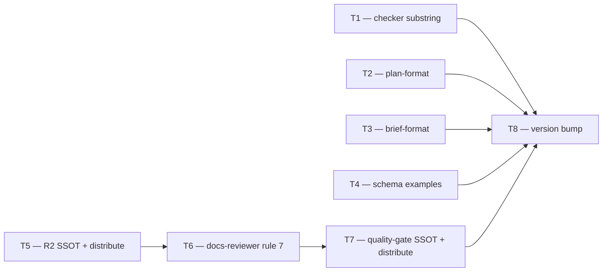

# Plan: the anchor is the citation, the line number is optional precision

**Source brief**: docs/loom/specs/2026-08-22-anchor-primary-line-cite-rule.md
Goal: Invert loom's line-cite rule from line-number-first to anchor-primary
    across every surface that states or consumes it, plus a checker that
    verifies the anchor, so a citation survives the change that writes it.
Stage: finishing
Steps:
    1. 檢查器加錨點驗證、翻轉 plan/brief/schema/R2 五處規則（平行波）
    2. 翻轉 docs-reviewer 專屬規則與 schema
    3. 翻轉 quality-gate 於 SSOT 並傳播
    4. bump 版本
**Total tasks**: 8
**Critical-path depth**: 4 (must be ≤5; if >5 route back to brainstorming)
**Execution order**: parallel-where-possible
**Plan-document-reviewer verdict**: PASS (2026-08-22, round 1)

## Task-flow diagram

## Open Questions

N/A — no unresolved question: the rule boundary, verification cost, transition, and SSOT chain were all settled in the brief or confirmed by reading the script.

## Task 1 — Add substring (anchor) verification to the citation checker

- **Description**: Add substring (anchor) verification to `check_doc_citations.py`: when a citation carries a paired quoted string, verify the string occurs in the named file.
  - Keep the existing line-bounds check as a secondary check when a line number is present.
  - The file-reading and path-resolution machinery is already in place (the file is read at line 229); the work is a regex to capture the paired quote and one `in` check against the already-read text.
- **Module**: loom-code/scripts
- **Files touched**: loom-code/scripts/check_doc_citations.py, loom-code/scripts/test_check_doc_citations.py
- **Context paths**:
  - /Users/kouko/GitHub/monkey-skills/loom-code/scripts/check_doc_citations.py
- **Acceptance**:
  - **RED**: `test_check_doc_citations.py::test_a_citation_whose_quoted_string_is_absent_from_the_target_is_flagged` fails today because no substring check exists. Build the fixture in `tmp_path`; never assert against the live tree.
  - **GREEN**: The checker flags a citation whose paired quote does not occur in the target file, passes one whose quote does occur, and `python3 -m pytest loom-code/scripts/ -q` passes at package level.
- **Dependencies**: none
- **Independent**: true
- **Brief item covered**: BI-6 — check_doc_citations.py gains substring verification
- **Status**: done(423ed507)
- **Gloss**: 檢查器能驗證錨點字串還在不在檔案裡——讓錨點成為可機械驗證的引用

## Task 2 — Invert plan-format.md §Stated facts to anchor-primary

- **Description**: Invert `plan-format.md` §Stated facts from line-number-first to anchor-primary: the anchor is the required citation, the line number optional precision.
  - The "Cite the narrowest form that resolves — `file:line`" sentence becomes "Cite the anchor that resolves — the verbatim string or stable heading."
  - The pairing duty inverts: the anchor is the citation, the line number is the optional add-on, required only when the anchor alone is ambiguous.
  - The file this section cites as authority (`dispatch-hygiene-notes.md`) already says "Anchor by string, never by line number alone" — this task aligns the rule with its own source.
- **Module**: loom-code/skills/writing-plans
- **Files touched**: loom-code/skills/writing-plans/references/plan-format.md, loom-code/scripts/test_anchor_primary_plan_format.py
- **Context paths**:
  - /Users/kouko/GitHub/monkey-skills/loom-code/skills/writing-plans/references/plan-format.md
  - /Users/kouko/GitHub/monkey-skills/loom-code/skills/subagent-driven-development/references/dispatch-hygiene-notes.md
- **Acceptance**:
  - **RED**: `test_anchor_primary_plan_format.py::test_stated_facts_is_anchor_primary` fails today because the section still requires `file:line` as the citation form. Assert whitespace-flattened on the anchor-primary wording and on the absence of the line-first "narrowest form" prescription.
  - **GREEN**: The test passes and `python3 -m pytest loom-code/scripts/ -q` passes at package level.
- **Dependencies**: none
- **Independent**: true
- **Brief item covered**: BI-1 — plan-format.md §Stated facts inverted to anchor-primary
- **Status**: done(3aae4bac)
- **Gloss**: plan 不再要求行號優先——錨點才是引用，行號是選配

## Task 3 — Invert handoff-brief-format.md §Current State Evidence to anchor-primary

- **Description**: Invert `handoff-brief-format.md` §Current State Evidence: each sub-bullet's `file:line` requirement becomes an anchor requirement.
  - The anchor is a verbatim string or stable heading; a line number is optional precision.
  - The anti-pattern line ("bullets without `file:line` citations defeat the purpose") inverts to anchor-primary.
- **Module**: loom-code/skills/brainstorming
- **Files touched**: loom-code/skills/brainstorming/references/handoff-brief-format.md, loom-code/scripts/test_anchor_primary_brief_format.py
- **Context paths**:
  - /Users/kouko/GitHub/monkey-skills/loom-code/skills/brainstorming/references/handoff-brief-format.md
- **Acceptance**:
  - **RED**: `test_anchor_primary_brief_format.py::test_current_state_evidence_is_anchor_primary` fails today because the section still requires `file:line`. Assert whitespace-flattened on the anchor-primary wording.
  - **GREEN**: The test passes and `python3 -m pytest loom-code/scripts/ -q` passes at package level.
- **Dependencies**: none
- **Independent**: true
- **Brief item covered**: BI-4 — handoff-brief-format.md §Current State Evidence inverted
- **Status**: done(656003e4)
- **Gloss**: brief 的 Current State Evidence 不再要求 file:line——錨點優先

## Task 4 — Align the schema-example surfaces to anchor-primary

- **Description**: Align the `where:` schema examples in `gate-markers-spec.md`, `requesting-code-review/SKILL.md`, and `requesting-docs-review/SKILL.md` to anchor-primary.
  - The `where: <file:line>` required form becomes `where: <path + anchor; line optional>` so the examples do not contradict the inverted rule.
- **Module**: loom-code/skills (requesting-code-review, requesting-docs-review)
- **Files touched**: loom-code/skills/requesting-code-review/references/gate-markers-spec.md, loom-code/skills/requesting-code-review/SKILL.md, loom-code/skills/requesting-docs-review/SKILL.md, loom-code/scripts/test_anchor_primary_schemas.py
- **Context paths**:
  - /Users/kouko/GitHub/monkey-skills/loom-code/skills/requesting-code-review/references/gate-markers-spec.md
  - /Users/kouko/GitHub/monkey-skills/loom-code/skills/requesting-code-review/SKILL.md
  - /Users/kouko/GitHub/monkey-skills/loom-code/skills/requesting-docs-review/SKILL.md
- **Acceptance**:
  - **RED**: `test_anchor_primary_schemas.py::test_schema_examples_are_anchor_primary` fails today because the three files carry `where: <file:line>` as the required form. Assert whitespace-flattened on the new `where:` form across all three files.
  - **GREEN**: The test passes and `python3 -m pytest loom-code/scripts/ -q` passes at package level.
- **Dependencies**: none
- **Independent**: true
- **Brief item covered**: BI-7 — schema-example surfaces aligned
- **Status**: done(cd682723)
- **Gloss**: schema 範例不再顯示 file:line 為必要——與翻轉後的規則一致

## Task 5 — Invert the R2 evidence rule at its SSOT and propagate

- **Description**: Invert the R2 evidence rule in `_reviewer-discipline.md` to anchor-primary and run `distribute.py` to propagate to the four verdict-producing agents.
  - The "value cites `file:line`, commit SHA" rule becomes: the anchor (verbatim string or stable heading) is the locator; a line number is optional precision.
  - The SSOT is the only file edited directly; the agent files (code-reviewer, code-quality-reviewer, spec-reviewer, docs-reviewer) receive the block via distribute.py.
- **Module**: loom-code/scripts
- **Files touched**: loom-code/scripts/_reviewer-discipline.md, loom-code/scripts/test_anchor_primary_reviewer_contracts.py
- **Context paths**:
  - /Users/kouko/GitHub/monkey-skills/loom-code/scripts/_reviewer-discipline.md
  - /Users/kouko/GitHub/monkey-skills/loom-code/scripts/distribute.py
  - /Users/kouko/GitHub/monkey-skills/loom-code/scripts/verify-drift.py
- **Acceptance**:
  - **RED**: `test_anchor_primary_reviewer_contracts.py::test_r2_is_anchor_primary_at_ssot` fails today because `_reviewer-discipline.md` still requires `file:line`. Assert whitespace-flattened on the new R2 wording.
  - **GREEN**: The SSOT test passes; `distribute.py` run propagates the block to the four agents; `verify-drift.py` exits 0 (no byte drift); `python3 -m pytest loom-code/scripts/ -q` passes at package level.
- **Dependencies**: none
- **Independent**: false
- **Brief item covered**: BI-2 — the reviewer R2 block inverted at its SSOT, propagated by distribute.py
- **Status**: done(db4dd691)
- **Gloss**: R2 改一處傳播到四個 reviewer——錨點成為 where: 的定位器

## Task 6 — Invert docs-reviewer.md rule 7 and its output schema

- **Description**: Invert `docs-reviewer.md` rule 7 and its output schema: `where:` is the path, `quote:` is the primary locator, a line number optional precision.
  - This surface is docs-reviewer-specific and not in the shared R2 block, so it is edited directly, not via distribute.py.
  - The aggregation rule that makes a missing `where:` flip the verdict to NEEDS_REVISION stays; what changes is what `where:` locates.
  - Ordering rationale: both T5 and T6 write `docs-reviewer.md`; T5's distribute.py run rewrites the R2 block between markers, and T6 edits rule 7 and the schema outside those markers — the distribute.py run must settle first so it does not clobber the rule-7 edit.
- **Module**: loom-code/agents
- **Files touched**: loom-code/agents/docs-reviewer.md, loom-code/scripts/test_anchor_primary_reviewer_contracts.py
- **Context paths**:
  - /Users/kouko/GitHub/monkey-skills/loom-code/agents/docs-reviewer.md
- **Acceptance**:
  - **RED**: `test_anchor_primary_reviewer_contracts.py::test_docs_reviewer_rule_7_and_schema_are_anchor_primary` fails today because rule 7 and the schema still carry `where: <file:line>` as the required form. Assert whitespace-flattened on the new rule 7 and schema wording.
  - **GREEN**: The test passes and `python3 -m pytest loom-code/scripts/ -q` passes at package level.
- **Dependencies**: Task 5 completes first
- **Independent**: false
- **Brief item covered**: BI-3 — docs-reviewer.md rule 7 and output schema inverted
- **Status**: done(ffe2e631)
- **Gloss**: docs-reviewer 的 where:/quote: 翻轉——quote 是主定位器

## Task 7 — Invert quality-gate.md at its SSOT and propagate

- **Description**: Invert the evidence rule in `domain-teams/skills/code-team/rubrics/quality-gate.md` to anchor-primary and run `distribute.py` to propagate into loom-code.
  - "File path + line number + specific problem" becomes anchor-primary; the SSOT is in domain-teams, copied one-way into loom-code by distribute.py.
  - Ordering rationale: T7's distribute.py run rewrites the R2 block in `docs-reviewer.md`; it must run after T6's rule-7 edit so the read-modify-write preserves it.
- **Module**: domain-teams/skills/code-team
- **Files touched**: domain-teams/skills/code-team/rubrics/quality-gate.md, loom-code/scripts/test_anchor_primary_reviewer_contracts.py
- **Context paths**:
  - /Users/kouko/GitHub/monkey-skills/domain-teams/skills/code-team/rubrics/quality-gate.md
  - /Users/kouko/GitHub/monkey-skills/loom-code/scripts/distribute.py
  - /Users/kouko/GitHub/monkey-skills/loom-code/scripts/verify-drift.py
- **Acceptance**:
  - **RED**: `test_anchor_primary_reviewer_contracts.py::test_quality_gate_is_anchor_primary_at_ssot` fails today because the SSOT still requires "File path + line number". Assert whitespace-flattened on the new wording.
  - **GREEN**: The SSOT test passes; `distribute.py` propagates to the loom-code copy; `verify-drift.py` exits 0; `python3 -m pytest loom-code/scripts/ -q` passes at package level.
- **Dependencies**: Task 6 completes first
- **Independent**: false
- **Brief item covered**: BI-5 — quality-gate.md inverted at its SSOT, propagated by distribute.py
- **Status**: done(df175854)
- **Gloss**: quality-gate 改一處傳播進 loom-code——錨點優先於行號

## Task 8 — Bump the plugin version across all coupled sites

- **Description**: Bump the plugin version for loom-code and domain-teams across all coupled sites: `plugin.json`, CHANGELOG, version-pin test, and any Check tag carrying the version.
  - This is a repo convention the brief's subject matter does not name; declared as BI-8 so the coverage gate binds to it rather than leaving it to be missed after implementation.
  - The version bump is final, after all content changes.
- **Module**: loom-code (version coupled sites)
- **Files touched**: loom-code/.claude-plugin/plugin.json, domain-teams/.claude-plugin/plugin.json, loom-code/CHANGELOG.md, domain-teams/CHANGELOG.md, loom-code/scripts/test_docs_review_blocking_class.py
- **Context paths**:
  - /Users/kouko/GitHub/monkey-skills/loom-code/scripts/test_docs_review_blocking_class.py
  - /Users/kouko/GitHub/monkey-skills/loom-code/.claude-plugin/plugin.json
  - /Users/kouko/GitHub/monkey-skills/domain-teams/.claude-plugin/plugin.json
- **Acceptance**:
  - **RED**: `test_docs_review_blocking_class.py` asserts the new loom-code version number (fails at 0.95.0).
  - **GREEN**: The version-pin test passes; both `plugin.json` files carry the new versions; both CHANGELOGs carry the new heading; `python3 -m pytest loom-code/scripts/ -q` passes at package level.
- **Dependencies**: Tasks 1, 2, 3, 4, 7 complete first
- **Independent**: false
- **Brief item covered**: BI-8 — the plugin version bumped across all coupled sites
- **Status**: done(78540133)
- **Gloss**: 兩個 plugin 版本 bump——契約內容變更不發佈就是靜默 no-op

## Notes

- The blast radius is thirteen surfaces (confirmed by exhaustive grep), but
  `distribute.py` collapses it: the R2 block is one SSOT edit
  (`_reviewer-discipline.md`) propagated to four agents, and `quality-gate.md`
  is one SSOT edit (domain-teams) propagated into loom-code. The directly
  edited files are seven plus the checker.
- Tasks 5, 6, 7 share one test file (`test_anchor_primary_reviewer_contracts.py`)
  because they are sequential — T6 depends on T5, T7 on T6. Tasks 1-4 each
  carry a separate test file so they can dispatch in parallel without a
  file-level write race.
- The version bump (Task 8) is a repo-convention obligation the brief's subject
  matter does not name. It is declared as BI-8 in the brief so the coverage
  gate binds to it — the failure mode this repo recorded in
  `docs/loom/memory/a-coverage-check-cannot-see-what-the-brief-never-declared.md`.
- `dispatch-hygiene-notes.md` needs no edit: it already states "Anchor by
  string, never by line number alone" and is the authority plan-format.md
  cites. The inversion aligns the rule with its own source.
- `check_contract_citations.py` has no overlap with this rule; it strips a
  trailing `:line` before classifying a path and never verifies a line number.
- Post-PASS amendments (kind 2 — formatting/syntax, no change to what any
  task field or Dependencies edge asserts; no re-review): the three
  `Dependencies` fields carried parenthetical explanations that
  `plan_card.py`'s strict syntax check rejects — the explanations relocated
  into each task's Description bullets, the edge values unchanged; the
  `Steps:` block was rewritten from 8 per-task titles to 4 per-dependency-level
  titles to match the level count `plan_card.py` derives.
- Kickoff decision: anchor citation syntax (T1) → a paired `"..."` string on
  the same line as a backtick path citation (`` `path:line` "verbatim string" ``);
  the checker extracts the quote and verifies it occurs in the already-read
  target text. Consistent with the existing same-line `§N` association pattern;
  greenfield today (no citation carries a paired quote), so reversible.
- Kickoff decision: version bump targets (T8) → loom-code 0.95.0→0.96.0 (minor,
  contract-content change per CHANGELOG convention — 0.93→0.94→0.95 were all
  minor "Fixed" bumps); domain-teams 5.10.3→5.11.0 (minor, quality-gate SSOT
  content change).