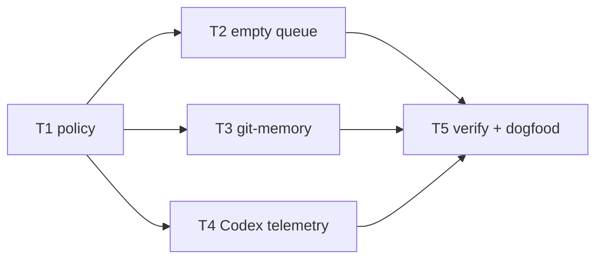

# Plan: autonomy-by-default with explicit authority boundaries

**Source brief**: docs/loom/specs/2026-08-22-autonomy-by-default.md
Goal: Make loom automatically advance bounded, approved work while retaining
    a small, uniform set of authority and safety stops.
Stage: finishing
Steps:
    1. Define the global autonomy and ask-policy contract.
    2. Remove close-out and delegated-memory duplicate prompts.
    3. Add Codex telemetry, then prove the contract by tests and dogfood.
**Total tasks**: 5
**Critical-path depth**: 3 (must be ≤5; if >5 route back to brainstorming)
**Execution order**: parallel-where-possible
**Plan-document-reviewer verdict**: PASS (2026-08-22, round 2)

## Task-flow diagram

## Open Questions

N/A — no unresolved question: the user chose a loom-wide default and the brief fixes every retained authority boundary.

## Task 1 — Make autonomy-by-default and the ask policy explicit

- **Description**: Replace the router's human-pumped default with an autonomy-by-default contract after a human-approved brief/spec exists.
  - Preserve `一站一站來` as an explicit per-session override and never
    auto-merge.
  - Define `auto-resolve`, `notify`, `ask`, and `halt` once, and point
    downstream stations at it rather than allowing their own confirmation
    defaults.
- **Module**: loom-code/skills/using-loom-code
- **Files touched**: loom-code/skills/using-loom-code/SKILL.md,
  loom-code/skills/using-loom-code/references/continuous-mode.md,
  loom-code/scripts/test_continuous_mode_router.py,
  loom-code/scripts/test_request_derived_authorization.py,
  loom-code/scripts/test_freeze_changefolder.py
- **Context paths**:
  - loom-code/skills/using-loom-code/SKILL.md
  - loom-code/skills/using-loom-code/references/continuous-mode.md
  - loom-code/scripts/test_continuous_mode_router.py
  - loom-code/scripts/test_request_derived_authorization.py
  - loom-code/scripts/test_freeze_changefolder.py
- **Acceptance**:
  - **RED**: `loom-code/scripts/test_continuous_mode_router.py::test_default_execution_is_autonomy_by_default` fails because the router still says `the default stays human-pumped`.
  - **GREEN**: That test, `test_approved_entry_autoadvances_without_publish_endpoint`, and `test_autonomy_policy_has_exactly_four_outcomes` pass; the migrated authorization suite passes; the reference still contains `never auto-merge`, `scope / decision`, `privacy`, `deploy`, and `delete` stop wording.
- **Dependencies**: none
- **Independent**: false
- **Brief item covered**: BI-1, BI-2
- **Status**: done(5c5b4405)

## Task 2 — Make an empty bet queue notification-only at close-out

- **Description**: Change close-out so zero live bets produce a visible `bet queue empty` report but do not ask the user to choose a new bet.
  - Keep `agents never auto-promote` exactly intact.
- **Module**: loom-code/skills/finishing-a-development-branch
- **Files touched**: loom-code/skills/finishing-a-development-branch/SKILL.md,
  loom-code/scripts/test_finishing_backlog_close.py,
  loom-code/scripts/test_finishing_purpose_row.py,
  docs/loom/backlog/README.md
- **Context paths**:
  - loom-code/skills/finishing-a-development-branch/SKILL.md
  - loom-code/scripts/test_finishing_backlog_close.py
  - loom-code/scripts/test_finishing_purpose_row.py
  - docs/loom/backlog/README.md
- **Acceptance**:
  - **RED**: `loom-code/scripts/test_finishing_backlog_close.py::test_zero_live_bets_are_reported_without_a_user_prompt` fails because the row says `surface a betting prompt to the user`.
  - **GREEN**: That test passes, the row and backlog charter agree on explicit-user-only promotion, the row contains `bet queue empty` and `do not ask`, and the existing `agents never auto-promote` assertion remains green.
- **Dependencies**: Task 1 completes first
- **Independent**: true
- **Brief item covered**: BI-3
- **Status**: done(5c5b4405)

## Task 3 — Honor close-out authorization inside git-memory delegation

- **Description**: Specify that git-memory, when delegated by loom close-out, drafts carriers and runs privacy checks without re-confirming a commit or PR already authorized by the initiating request.
  - Direct git-memory use remains confirmation-based; privacy BLOCK remains
    a required stop in every path.
- **Module**: dev-workflow/skills/git-memory
- **Files touched**: dev-workflow/skills/git-memory/protocols/compose-commit.md,
  dev-workflow/skills/git-memory/protocols/compose-pr.md,
  dev-workflow/skills/git-memory/scripts/test_loom_delegation.py
- **Context paths**:
  - dev-workflow/skills/git-memory/protocols/compose-commit.md
  - dev-workflow/skills/git-memory/protocols/compose-pr.md
  - loom-code/skills/finishing-a-development-branch/SKILL.md
- **Acceptance**:
  - **RED**: `dev-workflow/skills/git-memory/scripts/test_loom_delegation.py::test_loom_closeout_delegation_does_not_reconfirm_authorized_publish` fails because neither protocol names a loom-delegated exception.
  - **GREEN**: That test passes, the delegated condition precedes confirmation, direct invocation remains the explicit else branch, and `privacy BLOCK` remains a required human stop in both protocol tests.
- **Dependencies**: Task 1 completes first
- **Independent**: true
- **Brief item covered**: BI-4
- **Status**: done(5c5b4405)

## Task 4 — Add a Codex session adapter to distill-sessions

- **Description**: Ingest `.codex/sessions/**/*.jsonl` into the existing Event model and include them with Claude sessions in the Stage 1 preview.
  - Parse user/assistant messages, tool failures, and user-facing stop
    reasons without exposing reasoning content.
  - Keep Claude fixture behavior unchanged.
- **Module**: dev-workflow/skills/distill-sessions
- **Files touched**: dev-workflow/skills/distill-sessions/scripts/ingest.py,
  dev-workflow/skills/distill-sessions/scripts/event.py,
  dev-workflow/skills/distill-sessions/scripts/main.py,
  dev-workflow/skills/distill-sessions/scripts/test_ingest.py,
  dev-workflow/skills/distill-sessions/scripts/test_main.py,
  dev-workflow/skills/distill-sessions/SKILL.md
- **Context paths**:
  - dev-workflow/skills/distill-sessions/scripts/ingest.py
  - dev-workflow/skills/distill-sessions/scripts/main.py
  - dev-workflow/skills/distill-sessions/scripts/test_ingest.py
  - dev-workflow/skills/distill-sessions/scripts/test_main.py
- **Acceptance**:
  - **RED**: `dev-workflow/skills/distill-sessions/scripts/test_ingest.py::test_ingest_codex_jsonl_normalizes_observable_messages` fails because `ingest_codex_jsonl` is absent.
  - **GREEN**: That test plus `test_main.py::test_main_combines_codex_and_claude_events` pass; array-shaped tool output yields `agent == "codex"` and a tool error, reasoning is excluded, explicit project roots stay isolated, and each policy-caused stop has a structured stop reason.
- **Dependencies**: Task 1 completes first
- **Independent**: true
- **Brief item covered**: BI-5
- **Status**: done(5c5b4405)

## Task 5 — Run contract verification and weak-model dogfood

- **Description**: Run the relevant pytest suites and a weak-model replay of a bounded close-out scenario.
  - Record the scenario, expected non-ask outcome, and retained safety-stop
    counterexamples in the existing dogfood area.
- **Module**: docs/loom/dogfood
- **Files touched**: docs/loom/dogfood/2026-08-22-autonomy-by-default.md
- **Context paths**:
  - loom-code/scripts/test_continuous_mode_router.py
  - loom-code/scripts/test_finishing_backlog_close.py
  - dev-workflow/skills/git-memory/scripts/test_loom_delegation.py
  - dev-workflow/skills/distill-sessions/scripts/test_ingest.py
- **Acceptance**:
  - **RED**: The dogfood checklist's `routine close-out has zero non-authority asks` assertion is unsatisfied until Tasks 2 and 3 land.
  - **GREEN**: Focused pytest commands pass and the weak-model replay records zero bet/memory re-asks while naming privacy, scope, merge, deploy, and delete as stops.
- **Dependencies**: Tasks 2, 3, 4 complete first
- **Independent**: false
- **Brief item covered**: BI-6
- **Status**: done(5c5b4405)

## Notes

- Task 1 is deliberately first because all later exceptions must cite one
  global policy rather than establish parallel defaults.
- Tasks 2–4 edit disjoint files after Task 1 and can be dispatched in
  parallel.
- The plan changes behavior in both plugins, so release/version propagation
  is assessed after the implementation scope is known rather than guessed
  before tests establish the final files.
- Round-1 review amendment: Task 1 also updates the legacy
  `test_request_derived_authorization.py` suite. It pinned the superseded
  endpoint/opt-in contract; leaving it red would make the package suite lie
  about the shipped behavior.
- Round-2 review amendment: Task 1 also migrates
  `test_freeze_changefolder.py`, whose section extractor anchors on the
  renamed reference heading. The extraction must follow the current entry
  boundary rather than leave five false failures after the contract change.
- Quality-review amendments: Task 2 also updates the backlog charter's
  trigger so it cannot reintroduce close-out prompting. Task 3 moves its
  narrow exception before the direct-confirmation instruction and tests
  ordering/else/privacy. Task 4 adds real array-shaped Codex tool output,
  explicit-root isolation, and structured stop-reason coverage; the observed
  blank tool output is reproduced from the current Codex session before fix.
- Package-suite amendment: Task 1 must stay inside the router's hook-injected
  line budget; Task 2 migrates the purpose-row pin to the new explicit-user
  candidate-listing condition rather than preserving the former automatic
  timing.
