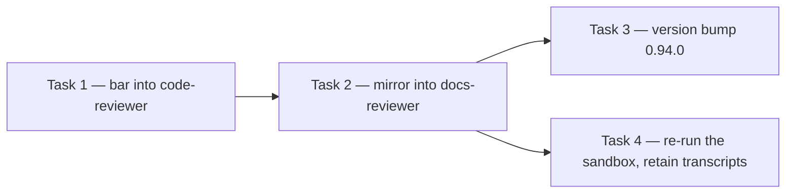

# Plan: code-as-spec lens no-op bar

**Source brief**: docs/loom/specs/2026-08-22-code-as-spec-lens-no-op-bar.md
Goal: One sentence added to the lens in both agent contracts — a diff that
    adds or changes any docstring or comment line makes this dimension never
    a no-op — plus the version bump that puts it in force, and a re-run of
    the existing sandbox to see whether the route it targets is closed.
Stage: finishing
Steps:
    1. 先在程式碼審查臂立下禁令
    2. 鏡像到文件審查臂，兩邊一起被測試釘住
    3. 發版讓它生效，並拿原沙盒實測有沒有堵住
**Total tasks**: 4
**Critical-path depth**: 3 (must be ≤5; if >5 route back to brainstorming)
**Execution order**: parallel-where-possible
**Plan-document-reviewer verdict**: PASS (2026-08-22, round 2)

## Task-flow diagram

## Open Questions

- OQ-1 [RESOLVED] — Can the re-run use the registered `loom-code:code-reviewer`
  agent type before merge? → resolved: no. The agent type resolves from the
  plugin cache, which tracks the marketplace clone of `main`; a feature
  branch is invisible to it (repo memory:
  `marketplace 來源是 github 非本地路徑`, and this arc's own deployed run,
  which was only possible after merge). Task 4 therefore runs the
  general-purpose proxy against the edited contract text, which is what the
  original NEW arms did; the deployed re-run is a post-merge follow-up
  recorded in Notes.

## Task 1 — Add the no-op bar to the code arm

- **Description**: Add one sentence to the `##### Code-as-spec lens` section of `loom-code/agents/code-reviewer.md` barring the reviewer from reporting the dimension as not applicable when the diff touches docstring or comment lines.
  - The sentence must permit a genuine PASS with no findings; what it bars is declaring the dimension out of scope for the branch, which is the route `deployed-arm-1.md` took.
  - Place it in its own sentence, not spliced into an existing one — repo memory: `splicing-into-a-pinned-sentence-creates-false-readings`.
  - Confirm before editing that the insertion point is outside every `distribute.py`-managed BEGIN/END region, which CI byte-compares via `verify-drift.py`.
- **Module**: loom-code/agents
- **Files touched**: loom-code/agents/code-reviewer.md, loom-code/scripts/test_code_as_spec_no_op_bar.py
- **Context paths**:
  - /Users/kouko/GitHub/monkey-skills/loom-code/agents/code-reviewer.md
  - /Users/kouko/GitHub/monkey-skills/docs/skill-dogfood/2026-08-22-code-as-spec-reviewer-lens/transcripts/deployed-arm-1.md
  - /Users/kouko/GitHub/monkey-skills/docs/loom/specs/2026-08-22-code-as-spec-lens-no-op-bar.md
- **Acceptance**:
  - **RED**: `test_code_as_spec_no_op_bar.py::test_code_arm_bars_the_no_op_declaration` fails today because the sentence is absent from `code-reviewer.md`.
    - The assertion reads the WORKING TREE, never a committed blob — an implementer cannot commit, so a test reading committed content can never go green in this workflow.
    - It flattens whitespace before matching, because the sentence wraps across physical lines and a raw substring assertion would be false-green (repo memory: `a-prose-literal-assertion-is-false-green-until-it-flattens-whitespace`).
  - **GREEN**: The test passes with the sentence present in `code-reviewer.md`, and the full `loom-code/scripts` suite stays green.
- **Dependencies**: none
- **Independent**: false
- **Brief item covered**: BI-1
- **Status**: done(fbe66cd4)
- **Gloss**: 讓審查者不能再宣告「這個維度本分支不適用」——這正是部署臂 1 掛零的那條路

## Task 2 — Mirror the bar into the docs arm

- **Description**: Add the same bar, adapted to the docs arm's material, to the `## Code-as-spec lens` section of `loom-code/agents/docs-reviewer.md`, and extend the Task 1 test to pin both files.
  - The docs arm reviews contract-class `.md`, so its trigger is a diff that adds or changes prose lines in its scope, not docstrings.
  - The two sentences need not be byte-identical, but each must bar the same thing; the test pins the shared clause.
- **Module**: loom-code/agents
- **Files touched**: loom-code/agents/docs-reviewer.md, loom-code/scripts/test_code_as_spec_no_op_bar.py
- **Context paths**:
  - /Users/kouko/GitHub/monkey-skills/loom-code/agents/docs-reviewer.md
  - /Users/kouko/GitHub/monkey-skills/loom-code/agents/code-reviewer.md
- **Acceptance**:
  - **RED**: `test_code_as_spec_no_op_bar.py::test_docs_arm_bars_the_no_op_declaration` fails today because the sentence is absent from `docs-reviewer.md`.
  - **GREEN**: Both tests pass, and the full `loom-code/scripts` suite stays green.
- **Dependencies**: Task 1 completes first
- **Independent**: false
- **Brief item covered**: BI-2, BI-3
- **Status**: done(5221564c)
- **Gloss**: 文件審查臂拿到同一條禁令，兩邊同時被測試釘住，避免只修一半

## Task 3 — Bump loom-code to 0.94.0 across its coupled sites

- **Description**: Bump the plugin version so the edited contracts actually deploy, updating every coupled site in one task.
  | Site | Change |
  |---|---|
  | `loom-code/.claude-plugin/plugin.json` `version` field | version → 0.94.0 |
  | `loom-code/.codex-plugin/plugin.json` `version` field | version → 0.94.0 |
  | `loom-code/CHANGELOG.md` | new `## [0.94.0]` heading describing the bar |
  | `plan-document-reviewer-prompt.md`, Check 19's `(vX.Y.Z+)` tag | repinned — a FIFTH site this table originally missed, enforced live by `test_check19_version_tag_matches_shipping_version`, which compares the tag against `plugin.json`'s current value |
  | `loom-code/scripts/test_docs_review_blocking_class.py`, `test_plugin_version_and_changelog_at_0_93_0` | `test_plugin_version_and_changelog_at_0_93_0` renamed, its two assertions and its docstring repinned to 0.94.0 |
- **Module**: loom-code
- **Files touched**: loom-code/.claude-plugin/plugin.json, loom-code/.codex-plugin/plugin.json, loom-code/CHANGELOG.md, loom-code/scripts/test_docs_review_blocking_class.py
- **Context paths**:
  - /Users/kouko/GitHub/monkey-skills/loom-code/scripts/test_docs_review_blocking_class.py
  - /Users/kouko/GitHub/monkey-skills/loom-code/CHANGELOG.md
- **Acceptance**:
  - **RED**: `test_docs_review_blocking_class.py::test_plugin_version_and_changelog_at_0_94_0` fails once repinned, because both `plugin.json` files and the CHANGELOG still read 0.93.0.
  - **GREEN**: The repinned test passes and the full `loom-code/scripts` suite stays green.
    - Without this bump `plugin update` is a silent no-op and the branch's behavioural effect is zero — the recurrence this repo has now hit four times.
- **Dependencies**: Task 2 completes first
- **Independent**: true
- **Brief item covered**: BI-4
- **Status**: done(384041fc)
- **Gloss**: 沒有 bump，合併後外掛更新是靜默 no-op，這一行等於沒改

## Task 4 — Re-run the sandbox against the edited contract and retain the transcripts

- **Description**: Re-run the blind dogfood against the unchanged sandbox using the edited contract text, and write every arm's verdict to `transcripts/` verbatim whatever the outcome.
  - Two arms, `sonnet`, general-purpose agents handed the edited `code-reviewer.md` as their role prompt — the same rig the NEW arms used, because the registered agent type cannot see a feature branch (OQ-1).
  - Retention is unconditional. The run this arc could not inspect is the one whose transcript was never kept.
  - Record the outcome in the dogfood README's results table as two further columns, and state plainly whether the deletion class moved.
- **Module**: docs/skill-dogfood/2026-08-22-code-as-spec-reviewer-lens
- **Files touched**: docs/skill-dogfood/2026-08-22-code-as-spec-reviewer-lens/README.md, docs/skill-dogfood/2026-08-22-code-as-spec-reviewer-lens/transcripts/barred-arm-1.md, docs/skill-dogfood/2026-08-22-code-as-spec-reviewer-lens/transcripts/barred-arm-2.md
- **Context paths**:
  - /Users/kouko/GitHub/monkey-skills/docs/skill-dogfood/2026-08-22-code-as-spec-reviewer-lens/README.md
  - /Users/kouko/GitHub/monkey-skills/docs/skill-dogfood/2026-08-22-code-as-spec-reviewer-lens/sandbox
- **Acceptance**:
  - **RED**: `transcripts/barred-arm-1.md` and `barred-arm-2.md` do not exist, and the README's results table has no column for the barred contract.
  - **GREEN**: Both transcripts exist carrying each arm's verdict block verbatim, and the README reports the deletion-class outcome including the case where it did not move.
- **Dependencies**: Task 2 completes first
- **Independent**: true
- **Review-weight**: prose
- **Brief item covered**: BI-5
- **Status**: done(c1e39a1a)
- **Gloss**: 拿同一個沙盒實測這一行有沒有用，結果不論好壞都逐字留檔

## Notes

- Cross-arc ordering: the deployed re-run — the same sandbox against the
  registered `loom-code:code-reviewer` agent type — is a post-merge follow-up,
  not a task here. It needs `plugin update` after merge, per OQ-1.
- The deferred A/B on whether the writing rule extends to skill bodies runs
  after this arc, from
  `docs/loom/backlog/2026-08-21-code-as-spec-writing-rule-and-its-deferred-ab.md`.

## Decision Log

- The artifact-duty design (a per-sentence classification table gating the
  dimension score) was considered and rejected before planning. The contract
  already carries a prose-demanded enumeration duty at
  `loom-code/agents/code-reviewer.md` §D10's **Operational check** paragraph, and the arm that declared the
  lens a no-op skipped that duty too — so the design had already been tested
  here, and failed. Full reasoning in the brief's `## Decision`.

## Notes — review rounds

- Round 1 NEEDS_REVISION, four gaps, all accepted: three `Review-weight`
  declarations that did not meet their eligibility bars, and a wrong line
  range with a wrong assertion count.
- Round 2 PASS, 17/17, with one informational note outside verdict scope:
  another line range off by one at both ends, in the Decision Log.
- Three citation defects, all the same error: a range read off `sed` output,
  whose leading blank lines are invisible at the top of the output. Zero
  defects landed on the anchors those cites were paired with.
- Amendment after PASS: every `path:line` in this plan and its brief was
  converted to the stable anchor it was already paired with — the heading,
  the role-contract item, the function name, the field. `plan-format.md`
  §Stated facts already requires the pairing and states why ("line numbers
  alone rot in flight"); this amendment drops the half that rots and keeps
  the half that resolves. No asserted fact changed — each cite still points
  at the same text — so this is a citation-form conformance fix, recorded
  here rather than silently applied.
- Task 3 correction: this plan and its brief both said the version pin lives
  in FOUR coupled sites. It lives in five. The implementer's grep found
  Check 19's `(v0.93.0+)` tag in `plan-document-reviewer-prompt.md`, which a
  live test binds to `plugin.json`'s current value, and reported it rather
  than silently absorbing it. Corrected in both documents.
