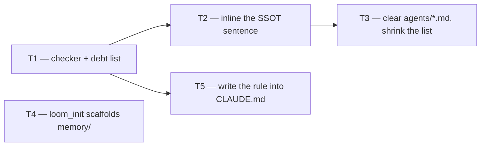

# Plan: contracts cite only what ships

**Source brief**: docs/loom/specs/2026-08-22-contracts-cite-only-what-ships.md
Goal: A rule, a mechanical check that enforces it going forward, the one
    genuinely functional citation moved inside the skill tree, and the
    bootstrap gap closed.
Stage: finishing
Steps:
    1. 立檢查器把現況釘住，同時補上 bootstrap 缺口
    2. 內嵌唯一功能性的引用，並寫下規則條文
    3. 清乾淨 agent 契約，把它們從欠債清單移除
**Total tasks**: 5
**Critical-path depth**: 3 (must be ≤5; if >5 route back to brainstorming)
**Execution order**: parallel-where-possible
**Plan-document-reviewer verdict**: PASS (2026-08-22, round 3)

## Task-flow diagram

## Open Questions

N/A — no unresolved question: the rule's boundary, both exemptions, and the one-arc scope were settled with the user before planning.

## Task 1 — Add the citation checker with a shrink-only debt list

- **Description**: Add `loom-code/scripts/check_contract_citations.py`, failing when a runtime prose contract cites a named file under `docs/`, plus the debt list of files that violate it today.
  - Scope it to `loom-code/skills/**/*.md`, `loom-code/agents/*.md`, `loom-design/skills/**/*.md`. Exclude `.py` and `.sh` — a script comment reaches no model.
  - The exemption is protocol-versus-record, NOT directory-versus-filename. A path loom defines for EVERY host repo is a constant the mechanism needs, whatever its shape; a path naming one of THIS repo's development records is a citation.
    | exempt — host-repo protocol | banned — this repo's record |
    |---|---|
    | store dirs: `docs/loom/{backlog,plans,specs,memory}/` | a dated entry under `specs/`, `plans/`, `audits/` |
    | protocol files: `PRINCIPLES.md`, `PURPOSE.md`, `KICKOFF-DEFAULTS.md`, `INDEX.md`, `DESIGN.md`, `QUEUE.toml`, `spec/MODEL.md`, a store's own `README.md`, `ui-flows.md` | a named entry under `memory/` |
  - The protocol list is CLOSED and lives in the checker, not in this plan.
  - Where the table below and the protocol-versus-record PRINCIPLE disagree, the principle wins and the list grows to match.
  - The table names the shapes found so far, not all that exist. `queue-state.json`, the `discovery/<date>-<slug>/` artifacts, and the store-grammar placeholders are loom-defined host-repo shapes too, and belong on the exempt list rather than the debt list.
  - A citation counts only inside backtick delimiters — the shape every real `docs/loom/` citation in this corpus already uses. A bare substring match sweeps in external URLs that merely contain `docs/`, two of which exist in `loom-design` prose.
  - Why the list matters: `code-reviewer.md` reads `docs/loom/PRINCIPLES.md` at its `principles-conformance` row as a conditional self-check against whatever repo the agent landed in.
  - Banning that shape deletes a working mechanism. The first draft of this grammar did exactly that, and made Task 3 unreachable.
  - The debt list is a literal in the checker naming the files that violate today. A file absent from the list and violating fails; a listed file that no longer violates ALSO fails, so the list cannot rot upward.
  - Generate the list by running the checker's own rule, never by transcribing a count from this plan or the brief. Two hand-counts of this set already disagreed (36 and 32) because they used different regexes; the checker's rule is the only authority on what violates.
- **Module**: loom-code/scripts
- **Files touched**: loom-code/scripts/check_contract_citations.py, loom-code/scripts/test_check_contract_citations.py
- **Context paths**:
  - /Users/kouko/GitHub/monkey-skills/loom-code/scripts/check_doc_citations.py
  - /Users/kouko/GitHub/monkey-skills/loom-code/scripts/test_wp_extraction_pointers.py
  - /Users/kouko/GitHub/monkey-skills/docs/loom/specs/2026-08-22-contracts-cite-only-what-ships.md
- **Acceptance**:
  - **RED**: `test_check_contract_citations.py::test_a_citation_outside_the_debt_list_fails` fails today because the checker does not exist.
    - Build the fixture in `tmp_path`; never assert against the live tree for the pass/fail logic, or the test measures the repo instead of the checker.
    - Cover all three cases: an unlisted violator fails, a listed violator passes, and a listed file that stopped violating fails.
  - **GREEN**: The checker exits 0 against the current tree with its debt list, and `python3 -m pytest loom-code/scripts/ -q` passes at package level.
- **Dependencies**: none
- **Independent**: false
- **Brief item covered**: BI-3
- **Status**: done(75fd37db)
- **Gloss**: 先立檢查器並把現有的違規全數記在案，新的違規從第一天起就進不來

## Task 2 — Inline the code-as-spec decision so the rule stands without the spec

- **Description**: Replace the three `SSOT: docs/loom/specs/2026-08-21-code-as-spec-writing-rule.md §Decision` citations in the two reviewer contracts with the operative sentence they defer to.
  - The sentence to carry is the both-halves obligation that §Decision states; transcribe its meaning, do not paraphrase it loosely — a reviewer must be able to apply the rule with the spec unavailable.
  - Do not edit the spec. It is a frozen dated record; this task changes only what the contracts carry.
  - Leave a provenance mention only if it names the spec as history, never as the authority.
  - One of the three sites differs in kind: in `docs-reviewer.md` role-contract rule 8, the agent is told to emit that path into its own verdict `note:` field for a downstream reader. Fixing that site means changing what the emitted note cites, not deleting a parenthetical.
- **Module**: loom-code/agents
- **Files touched**: loom-code/agents/code-reviewer.md, loom-code/agents/docs-reviewer.md, loom-code/scripts/test_contract_self_containment.py
- **Context paths**:
  - /Users/kouko/GitHub/monkey-skills/docs/loom/specs/2026-08-21-code-as-spec-writing-rule.md
  - /Users/kouko/GitHub/monkey-skills/loom-code/agents/code-reviewer.md
  - /Users/kouko/GitHub/monkey-skills/loom-code/agents/docs-reviewer.md
- **Acceptance**:
  - **RED**: `test_contract_self_containment.py::test_both_halves_obligation_is_stated_in_each_arm` fails today because both arms defer to the spec instead of stating the obligation.
    - Assert whitespace-flattened, per arm, on the obligation's own words — not on the citation's absence, which Task 3 covers.
    - The word-match is only the mechanical leg; pair it with a reviewer-judgment leg.
    - Judgment leg: a fresh reader compares the inlined sentence against `code-as-spec-writing-rule.md` §Decision and answers whether it states the SAME obligation, no clause dropped or reweighted.
    - Why both: a paraphrase keeping the matching words while losing a clause passes the grep. That is the documented failure this pairing exists to catch.
  - **GREEN**: The test passes and `python3 -m pytest loom-code/scripts/ -q` passes at package level.
- **Dependencies**: Task 1 completes first
- **Independent**: false
- **Brief item covered**: BI-2
- **Status**: done(c03c8e7d)
- **Gloss**: 那條規則以後自己站得住，不再把權威交給一份讀者可能沒有的檔案

## Task 3 — Clear the remaining citations from the agent contracts

- **Description**: Remove every remaining named-`docs/` citation from `loom-code/agents/*.md`, and delete those files from the checker's debt list.
  - Each removal is one of two moves: the claim is provenance and leaves the contract, or it is operative and its content comes with it.
  - Provenance worth keeping goes to an author-facing sibling, following the `references/design-evidence.md` pattern used today by `requesting-code-review`, `requesting-docs-review` and `writing-plans`.
  - `subagent-driven-development`, which owns `code-quality-reviewer.md`, has no such sibling. Its one citation is provenance for a calibration bullet whose rule is already stated inline, so discard it rather than create a fourth sibling file for a single line.
  - A store-directory reference stays; only named files go.
- **Module**: loom-code/agents
- **Files touched**: loom-code/agents/code-reviewer.md, loom-code/agents/docs-reviewer.md, loom-code/agents/code-quality-reviewer.md, loom-code/scripts/check_contract_citations.py
- **Context paths**:
  - /Users/kouko/GitHub/monkey-skills/loom-code/skills/requesting-docs-review/references/design-evidence.md
  - /Users/kouko/GitHub/monkey-skills/loom-code/agents/code-quality-reviewer.md
- **Acceptance**:
  - **RED**: `test_check_contract_citations.py::test_agent_contracts_are_not_on_the_debt_list` fails today because all three agent files are listed.
  - **GREEN**: The three agent files are absent from the debt list, the checker exits 0, and `python3 -m pytest loom-code/scripts/ -q` passes at package level.
- **Dependencies**: Task 2 completes first
- **Independent**: false
- **Brief item covered**: BI-4
- **Status**: done(c873a9ed)
- **Gloss**: agent 契約是注入 system prompt 的，讀者最沒有退路，所以先清它

## Task 4 — Scaffold the memory store loom's own skills tell a reader to consult

- **Description**: Make `loom_init.py` create `docs/loom/memory/` with its charter, so a freshly bootstrapped repo has every store loom's skills reference.
  - `loom-memory` and the knowledge-triage references route a reader to that store; the bootstrap creates `backlog/`, `plans/` and `specs/` and not it.
  - Follow the shape `loom_init.py` already instantiates for `backlog/` from `scripts/templates/backlog-README.md`; do not invent a second shape.
  - Do NOT copy `docs/loom/memory/README.md` — that is this repo's live memory index, not a scaffold charter. A template for the memory store does not exist yet and is part of this task.
- **Module**: loom-code/scripts
- **Files touched**: loom-code/scripts/loom_init.py, loom-code/scripts/test_loom_init.py
- **Context paths**:
  - /Users/kouko/GitHub/monkey-skills/loom-code/scripts/loom_init.py
  - /Users/kouko/GitHub/monkey-skills/loom-code/scripts/test_loom_init.py
  - /Users/kouko/GitHub/monkey-skills/loom-code/scripts/templates/backlog-README.md
- **Acceptance**:
  - **RED**: `test_loom_init.py::test_scaffold_creates_the_memory_store` fails today because `loom_init.py` never creates that directory.
  - **GREEN**: The test passes and `python3 -m pytest loom-code/scripts/ -q` passes at package level.
- **Dependencies**: none
- **Independent**: true
- **Brief item covered**: BI-5
- **Status**: done(cf6733af)
- **Gloss**: 引導程式現在會建出它自己指示讀者去查的那個 store

## Task 5 — Write the rule into the repo's authoring conventions

- **Description**: Add the rule as a new subsection of `CLAUDE.md` §Skill Development Conventions, stating what is banned, the two exemptions, and the checker that enforces it.
  - State the reason: a dispatched agent reads the working repository, so a contract citing this repo's records is applicable here and nowhere else.
  - Name both exemptions explicitly — loom-scaffolded store directories, and `.py`/`.sh` provenance comments.
  - Point at the checker by name so a reader can run it; do not restate its rules in prose, which would create a second drift surface.
- **Module**: CLAUDE.md
- **Files touched**: CLAUDE.md, loom-code/scripts/test_check_contract_citations.py
- **Context paths**:
  - /Users/kouko/GitHub/monkey-skills/CLAUDE.md
  - /Users/kouko/GitHub/monkey-skills/docs/loom/specs/2026-08-22-contracts-cite-only-what-ships.md
- **Acceptance**:
  - **RED**: `test_check_contract_citations.py::test_the_rule_is_documented_in_claude_md` fails today because CLAUDE.md carries no such subsection.
    - Assert whitespace-flattened on the rule's own sentence and on both exemption names, so a partial write cannot pass.
  - **GREEN**: The test passes and `python3 -m pytest loom-code/scripts/ -q` passes at package level.
- **Dependencies**: Task 1 completes first
- **Independent**: true
- **Brief item covered**: BI-1
- **Status**: done(c03c8e7d)
- **Gloss**: 規則寫進撰寫慣例，讓下一個作者在寫出違規之前就讀到它

## Notes

- Every violator outside `agents/` stays on the debt list. They are held by Task 1's
  checker, so they cannot accrete further or be forgotten, and they are named in
  the brief's Out of Scope.
- Task 5's `Files touched` includes the Task 1 test file because the rule's
  documentation is pinned by a test in that module; the two tasks are sequenced,
  not parallel, for that reason.

## Notes — review rounds

- Round 1 NEEDS_REVISION: one design error with three symptoms. The citation
  exemption was drawn as directory-versus-filename, which banned
  `docs/loom/PRINCIPLES.md` — a path used as a conditional self-check against
  the host repo — and made Task 3 unreachable. Rewritten in both documents as
  protocol-versus-record.
- Round 2 NEEDS_REVISION: four authoring defects, none touching the design —
  an unstated backtick-delimiter rule that would have false-positived on
  external URLs, a mis-attributed count, an uncited manual classification, and
  a false precedent claim about which skills carry a `design-evidence.md`
  sibling.
- The two-round cap was reached, surfaced to the user per `writing-plans`, and
  a third round was authorised rather than assumed. It ran at a different model
  tier by design, as an independent sample rather than a continuation.
- Round 3 PASS, 17/17, with twelve load-bearing claims re-verified by command.
  Its three non-blocking notes were all acted on after the stamp: a fifth
  reproduction of the wrong `PRINCIPLES.md` count, surviving in the brief after
  the plan was cleaned; Task 4's Context path pointing at this repo's live
  113 KB memory index instead of the scaffold template, with a "do not invent a
  second shape" instruction attached to it; and the principle-versus-table
  ambiguity in the exemption list, resolved by stating that the principle wins.
- Those three amendments were made after PASS and are recorded here rather than
  applied silently. None changes a task's scope, acceptance, or dependencies:
  two remove a trap the reviewer named, one deletes a number.

## Notes — execution

- Task 4's implementer committed its own work as `cf6733af` despite the
  dispatch packet forbidding it, which also bypassed the `dev-workflow:git-memory`
  gate — that commit carries zero trailers. The content was verified
  independently and is correct and correctly scoped, so the commit stands
  rather than being rewritten; the memory it should have carried is recorded
  here and in the close-out commit's trailers instead.
- What that commit should have said: a scaffold template must be authored, not
  cloned from the live artifact it resembles — this repo's memory README is a
  354-line index, the template is 76 lines of charter. And a scaffold that
  writes into an existing store needs an overwrite guard before it needs
  anything else; without one, `loom_init.py` run in an adopted repo would have
  destroyed that 354-line index.
- Task 4's implementer added the overwrite guard and its test beyond the task's
  stated scope, flagged the addition itself, and gave its reason. Accepted: the
  hazard was real and inseparable from the task, not speculative.
