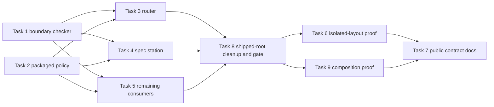

# Plan: independently installable, composable loom plugins

**Source brief**: docs/loom/specs/2026-08-22-independent-composable-loom-plugins.md
Goal: loom-code and loom-design each work from an isolated install root and compose only through public skill names and artifact contracts
Stage: finishing
Steps:
  1. Define the standalone plugin boundary
  2. Package policy and move design-side consumers onto it
  3. Remove remaining shipped-root coupling and gate it
  4. Prove isolated and combined installation behavior
  5. Document the supported composition contract
**Total tasks**: 9
**Critical-path depth**: 5 (≤5)
**Execution order**: parallel-where-possible
**Plan-document-reviewer verdict**: PASS (2026-08-22)

## Task-flow diagram

## Open Questions

N/A — no unresolved question: the approved brief fixes the standalone boundary and the implementation choices are mechanically verifiable.

## Task 1 — Detect plugin-boundary filesystem escapes

- **Description**: Add a stdlib checker that scans one plugin root and reports Markdown links resolving outside that root plus operational references to a sibling plugin's internal `hooks/`, `skills/`, or `scripts/` paths. Unit-test allowed local links, plugin-qualified skill names, and rejected escape forms.
- **Module**: `scripts/check_plugin_boundaries.py`
- **Files touched**: `scripts/check_plugin_boundaries.py`, `scripts/test_check_plugin_boundaries.py`
- **Context paths**:
  - `/Users/kouko/GitHub/monkey-skills/loom-code/scripts/check-skill-crossrefs.py`
  - `/Users/kouko/GitHub/monkey-skills/docs/loom/backlog/2026-08-17-spec-expansion-skill-md-escapes-plugin-boundary-with-a-relative-path.md`
  - `/Users/kouko/GitHub/monkey-skills/docs/loom/specs/2026-08-22-independent-composable-loom-plugins.md`
- **Acceptance**:
  - **RED**: `scripts/test_check_plugin_boundaries.py::test_reports_relative_links_and_internal_paths_that_escape_plugin_root` fails because no boundary scanner exists.
  - **GREEN**: fixture scans report every escaping relative link and sibling-internal path while accepting local links, URLs, anchors, and plugin-qualified skill names.
- **Dependencies**: none
- **Independent**: true
- **Brief item covered**: BI-3
- **Status**: done(a662ebe0)
- **Gloss**: 先讓 CI 看得見「只在 monorepo 才成立」的路徑，之後同類問題不再靠人工發現。

## Task 2 — Package sibling-neutral family policy into both plugins

- **Description**: Extract sibling-neutral family reception, relay, and plain-language policy into a repository SSOT.
  - Add a deterministic sync script that generates plugin-local copies for loom-code and loom-design.
  - Forbid plugin-internal paths in canonical and generated policy, and verify byte-level drift including the managed-copy header.
- **Module**: `scripts/sync_loom_family_contracts.py`
- **Files touched**: `scripts/sync_loom_family_contracts.py`, `scripts/test_sync_loom_family_contracts.py`, `scripts/test_state_anchor_carrier_inventory.py`, `scripts/canonical/loom-family/family-reception.md`, `scripts/canonical/loom-family/family-relay.md`, `scripts/canonical/loom-family/plain-relay.md`, `loom-code/hooks/family-reception.md`, `loom-code/hooks/family-relay.md`, `loom-code/hooks/plain-relay.md`, `loom-design/skills/using-loom-design/references/family-reception.md`, `loom-design/skills/using-loom-design/references/family-relay.md`, `loom-design/skills/using-loom-design/references/plain-relay.md`
- **Context paths**:
  - `/Users/kouko/GitHub/monkey-skills/loom-code/scripts/distribute.py`
  - `/Users/kouko/GitHub/monkey-skills/loom-code/scripts/verify-drift.py`
  - `/Users/kouko/GitHub/monkey-skills/loom-code/hooks/family-reception.md`
  - `/Users/kouko/GitHub/monkey-skills/loom-code/hooks/family-relay.md`
  - `/Users/kouko/GitHub/monkey-skills/loom-code/hooks/plain-relay.md`
- **Acceptance**:
  - **RED**: `scripts/test_sync_loom_family_contracts.py::test_real_functional_copies_match_sibling_neutral_family_policy_ssot` fails because there is no neutral canonical source and current copies preserve plugin-internal paths.
  - **GREEN**: `python3 scripts/sync_loom_family_contracts.py --check` exits 0, every generated file equals its neutral SSOT plus the managed-copy header, and no canonical or generated family-policy file contains a plugin-internal path.
- **Dependencies**: none
- **Independent**: true
- **Brief item covered**: BI-5
- **Status**: done(a662ebe0)
- **Gloss**: 兩個 plugin 各自帶著會用到的規約，但維護者仍只改一份來源。
- **Reuse-adequacy**:
  - **Observed**: `loom-code/scripts/distribute.py` builds deterministic functional copies by prepending an SSOT header to canonical bytes — read loom-code/scripts/distribute.py:103
  - **Intended**: the new sync command applies the same deterministic-copy behavior to sibling-neutral family policy shipped inside both plugins.

## Task 3 — Make the loom-design router self-contained

- **Description**: Replace `using-loom-design` runtime pointers to loom-code hook files with its packaged family-policy references. Preserve plugin-qualified handoffs to `loom-code:using-loom-code` and the existing station routing table.
- **Module**: `loom-design/skills/using-loom-design`
- **Files touched**: `loom-design/skills/using-loom-design/SKILL.md`, `loom-design/scripts/discovery/test_using_skill.py`
- **Context paths**:
  - `/Users/kouko/GitHub/monkey-skills/loom-design/skills/using-loom-design/SKILL.md`
  - `/Users/kouko/GitHub/monkey-skills/loom-design/skills/using-loom-design/references/family-reception.md`
  - `/Users/kouko/GitHub/monkey-skills/loom-design/skills/using-loom-design/references/family-relay.md`
- **Acceptance**:
  - **RED**: `loom-design/scripts/discovery/test_using_skill.py::test_router_uses_only_packaged_family_policy_and_public_code_handoff` fails on the current `loom-code/hooks/*` runtime pointers.
  - **GREEN**: the router resolves all policy references inside loom-design, retains `loom-code:using-loom-code`, and contains no sibling-internal path.
- **Dependencies**: Tasks 1, 2 complete first
- **Independent**: true
- **Brief item covered**: BI-9
- **Status**: done(a662ebe0)
- **Gloss**: 設計入口單獨安裝時仍能做完整分流；兩邊同時存在時，原本的 code handoff 也不變。

## Task 4 — Remove spec-station filesystem coupling

- **Description**: Replace spec-expansion's cross-plugin adjudication-view link and requirement-identifier links with local packaged contracts or plugin-qualified conceptual references. Keep machine-precision language behavior and requirement-id semantics unchanged.
- **Module**: `loom-design/skills/spec-expansion`
- **Files touched**: `loom-design/skills/spec-expansion/SKILL.md`, `loom-design/skills/spec-expansion/references/requirement-identifiers.md`, `loom-design/skills/spec-expansion/references/adjudication-view.md`, `loom-design/scripts/spec/test_spec_expansion_skill.py`, `loom-design/scripts/spec/test_requirement_ids.py`
- **Context paths**:
  - `/Users/kouko/GitHub/monkey-skills/loom-design/skills/spec-expansion/SKILL.md`
  - `/Users/kouko/GitHub/monkey-skills/loom-design/skills/spec-expansion/references/requirement-identifiers.md`
  - `/Users/kouko/GitHub/monkey-skills/loom-code/skills/using-loom-code/protocols/adjudication-view.md`
  - `/Users/kouko/GitHub/monkey-skills/docs/loom/backlog/2026-08-17-spec-expansion-skill-md-escapes-plugin-boundary-with-a-relative-path.md`
- **Acceptance**:
  - **RED**: `loom-design/scripts/spec/test_spec_expansion_skill.py::test_spec_station_has_no_cross_plugin_filesystem_reference` fails on the adjudication-view escape and requirement-id cross-link.
  - **GREEN**: every spec-station Markdown link resolves within loom-design, the local adjudication contract preserves zh-Hant/ja viewing duties, and requirement-id tests retain the same grammar assertions.
- **Dependencies**: Tasks 1, 2 complete first
- **Independent**: true
- **Brief item covered**: BI-8
- **Status**: done(a662ebe0)
- **Gloss**: spec station 不再翻出自己的安裝目錄找檔案，語言顯示與需求編號規則仍保持原意。

## Task 5 — Move remaining design consumers onto local contracts

- **Description**: Update interaction-flow and pipeline policy pointers to the packaged family references, and add focused assertions that optional sibling skills remain optional rather than filesystem requirements.
- **Module**: `loom-design/skills/interaction-flows`
- **Files touched**: `loom-design/skills/interaction-flows/references/ascii-ui-patterns.md`, `loom-design/skills/using-loom-pipeline/SKILL.md`, `loom-design/scripts/interface/test_ascii_ui_patterns.py`, `loom-design/scripts/pipeline/test_pipeline_reception.py`
- **Context paths**:
  - `/Users/kouko/GitHub/monkey-skills/loom-design/skills/interaction-flows/references/ascii-ui-patterns.md`
  - `/Users/kouko/GitHub/monkey-skills/loom-design/skills/using-loom-pipeline/SKILL.md`
  - `/Users/kouko/GitHub/monkey-skills/loom-design/skills/using-loom-design/references/family-relay.md`
  - `/Users/kouko/GitHub/monkey-skills/loom-design/skills/using-loom-design/references/family-reception.md`
- **Acceptance**:
  - **RED**: `loom-design/scripts/pipeline/test_pipeline_reception.py::test_pipeline_reads_packaged_reception_contract` fails because the pipeline names loom-code's hook file.
  - **GREEN**: interaction and pipeline references resolve inside loom-design, while optional plugin-qualified sibling handoffs remain explicit and non-filesystem-based.
- **Dependencies**: Tasks 1, 2 complete first
- **Independent**: true
- **Brief item covered**: BI-1
- **Status**: done(a662ebe0)
- **Gloss**: 其餘設計流程也只讀自己包內的規約，缺少其他 plugin 時會清楚降級而不是找不到檔案。

## Task 6 — Prove standalone and combined install layouts

- **Description**: Add an integration test that copies each plugin into separate temporary version-like roots, scans each root independently, validates both manifests carry no mandatory sibling dependency, and then verifies public skill-name and artifact handoffs when both roots are present.
- **Module**: `scripts/test_loom_plugin_install_layout.py`
- **Files touched**: `scripts/test_loom_plugin_install_layout.py`
- **Context paths**:
  - `/Users/kouko/GitHub/monkey-skills/scripts/check_plugin_boundaries.py`
  - `/Users/kouko/GitHub/monkey-skills/loom-code/.claude-plugin/plugin.json`
  - `/Users/kouko/GitHub/monkey-skills/loom-design/.claude-plugin/plugin.json`
  - `/Users/kouko/GitHub/monkey-skills/docs/loom/backlog/2026-08-10-foreign-repo-cold-start-probe-for-plugin-shipped-mechanisms.md`
- **Acceptance**:
  - **RED**: `scripts/test_loom_plugin_install_layout.py::test_isolated_loom_plugins_are_standalone_and_compose_by_public_contract` fails against the current cross-root references.
  - **GREEN**: isolated loom-code, isolated loom-design, and their combined public-contract probe all pass without either plugin root containing or locating the other.
- **Dependencies**: Task 8 completes first
- **Independent**: true
- **Brief item covered**: BI-4
- **Status**: done(a662ebe0)
- **Gloss**: 驗證環境終於長得像真正安裝後的 cache，而不是只在 monorepo 裡自我證明。

## Task 7 — Publish the standalone composition contract

- **Description**: Document supported standalone behavior, optional cross-plugin handoffs, artifact seams, the sync command, and the isolated-layout verification command. Add manifest tests that forbid mandatory loom-code↔loom-design dependency declarations.
- **Module**: `loom-design/README.md`
- **Files touched**: `loom-design/README.md`, `loom-code/README.md`, `loom-design/scripts/pipeline/test_pipeline_manifests.py`, `loom-code/scripts/test_sync_codex_manifest.py`, `AGENTS.md`
- **Context paths**:
  - `/Users/kouko/GitHub/monkey-skills/loom-design/README.md`
  - `/Users/kouko/GitHub/monkey-skills/loom-code/README.md`
  - `/Users/kouko/GitHub/monkey-skills/loom-design/.claude-plugin/plugin.json`
  - `/Users/kouko/GitHub/monkey-skills/loom-code/.claude-plugin/plugin.json`
  - `/Users/kouko/GitHub/monkey-skills/AGENTS.md`
- **Acceptance**:
  - **RED**: `loom-design/scripts/pipeline/test_pipeline_manifests.py::test_loom_plugins_do_not_mandate_each_other` fails because the standalone composition contract is not asserted or documented.
  - **GREEN**: both READMEs describe independent installation and public seams, manifest tests reject mandatory sibling dependencies, and AGENTS.md declares the new sync and install-layout verification commands.
- **Dependencies**: Tasks 6, 9 complete first
- **Independent**: false
- **Brief item covered**: BI-6
- **Status**: done(a662ebe0)
- **Gloss**: 使用者與維護者都能看見兩個 plugin 各自保證什麼、一起裝時又如何合作。

## Task 8 — Remove shipped-root coupling and gate the real repository

- **Description**: Classify the real-root findings, exclude archival changelogs/research/tech-specs from the install-runtime scan, replace every shipped README/agent/skill sibling-internal pointer with a local contract, public skill seam, or repository URL, then run each real plugin root through the checker in CI.
- **Module**: `.github/workflows/loom-code-ci.yml`
- **Files touched**: `.github/workflows/loom-code-ci.yml`, `scripts/check_plugin_boundaries.py`, `scripts/test_check_plugin_boundaries.py`, `loom-code/README.md`, `loom-code/README.ja.md`, `loom-code/README.zh-TW.md`, `loom-code/agents/implementer.md`, `loom-code/skills/requesting-code-review/references/gate-markers-spec.md`, `loom-code/skills/subagent-driven-development/references/plan-ledger-notes.md`, `loom-code/skills/using-loom-code/references/continuous-mode.md`, `loom-code/skills/writing-plans/SKILL.md`, `loom-code/skills/writing-plans/references/kickoff-briefing.md`, `loom-code/skills/writing-plans/references/plan-format.md`, `loom-design/README.md`, `loom-design/README-interface-design.md`, `loom-design/skills/completeness-critic/SKILL.md`, `loom-design/scripts/spec/test_completeness_critic_skill.py`, `AGENTS.md`
- **Context paths**:
  - `/Users/kouko/GitHub/monkey-skills/scripts/check_plugin_boundaries.py`
  - `/Users/kouko/GitHub/monkey-skills/.github/workflows/loom-code-ci.yml`
  - `/Users/kouko/GitHub/monkey-skills/AGENTS.md`
- **Acceptance**:
  - **RED**: `scripts/test_check_plugin_boundaries.py::test_real_loom_plugins_pass_the_install_boundary_gate` reports every shipped-runtime violation while ignoring pinned archival fixtures.
  - **GREEN**: the real-root test, `python3 scripts/check_plugin_boundaries.py loom-code`, and the corresponding loom-design command all pass; CI and AGENTS.md declare both invocations.
- **Dependencies**: Tasks 3, 4, 5 complete first
- **Independent**: false
- **Brief item covered**: BI-10
- **Status**: done(a662ebe0)
- **Gloss**: 先清掉實際會隨 plugin 載入的耦合，再讓歷史記錄不會被誤判成執行期依賴，最後把同一條規則接進 CI。

## Task 9 — Prove public composition without shared filesystem state

- **Description**: Add a combined-install probe that places the two plugin roots in unrelated temporary directories, confirms design-to-code handoffs remain plugin-qualified, and confirms their shared data seam is limited to named loom artifacts rather than sibling file lookup.
- **Module**: `scripts/test_loom_plugin_composition.py`
- **Files touched**: `scripts/test_loom_plugin_composition.py`
- **Context paths**:
  - `/Users/kouko/GitHub/monkey-skills/loom-design/skills/using-loom-design/SKILL.md`
  - `/Users/kouko/GitHub/monkey-skills/loom-design/skills/spec-expansion/SKILL.md`
  - `/Users/kouko/GitHub/monkey-skills/loom-code/skills/writing-plans/SKILL.md`
  - `/Users/kouko/GitHub/monkey-skills/docs/loom/specs/2026-08-22-independent-composable-loom-plugins.md`
- **Acceptance**:
  - **RED**: `scripts/test_loom_plugin_composition.py::test_plugins_compose_only_through_public_skills_and_artifacts` fails because the current design package still reaches into loom-code internals.
  - **GREEN**: unrelated isolated roots expose the existing plugin-qualified handoffs and named artifacts with no cross-root filesystem resolution.
- **Dependencies**: Task 8 completes first
- **Independent**: true
- **Brief item covered**: BI-2
- **Status**: done(a662ebe0)
- **Gloss**: 兩個 plugin 一起裝時靠公開名稱接上，而不是因為剛好住在相鄰資料夾。

## Notes

Tasks 1 and 2 can run in parallel. After both finish, Tasks 3, 4, and 5 have disjoint primary modules and can run in parallel; Tasks 6 and 9 prove standalone and composition behavior, Task 8 wires the real-root gate, and Task 7 records the verified contract.
