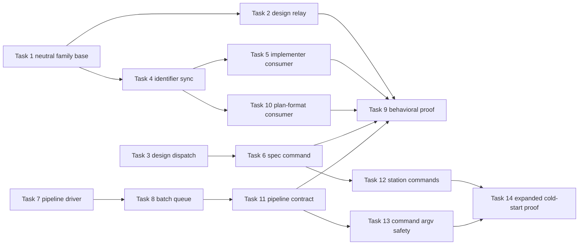

# Plan: specialize loom-design while preserving optional composition

**Source brief**: docs/loom/specs/2026-08-23-loom-design-specialization.md
Goal: loom-design owns design-specific behavior, both plugins own required artifact contracts, and isolated installs execute without sibling assumptions
Stage: finishing
Steps:
  1. Separate shared family policy from design-specific behavior
  2. Package neutral identifiers and repair local consumers
  3. Resolve every pipeline command from the installed plugin root
  4. Prove standalone behavior and confirm the blocked review findings
  5. Close the station-wide path and command-safety gaps found by cumulative review
**Total tasks**: 14
**Critical-path depth**: 5 (≤5)
**Execution order**: parallel-where-possible
**Plan-document-reviewer verdict**: pending

## Task-flow diagram

## Open Questions

N/A — no unresolved question: the user selected separate plugins with loom-design-specific behavior, and the remaining boundaries are mechanically testable.

## Task 1 — Make the shared family policy sibling-optional

- **Description**: Remove unconditional loom-code review and whole-family assumptions from the neutral family relay/reception source, regenerate both plugin copies, and pin explicit sibling-absence behavior without weakening the common stakes-first rules.
- **Module**: `scripts/sync_loom_family_contracts.py`
- **Files touched**: `scripts/canonical/loom-family/family-relay.md`, `scripts/canonical/loom-family/family-reception.md`, `loom-code/hooks/family-relay.md`, `loom-code/hooks/family-reception.md`, `loom-design/skills/using-loom-design/references/family-relay.md`, `loom-design/skills/using-loom-design/references/family-reception.md`, `scripts/test_sync_loom_family_contracts.py`, `loom-design/scripts/pipeline/test_pipeline_reception.py`
- **Context paths**:
  - `/Users/kouko/GitHub/monkey-skills/scripts/sync_loom_family_contracts.py`
  - `/Users/kouko/GitHub/monkey-skills/scripts/canonical/loom-family/family-relay.md`
  - `/Users/kouko/GitHub/monkey-skills/scripts/canonical/loom-family/family-reception.md`
- **Acceptance**:
  - **RED**: `scripts/test_sync_loom_family_contracts.py::test_neutral_family_policy_has_no_mandatory_sibling_skill` fails on the unconditional code-review invocation and whole-family availability claim.
  - **GREEN**: the sync check passes and every generated base contract remains executable when only its owning plugin is installed.
- **Dependencies**: none
- **Independent**: true
- **Brief item covered**: BI-1
- **Status**: done(a662ebe0)
- **Gloss**: 共用底層只保留兩邊都成立的規則，不再假設整個 family 一定存在。

## Task 2 — Add a loom-design-specific relay contract

- **Description**: Route loom-design narration and artifact-review decisions through a local design relay that selects design-critic or completeness-critic by artifact type and uses a complete local fallback for ordinary narration.
- **Module**: `loom-design/skills/using-loom-design`
- **Files touched**: `loom-design/skills/using-loom-design/SKILL.md`, `loom-design/skills/using-loom-design/references/design-relay.md` (NEW), `loom-design/scripts/discovery/test_using_skill.py`
- **Context paths**:
  - `/Users/kouko/GitHub/monkey-skills/loom-design/skills/using-loom-design/SKILL.md`
  - `/Users/kouko/GitHub/monkey-skills/loom-design/skills/design-critic/SKILL.md`
  - `/Users/kouko/GitHub/monkey-skills/loom-design/skills/completeness-critic/SKILL.md`
- **Acceptance**:
  - **RED**: `loom-design/scripts/discovery/test_using_skill.py::test_router_uses_design_specific_relay_without_code_review_dependency` fails because the router has no local design relay.
  - **GREEN**: the router resolves the design relay inside loom-design and ordinary narration never requires a loom-code review skill.
- **Dependencies**: Task 1 completes first
- **Independent**: false
- **Brief item covered**: BI-1
- **Status**: done(a662ebe0)
- **Gloss**: Design 交付件由 design critic 判斷，普通說明則有完整本地規則。

## Task 3 — Add a design-panel dispatch contract

- **Description**: Define loom-design's object/journey/lens fan-out, writer-versus-critic isolation, artifact ownership, and findings union locally; make spec-expansion consume that contract instead of code-oriented dispatch guidance.
- **Module**: `loom-design/skills/spec-expansion`
- **Files touched**: `loom-design/skills/spec-expansion/SKILL.md`, `loom-design/skills/spec-expansion/references/design-panel-dispatch.md` (NEW), `loom-design/scripts/spec/test_spec_expansion_skill.py`
- **Context paths**:
  - `/Users/kouko/GitHub/monkey-skills/loom-design/skills/spec-expansion/SKILL.md`
  - `/Users/kouko/GitHub/monkey-skills/loom-design/skills/completeness-critic/SKILL.md`
  - `/Users/kouko/GitHub/monkey-skills/loom-design/skills/using-loom-design/references/spec-codex-tools.md`
- **Acceptance**:
  - **RED**: `loom-design/scripts/spec/test_spec_expansion_skill.py::test_object_fanout_uses_packaged_design_panel_contract` fails on `loom-code:dispatching-parallel-agents`.
  - **GREEN**: object fan-out resolves a local design-panel contract and preserves one-object-per-worker plus writer/critic role boundaries.
- **Dependencies**: none
- **Independent**: true
- **Brief item covered**: BI-1
- **Status**: done(a662ebe0)
- **Gloss**: Design 分派以 object、journey、critic lens 為單位，不再借用 code module 的平行規則。

## Task 4 — Extend deterministic sync to neutral identifier grammar

- **Description**: Add one canonical requirement/brief identifier grammar and generate plugin-local copies into loom-design and loom-code without changing the existing grammar semantics.
- **Module**: `scripts/sync_loom_family_contracts.py`
- **Files touched**: `scripts/canonical/loom-artifacts/requirement-identifiers.md` (NEW), `scripts/sync_loom_family_contracts.py`, `scripts/test_sync_loom_family_contracts.py`, `loom-design/skills/spec-expansion/references/requirement-identifiers.md`, `loom-code/skills/writing-plans/references/requirement-identifiers.md` (NEW), `loom-design/scripts/spec/test_requirement_ids.py`
- **Context paths**:
  - `/Users/kouko/GitHub/monkey-skills/scripts/sync_loom_family_contracts.py`
  - `/Users/kouko/GitHub/monkey-skills/loom-design/skills/spec-expansion/references/requirement-identifiers.md`
  - `/Users/kouko/GitHub/monkey-skills/loom-design/scripts/spec/test_requirement_ids.py`
- **Acceptance**:
  - **RED**: `scripts/test_sync_loom_family_contracts.py::test_identifier_grammar_has_one_neutral_source_and_two_packaged_copies` fails because the canonical source and loom-code copy do not exist.
  - **GREEN**: both copies equal the neutral source plus managed header, and the existing requirement-id grammar suite remains unchanged and green.
- **Dependencies**: Task 1 completes first
- **Independent**: false
- **Brief item covered**: BI-3
- **Status**: done(a662ebe0)
- **Gloss**: BI／REQ 格式維護一份，兩邊各自安裝時都能讀懂。
- **Reuse-adequacy**:
  - **Observed**: `ROUTE` maps a canonical source to multiple managed destinations — read scripts/sync_loom_family_contracts.py:20
  - **Intended**: reuse that data-driven copy mechanism for identifier grammar; do not create a second sync engine.

## Task 5 — Make the loom-code implementer consume its local identifier contract

- **Description**: Point the implementer at loom-code's packaged identifier grammar while keeping spec expansion as an optional upstream handoff rather than a runtime grammar dependency.
- **Module**: `loom-code/agents/implementer.md`
- **Files touched**: `loom-code/agents/implementer.md`, `loom-code/scripts/test_agent_contract.py`, `loom-code/scripts/test_implementer_req_tag_guard.py`
- **Context paths**:
  - `/Users/kouko/GitHub/monkey-skills/loom-code/agents/implementer.md`
  - `/Users/kouko/GitHub/monkey-skills/loom-code/skills/writing-plans/references/requirement-identifiers.md`
  - `/Users/kouko/GitHub/monkey-skills/loom-code/scripts/test_implementer_req_tag_guard.py`
- **Acceptance**:
  - **RED**: `loom-code/scripts/test_agent_contract.py::test_implementer_uses_packaged_requirement_identifier_contract` fails on the mandatory `loom-design:spec-expansion` grammar instruction.
  - **GREEN**: loom-code resolves identifier semantics locally and names loom-design only as an optional upstream spec-authoring handoff.
- **Dependencies**: Task 4 completes first
- **Independent**: true
- **Brief item covered**: BI-4
- **Status**: done(a662ebe0)
- **Gloss**: Code agent 自己能解讀 REQ，不需為了格式去啟動 design plugin。

## Task 6 — Make spec-expansion commands install-root-relative

- **Description**: Replace checkout-shaped validator examples with an installed loom-design root contract and execute the documented command from an arbitrarily named copied plugin root.
- **Module**: `loom-design/skills/spec-expansion`
- **Files touched**: `loom-design/skills/spec-expansion/SKILL.md`, `loom-design/scripts/spec/test_spec_expansion_skill.py`
- **Context paths**:
  - `/Users/kouko/GitHub/monkey-skills/loom-design/skills/spec-expansion/SKILL.md`
  - `/Users/kouko/GitHub/monkey-skills/loom-design/scripts/spec/mint_critic_verdict.py`
  - `/Users/kouko/GitHub/monkey-skills/loom-design/scripts/spec/test_spec_expansion_skill.py`
- **Acceptance**:
  - **RED**: `loom-design/scripts/spec/test_spec_expansion_skill.py::test_validator_command_executes_from_arbitrarily_named_plugin_root` fails on the literal parent-path `loom-design/scripts` assumption.
  - **GREEN**: the documented interpreter-qualified command resolves and executes from the installed plugin root regardless of directory name.
- **Dependencies**: Task 3 completes first
- **Independent**: false
- **Brief item covered**: BI-5
- **Status**: done(a662ebe0)
- **Gloss**: Spec station 從自己的安裝根目錄找 validator，不猜 monorepo 路徑。

## Task 7 — Make pipeline segment 2 install-root-relative

- **Description**: Retain the `skillsRoot` property name for host compatibility but redefine its value as the installed loom-design plugin root, rebuild the generated asset, and run segment 2 against an arbitrarily named copied root.
- **Module**: `loom-design/scripts/pipeline/driver_40_seg2.js`
- **Files touched**: `loom-design/scripts/pipeline/driver_40_seg2.js`, `loom-design/scripts/pipeline/test_pipeline_driver_seg2.py`, `loom-design/scripts/pipeline/test_driver_root_contract.py` (NEW), `loom-design/skills/using-loom-pipeline/assets/loom-pipeline.js`
- **Context paths**:
  - `/Users/kouko/GitHub/monkey-skills/loom-design/scripts/pipeline/driver_40_seg2.js`
  - `/Users/kouko/GitHub/monkey-skills/loom-design/scripts/pipeline/build_driver.py`
  - `/Users/kouko/GitHub/monkey-skills/loom-design/scripts/pipeline/test_pipeline_driver_seg2.py`
- **Acceptance**:
  - **RED**: `loom-design/scripts/pipeline/test_driver_root_contract.py::test_segment2_executes_validator_from_renamed_plugin_root` fails because the driver appends `/loom-design/scripts/...` to a repository parent.
  - **GREEN**: regenerated driver treats `skillsRoot` as `<plugin-root>`, resolves `scripts/spec/validate_spec_output.py`, and the copied-root probe passes without guard/main API changes.
- **Dependencies**: none
- **Independent**: true
- **Brief item covered**: BI-5
- **Status**: done(a662ebe0)
- **Gloss**: Segment 2 直接接收 loom-design 安裝根目錄，不再接收 skills repository 父目錄。

## Task 8 — Make batch queue validation install-root-relative

- **Description**: Change batch queue bookkeeping to accept the installed loom-design root, emit the revised driver argument, and execute validation from an arbitrarily named copied root.
- **Module**: `loom-design/scripts/pipeline/batch_queue.py`
- **Files touched**: `loom-design/scripts/pipeline/batch_queue.py`, `loom-design/scripts/pipeline/test_pipeline_batch_queue.py`
- **Context paths**:
  - `/Users/kouko/GitHub/monkey-skills/loom-design/scripts/pipeline/batch_queue.py`
  - `/Users/kouko/GitHub/monkey-skills/loom-design/scripts/pipeline/test_pipeline_batch_queue.py`
  - `/Users/kouko/GitHub/monkey-skills/loom-design/scripts/pipeline/driver_40_seg2.js`
- **Acceptance**:
  - **RED**: `loom-design/scripts/pipeline/test_pipeline_batch_queue.py::test_next_uses_installed_plugin_root_for_validation` fails because queue dispatch appends a literal `loom-design/scripts` path.
  - **GREEN**: queue validation and emitted driver arguments use the installed plugin root and pass from an unrelated directory name.
- **Dependencies**: Task 7 completes first
- **Independent**: false
- **Brief item covered**: BI-5
- **Status**: done(a662ebe0)
- **Gloss**: Batch mode 與互動 pipeline 使用同一種安裝根目錄契約。

## Task 9 — Prove behavioral standalone operation

- **Description**: Extend the isolated-install proof to resolve local design contracts, local identifier consumers, sibling-absence behavior, and executable validator paths while retaining combined public-skill and artifact-seam checks.
- **Module**: `scripts/test_loom_plugin_install_layout.py`
- **Files touched**: `scripts/test_loom_plugin_install_layout.py`
- **Context paths**:
  - `/Users/kouko/GitHub/monkey-skills/scripts/test_loom_plugin_install_layout.py`
  - `/Users/kouko/GitHub/monkey-skills/scripts/test_loom_plugin_composition.py`
  - `/Users/kouko/GitHub/monkey-skills/docs/loom/specs/2026-08-23-loom-design-specialization.md`
- **Acceptance**:
  - **RED**: `scripts/test_loom_plugin_install_layout.py::test_isolated_plugins_execute_local_behavior_without_sibling` fails when a required local contract or installed-root command is removed from a copied plugin.
  - **GREEN**: isolated roots execute required local paths without a sibling, and combined roots still resolve only public handoffs plus `docs/loom/` artifacts.
- **Dependencies**: Tasks 2, 5, 6, 10, 11 complete first
- **Independent**: false
- **Brief item covered**: BI-6
- **Status**: done(a662ebe0)
- **Gloss**: Cold-start proof 會執行核心路徑，也會證明移除必要本地能力時確實失敗。

## Task 10 — Make writing-plans consume its local identifier contract

- **Description**: Point plan-format requirement references at loom-code's packaged identifier grammar and preserve the same task/scenario join semantics without consulting loom-design.
- **Module**: `loom-code/skills/writing-plans/references/plan-format.md`
- **Files touched**: `loom-code/skills/writing-plans/references/plan-format.md`, `loom-code/scripts/test_plan_format_contract.py`
- **Context paths**:
  - `/Users/kouko/GitHub/monkey-skills/loom-code/skills/writing-plans/references/plan-format.md`
  - `/Users/kouko/GitHub/monkey-skills/loom-code/skills/writing-plans/references/requirement-identifiers.md`
  - `/Users/kouko/GitHub/monkey-skills/loom-code/scripts/test_plan_format_contract.py`
- **Acceptance**:
  - **RED**: `loom-code/scripts/test_plan_format_contract.py::test_plan_format_uses_packaged_requirement_identifier_contract` fails on the loom-design grammar pointer.
  - **GREEN**: plan-format resolves its local packaged grammar and retains all existing REQ/scenario join assertions.
- **Dependencies**: Task 4 completes first
- **Independent**: true
- **Brief item covered**: BI-4
- **Status**: done(a662ebe0)
- **Gloss**: Plan schema 也只讀 loom-code 自己帶的格式契約。

## Task 11 — Publish the installed-root pipeline contract

- **Description**: Update the public pipeline skill to define `skillsRoot` as the installed loom-design root, use plugin-root-relative batch commands, and preserve genuine plugin-qualified code-stage agents and skills.
- **Module**: `loom-design/skills/using-loom-pipeline`
- **Files touched**: `loom-design/skills/using-loom-pipeline/SKILL.md`, `loom-design/scripts/pipeline/argv_exec.py`, `loom-design/scripts/pipeline/test_argv_exec.py`, `loom-design/scripts/pipeline/test_pipeline_skill_contract.py`
- **Context paths**:
  - `/Users/kouko/GitHub/monkey-skills/loom-design/skills/using-loom-pipeline/SKILL.md`
  - `/Users/kouko/GitHub/monkey-skills/loom-design/scripts/pipeline/driver_40_seg2.js`
  - `/Users/kouko/GitHub/monkey-skills/loom-design/scripts/pipeline/batch_queue.py`
- **Acceptance**:
  - **RED**: `loom-design/scripts/pipeline/test_pipeline_skill_contract.py::test_pipeline_public_commands_use_installed_plugin_root_and_preserve_code_handoffs` fails on checkout-shaped batch commands.
  - **GREEN**: every public pipeline command resolves below the installed loom-design root, while Segment 3 retains its plugin-qualified loom-code agents and review skills.
- **Dependencies**: Tasks 7, 8 complete first
- **Independent**: false
- **Brief item covered**: BI-2
- **Status**: done(a662ebe0)
- **Gloss**: Full conductor 仍是兩-plugin 組合，但它自己的命令不再依賴 monorepo 形狀。

## Task 12 — Make every interactive design station install-root-relative

- **Description**: Replace checkout-shaped validator, critic-tool, and pairwise commands across every remaining interactive design station with the installed loom-design root contract.
- **Module**: `loom-design/skills`
- **Files touched**: the eight affected station `SKILL.md` files and their existing discovery, principles, interface, and spec contract tests
- **Context paths**:
  - `/Users/kouko/GitHub/monkey-skills/loom-design/skills/`
  - `/Users/kouko/GitHub/monkey-skills/loom-design/scripts/discovery/`
  - `/Users/kouko/GitHub/monkey-skills/loom-design/scripts/principles/`
  - `/Users/kouko/GitHub/monkey-skills/loom-design/scripts/interface/`
  - `/Users/kouko/GitHub/monkey-skills/loom-design/scripts/spec/`
- **Acceptance**:
  - **RED**: `scripts/test_loom_plugin_install_layout.py::test_all_interactive_station_commands_resolve_from_installed_root` fails on any `loom-design/scripts` or bare `../../scripts` operational command.
  - **GREEN**: each station command resolves beneath `${CLAUDE_PLUGIN_ROOT}` and its real validator or verdict tool executes from an arbitrarily named copied install.
- **Dependencies**: Task 6 completes first
- **Independent**: true
- **Brief item covered**: BI-7
- **Status**: done(a662ebe0)
- **Gloss**: 不只 pipeline；每個 design station 都能從自己的安裝位置找到工具。

## Task 13 — Make pipeline arguments immune to shell re-interpretation

- **Description**: Replace interpolated shell examples with an argv contract so paths, identifiers, and reasons remain literal data even when they contain shell metacharacters.
- **Module**: `loom-design/skills/using-loom-pipeline`
- **Files touched**: `loom-design/skills/using-loom-pipeline/SKILL.md`, `loom-design/scripts/pipeline/test_pipeline_skill_contract.py`
- **Context paths**:
  - `/Users/kouko/GitHub/monkey-skills/loom-design/skills/using-loom-pipeline/SKILL.md`
  - `/Users/kouko/GitHub/monkey-skills/loom-design/scripts/pipeline/test_pipeline_skill_contract.py`
  - `/Users/kouko/GitHub/monkey-skills/loom-design/scripts/pipeline/batch_queue.py`
- **Acceptance**:
  - **RED**: `loom-design/scripts/pipeline/test_pipeline_skill_contract.py::test_pipeline_dynamic_values_are_passed_as_literal_argv` proves the old double-quoted substitution executes hostile shell syntax.
  - **GREEN**: documented invocations preserve double quotes, dollar signs, command substitutions, backticks, and newlines as literal argv values without side effects.
- **Dependencies**: Task 11 completes first
- **Independent**: true
- **Brief item covered**: BI-8
- **Status**: done(a662ebe0)
- **Gloss**: 動態值是參數資料，不再是會被 shell 再解讀的命令文字。

## Task 14 — Expand the standalone proof to every command family

- **Description**: Extend the isolated-install probe so discovery, principles, interface, critic, spec, and pipeline command families execute their documented installed-root contract.
- **Module**: `scripts/test_loom_plugin_install_layout.py`
- **Files touched**: `scripts/test_loom_plugin_install_layout.py`
- **Context paths**:
  - `/Users/kouko/GitHub/monkey-skills/scripts/test_loom_plugin_install_layout.py`
- **Acceptance**:
  - **RED**: the station matrix fails when any documented tool path is changed back to a checkout-shaped path or any copied tool is replaced with a no-op.
  - **GREEN**: the isolated probe observes success and failure behavior from every command family, with loom-code absent and the install root arbitrarily named.
- **Dependencies**: Tasks 12, 13 complete first
- **Independent**: false
- **Brief item covered**: BI-6
- **Status**: done(a662ebe0)
- **Gloss**: 獨立安裝保證由完整 station matrix 支撐，不只抽查 spec 工具。

## Notes

Tasks 1, 3, and 7 start in parallel. Task 2 follows Task 1; Task 4 follows Task 1; Tasks 5 and 10 follow Task 4; Task 6 follows Task 3; Task 8 follows Task 7; Task 11 follows Task 8. Task 9 closes the original graph. Tasks 12 and 13 repair cumulative-review gaps in parallel; Task 14 is the final expanded proof.
