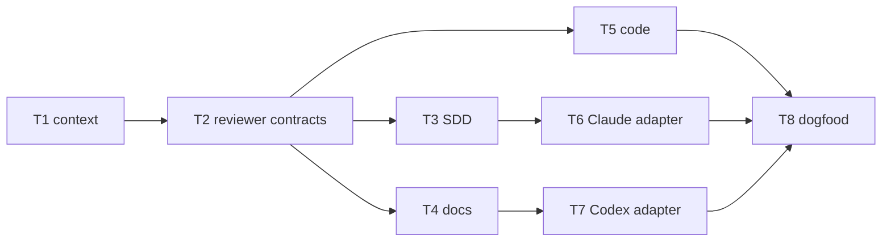

# Plan: cross-host review-gate hardening — part 2

Source brief: docs/loom/specs/2026-08-24-cross-host-review-gate-hardening-part-2.md
Goal: 所有 reviewer 入口都傳遞同一份可攜且可追溯的審查封包，並以獨立安裝情境驗證它。
Stage: blocked:user-decision
Steps:
  1. 擴充共用封包與 reviewer 合約
  2. 將 code、docs、SDD 三個入口接上封包
  3. 補齊 Claude Code 與 Codex adapter 說明
  4. 將 host adapter 接上已固定的入口契約
  5. 以隔離 consumer repo 進行 dogfood
Total tasks: 8
Critical-path depth: 5
Execution order: parallel-where-possible
Plan-document-reviewer verdict: PASS (2026-08-24, round 2, 17/17)

## Task-flow diagram

## Open Questions

N/A — no unresolved question: the user approved splitting this shared-caller repair into a second brief.

## Task 1 — 擴充可攜封包資源清單

- **Description**: Extend the plugin-local context resolver with every approved reviewer resource needed by its caller contracts.
- **Module**: loom-code/scripts/review_context.py
- **Files touched**: loom-code/scripts/review_context.py, loom-code/scripts/test_review_context.py
- **Context paths**:
  - /Users/kouko/GitHub/monkey-skills/loom-code/scripts/review_context.py
  - /Users/kouko/GitHub/monkey-skills/loom-code/scripts/test_review_context.py
- **Acceptance**:
  - **RED**: `test_review_context.py::test_context_includes_all_reviewer_contract_resources` fails because the packet omits a reviewer-required absolute resource.
  - **GREEN**: The copied-plugin fixture emits only existing absolute resources beneath its plugin root for every named reviewer contract.
- **Dependencies**: none
- **Independent**: false
- **Brief item covered**: BI-1
- **Status**: done(d335bc68)
- **Gloss**: reviewer 所需規則都有明確、可驗證的來源，不必自行猜 plugin 路徑。

## Task 2 — 統一 reviewer input 合約

- **Description**: Make the canonical reviewer discipline and generated reviewer input contracts require the complete context packet.
- **Module**: loom-code/scripts/_reviewer-discipline.md
- **Files touched**: loom-code/scripts/_reviewer-discipline.md, loom-code/agents/code-reviewer.md, loom-code/agents/docs-reviewer.md, loom-code/agents/spec-reviewer.md, loom-code/agents/code-quality-reviewer.md, loom-code/scripts/test_reviewer_discipline.py
- **Context paths**:
  - /Users/kouko/GitHub/monkey-skills/loom-code/scripts/_reviewer-discipline.md
  - /Users/kouko/GitHub/monkey-skills/loom-code/scripts/distribute.py
- **Acceptance**:
  - **RED**: `test_reviewer_discipline.py::test_all_reviewer_roles_require_portable_context_packet` fails because one reviewer role accepts no packet contract.
  - **GREEN**: Every generated reviewer role names the same packet fields and reads plugin resources only from its approved absolute paths.
- **Dependencies**: Task 1 completes first
- **Independent**: false
- **Brief item covered**: BI-1, BI-2
- **Status**: done(0148fbd5)
- **Gloss**: 共用規則不再只對 code reviewer 有效，所有 reviewer 都有相同輸入前提。

## Task 3 — 將 SDD reviewer 派工接上封包

- **Description**: Pass the complete context packet and reviewed SHA to SDD's spec, quality, and prose-review dispatches.
- **Module**: loom-code/skills/subagent-driven-development/SKILL.md
- **Files touched**: loom-code/skills/subagent-driven-development/SKILL.md, loom-code/scripts/test_subagent_driven_development_skill.py
- **Context paths**:
  - /Users/kouko/GitHub/monkey-skills/loom-code/skills/subagent-driven-development/SKILL.md
  - /Users/kouko/GitHub/monkey-skills/loom-code/agents/spec-reviewer.md
- **Acceptance**:
  - **RED**: `test_subagent_driven_development_skill.py::test_sdd_reviewer_dispatch_carries_portable_context_packet` fails because SDD lacks packet fields.
  - **GREEN**: Each SDD reviewer dispatch receives unchanged target repo, reviewed SHA, plugin version, and approved resources.
- **Dependencies**: Task 2 completes first
- **Reuse-adequacy**:
  - **Observed**: `resolve_context()` emits target repo, reviewed SHA, plugin version, and resources from its installed script root — read loom-code/scripts/review_context.py:63
  - **Intended**: SDD resolves that existing packet once before its reviewer dispatches, then forwards it unchanged to spec, quality, and prose-review paths.
- **Independent**: true
- **Brief item covered**: BI-1, BI-2
- **Status**: blocked
- **Gloss**: 日常子任務審查不會因為共用規則改版而失去必要資訊。

## Task 4 — 將 docs review 入口接上封包

- **Description**: Resolve and pass the complete context packet through docs review and its terminal current-SHA verdict route.
- **Module**: loom-code/skills/requesting-docs-review/SKILL.md
- **Files touched**: loom-code/skills/requesting-docs-review/SKILL.md, loom-code/scripts/test_requesting_docs_review_skill.py
- **Context paths**:
  - /Users/kouko/GitHub/monkey-skills/loom-code/skills/requesting-docs-review/SKILL.md
  - /Users/kouko/GitHub/monkey-skills/loom-code/agents/docs-reviewer.md
- **Acceptance**:
  - **RED**: `test_requesting_docs_review_skill.py::test_docs_dispatch_carries_portable_context_and_terminal_sha` fails because docs review has no packet contract.
  - **GREEN**: Docs reviewer dispatch and terminal verdict both name the packet reviewed SHA and approved absolute resources.
- **Dependencies**: Task 2 completes first
- **Reuse-adequacy**:
  - **Observed**: `resolve_context()` emits target repo, reviewed SHA, plugin version, and resources from its installed script root — read loom-code/scripts/review_context.py:63
  - **Intended**: The docs-review dispatcher resolves that existing packet once and forwards it unchanged to the docs reviewer and its terminal verdict route.
- **Independent**: true
- **Brief item covered**: BI-1, BI-2
- **Status**: blocked
- **Gloss**: 純文件變更也能在獨立安裝時走完同一套可靠的閘門。

## Task 5 — 完成 code review 入口與聚合訊號

- **Description**: Rework code review dispatch to consume the shared packet and retain R3 and simplification findings before marker minting.
- **Module**: loom-code/skills/requesting-code-review/SKILL.md
- **Files touched**: loom-code/skills/requesting-code-review/SKILL.md, loom-code/scripts/test_review_scope_stations.py, loom-code/scripts/test_review_scope_and_loop.py
- **Context paths**:
  - /Users/kouko/GitHub/monkey-skills/loom-code/skills/requesting-code-review/SKILL.md
  - /Users/kouko/GitHub/monkey-skills/loom-code/agents/code-reviewer.md
- **Acceptance**:
  - **RED**: `test_review_scope_stations.py::test_code_station_packet_has_absolute_context_and_reviewed_sha` fails because code review does not consume the shared contract.
  - **GREEN**: Both panel arms receive the unchanged packet, `review-pass` uses its reviewed SHA, and R3 or simplification evidence prevents a clean marker path.
- **Dependencies**: Task 2 completes first
- **Independent**: true
- **Brief item covered**: BI-1, BI-2
- **Status**: blocked
- **Gloss**: code review 會審到同一個 commit，也不會丟失尚未驗證或可簡化的訊號。

## Task 6 — 說明 Claude Code adapter

- **Description**: Document Claude Code's adapter for resolving and forwarding the common review context to every reviewer dispatch.
- **Module**: loom-code/skills/using-loom-code/references/claude-code-tools.md
- **Files touched**: loom-code/skills/using-loom-code/references/claude-code-tools.md, loom-code/scripts/test_host_adapter_contracts.py
- **Context paths**:
  - /Users/kouko/GitHub/monkey-skills/loom-code/skills/using-loom-code/references/claude-code-tools.md
  - /Users/kouko/GitHub/monkey-skills/loom-code/scripts/review_context.py
- **Acceptance**:
  - **RED**: `test_host_adapter_contracts.py::test_claude_adapter_forwards_portable_review_context` fails because the adapter lacks packet forwarding instructions.
  - **GREEN**: The Claude adapter resolves the installed plugin script and forwards the packet unchanged without a consumer-relative plugin path.
- **Dependencies**: Task 3 completes first
- **Independent**: false
- **Brief item covered**: BI-3
- **Status**: pending
- **Gloss**: Claude Code 的派工方式被明確約束，避免 host 細節讓封包走樣。

## Task 7 — 說明 Codex adapter

- **Description**: Document Codex's adapter for resolving and forwarding the common review context to every reviewer dispatch.
- **Module**: loom-code/skills/using-loom-code/references/codex-tools.md
- **Files touched**: loom-code/skills/using-loom-code/references/codex-tools.md, loom-code/scripts/test_host_adapter_contracts.py
- **Context paths**:
  - /Users/kouko/GitHub/monkey-skills/loom-code/skills/using-loom-code/references/codex-tools.md
  - /Users/kouko/GitHub/monkey-skills/loom-code/scripts/review_context.py
- **Acceptance**:
  - **RED**: `test_host_adapter_contracts.py::test_codex_adapter_forwards_portable_review_context` fails because the adapter lacks packet forwarding instructions.
  - **GREEN**: The Codex adapter resolves the installed plugin script and forwards the packet unchanged without a consumer-relative plugin path.
- **Dependencies**: Task 4 completes first
- **Independent**: false
- **Brief item covered**: BI-3
- **Status**: pending
- **Gloss**: Codex 與 Claude Code 對同一封包採用不同工具語法，但保有相同語意。

## Task 8 — 建立隔離安裝 dogfood

- **Description**: Add a no-quota isolated-consumer dogfood test covering code, docs, and SDD packet routes plus stale-SHA refusal.
- **Module**: loom-code/scripts/test_loom_plugin_composition.py
- **Files touched**: loom-code/scripts/test_loom_plugin_composition.py
- **Context paths**:
  - /Users/kouko/GitHub/monkey-skills/loom-code/scripts/test_loom_plugin_composition.py
  - /Users/kouko/GitHub/monkey-skills/loom-code/scripts/test_review_context.py
- **Acceptance**:
  - **RED**: `test_loom_plugin_composition.py::test_isolated_consumer_review_routes_share_portable_context` fails because no end-to-end consumer fixture checks all routes.
  - **GREEN**: A copied plugin and consumer repository without `loom-code/` prove all reviewer routes use the same packet and stale marker minting refuses.
- **Dependencies**: Tasks 5, 6, 7 complete first
- **Independent**: false
- **Brief item covered**: BI-4
- **Status**: pending
- **Gloss**: 用不消耗模型額度的真實安裝情境，驗證整套機制不只單元測試會過。

## Notes

- This is part 2 of the approved cross-host hardening brief. The original Task 3 draft is superseded and must not be committed.
- Tasks 3–5 are superseded by `2026-08-24-cross-host-review-gate-hardening-part-3`; retain only changes that meet that plan's stronger packet data-flow contract.
- The dogfood test is local and deterministic. Live Claude Code or Codex runs require separate user approval because they consume model quota.
