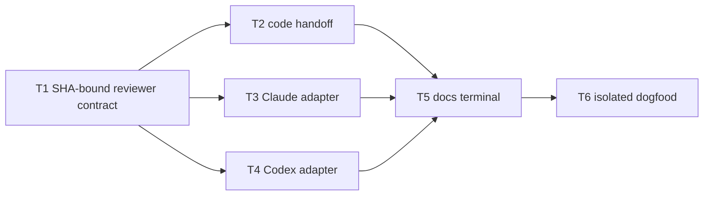

# Plan: cross-host review-gate hardening — part 3

Source brief: docs/loom/specs/2026-08-24-cross-host-review-gate-hardening-part-3.md
Goal: 讓所有 review 資料流從同一個不可變 SHA 出發、跨 caller 與 host 仍可追溯，並以隔離安裝 dogfood 證明它。
Stage: blocked:user-decision
Steps:
  1. 固定 reviewer 的 SHA 綁定契約
  2. 完成 code 上游交接與兩個 host adapter
  3. 完成 docs 終態 consumer
  4. 驗證完整隔離安裝流程
Total tasks: 6
Critical-path depth: 4
Execution order: parallel-where-possible
Plan-document-reviewer verdict: PASS (2026-08-24, round 1, 17/17)

## Task-flow diagram

## Open Questions

N/A — no unresolved question: the user authorized re-cutting around the verified packet data flow.

## Task 1 — 綁定 reviewer artifact 與輸出 SHA

- **Description**: Bind every SDD reviewer artifact and verdict to the immutable packet reviewed SHA, rejecting invalid or mutable substitutes.
- **Module**: loom-code/scripts/_reviewer-discipline.md
- **Files touched**: loom-code/scripts/_reviewer-discipline.md, loom-code/agents/code-reviewer.md, loom-code/agents/docs-reviewer.md, loom-code/agents/spec-reviewer.md, loom-code/agents/code-quality-reviewer.md, loom-code/skills/subagent-driven-development/SKILL.md, loom-code/scripts/test_reviewer_discipline.py, loom-code/scripts/test_subagent_driven_development_skill.py
- **Context paths**:
  - /Users/kouko/GitHub/monkey-skills/loom-code/scripts/_reviewer-discipline.md
  - /Users/kouko/GitHub/monkey-skills/loom-code/skills/subagent-driven-development/SKILL.md
- **Acceptance**:
  - **RED**: `test_subagent_driven_development_skill.py::test_sdd_reviewer_artifacts_are_bound_to_packet_reviewed_sha` fails because a reviewer may use mutable HEAD paths or omit its output SHA.
  - **GREEN**: Each reviewer receives SHA-bound artifact input and returns only the valid packet SHA; missing, non-SHA, or `unresolved` values produce no verdict.
- **Dependencies**: none
- **Independent**: false
- **Brief item covered**: BI-1
- **Status**: done(08261a9e)
- **Gloss**: 每份 reviewer 結果都能明確回答「它審的是哪一個 commit」。

## Task 2 — 交接 code 到 docs 的同一封包

- **Description**: Make code review pass its unchanged immutable packet to docs-only and mixed docs dispatches while preserving SHA-safe code terminal rules.
- **Module**: loom-code/skills/requesting-code-review/SKILL.md
- **Files touched**: loom-code/skills/requesting-code-review/SKILL.md, loom-code/scripts/test_review_scope_stations.py, loom-code/scripts/test_review_scope_and_loop.py
- **Context paths**:
  - /Users/kouko/GitHub/monkey-skills/loom-code/skills/requesting-code-review/SKILL.md
  - /Users/kouko/GitHub/monkey-skills/loom-code/skills/requesting-docs-review/SKILL.md
- **Acceptance**:
  - **RED**: `test_review_scope_stations.py::test_code_review_hands_unchanged_packet_to_docs_only_and_mixed_routes` fails because docs dispatch receives only scope metadata.
  - **GREEN**: Code-only, docs-only, and mixed routes use the packet reviewed SHA for terminal evidence; explicit ranges with a different endpoint refuse before dispatch or mint.
- **Dependencies**: Task 1 completes first
- **Independent**: false
- **Brief item covered**: BI-1, BI-2
- **Status**: blocked
- **Gloss**: code 入口不再遺失封包，交給 docs 的仍是同一個審查事實。

## Task 3 — 明確化 Claude Code adapter

- **Description**: Document and test Claude Code's installed-root resolution and same-reviewer delta-confirmation packet handoff.
- **Module**: loom-code/skills/using-loom-code/references/claude-code-tools.md
- **Files touched**: loom-code/skills/using-loom-code/references/claude-code-tools.md, loom-code/scripts/test_claude_adapter_contract.py
- **Context paths**:
  - /Users/kouko/GitHub/monkey-skills/loom-code/skills/using-loom-code/references/claude-code-tools.md
  - /Users/kouko/GitHub/monkey-skills/loom-code/scripts/review_context.py
- **Acceptance**:
  - **RED**: `test_claude_adapter_contract.py::test_claude_adapter_resolves_and_forwards_immutable_review_context` fails because the adapter does not define packet handoff.
  - **GREEN**: The Claude adapter resolves the installed script, forwards the unchanged packet, and defines same-reviewer confirmation only for a fresh post-fix SHA.
- **Dependencies**: Task 1 completes first
- **Independent**: true
- **Brief item covered**: BI-3
- **Status**: blocked
- **Gloss**: Claude 的便利確認流程仍保留，但不會沿用舊 commit 的審查結果。

## Task 4 — 明確化 Codex adapter

- **Description**: Document and test Codex's installed-root resolution and labelled fresh whole-artifact review after docs fixes.
- **Module**: loom-code/skills/using-loom-code/references/codex-tools.md
- **Files touched**: loom-code/skills/using-loom-code/references/codex-tools.md, loom-code/scripts/test_codex_adapter_contract.py
- **Context paths**:
  - /Users/kouko/GitHub/monkey-skills/loom-code/skills/using-loom-code/references/codex-tools.md
  - /Users/kouko/GitHub/monkey-skills/loom-code/scripts/review_context.py
- **Acceptance**:
  - **RED**: `test_codex_adapter_contract.py::test_codex_adapter_resolves_and_forwards_immutable_review_context` fails because the adapter lacks a fresh-review packet contract.
  - **GREEN**: The Codex adapter resolves the installed script, forwards the unchanged packet, and requires a labelled fresh whole-artifact review for the post-fix SHA.
- **Dependencies**: Task 1 completes first
- **Independent**: true
- **Brief item covered**: BI-3
- **Status**: blocked
- **Gloss**: Codex 不假裝擁有 Claude 的續談能力，而是在新 commit 上重新做可追溯審查。

## Task 5 — 完成 docs 終態 consumer

- **Description**: Consume a handed packet verbatim or resolve one only when absent, then produce a schema-valid host-specific current-SHA terminal docs verdict.
- **Module**: loom-code/skills/requesting-docs-review/SKILL.md
- **Files touched**: loom-code/skills/requesting-docs-review/SKILL.md, loom-code/scripts/test_requesting_docs_review_skill.py
- **Context paths**:
  - /Users/kouko/GitHub/monkey-skills/loom-code/skills/requesting-docs-review/SKILL.md
  - /Users/kouko/GitHub/monkey-skills/loom-code/skills/using-loom-code/references/claude-code-tools.md
  - /Users/kouko/GitHub/monkey-skills/loom-code/skills/using-loom-code/references/codex-tools.md
- **Acceptance**:
  - **RED**: `test_requesting_docs_review_skill.py::test_docs_terminal_route_consumes_handed_packet_and_mints_only_schema_valid_current_sha_verdict` fails because docs may re-resolve caller context or mint a confirmation token.
  - **GREEN**: Claude and Codex post-fix routes use their adapter contract, return a schema-valid terminal verdict for the current packet SHA, and mint only with that SHA.
- **Dependencies**: Tasks 2, 3, 4 complete first
- **Independent**: false
- **Brief item covered**: BI-2, BI-3
- **Status**: pending
- **Gloss**: 文件路徑成為真正的 consumer：接到哪份封包，就只對那份 SHA 做終態判定。

## Task 6 — 執行隔離安裝 dogfood

- **Description**: Add a no-quota isolated-consumer dogfood test that exercises every review route and its stale-SHA refusal.
- **Module**: loom-code/scripts/test_loom_plugin_composition.py
- **Files touched**: loom-code/scripts/test_loom_plugin_composition.py
- **Context paths**:
  - /Users/kouko/GitHub/monkey-skills/loom-code/scripts/test_loom_plugin_composition.py
  - /Users/kouko/GitHub/monkey-skills/loom-code/scripts/review_context.py
- **Acceptance**:
  - **RED**: `test_loom_plugin_composition.py::test_isolated_consumer_all_review_routes_share_one_sha_bound_packet` fails because no fixture traverses all routes.
  - **GREEN**: A copied plugin and consumer repo without `loom-code/` prove code-only, docs-only, mixed, and SDD routes share one SHA-bound packet; stale marker minting refuses and schema-valid current-SHA terminal verdicts pass.
- **Dependencies**: Task 5 completes first
- **Independent**: false
- **Brief item covered**: BI-4
- **Status**: pending
- **Gloss**: 最終以真實隔離安裝情境驗證整條流程，而不是只驗各段文字。

## Notes

- Part 3 supersedes incomplete part-2 Tasks 3–5; keep their working changes only if they satisfy this plan's stronger contracts.
- Tasks 2–4 are superseded by `2026-08-24-cross-host-review-gate-hardening-part-4`; retain only changes that satisfy its executable primitives-first contracts.
- Tasks 3 and 4 are parallel only because their files and host-specific semantics are disjoint.
- Local dogfood is mandatory; live host execution remains a separately authorized, quota-consuming follow-up.
