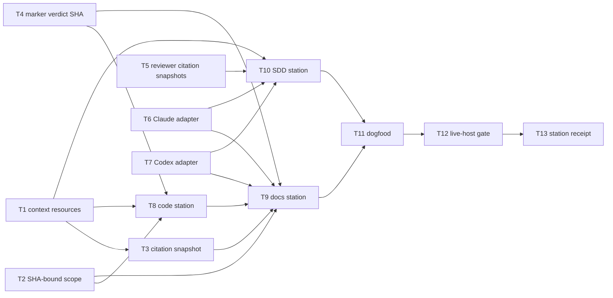

# Plan: cross-host review-gate hardening — part 4

Source brief: docs/loom/specs/2026-08-24-cross-host-review-gate-hardening-part-4.md
Goal: 從 context 到 marker 的每個可執行節點都綁定同一 SHA，並在隔離 consumer repo 證明全流程。
Stage: review:round-1
Steps:
  1. 建立 SHA、資源與 host adapter 的底層不變量
  2. 將 citation、code 與 SDD 接到 primitives
  3. 完成 docs 終態 consumer
  4. 執行端到端 dogfood
  5. 建立可驗證的 gate-only station receipt
  6. 執行 Claude Code 與 Codex 實機出貨 gate
Total tasks: 13
Critical-path depth: 6
Execution order: parallel-where-possible
Plan-document-reviewer verdict: PASS (2026-08-24, live-host gate recut)

## Task-flow diagram

## Open Questions

N/A — no unresolved question: the data-flow census assigned each remaining invariant to one executable owner.

## Task 1 — 擴充封包的 citation 資源

- **Description**: Expose the document citation checker as an approved absolute resource in the portable review context packet.
- **Module**: loom-code/scripts/review_context.py
- **Files touched**: loom-code/scripts/review_context.py, loom-code/scripts/test_review_context.py
- **Context paths**:
  - /Users/kouko/GitHub/monkey-skills/loom-code/scripts/review_context.py
  - /Users/kouko/GitHub/monkey-skills/loom-code/scripts/check_doc_citations.py
- **Acceptance**:
  - **RED**: `test_review_context.py::test_context_includes_doc_citation_checker_resource` fails because the packet has no approved citation checker path.
  - **GREEN**: The copied-install packet exports an existing absolute `doc_citation_checker` path beneath the installed plugin root.
- **Dependencies**: none
- **Independent**: true
- **Brief item covered**: BI-1
- **Status**: done(8ab3d04d)
- **Gloss**: docs 不必再從 skill 位置猜 citation 工具，封包提供唯一來源。

## Task 2 — 將 review scope 綁到 packet SHA

- **Description**: Add a reviewed-SHA input to the scope resolver and compute the changed-file population against that immutable commit.
- **Module**: loom-code/scripts/review_scope.py
- **Files touched**: loom-code/scripts/review_scope.py, loom-code/scripts/test_review_scope.py
- **Context paths**:
  - /Users/kouko/GitHub/monkey-skills/loom-code/scripts/review_scope.py
  - /Users/kouko/GitHub/monkey-skills/loom-code/scripts/test_review_scope.py
- **Acceptance**:
  - **RED**: `test_review_scope.py::test_scope_uses_supplied_reviewed_sha_not_mutable_head` fails because scope follows current HEAD.
  - **GREEN**: A supplied valid reviewed SHA fixes the diff endpoint and a different current HEAD refuses instead of returning a B population for packet A.
- **Dependencies**: none
- **Independent**: true
- **Brief item covered**: BI-1
- **Status**: done(43122306)
- **Gloss**: scope 清單與封包 commit 同步，避免 A 的封包搭配 B 的檔案集合。

## Task 3 — 將 citation pre-pass 綁到 packet SHA

- **Description**: Make the document citation checker read documents and cited sources from a supplied immutable commit snapshot.
- **Module**: loom-code/scripts/check_doc_citations.py
- **Files touched**: loom-code/scripts/check_doc_citations.py, loom-code/scripts/test_check_doc_citations.py
- **Context paths**:
  - /Users/kouko/GitHub/monkey-skills/loom-code/scripts/check_doc_citations.py
  - /Users/kouko/GitHub/monkey-skills/loom-code/scripts/test_check_doc_citations.py
- **Acceptance**:
  - **RED**: `test_check_doc_citations.py::test_checker_reads_supplied_reviewed_sha_snapshot` fails because cited files are read from the mutable worktree.
  - **GREEN**: The checker accepts a valid reviewed SHA, uses its snapshot for document and source reads, and refuses invalid or drifted inputs.
- **Dependencies**: Task 1 completes first
- **Independent**: false
- **Brief item covered**: BI-1
- **Status**: done(a10c09ca)
- **Gloss**: citation 判讀也固定在同一 commit，不能被後續工作樹變更污染。

## Task 4 — 驗證 marker verdict SHA

- **Description**: Require every mintable terminal verdict to carry a valid reviewed SHA equal to the marker expected head.
- **Module**: loom-code/scripts/loom_gate_markers.py
- **Files touched**: loom-code/scripts/loom_gate_markers.py, loom-code/scripts/test_loom_gate_markers.py
- **Context paths**:
  - /Users/kouko/GitHub/monkey-skills/loom-code/scripts/loom_gate_markers.py
  - /Users/kouko/GitHub/monkey-skills/loom-code/scripts/test_loom_gate_markers.py
- **Acceptance**:
  - **RED**: `test_loom_gate_markers.py::test_review_pass_refuses_verdict_sha_mismatch_with_expected_head` fails because verdict SHA is not validated.
  - **GREEN**: Missing, invalid, or mismatched verdict SHA refuses without a marker even when repository HEAD matches expected head.
- **Dependencies**: none
- **Independent**: true
- **Brief item covered**: BI-2
- **Status**: done(2e17dba4)
- **Gloss**: marker 不只看目前 HEAD，也會檢查 verdict 自己聲稱審的是同一個 SHA。

## Task 5 — 綁定 reviewer citation cross-read

- **Description**: Require every reviewer citation cross-read to load cited repository evidence from the immutable reviewed SHA snapshot.
- **Module**: loom-code/scripts/_reviewer-discipline.md
- **Files touched**: loom-code/scripts/_reviewer-discipline.md, loom-code/agents/code-reviewer.md, loom-code/agents/docs-reviewer.md, loom-code/agents/spec-reviewer.md, loom-code/agents/code-quality-reviewer.md, loom-code/scripts/test_reviewer_discipline.py
- **Context paths**:
  - /Users/kouko/GitHub/monkey-skills/loom-code/scripts/_reviewer-discipline.md
  - /Users/kouko/GitHub/monkey-skills/loom-code/scripts/distribute.py
- **Acceptance**:
  - **RED**: `test_reviewer_discipline.py::test_reviewer_cross_reads_use_reviewed_sha_snapshot` fails because a cited source may be read from mutable worktree state.
  - **GREEN**: Every generated reviewer contract requires `git -C "<target_repo>" show <reviewed_sha>:<path>` for repository cross-reads and prohibits mutable path reads.
- **Dependencies**: none
- **Independent**: true
- **Brief item covered**: BI-1
- **Status**: done(f19c4af6)
- **Gloss**: reviewer 找證據時也只看被審 commit，不會把之後的檔案混進來。

## Task 6 — 固定 Claude adapter 的 root 與 drift 序列

- **Description**: Make Claude adapter resolution and post-fix confirmation reject a packet SHA equal to the original review SHA.
- **Module**: loom-code/skills/using-loom-code/references/claude-code-tools.md
- **Files touched**: loom-code/skills/using-loom-code/references/claude-code-tools.md, loom-code/scripts/test_claude_adapter_contract.py
- **Context paths**:
  - /Users/kouko/GitHub/monkey-skills/loom-code/skills/using-loom-code/references/claude-code-tools.md
  - /Users/kouko/GitHub/monkey-skills/loom-code/scripts/review_context.py
- **Acceptance**:
  - **RED**: `test_claude_adapter_contract.py::test_claude_confirmation_refuses_unchanged_reviewed_sha` fails because fresh is only prose.
  - **GREEN**: Claude resolves through its installed plugin root and refuses confirmation, wrapper, and marker when the post-fix packet SHA equals round one.
- **Dependencies**: none
- **Independent**: true
- **Brief item covered**: BI-3
- **Status**: done(ab598b0f)
- **Gloss**: Claude 的同 reviewer 確認只能確認真正的新 commit，不能把未提交修正當新審查。

## Task 7 — 固定 Codex adapter 的 root 與終態訊號

- **Description**: Define Codex installed-root resolution from the loaded reference path and its fresh-review terminal confirmation signals.
- **Module**: loom-code/skills/using-loom-code/references/codex-tools.md
- **Files touched**: loom-code/skills/using-loom-code/references/codex-tools.md, loom-code/scripts/test_codex_adapter_contract.py
- **Context paths**:
  - /Users/kouko/GitHub/monkey-skills/loom-code/skills/using-loom-code/references/codex-tools.md
  - /Users/kouko/GitHub/monkey-skills/loom-code/scripts/review_context.py
- **Acceptance**:
  - **RED**: `test_codex_adapter_contract.py::test_codex_adapter_derives_installed_root_without_cache_guessing` fails because root resolution is a placeholder.
  - **GREEN**: Codex derives its installed root from its loaded reference path, rejects target/cache guessing, and returns the labelled fresh-review confirmation signal with its new SHA.
- **Dependencies**: none
- **Independent**: true
- **Brief item covered**: BI-3
- **Status**: done(42a83f5c)
- **Gloss**: Codex 的 plugin 位置有可執行來源，不需要猜 cache 結構。

## Task 8 — 將 code station 接到完成的 primitives

- **Description**: Wire code review scope, docs handoff, terminal verdict, and marker minting only through completed SHA-bound primitives.
- **Module**: loom-code/skills/requesting-code-review/SKILL.md
- **Files touched**: loom-code/skills/requesting-code-review/SKILL.md, loom-code/scripts/test_review_scope_stations.py, loom-code/scripts/test_review_scope_and_loop.py
- **Context paths**:
  - /Users/kouko/GitHub/monkey-skills/loom-code/skills/requesting-code-review/SKILL.md
  - /Users/kouko/GitHub/monkey-skills/loom-code/scripts/review_scope.py
  - /Users/kouko/GitHub/monkey-skills/loom-code/scripts/loom_gate_markers.py
- **Acceptance**:
  - **RED**: `test_review_scope_stations.py::test_code_station_routes_scope_and_docs_handoff_through_packet_sha` fails because a caller can recompute mutable scope or omit packet handoff.
  - **GREEN**: Code-only, docs-only, and mixed paths pass the same packet, request SHA-bound scope, retain R3/simplification floors, and mint only a matching terminal verdict.
- **Dependencies**: Tasks 1, 2, 4 complete first
- **Independent**: false
- **Brief item covered**: BI-1, BI-2
- **Status**: done(755b228c)
- **Gloss**: code station 只負責接線，所有 SHA 保障都來自可測的底層 primitive。

## Task 9 — 將 docs station 接到完成的 primitives

- **Description**: Consume packet resources, SHA-bound scope and citations, host adapters, and marker validation in the docs terminal route.
- **Module**: loom-code/skills/requesting-docs-review/SKILL.md
- **Files touched**: loom-code/skills/requesting-docs-review/SKILL.md, loom-code/scripts/test_requesting_docs_review_skill.py
- **Context paths**:
  - /Users/kouko/GitHub/monkey-skills/loom-code/skills/requesting-docs-review/SKILL.md
  - /Users/kouko/GitHub/monkey-skills/loom-code/scripts/check_doc_citations.py
  - /Users/kouko/GitHub/monkey-skills/loom-code/scripts/loom_gate_markers.py
- **Acceptance**:
  - **RED**: `test_requesting_docs_review_skill.py::test_docs_terminal_route_uses_packet_resources_and_preserves_r3_floor` fails because it derives a plugin path or upgrades R3 to clean PASS.
  - **GREEN**: Docs uses handed packet or one local packet, SHA-bound scope/citations, its host adapter, and a matching terminal verdict that preserves R3 PASS_WITH_NOTES.
- **Dependencies**: Tasks 1, 2, 3, 4, 6, 7, 8 complete first
- **Independent**: false
- **Brief item covered**: BI-1, BI-2, BI-3
- **Status**: done(59d6c892)
- **Gloss**: docs route 不猜工具位置、不改寫警告，也只在同一 SHA 上產生終態結果。

## Task 10 — 將 SDD station 接到完成的 primitives

- **Description**: Route every SDD reviewer fan-out through SHA-bound scope and immutable citation contracts supplied by the active host adapter.
- **Module**: loom-code/skills/subagent-driven-development/SKILL.md
- **Files touched**: loom-code/skills/subagent-driven-development/SKILL.md, loom-code/scripts/test_subagent_driven_development_skill.py
- **Context paths**:
  - /Users/kouko/GitHub/monkey-skills/loom-code/skills/subagent-driven-development/SKILL.md
  - /Users/kouko/GitHub/monkey-skills/loom-code/scripts/review_scope.py
- **Acceptance**:
  - **RED**: `test_subagent_driven_development_skill.py::test_sdd_dispatch_uses_sha_bound_scope_and_cross_reads` fails because SDD can hand a reviewer mutable scope evidence.
  - **GREEN**: Spec, quality, and prose reviewer fan-outs receive the active-host packet and only SHA-bound scope, artifacts, and cross-read contracts.
- **Dependencies**: Tasks 1, 2, 5, 6, 7 complete first
- **Independent**: false
- **Brief item covered**: BI-1
- **Status**: done(3bdbefca)
- **Gloss**: SDD 每次派 reviewer 都在同一份不可變證據上工作。

## Task 11 — 執行隔離安裝 primitive dogfood

- **Description**: Add an isolated-consumer dogfood fixture that executes the packet, scope, citation, and marker primitives from a copied plugin.
- **Module**: loom-code/scripts/test_loom_plugin_composition.py
- **Files touched**: loom-code/scripts/test_loom_plugin_composition.py
- **Context paths**:
  - /Users/kouko/GitHub/monkey-skills/loom-code/scripts/test_loom_plugin_composition.py
  - /Users/kouko/GitHub/monkey-skills/loom-code/scripts/review_context.py
- **Acceptance**:
  - **RED**: `test_loom_plugin_composition.py::test_isolated_consumer_review_primitives_are_sha_bound_end_to_end` does not exist before the fixture is added.
  - **GREEN**:
    - A copied plugin and consumer repo without `loom-code/` execute packet, SHA-bound scope/citations, terminal marker, and record-only marker paths.
    - Stale/mismatched verdicts refuse and valid current verdicts mint. Station execution remains a T12 live-host assertion.
- **Dependencies**: Tasks 9, 10 complete first
- **Independent**: false
- **Brief item covered**: BI-4
- **Status**: done(fd4370d8)
- **Gloss**: 本機 dogfood 證明已安裝 primitives 能串接；真正的 station dispatch 由下一關兩個 host 實機證明。

## Task 12 — 以兩個真實 host 驗證 adapter

- **Description**: Build and run a fail-closed live-host gate against real Claude Code and Codex CLIs in isolated temporary installs before release.
- **Module**: loom-code/scripts/live_host_review_gate.py
- **Files touched**: loom-code/scripts/live_host_review_gate.py, loom-code/scripts/test_live_host_review_gate.py, docs/loom/dogfood/2026-08-24-cross-host-review-gate-live-host.md
- **Context paths**:
  - /Users/kouko/GitHub/monkey-skills/loom-code/skills/using-loom-code/references/claude-code-tools.md
  - /Users/kouko/GitHub/monkey-skills/loom-code/skills/using-loom-code/references/codex-tools.md
- **Acceptance**:
  - **RED**: `test_live_host_review_gate.py` fails because no runner creates an isolated copy, requires all three cases, or exits non-zero on a failed host case.
  - **GREEN**:
    - Runner makes candidate plugin and consumer worktree read-only, except its temporary `.git/loom` marker directory; Claude uses the fixed `~/.claude-test` profile with `--permission-mode bypassPermissions`, minimal Read/Bash tools, and pre/post protected-daily-state snapshots.
    - Codex uses a temporary `CODEX_HOME`, marketplace, and install. It copies only the caller-supplied authentication material into that root with private permissions, never logs or hashes it, and deletes it in finally cleanup; unavailable safe auth bootstrap is a fail-closed release blocker.
    - Runner resolves one schema-valid packet per host before four station sessions. Its resolver event is the sole source; root/resources/SHA equal copied install and fixture commit.
    - Sessions receive it verbatim and prove candidate-skill loading through host tool events plus exact packet trace. Echo alone is rejected; stations never re-resolve. This is a gate-only Read→receipt/probe route, not a downstream whole review.
    - Claude uses the dedicated profile's `bypassPermissions` mode, exposes only Read/Bash, and validates the exact candidate-SKILL Read plus receipt/probe Bash pair; exploratory commands, broad tool approval, and reviewer dispatch are forbidden.
    - Per host cases: valid loaded-reference success; negative cases execute the candidate adapter probe and expose its typed refusal event without downstream work. The runner purges inherited `LOOM_LIVE_GATE_*`; only valid sessions receive the five gate values.
    - Claude's fixed `~/.claude-test` profile is the only supported live-gate profile; `--permission-mode bypassPermissions` is the supported invocation. Negative slash commands are exact. Only Codex's exact `/bin/zsh -lc` event wrapper is accepted; all other wrapper shapes fail.
    - Any failed assertion, timeout, host case, protected daily-state mutation, or cleanup failure exits non-zero. Report records CLI versions and redacted evidence only: no raw prompt, auth data/path, or temporary absolute path.
- **Dependencies**: Task 11 completes first
- **Independent**: false
- **Brief item covered**: BI-3, BI-4, BI-5
- **Status**: done(live-host-gate-2026-08-24)
- **Gloss**: 發布前要讓 Claude 與 Codex 實際載入候選 plugin；任一 host 不遵守路徑或 SHA 契約即阻擋出貨。

## Task 13 — gate-only station receipt

- **Description**: Make live station consumption observable without changing ordinary review dispatch.
- **Module**: loom-code/scripts/live_gate_station_receipt.py
- **Files touched**: receipt script, four station SKILL.md files, live-host runner/tests.
- **Acceptance**:
  - **RED**: receipt tests reject missing/wrong nonce, packet schema/root/SHA, non-marker destination, symlink escape, duplicate receipt, fake echo, and a negative route that writes or executes downstream work.
  - **GREEN**:
    - Only a valid live token creates one receipt under fixture `.git/loom`; normal dispatch without a token is unchanged.
    - Runner proves exact loaded SKILL route, host tool command, and receipt for code/docs/mixed/SDD. Packet schema is complete; all other paths are read-only.
    - Negative cases run the package-local adapter probe, bind its exact argv to a typed command-result refusal, and reject prompt-only or wrong-slash evidence.
- **Dependencies**: Task 12 completes first
- **Independent**: false
- **Brief item covered**: BI-4, BI-5
- **Status**: done(live-host-gate-2026-08-24)

## Notes

- Part 4 supersedes incomplete part-3 Tasks 2–4. Preserve their working changes only when they satisfy the primitives-first contracts here.
- Tasks 1, 2, 4, 5, 6, and 7 are independent after confirming their listed files are disjoint.
- Local dogfood and both live-host probes are mandatory release gates. The user authorized the live probes on 2026-08-24; run them only against temporary copies and temporary consumer repos, never by replacing an installed plugin. The live-host runner is fail-closed and must preserve a redacted committed report even when one host fails.
