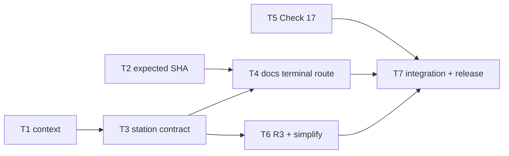

# Plan: cross-host review-gate hardening

Source brief: docs/loom/specs/2026-08-24-cross-host-review-gate-hardening.md
Goal: Claude Code 與 Codex 都只能以明確資源與同一個被審 commit 完成可追溯的 review pass
Stage: blocked:user-decision
Steps:
  1. 建立不可變 review context、marker SHA 閘門與 Check 17 修正
  2. 將 code review station 改接 context 合約
  3. 將 docs terminal route 與 R3/simplification 改接閘門
  4. 執行跨 host 回歸並建立版本鏈
Total tasks: 7
Critical-path depth: 4
Execution order: parallel-where-possible
Plan-document-reviewer verdict: PASS (2026-08-24, round 2, 17/17)

## Task-flow diagram

## Open Questions

N/A — no unresolved question: the user fixed the high-priority scope and host differences have an explicit adapter boundary.

## Task 1 — 建立 review context resolver

- **Description**: Add a read-only plugin-shipped resolver that emits the target repository, immutable reviewed SHA, plugin version, and absolute approved resource paths from its own installation path.
- **Module**: loom-code/scripts/review_context.py
- **Files touched**: loom-code/scripts/review_context.py, loom-code/scripts/test_review_context.py, loom-code/scripts/test_gate_scripts_fail_loud_on_unreadable_input.py
- **Context paths**:
  - /Users/kouko/GitHub/monkey-skills/loom-code/scripts/review_scope.py
  - /Users/kouko/GitHub/monkey-skills/loom-code/.claude-plugin/plugin.json
  - /Users/kouko/GitHub/monkey-skills/loom-code/scripts/test_review_scope_stations.py
- **Acceptance**:
  - **RED**: `test_review_context.py::test_context_uses_script_parent_not_consumer_repo` fails because no resolver emits an isolated-install context.
  - **GREEN**: The resolver refuses damaged installs, and the isolated test proves every emitted resource path is an existing absolute file under a copied plugin root while the target repository contains no `loom-code/` directory.
- **Dependencies**: none
- **Independent**: false
- **Brief item covered**: BI-1, BI-6
- **Status**: done(c9b82198)
- **Gloss**: 讓審查者拿到明確地圖，不再把使用者專案誤認成 plugin 安裝目錄。

## Task 2 — 綁定 marker 到 reviewed SHA

- **Description**: Require `review-pass --expected-head` and reject marker creation when the target repository HEAD differs from the reviewed SHA named by the terminal verdict.
- **Module**: loom-code/scripts/loom_gate_markers.py
- **Files touched**: loom-code/scripts/loom_gate_markers.py, loom-code/scripts/test_loom_gate_markers.py
- **Context paths**:
  - /Users/kouko/GitHub/monkey-skills/loom-code/scripts/loom_gate_markers.py
  - /Users/kouko/GitHub/monkey-skills/loom-code/scripts/test_loom_gate_markers.py
- **Acceptance**:
  - **RED**: `test_loom_gate_markers.py::test_review_pass_refuses_when_expected_head_is_stale` fails because the command currently mints using current HEAD.
  - **GREEN**: The command mints only on an exact SHA match, records that SHA, and leaves no marker on mismatch.
- **Dependencies**: none
- **Independent**: true
- **Brief item covered**: BI-2
- **Status**: done(8d39d24a)
- **Gloss**: 避免舊 verdict 在新 commit 上被誤蓋成已通過。

## Task 3 — 將 code review station 改接 context

- **Description**: Make code-review callers and reviewer discipline consume the resolver packet, require `reviewed_sha`, and remove target-repo-relative plugin commands from their contracts.
- **Module**: loom-code/skills/requesting-code-review
- **Files touched**: loom-code/skills/requesting-code-review/SKILL.md, loom-code/agents/_reviewer-discipline.md, loom-code/agents/code-reviewer.md, loom-code/scripts/test_review_scope_stations.py
- **Context paths**:
  - /Users/kouko/GitHub/monkey-skills/loom-code/skills/requesting-code-review/SKILL.md
  - /Users/kouko/GitHub/monkey-skills/loom-code/agents/_reviewer-discipline.md
  - /Users/kouko/GitHub/monkey-skills/loom-code/skills/using-loom-code/references/codex-tools.md
- **Acceptance**:
  - **RED**: `test_review_scope_stations.py::test_code_station_packet_has_absolute_context_and_reviewed_sha` fails because the current packet has neither invariant.
  - **GREEN**: Claude Code and Codex adapter instructions hand the same context fields to each code reviewer, and no consumer-relative `loom-code/scripts` command remains.
- **Dependencies**: Task 1 completes first
- **Independent**: false
- **Brief item covered**: BI-1, BI-2, BI-6
- **Status**: blocked
- **Gloss**: code review 的輸入改為跨工具相同的明確契約。

## Task 4 — 完成 docs review 的可 mint 終態

- **Description**: Define host-specific docs confirmation routes that both end in a current-SHA terminal verdict, and require a fresh joined review for mixed code/docs changes after a fix.
- **Module**: loom-code/skills/requesting-docs-review
- **Files touched**: loom-code/skills/requesting-docs-review/SKILL.md, loom-code/skills/using-loom-code/references/codex-tools.md, loom-code/scripts/test_requesting_docs_review_skill.py, loom-code/scripts/test_docs_reviewer_agent.py
- **Context paths**:
  - /Users/kouko/GitHub/monkey-skills/loom-code/skills/requesting-docs-review/SKILL.md
  - /Users/kouko/GitHub/monkey-skills/loom-code/skills/requesting-code-review/SKILL.md
  - /Users/kouko/GitHub/monkey-skills/loom-code/skills/using-loom-code/references/codex-tools.md
- **Acceptance**:
  - **RED**: `test_requesting_docs_review_skill.py::test_confirmed_docs_route_emits_current_sha_terminal_verdict` fails because confirmation has no mintable final artifact.
  - **GREEN**: Claude Code's continuation and Codex's labelled fresh review both produce a terminal verdict before `review-pass --expected-head` runs.
- **Dependencies**: Tasks 2, 3 complete first
- **Independent**: false
- **Brief item covered**: BI-2, BI-3, BI-6
- **Status**: pending
- **Gloss**: 文件修正被確認後，也能在正確 commit 上真正完成閘門。

## Task 5 — 修正 Plan Check 17 的適用與 cross-read

- **Description**: Expand Check 17's allowed evidence to cited repository source, require reuse blocks when task text instructs reuse, and forbid N/A merely because no block exists.
- **Module**: loom-code/skills/writing-plans/references/plan-document-reviewer-prompt.md
- **Files touched**: loom-code/skills/writing-plans/references/plan-document-reviewer-prompt.md, loom-code/scripts/test_plan_document_reviewer_check17.py
- **Context paths**:
  - /Users/kouko/GitHub/monkey-skills/loom-code/skills/writing-plans/references/plan-document-reviewer-prompt.md
  - /Users/kouko/GitHub/monkey-skills/loom-code/skills/writing-plans/references/plan-format.md
  - /Users/kouko/GitHub/monkey-skills/loom-code/scripts/test_plan_document_reviewer_check17.py
- **Acceptance**:
  - **RED**: `test_plan_document_reviewer_check17.py::test_check17_requires_source_access_and_missing_reuse_block` fails because the prompt forbids the needed read and permits false N/A.
  - **GREEN**: Check 17 can read cited repo-relative evidence and returns NEEDS_REVISION for a reuse-instructing task without the required block.
- **Dependencies**: none
- **Independent**: true
- **Brief item covered**: BI-4
- **Status**: claimed(@codex-check17)
- **Gloss**: 「重用既有 helper」不再能在沒有證據時被漏過。

## Task 6 — 保留 R3 與 simplification 的閘門訊號

- **Description**: Carry R3 verification caveats into aggregate review status and harvest simplification findings before reaggregation and marker minting.
- **Module**: loom-code/skills/requesting-code-review
- **Files touched**: loom-code/skills/requesting-code-review/SKILL.md, loom-code/agents/_reviewer-discipline.md, loom-code/scripts/test_review_scope_and_loop.py
- **Context paths**:
  - /Users/kouko/GitHub/monkey-skills/loom-code/skills/requesting-code-review/SKILL.md
  - /Users/kouko/GitHub/monkey-skills/loom-code/agents/_reviewer-discipline.md
  - /Users/kouko/GitHub/monkey-skills/loom-code/scripts/test_review_scope_and_loop.py
- **Acceptance**:
  - **RED**: `test_review_scope_and_loop.py::test_r3_or_simplification_signal_prevents_clean_pass_mint` fails because both signals can be lost before mint.
  - **GREEN**: An unverified R3 result yields PASS_WITH_NOTES with relay, and simplification findings join the verdict before any marker command.
- **Dependencies**: Task 3 completes first
- **Independent**: false
- **Brief item covered**: BI-5
- **Status**: pending
- **Gloss**: 證據尚未確認或可簡化的提醒，不會在蓋章前悄悄消失。

## Task 7 — 跨 host 回歸與版本鏈

- **Description**: Add isolated-install regression coverage, run a local dogfood matrix from a consumer-repository fixture, then update release documentation and manifests.
- **Module**: loom-code/.claude-plugin/plugin.json
- **Files touched**: loom-code/.claude-plugin/plugin.json, loom-code/.codex-plugin/plugin.json, loom-code/CHANGELOG.md, loom-code/scripts/test_loom_plugin_composition.py
- **Context paths**:
  - /Users/kouko/GitHub/monkey-skills/loom-code/scripts/test_loom_plugin_composition.py
  - /Users/kouko/GitHub/monkey-skills/scripts/sync_codex_manifests.py
  - /Users/kouko/GitHub/monkey-skills/loom-code/CHANGELOG.md
- **Acceptance**:
  - **RED**: `test_loom_plugin_composition.py::test_review_context_contract_survives_isolated_consumer_install` fails because no isolated fixture proves both adapters avoid a consumer `loom-code/` directory.
  - **GREEN**: The local dogfood fixture proves standalone context, stale-SHA refusal, fresh-SHA mint, docs terminal route, and retained R3/simplification signals; composition tests, manifest drift check, and the full plugin script suite pass.
- **Dependencies**: Tasks 4, 5, 6 complete first
- **Independent**: false
- **Brief item covered**: BI-6
- **Status**: pending
- **Gloss**: 最後用真實的獨立安裝情境證明兩個工具沒有各走各的。

## Notes

- Task 3 is superseded by `2026-08-24-cross-host-review-gate-hardening-part-2`; its uncommitted draft must not be committed.
- Task 1 is the sole producer of context fields. Tasks 3 and 4 may only add
  host adapters; they may not fork the field semantics.
- No task revives the retired durable ledger or changes model selection.
- Task 7 separates no-quota local dogfood from live Claude Code/Codex runs;
  invoke the latter only after the user confirms the model-costing commands.
