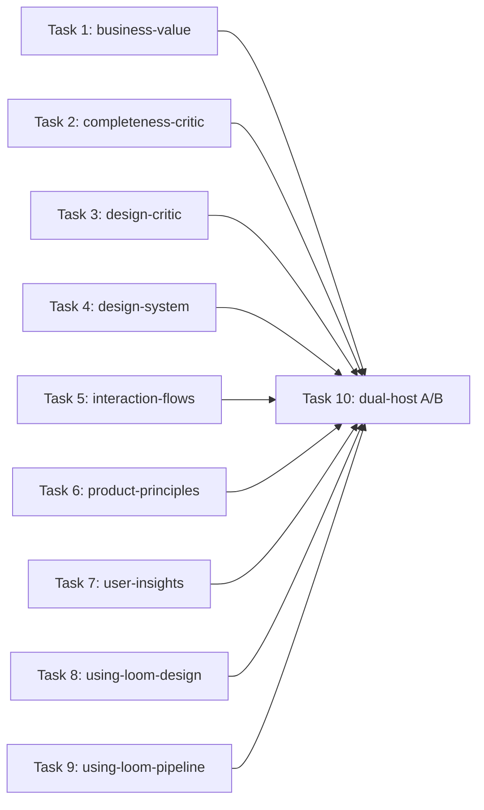

# Plan: loom-design skill text compaction

**Source brief**: docs/loom/specs/2026-08-25-loom-design-skill-compaction.md
Goal: Shorten all nine remaining loom-design skill entrypoints by 20–30% without changing observable behavior on Claude Code or Codex.
Stage: complete
Steps:
  1. 平行壓縮九個 design skill
  2. 執行雙宿主弱模型 A/B 並修復任何回歸
**Total tasks**: 10
**Critical-path depth**: 2
**Execution order**: parallel-where-possible
**Plan-document-reviewer verdict**: PASS (2026-08-25, 18/18 checks)

## Task-flow diagram

## Open Questions

N/A — no unresolved question: the source brief fixes scope, word ranges, review gates, and live evaluation policy

## Task 1 — 壓縮 business-value

- **Description**: Add the failing static oracle first, then compact only business-value's `SKILL.md` to 904–1,032 words.
  - Preserve exact explicit fire/skip rules, including implicit GO without artifact output; reentrancy; and one-at-a-time evaluation of the three axes.
  - Preserve planning-team and user-insights boundaries, all three verdicts, the weak-axis rule, output template, artifact behavior, and two-attempt validator.
  - Run focused and package tests, privacy gate, atomic commit, specification review, and quality review; repair and rerun every gate on a finding.
- **Module**: loom-design/skills/business-value/
- **Files touched**: loom-design/skills/business-value/SKILL.md, loom-design/scripts/discovery/test_business_value_compaction.py
- **Context paths**:
  - /Users/kouko/GitHub/monkey-skills/loom-design/skills/business-value/SKILL.md
  - /Users/kouko/GitHub/monkey-skills/loom-design/scripts/discovery/test_business_value_skill.py
- **Acceptance**:
  - **RED**: `test_business_value_compaction.py::test_entrypoint_preserves_firing_axes_verdict_and_validation_within_word_range` fails first because the untouched 1,291-word entrypoint exceeds the 1,032-word ceiling.
  - **GREEN**: The named test asserts the 904–1,032 range and all listed essence; focused discovery tests, full loom-design tests, reference validation, and privacy gate pass.
  - **GREEN**: One atomic commit exists, both specification and quality reviewers pass its diff, and any repair has rerun the same tests and privacy gate.
- **Dependencies**: none
- **Independent**: true
- **Brief item covered**: BI-1
- **Status**: done(31532be5)
- **Gloss**: 保留是否該做與何時交棒的完整判斷，只刪除重複說明。

## Task 2 — 壓縮 completeness-critic

- **Description**: Add the failing static oracle first, then compact only completeness-critic's `SKILL.md` to 2,803–3,203 words.
  - Preserve spec-only writer-not-judge isolation, fresh general-agent panels, targeted reseeding, `K=2` dry rounds, five mandatory plus conditional/principles lenses, and the original-requirements-only view.
  - Preserve overlap as diagnostic only, no completion/percentage claims, consistency lens, deduplicated ranked critic-found writeback, nonempty blind spots, two verdicts, mint/validate, and the two-cycle cap.
  - Run focused and package tests, privacy gate, atomic commit, specification review, and quality review; repair and rerun every gate on a finding.
- **Module**: loom-design/skills/completeness-critic/
- **Files touched**: loom-design/skills/completeness-critic/SKILL.md, loom-design/scripts/spec/test_completeness_critic_compaction.py
- **Context paths**:
  - /Users/kouko/GitHub/monkey-skills/loom-design/skills/completeness-critic/SKILL.md
  - /Users/kouko/GitHub/monkey-skills/loom-design/scripts/spec/test_completeness_critic_skill.py
  - /Users/kouko/GitHub/monkey-skills/loom-design/scripts/spec/test_consistency_lens.py
- **Acceptance**:
  - **RED**: `test_completeness_critic_compaction.py::test_entrypoint_preserves_panel_lenses_synthesis_and_bounded_verdict_within_word_range` fails first because the untouched 4,004-word entrypoint exceeds the 3,203-word ceiling.
  - **GREEN**: The named test asserts the 2,803–3,203 range and all listed essence; focused spec tests, full loom-design tests, reference validation, and privacy gate pass.
  - **GREEN**: One atomic commit exists, both specification and quality reviewers pass its diff, and any repair has rerun the same tests and privacy gate.
- **Dependencies**: none
- **Independent**: true
- **Brief item covered**: BI-2
- **Status**: done(874bb689)
- **Gloss**: 保留批判面板的盲測、補洞與兩輪上限，不讓縮文變成自我判分。

## Task 3 — 壓縮 design-critic

- **Description**: Add the failing static oracle first, then compact only design-critic's `SKILL.md` to 1,627–1,858 words.
  - Preserve design-artifact scope and wrong-artifact refusal, tag/tier precheck, fresh five-plus-principles panel, targeted `K=2` reseeding, and the Nielsen reference.
  - Preserve deduplicated ranked critic-found augmentation, nonempty blind spots, no completion claim, two verdicts and minting, validator, and the two-cycle cap.
  - Run focused and package tests, privacy gate, atomic commit, specification review, and quality review; repair and rerun every gate on a finding.
- **Module**: loom-design/skills/design-critic/
- **Files touched**: loom-design/skills/design-critic/SKILL.md, loom-design/scripts/interface/test_design_critic_compaction.py
- **Context paths**:
  - /Users/kouko/GitHub/monkey-skills/loom-design/skills/design-critic/SKILL.md
  - /Users/kouko/GitHub/monkey-skills/loom-design/scripts/interface/test_design_critic_skill.py
- **Acceptance**:
  - **RED**: `test_design_critic_compaction.py::test_entrypoint_preserves_artifact_guard_panel_nielsen_and_bounded_verdict_within_word_range` fails first because the untouched 2,323-word entrypoint exceeds the 1,858-word ceiling.
  - **GREEN**: The named test asserts the 1,627–1,858 range and all listed essence; focused interface tests, full loom-design tests, reference validation, and privacy gate pass.
  - **GREEN**: One atomic commit exists, both specification and quality reviewers pass its diff, and any repair has rerun the same tests and privacy gate.
- **Dependencies**: none
- **Independent**: true
- **Brief item covered**: BI-3
- **Status**: done(f5e771a0)
- **Gloss**: 保留獨立設計批判與盲點揭露，避免把規格或自評混進裁決。

## Task 4 — 壓縮 design-system

- **Description**: Add the failing static oracle first, then compact only design-system's `SKILL.md` to 1,388–1,585 words.
  - Preserve schema plus `PRINCIPLES.md` and tone anchors, consent when principles are absent, GUI/TUI/CLI modality, and knowledge triage.
  - Preserve all eight GUI sections, tokens, surface candidates, user choice and rejections, WCAG, lint, TUI/CLI stub, artifact paths, validator, on-disk ending gate, and visual-only boundary.
  - Run focused and package tests, privacy gate, atomic commit, specification review, and quality review; repair and rerun every gate on a finding.
- **Module**: loom-design/skills/design-system/
- **Files touched**: loom-design/skills/design-system/SKILL.md, loom-design/scripts/interface/test_design_system_compaction.py
- **Context paths**:
  - /Users/kouko/GitHub/monkey-skills/loom-design/skills/design-system/SKILL.md
  - /Users/kouko/GitHub/monkey-skills/loom-design/scripts/interface/test_design_system_skill.py
  - /Users/kouko/GitHub/monkey-skills/loom-design/scripts/interface/test_ending_gate.py
- **Acceptance**:
  - **RED**: `test_design_system_compaction.py::test_entrypoint_preserves_modality_gui_contract_and_ending_gate_within_word_range` fails first because the untouched 1,982-word entrypoint exceeds the 1,585-word ceiling.
  - **GREEN**: The named test asserts the 1,388–1,585 range and all listed essence; focused interface tests, full loom-design tests, reference validation, and privacy gate pass.
  - **GREEN**: One atomic commit exists, both specification and quality reviewers pass its diff, and any repair has rerun the same tests and privacy gate.
- **Dependencies**: none
- **Independent**: true
- **Brief item covered**: BI-4
- **Status**: done(f230ba47)
- **Gloss**: 保留各介面形態的完整輸出與落盤驗證，只移除視覺規則的重複教材。

## Task 5 — 壓縮 interaction-flows

- **Description**: Add the failing static oracle first, then compact only interaction-flows' `SKILL.md` to 1,012–1,156 words.
  - Preserve reference and `PRINCIPLES.md` reads, absent-principles behavior, modality question, seven dimensions, Mermaid-skill and ASCII rules, and flag-only render variants.
  - Preserve knowledge triage, per-change addressable `ui-flows.md`, validator, on-disk ending gate, and the surface-versus-spec boundary.
  - Run focused and package tests, privacy gate, atomic commit, specification review, and quality review; repair and rerun every gate on a finding.
- **Module**: loom-design/skills/interaction-flows/
- **Files touched**: loom-design/skills/interaction-flows/SKILL.md, loom-design/scripts/interface/test_interaction_flows_compaction.py
- **Context paths**:
  - /Users/kouko/GitHub/monkey-skills/loom-design/skills/interaction-flows/SKILL.md
  - /Users/kouko/GitHub/monkey-skills/loom-design/scripts/interface/test_interaction_flows_skill.py
  - /Users/kouko/GitHub/monkey-skills/loom-design/scripts/interface/test_ascii_ui_patterns.py
- **Acceptance**:
  - **RED**: `test_interaction_flows_compaction.py::test_entrypoint_preserves_intake_dimensions_diagrams_and_ending_gate_within_word_range` fails first because the untouched 1,445-word entrypoint exceeds the 1,156-word ceiling.
  - **GREEN**: The named test asserts the 1,012–1,156 range and all listed essence; focused interface tests, full loom-design tests, reference validation, and privacy gate pass.
  - **GREEN**: One atomic commit exists, both specification and quality reviewers pass its diff, and any repair has rerun the same tests and privacy gate.
- **Dependencies**: none
- **Independent**: true
- **Brief item covered**: BI-5
- **Status**: done(f85e6399)
- **Gloss**: 保留七個互動維度、圖形工具與落盤門檻，維持流程稿可被後續精確引用。

## Task 6 — 壓縮 product-principles

- **Description**: Add the failing static oracle first, then compact only product-principles' `SKILL.md` to 2,117–2,418 words.
  - Preserve reference reads, user-first probing and coverage, same-axis canon candidates and rejections, tone anchor, exact sections/count/check markers, read-back, artifact path, and validators.
  - Preserve headless thin-seed refusal, inventory/checker, no silent drops, agent-decided versus deferred-human ownership, and downstream boundary.
  - Run focused and package tests, privacy gate, atomic commit, specification review, and quality review; repair and rerun every gate on a finding.
- **Module**: loom-design/skills/product-principles/
- **Files touched**: loom-design/skills/product-principles/SKILL.md, loom-design/scripts/principles/test_product_principles_compaction.py
- **Context paths**:
  - /Users/kouko/GitHub/monkey-skills/loom-design/skills/product-principles/SKILL.md
  - /Users/kouko/GitHub/monkey-skills/loom-design/scripts/principles/test_product_principles_skill.py
  - /Users/kouko/GitHub/monkey-skills/loom-design/scripts/principles/test_check_seed_traceability.py
- **Acceptance**:
  - **RED**: `test_product_principles_compaction.py::test_entrypoint_preserves_elicitation_canon_artifact_and_headless_traceability_within_word_range` fails first because the untouched 3,023-word entrypoint exceeds the 2,418-word ceiling.
  - **GREEN**: The named test asserts the 2,117–2,418 range and all listed essence; focused principles tests, full loom-design tests, reference validation, and privacy gate pass.
  - **GREEN**: One atomic commit exists, both specification and quality reviewers pass its diff, and any repair has rerun the same tests and privacy gate.
- **Dependencies**: none
- **Independent**: true
- **Brief item covered**: BI-6
- **Status**: done(298b5dbb)
- **Gloss**: 保留從使用者語言到可追溯原則的完整鏈條，尤其不讓 headless 模式默默補猜。

## Task 7 — 壓縮 user-insights

- **Description**: Add the failing static oracle first, then compact only user-insights' `SKILL.md` to 925–1,056 words.
  - Preserve two separated modes, research facts without interrogating the user, problem-space purity, evidence-backed job stories, and explicit Recommend/Why/reversal commitment plus ratification.
  - Preserve delegation when sources exceed three or primary evidence is needed, otherwise EN+JA research, artifact/evidence chain, no investment verdict, and the two-attempt validator.
  - Run focused and package tests, privacy gate, atomic commit, specification review, and quality review; repair and rerun every gate on a finding.
- **Module**: loom-design/skills/user-insights/
- **Files touched**: loom-design/skills/user-insights/SKILL.md, loom-design/scripts/discovery/test_user_insights_compaction.py
- **Context paths**:
  - /Users/kouko/GitHub/monkey-skills/loom-design/skills/user-insights/SKILL.md
  - /Users/kouko/GitHub/monkey-skills/loom-design/scripts/discovery/test_user_insights_skill.py
  - /Users/kouko/GitHub/monkey-skills/loom-design/scripts/discovery/test_validate_discovery_artifacts.py
- **Acceptance**:
  - **RED**: `test_user_insights_compaction.py::test_entrypoint_preserves_modes_evidence_commitment_and_validation_within_word_range` fails first because the untouched 1,321-word entrypoint exceeds the 1,056-word ceiling.
  - **GREEN**: The named test asserts the 925–1,056 range and all listed essence; focused discovery tests, full loom-design tests, reference validation, and privacy gate pass.
  - **GREEN**: One atomic commit exists, both specification and quality reviewers pass its diff, and any repair has rerun the same tests and privacy gate.
- **Dependencies**: none
- **Independent**: true
- **Brief item covered**: BI-7
- **Status**: done(ade545ca)
- **Gloss**: 保留兩種研究模式與證據承諾，避免把事實研究變成盤問使用者或投資裁決。

## Task 8 — 壓縮 using-loom-design

- **Description**: Add the failing static oracle first, then compact only using-loom-design's `SKILL.md` to 1,458–1,665 words.
  - Preserve subagent stop, family relay/reception with upstream precedence, four station routes plus code, complex-fork briefing, thin-router no-authoring boundary, and isolated reentrant discovery.
  - Preserve principles station, modality/principles/interface order and critic resolution, spec draft-versus-critique routing, host-tool mapping, and no automatic invocation.
  - Run focused and package tests, privacy gate, atomic commit, specification review, and quality review; repair and rerun every gate on a finding.
- **Module**: loom-design/skills/using-loom-design/
- **Files touched**: loom-design/skills/using-loom-design/SKILL.md, loom-design/scripts/discovery/test_using_loom_design_compaction.py
- **Context paths**:
  - /Users/kouko/GitHub/monkey-skills/loom-design/skills/using-loom-design/SKILL.md
  - /Users/kouko/GitHub/monkey-skills/loom-design/scripts/discovery/test_using_skill.py
  - /Users/kouko/GitHub/monkey-skills/loom-design/scripts/interface/test_entry_intake.py
- **Acceptance**:
  - **RED**: `test_using_loom_design_compaction.py::test_entrypoint_preserves_reception_station_order_boundaries_and_host_tools_within_word_range` fails first because the untouched 2,082-word entrypoint exceeds the 1,665-word ceiling.
  - **GREEN**: The named test asserts the 1,458–1,665 range and all listed essence; focused router tests, full loom-design tests, reference validation, and privacy gate pass.
  - **GREEN**: One atomic commit exists, both specification and quality reviewers pass its diff, and any repair has rerun the same tests and privacy gate.
- **Dependencies**: none
- **Independent**: true
- **Brief item covered**: BI-8
- **Status**: done(54c33892)
- **Gloss**: 保留設計家族的正確分流與先後順序，讓入口更薄但不代替各站創作。

## Task 9 — 壓縮 using-loom-pipeline

- **Description**: Add the failing static oracle first, then compact only using-loom-pipeline's `SKILL.md` to 1,870–2,136 words.
  - Preserve subagent stop, conditional Workflow/plugin availability, Codex N/A with no fallback, exact six fields, absolute driver path, one call per segment, three segments, exactly four human gates, and all prohibitions.
  - Preserve queue intent/state split, freeze forms, argv safety, reconcile/next/mark-running/mark, fallback, human-only recovery, suspect semantics, exit codes, dispatcher-only ownership, and terminal state.
  - Run focused and package tests, privacy gate, atomic commit, specification review, and quality review; repair and rerun every gate on a finding.
- **Module**: loom-design/skills/using-loom-pipeline/
- **Files touched**: loom-design/skills/using-loom-pipeline/SKILL.md, loom-design/scripts/pipeline/test_using_loom_pipeline_compaction.py
- **Context paths**:
  - /Users/kouko/GitHub/monkey-skills/loom-design/skills/using-loom-pipeline/SKILL.md
  - /Users/kouko/GitHub/monkey-skills/loom-design/scripts/pipeline/test_pipeline_skill_contract.py
  - /Users/kouko/GitHub/monkey-skills/loom-design/scripts/pipeline/test_pipeline_batch_queue.py
- **Acceptance**:
  - **RED**: `test_using_loom_pipeline_compaction.py::test_entrypoint_preserves_availability_driver_gates_and_queue_lifecycle_within_word_range` fails first because the untouched 2,671-word entrypoint exceeds the 2,136-word ceiling.
  - **GREEN**: The named test asserts the 1,870–2,136 range and all listed essence; focused pipeline tests, full loom-design tests, reference validation, and privacy gate pass.
  - **GREEN**: One atomic commit exists, both specification and quality reviewers pass its diff, and any repair has rerun the same tests and privacy gate.
- **Dependencies**: none
- **Independent**: true
- **Brief item covered**: BI-9
- **Status**: done(1ba64739)
- **Gloss**: 保留三段驅動、四道人門與完整佇列復原語意，不替缺少的宿主能力造假 fallback。

## Task 10 — 執行 design 雙宿主弱模型 A/B

- **Description**: Compare immutable full-plugin baseline and candidate roots for all nine skills with Claude `haiku`, Codex `gpt-5.6-luna`, and two replicates per skill and host.
  - Use grounded tasks that can activate the skill naturally and exercise its load-bearing contract; prohibit outbound, destructive, or persistent side effects and grade only observable activation, decisions, sequence, artifact simulation, and stopping behavior.
  - Retain raw evidence outside the repo, report moved-reference words separately, and send only replicated surviving `INCONCLUSIVE` cases to a stronger adjudicator; repair and fully retest any confirmed regression.
- **Module**: docs/loom/dogfood/
- **Files touched**: docs/loom/dogfood/2026-08-25-loom-design-skill-compaction-dual-host-ab.md
- **Context paths**:
  - /Users/kouko/GitHub/monkey-skills/loom-code/scripts/loom_firing_harness.py
  - /Users/kouko/GitHub/monkey-skills/docs/loom/dogfood/2026-08-25-loom-skill-compaction-dual-host-ab.md
  - /Users/kouko/GitHub/monkey-skills/docs/loom/specs/2026-08-25-loom-design-skill-compaction.md
- **Acceptance**:
  - **RED**: `test -s docs/loom/dogfood/2026-08-25-loom-design-skill-compaction-dual-host-ab.md` fails because no nine-skill live evidence record exists.
  - **GREEN**: The record names every skill, immutable full-plugin roots, both pinned weak models, two replicates per host, grounded prompts, side-effect prohibitions, normalized observables, raw paths, words, bytes, moved words, tests, privacy, reviews, and final classification.
  - **GREEN**: `business-value candidate passes the Task 1 essence oracle on both hosts`
  - **GREEN**: `completeness-critic candidate passes the Task 2 essence oracle on both hosts`
  - **GREEN**: `design-critic candidate passes the Task 3 essence oracle on both hosts`
  - **GREEN**: `design-system candidate passes the Task 4 essence oracle on both hosts`
  - **GREEN**: `interaction-flows candidate passes the Task 5 essence oracle on both hosts`
  - **GREEN**: `product-principles candidate passes the Task 6 essence oracle on both hosts`
  - **GREEN**: `user-insights candidate passes the Task 7 essence oracle on both hosts`
  - **GREEN**: `using-loom-design candidate passes the Task 8 essence oracle on both hosts`
  - **GREEN**: `using-loom-pipeline candidate passes the Task 9 essence oracle on both hosts`
  - **GREEN**: Every replicated surviving `INCONCLUSIVE` result has a stronger evidence verdict, and every confirmed regression has returned to its owner and passed the full static, package, privacy, review, and live matrix after repair.
- **External surfaces**:
  - CLI flag: `claude -p --model haiku --output-format stream-json` — grounding: in-repo evidence at `loom-code/scripts/loom_firing_harness.py` function `host_argv_for_root`
  - CLI flag: `codex exec --model gpt-5.6-luna --json` — grounding: in-repo evidence at `loom-code/scripts/loom_firing_harness.py` function `host_argv_for_root`
- **Dependencies**: Tasks 1, 2, 3, 4, 5, 6, 7, 8, 9 complete first
- **Seam**:
  - from Task 1: payload: business-value candidate and essence oracle; owner: Task 1; probe: `business-value candidate passes the Task 1 essence oracle on both hosts`
  - from Task 2: payload: completeness-critic candidate and essence oracle; owner: Task 2; probe: `completeness-critic candidate passes the Task 2 essence oracle on both hosts`
  - from Task 3: payload: design-critic candidate and essence oracle; owner: Task 3; probe: `design-critic candidate passes the Task 3 essence oracle on both hosts`
  - from Task 4: payload: design-system candidate and essence oracle; owner: Task 4; probe: `design-system candidate passes the Task 4 essence oracle on both hosts`
  - from Task 5: payload: interaction-flows candidate and essence oracle; owner: Task 5; probe: `interaction-flows candidate passes the Task 5 essence oracle on both hosts`
  - from Task 6: payload: product-principles candidate and essence oracle; owner: Task 6; probe: `product-principles candidate passes the Task 6 essence oracle on both hosts`
  - from Task 7: payload: user-insights candidate and essence oracle; owner: Task 7; probe: `user-insights candidate passes the Task 7 essence oracle on both hosts`
  - from Task 8: payload: using-loom-design candidate and essence oracle; owner: Task 8; probe: `using-loom-design candidate passes the Task 8 essence oracle on both hosts`
  - from Task 9: payload: using-loom-pipeline candidate and essence oracle; owner: Task 9; probe: `using-loom-pipeline candidate passes the Task 9 essence oracle on both hosts`
- **Independent**: false
- **Brief item covered**: BI-10
- **Status**: done(821bc938)
- **Gloss**: 用兩個宿主的弱模型做真實但無副作用的九項回放，只讓仍無法判定的差異升級裁決。

## Notes

- Author self-review: repository checkers passed; formal plan-document review PASS (18/18).
- Tasks 1–9 are independent because their skill and test write sets are disjoint. Task 10 joins them only after each atomic commit passes tests, privacy, specification review, and quality review.
- The 20–30% target is measured from each listed baseline. Any text added or moved to references is reported and subtracted from claimed deletion; it cannot satisfy the target by relocation alone.
- Immutable baseline and candidate inputs are complete loom-design plugin roots, never isolated skill directories or a mutable worktree observed at two different times.
