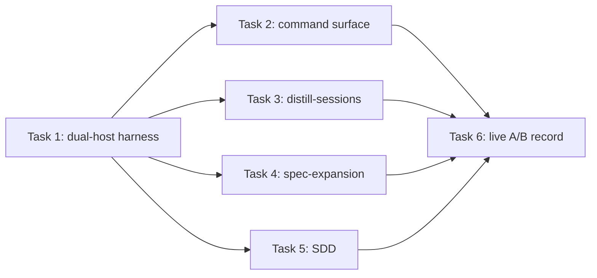

# Plan: loom skill text compaction — Part 1 dual-host harness and pilots

**Source brief**: docs/loom/specs/2026-08-25-loom-skill-text-compaction-part-1.md
Goal: Establish cross-host behavioral equivalence evidence and compact three representative loom skills without changing observable behavior.
Stage: complete
Steps:
  1. 建立雙宿主比較基線
  2. 平行壓縮三個代表性 skill 並補公開命令
  3. 執行弱模型 A/B 並裁決是否准入全量改寫
**Total tasks**: 6
**Critical-path depth**: 3
**Execution order**: parallel-where-possible
**Plan-document-reviewer verdict**: PASS (2026-08-25, fresh review round 2, 18/18)

## Task-flow diagram

## Open Questions

N/A — no unresolved question: the user approved the dual-host weak-model A/B method and staged rollout

## Task 1 — 建立雙宿主行為比較器

- **Description**: Extend the existing firing harness with a new baseline/candidate root-selection adapter and comparison mode while preserving its current Claude-only CLI behavior.
  - Use `live_host_review_gate.py` as behavior evidence for host argv and event semantics, but author comparison-specific root selection because its helper binds one workspace root.
  - Retain raw host JSONL, record plugin-root provenance, support at least two replicates, and report pass/regression/improvement/inconclusive without grading natural-language wording.
- **Module**: loom-code/scripts/loom_firing_harness.py
- **Files touched**: loom-code/scripts/loom_firing_harness.py, loom-code/scripts/test_loom_firing_harness.py
- **Context paths**:
  - /Users/kouko/GitHub/monkey-skills/loom-code/scripts/live_host_review_gate.py
  - /Users/kouko/GitHub/monkey-skills/loom-code/scripts/test_live_host_review_gate.py
  - /Users/kouko/GitHub/monkey-skills/docs/loom/backlog/2026-07-23-loom-code-replay-matrix-per-change-objective-regression-measurement.md
- **Acceptance**:
  - **RED**: `test_loom_firing_harness.py::test_compare_hosts_normalizes_baseline_candidate_replicates` fails because no Codex adapter or comparison record exists.
  - **GREEN**: Unit tests prove both host argv shapes, event normalization, raw transcript retention, plugin-root provenance, backward-compatible Claude mode, and n>=2 comparison semantics.
- **External surfaces**: Claude Code CLI and Codex CLI; isolate subprocess calls behind injected/stubbed runners in unit tests, preserve JSON evidence, and never expose credentials.
- **Dependencies**: none
- **Independent**: false
- **Brief item covered**: BI-1
- **Status**: done(a4926443)
- **Gloss**: 先把兩個 host 的結果變成可比較證據，後面的縮寫才有客觀安全網。

## Task 2 — 宣告共用回放命令

- **Description**: Add the established dual-host comparison invocation to the repository command surface after Task 1 proves the CLI shape.
  - Edit the tracked AGENTS.md command-surface block directly, matching this repository's current history, and verify the declared invocation remains executable.
- **Module**: AGENTS.md
- **Files touched**: AGENTS.md, loom-code/scripts/test_command_surface.py
- **Context paths**:
  - /Users/kouko/GitHub/monkey-skills/loom-code/scripts/loom_firing_harness.py
- **Acceptance**:
  - **RED**: `test_command_surface.py::test_dual_host_firing_comparison_is_declared` fails because AGENTS.md contains no proven comparison invocation.
  - **GREEN**: The exact proven invocation appears in AGENTS.md's managed command-surface block, and the declared command runs its help or validation path successfully.
- **Dependencies**: Task 1 completes first
- **Seam**:
  - from Task 1: payload: none
- **Independent**: true
- **Brief item covered**: BI-1
- **Status**: done(bbe60893)
- **Gloss**: 讓新測試能力有唯一公開入口，未來不必重新猜命令。

## Task 3 — 壓縮 distill-sessions

- **Description**: Compact the distill-sessions entrypoint by deleting repeated architecture prose and moving only conditional schemas, dispatch mechanics, and historical detail behind explicit trigger-point references.
  - Preserve invocation approval, privacy boundaries, observable-data limits, required artifacts, stop conditions, and final verification inline.
  - Add static essence assertions before editing and target a conservative 28-38% word reduction from the recorded baseline.
- **Module**: loom-workflow/skills/distill-sessions/
- **Files touched**: loom-workflow/skills/distill-sessions/SKILL.md, loom-workflow/skills/distill-sessions/references/runtime-protocol.md, loom-workflow/scripts/test_distill_sessions_compaction.py
- **Context paths**:
  - /Users/kouko/GitHub/monkey-skills/docs/loom/specs/2026-08-25-loom-skill-text-compaction.md
  - /Users/kouko/GitHub/monkey-skills/loom-workflow/skills/distill-sessions/SKILL.md
- **Acceptance**:
  - **RED**: `test_distill_sessions_compaction.py::test_entrypoint_preserves_essence_under_word_ceiling` fails because duplicated conditional detail remains inline and the ceiling is exceeded.
  - **GREEN**: Static contract tests, existing plugin tests, reference links, and weak-model baseline/candidate probes preserve approval, privacy, artifact, and stop behavior while words fall by at least 28%.
- **Dependencies**: Task 1 completes first
- **Seam**:
  - from Task 1: payload: none
- **Independent**: true
- **Brief item covered**: BI-2
- **Status**: done(eb21ffaf)
- **Gloss**: 驗證長型工作流程能否縮短，同時保留隱私、授權與停止邊界。

## Task 4 — 壓縮 spec-expansion

- **Description**: Compact the spec-expansion entrypoint by removing duplicated phase teaching and output restatement while keeping every seed, critic-verdict, triage, pairwise, schema, and validation gate executable inline.
  - Move only genuinely phase-conditional detail to existing or focused references, with explicit read triggers at the decision point.
  - Add static essence assertions before editing and target a conservative 20-28% word reduction from the recorded baseline.
- **Module**: loom-design/skills/spec-expansion/
- **Files touched**: loom-design/skills/spec-expansion/SKILL.md, loom-design/skills/spec-expansion/references/execution-details.md, loom-design/scripts/spec/test_spec_expansion_compaction.py
- **Context paths**:
  - /Users/kouko/GitHub/monkey-skills/docs/loom/specs/2026-08-25-loom-skill-text-compaction.md
  - /Users/kouko/GitHub/monkey-skills/loom-design/skills/spec-expansion/SKILL.md
- **Acceptance**:
  - **RED**: `test_spec_expansion_compaction.py::test_entrypoint_preserves_gates_under_word_ceiling` fails because duplicated phase/output prose remains inline and the ceiling is exceeded.
  - **GREEN**: Static contract tests, existing spec tests, reference links, and weak-model baseline/candidate probes preserve all named gates while words fall by at least 20%.
- **Dependencies**: Task 1 completes first
- **Seam**:
  - from Task 1: payload: none
- **Independent**: true
- **Brief item covered**: BI-2
- **Status**: done(ca73898b)
- **Gloss**: 驗證高密度設計流程能否去掉教材式重述，又不漏掉規格品質門檻。

## Task 5 — 壓縮 subagent-driven-development

- **Description**: Compact the SDD entrypoint by consolidating repeated delegation mechanics and moving only conditional operational detail behind explicit references.
  - Preserve live-gate receipt, ask policy, per-task triad, immutable review packet, review-weight lanes, verdict resolution, retry caps, ledger behavior, model selection, and status handling inline.
  - Add static essence assertions before editing and target a conservative 22-32% word reduction from the recorded baseline.
- **Module**: loom-code/skills/subagent-driven-development/
- **Files touched**: loom-code/skills/subagent-driven-development/SKILL.md, loom-code/skills/subagent-driven-development/references/conditional-operations.md, loom-code/scripts/test_sdd_compaction.py
- **Context paths**:
  - /Users/kouko/GitHub/monkey-skills/docs/loom/specs/2026-08-25-loom-skill-text-compaction.md
  - /Users/kouko/GitHub/monkey-skills/loom-code/scripts/test_subagent_driven_development_skill.py
- **Acceptance**:
  - **RED**: `test_sdd_compaction.py::test_entrypoint_preserves_orchestration_under_word_ceiling` fails because repeated operational prose remains inline and the ceiling is exceeded.
  - **GREEN**: Static contract tests, all existing SDD pins, reference links, and weak-model baseline/candidate probes preserve the named orchestration behavior while words fall by at least 22%.
- **Dependencies**: Task 1 completes first
- **Seam**:
  - from Task 1: payload: none
- **Independent**: true
- **Brief item covered**: BI-2
- **Status**: done(ef2c80f7)
- **Gloss**: 驗證最複雜的 agent 編排契約在瘦身後仍維持相同派發與裁決行為。

## Task 6 — 執行雙宿主弱模型 A/B

- **Description**: Run baseline and candidate plugin roots through Claude Code and Codex with economy models, at least two replicates for every divergence, and record normalized outcomes plus raw transcript locations.
  - Grade activation, refusal, required tool sequence, verdict class, disk effect, stop behavior, turns, tokens where exposed, and latency; never grade wording similarity or accept model self-report as evidence.
  - Route every replicated surviving divergence to a stronger-model evidence review before deciding whether it is a regression; a confirmed regression blocks the owning pilot and routes back to its task.
  - A clean result, including adjudicated non-regressions, authorizes the subsequent family-scoped plans for all remaining skills.
- **Module**: loom-code/scripts/loom_firing_harness.py
- **Files touched**: loom-code/scripts/loom_firing_harness.py, loom-code/scripts/test_loom_firing_harness.py, docs/loom/dogfood/2026-08-25-loom-skill-compaction-dual-host-ab.md
- **Context paths**:
  - /Users/kouko/GitHub/monkey-skills/docs/loom/specs/2026-08-25-loom-skill-text-compaction.md
  - /Users/kouko/GitHub/monkey-skills/docs/loom/dogfood/2026-08-05-extraction-batch-cold-read-probe.md
- **Acceptance**:
  - **RED**: `test_loom_firing_harness.py::test_compare_hosts_passes_explicit_economy_models_to_each_host` fails because the comparator cannot yet pin separate Claude Code and Codex models; the dogfood record is also absent.
  - **RED**: `test_loom_firing_harness.py::test_run_host_rejects_nonzero_exit` fails because a host authentication error can currently normalize to a false PASS instead of invalidating the run.
  - **RED**: `test_loom_firing_harness.py::test_codex_root_invocation_loads_isolated_plugin_config` fails because `--ignore-user-config` also suppresses the plugin installed into the isolated Codex home.
  - **GREEN**: The record names every case, host, model profile, replicate, observable verdict, raw transcript path, size delta, and final pilot decision with no unexplained regression.
  - **GREEN**: Every replicated surviving divergence carries a stronger-model evidence verdict before the final pilot decision.
  - **GREEN**: `dual-host documented invocation accepts the Task 2 command shape`
  - **GREEN**: `distill-sessions candidate passes its Task 3 essence oracle on both hosts`
  - **GREEN**: `spec-expansion candidate passes its Task 4 essence oracle on both hosts`
  - **GREEN**: `SDD candidate passes its Task 5 essence oracle on both hosts`
- **External surfaces**: Live Claude Code and Codex CLI runs consume quota; use configured local authentication, read-only isolated workspaces, bounded turns, and no secret capture.
- **Dependencies**: Tasks 2, 3, 4, 5 complete first
- **Seam**:
  - from Task 2: payload: documented invocation; owner: Task 2; probe: `dual-host documented invocation accepts the Task 2 command shape`
  - from Task 3: payload: distill-sessions candidate root and essence oracle; owner: Task 3; probe: `distill-sessions candidate passes its Task 3 essence oracle on both hosts`
  - from Task 4: payload: spec-expansion candidate root and essence oracle; owner: Task 4; probe: `spec-expansion candidate passes its Task 4 essence oracle on both hosts`
  - from Task 5: payload: SDD candidate root and essence oracle; owner: Task 5; probe: `SDD candidate passes its Task 5 essence oracle on both hosts`
- **Independent**: false
- **Brief item covered**: BI-1, BI-2, BI-3, BI-4, BI-5, BI-6
- **Status**: done(8b917bef)
- **Gloss**: 用兩個真實 host 的低成本模型確認縮短沒有換來行為退化。

## Decision Log

- 2026-08-25: Task 6's first isolated Codex attempt returned HTTP 401, but the comparator normalized identical error streams to PASS. Discard that attempt, add a fail-loud nonzero-exit gate under TDD, and preserve later attempts in distinct raw directories.
- 2026-08-25: The authenticated Codex retry still ignored its isolated plugin because the harness passed `--ignore-user-config`. Discard those Codex results, remove the contradictory flag under TDD, and rerun all Codex cases in new attempt directories.

## Notes

- Verdict header stamped from the reviewer's returned PASS — stamping the verdict, no re-review required.
- This is Part 1 of the full BI-3 objective, not a three-skill substitute. A CLEAN Task 6 result is the dependency for subsequent family-scoped plans covering the remaining 30 skills.
- Baseline plugin roots must be immutable copies of the pre-edit bytes; candidate roots must name the current worktree revision. Raw transcripts stay outside the repository when they may contain environment details; the dogfood record stores paths and redacted summaries only.
- The three pilot edit tasks are independent after Task 1 because their file sets and behavior domains are disjoint. Task 2 shares only Task 1's proven CLI seam and can run in the same wave.
