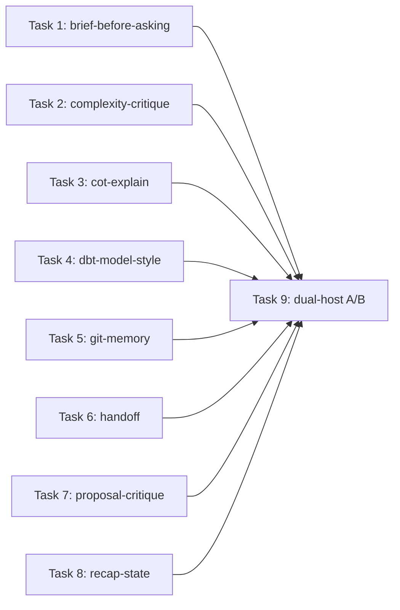

# Plan: loom-workflow skill text compaction

**Source brief**: docs/loom/specs/2026-08-25-loom-workflow-skill-compaction.md
Goal: Shorten all eight remaining loom-workflow skill entrypoints without changing observable behavior on Claude Code or Codex.
Stage: finishing
Steps:
  1. 平行壓縮八個 workflow skill
  2. 執行雙宿主弱模型 A/B 並裁決差異
**Total tasks**: 9
**Critical-path depth**: 2
**Execution order**: parallel-where-possible
**Plan-document-reviewer verdict**: PASS (2026-08-25, fresh review, 18/18)

## Task-flow diagram

## Open Questions

N/A — no unresolved question: the parent arc and successful Part 1 fixed the compaction and evaluation method

## Task 1 — 壓縮 brief-before-asking

- **Description**: Compact the brief-before-asking entrypoint by deleting repeated teaching prose and moving worked examples to its existing examples reference.
  - Keep four-mode routing, proactive default, turn ordering, second-confusion override, six-block requirements, escape hatches, and the first-line/last-line pre-send check inline.
  - Add a static essence oracle before editing and target a 22-30% reduction from the baseline cited in the source brief.
- **Module**: loom-workflow/skills/brief-before-asking/
- **Files touched**: loom-workflow/skills/brief-before-asking/SKILL.md, loom-workflow/skills/brief-before-asking/references/EXAMPLES.md, loom-workflow/scripts/test_brief_before_asking_compaction.py
- **Context paths**:
  - /Users/kouko/GitHub/monkey-skills/loom-workflow/skills/brief-before-asking/SKILL.md
  - /Users/kouko/GitHub/monkey-skills/loom-workflow/skills/brief-before-asking/references/EXAMPLES.md
- **Acceptance**:
  - **RED**: `test_brief_before_asking_compaction.py::test_entrypoint_preserves_four_modes_and_briefing_contract_under_word_ceiling` fails because the entrypoint exceeds the 2,396-word ceiling before compaction.
  - **GREEN**: The named test, reference-link validation, existing workflow tests, and trigger fixtures pass with all listed essence strings and ordering constraints preserved inline.
- **Dependencies**: none
- **Independent**: true
- **Brief item covered**: BI-1
- **Status**: done(e79ec2c4)
- **Gloss**: 保留使用者真正看得到的提問節奏與迷路保護，同時移除重複教材。

## Task 2 — 壓縮 complexity-critique

- **Description**: Compact complexity-critique by deleting repeated deletion rationale, examples, and routing prose already covered by its bundled mindset references.
  - Keep mandatory mindset selection, ordered Q1/Q2/Q3, greenfield substitution, four verdicts, trade-off naming, and single-change boundaries inline.
  - Add a static essence oracle before editing and target a 25-35% reduction from the baseline cited in the source brief.
- **Module**: loom-workflow/skills/complexity-critique/
- **Files touched**: loom-workflow/skills/complexity-critique/SKILL.md, loom-workflow/scripts/test_complexity_critique_compaction.py
- **Context paths**:
  - /Users/kouko/GitHub/monkey-skills/loom-workflow/skills/complexity-critique/SKILL.md
  - /Users/kouko/GitHub/monkey-skills/loom-workflow/skills/complexity-critique/references/mindset-design-is-taking-apart.md
- **Acceptance**:
  - **RED**: `test_complexity_critique_compaction.py::test_entrypoint_preserves_mindset_three_questions_and_verdicts_under_word_ceiling` fails because the entrypoint exceeds the 1,612-word ceiling before compaction.
  - **GREEN**: The named test, reference-link validation, current trigger fixtures, and plugin tests pass while mindset loading, question order, greenfield handling, verdicts, and routing remain inline.
- **Dependencies**: none
- **Independent**: true
- **Brief item covered**: BI-2
- **Status**: done(521dc39b)
- **Gloss**: 讓刪除優先的判斷流程更短，但不把三道門或裁決語彙藏起來。

## Task 3 — 壓縮 cot-explain

- **Description**: Compact cot-explain by removing historical rationale duplicated by `why-these-rules.md` and tightening repeated rendering and fidelity explanations without editing the reference contracts.
  - Keep source selection, extraction net, early exit, layout invariants, Markdown authority, render-verify-render commands, fidelity gate, temporary paths, and publishing consent inline.
  - Add a static essence oracle before editing and target an 18-25% reduction from the baseline cited in the source brief.
- **Module**: loom-workflow/skills/cot-explain/
- **Files touched**: loom-workflow/skills/cot-explain/SKILL.md, loom-workflow/scripts/test_cot_explain_compaction.py
- **Context paths**:
  - /Users/kouko/GitHub/monkey-skills/loom-workflow/skills/cot-explain/SKILL.md
  - /Users/kouko/GitHub/monkey-skills/loom-workflow/skills/cot-explain/references/mermaid-cot-spec.md
  - /Users/kouko/GitHub/monkey-skills/loom-workflow/skills/cot-explain/references/fidelity-check.md
- **Acceptance**:
  - **RED**: `test_cot_explain_compaction.py::test_entrypoint_preserves_extraction_render_and_fidelity_gates_under_word_ceiling` fails because the entrypoint exceeds the 3,567-word ceiling before compaction.
  - **GREEN**: The named test, renderer/verifier tests, reference-link validation, and plugin tests pass while every listed extraction, layout, rendering, fidelity, and consent gate remains inline.
- **Dependencies**: none
- **Independent**: true
- **Brief item covered**: BI-3
- **Status**: done(f694b56f)
- **Gloss**: 縮短最長的解釋流程，但仍強制來源忠實、真實渲染與分享前核對。

## Task 4 — 壓縮 dbt-model-style

- **Description**: Compact dbt-model-style by deleting detailed examples and situational elaboration already covered by the runnable example, passthrough reference, and self-check.
  - Keep bounded enforcement, style-versus-logic scope, three CTE roles, zero-logic final, passthrough, naming/comments, two headers, Redshift syntax, config, and final self-check inline.
  - Add a static essence oracle before editing and target an 18-25% reduction from the baseline cited in the source brief.
- **Module**: loom-workflow/skills/dbt-model-style/
- **Files touched**: loom-workflow/skills/dbt-model-style/SKILL.md, loom-workflow/scripts/test_dbt_model_style_compaction.py
- **Context paths**:
  - /Users/kouko/GitHub/monkey-skills/loom-workflow/skills/dbt-model-style/SKILL.md
  - /Users/kouko/GitHub/monkey-skills/loom-workflow/skills/dbt-model-style/references/example-model.sql
  - /Users/kouko/GitHub/monkey-skills/loom-workflow/skills/dbt-model-style/checklists/dbt-model-self-check.md
- **Acceptance**:
  - **RED**: `test_dbt_model_style_compaction.py::test_entrypoint_preserves_scope_structure_and_self_check_under_word_ceiling` fails because the entrypoint exceeds the 2,929-word ceiling before compaction.
  - **GREEN**: The named test, header validator tests, reference-link validation, and plugin tests pass while all listed scope, SQL structure, metadata, and final-check rules remain inline.
- **Dependencies**: none
- **Independent**: true
- **Brief item covered**: BI-4
- **Status**: done(8b36d596)
- **Gloss**: 保留寫 dbt model 時每次都要遵守的骨架，把情境性細節移出預設負載。

## Task 5 — 壓縮 git-memory

- **Description**: Compact git-memory by deleting carrier caveats and rollout rationale already owned by its compose, recall, and memory-conventions contracts.
  - Keep mandatory invocation at commit/PR/merge, internal trailer classification, durable-store precedence, privacy stops, capture verification, squash caveat, and recall routing inline.
  - Add a static essence oracle before editing and target a 22-30% reduction from the baseline cited in the source brief.
- **Module**: loom-workflow/skills/git-memory/
- **Files touched**: loom-workflow/skills/git-memory/SKILL.md, loom-workflow/scripts/test_git_memory_compaction.py
- **Context paths**:
  - /Users/kouko/GitHub/monkey-skills/loom-workflow/skills/git-memory/SKILL.md
  - /Users/kouko/GitHub/monkey-skills/loom-workflow/skills/git-memory/protocols/compose-commit.md
  - /Users/kouko/GitHub/monkey-skills/loom-workflow/skills/git-memory/protocols/compose-pr.md
  - /Users/kouko/GitHub/monkey-skills/loom-workflow/skills/git-memory/protocols/recall.md
- **Acceptance**:
  - **RED**: `test_git_memory_compaction.py::test_entrypoint_preserves_invocation_privacy_capture_and_recall_under_word_ceiling` fails because the entrypoint exceeds the 1,826-word ceiling before compaction.
  - **GREEN**: The named test, git-memory script tests, reference-link validation, and plugin tests pass while invocation, classification, hierarchy, privacy, verification, and recall remain inline.
- **Dependencies**: none
- **Independent**: true
- **Brief item covered**: BI-5
- **Status**: done(3fc08489)
- **Gloss**: 保留每次 git 邊界都會觸發的記憶判斷，不再反覆解釋同一個載體限制。

## Task 6 — 壓縮 handoff

- **Description**: Compact handoff by replacing duplicated schema detail with precise pointers to the unchanged handoff-schema reference.
  - Keep prepare/resume detection, state-gathering commands, ten-block requirement, launcher contract, full verification, T1/T2 mismatch policy, language adoption, and synthesis stop inline.
  - Preserve an explicit trigger: on entering Prepare or Resume mode, read `references/handoff-schema.md` before authoring or interpreting the HANDOFF artifact.
  - Add a static essence oracle before editing and target an 18-25% reduction from the baseline cited in the source brief.
- **Module**: loom-workflow/skills/handoff/
- **Files touched**: loom-workflow/skills/handoff/SKILL.md, loom-workflow/scripts/test_handoff_compaction.py
- **Context paths**:
  - /Users/kouko/GitHub/monkey-skills/loom-workflow/skills/handoff/SKILL.md
  - /Users/kouko/GitHub/monkey-skills/loom-workflow/skills/handoff/references/handoff-schema.md
  - /Users/kouko/GitHub/monkey-skills/loom-workflow/skills/handoff/scripts/test_handoff_skill_md.py
- **Acceptance**:
  - **RED**: `test_handoff_compaction.py::test_entrypoint_preserves_prepare_resume_verification_and_stop_under_word_ceiling` fails because the entrypoint exceeds the 1,187-word ceiling before compaction.
  - **GREEN**: The named test, existing handoff schema/skill tests, reference-link validation, and plugin tests pass while every listed prepare, resume, verification, language, and stop rule remains inline and both modes explicitly trigger the schema read before artifact work.
- **Dependencies**: none
- **Independent**: true
- **Brief item covered**: BI-6
- **Status**: done(e1c88eb2)
- **Gloss**: 讓跨 session 接力更省上下文，但冷啟動所需的精確狀態與停手機制不打折。

## Task 7 — 壓縮 proposal-critique

- **Description**: Compact proposal-critique by deleting repeated examples and rationalization teaching while retaining the complete operative triage contract inline.
  - Keep enumerate-or-decompose, grounding and necessity vocabularies, matrix mapping, DEFER re-trigger fall-through, three-bucket presentation, and routing boundaries inline.
  - Add a static essence oracle before editing and target a 25-35% reduction from the baseline cited in the source brief.
- **Module**: loom-workflow/skills/proposal-critique/
- **Files touched**: loom-workflow/skills/proposal-critique/SKILL.md, loom-workflow/scripts/test_proposal_critique_compaction.py
- **Context paths**:
  - /Users/kouko/GitHub/monkey-skills/loom-workflow/skills/proposal-critique/SKILL.md
  - /Users/kouko/GitHub/monkey-skills/loom-workflow/skills/proposal-critique/evals/body-validation.md
- **Acceptance**:
  - **RED**: `test_proposal_critique_compaction.py::test_entrypoint_preserves_axes_matrix_fallthrough_and_output_under_word_ceiling` fails because the entrypoint exceeds the 1,024-word ceiling before compaction.
  - **GREEN**: The named test, trigger/body fixtures, reference-link validation, and plugin tests pass while the five ordered steps, matrix, fall-through, output buckets, and routing remain inline.
- **Dependencies**: none
- **Independent**: true
- **Brief item covered**: BI-7
- **Status**: done(3012b293)
- **Gloss**: 留下真正決定 KEEP、DEFER、DROP 的規則，把重複教學移到需要時才讀的位置。

## Task 8 — 壓縮 recap-state

- **Description**: Compact recap-state by replacing duplicated block and principle definitions with precise pointers to the unchanged seven-block schema.
  - Keep in-session routing, two sibling tags, six rendered L3 blocks, verbatim critical phrases, visual thresholds, synthesis question, and wait-for-confirmation behavior inline.
  - Preserve an explicit trigger: before rendering any recap, read `references/seven-block-schema.md` for the complete template and block rules.
  - Add a static essence oracle before editing and target a 20-28% reduction from the baseline cited in the source brief.
- **Module**: loom-workflow/skills/recap-state/
- **Files touched**: loom-workflow/skills/recap-state/SKILL.md, loom-workflow/scripts/test_recap_state_compaction.py
- **Context paths**:
  - /Users/kouko/GitHub/monkey-skills/loom-workflow/skills/recap-state/SKILL.md
  - /Users/kouko/GitHub/monkey-skills/loom-workflow/skills/recap-state/references/seven-block-schema.md
  - /Users/kouko/GitHub/monkey-skills/loom-workflow/skills/recap-state/scripts/test_skill_md.py
- **Acceptance**:
  - **RED**: `test_recap_state_compaction.py::test_entrypoint_preserves_l3_blocks_verbatim_rules_and_synthesis_gate_under_word_ceiling` fails because the entrypoint exceeds the 1,140-word ceiling before compaction.
  - **GREEN**: The named test, existing recap schema/skill tests, reference-link validation, and plugin tests pass while in-session scope, tag separation, six-block order, quoting, visual limits, and wait behavior remain inline and every recap explicitly triggers the schema read before rendering.
- **Dependencies**: none
- **Independent**: true
- **Brief item covered**: BI-8
- **Status**: done(c3625988)
- **Gloss**: 保留對話迷路時的六段重整與確認停點，不重複載入完整 schema 教材。

## Task 9 — 執行 workflow 雙宿主弱模型 A/B

- **Description**: Run the established Part 1 comparator for all eight skills with immutable baseline and candidate roots, Claude Code `haiku`, Codex `gpt-5.6-luna`, and at least two replicates per skill.
  - Grade activation, routing, refusal, required sequence, verdict/output shape, file effect, and stop behavior; retain raw JSONL outside the repo and record redacted evidence paths plus before/after words and bytes.
  - Send every replicated surviving divergence to a stronger-model evidence review before classification; a confirmed regression blocks the owning task and returns it for revision.
- **Module**: docs/loom/dogfood/
- **Files touched**: docs/loom/dogfood/2026-08-25-loom-workflow-skill-compaction-dual-host-ab.md
- **Context paths**:
  - /Users/kouko/GitHub/monkey-skills/loom-code/scripts/loom_firing_harness.py
  - /Users/kouko/GitHub/monkey-skills/docs/loom/dogfood/2026-08-25-loom-skill-compaction-dual-host-ab.md
  - /Users/kouko/GitHub/monkey-skills/docs/loom/specs/2026-08-25-loom-workflow-skill-compaction.md
- **Acceptance**:
  - **RED**: `test -s docs/loom/dogfood/2026-08-25-loom-workflow-skill-compaction-dual-host-ab.md` fails because no eight-skill live evidence record exists.
  - **GREEN**: The record names each skill, baseline/candidate roots, both pinned models, at least two replicates, normalized observables, raw transcript paths, words, bytes, package tests, and final classification with no unexplained regression.
  - **GREEN**: `brief-before-asking candidate passes the Task 1 essence oracle on both hosts`
  - **GREEN**: `complexity-critique candidate passes the Task 2 essence oracle on both hosts`
  - **GREEN**: `cot-explain candidate passes the Task 3 essence oracle on both hosts`
  - **GREEN**: `dbt-model-style candidate passes the Task 4 essence oracle on both hosts`
  - **GREEN**: `git-memory candidate passes the Task 5 essence oracle on both hosts`
  - **GREEN**: `handoff candidate passes the Task 6 essence oracle on both hosts`
  - **GREEN**: `proposal-critique candidate passes the Task 7 essence oracle on both hosts`
  - **GREEN**: `recap-state candidate passes the Task 8 essence oracle on both hosts`
  - **GREEN**: Every replicated surviving divergence carries a stronger-model evidence verdict before the family decision.
- **External surfaces**:
  - CLI flag: `claude -p --model haiku --output-format stream-json` — grounding: in-repo evidence at `loom-code/scripts/loom_firing_harness.py` function `host_argv_for_root`
  - CLI flag: `codex exec --model gpt-5.6-luna --json` — grounding: in-repo evidence at `loom-code/scripts/loom_firing_harness.py` function `host_argv_for_root`
- **Dependencies**: Tasks 1, 2, 3, 4, 5, 6, 7, 8 complete first
- **Seam**:
  - from Task 1: payload: brief-before-asking candidate root and essence oracle; owner: Task 1; probe: `brief-before-asking candidate passes the Task 1 essence oracle on both hosts`
  - from Task 2: payload: complexity-critique candidate root and essence oracle; owner: Task 2; probe: `complexity-critique candidate passes the Task 2 essence oracle on both hosts`
  - from Task 3: payload: cot-explain candidate root and essence oracle; owner: Task 3; probe: `cot-explain candidate passes the Task 3 essence oracle on both hosts`
  - from Task 4: payload: dbt-model-style candidate root and essence oracle; owner: Task 4; probe: `dbt-model-style candidate passes the Task 4 essence oracle on both hosts`
  - from Task 5: payload: git-memory candidate root and essence oracle; owner: Task 5; probe: `git-memory candidate passes the Task 5 essence oracle on both hosts`
  - from Task 6: payload: handoff candidate root and essence oracle; owner: Task 6; probe: `handoff candidate passes the Task 6 essence oracle on both hosts`
  - from Task 7: payload: proposal-critique candidate root and essence oracle; owner: Task 7; probe: `proposal-critique candidate passes the Task 7 essence oracle on both hosts`
  - from Task 8: payload: recap-state candidate root and essence oracle; owner: Task 8; probe: `recap-state candidate passes the Task 8 essence oracle on both hosts`
- **Independent**: false
- **Brief item covered**: BI-9
- **Status**: done(d560b172)
- **Gloss**: 用兩個 host 的弱模型實測八個入口，只有無法解釋的行為差異才會擋住這一批。

## Notes

- Author self-review: PASS (2026-08-25, 18/18 applicable plan-document checks). The formal evaluator was not run because this delegated planning task prohibited subagent dispatch.
- Cross-part dependency: Part 1 Task 6 completed successfully and its established comparator is a prerequisite for this plan; no task here may introduce a second comparison abstraction.
- Tasks 1-8 are independent because their write sets and behavioral domains are disjoint. Task 9 joins all eight only after their per-task reviews pass.
- Immutable baseline roots must preserve the pre-edit bytes. Candidate roots name the reviewed worktree revisions. Raw transcripts remain outside the repository when they may contain environment details.
