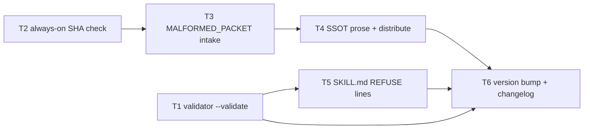

# Plan: reviewer packet fail-closed hardening

Source brief: docs/loom/specs/2026-08-25-reviewer-packet-fail-closed.md
Goal: 派發前封包機械驗證＋可觀察的 MALFORMED_PACKET 拒絕狀態＋verdict 收件端常開 SHA 檢查，三腿一次落地，Codex 相容由共用腳本／SSOT 結構保證。
Stage: finishing
Total tasks: 6
Critical-path depth: 4 (≤5)
Execution order: parallel-where-possible
Plan-document-reviewer verdict: PASS (2026-08-25, round 4)

## Task-flow diagram

## Open Questions

N/A — no unresolved question: OQ-1 is resolved by adopting the brief's stated default (presence + non-empty `plugin_version` check only; no equality check against the installed plugin.json).

## Notes

- Verdict stamped PASS (2026-08-25, round 4) — stamping the verdict, no re-review (amendment kind 1).
- Change-folder binding: two non-archived `docs/loom/<change-id>/` folders exist (`2026-07-12-us-sec-primary-source-layer`, `2026-07-19-8k-prose-kpi-intake`) — both are prior investing-domain arcs unrelated to this work; the user-declared entry artifact for this arc is the brainstorming brief (Layer 0 equivalent: the /goal directive named this fix), so neither folder is consumed.
- Backlog start conditions fired by this arc (record only, not executed here): `2026-08-04-a-rule-can-ship-into-a-skill-and-never-reach-its-agent-contract` (partially addressed by T4), `2026-07-20-loom-gate-hardening-deferred-ci-side-arc` (T2/T3 touch `loom_gate_markers.py`).
- Codex-parity constraint (user-stated mid-arc): every leg ships as shared SKILL.md prose, plugin Python scripts, or regenerated SSOT — no Claude-only mechanism on the main path.
- Prose-rule behavioral verification (T4/T5) cannot be pytest'd — repo precedent `feedback_cc_ll_pytest_infeasibility`; their RED is a grep diagnostic and the live behavioral re-test happens at whole-branch verification, mirroring this session's sandbox method.

## Decision Log

- 2026-08-25 (planning): error-line prefix pinned as `PACKET-INVALID:` — two-way door (renameable pre-release); logged, not briefed.
- 2026-08-25 (planning): version target 0.99.0 (minor, behavior change) — two-way door; logged, not briefed.
- 2026-08-25 (planning): `MALFORMED_PACKET` ships as a `verdict:`-line value, not a separate top-level field — one-way-door test cleared as already user-approved in the brief's Leg B wording (cited, not re-asked).

## Task 1 — Leg A：review_context.py 新增 --validate 封包閘
- Description: Add a `--validate <packet.json>` mode to `review_context.py` that exits 0 on a well-formed packet and nonzero naming the first missing/invalid field.
  - Checks: four keys present and non-empty (`target_repo`, `reviewed_sha`, `plugin_version`, `resources`); `reviewed_sha` matches `^[0-9a-f]{40}$` AND exists in `target_repo` via `git cat-file -e <sha>^{commit}`; every `resources` value is an absolute path that exists.
  - Reuse the key-set/SHA-shape logic pattern from `live_gate_station_receipt.py` (`PACKET_KEYS`) — do not import from it; keep `review_context.py` dependency-free.
  - Reuse-adequacy:
    - Observed: `PACKET_KEYS = {"target_repo", "reviewed_sha", "plugin_version", "resources"}`; its packet SHA check verifies string type, object-format length (40 sha1 / 64 sha256), `[0-9a-f]+` charset, plus fixture-HEAD equality — read loom-code/scripts/live_gate_station_receipt.py:20.
    - Intended: `review_context.py --validate` applies the same four-key presence set to runtime packets; its SHA check pins `^[0-9a-f]{40}$` (no object-format branch, no fixture-HEAD equality) and adds repo-membership via `git cat-file -e <sha>^{commit}` in `target_repo`.
  - Error output: one line per failing field on stderr, machine-greppable prefix `PACKET-INVALID:`.
- Module: loom-code/scripts/review_context.py
- Files touched: loom-code/scripts/review_context.py, loom-code/scripts/test_review_context_validate.py
- Context paths:
  - loom-code/scripts/review_context.py
  - loom-code/scripts/live_gate_station_receipt.py
- Acceptance:
  - RED: `pytest loom-code/scripts/test_review_context_validate.py::test_validate_rejects_malformed_packets` fails (file does not exist yet).
    - Parametrized over: missing each of the four keys, short SHA, non-hex SHA, SHA not in repo, relative/nonexistent resource path, plus one well-formed packet asserting exit 0.
  - GREEN: that test passes; existing `pytest loom-code/scripts/` collection for review_context stays green.
- External surfaces: git CLI (`git cat-file -e`) — stdlib subprocess, already used by this script.
- Dependencies: none
- Independent: true
- Brief item covered: "Leg A — pre-dispatch packet gate. `review_context.py` gains a `--validate` mode (packet JSON in → exit 0 / nonzero with the missing/invalid field named)"
- Status: done(3d612276)
- Gloss: 給封包產生腳本加上驗證模式——派發前先過機械檢查，缺欄位／假 SHA 當場點名拒絕。

## Task 2 — Leg C：validate_verdict_text 常開 reviewed_sha 檢查
- Description: Make `validate_verdict_text` in `loom_gate_markers.py` require a `reviewed_sha:` field whose value matches `_FULL_SHA_RE`, regardless of whether `--expected-head` is passed.
  - A missing, short, non-hex, or literal `unresolved` value is a validation error naming the field.
  - `--expected-head` keeps its existing additional equality check on top.
- Module: loom-code/scripts/loom_gate_markers.py
- Files touched: loom-code/scripts/loom_gate_markers.py, loom-code/scripts/test_loom_gate_markers.py
- Context paths:
  - loom-code/scripts/loom_gate_markers.py
- Acceptance:
  - RED: `pytest loom-code/scripts/test_loom_gate_markers.py::test_verdict_requires_full_sha_without_expected_head` fails — a verdict text lacking `reviewed_sha` (and one with a short SHA) currently validates clean when `--expected-head` is absent.
  - GREEN: that test passes; the full existing `test_loom_gate_markers.py` suite stays green (fixtures gain a valid 40-hex `reviewed_sha` where needed).
- Dependencies: none
- Independent: true
- Brief item covered: "Leg C — always-on SHA check at verdict intake. `validate_verdict_text` requires `reviewed_sha` present and full-40-hex even when `--expected-head` is not passed"
- Status: done(1a85334a)
- Gloss: verdict 收件端永遠檢查完整 40 位 SHA——不再依賴呼叫端記得帶旗標。

## Task 3 — Leg B（腳本側）：MALFORMED_PACKET 永不可 mint 的拒絕狀態
- Description: Teach `loom_gate_markers.py` to recognize `verdict: MALFORMED_PACKET` as an explicit refusal state that can never mint a review-pass marker.
  - Distinct error message (anchor string `malformed-packet refusal`) telling the orchestrator to fix the dispatch packet and re-dispatch — clearly different from a schema-validation error.
  - `MALFORMED_PACKET` is NOT added to `ALLOWED_VERDICTS`; recognition happens before the allowed-values check so the message is the refusal explanation, not a generic enum error.
  - A `missing_fields:` list accompanying the refusal is accepted syntax (not flagged as an unknown field).
- Module: loom-code/scripts/loom_gate_markers.py
- Files touched: loom-code/scripts/loom_gate_markers.py, loom-code/scripts/test_loom_gate_markers.py
- Context paths:
  - loom-code/scripts/loom_gate_markers.py
- Acceptance:
  - RED: `pytest loom-code/scripts/test_loom_gate_markers.py::test_malformed_packet_verdict_never_mints_and_names_refusal` fails.
    - Today a `MALFORMED_PACKET` verdict produces a generic invalid-verdict enum error; the test asserts the distinct refusal message plus nonzero exit on a mint attempt.
  - GREEN: that test passes; full suite green.
- Dependencies: Task 2 completes first
- Independent: false
- Brief item covered: "`loom_gate_markers.py` recognizes `MALFORMED_PACKET` as an explicit never-mintable refusal (clear message, distinct from a schema error)"
- Status: done(161174e4)
- Gloss: 讓「封包不合格」成為機器看得懂的專用狀態——永遠 mint 不出通行證，訊息直接叫 orchestrator 補封包重派。

## Task 4 — Leg B（契約側）：SSOT 改寫 R0/R1a ＋ distribute 再生成
- Description: Rewrite `_reviewer-discipline.md` R0/R1a so the malformed-packet behavior becomes an observable refusal, then re-run `distribute.py`.
  - New behavior: emit exactly `verdict: MALFORMED_PACKET` + a `missing_fields:` list naming each absent/invalid packet field, read no repository content, cite nothing — replacing the "return no verdict" silence contract.
  - Then update each reviewer agent's Output-contract verdict enumeration to name `MALFORMED_PACKET` as the packet-refusal state.
  - The four per-agent Output contract sections (outside the injected block) each gain one line defining `MALFORMED_PACKET`; the injected block is regenerated, never hand-edited.
  - `verify-drift.py` must exit 0 afterward.
- Module: loom-code/scripts/_reviewer-discipline.md (justified scope stretch — the SSOT edit is meaningless without its regenerated derivatives; `distribute.py` writes the four agent files as one atomic distribution unit, and `verify-drift.py` fails on any partial state)
- Files touched: loom-code/scripts/_reviewer-discipline.md, loom-code/agents/spec-reviewer.md, loom-code/agents/code-quality-reviewer.md, loom-code/agents/code-reviewer.md, loom-code/agents/docs-reviewer.md
- Context paths:
  - loom-code/scripts/_reviewer-discipline.md
  - loom-code/scripts/distribute.py
  - loom-code/scripts/verify-drift.py
  - loom-code/scripts/test_reviewer_discipline.py
- Acceptance:
  - RED: diagnostic — `grep -L 'MALFORMED_PACKET' loom-code/agents/*.md` over the four reviewer agent files currently lists all four (none carries the state).
    - Also `grep -c 'return no verdict' loom-code/scripts/_reviewer-discipline.md` is nonzero.
  - GREEN: the grep -L list is empty AND `grep -c 'MALFORMED_PACKET' loom-code/scripts/_reviewer-discipline.md` ≥1 AND `python3 loom-code/scripts/verify-drift.py` exits 0 AND `pytest loom-code/scripts/test_reviewer_discipline.py` green.
- Dependencies: Task 3 completes first
- Independent: true
- Brief item covered: "Leg B — observable refusal state. `scripts/_reviewer-discipline.md` R0/R1a change from \"return no verdict\" … to: emit exactly `verdict: MALFORMED_PACKET` plus a `missing_fields:` list, read no repository content, cite nothing"
- Status: done(94a1c7d9)
- Gloss: 把「沉默拒絕」改成「舉手拒絕」——四個 reviewer 契約經 SSOT 一次改齊，兩個 host 同步生效。

## Task 5 — Leg A（呼叫點）：三個 orchestrator SKILL.md 加 REFUSE 行
- Description: Add one REFUSE line to each of the three orchestrator call sites, immediately after their packet-resolution step: run `review_context.py --validate` on the packet before any reviewer dispatch; a nonzero exit means do not dispatch — fix the packet first.
  - Wording follows each file's existing mechanical-refusal register (mirror the existing `git cat-file -e` refusal phrasing in SDD); resolve the script path the same way each file already resolves `review_context.py`.
  - No new section headers; one line (plus at most one continuation clause) per file.
- Module: loom-code/skills/subagent-driven-development/SKILL.md (justified scope stretch — all three orchestrator call sites implement the same brief item's one REFUSE-line contract and must land together; a partial landing would leave one dispatch path unguarded while the others refuse)
- Files touched: loom-code/skills/subagent-driven-development/SKILL.md, loom-code/skills/requesting-code-review/SKILL.md, loom-code/skills/requesting-docs-review/SKILL.md
- Context paths:
  - loom-code/skills/subagent-driven-development/SKILL.md
  - loom-code/skills/requesting-code-review/SKILL.md
  - loom-code/skills/requesting-docs-review/SKILL.md
- Acceptance:
  - RED: diagnostic — `grep -L 'review_context.py --validate' <the three SKILL.md paths>` currently lists all three files.
  - GREEN: that grep -L list is empty; `python3 loom-code/scripts/check_contract_citations.py` stays green (no dev-record citations introduced).
- Dependencies: Task 1 completes first
- Independent: true
- Brief item covered: "The three orchestrator call sites … add one REFUSE line: run the validator before any reviewer dispatch; nonzero exit → do not dispatch"
- Status: done(961c4edc)
- Gloss: 三個派工站各加一行守門令——封包沒過驗證器就不准派 reviewer。

## Task 6 — 版本 bump 0.99.0 ＋ CHANGELOG ＋ manifest 同步
- Description: Bump `loom-code/.claude-plugin/plugin.json` to `0.99.0`, add a CHANGELOG entry describing the three legs, and run the repo's manifest sync (marketplace + Codex mirror) so the release surfaces stay consistent.
  - Follow the repo's version-sync conventions; run the existing sync script for the Codex manifest mirror rather than hand-editing.
- Module: loom-code/.claude-plugin/plugin.json (justified scope stretch — version bump, CHANGELOG entry, and manifest sync are one tightly-coupled release-administration step; the repo's sync script and `test_sync_codex_manifest.py` fail on any partial state)
- Files touched: loom-code/.claude-plugin/plugin.json, loom-code/CHANGELOG.md, .claude-plugin/marketplace.json, loom-code/.codex-plugin/plugin.json
- Context paths:
  - loom-code/CHANGELOG.md
  - loom-code/scripts/sync_codex_manifests.py
- Acceptance:
  - RED: diagnostic — `grep -c '\[0.99.0\]' loom-code/CHANGELOG.md` is 0 and plugin.json still reads `0.98.1`.
  - GREEN: CHANGELOG has a dated `[0.99.0]` entry; both plugin manifests and marketplace.json read `0.99.0`; `pytest loom-code/scripts/test_sync_codex_manifest.py` green.
- Dependencies: Tasks 1, 4, 5 complete first
- Independent: false
- Brief item covered: "Regenerate agents via `distribute.py`; bump plugin version to 0.99.0" (Decision)
- Status: done(efd10d92)
- Gloss: 收尾——版本號、更新日誌、兩個 host 的 manifest 一次同步，讓 plugin update 能真的把新機制發出去。
