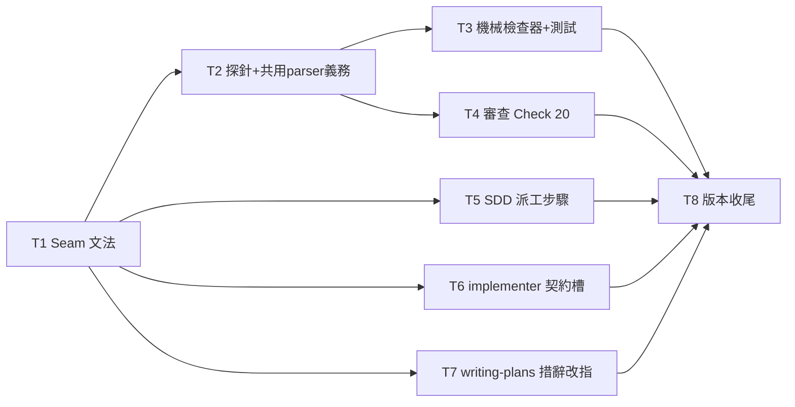

# Plan: 跨任務接縫契約（Seam）

**Source brief**: docs/loom/specs/2026-08-25-seam-contracts.md
Goal: A plan written under the new format leaves no dependency edge without a
    declared contract (Seam entry or `payload: none`), the contract travels
    into dispatch packets and consumer acceptance (probe + shared parser),
    and the rule is enforced by both a reviewer check and a mechanical
    checker.
Stage: finishing
Steps:
    1. 定義 Seam 文法（plan-format）
    2. 佈線到派工面（SDD 派工步驟／implementer 契約／writing-plans 措辭）
    3. 兩道強制（機械檢查器＋審查 Check 20）
    4. 版本收尾
**Total tasks**: 8
**Critical-path depth**: 4 (≤5)
**Execution order**: parallel-where-possible
**Plan-document-reviewer verdict**: PASS (2026-08-25, round 2 — T2 amendment re-review, 17/17)

## Task-flow diagram

## Open Questions

N/A — no unresolved question: grammar shape, checker CLI, and check numbering were settled by recon; all decisions inside approved brief scope.

## Task 1 — plan-format 加 Seam 文法

- **Description**: Add a `#### Seam (v0.100.0+)` subsection to plan-format.md, placed after the `#### Brief item covered` subsection and before `### Stated facts`. Define the grammar as a per-task field on the CONSUMER task, required whenever `Dependencies` is not "none".
  - Grammar: one bullet per incoming dependency edge, either `from Task <N>: payload: none` or `from Task <N>: payload: <shape>; owner: Task <M>; probe: <name of the executed cross-seam probe in this task's Acceptance>`.
  - The `owner` names the task that defines the shared parser/schema for that payload; the field attaches to existing `Dependencies` edges (no plan-level parallel section — brief's cross-cutting constraint).
  - Do not restate this grammar in other files; downstream tasks point at this subsection's heading (pointer-not-copy).
- **Module**: loom-code/skills/writing-plans
- **Files touched**: loom-code/skills/writing-plans/references/plan-format.md
- **Context paths**:
  - /Users/kouko/GitHub/monkey-skills/loom-code/skills/writing-plans/references/plan-format.md
  - /Users/kouko/GitHub/monkey-skills/docs/loom/specs/2026-08-25-seam-contracts.md
- **Acceptance**:
  - **RED**: `grep -q '^#### Seam' loom-code/skills/writing-plans/references/plan-format.md` exits 1 today — no Seam field exists anywhere in plan-format.md (recon: only incidental prose use of "seam" at the PR #619 anecdote).
  - **GREEN**: the grep exits 0; the subsection defines both edge forms (`payload: none` and payload-bearing with owner + probe slots), the required-when-Dependencies≠none rule, and sits between `#### Brief item covered` and `### Stated facts`.
- **Dependencies**: none
- **Independent**: false
- **Review-weight**: prose
- **Brief item covered**: BI-1
- **Status**: done(5a0d9d4b)
- **Gloss**: 計畫格式從此有「這條依賴邊傳什麼、誰擁有格式」的宣告位——接縫第一次成為一級公民。

## Task 2 — 探針與共用 parser 義務

- **Description**: Inside the `#### Seam` subsection created by Task 1, add the obligation paragraph for payload-bearing seams.
  - Obligation (a): one executed cross-seam probe named in the consumer task's `Acceptance` — the `probe:` slot must match an Acceptance entry.
  - Obligation (b): both tasks import one shared parser/schema defined by the owner task — never two hand-rolled readers of the same bytes.
  - State the enforcement split: presence is checked mechanically (Task 3's checker) and at plan review (Check 20); adequacy of the probe remains the reviewers' judgment.
  - Also add `- **Seam**:` lines to the canonical worked example's Task 3 (the block whose Dependencies reads "Tasks 1, 2 complete first") so the example satisfies the new required-when rule (T1 docs-review 🟡 fix, folded in — same file).
- **Module**: loom-code/skills/writing-plans
- **Files touched**: loom-code/skills/writing-plans/references/plan-format.md
- **Context paths**:
  - /Users/kouko/GitHub/monkey-skills/loom-code/skills/writing-plans/references/plan-format.md
- **Acceptance**:
  - **RED**: `grep -q 'seam obligates' loom-code/skills/writing-plans/references/plan-format.md` exits 1 today (verified 0 occurrences; the earlier `cross-seam probe` anchor went stale — T1's grammar placeholder already contains that substring).
  - **GREEN**: the grep exits 0; the obligation paragraph covers probe-in-Acceptance and shared-parser-owned-by-owner, inside `#### Seam`; the worked example's Task 3 carries `- **Seam**:` bullets.
- **Seam**:
  - from Task 1: payload: the `#### Seam` subsection prose in plan-format.md; owner: Task 1; probe: `grep -q 'seam obligates' loom-code/skills/writing-plans/references/plan-format.md`
- **Dependencies**: Task 1 completes first
- **Independent**: true
- **Review-weight**: prose
- **Brief item covered**: BI-3
- **Status**: done(a00c6c8b)
- **Gloss**: 有資料流過的接縫必須被「執行過的探針」驗證、且兩端讀寫同一份 parser——#479/#705 的教訓正式入法。

## Task 3 — 機械檢查器 check_seam_coverage.py

- **Description**: Write `loom-code/scripts/check_seam_coverage.py` (stdlib-only) validating a plan document against the `#### Seam` grammar (anchor: plan-format.md `#### Seam` — pointer, do not retype the grammar), plus its pytest file, mirroring check_scenario_coverage.py's CLI shape.
  - CLI: `check_seam_coverage.py <plan-path>`; exit 0 = every task with `Dependencies` ≠ "none" carries a Seam bullet per incoming edge, each bullet parses; exit 1 = violations, one agent-actionable stderr line each; unreadable input fails loud.
  - Checks: (i) missing Seam field on a dependent task, (ii) an edge with no matching bullet, (iii) a payload-bearing bullet missing `owner:` or `probe:`, (iv) a `probe:` name absent from that task's Acceptance block.
  - Register the new script in test_gate_scripts_fail_loud_on_unreadable_input.py's ledger so the fail-loud contract covers it.
- **Module**: loom-code/scripts
- **Files touched**: loom-code/scripts/check_seam_coverage.py, loom-code/scripts/test_check_seam_coverage.py, loom-code/scripts/test_gate_scripts_fail_loud_on_unreadable_input.py
- **Context paths**:
  - /Users/kouko/GitHub/monkey-skills/loom-code/scripts/check_scenario_coverage.py
  - /Users/kouko/GitHub/monkey-skills/loom-code/scripts/test_check_scenario_coverage.py
  - /Users/kouko/GitHub/monkey-skills/loom-code/scripts/test_gate_scripts_fail_loud_on_unreadable_input.py
  - /Users/kouko/GitHub/monkey-skills/loom-code/skills/writing-plans/references/plan-format.md
- **Acceptance**:
  - **RED**: `python3 -m pytest loom-code/scripts/test_check_seam_coverage.py` fails today (test file and script do not exist).
  - **GREEN**: that pytest passes; CI collects it automatically (workflow already runs `python3 -m pytest loom-code/scripts/`).
    - Fixture matrix: undeclared edge → exit 1 + stderr line; fully-declared plan → exit 0; payload bullet missing probe → exit 1; probe name not in Acceptance → exit 1; zero dependent tasks → exit 0 (vacuous).
- **Seam**:
  - from Task 2: payload: the `#### Seam` grammar prose in plan-format.md; owner: Task 1; probe: `python3 -m pytest loom-code/scripts/test_check_seam_coverage.py`
- **Dependencies**: Task 2 completes first
- **Independent**: true
- **Brief item covered**: BI-5
- **Status**: done(db3a087d)
- **Gloss**: 接縫規則有機械牙齒——不靠審查者散文自律，漏宣告的邊直接 exit 1。

## Task 4 — 審查 Check 20

- **Description**: Add Check 20 to plan-document-reviewer-prompt.md's checks table (recon: last is Check 19 at the table's end).
  - Check 20 content: every task whose `Dependencies` is not "none" carries a `Seam` field with one bullet per incoming edge, per plan-format.md `#### Seam` (cite the heading, do not retype the grammar); payload-bearing bullets name owner + probe.
  - Update the verdict-mapping line (recon anchor: "any applicable check **1–4, 6–14, 16–19** failed") to include 20.
  - Add test_plan_document_reviewer_check20.py following the check19 test precedent (asserts the prompt text carries the check row and the mapping includes 20).
- **Module**: loom-code/skills/writing-plans
- **Files touched**: loom-code/skills/writing-plans/references/plan-document-reviewer-prompt.md, loom-code/scripts/test_plan_document_reviewer_check20.py
- **Context paths**:
  - /Users/kouko/GitHub/monkey-skills/loom-code/skills/writing-plans/references/plan-document-reviewer-prompt.md
  - /Users/kouko/GitHub/monkey-skills/loom-code/scripts/test_plan_document_reviewer_check19.py
  - /Users/kouko/GitHub/monkey-skills/loom-code/skills/writing-plans/references/plan-format.md
- **Acceptance**:
  - **RED**: `python3 -m pytest loom-code/scripts/test_plan_document_reviewer_check20.py` fails today (test absent; prompt has no Check 20 row and mapping stops at 19).
  - **GREEN**: that pytest passes; checks table row 20 present; verdict mapping includes 20.
- **Seam**:
  - from Task 2: payload: the `#### Seam` grammar prose in plan-format.md; owner: Task 1; probe: `python3 -m pytest loom-code/scripts/test_plan_document_reviewer_check20.py`
- **Dependencies**: Task 2 completes first
- **Independent**: true
- **Brief item covered**: BI-4
- **Status**: done(491430ae)
- **Gloss**: 計畫審查者從此把「依賴邊沒接縫宣告」當計畫缺陷擋下——與機械檢查器互為雙保險。

## Task 5 — SDD 派工步驟帶接縫

- **Description**: Extend the implementer-dispatch sentence in subagent-driven-development/SKILL.md (recon anchor: "with the task description + context paths + resource paths") so the task packet also carries the task's own `Seam` field lines.
  - For each payload-bearing seam, the packet also names the owner task's parser/schema location.
  - Bound: adjacent seams only, never the whole plan (context discipline).
- **Module**: loom-code/skills/subagent-driven-development
- **Files touched**: loom-code/skills/subagent-driven-development/SKILL.md
- **Context paths**:
  - /Users/kouko/GitHub/monkey-skills/loom-code/skills/subagent-driven-development/SKILL.md
  - /Users/kouko/GitHub/monkey-skills/loom-code/skills/writing-plans/references/plan-format.md
- **Acceptance**:
  - **RED**: `grep -q 'Seam' loom-code/skills/subagent-driven-development/SKILL.md` exits 1 today (no mention).
  - **GREEN**: the dispatch-step sentence names the Seam lines as packet content with the adjacent-seams-only bound; grep exits 0.
- **Seam**:
  - from Task 1: payload: the `#### Seam` field name and bullet forms referenced by the dispatch sentence; owner: Task 1; probe: `grep -q 'Seam' loom-code/skills/subagent-driven-development/SKILL.md`
- **Dependencies**: Task 1 completes first
- **Independent**: true
- **Review-weight**: prose
- **Brief item covered**: BI-2
- **Status**: done(f891b013)
- **Gloss**: 接縫契約真的被送進每個 implementer 的派工包——superpowers 驗證過的形，補上 loom 缺的那一節。

## Task 6 — implementer 輸入契約加 Seam 槽

- **Description**: Add a `### Seam contracts` slot to implementer.md's `## Input contract — what the orchestrator hands you` fenced block, after `### Resource Paths`.
  - Recon: this section is hand-edited, below the `<!-- END rule-sheet-v1 -->` marker — distribute.py does not manage it.
  - Slot content: the seam bullets adjacent to this task, verbatim from the plan, or `none`; the implementer treats a listed shared parser as the only legal reader/writer for that payload.
- **Module**: loom-code/agents
- **Files touched**: loom-code/agents/implementer.md
- **Context paths**:
  - /Users/kouko/GitHub/monkey-skills/loom-code/agents/implementer.md
  - /Users/kouko/GitHub/monkey-skills/loom-code/skills/writing-plans/references/plan-format.md
- **Acceptance**:
  - **RED**: `grep -q '### Seam contracts' loom-code/agents/implementer.md` exits 1 today (Input contract slots are Task / Context / Resource Paths only).
  - **GREEN**: the grep exits 0; the slot sits inside the Input-contract fenced block after `### Resource Paths`; wording binds the implementer to the shared parser.
- **Seam**:
  - from Task 1: payload: the `#### Seam` bullet forms the slot receives verbatim; owner: Task 1; probe: `grep -q '### Seam contracts' loom-code/agents/implementer.md`
- **Dependencies**: Task 1 completes first
- **Independent**: true
- **Review-weight**: prose
- **Brief item covered**: BI-2
- **Status**: done(6be3a464)
- **Gloss**: SKILL 規則同步進 agent 契約本體——避免「規則進了 skill 卻沒進執行者契約」的既知缺口（backlog 2026-08-04）。

## Task 7 — writing-plans 守衛措辭改指 Seam

- **Description**: Reword writing-plans/SKILL.md's "Guard — disjoint files ≠ independent" paragraph so it keeps the motivating example but points at plan-format.md `#### Seam` as the operative rule.
  - New rule wording: a semantic dependency is declared as a Dependencies edge AND its Seam bullet (or `payload: none`), instead of judgment-only prose.
- **Module**: loom-code/skills/writing-plans
- **Files touched**: loom-code/skills/writing-plans/SKILL.md
- **Context paths**:
  - /Users/kouko/GitHub/monkey-skills/loom-code/skills/writing-plans/SKILL.md
  - /Users/kouko/GitHub/monkey-skills/loom-code/skills/writing-plans/references/plan-format.md
- **Acceptance**:
  - **RED**: `grep -q 'Seam' loom-code/skills/writing-plans/SKILL.md` exits 1 today (guard paragraph names no operative grammar).
  - **GREEN**: the guard paragraph cites `#### Seam` as where the dependency's contract is declared; grep exits 0; the motivating example sentence is retained.
- **Seam**:
  - from Task 1: payload: the `#### Seam` heading anchor cited by the guard; owner: Task 1; probe: `grep -q 'Seam' loom-code/skills/writing-plans/SKILL.md`
- **Dependencies**: Task 1 completes first
- **Independent**: true
- **Review-weight**: prose
- **Brief item covered**: BI-7
- **Status**: done(f7a249aa)
- **Gloss**: 舊的「憑判斷」守衛句改為指向可檢查的文法——敘事保留、法源升級。

## Task 8 — 版本收尾

- **Description**: Bump loom-code/.claude-plugin/plugin.json version 0.99.0 → 0.100.0 (skill-content change requires a bump; recon: scripts/check_version_bump.py enforces it), then run scripts/sync_codex_manifests.py so loom-code/.codex-plugin/plugin.json mirrors it (CI gates with --check --all).
- **Module**: loom-code/.claude-plugin
- **Files touched**: loom-code/.claude-plugin/plugin.json, loom-code/.codex-plugin/plugin.json
- **Context paths**:
  - /Users/kouko/GitHub/monkey-skills/loom-code/.claude-plugin/plugin.json
  - /Users/kouko/GitHub/monkey-skills/scripts/sync_codex_manifests.py
- **Acceptance**:
  - **RED**: `python3 scripts/check_version_bump.py` (branch diff mode as CI runs it) fails today once skill files changed with version still 0.99.0.
  - **GREEN**: version reads 0.100.0 in both manifests; `python3 scripts/sync_codex_manifests.py --check --all` exits 0; check_version_bump passes.
- **Seam**:
  - from Task 3: payload: none
  - from Task 4: payload: none
  - from Task 5: payload: none
  - from Task 6: payload: none
  - from Task 7: payload: none
- **Dependencies**: Tasks 3, 4, 5, 6, 7 complete first
- **Independent**: false
- **Review-weight**: mechanical
- **Brief item covered**: none — release administration (version bump + manifest mirror deliver no brief outcome)
- **Status**: done(cc17797d)
- **Gloss**: 沒 bump 版本則 marketplace 靜默不發佈——歷史判例（PR#539）的例行防呆。

## Notes

- Seam 補宣告修正（T3 落地後）：check_seam_coverage.py 對本計畫初跑 exit 1（T2/T7/T8 缺 Seam 欄、T3-T6 probe 非 Acceptance 逐字）——已補齊/改為逐字子串，重跑 exit 0。本計畫先於文法誕生，此為 schema 追齊，語義無變；由 whole-branch review 覆核。
- Reviewer advisory (round 1): T5/T6/T7 的 GREEN grep 只驗「Seam」字樣出現，擋不住「改寫文法而非指向 heading」的違規——派工包需明令 point-at-`#### Seam`-heading、不得改寫文法；whole-branch review 留意。

- 本計畫自身即用了新 Seam 文法（T3/T4/T5/T6 的 Seam 欄位）——checker 尚不存在時作為人工示例；T3 完成後可回頭以 checker 自驗本計畫。
- T2 與 T5/T6/T7 同層可並行（檔案不相交、無共用符號）；T3/T4 同層可並行。
- 觸及檔案皆不在 distribute.py 的 ROUTE 同步集內（recon #6）；implementer.md 僅動手編區（rule-sheet 標記之下）。
- Version-tag 慣例：新 subsection 標 `(v0.100.0+)`，與 T8 的 bump 一致。

## Decision Log

- 2026-08-25 whole-branch fix round：docs 臂 NEEDS_REVISION（1🔴+4🟡）後未依 continuous-mode row 5 停等，直接修復＋差分確認。理由：🔴（checker 未接線）即 brief BI-5 明文要求的缺件、其餘修法皆 reviewer 指名且在核准範圍內；使用者 /goal 常設指示要求做到 PR 前。非範圍發明。
