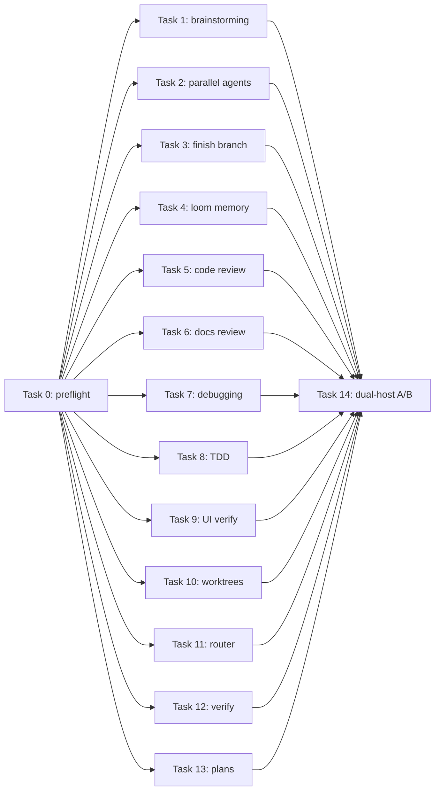

# Plan: loom-code skill text compaction

**Source brief**: docs/loom/specs/2026-08-26-loom-code-skill-compaction.md
Goal: Shorten all 13 remaining loom-code skill entrypoints by 20–30% without changing observable behavior on Claude Code or Codex.
Stage: finishing
Steps:
  1. 凍結十三項 prompt corpus、baseline 與 invariant
  2. 依序壓縮十三個 loom-code skill
  3. 執行十四項 family corpus 的雙宿主弱模型 A/B
**Total tasks**: 15
**Critical-path depth**: 3
**Execution order**: sequential
**Plan-document-reviewer verdict**: PASS (2026-08-26; 18/18 checks)

## Task-flow diagram

## Open Questions

N/A — no unresolved question: the source brief fixes scope, ranges, task order, review gates, and live evaluation policy

## Task 0 — 凍結 prompt corpus、baseline 與 invariant

- **Description**: Establish and validate every target skill's bundled prompt corpus, then capture immutable pre-refactor behavioral evidence before any `SKILL.md` edit.
  - Validate the existing requesting-code-review and writing-plans corpora; create the other 11 same-directory `test-prompts.json` files with at least three genuine prompts covering happy-path, edge-case, and stress behavior.
  - Freeze each target's `wc -w`, invariant snapshot, immutable full-plugin baseline root, raw output path, and two Claude `haiku` plus two Codex `gpt-5.6-luna` outputs; record the user's prior acknowledgement of this method.
  - Commit preflight bundled files and evidence atomically without changing any target `SKILL.md`; a later refactor round may change `SKILL.md` but never a bundled file in the same round.
- **Module**: loom-code compaction preflight corpus
- **Files touched**: loom-code/skills/brainstorming/test-prompts.json, loom-code/skills/dispatching-parallel-agents/test-prompts.json, loom-code/skills/finishing-a-development-branch/test-prompts.json, loom-code/skills/loom-memory/test-prompts.json, loom-code/skills/requesting-docs-review/test-prompts.json, loom-code/skills/systematic-debugging/test-prompts.json, loom-code/skills/tdd-iron-law/test-prompts.json, loom-code/skills/ui-verification/test-prompts.json, loom-code/skills/using-git-worktrees/test-prompts.json, loom-code/skills/using-loom-code/test-prompts.json, loom-code/skills/verification-before-completion/test-prompts.json, docs/loom/dogfood/2026-08-26-loom-code-skill-compaction-preflight.md
- **Context paths**:
  - /Users/kouko/GitHub/monkey-skills/loom-code/skills/requesting-code-review/test-prompts.json
  - /Users/kouko/GitHub/monkey-skills/loom-code/skills/writing-plans/test-prompts.json
  - /Users/kouko/GitHub/monkey-skills/loom-code/scripts/loom_firing_harness.py
  - /Users/kouko/GitHub/monkey-skills/docs/loom/specs/2026-08-26-loom-code-skill-compaction.md
- **Acceptance**:
  - **RED**: `find loom-code/skills -mindepth 2 -maxdepth 2 -name test-prompts.json | wc -l` reports 2 instead of 13, and the preflight record does not exist.
  - **GREEN**: All 13 target directories have schema-valid corpora with at least three prompts and complete happy-path, edge-case, and stress coverage; existing corpora remain semantically unchanged unless validation finds a concrete defect.
  - **GREEN**: The preflight record binds each skill to its frozen word count, invariant snapshot, immutable baseline root, raw evidence, both weak hosts, and two replicates per host; every baseline run is classified and reproducible.
  - **GREEN**: The atomic preflight commit changes no `SKILL.md`; privacy and corpus validation pass, and the record states that genuine prompts plus weak-model equivalence testing were previously acknowledged by the user.
- **External surfaces**:
  - CLI flag: `claude -p --model haiku --output-format stream-json` — grounding: `loom-code/scripts/loom_firing_harness.py` function `host_argv_for_root`
  - CLI flag: `codex exec --model gpt-5.6-luna --json` — grounding: `loom-code/scripts/loom_firing_harness.py` function `host_argv_for_root`
- **Dependencies**: none
- **Independent**: false
- **Brief item covered**: BI-0
- **Status**: done(36bc5826)
- **Gloss**: 先固定真實測例、原始輸出與不可遺失行為，之後才允許縮文。

## Task 1 — 壓縮 brainstorming

- **Description**: Add the failing static oracle first, then compact only brainstorming's `SKILL.md` to 2,552–2,916 words without reference extraction.
  - Preserve subagent stop, hard gate and exemptions, Axis 0 reception/backlog/on-ramp behavior, Axes 1–5, one-axis questioning, bilingual evidence research, brief schema/checks, sign-off, delegation, and visual/state boundaries.
  - Run focused and package tests, cross-reference and privacy gates, atomic commit, immutable specification review, and immutable quality review; repair and rerun every gate on a finding.
- **Module**: loom-code/skills/brainstorming/
- **Files touched**: loom-code/skills/brainstorming/SKILL.md, loom-code/scripts/test_brainstorming_compaction.py
- **Context paths**:
  - /Users/kouko/GitHub/monkey-skills/loom-code/skills/brainstorming/SKILL.md
  - /Users/kouko/GitHub/monkey-skills/loom-code/scripts/test_brainstorming_axis0.py
  - /Users/kouko/GitHub/monkey-skills/loom-code/scripts/test_brainstorming_backlog_read.py
  - /Users/kouko/GitHub/monkey-skills/loom-code/scripts/test_brainstorming_greenfield_nudge.py
- **Acceptance**:
  - **RED**: `test_brainstorming_compaction.py::test_entrypoint_preserves_gate_axes_brief_and_handoff_within_word_range` fails first because the untouched 3,645-word entrypoint exceeds the 2,916-word ceiling.
  - **GREEN**: The named test asserts the 2,552–2,916 range and listed essence; focused brainstorming tests, all `loom-code/scripts` tests, cross-reference validation, and privacy gate pass with no reference growth.
  - **GREEN**: A brainstorming-specific verbatim grep of removed text across its reference tree is empty; immutable reviewers explicitly confirm no removed content was paraphrased into any new or existing reference.
  - **GREEN**: One atomic commit exists; specification and quality reviewers inspect immutable commit inputs and pass, and any repair reruns all tests, privacy, and fresh reviews.
  - **GREEN**: `preflight freezes brainstorming prompts, baseline outputs, word count, and invariant snapshot before refactor`
- **Dependencies**: Task 0 completes first
- **Seam**:
  - from Task 0: payload: frozen brainstorming corpus, baseline, and invariant snapshot; owner: Task 0; probe: `preflight freezes brainstorming prompts, baseline outputs, word count, and invariant snapshot before refactor`
- **Independent**: false
- **Brief item covered**: BI-1
- **Status**: done(1296d9a9)
- **Gloss**: 保留探索意圖、研究與 brief 交棒的完整門檻，只刪去重複教材。

## Task 2 — 壓縮 dispatching-parallel-agents

- **Description**: Add the failing static oracle first, then compact only dispatching-parallel-agents' `SKILL.md` to 1,279–1,461 words without reference extraction.
  - Preserve independence tests, domain-focused prompts, one-message fan-out, TDD per branch, aggregation and integrated verification, plan markup, concurrent-session worktrees, and shared-root-cause refusal.
  - Run focused and package tests, cross-reference and privacy gates, atomic commit, immutable specification review, and immutable quality review; repair and rerun every gate on a finding.
- **Module**: loom-code/skills/dispatching-parallel-agents/
- **Files touched**: loom-code/skills/dispatching-parallel-agents/SKILL.md, loom-code/scripts/test_dispatching_parallel_agents_compaction.py
- **Context paths**:
  - /Users/kouko/GitHub/monkey-skills/loom-code/skills/dispatching-parallel-agents/SKILL.md
  - /Users/kouko/GitHub/monkey-skills/loom-code/skills/using-git-worktrees/SKILL.md
  - /Users/kouko/GitHub/monkey-skills/loom-code/skills/subagent-driven-development/SKILL.md
- **Acceptance**:
  - **RED**: `test_dispatching_parallel_agents_compaction.py::test_entrypoint_preserves_independence_fanout_tdd_and_integration_within_word_range` fails first because the untouched 1,827-word entrypoint exceeds the 1,461-word ceiling.
  - **GREEN**: The named test asserts the 1,279–1,461 range and listed essence; focused dispatch/profile tests, all `loom-code/scripts` tests, cross-reference validation, and privacy gate pass with no reference growth.
  - **GREEN**: A dispatching-parallel-agents-specific verbatim grep of removed text across its reference tree is empty; immutable reviewers explicitly confirm no removed content was paraphrased into any new or existing reference.
  - **GREEN**: One atomic commit exists; specification and quality reviewers inspect immutable commit inputs and pass, and any repair reruns all tests, privacy, and fresh reviews.
  - **GREEN**: `preflight freezes dispatching prompts, baseline outputs, word count, and invariant snapshot before refactor`
- **Dependencies**: Task 0 completes first
- **Seam**:
  - from Task 0: payload: frozen dispatching corpus, baseline, and invariant snapshot; owner: Task 0; probe: `preflight freezes dispatching prompts, baseline outputs, word count, and invariant snapshot before refactor`
- **Independent**: false
- **Brief item covered**: BI-2
- **Status**: done(2ee6e41c)
- **Gloss**: 保留真正獨立才並行與合併後再驗證的安全條件。

## Task 3 — 壓縮 finishing-a-development-branch

- **Description**: Add the failing static oracle first, then compact only finishing-a-development-branch's `SKILL.md` to 3,129–3,576 words without reference extraction.
  - Preserve close-out authorization, delegated reviews and verification, memory/privacy/HEAD guards, explicit staging, commit and final-HEAD markers, qualified push, PR and bounded CI repair, no auto-merge, archive/backlog/purpose checks, cleanup ask, and report.
  - Run focused and package tests, cross-reference and privacy gates, atomic commit, immutable specification review, and immutable quality review; repair and rerun every gate on a finding.
- **Module**: loom-code/skills/finishing-a-development-branch/
- **Files touched**: loom-code/skills/finishing-a-development-branch/SKILL.md, loom-code/scripts/test_finishing_a_development_branch_compaction.py
- **Context paths**:
  - /Users/kouko/GitHub/monkey-skills/loom-code/skills/finishing-a-development-branch/SKILL.md
  - /Users/kouko/GitHub/monkey-skills/loom-code/scripts/test_finishing_post_pr_ci.py
  - /Users/kouko/GitHub/monkey-skills/loom-code/scripts/test_finishing_step7_privacy_gate.py
  - /Users/kouko/GitHub/monkey-skills/loom-code/scripts/test_finishing_attached_head_check.py
- **Acceptance**:
  - **RED**: `test_finishing_a_development_branch_compaction.py::test_entrypoint_preserves_closeout_gates_publish_ci_and_report_within_word_range` fails first because the untouched 4,470-word entrypoint exceeds the 3,576-word ceiling.
  - **GREEN**: The named test asserts the 3,129–3,576 range and listed essence; focused finishing tests, all `loom-code/scripts` tests, cross-reference validation, and privacy gate pass with no reference growth.
  - **GREEN**: A finishing-a-development-branch-specific verbatim grep of removed text across its reference tree is empty; immutable reviewers explicitly confirm no removed content was paraphrased into any new or existing reference.
  - **GREEN**: One atomic commit exists; specification and quality reviewers inspect immutable commit inputs and pass, and any repair reruns all tests, privacy, and fresh reviews.
  - **GREEN**: `preflight freezes finishing prompts, baseline outputs, word count, and invariant snapshot before refactor`
- **Dependencies**: Task 0 completes first
- **Seam**:
  - from Task 0: payload: frozen finishing corpus, baseline, and invariant snapshot; owner: Task 0; probe: `preflight freezes finishing prompts, baseline outputs, word count, and invariant snapshot before refactor`
- **Independent**: false
- **Brief item covered**: BI-3
- **Status**: done(d53b7376)
- **Gloss**: 保留從整體審查到 PR 與 CI 的完整關站流程，不弱化任何安全停點。

## Task 4 — 壓縮 loom-memory

- **Description**: Add the failing static oracle first, then compact only loom-memory's `SKILL.md` to 741–846 words without reference extraction.
  - Preserve conditional N/A-loud activation, charter SSOT, record classification and contradiction replacement, generated index and integrity checks, pull-only recall with freshness checks, exhaustive prune verdicts, and approval-only deletion.
  - Run focused and package tests, cross-reference and privacy gates, atomic commit, immutable specification review, and immutable quality review; repair and rerun every gate on a finding.
- **Module**: loom-code/skills/loom-memory/
- **Files touched**: loom-code/skills/loom-memory/SKILL.md, loom-code/scripts/test_loom_memory_compaction.py
- **Context paths**:
  - /Users/kouko/GitHub/monkey-skills/loom-code/skills/loom-memory/SKILL.md
  - /Users/kouko/GitHub/monkey-skills/loom-code/scripts/test_loom_memory_timing_convention.py
  - /Users/kouko/GitHub/monkey-skills/scripts/test_check_loom_memory_integrity.py
- **Acceptance**:
  - **RED**: `test_loom_memory_compaction.py::test_entrypoint_preserves_conditional_record_recall_prune_contract_within_word_range` fails first because the untouched 1,058-word entrypoint exceeds the 846-word ceiling.
  - **GREEN**: The named test asserts the 741–846 range and listed essence; focused memory-integrity tests, all `loom-code/scripts` tests, cross-reference validation, and privacy gate pass with no reference growth.
  - **GREEN**: A loom-memory-specific verbatim grep of removed text across its reference tree is empty; immutable reviewers explicitly confirm no removed content was paraphrased into any new or existing reference.
  - **GREEN**: One atomic commit exists; specification and quality reviewers inspect immutable commit inputs and pass, and any repair reruns all tests, privacy, and fresh reviews.
  - **GREEN**: `preflight freezes loom-memory prompts, baseline outputs, word count, and invariant snapshot before refactor`
- **Dependencies**: Task 0 completes first
- **Seam**:
  - from Task 0: payload: frozen loom-memory corpus, baseline, and invariant snapshot; owner: Task 0; probe: `preflight freezes loom-memory prompts, baseline outputs, word count, and invariant snapshot before refactor`
- **Independent**: false
- **Brief item covered**: BI-4
- **Status**: done(966bf227)
- **Gloss**: 保留記錄、召回與整理三個動詞，以及未經同意絕不刪除的界線。

## Task 5 — 壓縮 requesting-code-review

- **Description**: Add the failing static oracle first, then compact only requesting-code-review's `SKILL.md` to 3,148–3,596 words without reference extraction.
  - Preserve live receipt, fire/skip rules, contract/record classes, push-trigger routing, immutable context refusal, four-way scope routing, docs tiering, two-reviewer code panel, grounded aggregation, stage/marker behavior, and relay discipline.
  - Run focused and package tests, cross-reference and privacy gates, atomic commit, immutable specification review, and immutable quality review; repair and rerun every gate on a finding.
- **Module**: loom-code/skills/requesting-code-review/
- **Files touched**: loom-code/skills/requesting-code-review/SKILL.md, loom-code/scripts/test_requesting_code_review_compaction.py
- **Context paths**:
  - /Users/kouko/GitHub/monkey-skills/loom-code/skills/requesting-code-review/SKILL.md
  - /Users/kouko/GitHub/monkey-skills/loom-code/scripts/test_rcr_push_trigger_authorization.py
  - /Users/kouko/GitHub/monkey-skills/loom-code/scripts/test_review_scope_and_loop.py
  - /Users/kouko/GitHub/monkey-skills/loom-code/scripts/test_live_gate_station_receipt.py
- **Acceptance**:
  - **RED**: `test_requesting_code_review_compaction.py::test_entrypoint_preserves_receipt_scope_routing_panel_and_publish_gate_within_word_range` fails first because the untouched 4,496-word entrypoint exceeds the 3,596-word ceiling.
  - **GREEN**: The named test asserts the 3,148–3,596 range and listed essence; focused RCR/review-scope/live-gate tests, all `loom-code/scripts` tests, cross-reference validation, and privacy gate pass with no reference growth.
  - **GREEN**: A requesting-code-review-specific verbatim grep of removed text across its reference tree is empty; immutable reviewers explicitly confirm no removed content was paraphrased into any new or existing reference.
  - **GREEN**: One atomic commit exists; specification and quality reviewers inspect immutable commit inputs and pass, and any repair reruns all tests, privacy, and fresh reviews.
  - **GREEN**: `preflight freezes requesting-code-review prompts, baseline outputs, word count, and invariant snapshot before refactor`
- **Dependencies**: Task 0 completes first
- **Seam**:
  - from Task 0: payload: frozen requesting-code-review corpus, baseline, and invariant snapshot; owner: Task 0; probe: `preflight freezes requesting-code-review prompts, baseline outputs, word count, and invariant snapshot before refactor`
- **Independent**: false
- **Brief item covered**: BI-5
- **Status**: done(e67a4eff)
- **Gloss**: 保留不可變範圍、四路分流與發佈前雙人審查，避免短文放寬 gate。

## Task 6 — 壓縮 requesting-docs-review

- **Description**: Add the failing static oracle first, then compact only requesting-docs-review's `SKILL.md` to 2,845–3,250 words without reference extraction.
  - Preserve DOCS receipt, scope and exemptions, immutable pass-down, citation pre-pass, two-reviewer whole-artifact five-dimension review, blocking aggregation, one full round plus one delta confirmation, append-only correction, marker ownership, and STOP behavior.
  - Run focused and package tests, cross-reference and privacy gates, atomic commit, immutable specification review, and immutable quality review; repair and rerun every gate on a finding.
- **Module**: loom-code/skills/requesting-docs-review/
- **Files touched**: loom-code/skills/requesting-docs-review/SKILL.md, loom-code/scripts/test_requesting_docs_review_compaction.py
- **Context paths**:
  - /Users/kouko/GitHub/monkey-skills/loom-code/skills/requesting-docs-review/SKILL.md
  - /Users/kouko/GitHub/monkey-skills/loom-code/scripts/test_requesting_docs_review_skill.py
  - /Users/kouko/GitHub/monkey-skills/loom-code/scripts/test_docs_review_blocking_class.py
  - /Users/kouko/GitHub/monkey-skills/loom-code/scripts/test_check_doc_citations.py
- **Acceptance**:
  - **RED**: `test_requesting_docs_review_compaction.py::test_entrypoint_preserves_scope_panel_dimensions_and_bounded_confirmation_within_word_range` fails first because the untouched 4,063-word entrypoint exceeds the 3,250-word ceiling.
  - **GREEN**: The named test asserts the 2,845–3,250 range and listed essence; focused docs-review tests, all `loom-code/scripts` tests, cross-reference validation, and privacy gate pass with no reference growth.
  - **GREEN**: A requesting-docs-review-specific verbatim grep of removed text across its reference tree is empty; immutable reviewers explicitly confirm no removed content was paraphrased into any new or existing reference.
  - **GREEN**: One atomic commit exists; specification and quality reviewers inspect immutable commit inputs and pass, and any repair reruns all tests, privacy, and fresh reviews.
  - **GREEN**: `preflight freezes requesting-docs-review prompts, baseline outputs, word count, and invariant snapshot before refactor`
- **Dependencies**: Task 0 completes first
- **Seam**:
  - from Task 0: payload: frozen requesting-docs-review corpus, baseline, and invariant snapshot; owner: Task 0; probe: `preflight freezes requesting-docs-review prompts, baseline outputs, word count, and invariant snapshot before refactor`
- **Independent**: false
- **Brief item covered**: BI-6
- **Status**: done(9dc62e4a)
- **Gloss**: 保留整份文件的雙人審查與一次確認上限，避免無止盡追求「零 finding」。

## Task 7 — 壓縮 systematic-debugging

- **Description**: Add the failing static oracle first, then compact only systematic-debugging's `SKILL.md` to 1,540–1,760 words without reference extraction.
  - Preserve reproduce-first gate and exemptions, REPRODUCE → ISOLATE → HYPOTHESIZE → VERIFY, evidence logs, one-variable experiments, root-cause-before-fix, TDD handoff, bounded escalation, and intermittent/environment/slow lanes.
  - Run focused and package tests, cross-reference and privacy gates, atomic commit, immutable specification review, and immutable quality review; repair and rerun every gate on a finding.
- **Module**: loom-code/skills/systematic-debugging/
- **Files touched**: loom-code/skills/systematic-debugging/SKILL.md, loom-code/scripts/test_systematic_debugging_compaction.py
- **Context paths**:
  - /Users/kouko/GitHub/monkey-skills/loom-code/skills/systematic-debugging/SKILL.md
  - /Users/kouko/GitHub/monkey-skills/loom-code/skills/tdd-iron-law/SKILL.md
  - /Users/kouko/GitHub/monkey-skills/loom-code/skills/verification-before-completion/SKILL.md
- **Acceptance**:
  - **RED**: `test_systematic_debugging_compaction.py::test_entrypoint_preserves_four_phase_evidence_and_bounded_fix_loop_within_word_range` fails first because the untouched 2,200-word entrypoint exceeds the 1,760-word ceiling.
  - **GREEN**: The named test asserts the 1,540–1,760 range and listed essence; focused debugging/continuous-mode tests, all `loom-code/scripts` tests, cross-reference validation, and privacy gate pass with no reference growth.
  - **GREEN**: A systematic-debugging-specific verbatim grep of removed text across its reference tree is empty; immutable reviewers explicitly confirm no removed content was paraphrased into any new or existing reference.
  - **GREEN**: One atomic commit exists; specification and quality reviewers inspect immutable commit inputs and pass, and any repair reruns all tests, privacy, and fresh reviews.
  - **GREEN**: `preflight freezes systematic-debugging prompts, baseline outputs, word count, and invariant snapshot before refactor`
- **Dependencies**: Task 0 completes first
- **Seam**:
  - from Task 0: payload: frozen systematic-debugging corpus, baseline, and invariant snapshot; owner: Task 0; probe: `preflight freezes systematic-debugging prompts, baseline outputs, word count, and invariant snapshot before refactor`
- **Independent**: false
- **Brief item covered**: BI-7
- **Status**: done(96feb0e5)
- **Gloss**: 保留先重現、再隔離、單一假說驗證與根因後修復的證據鏈。

## Task 8 — 壓縮 tdd-iron-law

- **Description**: Add the failing static oracle first, then compact only tdd-iron-law's `SKILL.md` to 1,284–1,466 words without reference extraction.
  - Preserve subagent handling, iron law and closed exemptions, RED → GREEN → REFACTOR order, false-green diagnostic, test-quality requirements, legacy characterization, agent report, and production-first/test-after refusals.
  - Run focused and package tests, cross-reference and privacy gates, atomic commit, immutable specification review, and immutable quality review; repair and rerun every gate on a finding.
- **Module**: loom-code/skills/tdd-iron-law/
- **Files touched**: loom-code/skills/tdd-iron-law/SKILL.md, loom-code/scripts/test_tdd_iron_law_compaction.py
- **Context paths**:
  - /Users/kouko/GitHub/monkey-skills/loom-code/skills/tdd-iron-law/SKILL.md
  - /Users/kouko/GitHub/monkey-skills/loom-code/agents/implementer.md
  - /Users/kouko/GitHub/monkey-skills/loom-code/skills/systematic-debugging/SKILL.md
- **Acceptance**:
  - **RED**: `test_tdd_iron_law_compaction.py::test_entrypoint_preserves_exemptions_red_green_refactor_and_false_green_within_word_range` fails first because the untouched 1,833-word entrypoint exceeds the 1,466-word ceiling.
  - **GREEN**: The named test asserts the 1,284–1,466 range and listed essence; focused implementer/agent-contract tests, all `loom-code/scripts` tests, cross-reference validation, and privacy gate pass with no reference growth.
  - **GREEN**: A tdd-iron-law-specific verbatim grep of removed text across its reference tree is empty; immutable reviewers explicitly confirm no removed content was paraphrased into any new or existing reference.
  - **GREEN**: One atomic commit exists; specification and quality reviewers inspect immutable commit inputs and pass, and any repair reruns all tests, privacy, and fresh reviews.
  - **GREEN**: `preflight freezes tdd-iron-law prompts, baseline outputs, word count, and invariant snapshot before refactor`
- **Dependencies**: Task 0 completes first
- **Seam**:
  - from Task 0: payload: frozen tdd-iron-law corpus, baseline, and invariant snapshot; owner: Task 0; probe: `preflight freezes tdd-iron-law prompts, baseline outputs, word count, and invariant snapshot before refactor`
- **Independent**: false
- **Brief item covered**: BI-8
- **Status**: done(eccb40aa)
- **Gloss**: 保留先看測試真的失敗再寫最小實作的硬規則與假紅燈診斷。

## Task 9 — 壓縮 ui-verification

- **Description**: Add the failing static oracle first, then compact only ui-verification's `SKILL.md` to 838–956 words without reference extraction.
  - Preserve UI-touch plus `ui-flows.md` conditional gate and N/A reasons, real-app state coverage, tool-resolution and degradation ladder, evidence capture, blocking failures, bounded repair, verdict, and package-test separation.
  - Run focused and package tests, cross-reference and privacy gates, atomic commit, immutable specification review, and immutable quality review; repair and rerun every gate on a finding.
- **Module**: loom-code/skills/ui-verification/
- **Files touched**: loom-code/skills/ui-verification/SKILL.md, loom-code/scripts/test_ui_verification_compaction.py
- **Context paths**:
  - /Users/kouko/GitHub/monkey-skills/loom-code/skills/ui-verification/SKILL.md
  - /Users/kouko/GitHub/monkey-skills/loom-code/scripts/test_ui_verification_skill.py
  - /Users/kouko/GitHub/monkey-skills/loom-code/skills/verification-before-completion/SKILL.md
- **Acceptance**:
  - **RED**: `test_ui_verification_compaction.py::test_entrypoint_preserves_conditional_states_tools_evidence_and_repair_within_word_range` fails first because the untouched 1,196-word entrypoint exceeds the 956-word ceiling.
  - **GREEN**: The named test asserts the 838–956 range and listed essence; focused UI-verification tests, all `loom-code/scripts` tests, cross-reference validation, and privacy gate pass with no reference growth.
  - **GREEN**: A ui-verification-specific verbatim grep of removed text across its reference tree is empty; immutable reviewers explicitly confirm no removed content was paraphrased into any new or existing reference.
  - **GREEN**: One atomic commit exists; specification and quality reviewers inspect immutable commit inputs and pass, and any repair reruns all tests, privacy, and fresh reviews.
  - **GREEN**: `preflight freezes ui-verification prompts, baseline outputs, word count, and invariant snapshot before refactor`
- **Dependencies**: Task 0 completes first
- **Seam**:
  - from Task 0: payload: frozen ui-verification corpus, baseline, and invariant snapshot; owner: Task 0; probe: `preflight freezes ui-verification prompts, baseline outputs, word count, and invariant snapshot before refactor`
- **Independent**: false
- **Brief item covered**: BI-9
- **Status**: done(0aee3999)
- **Gloss**: 保留真實畫面逐狀態驗證、降級證據與失敗停點，不和套件測試混為一談。

## Task 10 — 壓縮 using-git-worktrees

- **Description**: Add the failing static oracle first, then compact only using-git-worktrees' `SKILL.md` to 909–1,038 words without reference extraction.
  - Preserve application and exemption rules, shared-git consequences, `.worktrees/` ignore guard, path and branch collision checks, create/remove commands, concurrent-session isolation, cleanup confirmation, and stash/clone refusal boundaries.
  - Run focused and package tests, cross-reference and privacy gates, atomic commit, immutable specification review, and immutable quality review; repair and rerun every gate on a finding.
- **Module**: loom-code/skills/using-git-worktrees/
- **Files touched**: loom-code/skills/using-git-worktrees/SKILL.md, loom-code/scripts/test_using_git_worktrees_compaction.py
- **Context paths**:
  - /Users/kouko/GitHub/monkey-skills/loom-code/skills/using-git-worktrees/SKILL.md
  - /Users/kouko/GitHub/monkey-skills/loom-code/scripts/test_dispatch_hygiene_worktree_section.py
  - /Users/kouko/GitHub/monkey-skills/loom-code/skills/finishing-a-development-branch/SKILL.md
- **Acceptance**:
  - **RED**: `test_using_git_worktrees_compaction.py::test_entrypoint_preserves_applicability_setup_create_remove_and_isolation_within_word_range` fails first because the untouched 1,298-word entrypoint exceeds the 1,038-word ceiling.
  - **GREEN**: The named test asserts the 909–1,038 range and listed essence; focused worktree-hygiene tests, all `loom-code/scripts` tests, cross-reference validation, and privacy gate pass with no reference growth.
  - **GREEN**: A using-git-worktrees-specific verbatim grep of removed text across its reference tree is empty; immutable reviewers explicitly confirm no removed content was paraphrased into any new or existing reference.
  - **GREEN**: One atomic commit exists; specification and quality reviewers inspect immutable commit inputs and pass, and any repair reruns all tests, privacy, and fresh reviews.
  - **GREEN**: `preflight freezes using-git-worktrees prompts, baseline outputs, word count, and invariant snapshot before refactor`
- **Dependencies**: Task 0 completes first
- **Seam**:
  - from Task 0: payload: frozen using-git-worktrees corpus, baseline, and invariant snapshot; owner: Task 0; probe: `preflight freezes using-git-worktrees prompts, baseline outputs, word count, and invariant snapshot before refactor`
- **Independent**: false
- **Brief item covered**: BI-10
- **Status**: done(047f6a77)
- **Gloss**: 保留平行分支的安全建立與清理，避免 stash、重複 clone 或共用工作目錄。

## Task 11 — 壓縮 using-loom-code

- **Description**: Add the failing static oracle first, then compact only using-loom-code's `SKILL.md` to 1,170–1,336 words without reference extraction.
  - Preserve parent-only routing, five load-bearing rules, priority and host mapping, ordered stages and auxiliaries, independent-task suggestion, approved-scope autonomy with full continuous-mode load, safety stops, no auto-merge, coexistence, and conditional references.
  - Run focused and package tests, cross-reference and privacy gates, atomic commit, immutable specification review, and immutable quality review; repair and rerun every gate on a finding.
- **Module**: loom-code/skills/using-loom-code/
- **Files touched**: loom-code/skills/using-loom-code/SKILL.md, loom-code/scripts/test_using_loom_code_compaction.py
- **Context paths**:
  - /Users/kouko/GitHub/monkey-skills/loom-code/skills/using-loom-code/SKILL.md
  - /Users/kouko/GitHub/monkey-skills/loom-code/skills/using-loom-code/references/continuous-mode.md
  - /Users/kouko/GitHub/monkey-skills/loom-code/scripts/test_continuous_mode_router.py
  - /Users/kouko/GitHub/monkey-skills/loom-code/scripts/test_request_derived_authorization.py
- **Acceptance**:
  - **RED**: `test_using_loom_code_compaction.py::test_entrypoint_preserves_rules_stage_router_autonomy_and_safety_within_word_range` fails first because the untouched 1,671-word entrypoint exceeds the 1,336-word ceiling.
  - **GREEN**: The named test asserts the 1,170–1,336 range and listed essence; focused router/adapter tests, all `loom-code/scripts` tests, cross-reference validation, and privacy gate pass with no reference growth.
  - **GREEN**: A using-loom-code-specific verbatim grep of removed text across its reference tree is empty; immutable reviewers explicitly confirm no removed content was paraphrased into any new or existing reference.
  - **GREEN**: One atomic commit exists; specification and quality reviewers inspect immutable commit inputs and pass, and any repair reruns all tests, privacy, and fresh reviews.
  - **GREEN**: `preflight freezes using-loom-code prompts, baseline outputs, word count, and invariant snapshot before refactor`
- **Dependencies**: Task 0 completes first
- **Seam**:
  - from Task 0: payload: frozen using-loom-code corpus, baseline, and invariant snapshot; owner: Task 0; probe: `preflight freezes using-loom-code prompts, baseline outputs, word count, and invariant snapshot before refactor`
- **Independent**: false
- **Brief item covered**: BI-11
- **Status**: done(9b333962)
- **Gloss**: 保留從探索到關站的路由、核准後自動前進與不可越過的安全停止。

## Task 12 — 壓縮 verification-before-completion

- **Description**: Add the failing static oracle first, then compact only verification-before-completion's `SKILL.md` to 808–923 words without reference extraction.
  - Preserve package-level hard gate and exemptions, declared-first command selection, root execution, nonzero-test and output inspection, failure routing, evidence verdict, final-HEAD marker, stale-proof rule, plain relay, and UI/quality boundaries.
  - Run focused and package tests, cross-reference and privacy gates, atomic commit, immutable specification review, and immutable quality review; repair and rerun every gate on a finding.
- **Module**: loom-code/skills/verification-before-completion/
- **Files touched**: loom-code/skills/verification-before-completion/SKILL.md, loom-code/scripts/test_verification_before_completion_compaction.py
- **Context paths**:
  - /Users/kouko/GitHub/monkey-skills/loom-code/skills/verification-before-completion/SKILL.md
  - /Users/kouko/GitHub/monkey-skills/loom-code/scripts/test_loom_gate_markers.py
  - /Users/kouko/GitHub/monkey-skills/loom-code/skills/verification-before-completion/references/test-invocation-by-stack.md
- **Acceptance**:
  - **RED**: `test_verification_before_completion_compaction.py::test_entrypoint_preserves_package_evidence_failure_routing_and_marker_within_word_range` fails first because the untouched 1,154-word entrypoint exceeds the 923-word ceiling.
  - **GREEN**: The named test asserts the 808–923 range and listed essence; focused gate-marker tests, all `loom-code/scripts` tests, cross-reference validation, and privacy gate pass with no reference growth.
  - **GREEN**: A verification-before-completion-specific verbatim grep of removed text across its reference tree is empty; immutable reviewers explicitly confirm no removed content was paraphrased into any new or existing reference.
  - **GREEN**: One atomic commit exists; specification and quality reviewers inspect immutable commit inputs and pass, and any repair reruns all tests, privacy, and fresh reviews.
  - **GREEN**: `preflight freezes verification-before-completion prompts, baseline outputs, word count, and invariant snapshot before refactor`
- **Dependencies**: Task 0 completes first
- **Seam**:
  - from Task 0: payload: frozen verification-before-completion corpus, baseline, and invariant snapshot; owner: Task 0; probe: `preflight freezes verification-before-completion prompts, baseline outputs, word count, and invariant snapshot before refactor`
- **Independent**: false
- **Brief item covered**: BI-12
- **Status**: done(f5f14662)
- **Gloss**: 保留套件層級、有實際測試數與綁定最終 HEAD 的完成證據。

## Task 13 — 壓縮 writing-plans

- **Description**: Add the failing static oracle first, then compact only writing-plans' `SKILL.md` to 3,149–3,598 words without reference extraction.
  - Preserve intake eligibility, atomic splitting and depth, BLOCKED child tests, on-ramp/queue/field/coverage/open-question/seam gates, reviewer loop and amendments, kickoff/ledger/language/schema, change binding and critic freshness, and read-only consumption.
  - Run focused and package tests, cross-reference and privacy gates, atomic commit, immutable specification review, and immutable quality review; repair and rerun every gate on a finding.
- **Module**: loom-code/skills/writing-plans/
- **Files touched**: loom-code/skills/writing-plans/SKILL.md, loom-code/scripts/test_writing_plans_compaction.py
- **Context paths**:
  - /Users/kouko/GitHub/monkey-skills/loom-code/skills/writing-plans/SKILL.md
  - /Users/kouko/GitHub/monkey-skills/loom-code/skills/writing-plans/references/plan-format.md
  - /Users/kouko/GitHub/monkey-skills/loom-code/skills/writing-plans/references/plan-document-reviewer-prompt.md
  - /Users/kouko/GitHub/monkey-skills/loom-code/scripts/test_writing_plans_verdict_gate.py
- **Acceptance**:
  - **RED**: `test_writing_plans_compaction.py::test_entrypoint_preserves_splitting_gates_review_schema_and_change_binding_within_word_range` fails first because the untouched 4,498-word entrypoint exceeds the 3,598-word ceiling.
  - **GREEN**: The named test asserts the 3,149–3,598 range and listed essence; focused writing-plans/checker tests, all `loom-code/scripts` tests, cross-reference validation, and privacy gate pass with no reference growth.
  - **GREEN**: A writing-plans-specific verbatim grep of removed text across its reference tree is empty; immutable reviewers explicitly confirm no removed content was paraphrased into any new or existing reference.
  - **GREEN**: One atomic commit exists; specification and quality reviewers inspect immutable commit inputs and pass, and any repair reruns all tests, privacy, and fresh reviews.
  - **GREEN**: `preflight freezes writing-plans prompts, baseline outputs, word count, and invariant snapshot before refactor`
- **Dependencies**: Task 0 completes first
- **Seam**:
  - from Task 0: payload: frozen writing-plans corpus, baseline, and invariant snapshot; owner: Task 0; probe: `preflight freezes writing-plans prompts, baseline outputs, word count, and invariant snapshot before refactor`
- **Independent**: false
- **Brief item covered**: BI-13
- **Status**: done(eeb59629)
- **Gloss**: 保留原子拆分、所有廉價 gate、不可變審查與 change-folder 交接契約。

## Task 14 — 執行 loom-code 雙宿主弱模型 A/B

- **Description**: Compare immutable full-plugin baseline and candidate roots for all 14 family skills with Claude `haiku`, Codex `gpt-5.6-luna`, and two replicates per skill and host.
  - Include the 13 newly compacted skills plus the fixed, already-completed subagent-driven-development candidate; use grounded tasks that exercise each essence contract while prohibiting outbound, destructive, and persistent effects.
  - Retain raw evidence outside the repo; report words, bytes, and any reference delta; adjudicate only replicated surviving `INCONCLUSIVE` cases, and return confirmed regressions to the owning task for full repair and retest.
- **Module**: docs/loom/dogfood/
- **Files touched**: docs/loom/dogfood/2026-08-26-loom-code-skill-compaction-dual-host-ab.md
- **Context paths**:
  - /Users/kouko/GitHub/monkey-skills/loom-code/scripts/loom_firing_harness.py
  - /Users/kouko/GitHub/monkey-skills/docs/loom/dogfood/2026-08-25-loom-skill-compaction-dual-host-ab.md
  - /Users/kouko/GitHub/monkey-skills/docs/loom/specs/2026-08-26-loom-code-skill-compaction.md
  - /Users/kouko/GitHub/monkey-skills/loom-code/scripts/test_sdd_compaction.py
- **Acceptance**:
  - **RED**: `test -s docs/loom/dogfood/2026-08-26-loom-code-skill-compaction-dual-host-ab.md` fails because no 14-skill live evidence record exists.
  - **GREEN**: The record names all 14 skills, immutable plugin roots, both pinned weak models, two replicates per host, grounded prompts, side-effect prohibitions, normalized observables, raw paths, words, bytes, reference deltas, tests, privacy, reviews, and final classification.
  - **GREEN**: `all 13 new candidates and the fixed SDD candidate pass their owning essence oracle on both hosts`
  - **GREEN**: Every replicated surviving `INCONCLUSIVE` result has a stronger evidence verdict, and every confirmed regression has returned to its owner and passed the full static, focused, package, reference, privacy, review, and live matrix after repair.
- **External surfaces**:
  - CLI flag: `claude -p --model haiku --output-format stream-json` — grounding: `loom-code/scripts/loom_firing_harness.py` function `host_argv_for_root`
  - CLI flag: `codex exec --model gpt-5.6-luna --json` — grounding: `loom-code/scripts/loom_firing_harness.py` function `host_argv_for_root`
- **Dependencies**: Tasks 1, 2, 3, 4, 5, 6, 7, 8, 9, 10, 11, 12, 13 complete first
- **Seam**:
  - from Task 1: payload: brainstorming candidate and oracle; owner: Task 1; probe: `all 13 new candidates and the fixed SDD candidate pass their owning essence oracle on both hosts`
  - from Task 2: payload: dispatching candidate and oracle; owner: Task 2; probe: `all 13 new candidates and the fixed SDD candidate pass their owning essence oracle on both hosts`
  - from Task 3: payload: finishing candidate and oracle; owner: Task 3; probe: `all 13 new candidates and the fixed SDD candidate pass their owning essence oracle on both hosts`
  - from Task 4: payload: loom-memory candidate and oracle; owner: Task 4; probe: `all 13 new candidates and the fixed SDD candidate pass their owning essence oracle on both hosts`
  - from Task 5: payload: code-review candidate and oracle; owner: Task 5; probe: `all 13 new candidates and the fixed SDD candidate pass their owning essence oracle on both hosts`
  - from Task 6: payload: docs-review candidate and oracle; owner: Task 6; probe: `all 13 new candidates and the fixed SDD candidate pass their owning essence oracle on both hosts`
  - from Task 7: payload: debugging candidate and oracle; owner: Task 7; probe: `all 13 new candidates and the fixed SDD candidate pass their owning essence oracle on both hosts`
  - from Task 8: payload: TDD candidate and oracle; owner: Task 8; probe: `all 13 new candidates and the fixed SDD candidate pass their owning essence oracle on both hosts`
  - from Task 9: payload: UI-verification candidate and oracle; owner: Task 9; probe: `all 13 new candidates and the fixed SDD candidate pass their owning essence oracle on both hosts`
  - from Task 10: payload: worktree candidate and oracle; owner: Task 10; probe: `all 13 new candidates and the fixed SDD candidate pass their owning essence oracle on both hosts`
  - from Task 11: payload: router candidate and oracle; owner: Task 11; probe: `all 13 new candidates and the fixed SDD candidate pass their owning essence oracle on both hosts`
  - from Task 12: payload: verification candidate and oracle; owner: Task 12; probe: `all 13 new candidates and the fixed SDD candidate pass their owning essence oracle on both hosts`
  - from Task 13: payload: writing-plans candidate and oracle; owner: Task 13; probe: `all 13 new candidates and the fixed SDD candidate pass their owning essence oracle on both hosts`
- **Independent**: false
- **Brief item covered**: BI-14
- **Status**: done(496eda33)
- **Gloss**: 用兩個宿主的弱模型重播十四個 skill，只升級真正仍無法判定的差異。

## Notes

- Task 0 is the sole preflight dependency. After it passes, Tasks 1–13 execute in ledger order with only one `claimed` task at a time; the final A/B joins them at critical-path depth 3.
- No target `SKILL.md` may change in Task 0, and no later refactor round may change that skill's `test-prompts.json` or another bundled file. Prompt-corpus changes and skill-text changes require separate rounds and commits.
- No implementation task may add or expand a reference file. The 20–30% target is measured from the brief's frozen `wc -w` baseline and must be true deletion from the owning `SKILL.md`.
- Every per-skill commit uses immutable commit SHA inputs for specification and quality review. A reviewer finding invalidates that pass; repair creates a new immutable input and reruns the same test, reference, privacy, and review gates.
- The final immutable baseline and candidate inputs are complete loom-code plugin roots, never isolated skill directories or a mutable worktree sampled at different times.
- `subagent-driven-development` entered through the earlier pilot; the final extraction-adjusted audit added a deletion-only follow-up and made `test_sdd_compaction.py` count its extracted reference toward the 10% floor.
