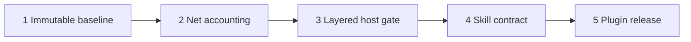

# Plan: skill-refactor package-resource mode

**Source brief**: docs/loom/specs/2026-08-26-skill-refactor-package-mode.md
Goal: `skill-refactor` gains a package-resource mode with immutable baselines, dual-host evidence, layered gates, and honest whole-package net accounting.
Stage: finishing
Steps:
  1. 建立不可變基準
  2. 加入 package 淨會計
  3. 加入分層與雙主機 verdict
  4. 將能力接入 skill 契約
  5. 發布並驗證 plugin
**Total tasks**: 5
**Critical-path depth**: 5
**Execution order**: sequential
**Plan-document-reviewer verdict**: PASS (2026-08-26, round 4; CLI-scope amendment)

## Task-flow diagram

## Open Questions

N/A — no unresolved question: the source brief fixes the four capabilities and the existing-skill design

## Task 1 — 建立不可變基準

- **Description**: Add a stdlib package-gate module that exports one skill directory from an explicit Git revision, records commit/tree/content fingerprints, and refuses a baseline whose bytes later drift.
- **Module**: skill-dev-toolkit/skills/skill-refactor/scripts/package_gate.py
- **Files touched**: skill-dev-toolkit/skills/skill-refactor/scripts/package_gate.py, skill-dev-toolkit/skills/skill-refactor/scripts/test_package_gate.py
- **Context paths**:
  - /Users/kouko/GitHub/monkey-skills/scripts/skill_compaction_preflight.py
  - /Users/kouko/GitHub/monkey-skills/skill-dev-toolkit/skills/skill-refactor/scripts/equivalence_check.py
- **Acceptance**:
  - **RED**: `python3 -m pytest skill-dev-toolkit/skills/skill-refactor/scripts/test_package_gate.py::test_exported_baseline_is_revision_bound_and_drift_refuses -q` fails because package baseline export and verification do not exist.
  - **GREEN**: The named test passes; the manifest records the resolved commit, skill tree, file hashes, and a later byte change returns a refusal without mutating the baseline.
- **Dependencies**: none
- **Independent**: false
- **Brief item covered**: BI-1
- **Status**: done(68078c2)
- **Gloss**: 先把比較起點鎖死，後續結果才不會被工作目錄漂移污染。

## Task 2 — 加入 package 淨會計

- **Description**: Extend the package-gate module to report target-file and whole-skill word/byte deltas from baseline and candidate roots, counting additions and removals instead of crediting moved prose.
- **Module**: skill-dev-toolkit/skills/skill-refactor/scripts/package_gate.py
- **Files touched**: skill-dev-toolkit/skills/skill-refactor/scripts/package_gate.py, skill-dev-toolkit/skills/skill-refactor/scripts/test_package_gate.py
- **Context paths**:
  - /Users/kouko/GitHub/monkey-skills/docs/loom/dogfood/2026-08-26-loom-family-skill-compaction-summary.md
  - /Users/kouko/GitHub/monkey-skills/skill-dev-toolkit/skills/skill-refactor/SKILL.md
- **Acceptance**:
  - **RED**: `python3 -m pytest skill-dev-toolkit/skills/skill-refactor/scripts/test_package_gate.py::test_accounting_counts_moved_words_in_package_total -q` fails because only `SKILL.md` accounting exists.
  - **GREEN**: The named test passes and proves that moving words from the target into another bundled file may shrink the target but does not reduce the whole-package total.
    - package accounting reads only a verified baseline manifest
- **Dependencies**: Task 1 completes first
- **Seam**:
  - from Task 1: payload: baseline manifest and verified root; owner: Task 1; probe: package accounting reads only a verified baseline manifest
- **Independent**: false
- **Brief item covered**: BI-4
- **Status**: done(6c20c38)
- **Gloss**: 同時看單檔與整包，避免把搬家誤報成刪減。

## Task 3 — 加入分層與雙主機 verdict

- **Description**: Add a closed evidence schema and reducer for resource, owning-skill, and package layers; require gradeable Claude and Codex evidence when dual-host mode is requested and refuse host errors as UNGRADABLE.
- **Module**: skill-dev-toolkit/skills/skill-refactor/scripts/package_gate.py
- **Files touched**: skill-dev-toolkit/skills/skill-refactor/scripts/package_gate.py, skill-dev-toolkit/skills/skill-refactor/scripts/test_package_gate.py
- **Context paths**:
  - /Users/kouko/GitHub/monkey-skills/loom-code/scripts/loom_firing_harness.py
  - /Users/kouko/GitHub/monkey-skills/skill-dev-toolkit/skills/skill-refactor/scripts/multi_judge.py
- **Acceptance**:
  - **RED**: `python3 -m pytest skill-dev-toolkit/skills/skill-refactor/scripts/test_package_gate.py::test_dual_host_error_is_ungradeable_and_blocks_package_pass -q` fails because package mode has no layered or host verdict reducer.
  - **GREEN**: The named test passes; cheap layers run before expensive layers, both hosts require at least two gradeable replicates, and any host error yields UNGRADABLE rather than PASS.
    - layered verdict embeds target and package accounting before host evidence
- **Dependencies**: Task 2 completes first
- **Seam**:
  - from Task 2: payload: target and package accounting report; owner: Task 2; probe: layered verdict embeds target and package accounting before host evidence
- **Independent**: false
- **Brief item covered**: BI-2, BI-3, BI-6
- **Status**: done(9a2ba16)
- **Gloss**: 先跑便宜檢查，再用兩個宿主證明真正行為，錯誤不能冒充等價。

## Task 4 — 將能力接入 skill 契約

- **Description**: Add the tested package-gate CLI, a conditional package-resource protocol, and its project command-surface entry; update SKILL.md so baseline capture precedes candidate edits, entrypoint mode retains its threshold, and package mode uses isolated candidates plus the new layered gate.
- **Module**: skill-dev-toolkit/skills/skill-refactor
- **Files touched**: AGENTS.md, skill-dev-toolkit/skills/skill-refactor/SKILL.md, skill-dev-toolkit/skills/skill-refactor/references/package-resource-mode.md, skill-dev-toolkit/skills/skill-refactor/scripts/package_gate.py, skill-dev-toolkit/skills/skill-refactor/scripts/test_package_gate.py, skill-dev-toolkit/skills/skill-refactor/scripts/test_package_mode_contract.py, skill-dev-toolkit/skills/skill-refactor/test-prompts.json
- **Context paths**:
  - /Users/kouko/GitHub/monkey-skills/skill-dev-toolkit/skills/skill-refactor/references/equivalence-check-protocol.md
  - /Users/kouko/GitHub/monkey-skills/skill-dev-toolkit/skills/skill-refactor/references/test-prompts-schema.md
  - /Users/kouko/GitHub/monkey-skills/AGENTS.md
- **Acceptance**:
  - **RED**: `python3 -m pytest skill-dev-toolkit/skills/skill-refactor/scripts/test_package_mode_contract.py -q` fails because the package-resource trigger, four capabilities, safe candidate rule, conditional reference, and runnable package-gate CLI are absent.
  - **GREEN**: The contract suite passes, the tested package-gate CLI invocation is declared in the managed command surface, and existing entrypoint-mode prompts remain valid while a new prompt covers bundled-resource refactoring.
    - the protocol invokes the tested package-gate CLI and preserves its verdict vocabulary
- **Dependencies**: Task 3 completes first
- **Seam**:
  - from Task 3: payload: package-gate CLI, evidence schema, and closed verdicts; owner: Task 3; probe: the protocol invokes the tested package-gate CLI and preserves its verdict vocabulary
- **Independent**: false
- **Brief item covered**: BI-5, BI-7, BI-8, BI-9
- **Status**: done(377aa90)
- **Gloss**: 讓使用者只叫同一個 skill，細節在需要改 bundled resource 時才載入。

## Task 5 — 發布並驗證 plugin

- **Description**: Document package-resource mode, bump the plugin minor version, sync the Codex manifest from the Claude manifest, and run the full skill-dev-toolkit plus manifest-drift verification.
- **Module**: skill-dev-toolkit
- **Files touched**: skill-dev-toolkit/CHANGELOG.md, skill-dev-toolkit/README.md, skill-dev-toolkit/README.zh-TW.md, skill-dev-toolkit/README.ja.md, skill-dev-toolkit/.claude-plugin/plugin.json, skill-dev-toolkit/.codex-plugin/plugin.json
- **Context paths**:
  - /Users/kouko/GitHub/monkey-skills/scripts/sync_codex_manifests.py
  - /Users/kouko/GitHub/monkey-skills/AGENTS.md
- **Acceptance**:
  - **RED**: `python3 scripts/sync_codex_manifests.py --check skill-dev-toolkit` and the release assertions fail after the Claude manifest is bumped because the Codex manifest and release notes are stale.
  - **GREEN**: `python3 scripts/sync_codex_manifests.py --check skill-dev-toolkit`, the complete plugin suite, and one approved live Claude Code/Codex replay pass with two gradeable replicates per host.
    - A host error is recorded as UNGRADABLE and blocks completion; the paid replay remains an explicit confirmation gate rather than an unconditional unit-test dependency.
    - release notes name immutable baseline, dual-host evidence, layered gates, and package net accounting
- **Dependencies**: Task 4 completes first
- **Seam**:
  - from Task 4: payload: final package-resource behavior and user-facing capability summary; owner: Task 4; probe: release notes name immutable baseline, dual-host evidence, layered gates, and package net accounting
- **Independent**: false
- **Brief item covered**: BI-1, BI-2, BI-3, BI-4
- **Status**: done(37b0b293)
- **Gloss**: 把新能力寫進公開說明與版本資訊，並確認兩個 host manifest 沒有漂移。

## Decision Log

- 2026-08-26 (user decision): package-resource Q2 uses whole-package words, not the target file or bytes: at least 10% reduction → PROCEED; 5–10% → RESHAPE only after the other gates pass and the user accepts the weak win; below 5% or any increase → REJECT. Bytes remain report-only. This carries the existing entrypoint Q2 tiers into honest package accounting rather than inventing a second threshold system.

## Notes

- The earlier untracked `docs/loom/specs/2026-08-26-loom-reference-prose-compaction.md` belongs to the later loom-reference arc and is not part of this plan.
- Live paid host runs are an explicit final behavior gate, not an unconditional unit-test dependency.
