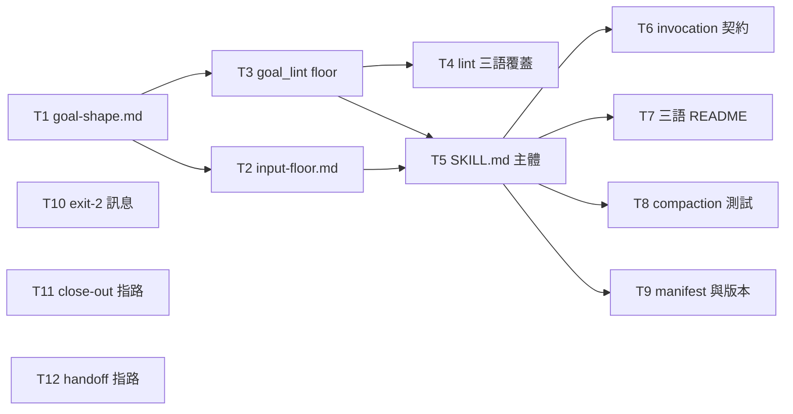

# Plan: goal-create

Source brief: docs/loom/specs/2026-08-27-goal-create.md
Goal: 讓 `loom-workflow:goal-create` 以一個 skill 兩個模式出貨——SESSION 產出四欄目標餵給 `/goal`，ARC 草擬 `PURPOSE.md` 的 Why/Done-when 交使用者拍板——並在輸入不足時拒絕產出。
Stage: planning
Total tasks: 12
Critical-path depth: 4 (≤5)
Execution order: parallel-where-possible
Plan-document-reviewer verdict: PASS (2026-08-27, round 3 — post-amendment re-review)

## Task-flow diagram

## Open Questions

N/A — no unresolved question: the brief's own Open Questions section is empty; its two design questions were resolved by measurement before planning began.

## Task 1 — 目標形態的參考檔

- **Description**: Write the reference defining the four-field goal shape and the host difference it serves.
  - Field names, in order: `Outcome`, `Constraints`, `Verification`, `Stop-when`.
  - `Verification` names a check AND requires that check's output be surfaced in the conversation, because Claude Code's evaluator reads only the transcript.
  - The 4,000-character budget, and the rule that a longer goal points at a file instead of inlining detail.
  - Both hosts' published guidance cited by URL, so a reader in any repository can verify it without this repository.
- **Module**: loom-workflow/skills/goal-create/references
- **Files touched**: loom-workflow/skills/goal-create/references/goal-shape.md, loom-workflow/skills/goal-create/scripts/test_goal_shape.py
- **Context paths**:
  - docs/loom/specs/2026-08-27-goal-create.md
  - loom-workflow/skills/handoff/references/handoff-schema.md
- **Acceptance**:
  - **RED**: `test_goal_shape.py::test_defines_four_fields_budget_and_surfacing` fails — the reference file does not exist.
  - **GREEN**: the test passes, asserting the four field names, the 4,000-character rule, the file-pointer rule for longer goals, and the surfacing requirement each appear.
- **Dependencies**: none
- **Independent**: true
- **Brief item covered**: BI-2, BI-10
- **Status**: pending
- **Gloss**: 先把「一個目標長什麼樣」寫死，後面的 lint 與 SKILL.md 都引用它。

## Task 2 — 輸入門檻與棒子的參考檔

- **Description**: Write the reference defining what must hold before a goal may be written, and what must hold of the condition itself.
  - Two input slots: current state (what is true now, cited to something readable) and wanted difference (what must become true).
  - Slot-to-field mapping: current state is what `Verification` is written against; wanted difference is what `Outcome` states.
  - Refusal: when either slot is empty, name the empty slot and emit no goal.
  - The bar, stated as prose judgment and never claimed mechanical: decidable, false when written, free of dependence on a person.
  - Provenance tags `user-said` / `derived` / `proposed`, one per field.
  - The citation boundary: a recorded purpose is a source to quote, never authority to settle a choice reserved for the user.
- **Module**: loom-workflow/skills/goal-create/references
- **Files touched**: loom-workflow/skills/goal-create/references/input-floor.md, loom-workflow/skills/goal-create/scripts/test_input_floor.py
- **Context paths**:
  - docs/loom/specs/2026-08-27-goal-create.md
  - loom-workflow/skills/goal-create/references/goal-shape.md
- **Acceptance**:
  - **RED**: `test_input_floor.py::test_defines_slots_refusal_bar_and_provenance` fails — the reference file does not exist.
  - **GREEN**: the test passes, asserting both slot names, the refusal rule, the three bar clauses, the three provenance tags, and the citation boundary each appear.
  - Cross-seam probe: `test_input_floor.py::test_slot_mapping_uses_the_shape_reference_field_names` reads `goal-shape.md` and asserts the two field names this file maps its slots onto are the names that file defines.
- **Dependencies**: Task 1 completes first
- **Seam**:
  - from Task 1: payload: the field names `Outcome` and `Verification`, read from goal-shape.md; owner: Task 1; probe: test_input_floor.py::test_slot_mapping_uses_the_shape_reference_field_names
- **Independent**: false
- **Brief item covered**: BI-4, BI-5, BI-8, BI-9
- **Status**: pending
- **Gloss**: 決定什麼時候「不准寫目標」，以及每一欄的來源要怎麼標。

## Task 3 — lint 的語法地板

- **Description**: Implement the mechanical floor as a script failing only on what is decidable syntactically.
  - Hard failures: a missing or empty field label, no stop clause, no backticked command inside `Verification`, text over the character limit.
  - Warnings that never fail: wording that may be undecidable, completion that may depend on a person.
  - Anything unmechanisable prints as UNCHECKED and is never counted as a pass.
  - Character count, not byte count — the limit is characters, and CJK text makes the two diverge.
- **Module**: loom-workflow/skills/goal-create/scripts
- **Files touched**: loom-workflow/skills/goal-create/scripts/goal_lint.py, loom-workflow/skills/goal-create/scripts/test_goal_lint.py
- **Context paths**:
  - loom-workflow/skills/goal-create/references/goal-shape.md
  - docs/loom/audits/2026-08-27-goal-create-experiments.md
- **Acceptance**:
  - **RED**: `test_goal_lint.py::test_floor_fails_structure_and_warns_on_judgment` fails — the module does not exist.
  - **GREEN**: the test passes, asserting a structurally complete goal exits 0, each of the four hard violations exits non-zero, and a judgment-flavoured violation warns while still exiting 0.
  - Cross-seam probe: `test_goal_lint.py::test_field_labels_match_the_shape_reference` reads `goal-shape.md` and asserts the labels the checker looks for are the labels that file defines.
- **Dependencies**: Task 1 completes first
- **Seam**:
  - from Task 1: payload: the four field labels and the character limit, read as literals by the checker; owner: Task 1; probe: test_goal_lint.py::test_field_labels_match_the_shape_reference
- **Independent**: true
- **Brief item covered**: BI-13
- **Status**: pending
- **Gloss**: 只擋格式，不假裝能判斷品質——擋錯比擋不到更糟。

## Task 4 — lint 的三語覆蓋

- **Description**: Hold the floor's behaviour on goal text written in Traditional Chinese, English and Japanese.
  - A language-bound check over goal text fails silently rather than loudly: it passes everything or fails everything, and reports no error either way.
  - One structurally complete and one structurally broken goal per language, judged identically to their English equivalents.
- **Module**: loom-workflow/skills/goal-create/scripts
- **Files touched**: loom-workflow/skills/goal-create/scripts/test_goal_lint_languages.py
- **Context paths**:
  - loom-workflow/skills/goal-create/scripts/goal_lint.py
  - docs/loom/audits/2026-08-27-goal-create-experiments.md
- **Acceptance**:
  - **RED**: `test_goal_lint_languages.py::test_floor_holds_across_zh_en_ja` fails — the test file does not exist.
  - **GREEN**: the test passes, asserting the six fixtures are judged identically to their English equivalents.
- **Dependencies**: Task 3 completes first
- **Seam**:
  - from Task 3: payload: the checker's public entry point and its exit codes; owner: Task 3; probe: test_goal_lint_languages.py::test_floor_holds_across_zh_en_ja
- **Independent**: true
- **Brief item covered**: BI-14
- **Status**: pending
- **Gloss**: 沒測過的語言等於沒有檢查——它不會報錯，只會整批放行或整批擋掉。

## Task 5 — SKILL.md 主體

- **Description**: Write the skill entry point covering the two modes and the boundary between them.
  - One skill, two named modes, `SESSION` and `ARC`, chosen by what the user asks for rather than by inference.
  - SESSION emits the four-field goal; ARC emits a draft `Why` and `Done when` and never writes the file without the user's confirmation.
  - ARC is conditional: with no purpose artifact and no loom store present, it reports itself not applicable, names the reason, and scaffolds nothing.
  - Both reference files are pointed at, never restated.
- **Module**: loom-workflow/skills/goal-create
- **Files touched**: loom-workflow/skills/goal-create/SKILL.md, loom-workflow/skills/goal-create/scripts/test_skill_md.py
- **Context paths**:
  - loom-workflow/skills/goal-create/references/goal-shape.md
  - loom-workflow/skills/goal-create/references/input-floor.md
  - loom-workflow/skills/handoff/SKILL.md
- **Acceptance**:
  - **RED**: `test_skill_md.py::test_declares_two_modes_and_conditional_arc` fails — SKILL.md does not exist.
  - **GREEN**: the test passes, asserting both mode names, ARC's user-lands-it rule, the not-applicable path with its reason requirement, and the no-scaffolding rule.
  - Cross-seam probe: `test_skill_md.py::test_reference_pointers_resolve` asserts every relative reference path written in SKILL.md exists on disk.
  - Cross-seam probe: `test_skill_md.py::test_floor_invocation_line_names_the_script` asserts the invocation line SKILL.md gives for the floor names the script path Task 3 created.
  - `test_skill_md.py::test_arc_points_at_the_purpose_template_without_restating_it` asserts ARC mode cites the purpose artifact's format by pointer — its path or its `Done when:` anchor — and reproduces none of the template's field text verbatim, since that template is the format SSOT and this skill must not restate it.
- **Dependencies**: Tasks 2, 3 complete first
- **Seam**:
  - from Task 2: payload: the input-floor reference path, written into SKILL.md as a relative link; owner: Task 2; probe: test_skill_md.py::test_reference_pointers_resolve
  - from Task 3: payload: the checker's script path, written into SKILL.md as its invocation line; owner: Task 3; probe: test_skill_md.py::test_floor_invocation_line_names_the_script
- **Independent**: true
- **Brief item covered**: BI-1, BI-3, BI-7, BI-15
- **Status**: pending
- **Gloss**: 兩個模式的入口；ARC 在沒有 loom 的 repo 要大聲說「不適用」而不是靜靜壞掉。

## Task 6 — 呼叫契約

- **Description**: State in SKILL.md how the skill is reached.
  - It never fires on its own, and the description says so.
  - It is named as an option at exactly two points where the need is already visible; naming it is not firing it.
  - When brainstorming is already running for the same work, brainstorming keeps discovery and this skill runs after its brief exists.
- **Module**: loom-workflow/skills/goal-create
- **Files touched**: loom-workflow/skills/goal-create/SKILL.md, loom-workflow/skills/goal-create/scripts/test_skill_md.py
- **Context paths**:
  - docs/loom/specs/2026-08-27-goal-create.md
- **Acceptance**:
  - **RED**: `test_skill_md.py::test_invocation_contract_is_offer_not_trigger` fails — the invocation section does not exist.
  - **GREEN**: the test passes, asserting the never-auto-fire statement, both named offer points, and the ordering rule against brainstorming.
- **Dependencies**: Task 5 completes first
- **Seam**:
  - from Task 5: payload: none
- **Independent**: false
- **Brief item covered**: BI-11
- **Status**: pending
- **Gloss**: 這條是這個 skill 最可能的死因——沒人叫它，所以「在哪裡被提到」要寫死。

## Task 7 — 三語 README

- **Description**: Write the skill's three README files, matching this plugin's existing tri-language convention for skills.
- **Module**: loom-workflow/skills/goal-create
- **Files touched**: loom-workflow/skills/goal-create/README.md, loom-workflow/skills/goal-create/README.ja.md, loom-workflow/skills/goal-create/README.zh-TW.md, loom-workflow/skills/goal-create/scripts/test_readmes.py
- **Context paths**:
  - loom-workflow/skills/handoff/README.md
  - loom-workflow/skills/handoff/scripts/test_handoff_readmes.py
  - loom-workflow/skills/goal-create/SKILL.md
- **Acceptance**:
  - **RED**: `test_readmes.py::test_tri_language_set_exists_and_names_both_modes` fails — the README files do not exist.
  - **GREEN**: the test passes, asserting all three READMEs exist and each names both mode names.
  - The tri-language set is this plugin's convention, not a mechanical repository check: `scripts/check-skill-structure.py` treats a skill README as optional, so this task's own test is what holds the convention for goal-create.
- **Dependencies**: Task 5 completes first
- **Seam**:
  - from Task 5: payload: none
- **Independent**: true
- **Brief item covered**: BI-1
- **Status**: pending
- **Gloss**: 跟其他 skill 一致的三語門面。

## Task 8 — compaction 測試

- **Description**: Add the per-skill compaction test this plugin keeps for every skill.
  - Pins the SKILL.md word ceiling.
  - Pins the load-bearing phrases a later compaction must not drop: both mode names, ARC's not-applicable path, the floor's invocation, and the never-auto-fire statement.
- **Module**: loom-workflow/scripts
- **Files touched**: loom-workflow/scripts/test_goal_create_compaction.py
- **Context paths**:
  - loom-workflow/scripts/test_handoff_compaction.py
  - loom-workflow/skills/goal-create/SKILL.md
- **Acceptance**:
  - **RED**: `test_goal_create_compaction.py::test_entrypoint_preserves_modes_floor_and_invocation` fails — the test file does not exist.
  - **GREEN**: the test passes, asserting the word ceiling holds and each pinned phrase is present.
- **Dependencies**: Task 5 completes first
- **Seam**:
  - from Task 5: payload: the pinned phrase list, copied verbatim out of SKILL.md; owner: Task 5; probe: test_goal_create_compaction.py::test_entrypoint_preserves_modes_floor_and_invocation
- **Independent**: true
- **Brief item covered**: BI-1
- **Status**: pending
- **Gloss**: 防止之後有人壓縮 SKILL.md 時把承重的句子壓掉。

## Task 9 — manifest 與版本

- **Description**: Release the skill across both plugins' manifests and changelogs.
  - Name the slug `goal-create` in the plugin description, and bump the plugin version.
  - Mirror the manifest for the other host, and keep the marketplace description byte-identical to the plugin manifest's.
  - Record a changelog entry for each plugin this branch changes; Tasks 10 and 11 change loom-code, so both are in scope.
- **Module**: loom-workflow
- **Files touched**: loom-workflow/.claude-plugin/plugin.json, loom-workflow/.codex-plugin/plugin.json, .claude-plugin/marketplace.json, loom-workflow/CHANGELOG.md, loom-code/CHANGELOG.md
- **Context paths**:
  - scripts/check-marketplace-description-sync.py
  - scripts/check-skill-structure.py
  - loom-workflow/.claude-plugin/plugin.json
- **Acceptance**:
  - **RED**: `scripts/check-skill-structure.py` reports the description naming no `goal-create` folder, or `scripts/check-marketplace-description-sync.py` reports divergence.
  - **GREEN**: `scripts/check-skill-structure.py` and `scripts/check-marketplace-description-sync.py` both exit 0, and the version-bump check reports a bump for each plugin this branch changed.
- **Dependencies**: Task 5 completes first
- **Seam**:
  - from Task 5: payload: the skill slug goal-create, which the coherence check resolves to a folder; owner: Task 5; probe: scripts/check-skill-structure.py
- **Independent**: true
- **Brief item covered**: BI-1
- **Status**: pending
- **Gloss**: 沒 bump 版本的話 marketplace 更新會靜默 no-op，這條踩過很多次。

## Task 10 — exit-2 訊息指路

- **Description**: Make the purpose-link check's unanswered-purpose message point somewhere, so the one surface a cold adopting repository reaches stops being a dead end.
  - The message stands on its own first: it tells the reader how to answer the purpose file without any skill installed.
  - It then mentions this skill conditionally — as a shortcut available if `loom-workflow` is installed — never as an instruction assuming it is.
  - Only message text changes. Exit codes stay as they are, and the three causes' branching logic is untouched.
- **Module**: loom-code/scripts
- **Files touched**: loom-code/scripts/check_north_star_link.py, loom-code/scripts/test_check_north_star_link.py
- **Context paths**:
  - loom-code/scripts/check_north_star_link.py
  - loom-code/scripts/templates/PURPOSE.md
- **Acceptance**:
  - **RED**: `test_check_north_star_link.py::test_unanswered_purpose_message_points_somewhere_without_assuming_the_skill` fails — the message carries no pointer.
  - **GREEN**: the test passes, asserting the message carries self-sufficient instructions AND mentions the skill only in a conditional clause, and every existing exit-code assertion in that file still passes unchanged.
- **Dependencies**: none
- **Independent**: true
- **Brief item covered**: BI-12, BI-11
- **Status**: pending
- **Gloss**: 冷啟 repo 唯一會撞到的地方，加一行指路成本近乎零。

## Task 11 — close-out 邀約指路

- **Description**: Rewrite the close-out betting step's standing offer to write a purpose artifact so it names this skill as the procedure that does it, replacing a bare offer with a pointer. The section's existing purpose-print step is unchanged.
- **Module**: loom-code/skills/finishing-a-development-branch
- **Files touched**: loom-code/skills/finishing-a-development-branch/SKILL.md
- **Context paths**:
  - loom-code/skills/finishing-a-development-branch/SKILL.md
- **Acceptance**:
  - **RED**: a grep for `loom-workflow:goal-create` in that SKILL.md returns nothing.
  - **GREEN**: the grep returns the offer line, and the section's purpose-print step still reads as before.
- **Dependencies**: none
- **Independent**: true
- **Brief item covered**: BI-6
- **Status**: pending
- **Gloss**: 那句「if absent, offer to write one」終於有東西可指。

## Task 12 — handoff 收尾指路

- **Description**: Name this skill as an available option in handoff's Prepare mode, the session-closing moment where an unstated goal is already visible. Naming it does not fire it.
- **Module**: loom-workflow/skills/handoff
- **Files touched**: loom-workflow/skills/handoff/SKILL.md, loom-workflow/scripts/test_handoff_compaction.py
- **Context paths**:
  - loom-workflow/skills/handoff/SKILL.md
  - loom-workflow/scripts/test_handoff_compaction.py
- **Acceptance**:
  - **RED**: `test_handoff_compaction.py::test_prepare_mode_names_goal_create` fails — Prepare mode names no such option.
  - **GREEN**: the test passes, and handoff's existing pinned phrases still assert.
- **Dependencies**: none
- **Independent**: true
- **Brief item covered**: BI-11
- **Status**: pending
- **Gloss**: 第二個提名點，選在你最常想起「這輪到底要幹嘛」的時刻。

## Notes

- Verdict stamped PASS (2026-08-27, round 3 — post-amendment re-review) — stamping the verdict, no re-review.
- Kickoff decision: Task 10's message mentions the skill conditionally rather than by instruction, because this family's standing decision is that no plugin declares another as a mandatory dependency and standalone installation must work. A reader with only loom-code installed gets complete instructions; a reader with both gets a shortcut. This changed Task 10's Description and Acceptance, so the plan re-reviews.
- Kickoff decision: `goal_lint.py` stays inside the skill folder, matching handoff, recap-state and cot-explain, so the skill remains self-contained. The day another skill wants the same floor, this choice costs a cross-skill reference or a move with three call sites to update.
- Tasks 10, 11 and 12 change files outside the new skill folder and carry no dependency on it, so they may run first or last. Their pointers name the skill by its plugin-qualified name, which this plan fixes as `loom-workflow:goal-create`.
- Task 9 covers both plugins' changelogs because Tasks 10 and 11 change loom-code, so this branch bumps two plugins.
- SKILL.md and both reference files must not cite this repository's development records under `docs/`. The brief and the experiment audit are inputs to planning, not citable from runtime prose; the reference files cite the vendors' own documentation instead.
