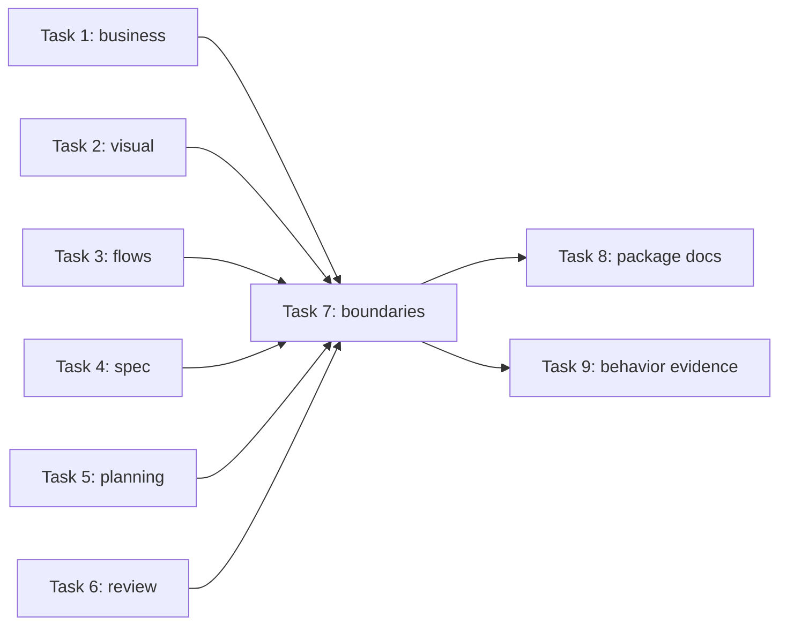

# Plan: stage-specific complexity gates

**Source brief**: docs/loom/specs/2026-08-27-stage-specific-complexity-gates.md
Goal: Add stage-owned complexity judgments to existing Loom checkpoints while preserving standalone plugin operation and optional artifact-only composition.
Stage: review:round-3
Steps:
  1. 為四個設計階段加入各自的複雜度 lens
  2. 為計畫與程式審查加入工程階段 lens
  3. 驗證獨立安裝、公開交接與無漂移
**Total tasks**: 9
**Critical-path depth**: 3
**Execution order**: parallel by dependency level
**Plan-document-reviewer verdict**: PASS (2026-08-27; 19/19 checks, round 5)

## Task-flow diagram

## Open Questions

N/A — no unresolved question: the source brief fixes stage ownership, thin relay semantics, standalone fallback, exclusions, and testing boundaries

## Complexity assessment

- **Added complexity**: six local lens references, six stage-contract tests, one cross-plugin contract test, and optional evidence-reading language inside existing checkpoints.
- **Why it is worthwhile**: each addition exposes domain-specific burden before it hardens downstream while preserving the installed stage's independent judgment.
- **Removed or avoided complexity**: no universal score, shared orchestrator, common schema, new artifact type, cross-plugin private call, or synchronization mechanism is introduced; every claimed simplification must still preserve its stage's required outcome.
- **Downstream risk**: copied four-question prose could drift, optional evidence could be mistaken for a dependency, and contract tests could false-green without cold-install behavior probes; Tasks 7 and 9 own those risks.

## Task 1 — 商業規劃 complexity lens

- **Description**: Add a business-owned lens that judges continuing commitments, coordination burden, displaced alternatives, worth, removable work, and downstream risk inside the existing worth-it checkpoint.
  - Keep the three existing axes and verdict enum; add one local reference and one template section rather than a new station or score.
  - Read optional prior project artifacts only as evidence; absence must still yield a complete local assessment or reasoned N/A.
- **Module**: loom-design/skills/business-value/
- **Files touched**: loom-design/skills/business-value/SKILL.md, loom-design/skills/business-value/references/business-complexity-lens.md, loom-design/skills/business-value/assets/business-value-template.md, loom-design/scripts/discovery/test_business_value_complexity.py
- **Context paths**: loom-design/skills/business-value/SKILL.md, loom-design/skills/business-value/assets/business-value-template.md
- **Acceptance**:
  - **RED**: `python3 -m pytest loom-design/scripts/discovery/test_business_value_complexity.py::test_business_checkpoint_records_commitment_complexity -q` fails because the checkpoint and template do not carry the business-complexity contract.
  - **GREEN**: The focused test proves the skill loads its local reference, preserves Why now/Why me/Opportunity cost, writes a stage-native artifact section covering burden, worth, avoidance, and downstream risk, and permits only a reasoned N/A.
- **Dependencies**: none
- **Independent**: true
- **Brief item covered**: BI-1, BI-2, BI-5
- **Status**: done(cba68c3d)
- **Gloss**: 在值得做的判斷裡衡量長期承諾與協作成本，不借用程式碼分數。

## Task 2 — 視覺系統 complexity lens

- **Description**: Add a visual-system lens for vocabulary, variants, exceptions, inheritance, and token debt while preserving the canonical eight-section DESIGN.md schema.
  - Put the output contract inside existing Overview / Brand and Do's & Don'ts prose; never add a ninth section or behavioral state-machine work.
- **Module**: loom-design/skills/design-system/
- **Files touched**: loom-design/skills/design-system/SKILL.md, loom-design/skills/design-system/references/visual-complexity-lens.md, loom-design/skills/design-system/references/design-md-schema.md, loom-design/scripts/interface/test_design_system_complexity.py
- **Context paths**: loom-design/skills/design-system/SKILL.md, loom-design/skills/design-system/references/design-md-schema.md
- **Acceptance**:
  - **RED**: `python3 -m pytest loom-design/scripts/interface/test_design_system_complexity.py::test_visual_lens_preserves_canonical_eight_sections -q` fails because no local visual-complexity lens or canonical-section placement exists.
  - **GREEN**: The focused test proves the lens covers new vocabulary, justified variants, deleted/avoided exceptions, downstream component risk, reasoned N/A, and exactly the existing eight DESIGN.md sections.
- **Dependencies**: none
- **Independent**: true
- **Brief item covered**: BI-1, BI-2, BI-6
- **Status**: done(7d84e67f)
- **Gloss**: 讓視覺詞彙、變體與例外的維護成本留在設計系統內判斷。

## Task 3 — 互動流程 complexity lens

- **Description**: Add an interaction-owned lens for choices, navigation, states, branches, recovery, and actor handoffs at the existing seven-dimension flow checkpoint.
  - Record the assessment as an addressable ui-flows.md dimension that spec-expansion may read, without authoring behavioral guards or requiring that downstream skill.
- **Module**: loom-design/skills/interaction-flows/
- **Files touched**: loom-design/skills/interaction-flows/SKILL.md, loom-design/skills/interaction-flows/references/interaction-complexity-lens.md, loom-design/skills/interaction-flows/references/ux-flow-checklist.md, loom-design/scripts/interface/test_interaction_flow_complexity.py
- **Context paths**: loom-design/skills/interaction-flows/SKILL.md, loom-design/skills/interaction-flows/references/ux-flow-checklist.md
- **Acceptance**:
  - **RED**: `python3 -m pytest loom-design/scripts/interface/test_interaction_flow_complexity.py::test_flow_lens_emits_stage_native_handoff -q` fails because the seven-dimension workflow does not emit a complexity handoff.
  - **GREEN**: The focused test proves the flow lens names added decisions/states/branches, why survivors matter, collapsed paths, downstream ambiguity, and a reasoned static-surface N/A without crossing into specification.
- **Dependencies**: none
- **Independent**: true
- **Brief item covered**: BI-1, BI-2, BI-7
- **Status**: done(cba68c3d)
- **Gloss**: 在流程階段先減少選擇、狀態與死路，再把剩餘風險交給規格。

## Task 4 — 行為規格 complexity lens

- **Description**: Extend Phase ③ pruning with a behavioral lens over objects, roles, states, paths, NFRs, and obligations that survived expansion.
  - Use the existing proposal/change-folder surface and KEEP/FLAG/DROP semantics; do not add an eighth proposal section or a universal schema.
- **Module**: loom-design/skills/spec-expansion/
- **Files touched**: loom-design/skills/spec-expansion/SKILL.md, loom-design/skills/spec-expansion/references/behavioral-complexity-lens.md, loom-design/skills/spec-expansion/references/execution-details.md, loom-design/scripts/spec/test_spec_expansion_complexity.py
- **Context paths**: loom-design/skills/spec-expansion/SKILL.md, loom-design/skills/spec-expansion/references/execution-details.md
- **Acceptance**:
  - **RED**: `python3 -m pytest loom-design/scripts/spec/test_spec_expansion_complexity.py::test_pruning_reports_retained_behavioral_complexity -q` fails because pruning does not aggregate the retained behavioral burden or its downstream risk.
  - **GREEN**: The focused test proves the local lens distinguishes retained/justified complexity from redundant, impossible, and speculative cells; records deletions and risks; and independently evaluates when no upstream complexity note exists.
- **Dependencies**: none
- **Independent**: true
- **Brief item covered**: BI-1, BI-2, BI-8, BI-11
- **Status**: done(da55ba81)
- **Gloss**: 對拓展後留下的物件、角色、狀態與路徑再做一次有理由的保留或刪除。

## Task 5 — 架構與實作計畫 complexity lens

- **Description**: Add a plan-time lens for boundaries, dependencies, migrations, configuration, operational duties, reuse, and deletion before tasks execute.
  - Make the brief/plan artifact contract carry intended complexity and independent fallback; retain the existing task-depth ceiling and plan reviewer rather than adding another gate runner.
- **Module**: loom-code/skills/writing-plans/
- **Files touched**: loom-code/skills/writing-plans/SKILL.md, loom-code/skills/writing-plans/references/architecture-complexity-lens.md, loom-code/skills/writing-plans/references/plan-format.md, loom-code/skills/writing-plans/references/plan-document-reviewer-prompt.md, loom-code/scripts/test_writing_plans_complexity.py, docs/loom/plans/2026-08-27-stage-specific-complexity-gates.md
- **Context paths**: loom-code/skills/writing-plans/SKILL.md, loom-code/skills/writing-plans/references/plan-format.md, loom-code/skills/writing-plans/references/plan-document-reviewer-prompt.md
- **Acceptance**:
  - **RED**: `python3 -m pytest loom-code/scripts/test_writing_plans_complexity.py::test_non_mechanical_plan_carries_architecture_complexity -q` fails because planning does not require a stage-native complexity assessment for non-mechanical work.
  - **GREEN**: The focused test proves applicability and mechanical-edit exemption, the four handoff meanings, local assessment when upstream evidence is absent, and reviewer enforcement on generated plan instances.
- **Dependencies**: none
- **Independent**: true
- **Brief item covered**: BI-1, BI-2, BI-9, BI-11
- **Status**: done(de58e59c)
- **Gloss**: 在開工前檢查邊界、依賴、遷移與營運負擔，純機械修改可具理由豁免。

## Task 6 — 實作分支 complexity lens

- **Description**: Extend the existing deletion-first branch-review dimension so it compares promised and actual complexity, verifies deletions, and identifies unplanned implementation burden.
  - Keep the existing verdict structure and require a concrete smaller alternative for findings; do not repeat upstream verdicts or require their artifacts.
- **Module**: loom-code/skills/requesting-code-review/
- **Files touched**: loom-code/skills/requesting-code-review/SKILL.md, loom-code/skills/requesting-code-review/references/implementation-complexity-lens.md, loom-code/skills/requesting-code-review/references/design-evidence.md, loom-code/agents/code-reviewer.md, loom-code/scripts/test_requesting_code_review_complexity.py
- **Context paths**: loom-code/skills/requesting-code-review/SKILL.md, loom-code/skills/requesting-code-review/references/design-evidence.md, loom-code/agents/code-reviewer.md
- **Acceptance**:
  - **RED**: `python3 -m pytest loom-code/scripts/test_requesting_code_review_complexity.py::test_deletion_first_compares_actual_and_planned_complexity -q` fails because deletion-first does not compare the actual diff with optional planned complexity evidence.
  - **GREEN**: The focused test proves the reviewer judges actual additions, worth, landed deletions, simpler alternatives, downstream operational risk, and independent fallback while preserving existing aggregation and verdict semantics.
- **Dependencies**: none
- **Independent**: true
- **Brief item covered**: BI-1, BI-2, BI-10, BI-11, BI-12
- **Status**: done(b55a7f22)
- **Gloss**: 用實際 diff 驗證原先承諾的簡化有落地，並抓出實作時新長出的負擔。

## Task 7 — plugin 邊界與薄交接契約

- **Description**: Extend existing boundary and composition tests to prove every new lens stays inside its owning skill and optional handoff reads only project-owned artifacts.
  - Cold-copy each plugin into an unrelated path with siblings absent and resolve each local pointer; reuse the existing public-composition suite for the project-artifact boundary. Task 9 owns observable N/A/fallback behavior.
- **Module**: repository plugin-boundary integration tests
- **Files touched**: scripts/check_plugin_boundaries.py, scripts/test_loom_plugin_install_layout.py, scripts/test_loom_plugin_composition.py, scripts/test_stage_specific_complexity_contract.py
- **Context paths**: scripts/check_plugin_boundaries.py, scripts/test_loom_plugin_install_layout.py, scripts/test_loom_plugin_composition.py, docs/loom/memory/filesystem-independence-needs-behavioral-cold-start-proof.md
- **Acceptance**:
  - **RED**: `python3 -m pytest scripts/test_stage_specific_complexity_contract.py::test_stage_contract_owns_each_lens_and_forbids_private_plugin_paths -q` fails because stage ownership, cold fallback, and four-meaning relay coverage are not protected.
  - **GREEN**: The focused test proves cold-package local pointers with no sibling present; the existing install-layout and composition suites prove standalone package layout and public project-artifact handoff. Task 9 separately proves local judgment when optional upstream evidence is absent.
  - **GREEN**: `python3 scripts/check_plugin_boundaries.py loom-code` and the corresponding `loom-design` command reject private sibling paths and pass the shipped packages.
  - **GREEN**: `stage contract identifies business-value as the owner`; `stage contract preserves eight DESIGN.md sections`; `cold package contains flow fallback contract without spec-expansion`; `cold package contains spec fallback contract without ui-flows.md`; `cold package contains plan fallback contract without loom-design`; and `cold package contains review fallback contract without upstream artifacts`.
- **Dependencies**: Tasks 1, 2, 3, 4, 5, 6 complete first
- **Seam**:
  - from Task 1: payload: business lens and artifact wording; owner: Task 1; probe: `stage contract identifies business-value as the owner`
  - from Task 2: payload: visual lens and canonical placement; owner: Task 2; probe: `stage contract preserves eight DESIGN.md sections`
  - from Task 3: payload: flow lens and ui-flows handoff; owner: Task 3; probe: `cold package contains flow fallback contract without spec-expansion`
  - from Task 4: payload: behavioral lens and missing-upstream fallback; owner: Task 4; probe: `cold package contains spec fallback contract without ui-flows.md`
  - from Task 5: payload: plan lens and artifact contract; owner: Task 5; probe: `cold package contains plan fallback contract without loom-design`
  - from Task 6: payload: implemented-delta lens and optional evidence read; owner: Task 6; probe: `cold package contains review fallback contract without upstream artifacts`
- **Independent**: false
- **Brief item covered**: BI-3, BI-4, BI-11, BI-13, BI-14
- **Status**: done(9a665c8a)
- **Gloss**: 用真正移除 sibling plugin 的冷啟動測試，證明交接是可選證據而非隱藏依賴。

## Task 8 — 套件文件、版本與 changelog

- **Description**: Update only the public documentation and package metadata needed to describe the new stage-owned behavior and independent-install boundary.
  - Bump affected plugin versions, update their changelogs, synchronize Codex manifests from Claude SSOT, and regenerate managed command/inventory text only when required by an actual command change.
- **Module**: loom package metadata and documentation
- **Files touched**: loom-design/CHANGELOG.md, loom-design/.claude-plugin/plugin.json, loom-design/.codex-plugin/plugin.json, loom-code/CHANGELOG.md, loom-code/.claude-plugin/plugin.json, loom-code/.codex-plugin/plugin.json, docs/loom/BACKLOG.md, docs/loom/backlog/2026-08-27-stage-specific-complexity-gates.md
- **Context paths**: scripts/sync_codex_manifests.py, loom-design/.claude-plugin/plugin.json, loom-code/.claude-plugin/plugin.json
- **Acceptance**:
  - **RED**: `python3 scripts/check_version_bump.py --base 0a7dcde2 --head HEAD` exits 1 and names `loom-code` and `loom-design` after the skill changes but before their manifest versions advance.
  - **GREEN**: Both changelogs name stage ownership and standalone fallback, versions advance consistently, and `python3 scripts/sync_codex_manifests.py --check loom-design` plus the loom-code command pass.
  - **GREEN**: `changelogs name the independently verified stage-specific complexity contract`.
- **Dependencies**: Task 7 completes first
- **Seam**:
  - from Task 7: payload: final shipped behavior and boundary evidence; owner: Task 7; probe: `changelogs name the independently verified stage-specific complexity contract`
- **Independent**: true
- **Brief item covered**: BI-3, BI-4
- **Status**: done(7a0a6dd9)
- **Gloss**: 只更新真正受影響的兩個 plugin 版本與公開說明，不新增制度文件。

## Task 9 — 行為等價與 hard-case evidence

- **Description**: Run skill-dev structural-change evaluation against the frozen pre-edit snapshot and current candidate, including no-upstream, misleading-upstream, trivial-exempt, and over-complex hard cases.
  - Use the existing prompt corpora where applicable, add focused cases only when coverage is missing, and preserve raw evidence and a concise comparison report under docs/loom/dogfood.
- **Module**: stage-specific complexity behavioral evaluation
- **Files touched**: docs/loom/dogfood/2026-08-27-stage-specific-complexity-gates.md, scripts/test_stage_specific_complexity_behavior_evidence.py
- **Context paths**: skill-dev-toolkit/skills/skill-creator-advance/SKILL.md, loom-code/scripts/loom_firing_harness.py, /tmp/loom-complexity-baseline.xt9viD
- **Acceptance**:
  - **RED**: `python3 -m pytest scripts/test_stage_specific_complexity_behavior_evidence.py::test_report_binds_baseline_and_final_candidate -q` fails because the report and candidate/baseline evidence do not exist.
  - **GREEN**: The report binds `/tmp/loom-complexity-baseline.xt9viD` as the immutable baseline, records candidate/baseline outputs for the hard cases, confirms all pre-existing invariants, and shows each new lens fires selectively without requiring sibling plugins.
  - **GREEN**: Purpose-preservation probes reject a simpler alternative that loses the required stage outcome and classify that loss as a scope trade-off instead.
  - **GREEN**: `behavior report includes the final cold-install candidate bytes`.
- **Dependencies**: Task 7 completes first
- **Seam**:
  - from Task 7: payload: final candidate packages and cold-install probes; owner: Task 7; probe: `behavior report includes the final cold-install candidate bytes`
- **Independent**: true
- **Brief item covered**: BI-1, BI-2, BI-3, BI-4
- **Status**: done(92a3e831)
- **Gloss**: 以修改前快照對照 hard cases，證明新增判斷沒有犧牲舊行為或誤觸發。

## Decision Log

1. No common complexity reference is created. The four handoff meanings are a design constraint tested across local references, not a synchronized prose file.
2. Generated-instance enforcement belongs to each stage's existing validator or reviewer; contract-only docs review is not treated as proof that emitted artifacts comply.
3. The pre-edit baseline snapshot is `/tmp/loom-complexity-baseline.xt9viD`; it was captured before any skill, reference, template, agent, or test edit.

## Notes

- The automatic close-out prompt for choosing a bet was removed by `#726`, before the skill compaction in `#740`; restoring it is explicitly outside this plan.
