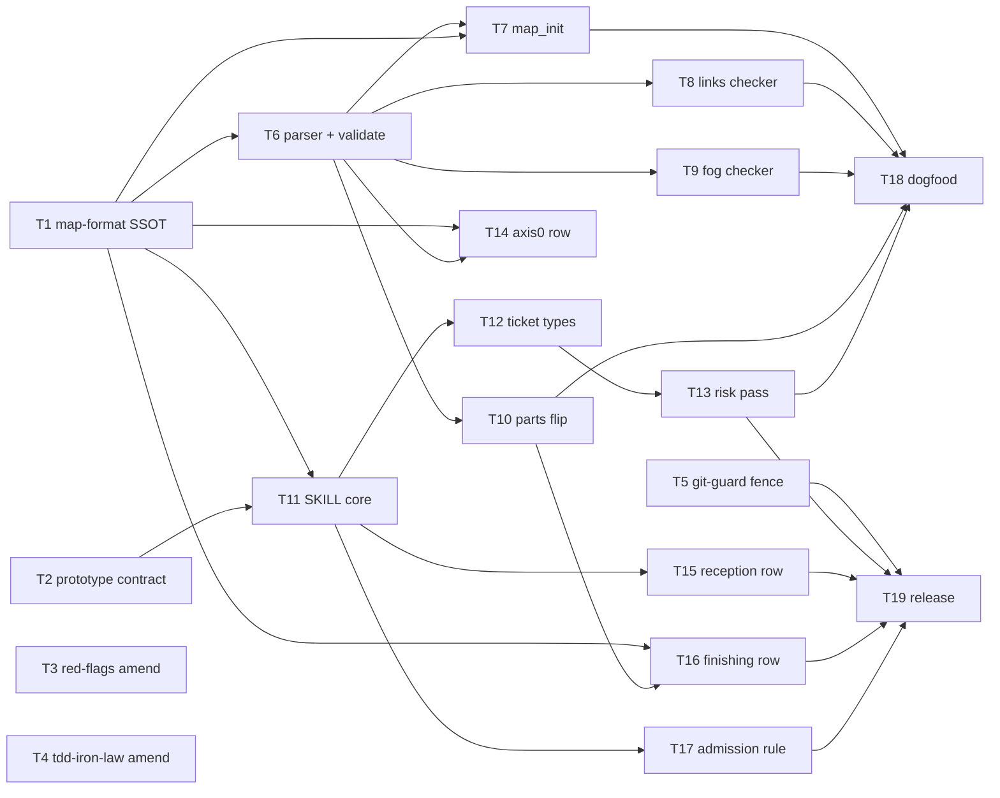

# Plan: decision-map layer（wayfinder 吸收）

**Source brief**: docs/loom/specs/2026-08-28-decision-map-layer.md
Goal: loom-workflow 擁有的決策地圖層出貨——一個 charting／work-through skill、
    docs/loom/maps/ 儲存區與機械閘門；prototype 工作被機械圍欄隔離，
    交付進度在分支收尾時自動回寫。
Stage: blocked:user-decision
Steps:
  1. 契約層：地圖格式 SSOT、prototype 契約、教義修訂、git-guard 圍欄
  2. 引擎與骨幹：MAP 解析器＋validate、SKILL 主文
  3. 工具與家族接線：scaffold、三個檢查器、票型段、Axis 0／reception／admission
  4. 收斂：風險前置段、finishing 回寫列
  5. 實地 dogfood 與版本收尾
**Total tasks**: 19
**Critical-path depth**: 5 (≤5 ✓)
**Execution order**: parallel-where-possible
**Plan-document-reviewer verdict**: PASS (2026-08-28, round 1)

## Task-flow diagram

## Open Questions

- OQ-1 [RESOLVED] — the four-scripts-shapes backlog entry's start condition has fired (this arc designs new checker CLIs) — fold or re-defer? → resolved: fold the SHAPE decision only — every new map script adopts one canonical CLI shape (positional target path + `--repo-root`, exit 0 clean / 1 operational error / 2 violation) pinned in Task 1 §Command surface; retrofitting the four existing scripts is explicitly re-deferred, the backlog entry stays open, and close-out records the fired start condition plus this re-deferral (BI-10).
- OQ-2 [RESOLVED] — where does loom-workflow's admission rule (BI-8) get recorded? → resolved: loom-workflow/README.md plus its ja/zh-TW mirrors (Task 17); rejected: family-reception.md (that file is work-routing doctrine, not a plugin charter).

## Complexity assessment

- Added complexity: a fourth loom store (`docs/loom/maps/`), five new scripts with tests, one new skill, a branch-name gate inside git-guard, and one more family fan-out target — each a standing maintenance surface.
- Why it is worthwhile: multi-session planning gets a resumable, gate-backed decision surface, and multi-plan delivery progress becomes mechanical — the hand-kept table this replaces drifted 4× with no gate noticing (brief §Problem).
- Removed or avoided complexity: no issue-tracker dependency, no plugin merge or migration, hand-kept progress tables become a declared anti-pattern, and the prototype exemption turns from prose judgment into a machine-checkable branch state.
- Downstream risk: skill-text ↔ CLI drift (mitigated by Task 11's doc-drift test); git-guard growth (guarded by its existing test suite); fog-id discipline relies on authors writing `F-<n>` ids — `validate` catches malformed maps, not semantic misuse, which the dogfood task probes.

## Task 1 — 地圖格式與指令面 SSOT

- **Description**: Author `references/map-format.md` for the new decision-map skill: the MAP.md schema, ticket schema, join-key grammar, schema versioning, and the pinned command surface every later task cites.
  - MAP.md: frontmatter (`map-id`, `schema_version` integer, `state` ∈ charting | active | clear | archived) + sections Destination / Notes / Decisions-so-far / Not-yet-specified (fog) / Out-of-scope / Parts.
  - Live-map criterion (BI-4): checker-valid AND `state` ∈ {charting, active} — directory presence alone is never adoption.
  - Fog entries carry authored `F-<n>` ids (monotonic, never renumbered, never reused — same rule as `BI-<n>`) so monotonicity is mechanically checkable; graduation records the source `F-<n>` on the new ticket.
  - Tickets: `tickets/<slug>.md` with frontmatter `type` ∈ grilling | research | task | prototype, `status` ∈ open | claimed | closed, `claim` field, a Resolution section, and a user-ratified line for HITL resolutions.
  - Parts: one row per plan part with the explicit join key `<map-id> / Part: <name>` and a status flipped only by the Task 10 flipper; this section names hand-kept progress tables as the declared anti-pattern it replaces (BI-9's declaration half).
  - §Command surface: a table pinning the five script paths under `loom-workflow/skills/decision-map/scripts/`, the canonical arg shape (positional target + `--repo-root`), and exit codes 0/1/2 (OQ-1 resolution).
  - Checkers refuse to read past their supported `schema_version` (exit 2).
- **Module**: loom-workflow/skills/decision-map/references/map-format.md
- **Files touched**: loom-workflow/skills/decision-map/references/map-format.md
- **Context paths**:
  - docs/loom/specs/2026-08-28-decision-map-layer.md
  - loom-code/scripts/check_onramp_choice.py
  - loom-code/scripts/loom_init.py
  - loom-code/skills/brainstorming/references/handoff-brief-format.md
- **Acceptance**:
  - **RED**: diagnostic — `test -f loom-workflow/skills/decision-map/references/map-format.md` exits 1 (file does not exist today).
  - **GREEN**: file exists carrying all sections above; `schema_version`, the `F-<n>` fog-id rule, the `<map-id> / Part: <name>` join key, and the §Command surface table are each grep-findable.
- **Dependencies**: none
- **Independent**: true
- **Review-weight**: prose
- **Brief item covered**: BI-1
- **Status**: done(096c3167)
- **Gloss**: 先立地圖的格式與指令契約——之後所有腳本和文本都引用這一份，不各自發明。

## Task 2 — Prototype 契約參考文件

- **Description**: Transcribe the brief's §Prototype contract into `references/prototype-contract.md`.
  - Carry all five parts: the when-to-use routing test; both modes (design HITL / feasibility AFK) with the three probe shapes; the definitional constraints; the five front-load triggers with the anti-over-prototyping guardrails; the six-stage lifecycle.
  - Near-verbatim transcription of the user-signed doctrine — do not reword ratified content; adapt only brief-internal cross-references (`BI-<n>` mentions) into skill-internal wording.
- **Module**: loom-workflow/skills/decision-map/references/prototype-contract.md
- **Files touched**: loom-workflow/skills/decision-map/references/prototype-contract.md
- **Context paths**:
  - docs/loom/specs/2026-08-28-decision-map-layer.md
- **Acceptance**:
  - **RED**: diagnostic — `test -f loom-workflow/skills/decision-map/references/prototype-contract.md` exits 1 (file does not exist today).
  - **GREEN**: file present; both modes, all three probe shapes, all five front-load triggers, and all six lifecycle stages (Birth through Death) are grep-findable.
- **Dependencies**: none
- **Independent**: true
- **Review-weight**: prose
- **Brief item covered**: BI-11
- **Status**: done(096c3167)
- **Gloss**: 把使用者簽核的 prototype 教義原文落進 skill 可攜的參考檔，成為票型委派的依據。

## Task 3 — red-flags.md 教義修訂

- **Description**: Amend the prototyping doctrine line in red-flags.md to scope its exception to the `prototype/<map-id>/<ticket-slug>` branch namespace — scope the line, never delete it.
  - Anchor: "prototyping happens INSIDE the smallest end state" (loom-code/skills/brainstorming/references/red-flags.md).
  - The brief marks this file `[FRAGILE]`: the doctrine stays intact for all non-namespace work; only the fenced namespace gains the sanctioned outside path.
- **Module**: loom-code/skills/brainstorming/references/red-flags.md
- **Files touched**: loom-code/skills/brainstorming/references/red-flags.md
- **Context paths**:
  - docs/loom/specs/2026-08-28-decision-map-layer.md
- **Acceptance**:
  - **RED**: diagnostic — `grep -q 'prototype/' loom-code/skills/brainstorming/references/red-flags.md` exits 1 today.
  - **GREEN**: the amended line keeps the original doctrine wording and adds the namespace-scoped exception naming `prototype/<map-id>/<ticket-slug>`.
- **Dependencies**: none
- **Independent**: true
- **Review-weight**: prose
- **Brief item covered**: BI-5
- **Status**: done(1ea76ed2)
- **Gloss**: 教義從「一律不准」改成「只有圍欄分支例外」——同 PR 修法，圍欄才不是違章。

## Task 4 — tdd-iron-law spike 豁免修訂

- **Description**: Amend tdd-iron-law's Throwaway / spike exemption row so committed prototype work is legal only on `prototype/<map-id>/<ticket-slug>` branches; outside that namespace the exemption keeps its current same-session-throwaway meaning unchanged.
  - Anchor: the `**Throwaway / spike**` exemption row in loom-code/skills/tdd-iron-law/SKILL.md ("Code you will delete within the same session").
- **Module**: loom-code/skills/tdd-iron-law/SKILL.md
- **Files touched**: loom-code/skills/tdd-iron-law/SKILL.md
- **Context paths**:
  - docs/loom/specs/2026-08-28-decision-map-layer.md
- **Acceptance**:
  - **RED**: diagnostic — `grep -q 'prototype/' loom-code/skills/tdd-iron-law/SKILL.md` exits 1 today.
  - **GREEN**: the spike row names the namespace as the only branch state where prototype commits are exempt; non-namespace wording unchanged.
- **Dependencies**: none
- **Independent**: true
- **Review-weight**: prose
- **Brief item covered**: BI-5
- **Status**: done(8d6ece27)
- **Gloss**: TDD 鐵律的 spike 豁免收斂到圍欄分支——豁免從散文判斷變成看得見的分支狀態。

## Task 5 — git-guard prototype 圍欄

- **Description**: Block merging or PR-ing `prototype/*` branches into the default branch in loom-code/hooks/git-guard.py; pushing a `prototype/*` branch itself stays allowed (the retention rule).
  - Site: `main()`'s per-segment git-subcommand classification (the `sub == "push"` region) and/or a new check alongside `_gate_push`; no branch-name logic exists in the file today.
  - Cover: `git merge prototype/…` while on the default branch, `gh pr create`/`gh pr merge` where the head branch matches `prototype/*` targeting the default branch.
  - Block message states the fence and points at the decision-map prototype contract by skill name (no repo-internal docs/ citation — contract-citations rule).
  - Check whether scripts/test_codex_git_guard_shim.py mirrors this surface; extend the shim + its test only if the shim shares the gated verbs.
- **Module**: loom-code/hooks/git-guard.py
- **Files touched**: loom-code/hooks/git-guard.py, loom-code/scripts/test_git_guard.py
- **Context paths**:
  - loom-code/hooks/git-guard.py
  - loom-code/scripts/test_git_guard.py
  - scripts/test_codex_git_guard_shim.py
- **Acceptance**:
  - **RED**: `loom-code/scripts/test_git_guard.py::test_blocks_merge_of_prototype_branch_into_default` fails (no branch-name check exists in git-guard today).
  - **GREEN**: merge/PR of `prototype/*` into the default branch is blocked with the explanatory message; pushing a `prototype/*` branch passes; the existing git-guard suite stays green.
- **Dependencies**: none
- **Independent**: true
- **Brief item covered**: BI-5
- **Status**: done(e3a9fea6)
- **Gloss**: 圍欄的機械執行點——prototype 分支永不進主幹，靠 hook 擋，不靠自律。

## Task 6 — MAP 解析器與 validate 閘

- **Description**: Implement `scripts/map_store.py`: the shared parser for MAP.md + tickets (the single reader every checker imports), plus a `validate` CLI enforcing schema conformance, schema-version refusal, and the live-map criterion.
  - CLI: `map_store.py validate <map-dir> --repo-root <path>`; exit 0 valid / 1 operational error / 2 violation (Task 1 §Command surface).
  - Refuses `schema_version` above its supported ceiling with exit 2 and a message naming both versions.
  - Live-map criterion per Task 1: checker-valid AND state ∈ {charting, active}.
  - Parser exposes map frontmatter, section bodies, fog entries with `F-<n>` ids, Parts rows, and ticket frontmatter/resolution — no other script re-parses the bytes.
- **Module**: loom-workflow/skills/decision-map/scripts/map_store.py
- **Files touched**: loom-workflow/skills/decision-map/scripts/map_store.py, loom-workflow/skills/decision-map/scripts/test_map_store.py
- **Context paths**:
  - loom-workflow/skills/decision-map/references/map-format.md
  - loom-code/scripts/check_onramp_choice.py
- **Acceptance**:
  - **RED**: `test_map_store.py::test_validate_refuses_future_schema_version` fails (module does not exist today).
  - **GREEN**: `test_map_store.py::test_validate_accepts_schema_conformant_fixture` passes; validate exits 2 on a future `schema_version` and on live-criterion violations, 0 on the conformant fixture; the loom-workflow CI per-skill glob picks the suite up.
- **Dependencies**: Task 1 completes first
- **Seam**:
  - from Task 1: payload: MAP.md/ticket schema + validate exit-code contract; owner: Task 1; probe: `test_map_store.py::test_validate_accepts_schema_conformant_fixture`
- **Independent**: false
- **Brief item covered**: BI-4
- **Status**: done(94a3f083)
- **Gloss**: 唯一的地圖讀取器＋validate 閘——「活地圖」從此有機械定義，schema 版本超過就拒讀。

## Task 7 — map_init scaffold

- **Description**: Implement `scripts/map_init.py <map-id> --repo-root <path>`: scaffold `docs/loom/maps/<map-id>/` (templated MAP.md + empty `tickets/`), refusing with one explanatory line and exit 1 when the map directory already exists.
  - Refusal precedent: "refusing — … already exists" (loom-code/scripts/loom_init.py).
- **Module**: loom-workflow/skills/decision-map/scripts/map_init.py
- **Files touched**: loom-workflow/skills/decision-map/scripts/map_init.py, loom-workflow/skills/decision-map/scripts/test_map_init.py
- **Context paths**:
  - loom-workflow/skills/decision-map/references/map-format.md
  - loom-workflow/skills/decision-map/scripts/map_store.py
  - loom-code/scripts/loom_init.py
- **Acceptance**:
  - **RED**: `test_map_init.py::test_scaffolded_map_passes_validate` fails (script does not exist today).
  - **GREEN**: scaffolded map passes `map_store.py validate` (exit 0); re-running on an existing map refuses with exit 1.
- **Dependencies**: Tasks 1, 6 complete first
- **Seam**:
  - from Task 1: payload: MAP.md template schema; owner: Task 1; probe: `test_map_init.py::test_scaffolded_map_passes_validate`
  - from Task 6: payload: validate CLI semantics; owner: Task 6; probe: `test_map_init.py::test_scaffolded_map_passes_validate`
- **Independent**: true
- **Brief item covered**: BI-1
- **Status**: done(ed44ef64)
- **Gloss**: 一個指令長出合規的空地圖——scaffold 產物直接過 validate，不靠手抄範本。

## Task 8 — Decisions 連結檢查器

- **Description**: Implement `scripts/check_map_links.py <map-dir> --repo-root <path>`: every Decisions-so-far gist line must link an existing ticket file whose `status` is `closed`; a dangling link or a non-closed ticket is a violation.
  - Imports the Task 6 parser — no second reader of the map bytes.
- **Module**: loom-workflow/skills/decision-map/scripts/check_map_links.py
- **Files touched**: loom-workflow/skills/decision-map/scripts/check_map_links.py, loom-workflow/skills/decision-map/scripts/test_check_map_links.py
- **Context paths**:
  - loom-workflow/skills/decision-map/references/map-format.md
  - loom-workflow/skills/decision-map/scripts/map_store.py
- **Acceptance**:
  - **RED**: `test_check_map_links.py::test_flags_decision_line_without_closed_ticket` fails (script does not exist today).
  - **GREEN**: exit 2 on a dangling or non-closed link with the offending line named; exit 0 on the clean fixture.
- **Dependencies**: Task 6 completes first
- **Seam**:
  - from Task 6: payload: parser API (map sections + ticket accessors); owner: Task 6; probe: `test_check_map_links.py::test_flags_decision_line_without_closed_ticket`
- **Independent**: true
- **Brief item covered**: BI-4
- **Status**: done(5df61c2f)
- **Gloss**: 每條「已決定」都必須指向一張真的關掉的票——決策不能憑空出現。

## Task 9 — 霧單調性檢查器

- **Description**: Implement `scripts/check_map_fog.py <map-dir> --repo-root <path> [--base <git-ref>]` enforcing fog monotonicity.
  - A fog `F-<n>` entry may only shrink, graduate to a ticket (recorded via the ticket's graduated-from field), or move to Out-of-scope; an id present at the base ref but absent from all three destinations is a violation.
  - Base default: merge-base with the repo's default branch; compare the base-ref MAP.md via `git show`, never the working tree alone.
- **Module**: loom-workflow/skills/decision-map/scripts/check_map_fog.py
- **Files touched**: loom-workflow/skills/decision-map/scripts/check_map_fog.py, loom-workflow/skills/decision-map/scripts/test_check_map_fog.py
- **Context paths**:
  - loom-workflow/skills/decision-map/references/map-format.md
  - loom-workflow/skills/decision-map/scripts/map_store.py
- **Acceptance**:
  - **RED**: `test_check_map_fog.py::test_flags_vanished_fog_entry` fails (script does not exist today).
  - **GREEN**: exit 2 when an `F-<n>` id vanishes; exit 0 for shrink, graduation, and Out-of-scope transitions on fixtures with a real git base.
- **Dependencies**: Task 6 completes first
- **Seam**:
  - from Task 6: payload: parser API (fog entries with `F-<n>` ids); owner: Task 6; probe: `test_check_map_fog.py::test_flags_vanished_fog_entry`
- **Independent**: true
- **Brief item covered**: BI-4
- **Status**: done(1062a49a)
- **Gloss**: 霧只能變小、變票、或明列出界——不准無聲蒸發，這是 wayfinder 信任模型換成閘門的核心。

## Task 10 — Parts 回寫翻轉器

- **Description**: Implement `scripts/map_parts.py flip <map-dir> --part <join-key> --sha <commit> --repo-root <path>`: flip exactly one Parts row to shipped, rewriting only that row; an unknown join key exits 2.
  - Single-line-rewrite precedent: `plan_card.py --set-status` (rewrites only the task's Status line).
- **Module**: loom-workflow/skills/decision-map/scripts/map_parts.py
- **Files touched**: loom-workflow/skills/decision-map/scripts/map_parts.py, loom-workflow/skills/decision-map/scripts/test_map_parts.py
- **Context paths**:
  - loom-workflow/skills/decision-map/references/map-format.md
  - loom-workflow/skills/decision-map/scripts/map_store.py
  - scripts/plan_card.py
- **Acceptance**:
  - **RED**: `test_map_parts.py::test_flip_marks_single_part_shipped` fails (script does not exist today).
  - **GREEN**: the named Parts row flips to shipped with the sha recorded; every other line stays byte-identical; unknown join key exits 2.
- **Dependencies**: Task 6 completes first
- **Seam**:
  - from Task 6: payload: parser API (Parts rows + join keys); owner: Task 6; probe: `test_map_parts.py::test_flip_marks_single_part_shipped`
- **Independent**: true
- **Brief item covered**: BI-6
- **Status**: done(a4dbc17b)
- **Gloss**: 交付進度由腳本翻、不由人手抄——kumiko 手抄表漂移 4 次的病根在這裡拔掉。

## Task 11 — decision-map SKILL.md：charting 與 work-through

- **Description**: Author `loom-workflow/skills/decision-map/SKILL.md` core — frontmatter (name/version/description), the charting protocol, the work-through mode, command-surface citations — plus a doc-drift test.
  - Charting: destination + first tickets + fog, closed by the risk pass (section landed by Task 13) and a `validate` run.
  - Work-through (BI-2): one ticket per session (research excepted), claim-before-work, resolution recorded in the ticket file, one gist line appended to MAP.md linking the ticket, fog graduated into new tickets in the same close, gates run at close (validate + links + fog).
  - Links references/map-format.md and references/prototype-contract.md; store paths use the loom-scaffolded `docs/loom/maps/` grammar (portability exemption one).
  - Ship `scripts/test_skill_doc.py` asserting every script command quoted in SKILL.md appears in map-format.md §Command surface.
- **Module**: loom-workflow/skills/decision-map/SKILL.md
- **Files touched**: loom-workflow/skills/decision-map/SKILL.md, loom-workflow/skills/decision-map/scripts/test_skill_doc.py
- **Context paths**:
  - loom-workflow/skills/decision-map/references/map-format.md
  - loom-workflow/skills/decision-map/references/prototype-contract.md
  - loom-workflow/skills/handoff/SKILL.md
  - docs/loom/specs/2026-08-28-decision-map-layer.md
- **Acceptance**:
  - **RED**: `test_skill_doc.py::test_skill_commands_match_command_surface` fails (SKILL.md does not exist today).
  - **GREEN**: SKILL.md carries frontmatter, charting, and work-through sections; the doc-drift test passes; the skill-folder-structure hook accepts the layout.
- **Dependencies**: Tasks 1, 2 complete first
- **Seam**:
  - from Task 1: payload: command-surface table + schema section names cited in prose; owner: Task 1; probe: `test_skill_doc.py::test_skill_commands_match_command_surface`
  - from Task 2: payload: none
- **Independent**: false
- **Brief item covered**: BI-2
- **Status**: done(94a3f083)
- **Gloss**: 地圖層的主文本——怎麼開圖、怎麼一票一會做下去，指令引用有 drift 測試釘著。

## Task 12 — 票型委派段

- **Description**: Add the four-ticket-type delegation section to SKILL.md: grilling → `loom-code:brainstorming`, research → `research-toolkit:deep-deep-research`, task → a backlog entry, prototype → the references/prototype-contract.md protocol; HITL ticket resolutions carry a user-ratified line.
  - Delegation is by public skill name only — never sibling plugin file paths (Cross-Plugin Delegation Contract, repo CLAUDE.md).
- **Module**: loom-workflow/skills/decision-map/SKILL.md
- **Files touched**: loom-workflow/skills/decision-map/SKILL.md
- **Context paths**:
  - docs/loom/specs/2026-08-28-decision-map-layer.md
  - loom-workflow/skills/decision-map/references/prototype-contract.md
- **Acceptance**:
  - **RED**: diagnostic — `grep -q 'deep-deep-research' loom-workflow/skills/decision-map/SKILL.md` exits 1 before this task.
  - **GREEN**: the section names all four types, each delegating to its public skill by name; the user-ratified-line duty is stated; `test_skill_doc.py` stays green.
- **Dependencies**: Task 11 completes first
- **Seam**:
  - from Task 11: payload: none
- **Independent**: false
- **Review-weight**: prose
- **Brief item covered**: BI-3
- **Status**: done(5107c55c)
- **Gloss**: 四種票各自委派給既有公開 skill——地圖排程決策，不自己執行工作。

## Task 13 — 風險前置段

- **Description**: Add the risk-pass section to SKILL.md: charting and every work-through close run a risk pass over tickets and fog.
  - Any front-load trigger from references/prototype-contract.md puts a feasibility/prototype ticket on the frontier immediately — highest risk exposure first, never deferred until reached — under that contract's anti-over-prototyping guardrails.
- **Module**: loom-workflow/skills/decision-map/SKILL.md
- **Files touched**: loom-workflow/skills/decision-map/SKILL.md
- **Context paths**:
  - docs/loom/specs/2026-08-28-decision-map-layer.md
  - loom-workflow/skills/decision-map/references/prototype-contract.md
- **Acceptance**:
  - **RED**: diagnostic — `grep -qi 'risk pass' loom-workflow/skills/decision-map/SKILL.md` exits 1 before this task.
  - **GREEN**: the section is present, cites the prototype-contract triggers rather than restating them, and states the highest-risk-first ordering; `test_skill_doc.py` stays green.
- **Dependencies**: Task 12 completes first
- **Seam**:
  - from Task 12: payload: none
- **Independent**: false
- **Review-weight**: prose
- **Brief item covered**: BI-12
- **Status**: done(db18a045)
- **Gloss**: 「研究說大概行」不算證據——高風險項在開圖時就排 probe，不等走到才發現不行。

## Task 14 — brainstorming Axis 0 偵測列

- **Description**: Add a live-map detection row to brainstorming Axis 0, sited after the Backlog ready check row: when `docs/loom/maps/` holds a live map per the validate criterion, surface it and route per family-reception's charting-detour row.
  - Anchor: "Backlog ready check" (loom-code/skills/brainstorming/SKILL.md §Axis 0).
  - Detection cites the public command from Task 1 §Command surface; a validate failure or absent store is a loud N/A, never a silent skip.
- **Module**: loom-code/skills/brainstorming/SKILL.md
- **Files touched**: loom-code/skills/brainstorming/SKILL.md
- **Context paths**:
  - loom-code/skills/brainstorming/SKILL.md
  - loom-workflow/skills/decision-map/references/map-format.md
- **Acceptance**:
  - **RED**: diagnostic — `grep -q 'decision-map' loom-code/skills/brainstorming/SKILL.md` exits 1 today.
  - **GREEN**: the row is present after the Backlog ready check; diagnostic: `python3 loom-workflow/skills/decision-map/scripts/map_store.py --help` exits 0 (the cited command exists).
- **Dependencies**: Tasks 1, 6 complete first
- **Seam**:
  - from Task 1: payload: validate command string + live-map criterion; owner: Task 1; probe: `python3 loom-workflow/skills/decision-map/scripts/map_store.py --help`
  - from Task 6: payload: executable validate CLI; owner: Task 6; probe: `python3 loom-workflow/skills/decision-map/scripts/map_store.py --help`
- **Independent**: true
- **Review-weight**: prose
- **Brief item covered**: BI-7
- **Status**: done(a603b0ae)
- **Gloss**: 每次 kickoff 的 Axis 0 會看見活地圖——續圖不再靠人記得有這張圖。

## Task 15 — family-reception 列＋fan-out 擴充＋預算重議

- **Description**: Add the on-ramp row (multi-session + foggy route → charting detour via `loom-workflow:decision-map`) to the canonical family-reception.md, extend the sync fan-out to a new loom-workflow target, and re-argue the file's accretion budget in the same change.
  - Canonical SSOT: scripts/canonical/loom-family/family-reception.md criteria table (`| # | Condition | Recommendation |`); consumers are regenerated by scripts/sync_loom_family_contracts.py — commit sync output unmodified.
  - Fan-out: the routing dict is named `ROUTE` (scripts/sync_loom_family_contracts.py — the brief's "SYNC_TARGETS" is a stale name); add loom-workflow/hooks/family-reception.md as a family-reception target and extend the drift test.
  - Budget: the 100-line accretion budget lives in docs/loom/backlog/2026-08-20-family-reception-is-at-its-line-budget-with-zero-headroom.md ("re-arguing the cap … must happen in the same PR"). `[FRAGILE]` per the brief.
  - The file is 140 physical lines today, so the re-argument must address the actual current count, not the entry's as-filed figure; record it in the canonical file's header region.
- **Module**: scripts/canonical/loom-family/family-reception.md
- **Files touched**: scripts/canonical/loom-family/family-reception.md, scripts/sync_loom_family_contracts.py, scripts/test_sync_loom_family_contracts.py, loom-code/hooks/family-reception.md, loom-design/skills/using-loom-design/references/family-reception.md, loom-workflow/hooks/family-reception.md
- **Context paths**:
  - scripts/canonical/loom-family/family-reception.md
  - scripts/sync_loom_family_contracts.py
  - scripts/test_sync_loom_family_contracts.py
  - docs/loom/backlog/2026-08-20-family-reception-is-at-its-line-budget-with-zero-headroom.md
- **External surfaces**:
  - internal sibling-team contract: loom-family canonical fan-out (`ROUTE`) — grounding: in-repo evidence (scripts/sync_loom_family_contracts.py + scripts/test_sync_loom_family_contracts.py)
- **Acceptance**:
  - **RED**: `scripts/test_sync_loom_family_contracts.py::test_family_reception_fans_out_to_loom_workflow` fails (loom-workflow is not a ROUTE target today).
  - **GREEN**: the on-ramp row exists in the canonical file and all synced copies are byte-identical (drift test green); the budget re-argument is recorded; diagnostic: `grep -q 'name: decision-map' loom-workflow/skills/decision-map/SKILL.md` exits 0 (the routed skill exists).
- **Dependencies**: Task 11 completes first
- **Seam**:
  - from Task 11: payload: the routed skill's public name `loom-workflow:decision-map`; owner: Task 11; probe: `grep -q 'name: decision-map' loom-workflow/skills/decision-map/SKILL.md`
- **Independent**: true
- **Brief item covered**: BI-7
- **Status**: done(dc0bbf51)
- **Gloss**: 家族接待表多一列「多會期＋路線起霧→先開圖」，並依章程在同 PR 重議行數上限。

## Task 16 — finishing 回寫責務列

- **Description**: Add a Parts write-back row to finishing-a-development-branch Step 8, sibling to the Backlog-close check: when the closing plan carries a map join key (`<map-id> / Part: <name>`), run the map_parts flip for that part before the close-out commit; no join key → loud N/A.
  - Anchor: "Backlog-close check" (loom-code/skills/finishing-a-development-branch/SKILL.md Step 8).
  - The row also states BI-9's declaration half: hand-kept multi-plan progress tables are the superseded anti-pattern; this mechanical flip is the sanctioned replacement.
- **Module**: loom-code/skills/finishing-a-development-branch/SKILL.md
- **Files touched**: loom-code/skills/finishing-a-development-branch/SKILL.md
- **Context paths**:
  - loom-code/skills/finishing-a-development-branch/SKILL.md
  - loom-workflow/skills/decision-map/references/map-format.md
- **Acceptance**:
  - **RED**: diagnostic — `grep -q 'map_parts' loom-code/skills/finishing-a-development-branch/SKILL.md` exits 1 today.
  - **GREEN**: the row sits inside Step 8's check list; diagnostic: `python3 loom-workflow/skills/decision-map/scripts/map_parts.py --help` exits 0 (the cited command exists).
- **Dependencies**: Tasks 1, 10 complete first
- **Seam**:
  - from Task 1: payload: flip command + join-key grammar; owner: Task 1; probe: `python3 loom-workflow/skills/decision-map/scripts/map_parts.py --help`
  - from Task 10: payload: executable flip CLI; owner: Task 10; probe: `python3 loom-workflow/skills/decision-map/scripts/map_parts.py --help`
- **Independent**: true
- **Review-weight**: prose
- **Brief item covered**: BI-6
- **Status**: done(7a3ecddb)
- **Gloss**: 收分支時順手把地圖 Parts 翻成 shipped——里程碑層由收尾流程機械維護。

## Task 17 — admission rule 與 store 目錄列

- **Description**: Record loom-workflow's admission rule — "cross-station, multi-session coordination", explicitly not "used by several plugins" — in loom-workflow/README.md and its ja/zh-TW mirrors, naming decision-map as its first instance; add the `maps/` row to docs/loom/README.md's What's-here table.
- **Module**: loom-workflow/README.md
- **Files touched**: loom-workflow/README.md, loom-workflow/README.ja.md, loom-workflow/README.zh-TW.md, docs/loom/README.md
- **Context paths**:
  - loom-workflow/README.md
  - docs/loom/README.md
  - docs/loom/specs/2026-08-28-decision-map-layer.md
- **Acceptance**:
  - **RED**: diagnostic — `grep -qi 'cross-station' loom-workflow/README.md` exits 1 today.
  - **GREEN**: the rule appears in all three READMEs; the `maps/` row appears in docs/loom/README.md; diagnostic: `grep -q 'name: decision-map' loom-workflow/skills/decision-map/SKILL.md` exits 0.
- **Dependencies**: Task 11 completes first
- **Seam**:
  - from Task 11: payload: the skill name the rule cites as its first instance; owner: Task 11; probe: `grep -q 'name: decision-map' loom-workflow/skills/decision-map/SKILL.md`
- **Independent**: true
- **Review-weight**: prose
- **Brief item covered**: BI-8
- **Status**: done(d5b225cf)
- **Gloss**: 白紙黑字寫下「什麼才配進 loom-workflow」——所有權問題不再換個名字重演。

## Task 18 — Dogfood：真實地圖

- **Description**: Chart one real map in this repo with the shipped skill and work one ticket through a full close, exercising every gate; record the run in a dogfood report.
  - Subject: a genuinely open effort chosen with the user at execution time (candidates: the deferred family-relocation arc; kumiko-zaiku migration planning) — never a toy fixture.
  - HITL: charting decisions and any user-ratified resolution lines belong to the user; the orchestrator surfaces them and never self-ratifies (the documented wayfinder failure).
  - Exercise: scaffold, validate, links check, fog check after a real fog transition, one ticket claim→resolution→gist line.
- **Module**: docs/loom/maps/
- **Files touched**: NEW: docs/loom/maps/<map-id>/ (MAP.md + tickets/), NEW: docs/loom/dogfood/2026-08-28-decision-map-dogfood.md
- **Context paths**:
  - loom-workflow/skills/decision-map/SKILL.md
  - loom-workflow/skills/decision-map/references/map-format.md
- **Acceptance**:
  - **RED**: diagnostic — `test -d docs/loom/maps` exits 1 (no map store exists in this repo today).
  - **GREEN**: all bullets below hold, transcripts recorded in the dogfood report:
    - diagnostic: `map_init.py` scaffold run exits 0
    - diagnostic: `map_store.py validate` exits 0 on the charted map
    - diagnostic: `check_map_links.py` exits 0 after the ticket close
    - diagnostic: `check_map_fog.py` exits 0 after a real fog transition
    - one ticket closed with its gist line on MAP.md and its user-ratified line where the type is HITL
- **Dependencies**: Tasks 7, 8, 9, 10, 13 complete first
- **Seam**:
  - from Task 7: payload: scaffold CLI; owner: Task 7; probe: `map_init.py` scaffold run exits 0
  - from Task 8: payload: links-check CLI; owner: Task 8; probe: `check_map_links.py` exits 0 after the ticket close
  - from Task 9: payload: fog-check CLI; owner: Task 9; probe: `check_map_fog.py` exits 0 after a real fog transition
  - from Task 10: payload: none
  - from Task 13: payload: none
- **Independent**: true
- **Review-weight**: prose
- **Brief item covered**: BI-2
- **Status**: pending
- **Gloss**: 用真的懸案開一張真的地圖走一輪——所有閘門吃過真資料，成功判準才算兌現。

## Task 19 — 版本收尾

- **Description**: Bump loom-workflow's plugin version 1.2.1 → 1.3.0 and loom-code's plugin minor version by one from its current value, re-sync both Codex manifest mirrors, and add the loom-workflow CHANGELOG entry.
  - Mirror: run the established `scripts/sync_codex_manifests.py` flow and commit its output unmodified; version lives only in each `.claude-plugin/plugin.json` (marketplace.json carries no version field).
- **Module**: loom-workflow/.claude-plugin/plugin.json
- **Files touched**: loom-workflow/.claude-plugin/plugin.json, loom-workflow/.codex-plugin/plugin.json, loom-code/.claude-plugin/plugin.json, loom-code/.codex-plugin/plugin.json, loom-workflow/CHANGELOG.md
- **Context paths**:
  - loom-workflow/.claude-plugin/plugin.json
  - scripts/sync_codex_manifests.py
  - loom-workflow/CHANGELOG.md
- **Acceptance**:
  - **RED**: `python3 scripts/sync_codex_manifests.py --check --all` reports drift after the claude-side bumps and before the mirror re-sync (the drift check is the verification method for this sync-script category).
  - **GREEN**: both plugins bumped; `sync_codex_manifests.py --check --all` exits 0; the CHANGELOG entry names the decision-map layer.
- **Dependencies**: Tasks 5, 13, 15, 16, 17 complete first
- **Seam**:
  - from Task 5: payload: none
  - from Task 13: payload: none
  - from Task 15: payload: none
  - from Task 16: payload: none
  - from Task 17: payload: none
- **Independent**: true
- **Brief item covered**: none — release administration: version bumps and manifest mirroring deliver no brief outcome themselves; skipping the bump would make plugin update a silent no-op (repo precedent).
- **Status**: done(5676cb0a)
- **Gloss**: 兩個 plugin 版本號進位＋Codex 鏡射同步——不 bump 的話 marketplace 更新會靜默失效。

## Decision Log

1. chose the bare no-verb CLI for map_parts.py (`map_parts.py <map-dir> --part … --sha …`) over Task 10's drafted `flip` verb, because the reviewed command-surface SSOT pins "map_store.py alone carries a subcommand verb" — cost-of-change: the day map_parts needs a second operation, adding a verb then means touching the SSOT sentence, the skill text, and this script's CLI in one PR

## Notes

- Kickoff decision: 活地圖判準的 state 集 → {charting, active}（brief BI-4 只寫 "an active state"；納入 charting 讓 Axis 0 能接續開到一半的地圖；兩向門——日後收窄只改 map_store.py validate 一處）
- 蓋章記錄：verdict 欄 `PENDING` → `PASS (2026-08-28, round 1)` — Stamping the verdict（修訂三型之一），免重審。
- **收尾責務（非本 plan 任務；finishing Step 8 擁有時點，merge 前不得翻）**：backlog 狀態翻轉依 BI-9/BI-10 —— milestone-layer 條目關閉（由 BI-6 解決）；2026-07-14 條目的 arc E 記為 shipped；queue-ownership north-star 收窄為 deferred relocation arc；integration-seed 更新；four-scripts-shapes 條目記錄 start 條件已觸發＋本次僅收斂 CLI shape、retrofit 明文再延（OQ-1）。
- **BI-9／BI-10 覆蓋說明**：兩者屬 What Becomes Obsolete 的收尾義務——宣告面由 Task 1 §Parts 與 Task 16 承載，狀態翻轉刻意不是任務（plan-decision 先例：SHIPPED flip before merge would lie）。
- **brief 用詞勘誤**：brief §Current State Evidence 稱 fan-out 常數為 `SYNC_TARGETS`；實際名稱是 `ROUTE`（scripts/sync_loom_family_contracts.py）。plan 依實際錨點引用；brief 為凍結文件不回改。
- **family-reception 行數現況**：今日 140 實體行（113 非空行），已超出備忘條目歸檔時的 100 行預算——Task 15 的重議必須對實際行數表態，不是對舊數字。
- **Task 18 是 HITL 任務**：開圖決策與 ratify 行屬於使用者；SDD 派工時 orchestrator 需把這些點浮上來等使用者，不得代簽。
- **平行度**：L1（Tasks 1-5）與 L3 的 Tasks 7-10、14、15、17 均 `Independent: true` 且 Files touched 互斥，可交給 dispatching-parallel-agents；Tasks 11→12→13 同檔案循序。
- **CI 免改**：loom-workflow-ci 的 per-skill 測試迴圈是 glob 驅動（"a skill added later is picked up with no edit to this file"），新 skill 的 test_*.py 自動被納入。
