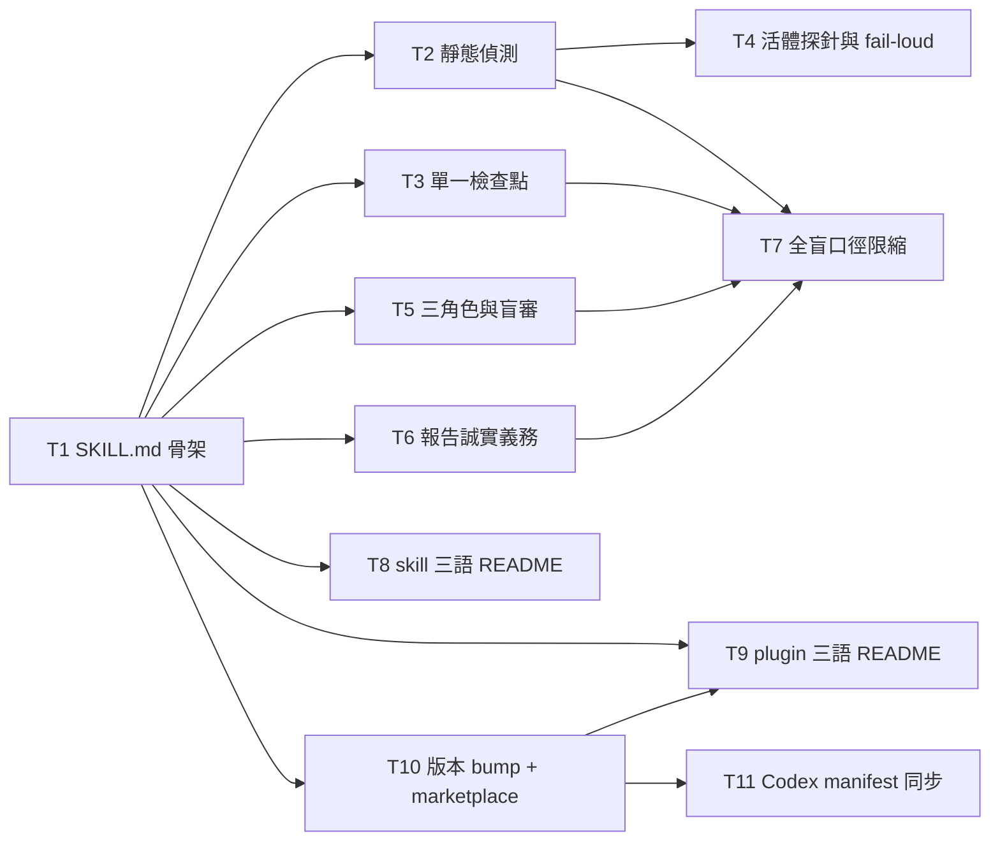

# Plan: independent-advisor — cross-executor second opinion

**Source brief**: docs/loom/specs/2026-08-28-independent-advisor.md
Goal: 一個 `loom-workflow:independent-advisor` skill 能在本機端到端跑完核心迴圈——
    依可引用事實路由模式、靜態偵測執行者、單一檢查點取得核准並揭露出境範圍、
    只對已選執行者做活體探針且 frontier 不靜默降級、以雙順序盲審派出三角色腿、
    最後交出以分歧為首並誠實揭露降級與成本的報告。
Stage: finishing
**Total tasks**: 11
**Critical-path depth**: 3 (≤5 ✓)
**Execution order**: parallel-where-possible
**Plan-document-reviewer verdict**: PASS (2026-08-28, round 2 + author fixes; two standing conditions recorded in Notes)

## Task-flow diagram

## Open Questions

- OQ-1 [RESOLVED] — 本計畫的範圍裁切（只做 brief 的 Smallest End State 六點，丟棄持久化／政策宣告／數值門檻／腿間未受信任標記）該以什麼身分寫進計畫？→ resolved: 以「本 session 明說的假設」入帳，逐字寫在 `## Notes` 第一句，並把 74 條被丟棄的 join key 全列在同節供使用者確認；SDD 派工前需先取得該確認。

## Complexity assessment

- Added complexity：一個新的 skill 目錄（`SKILL.md` + 三個單層 `references/` 契約檔 + 三語 README），一支字串斷言測試檔，以及一次 plugin 版本 bump 與其 Codex manifest 鏡射。
- Why it is worthwhile：整個 brief 的 end state 就是「這個 skill 存在並能端到端跑完核心迴圈」；散文契約是這個 repo 對 skill 的唯一交付形態，沒有更小的載體。
- Removed or avoided complexity：不新增執行期程式碼、不新增持久化層、不新增政策宣告格式、不挑任何數值門檻；既有的 `sync_codex_manifests.py` 與 `check-marketplace-description-sync.py` 直接沿用，不另造同步機制。
- Downstream risk：SKILL.md 有 ~6000 token 硬上限，六組承重契約全塞進 body 會撞頂；風險落在「哪些留 body、哪些落 references」的切分，而不落在任何單一契約本身。

## Task 1 — 建立 skill 骨架與模式路由契約

- **Description**: Create `loom-workflow/skills/independent-advisor/SKILL.md` with YAML frontmatter (`name`, `version: 0.1.0`, `description`) and the mode-routing contract section.
  - State that `explore` (three roles) vs `audit` (single leg) is determined from a citable fact, recorded verbatim as `mode_basis`.
  - State that a user override sets `mode_override` without erasing the original basis.
  - State that conflicting bases are both recorded and surfaced at the checkpoint rather than silently resolved, and that no citable fact means asking the user instead of synthesising one.
  - Also state that a request with no incumbent yet is a legitimate exploratory request, distinct from an incomplete packet, and that `audit` mode runs no proposer leg.
  - Create `loom-workflow/scripts/test_independent_advisor_compaction.py` following the string-assertion shape of the sibling `test_handoff_compaction.py`.
  - The tier vocabulary is `economy` / `standard` / `frontier` crossed with `low` / `medium` / `high`; do not invent other tier words.
  - Runtime prose must not cite any `docs/` path of this repository.
- **Module**: `loom-workflow/skills/independent-advisor/SKILL.md`
- **Files touched**: `loom-workflow/skills/independent-advisor/SKILL.md`, `loom-workflow/scripts/test_independent_advisor_compaction.py`
- **Context paths**:
  - `/Users/kouko/.herdr/worktrees/monkey-skills/independent-advisor/loom-workflow/skills/handoff/SKILL.md`
  - `/Users/kouko/.herdr/worktrees/monkey-skills/independent-advisor/loom-workflow/scripts/test_handoff_compaction.py`
  - `/Users/kouko/.herdr/worktrees/monkey-skills/independent-advisor/CLAUDE.md`
- **Acceptance**:
  - **RED**: `test_independent_advisor_compaction.py::test_mode_routing_is_bound_to_a_citable_fact` fails.
    - Fails today because `loom-workflow/skills/independent-advisor/SKILL.md` does not exist.
  - **GREEN**: The test passes: SKILL.md contains `mode_basis`, `mode_override`, `explore`, `audit`, the conflicting-bases surfacing rule, and the ask-the-user rule for a missing citable fact.
- **Dependencies**: none
- **Independent**: false
- **Brief item covered**: 2026-08-28-independent-advisor / REQ-1 / Scenario: implemented commit on the branch
- **Brief item covered**: 2026-08-28-independent-advisor / REQ-1 / Scenario: approved brief with no implementation
- **Brief item covered**: 2026-08-28-independent-advisor / REQ-1 / Scenario: no citable fact is available
- **Brief item covered**: 2026-08-28-independent-advisor / REQ-1 / Scenario: conflicting bases
- **Brief item covered**: 2026-08-28-independent-advisor / REQ-2 / Scenario: user overrides the determined mode
- **Brief item covered**: 2026-08-28-independent-advisor / REQ-12 / Scenario: audit mode dispatch
- **Brief item covered**: 2026-08-28-independent-advisor / REQ-43 / Scenario: exploratory request with no incumbent
- **Brief item covered**: 2026-08-28-independent-advisor / REQ-43 / Scenario: incumbent exists but was not written down
- **Status**: pending
- **Gloss**: skill 從此存在，而且「要用三角色探索還是單腿稽核」這件事有了寫得出來的依據，不再靠當下感覺。

## Task 2 — 寫入靜態偵測與選項排除契約

- **Description**: Add the static-detection contract to SKILL.md and author `loom-workflow/skills/independent-advisor/references/executor-detection.md`.
  - State that a candidate failing the static check never appears in the checkpoint option list, that a missing binary and a missing credential file yield distinguishable exclusion reasons, and that a user naming an excluded executor gets a refusal carrying that reason.
  - State that a present-but-not-executable binary and a present-but-unusable credential are each their own distinguishable reason, not folded into "missing".
  - State that a passing static check is permission to attempt a live probe only, and is never reported downstream as a verified capability.
  - State that an empty candidate set, or a set containing only same-family executors, stops the run rather than degrading into self-review; and that exactly one passing candidate surfaces the distinct-executor conflict.
- **Module**: `loom-workflow/skills/independent-advisor/SKILL.md`
- **Files touched**: `loom-workflow/skills/independent-advisor/SKILL.md`, `loom-workflow/skills/independent-advisor/references/executor-detection.md`, `loom-workflow/scripts/test_independent_advisor_compaction.py`
- **Context paths**:
  - `/Users/kouko/.herdr/worktrees/monkey-skills/independent-advisor/loom-workflow/skills/independent-advisor/SKILL.md`
  - `/Users/kouko/.herdr/worktrees/monkey-skills/independent-advisor/loom-workflow/skills/handoff/references/handoff-schema.md`
- **Acceptance**:
  - **RED**: `test_independent_advisor_compaction.py::test_static_detection_excludes_and_never_claims_verification` fails.
    - Fails today because neither the SKILL.md section nor `references/executor-detection.md` exists.
  - **GREEN**: The test passes: the exclusion rule, the four distinguishable exclusion reasons, the "statically available, not yet verified" label, and the stop-rather-than-self-review rule are all present.
- **Dependencies**: Task 1 completes first
- **Seam**:
  - from Task 1: payload: none
- **Independent**: false
- **Brief item covered**: 2026-08-28-independent-advisor / REQ-3 / Scenario: missing binary
- **Brief item covered**: 2026-08-28-independent-advisor / REQ-3 / Scenario: missing credential file
- **Brief item covered**: 2026-08-28-independent-advisor / REQ-3 / Scenario: user names an excluded executor
- **Brief item covered**: 2026-08-28-independent-advisor / REQ-4 / Scenario: static pass reported at the checkpoint
- **Brief item covered**: 2026-08-28-independent-advisor / REQ-20 / Scenario: candidate set is empty
- **Brief item covered**: 2026-08-28-independent-advisor / REQ-20 / Scenario: only same-family executors are available
- **Brief item covered**: 2026-08-28-independent-advisor / REQ-44 / Scenario: exactly one executor passes static detection
- **Brief item covered**: 2026-08-28-independent-advisor / REQ-45 / Scenario: binary present but not executable
- **Brief item covered**: 2026-08-28-independent-advisor / REQ-45 / Scenario: credential file present but unusable
- **Status**: pending
- **Gloss**: 使用者只會看到真的裝得起來的執行者選項，而且不會把「裝得起來」誤讀成「已經驗過了」。

## Task 3 — 寫入單一檢查點與出境揭露契約

- **Description**: Add the single-checkpoint contract to SKILL.md.
  - State that ONE checkpoint carries leg count, executors, estimated cost, and the egress disclosure together; splitting these into separate questions, dispatching without approval, or treating a partial answer as approval are each violations.
  - State that a changed executor set invalidates the prior approval and returns to the checkpoint.
  - State that the egress disclosure names the vendor and the egress categories, and that an approval covering cost only does not cover egress.
  - State that the checkpoint says, in non-technical language, that what was inspected is the dispatch packet while the executor's readable range is `scope_boundary`, and that the latter is the larger of the two.
  - State that an unavailable cost estimate is shown as unknown and never as zero, and that a genuinely zero-cost executor is stated as zero rather than as unknown.
- **Module**: `loom-workflow/skills/independent-advisor/SKILL.md`
- **Files touched**: `loom-workflow/skills/independent-advisor/SKILL.md`, `loom-workflow/scripts/test_independent_advisor_compaction.py`
- **Context paths**:
  - `/Users/kouko/.herdr/worktrees/monkey-skills/independent-advisor/loom-workflow/skills/independent-advisor/SKILL.md`
- **Acceptance**:
  - **RED**: `test_independent_advisor_compaction.py::test_single_checkpoint_carries_three_elements_and_egress_disclosure` fails.
    - Fails today because the checkpoint section does not exist in SKILL.md.
  - **GREEN**: The test passes: the one-checkpoint rule, the no-split / no-partial-answer rules, the re-approval-on-executor-change rule, the vendor-and-category egress wording, the `scope_boundary` larger-range sentence, and the unknown-never-zero cost rule are all present.
- **Dependencies**: Task 1 completes first
- **Seam**:
  - from Task 1: payload: none
- **Independent**: false
- **Brief item covered**: 2026-08-28-independent-advisor / REQ-9 / Scenario: checkpoint is presented
- **Brief item covered**: 2026-08-28-independent-advisor / REQ-9 / Scenario: split questioning
- **Brief item covered**: 2026-08-28-independent-advisor / REQ-9 / Scenario: dispatch without approval
- **Brief item covered**: 2026-08-28-independent-advisor / REQ-9 / Scenario: partial answer
- **Brief item covered**: 2026-08-28-independent-advisor / REQ-9 / Scenario: executor set changed
- **Brief item covered**: 2026-08-28-independent-advisor / REQ-27 / Scenario: checkpoint names vendor and egress categories
- **Brief item covered**: 2026-08-28-independent-advisor / REQ-27 / Scenario: approval covers cost only
- **Brief item covered**: 2026-08-28-independent-advisor / REQ-27 / Scenario: cancellation after a transfer already happened
- **Brief item covered**: 2026-08-28-independent-advisor / REQ-47 / Scenario: executor whose cost cannot be estimated
- **Brief item covered**: 2026-08-28-independent-advisor / REQ-47 / Scenario: genuinely zero-cost executor
- **Brief item covered**: 2026-08-28-independent-advisor / REQ-68 / Scenario: checkpoint presented for a dispatch carrying a path authorisation
- **Status**: pending
- **Gloss**: 使用者在一個畫面上就知道要跑幾腿、找誰、大約花多少、什麼東西會離開這台機器——不是被拆成好幾次問到麻痺後點頭。

## Task 4 — 寫入活體探針與 fail-loud 契約

- **Description**: Add the live-probe contract to SKILL.md and extend `references/executor-detection.md` with the probe procedure.
  - State that a live probe runs only for an executor the user selected, and that a cancelled checkpoint runs no probe at all.
  - State that the probe outcome comes from the probe command's own exit status — never from a pipeline exit code — and that a probe that never returns is a probe failure, not a pass.
  - State that a probe passes only when BOTH the self-reported model and the self-reported effort are verified; a missing effort field, or a response carrying no tier fields at all, is a failure.
  - State that a `frontier` request fails loud and is never auto-downgraded: a failed frontier probe stops, a frontier probe verifying a lower tier is reported as unavailable capability, a downgrade proceeds only on explicit user confirmation, and a non-frontier tier mismatch is still disclosed.
  - State that the verified executor is the dispatched executor — an alias swapped after verification invalidates it, judge and proposer must not be the same executor, and both swap runs must be judged under identical settings.
  - State that the probe invocation is assembled with no write access.
- **Module**: `loom-workflow/skills/independent-advisor/SKILL.md`
- **Files touched**: `loom-workflow/skills/independent-advisor/SKILL.md`, `loom-workflow/skills/independent-advisor/references/executor-detection.md`, `loom-workflow/scripts/test_independent_advisor_compaction.py`
- **Context paths**:
  - `/Users/kouko/.herdr/worktrees/monkey-skills/independent-advisor/loom-workflow/skills/independent-advisor/references/executor-detection.md`
  - `/Users/kouko/.herdr/worktrees/monkey-skills/independent-advisor/loom-code/skills/using-loom-code/references/dispatch-profile.md`
  - `/Users/kouko/.herdr/worktrees/monkey-skills/independent-advisor/loom-code/scripts/loom_firing_harness.py`
- **External surfaces**:
  - CLI flag: `claude --model` / `codex --model` — grounding: in-repo evidence, `loom-code/scripts/loom_firing_harness.py` `host_argv_for_root()` (Codex passes `--model` before the query, Claude appends it, and Codex has no `--plugin-dir` equivalent)
- **Acceptance**:
  - **RED**: `test_independent_advisor_compaction.py::test_live_probe_verifies_both_tiers_and_frontier_fails_loud` fails.
    - Fails today because the probe section does not exist in SKILL.md.
  - **GREEN**: The test passes: the selection-gated probe rule, the own-exit-status rule, the both-model-and-effort rule, the frontier fail-loud rule with its explicit-confirmation exception, the verified-is-dispatched rule, and the no-write-access probe rule are all present.
- **Dependencies**: Tasks 1, 2 complete first
- **Seam**:
  - from Task 1: payload: none
  - from Task 2: payload: the candidate-executor record fields the probe consumes — executor identifier, static-check status, and exclusion reason; owner: Task 2; probe: `test_independent_advisor_compaction.py::test_live_probe_verifies_both_tiers_and_frontier_fails_loud`
- **Independent**: false
- **Brief item covered**: 2026-08-28-independent-advisor / REQ-5 / Scenario: candidate not selected
- **Brief item covered**: 2026-08-28-independent-advisor / REQ-5 / Scenario: user cancels at the checkpoint
- **Brief item covered**: 2026-08-28-independent-advisor / REQ-6 / Scenario: probe output passed through a pipeline
- **Brief item covered**: 2026-08-28-independent-advisor / REQ-6 / Scenario: probe never returns
- **Brief item covered**: 2026-08-28-independent-advisor / REQ-7 / Scenario: model obtained but effort missing
- **Brief item covered**: 2026-08-28-independent-advisor / REQ-7 / Scenario: response carries no tier fields at all
- **Brief item covered**: 2026-08-28-independent-advisor / REQ-8 / Scenario: frontier probe fails
- **Brief item covered**: 2026-08-28-independent-advisor / REQ-8 / Scenario: frontier probe verifies a lower tier
- **Brief item covered**: 2026-08-28-independent-advisor / REQ-8 / Scenario: user confirms a downgrade after fail loud
- **Brief item covered**: 2026-08-28-independent-advisor / REQ-8 / Scenario: non-frontier tier mismatch
- **Brief item covered**: 2026-08-28-independent-advisor / REQ-21 / Scenario: alias swapped after verification
- **Brief item covered**: 2026-08-28-independent-advisor / REQ-21 / Scenario: judge and proposer are the same executor
- **Brief item covered**: 2026-08-28-independent-advisor / REQ-21 / Scenario: swap runs judged with different settings
- **Brief item covered**: 2026-08-28-independent-advisor / REQ-22 / Scenario: probe invocation is assembled
- **Status**: pending
- **Gloss**: 你要的是更強的第二意見，這條規則保證真的跑在你要的檔次上——拿不到就大聲說拿不到，而不是偷偷換一個弱的回來。

## Task 5 — 寫入三角色派發與雙順序盲審契約

- **Description**: Add the dispatch contract to SKILL.md and author `loom-workflow/skills/independent-advisor/references/dispatch-protocol.md`.
  - State that the proposer leg never sees the incumbent solution, that a packet leaking it is a defect, and that a retry after an empty output reuses the same blind packet.
  - State that anonymisation and structural order counterbalancing are TWO separate controls, and that either one alone is insufficient.
  - State that a prompt reminder is not a substitute for a second run, that both swap runs must carry a verdict, that de-anonymisation happens only after all verdicts, and that the judge learning who the incumbent is invalidates the pair.
  - State that when the two swap runs disagree, the disagreement is itself reported rather than averaged away.
  - State that the reversed swap run carries no state from the forward run, and that reusing one session for both orders is a violation.
  - State the dispatch packet's required sections, that dispatch is refused while any section is missing, that "no rejected options exist" is written explicitly rather than left blank, and that an evidence path the executor cannot read is surfaced instead of silently dropped.
  - State that normalisation preserves the claims it compresses, that the normaliser must not be the executor that authored the incumbent, and that a large length difference between cards is normalised without dropping claims.
- **Module**: `loom-workflow/skills/independent-advisor/SKILL.md`
- **Files touched**: `loom-workflow/skills/independent-advisor/SKILL.md`, `loom-workflow/skills/independent-advisor/references/dispatch-protocol.md`, `loom-workflow/scripts/test_independent_advisor_compaction.py`
- **Context paths**:
  - `/Users/kouko/.herdr/worktrees/monkey-skills/independent-advisor/loom-workflow/skills/independent-advisor/SKILL.md`
- **Acceptance**:
  - **RED**: `test_independent_advisor_compaction.py::test_three_roles_blind_packet_and_dual_order_judging` fails.
    - Fails today because `references/dispatch-protocol.md` does not exist.
  - **GREEN**: The test passes: the proposer-blindness rule, the two-separate-controls rule with its four negative cases, the disagreement-is-reported rule, the no-shared-state rule for the reversed run, the packet-completeness rules, and the three normalisation rules are all present.
- **Dependencies**: Task 1 completes first
- **Seam**:
  - from Task 1: payload: none
- **Independent**: false
- **Brief item covered**: 2026-08-28-independent-advisor / REQ-10 / Scenario: packet leaks the incumbent
- **Brief item covered**: 2026-08-28-independent-advisor / REQ-10 / Scenario: retry after an empty output
- **Brief item covered**: 2026-08-28-independent-advisor / REQ-11 / Scenario: origin withheld
- **Brief item covered**: 2026-08-28-independent-advisor / REQ-11 / Scenario: only one swap run has a verdict
- **Brief item covered**: 2026-08-28-independent-advisor / REQ-11 / Scenario: prompt reminder instead of a second run
- **Brief item covered**: 2026-08-28-independent-advisor / REQ-11 / Scenario: anonymisation without counterbalancing
- **Brief item covered**: 2026-08-28-independent-advisor / REQ-11 / Scenario: counterbalancing without anonymisation
- **Brief item covered**: 2026-08-28-independent-advisor / REQ-11 / Scenario: judge learns who the incumbent is
- **Brief item covered**: 2026-08-28-independent-advisor / REQ-11 / Scenario: the two swap runs disagree
- **Brief item covered**: 2026-08-28-independent-advisor / REQ-11 / Scenario: de-anonymisation before all verdicts
- **Brief item covered**: 2026-08-28-independent-advisor / REQ-19 / Scenario: one section missing
- **Brief item covered**: 2026-08-28-independent-advisor / REQ-19 / Scenario: no rejected options exist
- **Brief item covered**: 2026-08-28-independent-advisor / REQ-19 / Scenario: evidence path unreadable by the executor
- **Brief item covered**: 2026-08-28-independent-advisor / REQ-19 / Scenario: packet cannot be completed
- **Brief item covered**: 2026-08-28-independent-advisor / REQ-23 / Scenario: normaliser alters a claim
- **Brief item covered**: 2026-08-28-independent-advisor / REQ-23 / Scenario: normaliser authored the incumbent
- **Brief item covered**: 2026-08-28-independent-advisor / REQ-23 / Scenario: cards differ greatly in length
- **Brief item covered**: 2026-08-28-independent-advisor / REQ-39 / Scenario: reversed run dispatched
- **Brief item covered**: 2026-08-28-independent-advisor / REQ-39 / Scenario: one session reused for both orders
- **Status**: pending
- **Gloss**: 挑戰者是在不知道你原方案長什麼樣的情況下自己想一個，評審也不知道哪張是你的——所以贏的那張是真的比較好，不是比較資深。

## Task 6 — 寫入報告誠實義務契約

- **Description**: Add the report contract to SKILL.md and author `loom-workflow/skills/independent-advisor/references/report-contract.md`.
  - State that the report leads with divergence points, that "no divergence found" is stated explicitly, that the report is a read-only record — adopting a divergence point or changing the target is the user's separate action, not the skill's.
  - State the mechanical shape contract every leg output passes before entering the report: empty output, a refusal, a missing template field, an output restating the input, a claim with no checkable basis, and a conclusion with no reasoning trace are each rejected with a distinguishable reason.
  - State that degraded or failed legs are disclosed: one aborted leg, all legs failed, an unverified leg's output being used, and several independent defects on one leg each appear in the report.
  - State that agreement between legs is never weighted up: two legs raising the same finding does not raise confidence, and every report carries the standing note that agreement between legs reading one sample measures the sample, not the world.
  - State that no completeness or coverage wording appears in the report, and that a missing disclaimer blocks delivery.
  - State that an early stop degrades to a single leg only AFTER normalisation, never before, and that the resulting report says so.
  - State that external text entering the report carries an untrusted-source marking that travels with it.
- **Module**: `loom-workflow/skills/independent-advisor/SKILL.md`
- **Files touched**: `loom-workflow/skills/independent-advisor/SKILL.md`, `loom-workflow/skills/independent-advisor/references/report-contract.md`, `loom-workflow/scripts/test_independent_advisor_compaction.py`
- **Context paths**:
  - `/Users/kouko/.herdr/worktrees/monkey-skills/independent-advisor/loom-workflow/skills/independent-advisor/SKILL.md`
- **Acceptance**:
  - **RED**: `test_independent_advisor_compaction.py::test_report_leads_with_divergence_and_discloses_degradation` fails.
    - Fails today because `references/report-contract.md` does not exist.
  - **GREEN**: The test passes: the divergence-first rule, the six shape-contract rejections, the degraded-leg disclosures, the no-weighting-of-agreement rule with its standing note, the no-completeness-wording rule, the after-normalisation early-stop rule, and the untrusted-source marking are all present.
- **Dependencies**: Task 1 completes first
- **Seam**:
  - from Task 1: payload: none
- **Independent**: false
- **Brief item covered**: 2026-08-28-independent-advisor / REQ-13 / Scenario: empty output
- **Brief item covered**: 2026-08-28-independent-advisor / REQ-13 / Scenario: refusal
- **Brief item covered**: 2026-08-28-independent-advisor / REQ-13 / Scenario: missing template field
- **Brief item covered**: 2026-08-28-independent-advisor / REQ-13 / Scenario: output restates the input
- **Brief item covered**: 2026-08-28-independent-advisor / REQ-13 / Scenario: claim without a checkable basis
- **Brief item covered**: 2026-08-28-independent-advisor / REQ-13 / Scenario: conclusion without reasoning trace
- **Brief item covered**: 2026-08-28-independent-advisor / REQ-14 / Scenario: one leg aborted
- **Brief item covered**: 2026-08-28-independent-advisor / REQ-14 / Scenario: all legs failed
- **Brief item covered**: 2026-08-28-independent-advisor / REQ-14 / Scenario: unverified leg output used
- **Brief item covered**: 2026-08-28-independent-advisor / REQ-14 / Scenario: several independent defects on one leg
- **Brief item covered**: 2026-08-28-independent-advisor / REQ-15 / Scenario: two legs raise the same finding
- **Brief item covered**: 2026-08-28-independent-advisor / REQ-15 / Scenario: confidence assignment
- **Brief item covered**: 2026-08-28-independent-advisor / REQ-15 / Scenario: standing weakness note
- **Brief item covered**: 2026-08-28-independent-advisor / REQ-16 / Scenario: report is scanned for coverage claims
- **Brief item covered**: 2026-08-28-independent-advisor / REQ-16 / Scenario: disclaimer missing
- **Brief item covered**: 2026-08-28-independent-advisor / REQ-18 / Scenario: cards are substantially identical
- **Brief item covered**: 2026-08-28-independent-advisor / REQ-18 / Scenario: early stop claimed before normalisation
- **Brief item covered**: 2026-08-28-independent-advisor / REQ-18 / Scenario: report after early stop
- **Brief item covered**: 2026-08-28-independent-advisor / REQ-24 / Scenario: user adopts a divergence point
- **Brief item covered**: 2026-08-28-independent-advisor / REQ-24 / Scenario: no divergence points found
- **Brief item covered**: 2026-08-28-independent-advisor / REQ-24 / Scenario: user asks for the target to be changed
- **Brief item covered**: 2026-08-28-independent-advisor / REQ-73 / Scenario: report consumed by an agent rather than read by the user
- **Status**: pending
- **Gloss**: 報告先講「哪裡看法不一樣」，並且老實說有幾腿掛掉、兩腿講一樣不等於比較對——避免你把一致誤讀成證據。

## Task 7 — 限縮全盲與掃描通過的宣稱口徑

- **Description**: Add the claim-calibration section to SKILL.md, bounding what the report may assert about blindness and about scans.
  - State that the proposer leg's blindness claim is about the dispatch packet only: when `scope_boundary` may authorise the executor to reach material describing the incumbent, the report must NOT make an unconditional blindness claim and must state the qualification instead.
  - State that a pre-dispatch scan returning no hit is never stated as safe content — the report records what the scan checked, not a safety verdict.
  - State that the report records that the guarantee covers the dispatch packet only, and that material readable within `scope_boundary` was not subject to it.
  - State that a pinned revision is reported as the packet's origin, not as a claim about what was reviewed.
- **Module**: `loom-workflow/skills/independent-advisor/SKILL.md`
- **Files touched**: `loom-workflow/skills/independent-advisor/SKILL.md`, `loom-workflow/scripts/test_independent_advisor_compaction.py`
- **Context paths**:
  - `/Users/kouko/.herdr/worktrees/monkey-skills/independent-advisor/loom-workflow/skills/independent-advisor/SKILL.md`
- **Acceptance**:
  - **RED**: `test_independent_advisor_compaction.py::test_blindness_and_scan_claims_are_bounded_by_scope_boundary` fails.
    - Fails today because the claim-calibration section does not exist in SKILL.md.
  - **RED**: `test_independent_advisor_compaction.py::test_skill_body_stays_under_the_repo_word_cap` fails or is absent.
    - This is the LAST task to write SKILL.md, so it owns the budget gate for the finished body.
    - The assertion mirrors `python3 scripts/check-skill-structure.py loom-workflow`'s `WORD_HARD_CAP = 4500` (CHK-SKL-010, FATAL in `.github/workflows/skill-structure.yml`), so the cap is caught here rather than silently in CI.
  - **GREEN**: Both tests pass, and `python3 scripts/check-skill-structure.py loom-workflow` reports no CHK-SKL-010 failure.
    - Present in SKILL.md: the qualified-blindness rule naming `scope_boundary`, the scan-is-not-safety rule, the packet-only guarantee sentence, and the pinned-revision-is-origin rule.
    - Over the cap, the fix is moving non-load-bearing detail into `references/`, never dropping a contract rule.
- **Dependencies**: Tasks 2, 3, 5, 6 complete first
- **Seam**:
  - from Task 2: payload: none
  - from Task 3: payload: none
  - from Task 5: payload: none
  - from Task 6: payload: none
- **Independent**: false
- **Brief item covered**: 2026-08-28-independent-advisor / REQ-69 / Scenario: pre-dispatch scan returns no hit
- **Brief item covered**: 2026-08-28-independent-advisor / REQ-70 / Scenario: report delivered after a consultation
- **Brief item covered**: 2026-08-28-independent-advisor / REQ-71 / Scenario: report citing a pinned revision
- **Status**: pending
- **Gloss**: 報告不會說「挑戰者完全沒看過你的方案」或「掃過了所以安全」這種其實兜不住的話——講得到多滿，就只講到多滿。

## Task 8 — 補上 skill 層三語 README

- **Description**: Author `README.md`, `README.ja.md`, and `README.zh-TW.md` under `loom-workflow/skills/independent-advisor/`, following the sibling `handoff` skill's tri-language README convention.
  - Each file states what the skill does, when it fires, and how it differs from the sibling critique skills — the executor changes rather than the critique lens.
  - Author `loom-workflow/skills/independent-advisor/scripts/test_independent_advisor_readmes.py` after the shape of `loom-workflow/skills/handoff/scripts/test_handoff_readmes.py`.
- **Module**: `loom-workflow/skills/independent-advisor`
- **Files touched**: `loom-workflow/skills/independent-advisor/README.md`, `loom-workflow/skills/independent-advisor/README.ja.md`, `loom-workflow/skills/independent-advisor/README.zh-TW.md`, `loom-workflow/skills/independent-advisor/scripts/test_independent_advisor_readmes.py`
- **Context paths**:
  - `/Users/kouko/.herdr/worktrees/monkey-skills/independent-advisor/loom-workflow/skills/handoff/README.md`
  - `/Users/kouko/.herdr/worktrees/monkey-skills/independent-advisor/loom-workflow/skills/handoff/scripts/test_handoff_readmes.py`
- **Acceptance**:
  - **RED**: `test_independent_advisor_readmes.py::test_all_three_language_readmes_exist_and_agree` fails.
    - Fails today because none of the three README files exists.
  - **GREEN**: The test passes: all three files exist and each names the skill and its executor-changes-rather-than-lens distinction.
- **Dependencies**: Task 1 completes first
- **Seam**:
  - from Task 1: payload: none
- **Independent**: true
- **Brief item covered**: `none — tri-language skill README is this repo's packaging convention, not a spec requirement; it delivers no scenario.`
- **Status**: pending
- **Gloss**: 中／日／英三種語言的讀者打開 skill 目錄都看得懂它在幹嘛，符合本 repo 既有慣例。

## Task 9 — 把新 skill 列進 plugin 三語 README 與 root README

- **Description**: List `independent-advisor` in `loom-workflow/README.md`, `README.ja.md`, `README.zh-TW.md` (skill table plus the directory tree block) and update the root `README.md` row for `loom-workflow`.
  - The root README row for `loom-workflow` is ALREADY STALE: it reads version `1.0.0` and a skill count of `7`, while the manifest is at `1.0.2` with 9 skills on disk.
  - Never derive the new count by incrementing the printed number. Count the directories under `loom-workflow/skills/`, and read the version from `plugin.json` after Task 10 bumps it.
  - Author `loom-workflow/scripts/test_independent_advisor_plugin_readmes.py` asserting the skill name appears in all four files.
  - The same test asserts the root README row agrees with the filesystem: its skill count equals the directory count, its version cell equals the manifest `version`.
- **Module**: `loom-workflow/README.md`
- **Files touched**: `loom-workflow/README.md`, `loom-workflow/README.ja.md`, `loom-workflow/README.zh-TW.md`, `README.md`, `loom-workflow/scripts/test_independent_advisor_plugin_readmes.py`
- **Context paths**:
  - `/Users/kouko/.herdr/worktrees/monkey-skills/independent-advisor/loom-workflow/README.md`
  - `/Users/kouko/.herdr/worktrees/monkey-skills/independent-advisor/README.md`
- **Acceptance**:
  - **RED**: `test_independent_advisor_plugin_readmes.py::test_skill_is_listed_in_every_readme` fails.
    - Fails today because no README mentions `independent-advisor`.
  - **GREEN**: The test passes: the skill name appears in all three plugin READMEs and in the root README's `loom-workflow` row, and that row's skill count and version cell both agree with the filesystem.
- **Dependencies**: Tasks 1, 10 complete first
- **Seam**:
  - from Task 1: payload: none
  - from Task 10: payload: the bumped `version` string in `loom-workflow/.claude-plugin/plugin.json`, read from the file rather than passed as a number; owner: Task 10; probe: `test_independent_advisor_plugin_readmes.py::test_skill_is_listed_in_every_readme`
- **Independent**: false
- **Brief item covered**: `none — plugin and root README listing is release packaging, not a spec requirement; it delivers no scenario.`
- **Status**: pending
- **Gloss**: 新 skill 不會變成只有翻目錄才找得到的孤兒，README 讀者看得到它。

## Task 10 — Bump plugin 版本並同步 marketplace 描述

- **Description**: Bump `loom-workflow/.claude-plugin/plugin.json` `version` from `1.0.2` to `1.1.0`, add `independent-advisor` to its `keywords`, and update its `description` to mention the cross-executor second opinion.
  - Mirror the new `description` verbatim into the `loom-workflow` entry of `.claude-plugin/marketplace.json` in the same commit — `scripts/check-marketplace-description-sync.py` requires the two strings to be identical.
  - Do NOT hand-edit `loom-workflow/.codex-plugin/plugin.json` here; that mirror is Task 11's script run.
- **Module**: `loom-workflow/.claude-plugin/plugin.json`
- **Files touched**: `loom-workflow/.claude-plugin/plugin.json`, `.claude-plugin/marketplace.json`
- **Context paths**:
  - `/Users/kouko/.herdr/worktrees/monkey-skills/independent-advisor/loom-workflow/.claude-plugin/plugin.json`
  - `/Users/kouko/.herdr/worktrees/monkey-skills/independent-advisor/.claude-plugin/marketplace.json`
  - `/Users/kouko/.herdr/worktrees/monkey-skills/independent-advisor/scripts/check-marketplace-description-sync.py`
- **Acceptance**:
  - **RED**: `python3 scripts/check-marketplace-description-sync.py` exits 1 after the `plugin.json` description is changed and `marketplace.json` still carries the old one.
    - Fails today in the sense the gate is only satisfiable once both files carry the identical new string; the version is still `1.0.2`.
  - **GREEN**: `python3 scripts/check-marketplace-description-sync.py` exits 0, and `loom-workflow/.claude-plugin/plugin.json` reads `"version": "1.1.0"`.
- **Dependencies**: Task 1 completes first
- **Seam**:
  - from Task 1: payload: none
- **Independent**: true
- **Brief item covered**: `none — release administration (version bump + marketplace description mirror); it delivers no scenario.`
- **Status**: pending
- **Gloss**: 沒有 bump 版本的話，`plugin update` 會靜默 no-op，這個 skill 永遠裝不到你機器上。

## Task 11 — 以同步腳本鏡射 Codex manifest

- **Description**: SSOT is `loom-workflow/.claude-plugin/plugin.json`. Run `python3 scripts/sync_codex_manifests.py loom-workflow` and commit its output unmodified.
  - No hand-written edits to `loom-workflow/.codex-plugin/plugin.json`; the Claude manifest is the single source of truth for the shared plugin metadata.
- **Module**: `loom-workflow/.codex-plugin/plugin.json`
- **Files touched**: `loom-workflow/.codex-plugin/plugin.json`
- **Context paths**:
  - `/Users/kouko/.herdr/worktrees/monkey-skills/independent-advisor/scripts/sync_codex_manifests.py`
- **Acceptance**:
  - **RED**: `python3 scripts/sync_codex_manifests.py --check loom-workflow` exits non-zero (shared fields drifted after Task 10's bump).
  - **GREEN**: `python3 scripts/sync_codex_manifests.py --check loom-workflow` exits 0 and the Codex manifest's `interface` block is unchanged
- **Dependencies**: Task 10 completes first
- **Seam**:
  - from Task 10: payload: the shared plugin-metadata fields (`version`, `description`, `keywords`) the sync script copies from the Claude manifest; owner: Task 10; probe: `python3 scripts/sync_codex_manifests.py --check loom-workflow` exits 0 and the Codex manifest's `interface` block is unchanged
- **Independent**: false
- **Review-weight**: mechanical
- **Brief item covered**: `none — deterministic manifest mirror of Task 10's bump; it delivers no scenario.`
- **Status**: pending
- **Gloss**: Codex 端拿到同一份版本與描述，兩個 host 不會各自看到不同的 plugin。

## Notes

Scope cut is an assumption stated by the session, NOT yet explicitly confirmed by the user; the dropped join keys are listed below for confirmation.

Authorisation basis — recorded, never assumed silently. The user set a standing
session goal to carry this arc through to an opened PR. The scope cut and the
round-2 author fixes were surfaced to the user twice in plain language, with the
dropped join keys listed; the standing goal was reaffirmed rather than narrowed.
Two conditions ride with the PASS verdict and MUST be repeated to the user at
branch close:

- The dropped join keys below are cut under a session-stated assumption carried
  by the standing goal directive, not by an itemised user sign-off per key.
- The four round-2 fixes — the missing `T10 --> T9` edge, the stale parallelism
  note, Task 7's under-declared dependencies, and the
  `check-skill-structure.py` invocation missing its plugin argument — were
  applied after the two-round review cap was reached, so they carry no
  third-round reviewer verdict.

範圍裁切依 brief 的 `## Smallest End State` 六點與 `## Out of Scope`：持久化／保留／崩潰復原、組織與 repo 層政策宣告與廠商白名單、所有數值門檻（逾時秒數、支出上限、重試上限）、腿與腿之間的未受信任標記（進報告那條路已由 Task 6 涵蓋），本次一律不實作。額外拉進本次的是 proposer 全盲宣稱的口徑限縮（Task 7），brief 原列為 Out of Scope。

`python3 loom-code/scripts/check_scenario_coverage.py docs/loom/2026-08-28-independent-advisor docs/loom/plans/2026-08-28-independent-advisor.md` 因此預期 exit 1。被丟棄的 join key（74 條）逐條如下：

- `2026-08-28-independent-advisor / REQ-17 / Scenario: early stop saves spend`
- `2026-08-28-independent-advisor / REQ-17 / Scenario: probe paid then user cancels`
- `2026-08-28-independent-advisor / REQ-17 / Scenario: rescoped rerun`
- `2026-08-28-independent-advisor / REQ-25 / Scenario: cancellation while a downgrade is pending`
- `2026-08-28-independent-advisor / REQ-25 / Scenario: cancellation with a leg still running`
- `2026-08-28-independent-advisor / REQ-25 / Scenario: early stop while a downgrade is pending for the judging leg`
- `2026-08-28-independent-advisor / REQ-26 / Scenario: judging leg aborts mid-pair`
- `2026-08-28-independent-advisor / REQ-26 / Scenario: leg aborts before anonymisation`
- `2026-08-28-independent-advisor / REQ-26 / Scenario: replacement executor approved`
- `2026-08-28-independent-advisor / REQ-28 / Scenario: leg invocation is assembled`
- `2026-08-28-independent-advisor / REQ-28 / Scenario: no read-only mode exists for an executor`
- `2026-08-28-independent-advisor / REQ-28 / Scenario: unbounded leg invocation`
- `2026-08-28-independent-advisor / REQ-29 / Scenario: a credential is reachable from the packet`
- `2026-08-28-independent-advisor / REQ-29 / Scenario: static credential detection`
- `2026-08-28-independent-advisor / REQ-30 / Scenario: instruction embedded in reviewed material`
- `2026-08-28-independent-advisor / REQ-30 / Scenario: output addresses the controller`
- `2026-08-28-independent-advisor / REQ-31 / Scenario: cancellation with a child still running`
- `2026-08-28-independent-advisor / REQ-31 / Scenario: controller exits unexpectedly`
- `2026-08-28-independent-advisor / REQ-31 / Scenario: retry after a timeout`
- `2026-08-28-independent-advisor / REQ-32 / Scenario: early stop still records egress`
- `2026-08-28-independent-advisor / REQ-32 / Scenario: run interrupted by controller termination`
- `2026-08-28-independent-advisor / REQ-32 / Scenario: the user asks what left the machine`
- `2026-08-28-independent-advisor / REQ-33 / Scenario: a leg produces no output`
- `2026-08-28-independent-advisor / REQ-33 / Scenario: timeout not declared`
- `2026-08-28-independent-advisor / REQ-34 / Scenario: an invocation beyond the approved set`
- `2026-08-28-independent-advisor / REQ-34 / Scenario: spend passes the approved ceiling`
- `2026-08-28-independent-advisor / REQ-35 / Scenario: allowed-vendor list declared`
- `2026-08-28-independent-advisor / REQ-35 / Scenario: dispatch declared disallowed`
- `2026-08-28-independent-advisor / REQ-36 / Scenario: checkpoint left unanswered`
- `2026-08-28-independent-advisor / REQ-36 / Scenario: headless or scheduled invocation`
- `2026-08-28-independent-advisor / REQ-37 / Scenario: target changes during the run`
- `2026-08-28-independent-advisor / REQ-37 / Scenario: unresolved prior report on the same target`
- `2026-08-28-independent-advisor / REQ-38 / Scenario: child process environment assembled`
- `2026-08-28-independent-advisor / REQ-38 / Scenario: environment files loaded by the executor`
- `2026-08-28-independent-advisor / REQ-38 / Scenario: proposer leg started in the incumbent's working directory`
- `2026-08-28-independent-advisor / REQ-40 / Scenario: judging leg aborted after proposer and normaliser succeeded`
- `2026-08-28-independent-advisor / REQ-40 / Scenario: leg count reported after a stage failure`
- `2026-08-28-independent-advisor / REQ-41 / Scenario: dispatch past the freshness bound`
- `2026-08-28-independent-advisor / REQ-41 / Scenario: quota failure observed on a sibling leg`
- `2026-08-28-independent-advisor / REQ-42 / Scenario: quota exhausted by the other run`
- `2026-08-28-independent-advisor / REQ-42 / Scenario: second consultation while legs are in flight`
- `2026-08-28-independent-advisor / REQ-46 / Scenario: leg output exceeds the stated bound`
- `2026-08-28-independent-advisor / REQ-46 / Scenario: packet exceeds the invocation bound`
- `2026-08-28-independent-advisor / REQ-48 / Scenario: packet contains shell metacharacters`
- `2026-08-28-independent-advisor / REQ-49 / Scenario: cost of failed attempts`
- `2026-08-28-independent-advisor / REQ-49 / Scenario: leg retried after a transport failure`
- `2026-08-28-independent-advisor / REQ-50 / Scenario: controller terminated between spawn and record`
- `2026-08-28-independent-advisor / REQ-50 / Scenario: the per-run record cannot be written`
- `2026-08-28-independent-advisor / REQ-51 / Scenario: record that cannot be parsed`
- `2026-08-28-independent-advisor / REQ-51 / Scenario: two consultations append at the same time`
- `2026-08-28-independent-advisor / REQ-52 / Scenario: elapsed time measured for one leg`
- `2026-08-28-independent-advisor / REQ-52 / Scenario: retry chain within per-leg timeouts`
- `2026-08-28-independent-advisor / REQ-53 / Scenario: ceiling over unknown costs`
- `2026-08-28-independent-advisor / REQ-53 / Scenario: executor reports no per-invocation cost`
- `2026-08-28-independent-advisor / REQ-54 / Scenario: ceiling reached by a single in-flight leg`
- `2026-08-28-independent-advisor / REQ-54 / Scenario: two legs dispatched concurrently`
- `2026-08-28-independent-advisor / REQ-55 / Scenario: controller session exits with legs running`
- `2026-08-28-independent-advisor / REQ-55 / Scenario: identifier reused by an unrelated process`
- `2026-08-28-independent-advisor / REQ-56 / Scenario: process does not respond to termination`
- `2026-08-28-independent-advisor / REQ-57 / Scenario: no declaration exists`
- `2026-08-28-independent-advisor / REQ-57 / Scenario: two declarations conflict`
- `2026-08-28-independent-advisor / REQ-57 / Scenario: working directory and target belong to different repositories`
- `2026-08-28-independent-advisor / REQ-58 / Scenario: invocation originating from another skill`
- `2026-08-28-independent-advisor / REQ-59 / Scenario: host carrying several accounts for one vendor`
- `2026-08-28-independent-advisor / REQ-60 / Scenario: user asserts a hit is a false positive`
- `2026-08-28-independent-advisor / REQ-61 / Scenario: process terminated mid-write`
- `2026-08-28-independent-advisor / REQ-62 / Scenario: queued consultation reaches the front of the queue`
- `2026-08-28-independent-advisor / REQ-63 / Scenario: packet exceeds a candidate's input bound`
- `2026-08-28-independent-advisor / REQ-64 / Scenario: target is a colleague's branch`
- `2026-08-28-independent-advisor / REQ-65 / Scenario: pinned revision no longer resolves`
- `2026-08-28-independent-advisor / REQ-66 / Scenario: retry after the approval was returned to the checkpoint`
- `2026-08-28-independent-advisor / REQ-67 / Scenario: confined execution location holding a working copy`
- `2026-08-28-independent-advisor / REQ-72 / Scenario: pinned executor whose loaded configuration cannot be enumerated ahead of dispatch`
- `2026-08-28-independent-advisor / REQ-74 / Scenario: audit record retaining verbatim sent material`

平行度：Task 8 與 Task 10 的 `Files touched` 互斥且與 Task 2–7 互斥，這兩支可在 Task 1 之後同層平行派工。Task 9 不在該層——它讀 Task 10 寫進 manifest 的版本值，必須排在 Task 10 之後。Task 2、3、5、6 全部寫入同一份 `SKILL.md`，同層但必須循序；Task 7 是最後一個寫 `SKILL.md` 的任務，因此相依 Task 2、3、5、6，由它承接整份 body 的字數上限閘。Task 4 另外相依 Task 2 的執行者候選記錄欄位。
