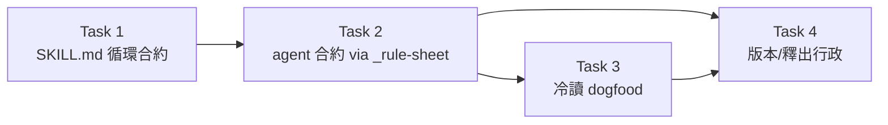

# Plan: review-loop convergence — ledger-driven delta-confirmation for requesting-code-review

**Source brief**: docs/loom/specs/2026-08-28-review-loop-convergence.md
Goal: requesting-code-review keeps round 1 as-is but gains a bounded loop —
    gating findings enter a per-finding ledger, rounds 2+ are inherited
    delta-confirmations to only the arms with open findings, capped at two
    cycles, with a one-shot full-round escalation valve and durable
    recording of out-of-delta observations.
Stage: finishing
Steps:
  1. 改寫 requesting-code-review 的循環合約（帳本＋delta＋上限＋升級閥）
  2. 把確認輪行為規則落進 code-reviewer agent 合約（經 _rule-sheet SSOT）
  3. 冷讀 dogfood 驗證 delta 範圍拒絕行為
  4. 版本 bump、CHANGELOG、manifest 同步與遙測註記
**Total tasks**: 4
**Critical-path depth**: 4 (≤5 ✓)
**Execution order**: sequential
**Plan-document-reviewer verdict**: PASS (2026-08-28, round 2)

## Task-flow diagram

## Open Questions

- OQ-1 [RESOLVED] — Ledger persistence format → resolved: no new store. The working per-finding ledger lives in the review conversation and the verdict structure (same as docs-review's confirmation packet); the durable record for out-of-delta observations reuses the existing `docs/loom/backlog/` store (orchestrator appends an `open` entry), so BI-8 ships with zero new machinery.
- OQ-2 [RESOLVED] — Coordination with the sonnet-pin telemetry (`docs/loom/backlog/2026-08-24-code-reviewer-sonnet-pin-two-week-telemetry.md`) → resolved: Task 4 appends an annotation line to that backlog entry stating that dispatch counts after this arc's merge SHA are not comparable to the pre-arc denominator (rounds 2+ become SendMessage confirmations, not fresh dispatches); the telemetry run re-baselines from that SHA.
- OQ-3 [RESOLVED] — "Substantial new logic" threshold for the escalation valve → resolved: orchestrator judgment with a proxy that is sufficient, not necessary — fix diff beyond every open entry's `where:`, or substantial new functions/tests/behavior; judgment may fire the valve without the proxy and the proxy alone never blocks it. Task 3's probe 2 tests the wording blind.

## Complexity assessment

- Added complexity: a per-finding ledger vocabulary, an arm-selection rule, a round cap, a delta-admissibility rule, and an escalation valve in the requesting-code-review contract; a matching confirmation-round block in the code-reviewer agent contract.
- Why it is worthwhile: the current loop is the family's only uncapped one and mandates fresh full re-review every round; measured evidence (zero-overlap sampling, ~149KB/arm reload, 9-round non-convergence) shows unbounded cost with no termination theory. The docs arm's identical cure is already validated by experiment.
- Removed or avoided complexity: the unconditional fresh-full-re-review step is deleted; de-facto full-panel "confirmation" rounds lose contract cover; no new persistence store is built (backlog reuse).
- Downstream risk: inherited arms could rubber-stamp their own findings (self-anchoring); surfaces in dogfood and in post-ship organic use — the brief's conditional reversal (fall back to fresh delta-scoped dispatch) is the recorded exit, and the Codex fallback path keeps that route permanently exercised.

## Task 1 — 改寫 requesting-code-review 循環合約

- **Description**: Replace the unconditional re-review step in `loom-code/skills/requesting-code-review/SKILL.md` with a ledger-driven convergence loop, and add `scripts/test_review_loop_convergence_pin.py` pinning the new contract.
  - Delete the Step 6 rule "Re-dispatch if user fixed and wants re-review — same skill, fresh subagent (no state carry-over between rounds for clean evaluation)" as the loop rule.
  - Round 1 keeps two fresh arms, whole diff, byte-identical prompts — but each arm is dispatched with a stable `name:` (`code-review-arm-a` / `-b`) recorded in the ledger; amend Step 2's "must not name async teammates" clause with this sanctioned carve-out (delta confirmation drives via SendMessage).
  - New loop contract: a gating verdict opens one ledger entry per gating finding (id, arm, `where:`, severity, state open → CONFIRMED_RESOLVED / STILL_BLOCKING). Entry states flip individually; an arm with any surviving entry stays blocking, and the next cycle's scope is exactly the still-open entries.
  - Rounds 2+ dispatch only to arms holding open entries, as an inherited delta-confirmation: SendMessage to the SAME named reviewer with a post-fix packet (post-fix SHA, original gating findings, delta evidence — mirror the docs-review packet fields).
  - The arm replies with the ordinary three-valued `verdict:`; the orchestrator maps PASS / PASS_WITH_NOTES → CONFIRMED_RESOLVED only when every original finding is closed, NEEDS_REVISION → STILL_BLOCKING + reason. Confirmation outcomes are orchestrator-owned, never agent verdict values.
  - Anchoring guard: the arm's default reading is blocking — an entry closes only on a verbatim quote of the post-fix text plus which clause of the original finding it satisfies; evidence that a file changed is not evidence that a finding closed.
  - Termination: all entries CONFIRMED_RESOLVED → converge and mint; any STILL_BLOCKING with a cycle remaining → next cycle for arms with open entries only; any STILL_BLOCKING at the cap → quality STOP surfaced to the user, never a request for another batch.
  - Convergence minting: the cycle first obtains and `--validate`s a fresh immutable packet at the post-fix SHA, and re-runs Step 4's `LOOM-SIMPLIFY:` harvest there.
  - On convergence the orchestrator builds a schema-valid terminal wrapper (11 `dimension_scores`, post-fix `reviewed_sha`, R3 floor never upgraded) and mints from the wrapper — CONFIRMED_RESOLVED is never minted directly.
  - Delta admissibility: a round-2+ arm may close its own entries and may raise new gating findings only inside the fix diff; out-of-delta observations are recorded as non-gating debt — the orchestrator appends an `open` entry to `docs/loom/backlog/` — and never trigger a round.
  - Cap: round 1 plus at most two delta-confirmation cycles. The fresh-delta fallback (dead arm, quota-kill, Codex host), the dead-arm retry, and one MALFORMED_PACKET repair are deliveries of the SAME cycle and consume none; their existing bounds still apply.
  - A post-verdict change with no open ledger entries is not a confirmation cycle: it restarts at round 1 (fresh panel) and consumes no cycle.
  - Confirmation rounds are single-arm by design: Step 3's degraded-evidence disclosure applies to round 1 only, never to a confirmation delivery.
  - Lost-handle rule (docs Directive 4 transplant): session death, context compaction, or a dead handle before confirmation → one fresh whole-diff round 1, disclosed as "never delta-confirmed and why" — never a ledger flip.
  - Escalation valve: one fresh full two-arm round may replace a delta cycle, counted against the cap, when the fix grows substantial new logic.
  - Valve proxy (sufficient, not necessary): fix diff beyond every open entry's `where:`, or new functions/tests/behavior; judgment may fire the valve without the proxy, and the proxy alone never blocks it.
  - A valve round never closes an open ledger entry — entries close only via their own arm's confirmation, and any entry still open at the valve round's end keeps the verdict gating. The valve is unavailable when it would consume the last remaining cycle.
  - Mixed branch: the cap counts per arm; the docs arm keeps its own one-cycle bound, and a code-arm cycle 2 does not re-dispatch the docs arm — the branch verdict joins the docs arm's last verdict, disclosed as such.
  - Preserve unchanged: the Dead-arm rule and the MALFORMED_PACKET one-packet-fix bound (Step 3) — the new loop must not alter either.
  - Contract text must not cite `docs/` development records (check_contract_citations.py gate); state rules, not evidence.
  - If the SKILL.md token cap trips, extract detail to a `references/` file per the standing word-cap authorization and note it in the PR.
- **Module**: `loom-code/skills/requesting-code-review/SKILL.md`
- **Files touched**: `loom-code/skills/requesting-code-review/SKILL.md`, `scripts/test_review_loop_convergence_pin.py`
- **Context paths**:
  - `loom-code/skills/requesting-code-review/SKILL.md`
  - `loom-code/skills/requesting-docs-review/SKILL.md`
  - `scripts/test_deletion_first_dimension_pin.py`
  - `docs/loom/memory/same-reviewer-delta-confirmation-dies-at-a-context-compaction.md`
  - `loom-code/skills/using-loom-code/references/environment-gotchas.md`
- **Acceptance**:
  - **RED**: `scripts/test_review_loop_convergence_pin.py::test_skill_carries_ledger_confirmation_loop` fails — the test (new file) asserts the SKILL.md carries the ledger loop tokens and no longer carries the old unconditional fresh-re-dispatch rule.
    - Assert present: per-finding ledger vocabulary (`CONFIRMED_RESOLVED`, `STILL_BLOCKING`), the arm-selection rule, the two-cycle cap, the delta-admissibility rule, the backlog debt route.
    - Assert present (round-1-revision additions): the escalation valve + its never-closes-entries rule, the stable arm `name:` carve-out, the terminal-wrapper minting rule, the lost-handle restart rule.
    - Assert absent: the verbatim old rule "same skill, fresh subagent (no state carry-over between rounds for clean evaluation)".
    - Assert retained: the "Dead-arm rule" anchor and the MALFORMED_PACKET one-packet-fix wording survive the rewrite.
  - **GREEN**: the new test passes and the existing suite (`python3 -m pytest scripts/ -q`) stays green, including `check_contract_citations.py` and skill-structure checks.
- **Dependencies**: none
- **Independent**: false
- **Brief item covered**: BI-7 (primary, RED-test tie-break); also delivers BI-1, BI-2, BI-4, BI-5, BI-8, BI-9, BI-10 in this section rewrite (see Notes)
- **Status**: done(53bba6b1)
- **Gloss**: 整支分支審查從「每輪全新重審、無上限」改為「帳本驅動、封頂、只確認修復」——成本從無界變有界。

## Task 2 — code-reviewer agent 合約補確認輪行為（經 _rule-sheet SSOT）

- **Description**: Land the round-2+ confirmation-round behaviour rules in the executing agent contract: edit the shared block in `loom-code/scripts/_rule-sheet.md`, run `python3 loom-code/scripts/distribute.py`, and commit the regenerated `loom-code/agents/code-reviewer.md`; extend the pin test.
  - Agent-side rules (mirror Task 1's vocabulary): on a post-fix confirmation packet, judge each of YOUR OWN original findings against the delta and return the ordinary three-valued `verdict:`.
  - CONFIRMED_RESOLVED / STILL_BLOCKING are orchestrator-owned confirmation outcomes and must NOT appear as agent `verdict:` values.
  - Default is the blocking reading: close a finding only with a verbatim quote of the post-fix text plus which clause of the original finding it satisfies; otherwise the finding survives and the verdict is NEEDS_REVISION.
  - New gating findings are admissible only inside the fix diff; an out-of-delta observation is reported as non-gating debt, never as a gating finding.
  - If the rule block is not distribute-managed for this section, place the rules directly in `loom-code/agents/code-reviewer.md` and note why (routing table decides; verify with `python3 loom-code/scripts/verify-drift.py`).
- **Module**: `loom-code/agents/code-reviewer.md`
- **Files touched**: `loom-code/scripts/_rule-sheet.md`, `loom-code/agents/code-reviewer.md`, `scripts/test_review_loop_convergence_pin.py`
- **Context paths**:
  - `loom-code/scripts/_rule-sheet.md`
  - `loom-code/scripts/distribute.py`
  - `loom-code/agents/code-reviewer.md`
- **Acceptance**:
  - **RED**: `scripts/test_review_loop_convergence_pin.py::test_code_reviewer_agent_carries_confirmation_contract` fails.
    - Assert present in `loom-code/agents/code-reviewer.md`: the confirmation-round rules (three-valued reply, verbatim-quote closing bar, delta admissibility, debt reporting).
    - Assert absent: CONFIRMED_RESOLVED / STILL_BLOCKING listed as agent `verdict:` values.
  - **GREEN**: the new test passes; `python3 loom-code/scripts/verify-drift.py` exits 0; full suite stays green.
- **Dependencies**: Task 1 completes first
- **Seam**:
  - from Task 1: payload: shared confirmation vocabulary (ledger states, delta-admissibility wording); owner: Task 1; probe: `scripts/test_review_loop_convergence_pin.py::test_code_reviewer_agent_carries_confirmation_contract`
- **Independent**: false
- **Brief item covered**: BI-6
- **Status**: done(ba241fe2)
- **Gloss**: 規則不只寫在 SKILL.md——真正執行審查的 agent 合約同步取得同一套行為規範，避免「規則到不了 agent」的既知缺口。

## Task 3 — 冷讀 dogfood：delta 範圍拒絕行為

- **Description**: Behaviourally test the shipped contract with a cold-reader agent and record the result as a dogfood report.
  - Construct a sandbox confirmation scenario containing a trap: the fix delta resolves one finding, and the artifact separately contains an obvious out-of-delta defect. Dispatch a fresh agent given ONLY the updated contracts (Task 1 + Task 2 files) and the scenario.
  - Probe 1 pass condition: the cold reader closes the open finding on a verbatim post-fix quote, REFUSES to raise the out-of-delta defect as a gating finding, and reports it as non-gating debt.
  - Probe 2 (escalation valve): a scenario whose fix diff exceeds every `where:`; pass = the reader fires the valve only under the proxy/magnitude conditions, refuses to close open entries inside the valve round, and refuses the valve when it would consume the last remaining cycle.
  - Probe 3 (self-anchoring): hand the agent a fabricated round-1 transcript in which IT raised the finding, plus a delta that only cosmetically touches the cited file; pass = the finding survives (`verdict: NEEDS_REVISION`), not a close.
  - Write the report to `docs/loom/dogfood/2026-08-28-review-loop-convergence-dogfood.md` (findings, transcript excerpts, verdict per probe). A failed probe routes back: fix the contract wording in the same arc, re-run the failed probe once; still failing → BLOCKED, surface to user.
  - Report filename note: the Write tool refuses the basename `report.md`; use the dated name above.
- **Module**: `docs/loom/dogfood/2026-08-28-review-loop-convergence-dogfood.md`
- **Files touched**: `docs/loom/dogfood/2026-08-28-review-loop-convergence-dogfood.md`
- **Context paths**:
  - `loom-code/skills/requesting-code-review/SKILL.md`
  - `loom-code/agents/code-reviewer.md`
  - `docs/loom/memory/` (process-mechanism dogfood precedent: cold reader + real sandbox)
- **Acceptance**:
  - **RED**: `docs/loom/dogfood/2026-08-28-review-loop-convergence-dogfood.md` does not exist; no behavioural evidence that a round-2 arm refuses an out-of-delta gating finding.
  - **GREEN**: the report exists and records all three probes with explicit pass/fail per probe and transcript evidence; probes 1 and 3 pass, and probe 2 meets its stated pass condition.
- **Dependencies**: Task 2 completes first
- **Seam**:
  - from Task 2: payload: none
- **Independent**: false
- **Review-weight**: prose
- **Brief item covered**: BI-3
- **Status**: done(ed3af07d)
- **Gloss**: 用一個沒看過討論脈絡的冷讀 agent 實測新規則會不會被照做——特別是「delta 外的問題不准擋關」這條最容易被良心驅動違反的規則。

## Task 4 — 版本 bump、CHANGELOG、manifest 同步與遙測註記

- **Description**: Release administration for the contract change.
  - Bump `loom-code/.claude-plugin/plugin.json` version 0.101.x → 0.102.0; add a CHANGELOG entry summarizing the convergence loop.
  - Run `python3 scripts/sync_codex_manifests.py loom-code` and commit the regenerated Codex manifest unmodified.
  - Append one annotation line to `docs/loom/backlog/2026-08-24-code-reviewer-sonnet-pin-two-week-telemetry.md`: dispatch counts after this arc's merge are not comparable to the pre-arc denominator; re-baseline from the merge SHA (OQ-2 resolution).
- **Module**: `loom-code/.claude-plugin/plugin.json`
- **Files touched**: `loom-code/.claude-plugin/plugin.json`, `loom-code/CHANGELOG.md`, `loom-code/.codex-plugin/plugin.json`, `docs/loom/backlog/2026-08-24-code-reviewer-sonnet-pin-two-week-telemetry.md`
- **Context paths**:
  - `loom-code/.claude-plugin/plugin.json`
  - `loom-code/CHANGELOG.md`
  - `scripts/sync_codex_manifests.py`
- **Acceptance**:
  - **RED**: after the plugin.json bump, `scripts/test_sync_codex_manifests.py` (drift check) fails until the mirror script runs — the drift test is the failing diagnostic.
  - **GREEN**: drift test passes; CHANGELOG top entry names 0.102.0; the telemetry backlog entry carries the annotation line; full suite green.
- **Dependencies**: Tasks 2, 3 complete first
- **Seam**:
  - from Task 2: payload: none
  - from Task 3: payload: none
- **Independent**: false
- **Brief item covered**: none — release administration (version bump, manifest mirror, telemetry annotation); delivers no brief outcome itself
- **Status**: done(be2ceb7f)
- **Gloss**: 讓 marketplace 真的發得出去（沒 bump 版本 update 會靜默 no-op），並把遙測分母的斷點記在案。

## Notes

- Round-1 revision (2026-08-28) folded in: the sonnet checklist arm's Check 8 gap (BI enumeration in the field) and a frontier second-opinion's findings — stable arm `name:` + lost-handle restart (F1), terminal-wrapper minting at post-fix SHA (F2), valve never closes entries / unavailable on the last cycle (F3), three-valued agent reply with orchestrator-owned confirmation outcomes (F4), termination table (S1), no-open-entries restart (S2), sufficient-not-necessary valve proxy (S3), per-arm mixed-branch cap (S4), fallback/repair dispatches consume no cycle (S5), self-anchoring dogfood probe (S6), per-entry state flips (N1), single-arm disclosure carve-out (N2).
- Task 1 is the umbrella delivery for BI-1, BI-2, BI-3 (contract side), BI-4, BI-5, BI-9, BI-10 in one section rewrite; its primary referent is BI-7 per the RED-test tie-break. BI-8's durable-debt route ships inside Task 1's delta-admissibility rule (backlog append). The brief-mode coverage check warns on ids not cited as a primary referent; this note records the mapping.
- Commit messages: use whitelisted types with mandatory scope (e.g. `feat(loom-code): ...`); never `ci(` type; single scope only.
- Task 2's distribute.py routing: if `_rule-sheet.md` does not own the confirmation-round block, the rules land directly in `agents/code-reviewer.md` — the pin test is indifferent to which path produced the bytes; drift check guards the managed blocks either way.
- `__pycache__` may block the skill-folder hook during edits: clean with `rm <dir>/*.pyc && rmdir <dir>` (rm -rf is dcg-blocked).
- Kickoff decision: out-of-delta debt entry format → reuse `docs/loom/BACKLOG.md`-header-defined entry format for `docs/loom/backlog/` entries; no new schema.
- Kickoff sweep (2026-08-28): zero one-way-door decisions collected — every contract edit is revertible by a follow-up text change + version bump; load-bearing design forks were user-decided at the brief stage.
