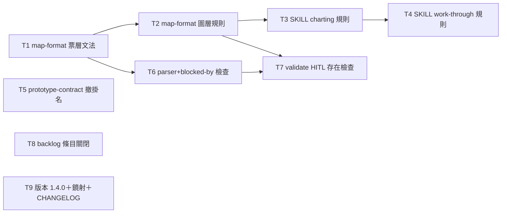

# Plan: decision-map protocol hardening

**Source brief**: docs/loom/specs/2026-08-29-decision-map-protocol-hardening.md
Goal: the decision-map skill text answers the eight dogfooded blanks and four additive mechanism guards back the judgment-critical ones, shipping loom-workflow 1.4.0 with schema_version 1 unchanged and every existing map still checker-valid unmodified
Stage: planning
Steps:
  1. 權威檔票層文法先落地＋三件獨立雜項（撤掛名、關 backlog、版本）
  2. 權威檔圖層規則＋parser 機制跟上
  3. charting 規則與 HITL 存在檢查
  4. work-through 規則收尾
**Total tasks**: 9
**Critical-path depth**: 4 (≤5 ✓)
**Execution order**: parallel-where-possible
**Plan-document-reviewer verdict**: PASS (2026-08-29, round 2)

## Task-flow diagram

## Open Questions

N/A — no unresolved question: scope, schema stance, and batch composition were ratified in-session 2026-08-29 (brief §Open Questions).

## Complexity assessment

- Added complexity: two new optional ticket-frontmatter fields (`blocked-by`, `ratification`), three new validate rules (dangling/cycle/HITL-presence), and six new prose duties in the skill text — all must be maintained with the schema.
- Why it is worthwhile: the first dogfood session showed every blank becomes a silent agent default; the two fields make the judgment-critical rules (selection, ratification) checkable instead of prose-only.
- Removed or avoided complexity: no status-vocabulary change, no supersession machinery, no frontier UI, no schema_version bump — old checkers keep working on new stores by construction.
- Downstream risk: validate tightening rejects any map/ticket missing its HITL line; the only pre-rule map was user-ratified in this branch, so the first exposure is the next repo adopting maps with a hand-rolled (non-map_init) MAP.md — the checker's exit-2 message must name the missing line plainly.

## Task 1 — map-format 票層文法（blocked-by／ratification／尺寸）

- **Description**: In `references/map-format.md` §Ticket schema, document three additive items: optional `blocked-by: <slug>[, <slug>...]` frontmatter (comma-separated ticket slugs; frontier = open ∧ all blockers closed ∧ unclaimed), optional `ratification: pending` field, and the ticket sizing rule.
  - Sizing rule: one ticket's question is sized to one agent session (loom's port of upstream's 100K-token rule).
  - Frontier definition lands beside `blocked-by` so the term used by SKILL.md's risk pass resolves here.
  - All three are additive: absent fields keep exactly today's meaning; no existing map file needs edits.
- **Module**: loom-workflow/skills/decision-map/references/map-format.md
- **Files touched**: loom-workflow/skills/decision-map/references/map-format.md
- **Context paths**:
  - /Users/kouko/.herdr/worktrees/monkey-skills/decision-map-protocol-hardening/loom-workflow/skills/decision-map/references/map-format.md
  - /Users/kouko/.herdr/worktrees/monkey-skills/decision-map-protocol-hardening/docs/loom/specs/2026-08-29-decision-map-protocol-hardening.md
- **Acceptance**:
  - **RED**: `grep -q "blocked-by" loom-workflow/skills/decision-map/references/map-format.md && grep -q "ratification" ... && grep -qi "sized to one" ...` — all three greps exit 1 today (none of the terms exists in the file).
  - **GREEN**: all three greps exit 0; the new text sits inside §Ticket schema; `python3` import of map_store still passes existing tests unchanged (no code touched).
- **Dependencies**: none
- **Independent**: true
- **Review-weight**: prose
- **Brief item covered**: BI-9
- **Status**: pending
- **Gloss**: 票之間的依賴、待批准狀態、票的大小上限從此有官方文法可查——後面所有機制與規則都指向這裡。

## Task 2 — map-format 圖層規則（Destination 批准行＋全加法憲法）

- **Description**: In `references/map-format.md`, document two additive items: (a) §Sections — MAP.md carries a destination ratification line (`user-ratified: <name/handle>, <date>`, same dated shape as ticket HITL) required from charting close onward; (b) §Schema versioning — the additive-only revision constitution.
  - Constitution text: mechanism revisions must be additive (new optional fields, checks tightened on new writes only) so an older checker never mis-rejects a newer store; rationale is measured cross-host version skew.
- **Module**: loom-workflow/skills/decision-map/references/map-format.md
- **Files touched**: loom-workflow/skills/decision-map/references/map-format.md
- **Context paths**:
  - /Users/kouko/.herdr/worktrees/monkey-skills/decision-map-protocol-hardening/loom-workflow/skills/decision-map/references/map-format.md
  - /Users/kouko/.herdr/worktrees/monkey-skills/decision-map-protocol-hardening/docs/loom/specs/2026-08-29-decision-map-protocol-hardening.md
- **Acceptance**:
  - **RED**: `grep -q "additive" loom-workflow/skills/decision-map/references/map-format.md` and a grep for a destination ratification line spec in §Sections both exit 1 today.
  - **GREEN**: both greps exit 0; the Destination-line spec names the exact `user-ratified: <name/handle>, <date>` shape; §Schema versioning carries the additive-only rule.
- **Dependencies**: Task 1 completes first
- **Seam**:
  - from Task 1: payload: none
- **Independent**: true
- **Review-weight**: prose
- **Brief item covered**: BI-11
- **Status**: pending
- **Gloss**: 整張圖的方向要有人簽名批准、未來所有機制修訂都必須「只加不破」——這兩條憲法從此寫死在 schema 權威檔。

## Task 3 — SKILL charting 規則（無霧即停＋Destination 批准義務）

- **Description**: In decision-map `SKILL.md` §Charting, add the no-fog STOP duty and the destination-ratification close duty.
  - No-fog STOP: when charting surfaces no fog entry, stop and ask the user instead of opening a map (a fully-specifiable effort needs no map).
  - Ratification duty: the charting close writes the destination ratification line per map-format §Sections before flipping state to active.
- **Module**: loom-workflow/skills/decision-map/SKILL.md
- **Files touched**: loom-workflow/skills/decision-map/SKILL.md
- **Context paths**:
  - /Users/kouko/.herdr/worktrees/monkey-skills/decision-map-protocol-hardening/loom-workflow/skills/decision-map/SKILL.md
  - /Users/kouko/.herdr/worktrees/monkey-skills/decision-map-protocol-hardening/loom-workflow/skills/decision-map/references/map-format.md
- **Acceptance**:
  - **RED**: greps on SKILL.md for a no-fog STOP clause and for a destination-ratification duty in §Charting both exit 1 today (§Charting currently closes on risk pass + validate only).
  - **GREEN**: both greps exit 0; the ratification duty points to map-format §Sections for the line grammar (point-not-copy); charting close order reads risk pass → ratification line → validate → state flip.
- **Dependencies**: Task 2 completes first
- **Seam**:
  - from Task 2: payload: none
- **Independent**: true
- **Review-weight**: prose
- **Brief item covered**: BI-5
- **Status**: pending
- **Gloss**: 沒有霧就不開圖、開圖的方向必須經你簽名——charting 的兩個把關從此明文。

## Task 4 — SKILL work-through 規則（選擇權／fog 時機／保留慣例／路由判準）

- **Description**: In decision-map `SKILL.md` §Work-through mode (and §Liveness assessment where selection applies), add four duties: map selection, ticket selection with recorded basis, mid-ticket fog timing, the measured-pending-ratification convention, and the store-routing criterion.
  - Map selection: the human names the map, or a recorded signal (e.g. worktree branch == ticket slug) stands in; with >1 live maps and no signal, ask — never infer from topic similarity.
  - Ticket selection: within a named map the agent picks (frontier-first once `blocked-by` exists) and records the selection basis in the ticket body at claim time.
  - Fog timing: surfaced questions are recorded as fog when surfaced, mid-ticket, not deferred to close (checker already permits).
  - Pending convention: a measured-but-deferred prototype ticket stays `claimed`, records a progress note in the body, may set `ratification: pending` per map-format.
  - Routing criterion: an unknown blocking THIS map's destination goes to its fog; one outliving every map goes to the backlog store; the agent routes silently but records the basis where it files.
- **Module**: loom-workflow/skills/decision-map/SKILL.md
- **Files touched**: loom-workflow/skills/decision-map/SKILL.md
- **Context paths**:
  - /Users/kouko/.herdr/worktrees/monkey-skills/decision-map-protocol-hardening/loom-workflow/skills/decision-map/SKILL.md
  - /Users/kouko/.herdr/worktrees/monkey-skills/decision-map-protocol-hardening/loom-workflow/skills/decision-map/references/map-format.md
  - /Users/kouko/.herdr/worktrees/monkey-skills/decision-map-protocol-hardening/docs/loom/backlog/2026-08-28-decision-map-ticket-selection-authority-unspecified.md
- **Acceptance**:
  - **RED**: greps on SKILL.md for a map-selection rule, a recorded selection basis, mid-ticket fog legality, `ratification: pending`, and a store-routing criterion all exit 1 today.
  - **GREEN**: all five greps exit 0; each rule names a verifiable action (who names, what gets recorded, where it is filed), never a judgment-only instruction; grammar details point to map-format rather than restating.
    - Portability: `grep -n "monkey-skills" loom-workflow/skills/decision-map/SKILL.md` exits 1 (0 hits today, 0 after) and `python3 loom-code/scripts/check_contract_citations.py` passes — the new prose assumes no monkey-skills-specific context (brief §Users, adopting repos).
- **Dependencies**: Task 3 completes first
- **Seam**:
  - from Task 3: payload: none
- **Independent**: false
- **Review-weight**: prose
- **Brief item covered**: BI-1
- **Status**: pending
- **Gloss**: 「誰選圖、誰選票、中途裁定記在哪、教訓歸哪個倉」四個 dogfood 撞過的洞在 work-through 章全部補上明文答案。

## Task 5 — prototype-contract 撤上游掛名

- **Description**: In `references/prototype-contract.md`, rewrite the prototype branch-fence rationale as loom's own doctrine.
  - Remove the upstream-wayfinder attribution sentence and its quote.
  - Keep the fence rule itself and its standalone rationale (a prose summary of a prototype loses the evidence that made it convincing).
- **Module**: loom-workflow/skills/decision-map/references/prototype-contract.md
- **Files touched**: loom-workflow/skills/decision-map/references/prototype-contract.md
- **Context paths**:
  - /Users/kouko/.herdr/worktrees/monkey-skills/decision-map-protocol-hardening/loom-workflow/skills/decision-map/references/prototype-contract.md
- **Acceptance**:
  - **RED**: `grep -q "upstream wayfinder" loom-workflow/skills/decision-map/references/prototype-contract.md` exits 0 today (the attribution exists).
  - **GREEN**: the grep exits 1; the never-merge fence rule and its rationale remain present; no other section changed.
- **Dependencies**: none
- **Independent**: true
- **Review-weight**: prose
- **Brief item covered**: BI-8
- **Status**: pending
- **Gloss**: 查證不到的上游出處撤下來，圍欄教義改掛 loom 自己的名——規則不變，出處誠實。

## Task 6 — map_store parser＋blocked-by 檢查

- **Description**: In `scripts/map_store.py`, parse the optional `blocked-by` and `ratification` ticket-frontmatter fields per map-format §Ticket schema, and extend `validate` with two additive blocked-by checks.
  - Check 1: every `blocked-by` slug names an existing ticket file in the same map (dangling → exit 2).
  - Check 2: the blocked-by graph is acyclic (cycle → exit 2).
  - Absent fields change nothing: a store with no `blocked-by`/`ratification` anywhere validates exactly as today.
- **Module**: loom-workflow/skills/decision-map/scripts/map_store.py
- **Files touched**: loom-workflow/skills/decision-map/scripts/map_store.py, loom-workflow/skills/decision-map/scripts/test_map_store.py
- **Context paths**:
  - /Users/kouko/.herdr/worktrees/monkey-skills/decision-map-protocol-hardening/loom-workflow/skills/decision-map/scripts/map_store.py
  - /Users/kouko/.herdr/worktrees/monkey-skills/decision-map-protocol-hardening/loom-workflow/skills/decision-map/scripts/test_map_store.py
  - /Users/kouko/.herdr/worktrees/monkey-skills/decision-map-protocol-hardening/loom-workflow/skills/decision-map/references/map-format.md
- **Acceptance**:
  - **RED**: `test_map_store.py::test_blocked_by_documented_grammar` — fails today because the parser ignores both fields and validate has no such checks.
    - Fixture assertions: a ticket with `blocked-by: a, b` and `ratification: pending` parses to those values; a dangling blocked-by and a two-ticket cycle each make `validate` exit 2.
  - **GREEN**: the new tests pass; every pre-existing test in `test_map_store.py` and the sibling `test_check_*.py` suites passes unchanged.
- **Dependencies**: Task 1 completes first
- **Seam**:
  - from Task 1: payload: the documented `blocked-by`/`ratification` field grammar; owner: Task 1; probe: `test_map_store.py::test_blocked_by_documented_grammar`
- **Independent**: true
- **Brief item covered**: BI-9
- **Status**: pending
- **Gloss**: 票的依賴鏈從文法變成可驗——寫錯（懸空、繞圈）的依賴在 validate 就被擋下，frontier 從此可機械計算。

## Task 7 — validate HITL 存在檢查

- **Description**: In `scripts/map_store.py`, extend `validate` with two additive, unconditional HITL presence checks; in `map_init.py`, stamp the destination-ratification line slot into scaffolded MAP.md.
  - Ticket check: a `closed` ticket of type `grilling` or `prototype` must contain a `user-ratified` line in its Resolution — missing → exit 2.
  - Map check: a map whose `state` is `active` or `clear` must carry the destination `user-ratified` line per map-format §Sections — missing → exit 2. No legacy branch: the one pre-rule map (family-relocation) was ratified in-branch by the user (kouko 2026-08-29), so the legacy population is empty.
  - User ruling 2026-08-29: missing required store content is filled by the user on the spot, never tolerated by a permanent legacy mechanism.
- **Module**: loom-workflow/skills/decision-map/scripts/map_store.py
- **Files touched**: loom-workflow/skills/decision-map/scripts/map_store.py, loom-workflow/skills/decision-map/scripts/test_map_store.py, loom-workflow/skills/decision-map/scripts/map_init.py
- **Context paths**:
  - /Users/kouko/.herdr/worktrees/monkey-skills/decision-map-protocol-hardening/loom-workflow/skills/decision-map/scripts/map_store.py
  - /Users/kouko/.herdr/worktrees/monkey-skills/decision-map-protocol-hardening/loom-workflow/skills/decision-map/scripts/map_init.py
  - /Users/kouko/.herdr/worktrees/monkey-skills/decision-map-protocol-hardening/docs/loom/maps/family-relocation/
- **Acceptance**:
  - **RED**: `test_map_store.py::test_validate_hitl_presence` — a fixture closed grilling ticket without a user-ratified line makes validate exit 2; a fresh map_init-scaffolded map ratified per the new rule validates 0. Fails today because validate never reads Resolution content.
  - **GREEN**: new tests pass; `map_store.py validate docs/loom/maps/family-relocation --repo-root .` exits 0 on the real map (its destination line was user-signed in this branch); all pre-existing tests pass unchanged.
- **Dependencies**: Tasks 2, 6 complete first
- **Seam**:
  - from Task 2: payload: none
  - from Task 6: payload: parsed ticket frontmatter plus validate's rule-walk structure; owner: Task 6; probe: `test_map_store.py::test_validate_hitl_presence`
- **Independent**: true
- **Brief item covered**: BI-10
- **Status**: pending
- **Gloss**: 「人批准過」從散文義務變成存在檢查——忘了簽的關票和沒批准的圖直接過不了 validate，既有的 family-relocation 圖保證不被誤殺。

## Task 8 — 關閉 ticket-selection backlog 條目

- **Description**: Close the ticket-selection backlog entry and regenerate the index.
  - Flip the entry's frontmatter `status:` to `closed`.
  - Append exactly this body line, verbatim: `Closed by the decision-map protocol-hardening arc (brief BI-1): SKILL.md §Work-through mode now assigns map selection to the human and ticket selection to the agent with a recorded basis.`
  - Run `python3 scripts/backlog_index.py --write`; commit the regenerated `docs/loom/BACKLOG.md` unmodified.
- **Module**: docs/loom/backlog/2026-08-28-decision-map-ticket-selection-authority-unspecified.md
- **Files touched**: docs/loom/backlog/2026-08-28-decision-map-ticket-selection-authority-unspecified.md, docs/loom/BACKLOG.md
- **Context paths**:
  - /Users/kouko/.herdr/worktrees/monkey-skills/decision-map-protocol-hardening/docs/loom/backlog/2026-08-28-decision-map-ticket-selection-authority-unspecified.md
  - /Users/kouko/.herdr/worktrees/monkey-skills/decision-map-protocol-hardening/docs/loom/backlog/README.md
- **Acceptance**:
  - **RED**: `python3 scripts/backlog_index.py --check` fails after the status flip alone (index stale) — and the entry's `status:` reads `open` today.
  - **GREEN**: entry reads `status: closed` with an evidence line; `backlog_index.py --validate` and `--check` both exit 0.
- **Dependencies**: none
- **Independent**: true
- **Review-weight**: mechanical
- **Brief item covered**: BI-13
- **Status**: pending
- **Gloss**: 上一輪 dogfood 立的「票選擇權」債，在規則落地的同一個 PR 裡關帳。

## Task 9 — 版本 1.4.0＋Codex 鏡射＋CHANGELOG

- **Description**: Bump loom-workflow to 1.4.0 and mirror it.
  - Set version 1.4.0 in loom-workflow's plugin.json (at its manifest location).
  - Run `python3 scripts/sync_codex_manifests.py` so the `.codex-plugin` mirror matches.
  - Add a 1.4.0 entry to `loom-workflow/CHANGELOG.md` summarizing the protocol-hardening changes.
- **Module**: loom-workflow/.claude-plugin/plugin.json
- **Files touched**: loom-workflow/.claude-plugin/plugin.json, loom-workflow/.codex-plugin/plugin.json, loom-workflow/CHANGELOG.md
- **Context paths**:
  - /Users/kouko/.herdr/worktrees/monkey-skills/decision-map-protocol-hardening/loom-workflow/CHANGELOG.md
  - /Users/kouko/.herdr/worktrees/monkey-skills/decision-map-protocol-hardening/scripts/sync_codex_manifests.py
- **Acceptance**:
  - **RED**: `scripts/test_sync_codex_manifests.py` drift check (or its CI equivalent `plugin version bump` job logic) flags loom-workflow as changed-without-bump once any sibling task's edit lands; version reads 1.3.0 today.
  - **GREEN**: both manifests read 1.4.0; the codex-manifest drift test passes; CHANGELOG carries a 1.4.0 entry naming the eight prose rules and four mechanism guards.
- **Dependencies**: none
- **Independent**: true
- **Brief item covered**: none — release administration: the bump delivers no brief outcome itself; marketplace publishing requires it.
- **Status**: pending
- **Gloss**: 版本不 bump，marketplace 更新就靜默 no-op——這是讓所有修訂真正到達裝置的行政步驟。

## Notes

- BI 次要覆蓋對照（欄位只記主 referent）：BI-2 → T3（義務）＋T7（存在檢查）；BI-3 → T1（欄位）＋T4（慣例）；BI-4／BI-7 → T4；BI-6 → T1；BI-14 → T5（同 BI-8 的刪除半）；BI-12 為傘狀項，由全計畫共同交付。
- 執行順序建議：T1、T5、T8、T9 可先行（L1 並行）；T2、T6 次之；T3、T7 第三層；T4 收尾。
- 收尾（finishing）時的補充驗證：對修訂後的 SKILL＋references 跑一次 cold-reader dogfood（fresh agent 只讀修訂文本，回答八個 blank 的情境題）——brief 成功判準的一部分，屬 finishing 階段而非本計畫任務。
- 本 repo CI：loom-workflow lane 觸發於 `loom-workflow/**`，per-directory pytest 會跑 `skills/decision-map/scripts/test_*.py`；plugin version bump job 由 T9 滿足。
