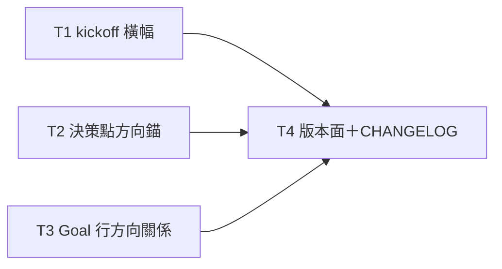

# Plan: direction surfacing

**Source brief**: docs/loom/specs/2026-08-29-direction-surfacing.md
Goal: 三條散文規則讓方向在 kickoff、決策點、進度卡三個時刻自動入眼，隨 loom-code 一次版本出貨 — serves PURPOSE: 強化 loom 自我修正流程的方向守衛
Stage: finishing
**Total tasks**: 4
**Critical-path depth**: 2 (≤5)
**Execution order**: parallel-where-possible
**Plan-document-reviewer verdict**: PASS (2026-08-29, round 2)

## Task-flow diagram

## Open Questions

N/A — no unresolved question: the brief closed both design forks (always-on vs change-aware; mandatory vs optional linkage) with cited research.

## Complexity assessment

- Added complexity: 三條散文義務（各一兩句）掛在既有契約面上；一個新的 Goal 行尾綴文法。
- Why it is worthwhile: 使用者明示的痛點（長弧決策時需要遠程＋近程目標入眼）；研究支持事件驅動曝光而非常駐注入。
- Removed or avoided complexity: 不建 change-aware 狀態機、不改任何腳本、不加 checker、否決每輪注入與強制連結（brief §Alternatives）。
- Downstream risk: Goal 行雙副本（plan-format.md 與 writing-plans SKILL.md 模板）若只改一份會漂移——T3 明文綁定兩份同改；橫幅若日後被使用者回報為雜訊，反轉條件已記錄於 brief；T2 不改 family-reception，岔路簡報靠「brief 之後必有 ask」的已引證鏈條取得錨——若未來出現無 ask 的岔路簡報形態，錨會漏，屆時走 canonical→sync 正路補（再觸發條件記於 Decision Log）。

## Task 1 — kickoff 方向橫幅
- **Description**: In `loom-code/skills/brainstorming/SKILL.md` Axis 0, add a **Direction banner** rule adjacent to the existing Backlog ready check and Live-map check — first line states the duty in plain terms, details routed to nested bullets per §Field-value grammar
  - The rule: when Axis 0 runs, print one line quoting `docs/loom/PURPOSE.md`'s `**Why:**` line verbatim, plus one line per live map pairing map-id with its Destination first line.
  - The map-side pair reuses what the Live-map check's liveness delegation already returns — cite `loom-workflow:decision-map` §Liveness assessment by name, do not restate its internals.
  - Absence behavior: no `docs/loom/PURPOSE.md` → print the loud line `direction banner: PURPOSE.md absent`; never a silent skip. No maps store or no live map → the existing Live-map N/A line already covers it; the banner adds nothing map-side.
  - Explicitly state: always-on, one line per item, no state kept, no new parsing (the `**Why:**` bold prefix is the anchor).
- **Module**: loom-code/skills/brainstorming
- **Files touched**: loom-code/skills/brainstorming/SKILL.md
- **Context paths**:
  - docs/loom/specs/2026-08-29-direction-surfacing.md
  - loom-code/scripts/templates/PURPOSE.md
- **Acceptance**:
  - **RED**: `grep -q 'Direction banner' loom-code/skills/brainstorming/SKILL.md` exits 1 today
  - **GREEN**: the grep exits 0; the rule names the verbatim-Why duty, the per-map Destination line, and the loud absence line, and reads as a duty adjacent to (not inside) the two existing checks; `python3 loom-code/scripts/check_contract_citations.py` stays clean (portability)
- **Review-weight**: prose
- **Dependencies**: none
- **Independent**: true
- **Brief item covered**: "BI-1 — Kickoff direction banner"
- **Status**: done(2a5170c9)
- **Gloss**: 開工時印一行 PURPOSE 的 Why＋每張活圖的 Destination——方向在弧的起點入眼

## Task 2 — 決策點方向錨
- **Description**: Extend the state-and-stakes anchor duty so mid-arc user-facing decision questions also carry direction — one definition, two pointers
  - Define ONCE in `loom-code/skills/subagent-driven-development/references/conditional-operations.md` §User-question delivery (the rendering SSOT): the anchor line additionally names three things in one sentence.
  - The three: the remote goal (PURPOSE Why, or the governing map's Destination when the plan carries a `Map part:` key), the near goal (the plan's `Goal:` line), and this decision's relation to them.
  - `loom-code/skills/subagent-driven-development/SKILL.md` gate ③'s anchor sentence (line 65 area) gains the words "including its direction anchor" pointing at that SSOT — pointer, not copy.
  - Scope guard: discovery-phase (brainstorming) questions are exempt — do NOT touch brainstorming's own anchor rule (SKILL.md:49).
  - Chain evidence (verified in-repo 2026-08-29): family-reception §Brief before a complex fork says "brief before you ask" (loom-code/hooks/family-reception.md:40-42); SDD gate ② fires it before `AskUserQuestion`.
  - Therefore every fork brief terminates in an ask rendered per the SSOT — the anchor reaches fork briefs without editing the sync copy.
- **Module**: loom-code ask-contract (scope label — one prose seam, two files below)
- **Files touched**: loom-code/skills/subagent-driven-development/references/conditional-operations.md, loom-code/skills/subagent-driven-development/SKILL.md
- **Context paths**:
  - docs/loom/specs/2026-08-29-direction-surfacing.md
- **Acceptance**:
  - **RED**: `grep -q 'direction anchor' loom-code/skills/subagent-driven-development/references/conditional-operations.md` exits 1 today
  - **GREEN**: the grep exits 0; only conditional-operations.md defines the duty, SKILL.md carries a one-sentence pointer; brainstorming SKILL.md and family-reception.md untouched; task summary restates the fork-brief chain evidence; `check_contract_citations.py` stays clean (portability)
- **Review-weight**: prose
- **Dependencies**: none
- **Independent**: true
- **Brief item covered**: "BI-2 — Decision-point direction anchor"
- **Status**: done(b244bfed)
- **Gloss**: 弧中每次停下來問你，問題第一行就帶遠程＋近程目標與本決策的關係——單一定義一個指標，不碰四副本同步檔

## Task 3 — Goal 行方向關係子句
- **Description**: Add the direction-relation clause to the plan `Goal:` grammar in BOTH template copies, written once at plan birth and frozen with the plan
  - Grammar: the Goal line ends with `— serves <PURPOSE | map <map-id>>: <short relation>` or the honest escape `— off-direction: <reason>`; required at plan birth, never edited afterward (rides the existing frozen-Goal rule).
  - Edit `loom-code/skills/writing-plans/references/plan-format.md` §`Goal:` (the line-33 template AND the §193-area field rule) as the schema SSOT.
  - Also edit the duplicated template block in `loom-code/skills/writing-plans/SKILL.md` (line-172 area) — both copies in this one task, per the brief's Boundary evidence.
  - State the payoff inline: `plan_card.py` prints `Goal:` verbatim, so every progress card inherits the clause with zero script change.
- **Module**: loom-code/skills/writing-plans
- **Files touched**: loom-code/skills/writing-plans/references/plan-format.md, loom-code/skills/writing-plans/SKILL.md
- **Context paths**:
  - docs/loom/specs/2026-08-29-direction-surfacing.md
- **Acceptance**:
  - **RED**: `grep -q 'off-direction' loom-code/skills/writing-plans/references/plan-format.md` exits 1 today
  - **GREEN**: the grep exits 0; both template copies show the identical clause grammar; the §Goal field rule names birth-time writing and the two closed forms (serves / off-direction); `python3 loom-code/scripts/check_contract_citations.py` stays clean (portability)
- **Review-weight**: prose
- **Dependencies**: none
- **Independent**: true
- **Brief item covered**: "BI-3 — Goal-line direction relation"
- **Status**: done(fec9b08f)
- **Gloss**: plan 出生時 Goal 行尾記一句「服務哪個方向」，之後每張進度卡免費帶著它

## Task 4 — 版本三表面＋CHANGELOG
- **Description**: Bump loom-code to 0.104.0 across its three release surfaces and write the CHANGELOG entry
  - `loom-code/.claude-plugin/plugin.json` version → 0.104.0; regenerate `loom-code/.codex-plugin/plugin.json` via `python3 scripts/sync_codex_manifests.py`; update the loom-code row in the root `README.md` plugin table.
  - `loom-code/CHANGELOG.md` gains a 0.104.0 entry describing the three duties — each semantic claim must agree with the layer that owns it (T1/T2/T3 shipped text), per the repo's changelog cross-read lesson.
  - Re-pin the tracked-byte fingerprint in `docs/loom/dogfood/2026-08-27-stage-specific-complexity-gates.md`: recompute the loom-code candidate SHA-256 via the pin test module's `_tracked_worktree_fingerprint`, AFTER every other T4 edit, same commit.
  - Rationale: repo memory "tracked-byte pins re-pin in the same commit as the bytes"; loom-design's fingerprint line is untouched this arc.
- **Module**: loom-code release surfaces (scope label — the version-bump surface set)
- **Files touched**: loom-code/.claude-plugin/plugin.json, loom-code/.codex-plugin/plugin.json, README.md, loom-code/CHANGELOG.md, docs/loom/dogfood/2026-08-27-stage-specific-complexity-gates.md
- **Context paths**:
  - loom-code/CHANGELOG.md
- **Acceptance**:
  - **RED**: `grep -q '0.104.0' loom-code/.claude-plugin/plugin.json` exits 1 today
  - **GREEN**: the grep exits 0 on both manifests, the README.md loom-code row, and CHANGELOG.md; the package suite passes INCLUDING the fingerprint pin test; changelog-cross-read: every CHANGELOG semantic claim agrees with the T1/T2/T3 file that owns it
- **Dependencies**: Tasks 1, 2, 3 complete first
- **Seam**:
  - from Task 1: payload: shipped banner rule sentence; owner: Task 1; probe: changelog-cross-read
  - from Task 2: payload: shipped anchor rule sentence; owner: Task 2; probe: changelog-cross-read
  - from Task 3: payload: shipped Goal-clause grammar; owner: Task 3; probe: changelog-cross-read
- **Independent**: false
- **Brief item covered**: none — pure release administration; serves all three BIs' shipping line but maps to no single BI (precedent: 2026-08-13 plan Task 9)
- **Status**: done(89bef581)
- **Gloss**: 版本號三表面同步＋CHANGELOG 如實轉述三條規則（不許再出現層間反轉）

## Notes

- 全弧僅動 loom-code；loom-workflow 不碰（liveness 契約現狀已足夠）。
- T1/T2/T3 檔案不相交且無語意依賴，可同波並行。

## Decision Log

- 2026-08-29 T2 縮窄：不改 family-reception.md（它是 canonical＋三 plugin 副本的同步檔，動它=多兩個 plugin 的版本 bump）。複雜岔路簡報最終仍經 SDD 的提問渲染路徑（鏈證：family-reception.md:40-42「brief before you ask」＋SDD 閘②「before AskUserQuestion」），方向錨照樣生效；若 dogfood 顯示岔路簡報漏錨，屆時再走 canonical→sync 正路補上。（低產品後果×低回退成本→記錄不上呈）
