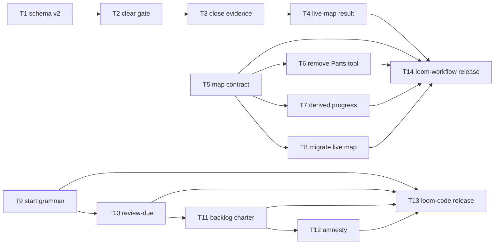

# Plan: Backlog ↔ decision-map boundary redesign v2

**Source brief**: docs/loom/specs/2026-08-30-backlog-map-boundary-v2.md
Goal: 讓 decision-map ticket 只承載 live purpose 下已承諾的決策工作，讓 backlog entry 只承載具啟動條件的機會型工作，並以單向 close-and-cite 完成兩者轉換 — serves PURPOSE: 讓 loom 的規劃與證據契約可以機械驗證且不保存重複狀態
Stage: verification
Steps:
  1. 建立兩側的新語法與契約
  2. 收緊 decision-map 驗證並移除 Parts
  3. 補上衍生查詢、老化查詢與 live map 遷移
  4. 清理既有 backlog 並同步發布表面
  5. 升級兩個 plugin 版本
**Total tasks**: 14
**Critical-path depth**: 5
**Execution order**: parallel-where-possible
**Plan-document-reviewer verdict**: PASS (2026-08-30, final execution review, 20/20)

## Task-flow diagram

## Open Questions

N/A — no unresolved question: D1–D14 已逐項批准，D12 的 rescue selection 是執行期明訂的人工作業停點而非待定設計。

## Complexity assessment

- Added complexity: schema v2 validation, a three-valued live-map result, one derived progress query, and one explicit backlog aging query become maintained interfaces.
- Why it is worthwhile: each interface removes an existing ambiguity that currently lets committed work, opportunistic work, or broken maps be interpreted as the wrong state.
- Removed or avoided complexity: delete the Parts table, write-back flipper, re-flip guard, relay convention, backward-compatibility lane, implicit clock reads, and standing bidirectional promotion links.
- Downstream risk: adopting repositories will fail immediately on old map schemas or open backlog entries without valid `start:` values; the version bump and actionable validator messages are the intended migration boundary.

## Task 1 — 建立 decision-map schema v2

- **Description**: Make schema version 2 the sole accepted decision-map shape and remove Parts from the parsed and required MAP.md structure.
- **Module**: `loom-workflow/skills/decision-map/scripts/map_store.py`
- **Files touched**: `loom-workflow/skills/decision-map/scripts/test_map_store.py`, `loom-workflow/skills/decision-map/scripts/map_store.py`
- **Context paths**:
  - `/Users/kouko/.herdr/worktrees/monkey-skills/relocation-family-hook/loom-workflow/skills/decision-map/references/map-format.md`
  - `/Users/kouko/.herdr/worktrees/monkey-skills/relocation-family-hook/docs/loom/specs/2026-08-30-backlog-map-boundary-v2.md`
- **Acceptance**:
  - **RED**: `loom-workflow/skills/decision-map/scripts/test_map_store.py::test_validate_requires_schema_v2_without_parts` fails because v1 is accepted and Parts is required today.
  - **GREEN**: The test passes; v1 returns schema exit 2 with migrate guidance, v2 validates without Parts, and the parser exposes no Parts state.
- **Dependencies**: none
- **Independent**: true
- **Brief item covered**: D1 and D3 — schema v2 is the only supported shape and the Parts section is removed.
- **Status**: done(a76485b9)
- **Gloss**: 地圖只剩一套可讀語意，並停止保存第二份交付進度。

## Task 2 — 阻止未完成 ticket 的 map 清場

- **Description**: Reject `state: clear` whenever any ticket remains open or claimed, or any fog entry remains.
- **Module**: `loom-workflow/skills/decision-map/scripts/map_store.py`
- **Files touched**: `loom-workflow/skills/decision-map/scripts/test_map_store.py`, `loom-workflow/skills/decision-map/scripts/map_store.py`
- **Context paths**:
  - `/Users/kouko/.herdr/worktrees/monkey-skills/relocation-family-hook/loom-workflow/skills/decision-map/references/map-format.md`
- **Acceptance**:
  - **RED**: `loom-workflow/skills/decision-map/scripts/test_map_store.py::test_clear_rejects_non_closed_tickets_and_fog` fails because `validate` does not enforce the clear condition today.
  - **GREEN**: The test passes for open, claimed, and fog cases while a map with only closed tickets and empty fog validates.
- **Dependencies**: Task 1 completes first
- **Seam**:
  - from Task 1: payload: none
- **Independent**: false
- **Brief item covered**: D4 — clear means zero non-closed tickets and empty fog.
- **Status**: done(ccb13424)
- **Gloss**: `clear` 重新成為可相信的完成訊號，而不是人工填寫的樂觀標籤。

## Task 3 — 強制 closed task 留下交付證據

- **Description**: Reject a closed task ticket unless its Resolution is non-empty and names a commit SHA, PR, or artifact path as delivery evidence.
- **Module**: `loom-workflow/skills/decision-map/scripts/map_store.py`
- **Files touched**: `loom-workflow/skills/decision-map/scripts/test_map_store.py`, `loom-workflow/skills/decision-map/scripts/map_store.py`
- **Context paths**:
  - `/Users/kouko/.herdr/worktrees/monkey-skills/relocation-family-hook/loom-workflow/skills/decision-map/references/map-format.md`
- **Acceptance**:
  - **RED**: `loom-workflow/skills/decision-map/scripts/test_map_store.py::test_closed_task_requires_resolution_and_delivery_evidence` fails because empty or unevidenced task resolutions validate today.
  - **GREEN**: The test passes for each rejected shape and accepts commit, PR, and artifact-path evidence fixtures.
- **Dependencies**: Task 2 completes first
- **Seam**:
  - from Task 2: payload: none
- **Independent**: false
- **Brief item covered**: D5 — every closed task carries a non-empty Resolution and delivery evidence.
- **Status**: done(7bcc89ac)
- **Gloss**: 每張已關閉 task 都能指出實際產物，避免文件結案卻沒有交付。

## Task 4 — 讓壞掉的 live map 明確拒絕

- **Description**: Replace the boolean live-map helper with an explicit live, not-present, or broken result and make consumers refuse broken maps.
- **Module**: `loom-workflow/skills/decision-map/scripts/map_store.py`
- **Files touched**: `loom-workflow/skills/decision-map/scripts/test_map_store.py`, `loom-workflow/skills/decision-map/scripts/map_store.py`
- **Context paths**:
  - `/Users/kouko/.herdr/worktrees/monkey-skills/relocation-family-hook/loom-workflow/skills/decision-map/scripts/test_check_map_links.py`
  - `/Users/kouko/.herdr/worktrees/monkey-skills/relocation-family-hook/loom-workflow/skills/decision-map/scripts/test_check_map_fog.py`
- **Acceptance**:
  - **RED**: `loom-workflow/skills/decision-map/scripts/test_map_store.py::test_live_map_result_distinguishes_broken_from_not_present` fails because invalid maps collapse to boolean false today.
  - **GREEN**: The test and consumer suites pass; a malformed map is reported as broken and never treated as absent.
- **Dependencies**: Task 3 completes first
- **Seam**:
  - from Task 3: payload: none
- **Independent**: false
- **Brief item covered**: D6 — live-map detection is three-valued and fail-closed.
- **Status**: done(f4089e43)
- **Gloss**: 壞地圖不再被誤認為沒有地圖，消費端會要求先修復資料。

## Task 5 — 重寫 decision-map 邊界契約

- **Description**: Define task tickets as decision-unblocking work, single-source clear rules, promotion ownership, umbrella checks, evidence, and schema v2 while removing Parts and relay language.
- **Module**: `loom-workflow/skills/decision-map`
- **Files touched**: `loom-workflow/skills/decision-map/references/map-format.md`, `loom-workflow/skills/decision-map/SKILL.md`, `loom-workflow/skills/decision-map/scripts/test_skill_doc.py`
- **Context paths**:
  - `/Users/kouko/.herdr/worktrees/monkey-skills/relocation-family-hook/docs/loom/specs/2026-08-30-backlog-map-boundary-v2.md`
  - `/Users/kouko/.herdr/worktrees/monkey-skills/relocation-family-hook/loom-workflow/skills/decision-map/references/prototype-contract.md`
- **Acceptance**:
  - **RED**: `loom-workflow/skills/decision-map/scripts/test_skill_doc.py::test_v2_contract_rejects_relay_and_parts_language` fails because the skill still mandates backlog relay and Parts write-back.
  - **GREEN**: The contract test passes and pins D2–D9 at one SSOT with SKILL.md references rather than duplicated definitions.
    - Run a verbatim grep diagnostic that rejects the retired relay and Parts write-back phrases outside their single definition point.
    - Reviewer judgment: no paraphrase reproduction of clear, promotion, ownership, or evidence rules appears outside the map-format SSOT.
- **Dependencies**: none
- **Independent**: true
- **Brief item covered**: D2–D9 — relay ban, Parts removal, clear/evidence rules, fail-closed handling, four umbrella checks, unique ownership, and close-and-cite promotion.
- **Status**: done(9df27d60)
- **Gloss**: 使用者能從契約直接判斷工作屬於 map 或 backlog，不再靠兩套互相轉送的說法。

## Task 6 — 移除 Parts write-back 工具

- **Description**: Delete the Parts flipper and its tests, then remove every live command-surface and skill reference to that retired write path.
- **Module**: `loom-workflow/skills/decision-map/scripts/map_parts.py`
- **Files touched**: `loom-workflow/skills/decision-map/scripts/map_parts.py`, `loom-workflow/skills/decision-map/scripts/test_map_parts.py`, `loom-workflow/skills/decision-map/scripts/test_skill_doc.py`, `loom-code/skills/finishing-a-development-branch/SKILL.md`, `AGENTS.md`
- **Context paths**:
  - `/Users/kouko/.herdr/worktrees/monkey-skills/relocation-family-hook/loom-workflow/skills/decision-map/references/map-format.md`
- **Acceptance**:
  - **RED**: `loom-workflow/skills/decision-map/scripts/test_skill_doc.py::test_no_live_contract_or_command_surface_references_map_parts` fails while the script, test, and command references exist.
  - **GREEN**: The diagnostic passes, the retired files are absent, and the decision-map package suite has no import or path reference to `map_parts.py`.
- **Dependencies**: Task 5 completes first
- **Seam**:
  - from Task 5: payload: none
- **Independent**: false
- **Brief item covered**: D3 — delete `map_parts.py`, the flip protocol, and re-flip guard.
- **Status**: done(4802665b)
- **Gloss**: 完成狀態不再回寫 MAP.md，整條同步機制可直接刪除。

## Task 7 — 提供唯讀 map delivery progress 查詢

- **Description**: Add a read-only CLI that derives map-part delivery progress from plan `Map part:` Notes bindings and plan ledger state without writing MAP.md.
- **Module**: `loom-workflow/skills/decision-map/scripts/map_progress.py`
- **Files touched**: `loom-workflow/skills/decision-map/scripts/map_progress.py`, `loom-workflow/skills/decision-map/scripts/test_map_progress.py`, `loom-workflow/skills/decision-map/references/map-format.md`, `loom-workflow/skills/decision-map/SKILL.md`
- **Context paths**:
  - `/Users/kouko/.herdr/worktrees/monkey-skills/relocation-family-hook/loom-code/scripts/plan_card.py`
  - `/Users/kouko/.herdr/worktrees/monkey-skills/relocation-family-hook/docs/loom/plans`
- **Acceptance**:
  - **RED**: `loom-workflow/skills/decision-map/scripts/test_map_progress.py::test_map_progress_derives_bound_plan_state_without_writing_map` fails because no derived query exists.
  - **GREEN**: The named test passes, the command is declared in the decision-map `map-format.md` and `SKILL.md` SSOTs, and a successful invocation leaves MAP.md byte-identical.
- **Dependencies**: Task 5 completes first
- **Seam**:
  - from Task 5: payload: none
- **Independent**: false
- **Brief item covered**: D3 — delivery progress is derived read-only from plan bindings and state.
- **Status**: done(291ff16b)
- **Gloss**: 仍然能查看 map 交付進度，但真相只保留在 plan ledger 與 Git。

## Task 8 — 遷移 family-relocation live map

- **Description**: Migrate the sole live map to schema v2, remove its empty Parts section, and preserve its complete current fog section unchanged.
- **Module**: `docs/loom/maps/family-relocation`
- **Files touched**: `docs/loom/maps/family-relocation/MAP.md`
- **Context paths**:
  - `/Users/kouko/.herdr/worktrees/monkey-skills/relocation-family-hook/loom-workflow/skills/decision-map/references/map-format.md`
  - `/Users/kouko/.herdr/worktrees/monkey-skills/relocation-family-hook/docs/loom/maps/family-relocation/tickets/task-inventory-consumers.md`
- **Acceptance**:
  - **RED**: `map_store.py validate docs/loom/maps/family-relocation` fails under the schema-v2 contract before migration.
  - **GREEN**: The same command exits 0 after migration and a diff confirms the complete pre-migration fog section is byte-identical.
- **Dependencies**: Task 5 completes first
- **Seam**:
  - from Task 5: payload: none
- **Independent**: true
- **Review-weight**: prose
- **Brief item covered**: D1 and Out of scope — migrate the one live map without touching its relocation fog.
- **Status**: done(624a4f55)
- **Gloss**: 現有 family-relocation 地圖能在新契約下繼續工作，搬遷問題本身保持原樣。

## Task 9 — 強制 backlog start 封閉文法

- **Description**: Require every live open-status backlog entry to use either `start: date — YYYY-MM-DD` or `start: event — <non-empty observable condition>`.
- **Module**: `loom-code/scripts/backlog_index.py`
- **Files touched**: `loom-code/scripts/test_backlog_index.py`, `loom-code/scripts/backlog_index.py`
- **Context paths**:
  - `/Users/kouko/.herdr/worktrees/monkey-skills/relocation-family-hook/docs/loom/backlog/README.md`
- **Acceptance**:
  - **RED**: `loom-code/scripts/test_backlog_index.py::test_validate_enforces_closed_start_grammar_on_live_open_status` fails because free-form or absent `start:` values validate today.
  - **GREEN**: The test passes for both accepted prefixes and rejects absence, `now`, malformed dates, and empty event conditions without a compatibility branch.
- **Dependencies**: none
- **Independent**: true
- **Brief item covered**: D10 and D13 — two-prefix start grammar with unconditional enforcement and no backward compatibility.
- **Status**: done(809f68b7)
- **Gloss**: 每筆仍活著的機會型工作都有機械可讀的開始條件。

## Task 10 — 新增九十天 review-due 查詢

- **Description**: Add `--review-due --as-of YYYY-MM-DD` to list live entries aged at least 90 days from their immutable filename date without introducing clock reads into validation.
- **Module**: `loom-code/scripts/backlog_index.py`
- **Files touched**: `loom-code/scripts/test_backlog_index.py`, `loom-code/scripts/backlog_index.py`
- **Context paths**:
  - `/Users/kouko/.herdr/worktrees/monkey-skills/relocation-family-hook/loom-code/scripts/backlog_index.py`
- **Acceptance**:
  - **RED**: `loom-code/scripts/test_backlog_index.py::test_review_due_uses_filename_age_and_explicit_as_of_only` fails because the command does not exist.
  - **GREEN**: The test passes at the 89/90-day boundary, invalid `--as-of` fails clearly, `--validate` remains clock-free, and the command is exposed by the CLI `--help` surface; Task 11 documents it in the backlog charter.
- **Dependencies**: Task 9 completes first
- **Seam**:
  - from Task 9: payload: none
- **Independent**: false
- **Brief item covered**: D11 — mechanical 90-day review using an explicit as-of date and immutable filename dates.
- **Status**: done(138ed33e)
- **Gloss**: backlog 取得固定的複查出口，但驗證結果不會因今天日期而漂移。

## Task 11 — 同步 backlog charter 與 close-out 契約

- **Description**: Document the two-prefix trigger grammar, aging, superseding, promotion, umbrella checks, amnesty posture, and finishing checkpoint in both shipped and repository queue contracts.
- **Module**: `loom-code queue contract surfaces`
- **Files touched**: `loom-code/scripts/templates/backlog-README.md`, `docs/loom/backlog/README.md`, `loom-code/skills/finishing-a-development-branch/SKILL.md`, `loom-code/scripts/test_backlog_index.py`, `loom-code/scripts/test_finishing_backlog_close.py`
- **Context paths**:
  - `/Users/kouko/.herdr/worktrees/monkey-skills/relocation-family-hook/docs/loom/specs/2026-08-30-backlog-map-boundary-v2.md`
- **Acceptance**:
  - **RED**: `loom-code/scripts/test_backlog_index.py::test_backlog_v2_contract_surfaces_are_synchronized` fails because current charters describe optional free-form starts and blocked ready entries.
  - **GREEN**: The contract and finishing tests pass, including the close-out checkpoint, close-and-cite promotion rule, and D15's ban on describing the live-store composition ratio as a close rate.
- **Dependencies**: Task 10 completes first
- **Seam**:
  - from Task 10: payload: none
- **Independent**: false
- **Brief item covered**: D7, D9, D11, D14, and D15 — umbrella checks, promotion, aging checkpoint, charter-template sync, and correct measurement terminology.
- **Status**: done(a0960f8b)
- **Gloss**: 新 repo 與本 repo 讀到同一套 queue 規則，close-out 也會提醒複查老化項目。

## Task 12 — 執行既有 backlog amnesty

- **Description**: Produce the one-page rescue list, halt for the user selection, close every unrescued live open-status entry with the ratified reason, and rewrite rescued entries to v2 start grammar.
- **Module**: `docs/loom/backlog`
- **Files touched**: `docs/loom/backlog/*.md`, `docs/loom/BACKLOG.md`
- **Context paths**:
  - `/Users/kouko/.herdr/worktrees/monkey-skills/relocation-family-hook/docs/loom/backlog/README.md`
  - `/Users/kouko/.herdr/worktrees/monkey-skills/relocation-family-hook/loom-code/scripts/backlog_index.py`
- **Acceptance**:
  - **RED**: `backlog_index.py --validate` fails after Task 9 because existing live open-status entries do not all satisfy v2 start grammar.
  - **GREEN**: After the sanctioned rescue decision, `--validate` exits 0, every unrescued entry is closed with the exact amnesty reason, every rescued entry has valid v2 `start:`, and the regenerated index is current.
- **Dependencies**: Task 11 completes first
- **Seam**:
  - from Task 11: payload: none
- **Independent**: false
- **Brief item covered**: D12 — list all 134 open-status entries, rescue only user-selected entries, and bulk-close the rest without a manifest.
- **Status**: done(dc110708)
- **Gloss**: 歷史 backlog 不再阻擋新閘門；只有你明確救援的項目會留下。

## Task 13 — 發布 loom-code queue 契約版本

- **Description**: Bump loom-code from 0.104.0 to 0.105.0 for the breaking queue-contract change, add the changelog entry, and synchronize the Codex manifest from the Claude SSOT.
- **Module**: `loom-code plugin release metadata`
- **Files touched**: `loom-code/.claude-plugin/plugin.json`, `loom-code/.codex-plugin/plugin.json`, `loom-code/CHANGELOG.md`, `loom-code/scripts/test_docs_review_blocking_class.py`
- **Context paths**:
  - `/Users/kouko/.herdr/worktrees/monkey-skills/relocation-family-hook/scripts/sync_codex_manifests.py`
- **Acceptance**:
  - **RED**: `check_version_bump.py` and the shipping-version pin fail while skill content changed at version 0.104.0.
  - **GREEN**: Version and changelog tests pass and `python3 scripts/sync_codex_manifests.py --check loom-code` exits 0.
- **Dependencies**: Tasks 9, 10, 11, 12 parallel
- **Seam**:
  - from Task 9: payload: none
  - from Task 10: payload: none
  - from Task 11: payload: none
  - from Task 12: payload: none
- **Independent**: false
- **Brief item covered**: Versioning — bump loom-code and synchronize its Codex manifest.
- **Status**: done(4ccd580d)
- **Gloss**: marketplace 能辨識這次 breaking queue 契約，不會把新內容藏在舊版本號下。

## Task 14 — 發布 loom-workflow decision-map v2

- **Description**: Bump loom-workflow from 1.4.0 to 2.0.0 for the breaking decision-map schema, add the changelog entry, and synchronize the Codex manifest from the Claude SSOT.
- **Module**: `loom-workflow plugin release metadata`
- **Files touched**: `loom-workflow/.claude-plugin/plugin.json`, `loom-workflow/.codex-plugin/plugin.json`, `loom-workflow/CHANGELOG.md`, `loom-workflow/docs/skill-governance.md`
- **Context paths**:
  - `/Users/kouko/.herdr/worktrees/monkey-skills/relocation-family-hook/scripts/sync_codex_manifests.py`
- **Acceptance**:
  - **RED**: `check_version_bump.py` fails while decision-map skill content changed at version 1.4.0.
  - **GREEN**: Version metadata and changelog are current and `python3 scripts/sync_codex_manifests.py --check loom-workflow` exits 0.
- **Dependencies**: Tasks 4, 5, 6, 7, 8 parallel
- **Seam**:
  - from Task 4: payload: none
  - from Task 5: payload: none
  - from Task 6: payload: none
  - from Task 7: payload: none
  - from Task 8: payload: none
- **Independent**: false
- **Brief item covered**: Versioning — bump loom-workflow and synchronize its Codex manifest.
- **Status**: done(287c62fd)
- **Gloss**: decision-map v2 以明確版本發布，安裝端不會把破壞性 schema 改動誤當成舊版。

## Notes

- Post-rebase current-state refresh: origin/main advanced six commits before SDD, so the plan was returned to PENDING and re-grounded before execution.
- Kickoff decision: release versions → loom-code 0.105.0 under the repository's pre-1.0 minor-breaking convention; loom-workflow 2.0.0 under its declared Semantic Versioning contract.
- D12 is the only sanctioned execution-time user halt. Generate the rescue list before editing any backlog entry.
- D12 rescue decision: empty set — the user selected `全部不保留`; all 134 live open entries closed with the ratified amnesty reason.
- Task 8 must preserve the current uncommitted claim in `task-inventory-consumers.md`; that file is context-only for the migration task.
- No task may alter any family-relocation fog entry or physically relocate the queue layer.
