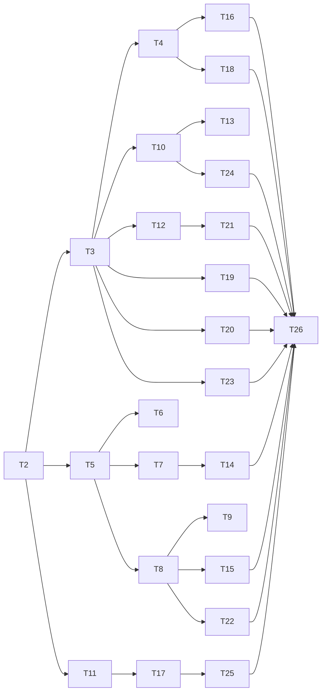

# Plan: Outcome Map v3

**Source brief**: docs/loom/outcome-map-v3
Goal: ship the full Outcome Map v3 mechanism so one Map controls many outcome-advancing delivery arcs without duplicating their progress — serves map family-relocation: turns its mixed task/prototype records into closure-exclusive tickets and canonical delivery arcs
Stage: batch E public surface implementation
**Total tasks**: 26
**Critical-path depth**: 5 (≤5 ✓)
**Execution order**: sequential
**Plan-document-reviewer verdict**: PASS (2026-08-30 11:04 CST)

## Task-flow diagram

## Open Questions

N/A — no unresolved question: the validated change-folder freezes types, lifecycle, closure policies, migration, and transaction boundaries.

## Complexity assessment

- Added complexity: schema v3 adds Destination acceptance, withdrawn disposition, reciprocal delivery binding, closure-policy evaluation, migration, and recoverable topology operations.
- Why it is worthwhile: each moving part protects a distinct failure shown by the case corpus or critic panel and is required for a long-lived multi-delivery control loop.
- Removed or avoided complexity: generic task and feasibility-prototype overlap disappear; free-text Map part binding and writable progress copies are removed; no map-to-task skill or fifth type is added.
- Downstream risk: transaction recovery and live external evidence introduce operational duties; tests isolate them behind stdlib modules and fail-closed states.

## Task 1 — Pin the long-term Outcome Map mental model

- **Description**: Implement pin the long-term outcome map mental model at the named module boundary, preserving existing behavior outside schema-v3 inputs.
- **Module**: `decision-map public contract`
- **Files touched**: `loom-workflow/skills/decision-map/SKILL.md`, `loom-workflow/skills/decision-map/references/map-format.md`, `loom-workflow/skills/decision-map/scripts/test_skill_doc.py`
- **Context paths**:
  - `/Users/kouko/GitHub/monkey-skills/docs/loom/outcome-map-v3/specs/outcome-map/spec.md`
  - `/Users/kouko/GitHub/monkey-skills/loom-workflow/skills/decision-map/SKILL.md`
- **Acceptance**:
  - **RED**: `loom-workflow/skills/decision-map/scripts/test_skill_doc.py::test_v3_contract_defines_multi_delivery_outcome_loop` fails before implementation.
  - **GREEN**: The public contract defines one long-term Map with multiple delivery arcs and forbids delivery-close from clearing the Map.
- **Dependencies**: none
- **Independent**: false
- **Brief item covered**: `REQ-75`
- **Status**: done(3cecd84d8de777f20e156b05959ae4ec122e3ebf)
- **Gloss**: 地圖成為跨多次交付的長期控制迴圈，而不是一張大實作單。

## Task 2 — Adopt schema v3 and four closure-exclusive types

- **Description**: Implement adopt schema v3 and four closure-exclusive types at the named module boundary, preserving existing behavior outside schema-v3 inputs.
- **Module**: `map_store.py schema core`
- **Files touched**: `loom-workflow/skills/decision-map/scripts/map_store.py`, `loom-workflow/skills/decision-map/scripts/test_map_store.py`
- **Context paths**:
  - `/Users/kouko/GitHub/monkey-skills/docs/loom/outcome-map-v3/specs/outcome-map/spec.md`
  - `/Users/kouko/GitHub/monkey-skills/loom-workflow/skills/decision-map/scripts/map_store.py`
- **Acceptance**:
  - **RED**: `loom-workflow/skills/decision-map/scripts/test_map_store.py::test_v3_accepts_only_four_closure_exclusive_ticket_types` fails before implementation.
  - **GREEN**: Schema v3 accepts grilling, research, prototype, and delivery; task and unblock fail with classification guidance.
- **Dependencies**: none
- **Independent**: false
- **Brief item covered**: `REQ-76`
- **Status**: done(32de9424cacda4d5805a94ca533ef6f079208a62)
- **Gloss**: 每張 ticket 依關閉證據歸入唯一類型。

## Task 3 — Add withdrawn terminal lifecycle

- **Description**: Implement add withdrawn terminal lifecycle at the named module boundary, preserving existing behavior outside schema-v3 inputs.
- **Module**: `map_store.py ticket lifecycle`
- **Files touched**: `loom-workflow/skills/decision-map/scripts/map_store.py`, `loom-workflow/skills/decision-map/scripts/test_map_store.py`
- **Context paths**:
  - `/Users/kouko/GitHub/monkey-skills/docs/loom/outcome-map-v3/specs/outcome-map/spec.md`
  - `/Users/kouko/GitHub/monkey-skills/loom-workflow/skills/decision-map/scripts/map_store.py`
- **Acceptance**:
  - **RED**: `loom-workflow/skills/decision-map/scripts/test_map_store.py::test_v3_ticket_statuses_and_withdrawal_contract` fails before implementation.
  - **GREEN**: Open and claimed tickets may become ratified withdrawn; closed and withdrawn are terminal while delivery phases remain derived.
- **Dependencies**: Task 2 completes first
- **Seam**:
  - from Task 2: payload: none
- **Independent**: false
- **Brief item covered**: `REQ-77`
- **Status**: done(f0ad65cab24bb6bbc5a6407e9e102642b59d953a)
- **Gloss**: 不再需要的工作能誠實退出，不會假裝已完成。

## Task 4 — Gate Map clear on Destination acceptance

- **Description**: Implement gate map clear on destination acceptance at the named module boundary, preserving existing behavior outside schema-v3 inputs.
- **Module**: `map_store.py clear validation`
- **Files touched**: `loom-workflow/skills/decision-map/scripts/map_store.py`, `loom-workflow/skills/decision-map/scripts/test_map_store.py`
- **Context paths**:
  - `/Users/kouko/GitHub/monkey-skills/docs/loom/outcome-map-v3/specs/outcome-map/spec.md`
  - `/Users/kouko/GitHub/monkey-skills/loom-workflow/skills/decision-map/scripts/map_store.py`
- **Acceptance**:
  - **RED**: `loom-workflow/skills/decision-map/scripts/test_map_store.py::test_clear_requires_terminal_tickets_empty_fog_and_satisfied_da` fails before implementation.
  - **GREEN**: Clear validates only with empty fog, terminal tickets, and evidence-valid DA criteria.
- **Dependencies**: Task 3 completes first
- **Seam**:
  - from Task 3: payload: none
- **Independent**: false
- **Brief item covered**: `REQ-78`
- **Status**: done(9ad0552a3c4d29f7acb444d76d526bbc49990065)
- **Gloss**: 清空工作清單不再被誤認為達成長期成果。

## Task 5 — Validate reciprocal delivery bindings

- **Description**: Implement validate reciprocal delivery bindings at the named module boundary, preserving existing behavior outside schema-v3 inputs.
- **Module**: `delivery_binding.py`
- **Files touched**: `loom-workflow/skills/decision-map/scripts/delivery_binding.py`, `loom-workflow/skills/decision-map/scripts/test_delivery_binding.py`, `loom-workflow/skills/decision-map/scripts/start_delivery.py`, `loom-workflow/skills/decision-map/scripts/test_map_progress.py`, `loom-workflow/skills/decision-map/scripts/test_map_store.py`
- **Context paths**:
  - `/Users/kouko/GitHub/monkey-skills/docs/loom/outcome-map-v3/specs/outcome-map/spec.md`
  - `/Users/kouko/GitHub/monkey-skills/loom-workflow/skills/decision-map/scripts/delivery_binding.py`
- **Acceptance**:
  - **RED**: `loom-workflow/skills/decision-map/scripts/test_delivery_binding.py::test_reciprocal_ticket_brief_binding_is_canonical_and_contained` fails before implementation.
  - **GREEN**: Exactly one normalized repo-relative reciprocal Ticket-to-Brief binding validates; unsafe or non-delivery bindings fail without writes.
- **Dependencies**: Task 2 completes first
- **Seam**:
  - from Task 2: payload: none
- **Independent**: false
- **Brief item covered**: `REQ-79`
- **Status**: done(f50b4ecfa3a2f487d5b4cf1a82bd39cd2751c775)
- **Gloss**: delivery 與 Brief 有穩定且可驗證的雙向關係。

## Task 6 — Implement Start delivery

- **Description**: Implement implement start delivery at the named module boundary, preserving existing behavior outside schema-v3 inputs.
- **Module**: `start_delivery.py`
- **Files touched**: `loom-workflow/skills/decision-map/scripts/start_delivery.py`, `loom-workflow/skills/decision-map/scripts/test_start_delivery.py`
- **Context paths**:
  - `/Users/kouko/GitHub/monkey-skills/docs/loom/outcome-map-v3/specs/outcome-map/spec.md`
  - `/Users/kouko/GitHub/monkey-skills/loom-workflow/skills/decision-map/scripts/start_delivery.py`
- **Acceptance**:
  - **RED**: `loom-workflow/skills/decision-map/scripts/test_start_delivery.py::test_start_delivery_creates_reciprocal_binding_idempotently` fails before implementation.
  - **GREEN**: A claimed unbriefed delivery gains one Brief and reciprocal pointers; retries do not create another Brief.
- **Dependencies**: Task 5 completes first
- **Seam**:
  - from Task 5: payload: none
- **Independent**: false
- **Brief item covered**: `REQ-80`
- **Status**: done(fa68511d3a59a2ba122be32bcb9bc3d7dee9a575)
- **Gloss**: ready 的 outcome slice 可以直接進入 Brief，而不需要 map-to-task。

## Task 7 — Resolve read-only delivery progress

- **Description**: Implement resolve read-only delivery progress at the named module boundary, preserving existing behavior outside schema-v3 inputs.
- **Module**: `map_progress.py`
- **Files touched**: `loom-workflow/skills/decision-map/scripts/map_progress.py`, `loom-workflow/skills/decision-map/scripts/test_map_progress.py`
- **Context paths**:
  - `/Users/kouko/GitHub/monkey-skills/docs/loom/outcome-map-v3/specs/outcome-map/spec.md`
  - `/Users/kouko/GitHub/monkey-skills/loom-workflow/skills/decision-map/scripts/map_progress.py`
- **Acceptance**:
  - **RED**: `loom-workflow/skills/decision-map/scripts/test_map_progress.py::test_progress_resolves_ticket_brief_plan_without_writes` fails before implementation.
  - **GREEN**: Progress resolves Ticket to Brief to the sole Plan, reports its phase, refuses multiple Plans, and leaves all sources byte-identical.
- **Dependencies**: Task 5 completes first
- **Seam**:
  - from Task 5: payload: none
- **Independent**: false
- **Brief item covered**: `REQ-81`
- **Status**: done(7bbe6316bd3e901612cb9e8e8dc9de04c5b1e003)
- **Gloss**: Map 能看見 delivery 在哪裡，但不複製它的進度。

## Task 8 — Evaluate current delivery closure evidence

- **Description**: Implement evaluate current delivery closure evidence at the named module boundary, preserving existing behavior outside schema-v3 inputs.
- **Module**: `delivery_evidence.py`
- **Files touched**: `loom-workflow/skills/decision-map/scripts/delivery_evidence.py`, `loom-workflow/skills/decision-map/scripts/test_delivery_evidence.py`
- **Context paths**:
  - `/Users/kouko/GitHub/monkey-skills/docs/loom/outcome-map-v3/specs/outcome-map/spec.md`
  - `/Users/kouko/GitHub/monkey-skills/loom-workflow/skills/decision-map/scripts/delivery_evidence.py`
- **External surfaces**:
  - CLI flag: `gh pr view --json headRefOid,state,statusCheckRollup,mergedAt` — grounding: In-repo evidence `loom-code/scripts/post_pr_ci.py`
- **Acceptance**:
  - **RED**: `loom-workflow/skills/decision-map/scripts/test_delivery_evidence.py::test_delivery_closure_requires_current_policy_evidence` fails before implementation.
  - **GREEN**: Closure readiness requires the Brief policy, acceptance, review, verification, and current exact-head evidence.
- **Dependencies**: Task 5 completes first
- **Seam**:
  - from Task 5: payload: none
- **Independent**: false
- **Brief item covered**: `REQ-82`
- **Status**: done(8dd7ff3f509c06a3907ca817acd711df68345347)
- **Gloss**: delivery 只會在目前有效的正式證據下關閉。

## Task 9 — Enforce exclusive ordered PR ownership

- **Description**: Implement enforce exclusive ordered pr ownership at the named module boundary, preserving existing behavior outside schema-v3 inputs.
- **Module**: `delivery_evidence.py PR ownership`
- **Files touched**: `loom-workflow/skills/decision-map/scripts/delivery_evidence.py`, `loom-workflow/skills/decision-map/scripts/test_delivery_evidence.py`
- **Context paths**:
  - `/Users/kouko/GitHub/monkey-skills/docs/loom/outcome-map-v3/specs/outcome-map/spec.md`
  - `/Users/kouko/GitHub/monkey-skills/loom-workflow/skills/decision-map/scripts/delivery_evidence.py`
- **Acceptance**:
  - **RED**: `loom-workflow/skills/decision-map/scripts/test_delivery_evidence.py::test_multi_pr_delivery_is_ordered_and_pr_owner_is_unique` fails before implementation.
  - **GREEN**: A delivery may require several ordered PRs, remains pending until all roles pass, and no PR is owned by two tickets.
- **Dependencies**: Task 8 completes first
- **Seam**:
  - from Task 8: payload: none
- **Independent**: false
- **Brief item covered**: `REQ-83`
- **Status**: done(ca81009689b402ff2ad890b9c23351f761fe8f67)
- **Gloss**: 多 PR delivery 可追蹤，但每個 PR 只有一個 closure owner。

## Task 10 — Make close-and-rechart recoverable

- **Description**: Implement make close-and-rechart recoverable at the named module boundary, preserving existing behavior outside schema-v3 inputs.
- **Module**: `map_transaction.py close transaction`
- **Files touched**: `loom-workflow/skills/decision-map/scripts/map_transaction.py`, `loom-workflow/skills/decision-map/scripts/test_map_transaction.py`
- **Context paths**:
  - `/Users/kouko/GitHub/monkey-skills/docs/loom/outcome-map-v3/specs/outcome-map/spec.md`
  - `/Users/kouko/GitHub/monkey-skills/loom-workflow/skills/decision-map/scripts/map_transaction.py`
- **Acceptance**:
  - **RED**: `loom-workflow/skills/decision-map/scripts/test_map_transaction.py::test_close_records_gist_routes_unknowns_and_terminalizes_last` fails before implementation.
  - **GREEN**: The operation records gist and new fog or tickets exactly once, then terminalizes the ticket last before clear assessment.
- **Dependencies**: Task 3 completes first
- **Seam**:
  - from Task 3: payload: none
- **Independent**: false
- **Brief item covered**: `REQ-84`
- **Status**: done(4fb1a07631f0a5097e26ae5fbad6975ea9d67e6d)
- **Gloss**: 每次關閉都回到地圖重新選擇下一步。

## Task 11 — Classify schema-v2 tickets by evidence

- **Description**: Implement classify schema-v2 tickets by evidence at the named module boundary, preserving existing behavior outside schema-v3 inputs.
- **Module**: `migrate_map_v3.py classification`
- **Files touched**: `loom-workflow/skills/decision-map/scripts/migrate_map_v3.py`, `loom-workflow/skills/decision-map/scripts/test_migrate_map_v3.py`
- **Context paths**:
  - `/Users/kouko/GitHub/monkey-skills/docs/loom/outcome-map-v3/specs/outcome-map/spec.md`
  - `/Users/kouko/GitHub/monkey-skills/loom-workflow/skills/decision-map/scripts/migrate_map_v3.py`
- **Acceptance**:
  - **RED**: `loom-workflow/skills/decision-map/scripts/test_migrate_map_v3.py::test_v2_classification_routes_task_and_feasibility_by_closure` fails before implementation.
  - **GREEN**: Inventory and measured feasibility map to research, shipped slices map to delivery, and unclear evidence refuses.
- **Dependencies**: Task 2 completes first
- **Seam**:
  - from Task 2: payload: none
- **Independent**: false
- **Brief item covered**: `REQ-85`
- **Status**: done(327df04f375db7a239be772dc4d9b57c2037d232)
- **Gloss**: 舊 task 不會被盲目換名字，而是按真正的關閉方式分流。

## Task 12 — Preserve clear history and active regression

- **Description**: Implement preserve clear history and active regression at the named module boundary, preserving existing behavior outside schema-v3 inputs.
- **Module**: `map_store.py historical states`
- **Files touched**: `loom-workflow/skills/decision-map/scripts/map_store.py`, `loom-workflow/skills/decision-map/scripts/test_map_store.py`
- **Context paths**:
  - `/Users/kouko/GitHub/monkey-skills/docs/loom/outcome-map-v3/specs/outcome-map/spec.md`
  - `/Users/kouko/GitHub/monkey-skills/loom-workflow/skills/decision-map/scripts/map_store.py`
- **Acceptance**:
  - **RED**: `loom-workflow/skills/decision-map/scripts/test_map_store.py::test_clear_history_is_immutable_and_active_regression_is_followup` fails before implementation.
  - **GREEN**: Clear history stays stable; active regressions create follow-up work; archived Maps reject work; ratified retirement is not clear.
- **Dependencies**: Task 3 completes first
- **Seam**:
  - from Task 3: payload: none
- **Independent**: false
- **Brief item covered**: `REQ-86`
- **Status**: done(401e3483e97c212f194d67a0674c6fa09baefbac)
- **Gloss**: 歷史交付保持真實，新的退化用新的工作表示。

## Task 13 — Add optimistic and recoverable transactions

- **Description**: Implement add optimistic and recoverable transactions at the named module boundary, preserving existing behavior outside schema-v3 inputs.
- **Module**: `map_transaction.py concurrency`
- **Files touched**: `loom-workflow/skills/decision-map/scripts/map_transaction.py`, `loom-workflow/skills/decision-map/scripts/test_map_transaction.py`
- **Context paths**:
  - `/Users/kouko/GitHub/monkey-skills/docs/loom/outcome-map-v3/specs/outcome-map/spec.md`
  - `/Users/kouko/GitHub/monkey-skills/loom-workflow/skills/decision-map/scripts/map_transaction.py`
- **Acceptance**:
  - **RED**: `loom-workflow/skills/decision-map/scripts/test_map_transaction.py::test_transactions_detect_conflicts_and_recover_partial_effects` fails before implementation.
  - **GREEN**: Claims and topology changes detect revision conflicts; retries repair or reuse one operation result; unsupported filesystem assumptions refuse.
- **Dependencies**: Task 10 completes first
- **Seam**:
  - from Task 10: payload: none
- **Independent**: false
- **Brief item covered**: `REQ-87`
- **Status**: done(f2e8c7c5d79fc7118137127e4aee1fbf198129d1)
- **Gloss**: 同時操作與中斷不會留下假的成功或重複關係。

## Task 14 — Report liveness frontier and resume CTA

- **Description**: Implement report liveness frontier and resume cta at the named module boundary, preserving existing behavior outside schema-v3 inputs.
- **Module**: `map_progress.py re-entry`
- **Files touched**: `loom-workflow/skills/decision-map/scripts/map_progress.py`, `loom-workflow/skills/decision-map/scripts/test_map_progress.py`
- **Context paths**:
  - `/Users/kouko/GitHub/monkey-skills/docs/loom/outcome-map-v3/specs/outcome-map/spec.md`
  - `/Users/kouko/GitHub/monkey-skills/loom-workflow/skills/decision-map/scripts/map_progress.py`
- **Acceptance**:
  - **RED**: `loom-workflow/skills/decision-map/scripts/test_map_progress.py::test_reentry_distinguishes_map_and_frontier_states_with_next_cta` fails before implementation.
  - **GREEN**: Absent, broken, live, blocked, claimed, DA-gap, and delivery phases report the authoritative owner and next CTA.
- **Dependencies**: Task 7 completes first
- **Seam**:
  - from Task 7: payload: none
- **Independent**: false
- **Brief item covered**: `REQ-88`
- **Status**: done(f2e8c7c5d79fc7118137127e4aee1fbf198129d1)
- **Gloss**: 重新進場時能直接知道真相來源與下一步。

## Task 15 — Model fail-closed evidence states

- **Description**: Implement model fail-closed evidence states at the named module boundary, preserving existing behavior outside schema-v3 inputs.
- **Module**: `delivery_evidence.py evidence state`
- **Files touched**: `loom-workflow/skills/decision-map/scripts/delivery_evidence.py`, `loom-workflow/skills/decision-map/scripts/test_delivery_evidence.py`
- **Context paths**:
  - `/Users/kouko/GitHub/monkey-skills/docs/loom/outcome-map-v3/specs/outcome-map/spec.md`
  - `/Users/kouko/GitHub/monkey-skills/loom-workflow/skills/decision-map/scripts/delivery_evidence.py`
- **External surfaces**:
  - CLI flag: `gh pr view --json headRefOid,state,statusCheckRollup,mergedAt` — grounding: In-repo evidence `loom-code/scripts/post_pr_ci.py`
- **Acceptance**:
  - **RED**: `loom-workflow/skills/decision-map/scripts/test_delivery_evidence.py::test_evidence_distinguishes_invalid_stale_unavailable_and_pending` fails before implementation.
  - **GREEN**: Live queries distinguish valid, invalid, stale, unavailable, unauthorized, pending, and contradictory evidence; non-valid states never close.
- **Dependencies**: Task 8 completes first
- **Seam**:
  - from Task 8: payload: none
- **Independent**: false
- **Brief item covered**: `REQ-89`
- **Status**: done(ca81009689b402ff2ad890b9c23351f761fe8f67)
- **Gloss**: API 暫時不可用不會被誤判成失敗或通過。

## Task 16 — Parse stable Destination acceptance records

- **Description**: Implement parse stable destination acceptance records at the named module boundary, preserving existing behavior outside schema-v3 inputs.
- **Module**: `map_store.py DA grammar`
- **Files touched**: `loom-workflow/skills/decision-map/scripts/map_store.py`, `loom-workflow/skills/decision-map/scripts/test_map_store.py`
- **Context paths**:
  - `/Users/kouko/GitHub/monkey-skills/docs/loom/outcome-map-v3/specs/outcome-map/spec.md`
  - `/Users/kouko/GitHub/monkey-skills/loom-workflow/skills/decision-map/scripts/map_store.py`
- **Acceptance**:
  - **RED**: `loom-workflow/skills/decision-map/scripts/test_map_store.py::test_da_ids_states_evidence_and_evaluative_ratification` fails before implementation.
  - **GREEN**: DA ids are monotonic; satisfied entries carry evidence; evaluative criteria also require dated human ratification.
- **Dependencies**: Task 4 completes first
- **Seam**:
  - from Task 4: payload: none
- **Independent**: false
- **Brief item covered**: `REQ-90`
- **Status**: done(f2e8c7c5d79fc7118137127e4aee1fbf198129d1)
- **Gloss**: Map clear 的長期成果判準有穩定而可稽核的格式。

## Task 17 — Make migration previewable and idempotent

- **Description**: Implement make migration previewable and idempotent at the named module boundary, preserving existing behavior outside schema-v3 inputs.
- **Module**: `migrate_map_v3.py apply`
- **Files touched**: `loom-workflow/skills/decision-map/scripts/migrate_map_v3.py`, `loom-workflow/skills/decision-map/scripts/test_migrate_map_v3.py`
- **Context paths**:
  - `/Users/kouko/GitHub/monkey-skills/docs/loom/outcome-map-v3/specs/outcome-map/spec.md`
  - `/Users/kouko/GitHub/monkey-skills/loom-workflow/skills/decision-map/scripts/migrate_map_v3.py`
- **Acceptance**:
  - **RED**: `loom-workflow/skills/decision-map/scripts/test_migrate_map_v3.py::test_migration_preview_digest_apply_and_retry_are_safe` fails before implementation.
  - **GREEN**: Preview writes nothing, apply checks source digests, preserves evidence, and retry produces no duplicate ids, bindings, or tickets.
- **Dependencies**: Task 11 completes first
- **Seam**:
  - from Task 11: payload: none
- **Independent**: false
- **Brief item covered**: `REQ-91`
- **Status**: done(0bf1a5db0f2cd22e85724a50bf8462296ad6c0d4)
- **Gloss**: schema v2 升級可以先看結果，來源變動或重跑都不會破壞歷史。

## Task 18 — Enforce monotonic fog DA and gist relations

- **Description**: Implement enforce monotonic fog da and gist relations at the named module boundary, preserving existing behavior outside schema-v3 inputs.
- **Module**: `map_store.py relation integrity`
- **Files touched**: `loom-workflow/skills/decision-map/scripts/map_store.py`, `loom-workflow/skills/decision-map/scripts/test_map_store.py`, `loom-workflow/skills/decision-map/scripts/test_check_map_links.py`, `loom-workflow/skills/decision-map/scripts/test_check_map_fog.py`
- **Context paths**:
  - `/Users/kouko/GitHub/monkey-skills/docs/loom/outcome-map-v3/specs/outcome-map/spec.md`
  - `/Users/kouko/GitHub/monkey-skills/loom-workflow/skills/decision-map/scripts/map_store.py`
- **Acceptance**:
  - **RED**: `loom-workflow/skills/decision-map/scripts/test_map_store.py::test_v3_monotonic_ids_and_exactly_one_closed_ticket_gist` fails before implementation.
  - **GREEN**: Fog and DA ids are never reused, fog graduates once, and each closed ticket has exactly one gist relation.
- **Dependencies**: Task 4 completes first
- **Seam**:
  - from Task 4: payload: none
- **Independent**: false
- **Brief item covered**: `REQ-92`
- **Status**: done(f2e8c7c5d79fc7118137127e4aee1fbf198129d1)
- **Gloss**: 地圖的問題與結論不會靜默消失或重複。

## Task 19 — Guard charting and terminal mutations

- **Description**: Implement guard charting and terminal mutations at the named module boundary, preserving existing behavior outside schema-v3 inputs.
- **Module**: `map_store.py mutation guards`
- **Files touched**: `loom-workflow/skills/decision-map/scripts/map_store.py`, `loom-workflow/skills/decision-map/scripts/test_map_store.py`
- **Context paths**:
  - `/Users/kouko/GitHub/monkey-skills/docs/loom/outcome-map-v3/specs/outcome-map/spec.md`
  - `/Users/kouko/GitHub/monkey-skills/loom-workflow/skills/decision-map/scripts/map_store.py`
- **Acceptance**:
  - **RED**: `loom-workflow/skills/decision-map/scripts/test_map_store.py::test_charting_rejects_work_and_terminal_records_are_byte_immutable` fails before implementation.
  - **GREEN**: Charting rejects work until activation; closed and withdrawn records reject every later mutation; charting may retire with ratification.
- **Dependencies**: Task 3 completes first
- **Seam**:
  - from Task 3: payload: none
- **Independent**: false
- **Brief item covered**: `REQ-93`
- **Status**: done(0d656967361c03a77a9f4962c18909298273ee31)
- **Gloss**: 尚未定形與已成歷史的資料都有清楚不可越過的邊界。

## Task 20 — Strengthen blocker graph and claim guards

- **Description**: Implement strengthen blocker graph and claim guards at the named module boundary, preserving existing behavior outside schema-v3 inputs.
- **Module**: `map_store.py dependency graph`
- **Files touched**: `loom-workflow/skills/decision-map/scripts/map_store.py`, `loom-workflow/skills/decision-map/scripts/test_map_store.py`
- **Context paths**:
  - `/Users/kouko/GitHub/monkey-skills/docs/loom/outcome-map-v3/specs/outcome-map/spec.md`
  - `/Users/kouko/GitHub/monkey-skills/loom-workflow/skills/decision-map/scripts/map_store.py`
- **Acceptance**:
  - **RED**: `loom-workflow/skills/decision-map/scripts/test_map_store.py::test_blockers_reject_cross_map_self_duplicate_cycle_and_early_claim` fails before implementation.
  - **GREEN**: Only same-Map acyclic unique blocker edges validate, and a ticket cannot be claimed before every blocker closes.
- **Dependencies**: Task 3 completes first
- **Seam**:
  - from Task 3: payload: none
- **Independent**: false
- **Brief item covered**: `REQ-94`
- **Status**: done(f2e8c7c5d79fc7118137127e4aee1fbf198129d1)
- **Gloss**: 依賴只控制可執行順序，不再產生死鎖或第五種 ticket。

## Task 21 — Archive Maps without moving identity

- **Description**: Implement archive maps without moving identity at the named module boundary, preserving existing behavior outside schema-v3 inputs.
- **Module**: `map_store.py archive transition`
- **Files touched**: `loom-workflow/skills/decision-map/scripts/map_store.py`, `loom-workflow/skills/decision-map/scripts/test_map_store.py`
- **Context paths**:
  - `/Users/kouko/GitHub/monkey-skills/docs/loom/outcome-map-v3/specs/outcome-map/spec.md`
  - `/Users/kouko/GitHub/monkey-skills/loom-workflow/skills/decision-map/scripts/map_store.py`
- **Acceptance**:
  - **RED**: `loom-workflow/skills/decision-map/scripts/test_map_store.py::test_archive_transition_keeps_map_and_ticket_paths_stable` fails before implementation.
  - **GREEN**: Archive changes state in place and every reciprocal Brief link remains valid.
- **Dependencies**: Task 12 completes first
- **Seam**:
  - from Task 12: payload: none
- **Independent**: false
- **Brief item covered**: `REQ-95`
- **Status**: done(0d656967361c03a77a9f4962c18909298273ee31)
- **Gloss**: 封存不會搬動路徑或切斷 delivery 歷史。

## Task 22 — Validate authored delivery closure policy

- **Description**: Implement validate authored delivery closure policy at the named module boundary, preserving existing behavior outside schema-v3 inputs.
- **Module**: `delivery_binding.py closure policy`
- **Files touched**: `loom-workflow/skills/decision-map/scripts/delivery_binding.py`, `loom-workflow/skills/decision-map/scripts/test_delivery_binding.py`
- **Context paths**:
  - `/Users/kouko/GitHub/monkey-skills/docs/loom/outcome-map-v3/specs/outcome-map/spec.md`
  - `/Users/kouko/GitHub/monkey-skills/loom-workflow/skills/decision-map/scripts/delivery_binding.py`
- **Acceptance**:
  - **RED**: `loom-workflow/skills/decision-map/scripts/test_delivery_binding.py::test_brief_declares_one_closure_policy_and_one_plan` fails before implementation.
  - **GREEN**: Each Brief declares pr-ci, merged, or artifact evidence; weaker defaults and second Plans fail; unusable Plans route to replacement delivery.
- **Dependencies**: Task 8 completes first
- **Seam**:
  - from Task 8: payload: none
- **Independent**: false
- **Brief item covered**: `REQ-96`
- **Status**: done(ca81009689b402ff2ad890b9c23351f761fe8f67)
- **Gloss**: 每個 delivery 自己明定何時算正式交付，不由工具偷偷降級。

## Task 23 — Implement conservative stale-claim recovery

- **Description**: Implement implement conservative stale-claim recovery at the named module boundary, preserving existing behavior outside schema-v3 inputs.
- **Module**: `claim_ticket.py`
- **Files touched**: `loom-workflow/skills/decision-map/scripts/claim_ticket.py`, `loom-workflow/skills/decision-map/scripts/test_claim_ticket.py`
- **Context paths**:
  - `/Users/kouko/GitHub/monkey-skills/docs/loom/outcome-map-v3/specs/outcome-map/spec.md`
  - `/Users/kouko/GitHub/monkey-skills/loom-workflow/skills/decision-map/scripts/claim_ticket.py`
- **External surfaces**:
  - CLI flag: `git log --since -- <ticket-path>` — grounding: Pinned reference `git-log(1)` installed manual
- **Acceptance**:
  - **RED**: `loom-workflow/skills/decision-map/scripts/test_claim_ticket.py::test_reclaim_requires_dated_claim_and_no_post_claim_git_change` fails before implementation.
  - **GREEN**: Reclaim preserves the owner when evidence is missing or changed and records one auditable takeover only when staleness is proven.
- **Dependencies**: Task 3 completes first
- **Seam**:
  - from Task 3: payload: none
- **Independent**: false
- **Brief item covered**: `REQ-97`
- **Status**: done(0d656967361c03a77a9f4962c18909298273ee31)
- **Gloss**: 舊 claim 可安全接手，但不會搶走仍在進行的工作。

## Task 24 — Gate retirement on one valid stable snapshot

- **Description**: Implement gate retirement on one valid stable snapshot at the named module boundary, preserving existing behavior outside schema-v3 inputs.
- **Module**: `map_transaction.py retirement`
- **Files touched**: `loom-workflow/skills/decision-map/scripts/map_transaction.py`, `loom-workflow/skills/decision-map/scripts/test_map_transaction.py`
- **Context paths**:
  - `/Users/kouko/GitHub/monkey-skills/docs/loom/outcome-map-v3/specs/outcome-map/spec.md`
  - `/Users/kouko/GitHub/monkey-skills/loom-workflow/skills/decision-map/scripts/map_transaction.py`
- **Acceptance**:
  - **RED**: `loom-workflow/skills/decision-map/scripts/test_map_transaction.py::test_retirement_refuses_partial_operations_and_descendant_races` fails before implementation.
  - **GREEN**: Retirement writes only from a fully valid stable revision and refuses partial graduation, broken invariants, or descendant changes.
- **Dependencies**: Task 10 completes first
- **Seam**:
  - from Task 10: payload: none
- **Independent**: false
- **Brief item covered**: `REQ-98`
- **Status**: done(0d656967361c03a77a9f4962c18909298273ee31)
- **Gloss**: 地圖不會在修復一半時被封存成永久壞歷史。

## Task 25 — Migrate the family-relocation dogfood Map

- **Description**: Implement migrate the family-relocation dogfood map at the named module boundary, preserving existing behavior outside schema-v3 inputs.
- **Module**: `family-relocation v3 fixture`
- **Files touched**: `docs/loom/maps/family-relocation/MAP.md`, `docs/loom/maps/family-relocation/tickets/grilling-first-cut.md`, `docs/loom/maps/family-relocation/tickets/research-plugin-root-primitives.md`, `docs/loom/maps/family-relocation/tickets/feasibility-cross-plugin-store-access.md`, `docs/loom/maps/family-relocation/tickets/task-inventory-consumers.md`, `docs/loom/maps/family-relocation/tickets/task-relocate-family-hooks.md`, `loom-workflow/skills/decision-map/scripts/map_init.py`, `loom-workflow/skills/decision-map/scripts/map_store.py`, `loom-workflow/skills/decision-map/scripts/test_map_init.py`, `loom-workflow/skills/decision-map/scripts/test_map_store.py`
- **Context paths**:
  - `/Users/kouko/GitHub/monkey-skills/docs/loom/outcome-map-v3/specs/outcome-map/spec.md`
  - `/Users/kouko/GitHub/monkey-skills/docs/loom/maps/family-relocation/MAP.md`
- **Acceptance**:
  - **RED**: `python3 loom-workflow/skills/decision-map/scripts/map_store.py validate docs/loom/maps/family-relocation --repo-root .` exits 2 under the schema-v3 validator before migration.
  - **GREEN**: The sole live Map validates as v3; feasibility and inventory are research, relocation is delivery, history is preserved, and delivery binding is canonical.
- **Dependencies**: Tasks 17, 6 complete first
- **Seam**:
  - from Task 17: payload: none
  - from Task 6: payload: none
- **Independent**: false
- **Brief item covered**: `REQ-85`
- **Status**: done(0bf1a5db0f2cd22e85724a50bf8462296ad6c0d4)
- **Gloss**: 現有 family relocation 地圖成為新機制的真實相容性證明。

## Task 26 — Publish the complete v3 public surface

- **Description**: Implement publish the complete v3 public surface at the named module boundary, preserving existing behavior outside schema-v3 inputs.
- **Module**: `loom-workflow release surface`
- **Files touched**: `loom-workflow/skills/decision-map/SKILL.md`, `loom-workflow/skills/decision-map/references/map-format.md`, `loom-workflow/skills/decision-map/references/prototype-contract.md`, `loom-workflow/skills/decision-map/references/family-reception.md`, `loom-workflow/CHANGELOG.md`, `loom-workflow/docs/skill-governance.md`, `loom-workflow/.claude-plugin/plugin.json`, `loom-workflow/.codex-plugin/plugin.json`, `loom-workflow/skills/decision-map/scripts/test_skill_doc.py`
- **Context paths**:
  - `/Users/kouko/GitHub/monkey-skills/docs/loom/outcome-map-v3/specs/outcome-map/spec.md`
  - `/Users/kouko/GitHub/monkey-skills/loom-workflow/skills/decision-map/SKILL.md`
- **Acceptance**:
  - **RED**: `loom-workflow/skills/decision-map/scripts/test_skill_doc.py::test_v3_public_surface_commands_templates_and_version_are_synchronized` fails before implementation.
  - **GREEN**: Skill, templates, commands, migration guidance, changelog, governance, version 3.0.0, and Codex manifest describe one v3 contract; all declared commands run.
- **Dependencies**: Tasks 14, 15, 16, 18, 19, 20, 21, 22, 23, 24, 25 complete first
- **Seam**:
  - from Task 14: payload: none
  - from Task 15: payload: none
  - from Task 16: payload: none
  - from Task 18: payload: none
  - from Task 19: payload: none
  - from Task 20: payload: none
  - from Task 21: payload: none
  - from Task 22: payload: none
  - from Task 23: payload: none
  - from Task 24: payload: none
  - from Task 25: payload: none
- **Independent**: false
- **Brief item covered**: `REQ-75`
- **Status**: claimed(@batch_e_implementer)
- **Gloss**: 安裝後讀到與實作一致的完整 Outcome Map v3，而不是散落的內部功能。

## Decision Log

## Notes

- Approved entry: `docs/loom/outcome-map-v3/`; its structural validator and fresh completeness-critic verdict passed before planning.
- The unrelated untracked file `docs/loom/specs/2026-08-26-loom-reference-prose-compaction.md` is outside every task's write set.
- Task 26 owns release metadata and generated-manifest synchronization; no task edits generated `AGENTS.md`.
