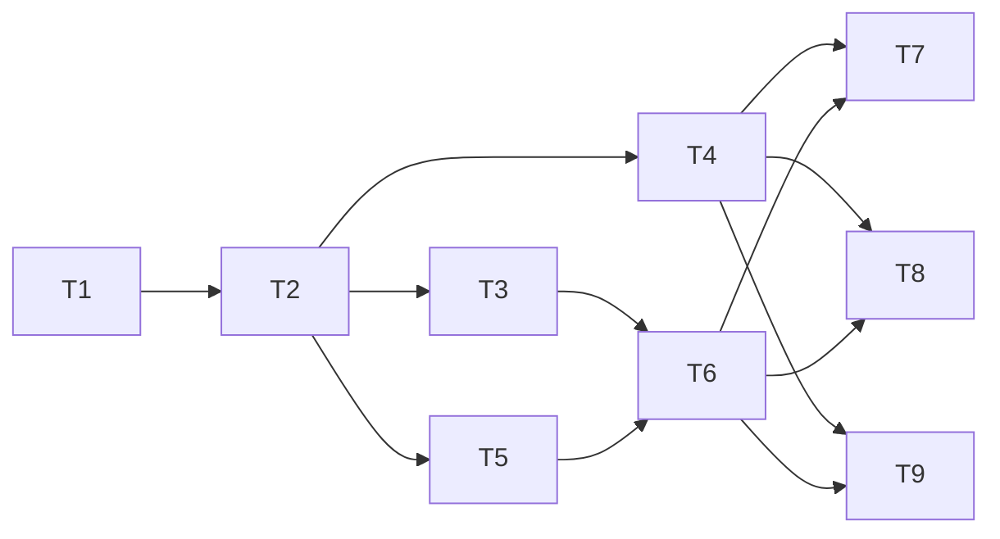

# Task Batch Review implementation plan

Source brief: `docs/loom/specs/2026-08-30-task-batch-review.md`
Source change-folder: `docs/loom/task-batch-review/`
Goal: Add fail-closed Task Batch Review without enlarging Tasks or creating a second workflow ledger — serves PURPOSE: makes review evidence cheaper while keeping every claim mechanically traceable.
Stage: sdd:wave-1
Critical-path depth: 5 (≤5)
Total tasks: 9
Execution order: T1 → T2; T3, T4, and T5 after T2; T6 after T3 and T5; T7 and T8 after T4 and T6; T9 after T4 and T6
Plan-document-reviewer verdict: PASS (2026-08-30, round 3 — user-authorized exception)
Steps:
  1. Define the plan contract
  2. Add the execution primitives
  3. Add packet and ledger primitives
  4. Integrate the review loop
  5. Prove the complete behavior

## Task-flow diagram

## Open Questions

N/A — no unresolved question: the B design, fail-closed fallback, and new-plan-only execution boundary are fixed by the approved spec.

## Complexity assessment

- **Added complexity**: one derived Review Batch section, one deterministic validator/runtime helper, one `implemented(<sha>)` Task state, and atomic multi-Task status writes.
- **Why worthwhile**: these are the minimum mechanisms needed to replace repeated full reviews with one evidence-bound aggregate review without losing Task-level traceability.
- **Removed or avoided complexity**: no Batch queue, claim, lifecycle, size score, lock manager, receipt store, compatibility adapter, or separate ledger.
- **Downstream risk**: the accepted risk is a conservative first version that may fall back to individual review more often than necessary; it must never batch when proof is incomplete.

## Task 1 — Define and validate Review Batch plan metadata

- **Description**: Add the smallest closed Review Batch schema and a fail-closed structural validator after the Task DAG is complete.
- **Module**: `loom-code/scripts/check_review_batches.py`
- **Files touched**: `loom-code/scripts/check_review_batches.py`, `loom-code/scripts/test_check_review_batches.py`, `loom-code/scripts/test_gate_scripts_fail_loud_on_unreadable_input.py`, `docs/loom/INDEX.md`, `AGENTS.md`
- **Context paths**:
  - `loom-code/skills/writing-plans/references/plan-format.md`
  - `loom-code/scripts/check_scenario_coverage.py`
- **Acceptance**:
  - **RED**: `loom-code/scripts/test_check_review_batches.py::test_plan_contract_matrix` fails because no parser rejects incomplete DAGs, cycles, duplicate membership, dangling dispositions, missing fields, or invalid eligibility.
  - **GREEN**: The table-driven test passes, the documented command runs successfully, and each Task has exactly one Batch-or-individual disposition while each accepted Batch has all six fields.
- **Dependencies**: none
- **Independent**: false
- **Brief item covered**: REQ-99
- **Brief item covered**: REQ-100
- **Brief item covered**: REQ-101
- **Brief item covered**: REQ-102
- **Brief item covered**: BI-1, BI-2, BI-6, BI-7
- **Status**: claimed(@main)
- **Gloss**: 只增加一個衍生檢查器，不建立第二套管理資料。

## Task 2 — Make writing-plans produce the second-pass grouping

- **Description**: Extend the current plan schema, planner instructions, and plan reviewer so atomic Tasks and DAG are authored first and Review Batches are derived second.
- **Module**: `loom-code/skills/writing-plans`
- **Files touched**: `loom-code/skills/writing-plans/SKILL.md`, `loom-code/skills/writing-plans/references/plan-format.md`, `loom-code/skills/writing-plans/references/plan-document-reviewer-prompt.md`, `loom-code/scripts/test_writing_plans_review_batches.py`
- **Context paths**:
  - `loom-code/scripts/check_review_batches.py`
  - `docs/loom/task-batch-review/specs/review-batching/spec.md`
- **Acceptance**:
  - **RED**: `loom-code/scripts/test_writing_plans_review_batches.py::test_second_pass_and_fail_closed_contract` fails because writing-plans has no Batch section, disposition field, eligibility gate, or mandatory validator call.
  - **GREEN**: The structural test passes and pins Tasks-first/DAG-first ordering, all six Batch fields, explicit individual fallback, and reviewer validation without changing Task atomicity; `check_review_batches.py` is the mandatory schema oracle.
- **Dependencies**: Task 1 completes first
- **Seam**:
  - from Task 1: payload: closed Batch grammar and validator CLI; owner: Task 1; probe: `check_review_batches.py` is the mandatory schema oracle
- **Independent**: false
- **Brief item covered**: REQ-99
- **Brief item covered**: REQ-100
- **Brief item covered**: REQ-101
- **Brief item covered**: REQ-102
- **Brief item covered**: BI-1, BI-2, BI-6, BI-7
- **Status**: pending
- **Gloss**: 規劃仍先拆原子 Task，再於同一流程做第二輪分組。

## Task 3 — Add implemented state and Batch-aware readiness

- **Description**: Extend the existing Task ledger helper with `implemented(<sha>)`, Batch-aware dependency readiness, and one atomic multi-Task compare-and-swap write path.
- **Module**: `loom-code/scripts/plan_card.py`
- **Files touched**: `loom-code/scripts/plan_card.py`, `loom-code/scripts/test_plan_card.py`, `loom-code/scripts/test_plan_card_batch_states.py`
- **Context paths**:
  - `loom-code/skills/subagent-driven-development/references/plan-ledger-notes.md`
  - `scripts/plan_card.py`
- **Acceptance**:
  - **RED**: `loom-code/scripts/test_plan_card_batch_states.py::test_batch_ledger_transition_matrix` fails because the ledger cannot record implemented commits, enforce same-Batch versus cross-Batch readiness, or atomically update an expected member set.
  - **GREEN**: The matrix passes for valid transitions, stale snapshots, owner-union reopen, all-member finalize, idempotent retry, and interruption-safe file replacement; `check_review_batches.py` is the mandatory schema oracle.
- **Dependencies**: Task 2 completes first
- **Seam**:
  - from Task 2: payload: validated membership and disposition; owner: Task 2; probe: `check_review_batches.py` is the mandatory schema oracle
- **Independent**: false
- **Brief item covered**: REQ-103
- **Brief item covered**: REQ-104
- **Brief item covered**: REQ-108
- **Brief item covered**: BI-3, BI-8, BI-11
- **Status**: pending
- **Gloss**: Task 多一個暫態，但仍由原本的 plan ledger 管理。

## Task 4 — Materialize immutable aggregate Review Packets

- **Description**: Add pure Batch packet construction and validation over committed member SHAs, declared files, verified requirement ownership, lane, and aggregate verification.
- **Module**: `loom-code/scripts/review_batch.py`
- **Files touched**: `loom-code/scripts/review_batch.py`, `loom-code/scripts/test_review_batch.py`
- **Context paths**:
  - `loom-code/scripts/review_context.py`
  - `loom-code/scripts/check_review_batches.py`
- **Acceptance**:
  - **RED**: `loom-code/scripts/test_review_batch.py::test_packet_readiness_and_immutability_matrix` fails because no helper refuses unready members, undeclared scope, authority drift, partial publication, or packet mutation.
  - **GREEN**: The matrix passes and packet identity changes whenever any member SHA, scope, ownership, lane, verification, or validated Batch declaration changes; `implemented(<sha>)` is required for every packet member.
- **Dependencies**: Task 2 completes first
- **Seam**:
  - from Task 2: payload: validated Batch membership; owner: Task 2; probe: `implemented(<sha>)` is required for every packet member
- **Independent**: false
- **Brief item covered**: REQ-105
- **Brief item covered**: BI-4, BI-9
- **Status**: pending
- **Gloss**: 聚合 packet 是一次 review 的不可變輸入，不是新 ledger。

## Task 5 — Define aggregate reviewer resolution and attribution

- **Description**: Add deterministic resolution rules for expected reviewer arms, provenance, finding ownership, blocking ground, owner unions, and unassignable fallback.
- **Module**: `loom-code/scripts/review_batch.py`
- **Files touched**: `loom-code/scripts/review_batch.py`, `loom-code/scripts/test_review_batch_resolution.py`
- **Context paths**:
  - `loom-code/skills/subagent-driven-development/SKILL.md`
  - `loom-code/agents/spec-reviewer.md`
  - `loom-code/agents/code-quality-reviewer.md`
- **Acceptance**:
  - **RED**: `loom-code/scripts/test_review_batch_resolution.py::test_aggregate_resolution_matrix` fails because empty, missing, duplicate, conflicting, malformed, mixed-unassignable, and multi-owner results have no single fail-closed reducer.
  - **GREEN**: The reducer passes the matrix, retains arm provenance, returns an atomic owner union only for attributable findings, and proves `unassignable finding selects individual review without ledger mutation`; `check_review_batches.py` is the mandatory schema oracle.
- **Dependencies**: Task 2 completes first
- **Seam**:
  - from Task 2: payload: declared review lane and membership; owner: Task 2; probe: `check_review_batches.py` is the mandatory schema oracle
- **Independent**: false
- **Brief item covered**: REQ-106
- **Brief item covered**: REQ-107
- **Brief item covered**: BI-9
- **Status**: pending
- **Gloss**: 無法可靠歸屬的 finding 直接降級，不猜測 owner。

## Task 6 — Integrate one Batch fan-out into SDD

- **Description**: Update SDD to stop after mechanical verification at implemented, dispatch one aggregate review for an eligible ready Batch, and otherwise reuse the existing individual loop.
- **Module**: `loom-code/skills/subagent-driven-development`
- **Files touched**: `loom-code/skills/subagent-driven-development/SKILL.md`, `loom-code/skills/subagent-driven-development/references/plan-ledger-notes.md`, `loom-code/skills/subagent-driven-development/references/conditional-operations.md`, `loom-code/scripts/test_subagent_driven_development_batch_review.py`
- **Context paths**:
  - `loom-code/scripts/review_batch.py`
  - `loom-code/scripts/plan_card.py`
- **Acceptance**:
  - **RED**: `loom-code/scripts/test_subagent_driven_development_batch_review.py::test_batch_dispatch_and_fallback_contract` fails because SDD still launches a full reviewer fan-out for every non-mechanical Task.
  - **GREEN**: The test passes and pins `one fan-out per ready Batch`, lane-specific arms, fresh packets after repair, individual fallback, `implemented(<sha>)` is required before Batch dispatch, `unassignable finding selects individual review without ledger mutation`, and SDD-only ledger mutation.
- **Dependencies**: Tasks 3, 5 complete first
- **Seam**:
  - from Task 3: payload: implemented/readiness/atomic ledger verbs; owner: Task 3; probe: `implemented(<sha>)` is required before Batch dispatch
  - from Task 5: payload: aggregate result and owner-union reducer; owner: Task 5; probe: `unassignable finding selects individual review without ledger mutation`
- **Independent**: false
- **Brief item covered**: REQ-103
- **Brief item covered**: REQ-104
- **Brief item covered**: REQ-105
- **Brief item covered**: REQ-106
- **Brief item covered**: REQ-107
- **Brief item covered**: REQ-108
- **Brief item covered**: BI-2, BI-4, BI-8, BI-9, BI-10
- **Reuse-adequacy**:
  - Observed: the individual Task loop validates one immutable SHA-bound packet and refuses reviewer fan-out when that packet or its declared committed scope is invalid — `read loom-code/skills/subagent-driven-development/SKILL.md:125`
  - Intended: reuse that validation and refusal behavior unchanged when Batch eligibility or aggregate attribution selects individual fallback; the fallback still receives a fresh per-Task packet and introduces no Batch state.
- **Status**: pending
- **Gloss**: 合格時聚合 review，不合格時沿用原本逐 Task 流程。

## Task 7 — Enforce new-plan-only SDD intake

- **Description**: Refuse SDD execution for plans that do not carry a valid new Review Batch disposition schema.
- **Module**: `loom-code/skills/subagent-driven-development`
- **Files touched**: `loom-code/skills/subagent-driven-development/SKILL.md`, `loom-code/scripts/test_sdd_new_plan_intake.py`
- **Context paths**:
  - `loom-code/scripts/check_review_batches.py`
- **Acceptance**:
  - **RED**: `loom-code/scripts/test_sdd_new_plan_intake.py::test_historical_plan_is_refused` fails because missing Batch disposition is still treated as executable input.
  - **GREEN**: The test passes: historical plan is refused; SDD accepts only a validator-approved new schema and dispatches one fan-out per ready Batch.
- **Dependencies**: Tasks 4, 6 complete first
- **Seam**:
  - from Task 4: payload: immutable aggregate packet contract; owner: Task 4; probe: validator-approved new schema
  - from Task 6: payload: Batch dispatch and individual fallback contract; owner: Task 6; probe: one fan-out per ready Batch
- **Independent**: false
- **Brief item covered**: REQ-109
- **Brief item covered**: BI-12
- **Status**: pending
- **Gloss**: 舊 plan 不做相容層；Batch pass 也不取代整個 branch 的最後審查。

## Task 8 — Preserve whole-branch close-out review

- **Description**: Pin that a passing Batch review never replaces cumulative branch review and never erases a later whole-branch finding.
- **Module**: `loom-code/skills/finishing-a-development-branch`
- **Files touched**: `loom-code/scripts/test_finishing_batch_review_contract.py`
- **Context paths**:
  - `loom-code/skills/finishing-a-development-branch/SKILL.md`
  - `loom-code/skills/requesting-code-review/SKILL.md`
- **Acceptance**:
  - **RED**: `loom-code/scripts/test_finishing_batch_review_contract.py::test_batch_pass_does_not_skip_whole_branch_review` fails because no regression test pins the close-out boundary.
  - **GREEN**: The test passes: whole-branch review remains mandatory after one fan-out per ready Batch, and its findings remain authoritative.
- **Dependencies**: Tasks 4, 6 complete first
- **Seam**:
  - from Task 4: payload: immutable aggregate packet contract; owner: Task 4; probe: whole-branch review remains mandatory
  - from Task 6: payload: Batch pass result; owner: Task 6; probe: one fan-out per ready Batch
- **Independent**: false
- **Brief item covered**: REQ-110
- **Brief item covered**: BI-4
- **Status**: pending
- **Gloss**: Batch review 降低中途成本，但不取代 branch 最後防線。

## Task 9 — Prove cost reduction without hiding defects

- **Description**: Add an authorized replay corpus and one comparison command that reports review dispatches, fallback causes, safety outcomes, and package gates for baseline versus candidate.
- **Module**: `loom-code/scripts/task_batch_replay.py`
- **Files touched**: `loom-code/scripts/task_batch_replay.py`, `loom-code/scripts/test_task_batch_replay.py`, `CLAUDE.md`, `AGENTS.md`
- **Context paths**:
  - `loom-code/scripts/loom_firing_harness.py`
  - `docs/loom/specs/2026-08-30-task-batch-review.md`
- **Acceptance**:
  - **RED**: `loom-code/scripts/test_task_batch_replay.py::test_baseline_candidate_comparison_is_same_corpus_and_safety_gated` fails because no reproducible comparison rejects dispatch-only wins or mismatched corpora.
  - **GREEN**: The documented command succeeds on one authorized corpus and reports review dispatches, review rounds, fallback causes, false scope expansion, escaped known defects, elapsed work, maximum aggregate diff, and requirement-to-test traceability; any safety regression fails.
- **Dependencies**: Tasks 4, 6 complete first
- **Seam**:
  - from Task 4: payload: immutable aggregate packet contract; owner: Task 4; probe: one authorized corpus
  - from Task 6: payload: aggregate dispatch behavior; owner: Task 6; probe: review dispatches
- **Independent**: false
- **Brief item covered**: REQ-111
- **Brief item covered**: BI-1, BI-2, BI-3, BI-4
- **Status**: pending
- **Gloss**: 只有 review 次數下降且安全性不退步，才算有效。

## Decision Log

- 2026-08-30 — Use the current plan schema for this bootstrap plan; the plan implements, but does not pretend to already possess, the future Review Batch fields.
- 2026-08-30 — Omit legacy-plan compatibility per the user's latest decision; historical plans are not execution inputs.
- 2026-08-30 — Centralize runtime Batch predicates in one pure helper and keep `plan_card.py` as the only ledger writer to avoid a second state system.
- 2026-08-30 — T1 package gate discovered two repository-owned integration surfaces: classify the new checker and regenerate the living-spec index; remove the redundant `CLAUDE.md` command copy because `AGENTS.md` is the existing command SSOT.

## Notes

- The first version has no configurable Batch size or scoring heuristic. Eligibility is proof-based and fail-closed.
- Batch is review metadata derived from Tasks and DAG; it never owns work, claims, or progress independently.
