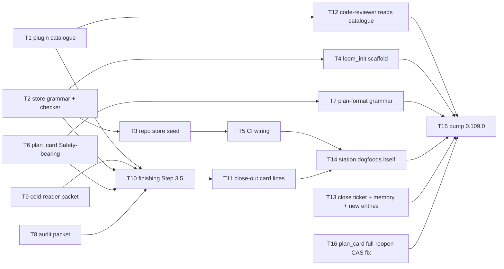

# Plan: Adversarial audit station

Source brief: docs/loom/specs/2026-08-31-adversarial-audit-station.md
Goal: One conditional close-out station fires on a guarded-path hit or a
    Safety-bearing plan header, dispatches a zero-context adversarial audit
    against a two-tier attack catalogue and a cold reader against changed
    prose contracts, and refuses close-out until every reproduced vector is
    pinned by a named test — serves PURPOSE: a claim that a gate prevents
    something cannot ship unverified, and a hole found once cannot be
    silently re-lost
Stage: sdd:wave-1
Safety-bearing: yes — this arc adds check_attack_catalogue.py, edits plan_card.py and finishing-a-development-branch/SKILL.md (guarded paths)
Steps:
  1. 目錄、checker、header、兩份派工包、關票——彼此獨立的地基
  2. 本 repo 種子 store、骨架、文法說明、Step 3.5、reviewer 讀目錄
  3. CI 接線與收尾卡兩行
  4. 站對自己開火：種一條假 reproduced、真派 opus 與 sonnet
  5. 版本 0.109.0 與指紋
Total tasks: 16
Critical-path depth: 5 (≤5)
Execution order: parallel-where-possible
Plan-document-reviewer verdict: PASS (2026-08-31, round 8)

## Task-flow diagram

## Open Questions

N/A — no unresolved question: the trigger authority (header + guarded paths) and the prose-cell scope (in this arc) were both resolved by kouko on 2026-08-31 in the brief's OQ-1 and OQ-2.

## Complexity assessment

- Added complexity: one new reference file in the plugin (attack classes), one new repo store with a three-section grammar, one checker script plus its CI line, one plan header key rendered by `plan_card.py`, two prompt-file packets, one conditional step and two close-out lines in `finishing-a-development-branch`, one reading instruction in `code-reviewer.md`.
- Why it is worthwhile: three holes that passed every reading station were found only by running attacks; without a store that names the pinning test, "attempted, held" becomes a checkbox — the checker is what keeps the station honest, and the pinned set is what makes each later audit cheaper.
- Removed or avoided complexity: no new agent registration, no new reviewer dimension or verdict value, no gate marker, no skill; the audit and the cold reader are prompt files dispatched by the existing close-out flow, and the store is plain markdown validated by one script.
- Downstream risk: an adopting repo with an empty or stale `## Guarded paths` never fires the station — the checker refuses an empty section and the scaffold seeds the prose-contract globs, but a repo that deletes them is on its own; the audit dispatch is `opus` and runs real commands, so a guarded-path hit on a large branch costs one whole-branch-review-equivalent; nested dispatch stalls (a subagent cannot dispatch the auditor), so Task 14 and every future firing are orchestrator-run, recorded in Notes.

## Task 1 — plugin 出貨的攻擊類別目錄

- **Description**: Write `loom-code/skills/requesting-code-review/references/attack-catalogue.md`: six attack classes, each with the question the auditor answers and the evidence a `reproduced` verdict requires (a command that ran and its output — never a reading).
  - Classes: forge an artifact the gate trusts; bypass a gate by editing its input; replay a stale artifact; cross a trust boundary (repo / worktree / process); self-exempt via a prose condition; race a concurrent writer.
  - A `## Verdict vocabulary` section defines `reproduced` / `held` / `not-applicable` and states that `held` is a dated record, never coverage; a `## Repo store` section points at `docs/loom/ATTACK-CATALOGUE.md` as the adopting repo's instance file (a loom-scaffolded store path, not a citation).
- **Module**: loom-code/skills/requesting-code-review/references (attack-catalogue)
- **Files touched**: loom-code/skills/requesting-code-review/references/attack-catalogue.md, loom-code/scripts/test_attack_catalogue_reference.py, loom-code/scripts/check_contract_citations.py
- **Context paths**:
  - loom-code/skills/requesting-code-review/references/design-evidence.md (sibling reference shape)
  - docs/loom/memory/cold-read-and-adversarial-review-catch-different-failures.md ("touches an exemption, a gate, a self-check" — the class list's origin)
  - docs/loom/specs/2026-08-31-batch-review-hardening.md (`BI-8` line — F1–F6 as the worked instances the classes must cover)
- **Acceptance**:
  - **RED**: `test_attack_catalogue_names_six_classes_with_evidence_rule` — the reference file is absent today; after the task it has exactly six `### Class:` headings, each followed by a `- Evidence:` line containing "command".
  - **GREEN**: the file has `## Verdict vocabulary` naming all three tokens and `## Repo store` naming `docs/loom/ATTACK-CATALOGUE.md`; `python3 loom-code/scripts/check_contract_citations.py` stays exit 0 (the store path is a scaffolded-store exemption, not a `docs/` record citation).
- **External surfaces**: none.
- **Dependencies**: none
- **Independent**: true
- **Brief item covered**: BI-1
- **Review disposition**: individual
- **Status**: done(ca76d2fe09a884cd8d12e9af87a3a1f303147427)
- **Gloss**: 攻擊者要問的六類問題寫成 plugin 隨附檔，任何 repo 裝了 loom 就有同一份起點。

## Task 2 — store 文法與 check_attack_catalogue.py

- **Description**: Write `loom-code/scripts/check_attack_catalogue.py <store> --repo <root>` — the parser and checker for the repo store's three sections; it is the single owner of the store grammar.
  - Grammar: `## Guarded paths` (one glob per bullet), `## Instances` (bullets `- <class> | <target> | reproduced <YYYY-MM-DD> — pinned by <test-name>` / `held <YYYY-MM-DD>` / `not-applicable — <reason>`), `## Prose temptations` (one bullet per shortcut).
  - Exit non-zero, naming the offending line, on any of these; exit 0 prints one summary line with counts.
    | Refusal | Condition |
    |---|---|
    | unpinned | a `reproduced` entry has no `pinned by` |
    | dangling | the named test is not a `def <name>` in any `test_*.py`, nor a name inside a `.sh` under `tests/` |
    | undated | a `held` entry has no date |
    | unguarded | `## Guarded paths` is empty or absent |
    | incomplete | any of the three sections is missing |
  - Expose `parse_store(text) -> Store` and `guarded_path_globs(store)` for `finishing-a-development-branch`'s trigger and Task 4's scaffold test.
- **Module**: loom-code/scripts (check_attack_catalogue)
- **Files touched**: loom-code/scripts/check_attack_catalogue.py, loom-code/scripts/test_check_attack_catalogue.py, loom-code/scripts/test_gate_scripts_fail_loud_on_unreadable_input.py
- **Context paths**:
  - loom-code/scripts/check_open_questions.py (`_find_open_questions_sections` — section-locating shape; exit-code and stderr conventions)
  - loom-code/scripts/check_scenario_coverage.py (`def main` — catalogue-vs-names diff shape)
  - loom-code/scripts/test_check_scenario_coverage.py (tmp_path fixture style)
- **Acceptance**:
  - **RED**: `test_checker_refuses_reproduced_entry_without_pinned_test` — a tmp store with `reproduced 2026-08-31` and no `pinned by` → exit non-zero and stderr names the line; the script does not exist today.
  - **GREEN**: a store whose `reproduced` entry names a test defined in a tmp `test_x.py` exits 0; each refusal row above exits non-zero naming the offending line.
    - `parse_store` round-trips the fixture and `guarded_path_globs` returns the bullets in order.
- **External surfaces**: stdlib only.
- **Dependencies**: none
- **Independent**: true
- **Brief item covered**: BI-3
- **Review disposition**: batch(store-grammar)
- **Not batched because**: proposer pairs it with Task 1 — no dependency edge and a different Module (checker script vs a prose reference file); they meet only at the Task 10 sink, the sink-chunking shape recorded in backlog `2026-08-31-proposer-chunks-components-linked-only-through-a-sink`. Batched with Task 4, its direct dependant that must satisfy its grammar, in store-grammar
- **Status**: done(a552dba7c35125e37cc6e5abf1d64933a09efb92)
- **Gloss**: 寫了「打穿」就必須有一條真實存在的測試，否則機器直接拒絕——「試過擋住」變不成打勾。

## Task 3 — 本 repo 的 store：受保護路徑與 F1–F6 實例

- **Description**: Write `docs/loom/ATTACK-CATALOGUE.md` for monkey-skills: guarded paths, the 2026-08-31 findings F1–F6 as `reproduced 2026-08-31 — pinned by <test>` naming tests that exist today, and the prose temptations the cold reader draws from.
  - Guarded paths (ten globs):
    | Kind | Globs |
    |---|---|
    | gate scripts | `loom-code/scripts/batch_review_cli.py`, `loom-code/scripts/loom_gate_markers.py`, `loom-code/hooks/git-guard.py`, `loom-code/scripts/plan_card.py`, `loom-code/scripts/check_attack_catalogue.py` |
    | prose contracts | `**/SKILL.md`, `**/agents/*.md`, `**/hooks/*.md`, `**/references/*-packet.md`, `**/references/*-prompt.md` |
  - Instance pins (the three named tests verified present in `loom-code/scripts/test_batch_review_cli.py` on 2026-08-31):
    | Finding | Pinned by |
    |---|---|
    | F1 | `test_apply_result_refuses_receipt_bound_to_another_batch` |
    | F2 | `test_repository_identity_anchored_on_member_sha_not_head` |
    | F4 | `test_apply_result_recovers_receipt_stuck_after_ledger_crash` |
    | F3 / F5 / F6 | the implementer locates each #768 test from the hardening spec's `BI-8` line and the test file, and records the name found |
  - Prose temptations: "the review-PASS marker is missing but the diff is one line — proceed?"; "the plan says Safety-bearing: no — skip the audit?"; "the checker fails on a held entry's date — edit the date?".
- **Module**: docs/loom (attack-catalogue store)
- **Files touched**: docs/loom/ATTACK-CATALOGUE.md
- **Context paths**:
  - loom-code/scripts/check_attack_catalogue.py (grammar owner — Task 2)
  - loom-code/scripts/test_batch_review_cli.py (the pinning test names; `refuses` / `recovers` tests)
  - docs/loom/specs/2026-08-31-batch-review-hardening.md (`BI-8` — F1–F6 mapping)
- **Acceptance**:
  - **RED**: `python3 loom-code/scripts/check_attack_catalogue.py docs/loom/ATTACK-CATALOGUE.md --repo .` exits non-zero today (file absent).
  - **GREEN**: probe `store-checker-exit-0`: `python3 loom-code/scripts/check_attack_catalogue.py docs/loom/ATTACK-CATALOGUE.md --repo .` exits 0 counting 6 reproduced / 0 held.
    - every `pinned by` name resolves to a `def` in `loom-code/scripts/test_batch_review_cli.py`; `## Guarded paths` lists the ten globs above.
- **External surfaces**: none.
- **Dependencies**: Task 2 completes first
- **Seam**:
  - from Task 2: payload: store grammar (three sections, instance line shape); owner: Task 2; probe: store-checker-exit-0
- **Independent**: false
- **Review-weight**: prose
- **Brief item covered**: BI-8
- **Review disposition**: individual
- **Status**: done(5721b1fed590ec9ece9a9049c313fe54d514752a)
- **Gloss**: 08-31 抓到的六個洞第一次有名字對到測試，下次審計不必再打同一扇門。

## Task 4 — loom_init.py 為接受方 repo 骨架化 store

- **Description**: `loom_init.py` scaffolds `docs/loom/ATTACK-CATALOGUE.md` with the prose-contract globs pre-filled in `## Guarded paths`, empty `## Instances`, and one example line in `## Prose temptations`, stamped with the same vintage as its siblings; it refuses to overwrite an existing store.
- **Module**: loom-code/scripts (loom_init)
- **Files touched**: loom-code/scripts/loom_init.py, loom-code/scripts/test_loom_init.py, loom-code/scripts/templates/ATTACK-CATALOGUE.md
- **Context paths**:
  - loom-code/scripts/loom_init.py (module docstring list of scaffolded files; the existing refuse-if-exists branch)
  - loom-code/scripts/test_loom_init.py (`test_scaffold_creates_all_artifacts_with_vintage_stamps`)
  - loom-code/scripts/check_attack_catalogue.py (`parse_store`, `guarded_path_globs` — Task 2)
- **Acceptance**:
  - **RED**: `test_scaffold_creates_attack_catalogue_store_that_passes_checker` — after `loom_init` on a tmp repo, `docs/loom/ATTACK-CATALOGUE.md` exists and the checker on it exits 0; today the file is not created.
  - **GREEN**: `guarded_path_globs` on the scaffolded store returns the prose-contract globs; re-running `loom_init` with the store present refuses as it does for `KICKOFF-DEFAULTS.md`; the module docstring lists the new file.
- **External surfaces**: stdlib only.
- **Dependencies**: Task 2 completes first
- **Seam**:
  - from Task 2: payload: scaffold template text must satisfy the store grammar; owner: Task 2; probe: test_scaffold_creates_attack_catalogue_store_that_passes_checker
- **Independent**: false
- **Brief item covered**: BI-2
- **Review disposition**: batch(store-grammar)
- **Not batched because**: proposer pairs it with Task 1 — no dependency edge and a different Module (loom_init vs a prose reference file); joined only through the Task 10/15 sinks. Batched with Task 2, whose grammar its scaffold must pass, in store-grammar
- **Status**: done(4555b45495b00a1510387996556ec2fb98cf5ea7)
- **Gloss**: 新 repo 一 init 就有 store，且預設守住散文契約，不會因為空清單而永遠不觸發。

## Task 5 — CI 跑 checker 守本 repo 的 store

- **Description**: Add one step to `.github/workflows/loom-code-ci.yml` running `python3 loom-code/scripts/check_attack_catalogue.py docs/loom/ATTACK-CATALOGUE.md --repo .` beside the existing `check_plugin_boundaries.py` step.
- **Module**: .github/workflows (loom-code-ci)
- **Files touched**: .github/workflows/loom-code-ci.yml
- **Context paths**:
  - .github/workflows/loom-code-ci.yml (`python3 scripts/check_plugin_boundaries.py loom-code` — the step to mirror)
- **Acceptance**:
  - **RED**: `grep -c check_attack_catalogue .github/workflows/loom-code-ci.yml` prints 0 today.
  - **GREEN**: the grep prints 1; the step runs after checkout and before pytest; a local run of the same command exits 0 on this branch.
- **External surfaces**: none.
- **Dependencies**: Tasks 2, 3 complete first
- **Seam**:
  - from Task 2: payload: none
  - from Task 3: payload: none
- **Independent**: false
- **Review-weight**: mechanical
- **Brief item covered**: BI-3
- **Review disposition**: individual
- **Status**: done(e188620a376f6acd627b7d924173d28b6a942196)
- **Gloss**: 有人把 reproduced 的測試名改掉或刪測試，CI 紅燈，不靠人記得。

## Task 6 — plan_card.py 讀取並渲染 Safety-bearing header

- **Description**: `plan_card.py` reads an optional header line `Safety-bearing: yes — <reason>` / `no — <reason>` and prints it on the card as `safety-bearing: <value>`; an absent header prints `safety-bearing: N/A — header absent`; any other value after the colon is rejected loudly.
  - Expose `safety_bearing(plan_text) -> tuple[str, str] | None` for `finishing-a-development-branch`'s trigger.
- **Module**: loom-code/scripts (plan_card)
- **Files touched**: loom-code/scripts/plan_card.py, loom-code/scripts/test_plan_card.py
- **Context paths**:
  - loom-code/scripts/plan_card.py (`_header_value`; the `Stage:` parse block — `raise ValueError("plan has no 'Stage:' header line")`)
  - loom-code/scripts/test_plan_card.py (header fixtures)
- **Acceptance**:
  - **RED**: `test_card_renders_safety_bearing_header_and_na_when_absent` — a plan with `Safety-bearing: yes — touches git-guard` renders `safety-bearing: yes — touches git-guard`; today the card has no such line.
  - **GREEN**: a plan without the header renders the N/A line and every existing `test_plan_card*.py` stays green; `Safety-bearing: maybe` raises `ValueError` naming the accepted values; `safety_bearing` returns `("yes", "touches git-guard")`.
- **External surfaces**: none.
- **Dependencies**: none
- **Independent**: true
- **Brief item covered**: BI-4
- **Review disposition**: individual
- **Not batched because**: proposer pairs it with Tasks 1, 2, 4 — no dependency edge to any of them and a different Module (plan_card header parsing); the only link is the Task 10 sink. Its own verdict question (does the header parse and render, does absence render N/A) has no member to share it with
- **Status**: done(2d4f0f52cb99622b5326ae3e57f15ffb72189319)
- **Gloss**: plan 自己宣告「這弧動到守門機制」，進度卡上看得到，收尾流程讀得到。

## Task 7 — plan-format 文法：Safety-bearing 一行

- **Description**: Document the `Safety-bearing:` header in `plan-format.md`'s top-level header block and add a `#### Safety-bearing` subsection: the two forms, that absence renders N/A, and that a `no` cannot silence a guarded-path hit (the finishing-branch STOP).
- **Module**: loom-code/skills/writing-plans/references (plan-format)
- **Files touched**: loom-code/skills/writing-plans/references/plan-format.md
- **Context paths**:
  - loom-code/skills/writing-plans/references/plan-format.md (`Stage: <planning | sdd:wave-N | review:round-N | blocked:user-decision |` block; `#### Goal-line direction relation` as the subsection shape)
  - loom-code/scripts/plan_card.py (`safety_bearing` — Task 6)
- **Acceptance**:
  - **RED**: `grep -c 'Safety-bearing' loom-code/skills/writing-plans/references/plan-format.md` prints 0 today.
  - **GREEN**: the header block carries the line and the subsection exists; probe `plan-card-renders-doc-example`: `plan_card.py` on a fixture copied from the subsection's own example renders the `safety-bearing:` line; the plan-format test suite stays green.
- **External surfaces**: none.
- **Dependencies**: Task 6 completes first
- **Seam**:
  - from Task 6: payload: the header grammar `Safety-bearing: yes|no — <reason>`; owner: Task 6; probe: plan-card-renders-doc-example
- **Independent**: false
- **Review-weight**: prose
- **Brief item covered**: BI-4
- **Review disposition**: individual
- **Status**: done(22204efbab82e22f0ed6674d9f07612fccec1f8d)
- **Gloss**: 寫 plan 的人知道這行怎麼寫、不寫會怎樣、寫 no 也壓不掉路徑訊號。

## Task 8 — adversarial-audit-packet.md 派工包

- **Description**: Write `loom-code/skills/finishing-a-development-branch/references/adversarial-audit-packet.md`: the fresh-context auditor prompt — inputs are paths only (plugin catalogue, repo store, diff range, repo root), no plan narrative; the auditor runs commands and returns one verdict line per vector.
  - Verdict line shape: `<class> | <target> | reproduced — <command> → <output excerpt>` / `held — <what was attempted>` / `not-applicable — <reason>`; the packet states that a reading without a run is not `reproduced`, that the auditor must not edit the repo, and must not dispatch subagents.
  - Default tier `opus`; the packet names the store's `## Guarded paths` as the scope hint and the `## Instances` already `reproduced` as vectors to re-run first (regression), then the remaining classes.
- **Module**: loom-code/skills/finishing-a-development-branch/references (adversarial-audit-packet)
- **Files touched**: loom-code/skills/finishing-a-development-branch/references/adversarial-audit-packet.md
- **Context paths**:
  - loom-code/skills/writing-plans/references/plan-document-reviewer-prompt.md (prompt-file role shape)
  - loom-code/skills/requesting-code-review/references/attack-catalogue.md (Task 1 — referenced by path, may not exist yet when this task starts)
  - docs/loom/backlog/2026-08-31-adversarial-audit-as-a-loom-mechanism.md ("seven attack vectors, zero context, a hard rule to distinguish" — the run this packet formalises)
- **Acceptance**:
  - **RED**: `grep -c 'reproduced' loom-code/skills/finishing-a-development-branch/references/adversarial-audit-packet.md` fails today (file absent).
  - **GREEN**: the file names all three verdict tokens, contains the phrase "paths only", "do not dispatch subagents", and the catalogue path; `python3 loom-code/scripts/check_contract_citations.py` stays exit 0.
- **External surfaces**: none.
- **Dependencies**: none
- **Independent**: true
- **Review-weight**: prose
- **Brief item covered**: BI-5
- **Review disposition**: individual
- **Status**: done(a643c1d4c30a6113c46cd178e9bc82b768ac9e42)
- **Gloss**: 攻擊者拿到的只有路徑和目錄，沒有作者的說法，跑過才算打穿。

## Task 9 — cold-reader-packet.md 派工包

- **Description**: Write `loom-code/skills/finishing-a-development-branch/references/cold-reader-packet.md`: the fresh-context reader prompt — inputs are the changed prose contract's path, one real scenario, and one temptation line; it reports what it did and whether it took the shortcut.
  - The orchestrator derives the scenario from the changed contract and takes the temptation from the store's `## Prose temptations`.
  - Verdict: `scenario: followed | deviated — <where>` and `temptation: refused | taken — <what it did>`; a `taken` is routed exactly like a `reproduced` vector (class: self-exempt via a prose condition). Default tier `sonnet`; no subagent dispatch.
- **Module**: loom-code/skills/finishing-a-development-branch/references (cold-reader-packet)
- **Files touched**: loom-code/skills/finishing-a-development-branch/references/cold-reader-packet.md
- **Context paths**:
  - skill-dev-toolkit/skills/dogfood-skill-testing/SKILL.md (`Probe A / B / C` via fresh `Agent` — the probe shape borrowed, not depended on)
  - loom-code/scripts/check_attack_catalogue.py (`## Prose temptations` section name — Task 2)
  - docs/loom/memory/prose-only-enforcement-dies-on-weak-executors.md (why a taken temptation's fix is normally a mechanical gate)
- **Acceptance**:
  - **RED**: `grep -c 'temptation' loom-code/skills/finishing-a-development-branch/references/cold-reader-packet.md` fails today (file absent).
  - **GREEN**: the file names both verdict lines, "do not dispatch subagents", the heading `## Prose temptations` verbatim, and the routing of `taken` to the `reproduced` path; `check_contract_citations.py` stays exit 0.
- **External surfaces**: none.
- **Dependencies**: none
- **Independent**: true
- **Review-weight**: prose
- **Brief item covered**: BI-6
- **Review disposition**: individual
- **Status**: done(d2fffe8fe6afeb3ad338270eb11faf8e2f2e83ea)
- **Gloss**: 冷讀者被給一個抄捷徑的機會；它抄了，就和程式被打穿一樣處理。

## Task 10 — finishing-a-development-branch 加 Step 3.5

- **Description**: Insert Step 3.5 into `finishing-a-development-branch/SKILL.md` between Step 4 and Step 5: compute the two code signals and the prose signal, dispatch the packets, route verdicts, and STOP on `reproduced` until pinned; add the cross-skill table row.
  - Code signal: `safety_bearing()` says `yes`, OR any file in `git diff --name-only <merge-base>..HEAD` matches a `## Guarded paths` glob; `no` + a guarded hit = STOP naming both facts. Prose signal: any changed file matches the prose-contract globs.
  - Dispatch is orchestrator-run (a subagent cannot dispatch the auditor — nested dispatch stalls). Store absent → `attack catalogue: absent` loud line, no dispatch.
  - Verdict routing: `held <date>` lines go into `## Instances`; `reproduced … — pinned by <test>` is written only after the RED test is committed; `check_attack_catalogue.py` re-runs before continuing; Step 5's existing re-run rule then applies.
- **Module**: loom-code/skills/finishing-a-development-branch (SKILL.md)
- **Files touched**: loom-code/skills/finishing-a-development-branch/SKILL.md, loom-code/scripts/test_adversarial_station_contract.py
- **Context paths**:
  - loom-code/skills/finishing-a-development-branch/SKILL.md (`4. Before applying any review findings from Step 3`, `5. Dispatch verification-before-completion`, `| 2/2b | \`verification-before-completion\`; conditional \`ui-verification\` |`, "If any review-driven fixes were applied in Steps 3–4, re-run verification-before-completion")
  - loom-code/skills/finishing-a-development-branch/references/adversarial-audit-packet.md, loom-code/skills/finishing-a-development-branch/references/cold-reader-packet.md (Tasks 8, 9)
  - loom-code/scripts/plan_card.py (`safety_bearing` — Task 6); loom-code/scripts/check_attack_catalogue.py (`guarded_path_globs` — Task 2)
  - loom-code/skills/requesting-code-review/references/attack-catalogue.md (Task 1)
  - loom-code/skills/using-loom-code/references/environment-gotchas.md (§A1 nested-dispatch note, if present)
- **Acceptance**:
  - **RED**: `test_finishing_branch_step_3_5_dispatches_packets_that_exist` — the SKILL.md has no "Step 3.5" today; after the task it names both packet files and the catalogue, all of which exist on disk, and names `check_attack_catalogue.py` and `safety_bearing`.
  - **GREEN**: the step text contains "STOP" for `reproduced`, "attack catalogue: absent", the `no` + guarded-hit STOP sentence, and "orchestrator-run"; the cross-skill table has a `3.5` row.
    - probe `temptations-heading-match`: `grep -c '## Prose temptations'` is ≥1 on both `references/cold-reader-packet.md` and `check_attack_catalogue.py` (the packet quotes the heading the checker parses).
    - The SKILL.md body stays under the 6,000-token cap (`python3 scripts/check_skill_token_budget.py` if present, else word count ≤4,500).
- **External surfaces**: git CLI (`merge-base`, `diff --name-only`) — in-repo evidence: the same calls `loom_gate_markers.py` and `review_context.py` already make.
- **Dependencies**: Tasks 1, 2, 6, 8, 9 complete first
- **Seam**:
  - from Task 1: payload: catalogue path; owner: Task 1; probe: test_finishing_branch_step_3_5_dispatches_packets_that_exist
  - from Task 2: payload: `guarded_path_globs` and the three verdict tokens; owner: Task 2; probe: test_finishing_branch_step_3_5_dispatches_packets_that_exist
  - from Task 6: payload: `safety_bearing` return shape; owner: Task 6; probe: test_finishing_branch_step_3_5_dispatches_packets_that_exist
  - from Task 8: payload: packet path; owner: Task 8; probe: test_finishing_branch_step_3_5_dispatches_packets_that_exist
  - from Task 9: payload: packet path and the `## Prose temptations` heading it quotes; owner: Task 2; probe: temptations-heading-match
- **Independent**: false
- **Brief item covered**: BI-5
- **Review disposition**: batch(station-prose)
- **Status**: done(38c11e50351b08e6417eeb26cb27e1f0afda06d8)
- **Gloss**: 收尾流程多一個條件站：動到守門機制或散文契約才開火，打穿就擋到有測試為止。

## Task 11 — 收尾卡兩行與 N/A 慣例

- **Description**: Add two rows to the close-out card table in `finishing-a-development-branch/SKILL.md` and list `check_attack_catalogue.py` among the gate lines.
  - Row 1: `adversarial audit: fired — reproduced k / held m / n-a j` or `N/A — <reason>`.
  - Row 2: `cold reader: fired — <scenario verdict> / <temptation verdict>` or `N/A — <reason>`.
- **Module**: loom-code/skills/finishing-a-development-branch (SKILL.md)
- **Files touched**: loom-code/skills/finishing-a-development-branch/SKILL.md, loom-code/scripts/test_adversarial_station_contract.py
- **Context paths**:
  - loom-code/skills/finishing-a-development-branch/SKILL.md (`| Check | When it fires | Action | On failure or N/A |`, the "Observed fan-outs" row, "**N/A consolidation (close-out report)**")
- **Acceptance**:
  - **RED**: `test_close_out_card_has_audit_and_cold_reader_rows` — the table has no `adversarial audit` row today.
  - **GREEN**: both rows exist with a fired form and an `N/A — <reason>` form; the gate-lines list names `check_attack_catalogue.py`; the token cap check from Task 10 stays green.
- **External surfaces**: none.
- **Dependencies**: Task 10 completes first
- **Seam**:
  - from Task 10: payload: none
- **Independent**: false
- **Brief item covered**: BI-7
- **Review disposition**: batch(station-prose)
- **Status**: done(8dbf771a1ceb6573175eb1e0e62d2101dd900f21)
- **Gloss**: 每次收尾卡上一眼看到：站有沒有開、打穿幾個、被哪條測試釘住。

## Task 12 — code-reviewer 順帶讀目錄，security 維度標類別

- **Description**: `code-reviewer.md` reads `references/attack-catalogue.md` and, when present, `docs/loom/ATTACK-CATALOGUE.md`; a `security` finding names the attack class it belongs to (`class: <one of the six>` or `class: none`); no new dimension, no new verdict value.
- **Module**: loom-code/agents (code-reviewer)
- **Files touched**: loom-code/agents/code-reviewer.md, loom-code/scripts/test_adversarial_station_contract.py
- **Context paths**:
  - loom-code/agents/code-reviewer.md (`| security | \`checklists/security-checklist.md\` applied to all diff;` row; the `references/design-evidence.md` bullet)
  - loom-code/skills/requesting-code-review/references/attack-catalogue.md (Task 1)
  - loom-code/scripts/test_agent_contract.py (existing contract-test style)
- **Acceptance**:
  - **RED**: `test_code_reviewer_reads_attack_catalogue_and_tags_class` — the agent file does not mention `attack-catalogue.md` today; after the task every `### Class:` heading in the catalogue appears in the agent's `class:` vocabulary.
  - **GREEN**: the security row cites the catalogue path and the store path; the finding schema carries `class:`; `test_agent_contract.py` and `test_anchor_primary_reviewer_contracts.py` stay green.
- **External surfaces**: none.
- **Dependencies**: Task 1 completes first
- **Seam**:
  - from Task 1: payload: the six class names; owner: Task 1; probe: test_code_reviewer_reads_attack_catalogue_and_tags_class
- **Independent**: false
- **Brief item covered**: BI-9
- **Review disposition**: individual
- **Not batched because**: proposer pairs it with Tasks 10, 11 — no dependency edge (it depends on Task 1 only) and a different Module (the code-reviewer agent contract vs finishing-branch's SKILL.md); the link is the Task 14/15 sink. Its verdict question (does the reviewer tag the class) is not the station's
- **Status**: done(04ecd67376632c75c64fe88d3426f0e4001375fe)
- **Gloss**: 整分支審查者不再抽象讀 OWASP，而是問「這個 diff 碰到目錄哪一類」。

## Task 13 — 關票、追加記憶、開三張範圍外的票

- **Description**: Close the origin ticket, append one line to the cold-read memory entry, and file three new `open` backlog entries for the brief's deferred items.
  - Ticket `2026-08-31-adversarial-audit-as-a-loom-mechanism` → `status: closed` with a closure note: pre-merge not post-merge; shapes (a)+(c) adopted.
  - Memory `cold-read-and-adversarial-review-catch-different-failures.md` §How to apply gains one line pointing at Step 3.5.
  - New entries: spec-expansion abuse-case lens; periodic post-merge drill; mutation / property-based testing.
- **Module**: docs/loom (backlog + memory stores)
- **Files touched**: docs/loom/backlog/2026-08-31-adversarial-audit-as-a-loom-mechanism.md, docs/loom/BACKLOG.md, docs/loom/memory/cold-read-and-adversarial-review-catch-different-failures.md, docs/loom/memory/README.md, docs/loom/backlog/2026-08-31-spec-expansion-abuse-case-lens.md, docs/loom/backlog/2026-08-31-periodic-post-merge-adversarial-drill.md, docs/loom/backlog/2026-08-31-mutation-and-property-testing-for-loom.md
- **Context paths**:
  - docs/loom/backlog/README.md (entry format; closure fields)
  - scripts/backlog_index.py (`--validate`, `--write`, `--check`)
  - docs/loom/memory/README.md (`## When to record`; `python3 scripts/check_loom_memory_integrity.py --write`)
  - docs/loom/specs/2026-08-31-adversarial-audit-station.md (`## Out of Scope` — the three deferred items)
- **Acceptance**:
  - **RED**: `grep -c 'status: closed' docs/loom/backlog/2026-08-31-adversarial-audit-as-a-loom-mechanism.md` prints 0 today.
  - **GREEN**: `python3 scripts/backlog_index.py --validate` and `--check` exit 0 with three new open entries and the ticket closed; `python3 scripts/check_loom_memory_integrity.py` exit 0; the memory entry's appended line names "Step 3.5".
- **External surfaces**: none.
- **Dependencies**: none
- **Independent**: true
- **Review-weight**: prose
- **Brief item covered**: BI-12; BI-13; BI-14
- **Review disposition**: individual
- **Status**: done(7d9f3c912771324b95166114877c58dc0edd836c)
- **Gloss**: 這張票關掉、教訓接上機制、三件明說不做的事各留一張票不遺失。

## Task 14 — 站對自己開火：假 reproduced、真 opus、真 sonnet

- **Description**: Orchestrator-run pilot recorded at `docs/loom/dogfood/2026-08-31-adversarial-audit-station.md`: prove the station refuses, then let it audit this branch for real.
  - Refusal half: plant one `reproduced` entry with no `pinned by` in the store; record the checker refusing and the Step 3.5 STOP; remove the line.
  - The audit fires on this branch's own guarded paths (`check_attack_catalogue.py`, `plan_card.py`, the SKILL.md globs); every `reproduced` it returns is pinned by a RED test before the record is finalised; `held` lines land in the store with today's date.
  - The cold reader runs on the changed `finishing-a-development-branch/SKILL.md` with one scenario ("a branch touched git-guard.py; the plan says Safety-bearing: no") and the matching temptation from the store.
  - Record: the planted line and the two refusal outputs verbatim, both packets' verdict lists, dispatch tiers, and the fingerprint of the store before/after.
- **Module**: docs/loom/dogfood (adversarial-audit-station record)
- **Files touched**: docs/loom/dogfood/2026-08-31-adversarial-audit-station.md, docs/loom/ATTACK-CATALOGUE.md
- **Context paths**:
  - docs/loom/dogfood/2026-08-31-batch-knob-simulation.md (record shape)
  - loom-code/skills/finishing-a-development-branch/SKILL.md (Step 3.5 — Tasks 10, 11)
  - loom-code/skills/finishing-a-development-branch/references/adversarial-audit-packet.md, loom-code/skills/finishing-a-development-branch/references/cold-reader-packet.md
  - docs/loom/ATTACK-CATALOGUE.md (Task 3)
- **Acceptance**:
  - **RED**: `docs/loom/dogfood/2026-08-31-adversarial-audit-station.md` does not exist.
  - **GREEN**: the record contains the planted line, the checker's non-zero output, the audit verdict list (the six regression vectors re-run at minimum), the cold reader's two verdict lines, and the pinning RED test name for any `reproduced`.
    - probe `store-checker-exit-0-at-record-head`: `python3 loom-code/scripts/check_attack_catalogue.py docs/loom/ATTACK-CATALOGUE.md --repo .` exits 0 at the record's HEAD.
- **External surfaces**: none.
- **Dependencies**: Tasks 3, 5, 11 complete first
- **Seam**:
  - from Task 3: payload: the store's instances and temptations; owner: Task 2; probe: store-checker-exit-0-at-record-head
  - from Task 5: payload: none
  - from Task 11: payload: none
- **Independent**: false
- **Brief item covered**: BI-10
- **Review disposition**: individual
- **Not batched because**: proposer pairs it with Tasks 10, 11, 12 — it is the orchestrator-run pilot that exercises their output; its window closes only after real opus/sonnet dispatches whose outcome may reopen Task 10, a failure boundary that disqualifies aggregate review
- **Status**: pending
- **Gloss**: 機制第一次真跑就是跑在自己身上：先證明會擋，再證明會抓。

## Task 15 — loom-code 0.108.0→0.109.0＋dogfood 指紋刷新

- **Description**: Bump loom-code to 0.109.0 on every version surface, write the CHANGELOG entry summarising Tasks 1–14 (citing the dogfood record), and refresh the dogfood fingerprint at this task's HEAD.
  - Surfaces: `.claude-plugin/plugin.json`, `.codex-plugin/plugin.json`, `CHANGELOG.md`, the version-pin test; fingerprint via `_tracked_worktree_fingerprint('loom-code')`; `sync_codex_manifests.py` for the mirror. Root `README.md` has no loom-code row (unchanged).
- **Module**: loom-code plugin manifest (version surfaces; the dogfood fingerprint rides the same release commit)
- **Files touched**: loom-code/.claude-plugin/plugin.json, loom-code/.codex-plugin/plugin.json, loom-code/CHANGELOG.md, loom-code/scripts/test_docs_review_blocking_class.py, docs/loom/dogfood/2026-08-27-stage-specific-complexity-gates.md
- **Context paths**:
  - scripts/check_version_bump.py, scripts/sync_codex_manifests.py
  - scripts/test_stage_specific_complexity_behavior_evidence.py (`_tracked_worktree_fingerprint`)
  - docs/loom/memory/loom-code-content-commits-owe-the-dogfood-package-fingerprint-refresh.md
  - loom-code/CHANGELOG.md (`## [0.108.0] — 2026-08-31 — Batch review measurement + batching nudge` — entry shape)
- **Acceptance**:
  - **RED**: `python3 scripts/check_version_bump.py` non-zero on the branch diff and `test_report_binds_baseline_and_final_candidate` red on the stale fingerprint.
  - **GREEN**: `check_version_bump.py` exit 0, `sync_codex_manifests.py --check loom-code` exit 0, full floor `python3 -m pytest loom-code/scripts/ scripts/ .claude/hooks/ -q` 0 failures.
- **External surfaces**: none.
- **Dependencies**: Tasks 4, 7, 12, 13, 14, 16 complete first
- **Seam**:
  - from Task 4: payload: none
  - from Task 16: payload: none
  - from Task 7: payload: none
  - from Task 12: payload: none
  - from Task 13: payload: none
  - from Task 14: payload: none
- **Independent**: false
- **Brief item covered**: none — release administration (version bump + fingerprint refresh) delivers no brief outcome
- **Review disposition**: individual
- **Status**: pending
- **Gloss**: 版本進位讓 marketplace 真的發佈；指紋跟著最後的樹一起刷。

## Task 16 — plan_card：整批全員 reopen 被誤判成 finalize

- **Description**: In `plan_card.py`'s Batch CAS, derive `finalizing` from the replacement VALUES (every replacement is `done(<sha>)`) instead of from `set(replacements) == set(members)`, so a reopen whose owner union is the whole membership is validated as a reopen.
  - Live failure: `batch_review_cli.py apply-result` on batch `station-prose` (both members owners) returned `action: reopen, ledger_mutation_allowed: true, ledger_written: false` — the authority validator was handed `finalize` for a reopen resolution and refused, leaving the batch unrecoverable.
- **Module**: loom-code/scripts (plan_card Batch CAS)
- **Files touched**: loom-code/scripts/plan_card.py, loom-code/scripts/test_plan_card_batch_states.py
- **Context paths**:
  - loom-code/scripts/plan_card.py (`def _validate_batch_transition`, `def _atomic_batch_status_update_locked` — the two `finalizing = set(replacements) == set(members)` sites)
  - loom-code/scripts/test_plan_card_batch_states.py (existing reopen / finalize CAS tests and their transition-authority fixtures)
  - loom-code/scripts/batch_review_cli.py (`_ledger_expected_and_replacements` — how reopen replacements are shaped)
- **Acceptance**:
  - **RED**: `test_reopen_of_every_member_is_validated_as_reopen_not_finalize` — a two-member batch with both members in `reopen_owners` and replacements `{n: "pending"}` for both: today `atomic_batch_status_update` returns False; after the fix it writes both to `pending` and returns True.
  - **GREEN**: a finalize (all replacements `done(<sha>)`) still validates as finalize; a partial reopen still validates as reopen; the torn-state ValueError branch still fires on a mixed implemented/done snapshot; every existing `test_plan_card*.py` stays green.
- **External surfaces**: none.
- **Dependencies**: none
- **Independent**: false
- **Brief item covered**: none — plan_card.py Batch CAS repair surfaced by running this arc's own SDD execution, not an attack-catalogue-station deliverable
- **Review disposition**: individual
- **Not batched because**: discovered mid-arc from the station-prose reopen; a CAS bug in a guarded path reviewed on its own — its verdict question (is the finalize/reopen discriminator correct) is not shared with any batch
- **Status**: claimed(@adversarial-auditing)
- **Gloss**: 一批裡每個成員都被打回時也能真的打回，不會卡成永遠寫不進帳的狀態。

## Review Batches

### Review Batch: store-grammar
- **Members**: Task 2, Task 4
- **Verdict question**: Does the checker refuse every malformed store shape it names, and does the scaffold loom_init writes pass that same checker unchanged?
- **Review lane**: full
- **Aggregate verification**: `python3 -m pytest loom-code/scripts/test_check_attack_catalogue.py loom-code/scripts/test_loom_init.py -q` 0 failures, then `python3 loom-code/scripts/check_attack_catalogue.py` on a freshly scaffolded tmp store exits 0
- **Boundary**: capability: attack-catalogue store grammar; exclusions: none; consumable: yes

### Review Batch: station-prose
- **Members**: Task 10, Task 11
- **Verdict question**: Does finishing-a-development-branch describe one coherent Step 3.5 station — trigger, dispatch, STOP routing, and the two close-out lines — that a cold orchestrator could run without reading this plan?
- **Review lane**: full
- **Aggregate verification**: `python3 -m pytest loom-code/scripts/test_adversarial_station_contract.py -q` 0 failures, then the SKILL.md token-cap check exits 0
- **Boundary**: capability: finishing-branch Step 3.5 contract; exclusions: none; consumable: yes

## Notes

- Change-folder binding: none — no non-archived `docs/loom/<change-id>/` folder matches branch `adversarial-auditing`; the caller handed a brainstorming brief; the plan derives from the brief (BI- ids).
- BI-2 is delivered by Task 4 (scaffold) with Task 3 as its first concrete store; BI-3 by Task 2 with Task 5 as its CI wiring; BI-4 by Tasks 6 and 7; BI-5/BI-6 by the packets (8, 9) and Step 3.5 (10); BI-7 by Task 11; BI-11 (the umbrella) by the whole plan; BI-13 and BI-14 by Task 13 (cited in its field).
- Orchestrator-run tasks: Task 14's packet dispatches are made by the orchestrator, not by an implementer subagent — nested dispatch stalls (a subagent's own subagent never returns). The implementer for Task 14 writes the record from outputs the orchestrator hands it by path.
- Task 3's instance pins for F3/F5/F6 are located by the implementer from the hardening spec and `test_batch_review_cli.py`; the three names given for F1/F2/F4 were verified present on 2026-08-31 (`def` lines at 1424 / 1296 / 954).
- `Safety-bearing: yes — this arc adds check_attack_catalogue.py, edits plan_card.py, and edits finishing-a-development-branch/SKILL.md (guarded paths)` applies to this plan itself once Task 6 lands; the header is added to this plan at that point as a schema-field fill (byte-identical to the Task 7 grammar), no re-review.
- Plan-document-reviewer verdict stamped PASS (2026-08-31, round 2) — stamping the verdict, no re-review.
- Amendment after PASS (2026-08-31): Task 9's `Dependencies` changed from Task 2 to none and its seam probe moved into Task 10 — the T2→T9→T10→T11→T14→T15 chain was depth 6 (plan_card refused the 5-title Steps block); a Dependencies-edge change re-reviews (round 3 dispatched).
- Plan-document-reviewer verdict re-stamped PASS (2026-08-31, round 3) after the amendment — stamping the verdict, no re-review.
- Kickoff decision: store path and plan header naming → A: `docs/loom/ATTACK-CATALOGUE.md` (uppercase, matching the `docs/loom/` root-level scaffold convention BACKLOG.md / KICKOFF-DEFAULTS.md / PURPOSE.md; kouko 2026-08-31) and `Safety-bearing:`; the plugin reference stays lowercase `references/attack-catalogue.md` like every other references file. Rejected: threat-model naming (B), folding instances into memory (C).
- Amendment after PASS (2026-08-31, kickoff): the repo store path was re-cased to `docs/loom/ATTACK-CATALOGUE.md` in every task (22 occurrences) — a cited-path change, re-reviewed as round 4.
- Plan-document-reviewer verdict re-stamped PASS (2026-08-31, round 4) after the re-casing amendment — stamping the verdict, no re-review.
- Amendment during SDD wave 1 (2026-08-31): Task 1 `Files touched` gains `loom-code/scripts/check_contract_citations.py` — the catalogue names `docs/loom/ATTACK-CATALOGUE.md`, which the citation checker must recognise as a scaffolded-store basename (`_PROTOCOL_BASENAMES`, same precedent as `BACKLOG.md`); Task 2 `Files touched` gains `loom-code/scripts/test_gate_scripts_fail_loud_on_unreadable_input.py` — the new store checker is classified EXEMPT there (that oracle's FAMILY is the backlog store and handoff brief readers only, per its docstring), and Task 2's own test file pins the same fail-loud-on-unreadable-input contract for the attack store. Scope changes re-review (round 5).
- Wave-1 shared-index race (2026-08-31): Task 8's implementer committed the shared index while Task 1's files were staged, so `ca76d2fe` carries both tasks' artifacts; the working tree at HEAD matches each author's intent (verified by empty `git diff HEAD`). Recorded as debt for whole-branch review; future packets say `git commit -- <paths>`.
- Wave-1 shared-index incident, resolved (2026-08-31): a sibling `git commit` without pathspec swept Task 1's staged files into `ca76d2fe` (message names Task 8; content is Task 1's — reword at close-out); a later `git reset --soft HEAD~1` un-committed Task 13's `710ff268` instead of the resetter's own commit; the orchestrator re-committed Task 13's staged files verbatim as `7d9f3c91` (`git diff 710ff268 HEAD` on its paths is empty). Rule for every later packet: commit with `git commit --only -- <paths>` and NEVER run `git reset` on a shared worktree.
- Plan-document-reviewer verdict re-stamped PASS (2026-08-31, round 6) after the wave-1 Files-touched amendments — stamping the verdict, no re-review.
- Amendment during SDD wave 2 (2026-08-31): Task 4 `Files touched` gains `loom-code/scripts/templates/ATTACK-CATALOGUE.md` — the scaffold text lives beside loom_init's other templates rather than inline in the script (same shape as its siblings). Scope change recorded; reviewed with the store-grammar batch.
- Amendment during SDD (2026-08-31): Task 16 added — the station-prose reopen exposed a `plan_card.py` Batch CAS bug (a full-membership reopen is classified as finalize by `set(replacements) == set(members)` and refused). Cited under BI-10 (the station exercised end to end on this branch) because the defect surfaced only by running the mechanism; re-reviewed as round 7.
- Round-7 fixes (2026-08-31): Task 16 cites `none — …`, is `Independent: false` (shares plan_card.py with done Task 6), appears in the task-flow diagram, and is a dependency of Task 15's release sink (ordering only).
- Plan-document-reviewer verdict re-stamped PASS (2026-08-31, round 8) after Task 16 — stamping the verdict, no re-review.
- Safety-bearing header filled (2026-08-31) — filling a schema field with the wording the Notes already carried, no re-review.
