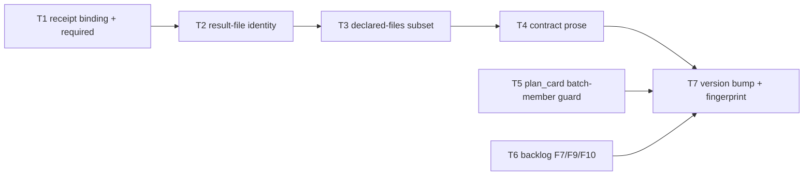

# Plan: Batch review hardening

Source brief: docs/loom/specs/2026-08-31-batch-review-hardening.md
Goal: Close the seven adversarial-audit findings (F1–F6, F8) with fail-closed
    refusals inside the existing batch-review adapter and ledger writer, each
    pinned by a RED test that is the audit's own reproduction, and write the
    result-file contract down — serves PURPOSE: a batch verdict must not ship
    a commit the reviewer never saw (a claim cannot ship unverified)
Stage: sdd:wave-1
Total tasks: 7
Critical-path depth: 5 (≤5)
Execution order: parallel-where-possible
Plan-document-reviewer verdict: PASS (2026-08-31, round 3)

## Task-flow diagram

## Open Questions

N/A — no unresolved question: every finding carries a reproduced attack and a named fix; the user chose the set (F1–F4 + F5/F6/F8) on 2026-08-31.

## Complexity assessment

- Added complexity: three comparison blocks in `_cmd_apply_result` (receipt identity, receipt member shas, result-file identity), one git subprocess in `build_packet`, one membership guard in `plan_card --set-status`, and one schema paragraph in conditional-operations.md.
- Why it is worthwhile: without them the batch path is strictly weaker than the per-task review it replaces — the audit finalized a commit no reviewer saw, replayed one PASS file across repos, and laundered a hand-set `done` through crash recovery; each closure is a comparison against data already persisted.
- Removed or avoided complexity: no signatures, key custody, batch state object, auto-redispatch, or configurable knobs; F7/F9/F10 are declined here and filed as backlog entries.
- Downstream risk: a stricter `apply-result` refuses more often (identity drift after a legitimate re-implementation), surfacing as a non-zero exit naming the drifted member — the orchestrator re-runs `packet` → `record-dispatch`; and `plan_card --set-status` now refuses `done(...)` on batch members, which surfaces at the orchestrator's ledger write, not silently.

## Task 1 — apply-result 綁定派工收據（identity＋member_shas），且 --receipt 必填
- **Description**: Make `_cmd_apply_result` refuse (non-zero exit, no ledger write, no receipt flip) unless the rebuilt packet is bound to the dispatch receipt, and make `apply-result --receipt` `required=True` so there is always a receipt to bind to.
  - Bound means: rebuilt `packet.identity` equals the receipt's stored `packet_identity`, and every member's rebuilt sha equals the receipt's `member_shas[member]`.
- **Module**: loom-code/scripts (batch_review_cli apply-result)
- **Files touched**: loom-code/scripts/batch_review_cli.py, loom-code/scripts/test_batch_review_cli.py
- **Context paths**:
  - loom-code/scripts/batch_review_cli.py (`def _cmd_apply_result`, `def _cmd_record_dispatch` — the `"member_shas": {` record, `apply_result.add_argument("--receipt")`)
  - loom-code/scripts/review_batch.py (`ReviewPacket.identity`, `member_shas`)
  - docs/loom/specs/2026-08-31-batch-review-hardening.md (§Current State Evidence — the F1/F6 attack shape)
- **Acceptance**:
  - **RED**: `test_apply_result_refuses_when_member_sha_drifted_after_dispatch` — packet + record-dispatch at member sha A, then the ledger is re-pointed to a second commit B and `apply-result --receipt <same receipt>` runs with a PASS result.
    - Today: exit 0 with `action: finalize`. After the fix: non-zero exit, plan text byte-identical to before the call, receipt `result_applied` still false.
  - **GREEN**: the drift case refuses naming the drifted member; a receipt whose `batch_id` or `packet_identity` belongs to another batch refuses (F6 case); `apply-result` without `--receipt` exits 2 from argparse (F3 case).
    - The existing finalize, reopen and recovery tests in `test_batch_review_cli.py` stay green with `--receipt` now supplied everywhere.
- **External surfaces**: stdlib only (`argparse`, `json`, `subprocess` via the existing `_run_subprocess`).
- **Dependencies**: none
- **Seam**: payload: none
- **Independent**: false
- **Brief item covered**: BI-1
- **Review disposition**: batch(apply-result-binding)
- **Status**: claimed(@implementer-t1)
- **Gloss**: 讓 reviewer 的 PASS 只能套在它當初看到的那組 commit 上；沒收據就不准套。

## Task 2 — apply-result 從結果檔讀 packet_identity 比對，CLI 不再自行注入
- **Description**: Read `packet_identity` from the result file's arm bindings, terminal results and blocking findings and compare each to the rebuilt packet's `identity`, refusing on mismatch or absence.
  - Stop passing `packet.identity` into the `ReviewerArmBinding` / `ReviewerTerminalResult` / `BlockingFinding` constructors — the file's own value is what gets constructed and checked.
- **Module**: loom-code/scripts (batch_review_cli apply-result result parsing)
- **Files touched**: loom-code/scripts/batch_review_cli.py, loom-code/scripts/test_batch_review_cli.py
- **Context paths**:
  - loom-code/scripts/batch_review_cli.py (`packet_identity=packet.identity` occurrences inside `_cmd_apply_result`)
  - loom-code/scripts/review_batch.py (`resolve_aggregate_review` identity checks, `ReviewerArmBinding`, `ReviewerTerminalResult`, `BlockingFinding` fields)
  - loom-code/scripts/task_batch_replay.py (produces result files — its emitted shape must carry `packet_identity` too)
- **Acceptance**:
  - **RED**: `test_apply_result_refuses_result_file_bound_to_another_packet` — a PASS result file whose `packet_identity` fields name a different packet (the F2 replay: same file, different plan) is applied with a valid receipt.
    - Today it finalizes; after the fix it exits non-zero with no ledger write and no receipt flip.
  - **GREEN**: a result file with matching `packet_identity` on every binding/result/finding finalizes as before; a result file omitting the field refuses with "reviewer result file is malformed"; `task_batch_replay.py`'s emitted result files carry the field and its own suite stays green.
- **External surfaces**: stdlib only.
- **Dependencies**: Task 1 completes first
- **Seam**:
  - from Task 1: payload: none
  - (ordering only: same function `_cmd_apply_result`; Task 2's comparison runs after Task 1's receipt check, and the two edits must not race)
- **Independent**: false
- **Brief item covered**: BI-2
- **Review disposition**: batch(apply-result-binding)
- **Status**: pending
- **Gloss**: 手寫或搬來的 PASS 檔換一個 plan 就失效；密封不再由 CLI 自己補上。

## Task 3 — build_packet 檢查成員 commit 實際改動檔案 ⊆ 宣告檔案
- **Description**: In `build_packet`, list each member commit's changed paths through `_run_subprocess` and refuse the packet when any changed path is not in that member's `declared_files`, mirroring the individual lane's self-check step 2.
  - Command: `git diff --name-only <sha>^ <sha>`; for a root commit fall back to `git diff-tree --no-commit-id --name-only -r <sha>`.
- **Module**: loom-code/scripts (batch_review_cli build_packet)
- **Files touched**: loom-code/scripts/batch_review_cli.py, loom-code/scripts/test_batch_review_cli.py
- **Context paths**:
  - loom-code/scripts/batch_review_cli.py (`def build_packet(`, `def _committed_bytes(`, `def _run_subprocess(` — the grounding-cite docstring convention)
  - loom-code/skills/subagent-driven-development/SKILL.md ("2. **Scope match.** `git diff --name-only`" — the individual-lane rule being mirrored)
  - loom-code/scripts/review_batch.py ("declared scope does not exactly match committed proof" — the existing proof⇄declared check this complements)
- **Acceptance**:
  - **RED**: `test_packet_refuses_member_commit_touching_undeclared_file` — a member commit that changes `src/1.py` and `src/backdoor.py` while declaring only `src/1.py`: today `packet` seals `src/1.py` alone; after the fix `packet` exits non-zero naming the member and the undeclared path.
  - **GREEN**: a member whose commit touches exactly its declared files seals as before; a root-commit member is handled without `<sha>^` erroring; the new subprocess call carries a grounding cite in its docstring like `_committed_bytes`.
- **External surfaces**: git CLI (`git diff --name-only`, `git diff-tree`) — already an accepted surface in this module via `_committed_bytes`; stdlib subprocess.
- **Dependencies**: Task 2 completes first
- **Seam**:
  - from Task 2: payload: none
  - (ordering only: same file, different function; sequential to avoid concurrent edits of `batch_review_cli.py`)
- **Independent**: false
- **Brief item covered**: BI-5
- **Review disposition**: individual
- **Status**: pending
- **Gloss**: 批次審查看得到成員 commit 偷改的檔案，不比逐任務審查弱。

## Task 4 — 結果檔格式與 ground_ref 逐字規則寫進契約；SKILL.md 改指向
- **Description**: Document the `--result-file` JSON shape and the verbatim-`ground_ref` rule in `references/conditional-operations.md` §Batch review and individual fallback, and repoint SKILL.md's call-contract paragraph at it.
  - Shape to document: `arm_bindings`, `terminal_results`, per-finding fields including `packet_identity` and `ground_ref`; `ground_ref` must equal the member's `owned_requirements` referent verbatim.
  - SKILL.md: reword the `--receipt` clause so it explains rather than gates (argparse gates after Task 1); state that reviewer authenticity is outside the CLI's seal.
- **Module**: loom-code/skills/subagent-driven-development (prose contract)
- **Files touched**: loom-code/skills/subagent-driven-development/references/conditional-operations.md, loom-code/skills/subagent-driven-development/SKILL.md, loom-code/scripts/test_sdd_batch_result_contract.py
- **Context paths**:
  - loom-code/skills/subagent-driven-development/SKILL.md ("The executable form of that sequence is the adapter CLI" paragraph; word count 4,277 — hard cap 4,500, so net growth must stay ≤ ~150 words)
  - loom-code/skills/subagent-driven-development/references/conditional-operations.md (`## Batch review and individual fallback`)
  - loom-code/scripts/batch_review_cli.py (`_cmd_apply_result` — the parsed keys are the schema to document, post Task 2)
  - docs/loom/plans/2026-08-31-contract-repair-post-v3.md (§Notes → Task 17 pilot record — the ground_ref lesson being promoted)
- **Acceptance**:
  - **RED**: `test_conditional_operations_documents_batch_result_file` — asserts the batch section of conditional-operations.md contains `arm_bindings`, `terminal_results`, `packet_identity`, `ground_ref` and the word "verbatim", and that SKILL.md's call-contract paragraph references `conditional-operations.md`.
    - Today the first four strings are absent (`grep -rn ground_ref loom-code/skills/` → 0 hits).
  - **GREEN**: the grep test passes; `wc -w` on SKILL.md ≤ 4,500; `check_contract_citations.py` exit 0; the `--receipt` sentence no longer reads as the enforcement of receipt presence.
- **External surfaces**: none.
- **Dependencies**: Task 2 completes first
- **Seam**:
  - from Task 2: payload: the result-file key set `_cmd_apply_result` parses after Task 2 (including `packet_identity`); owner: Task 2; probe: test_conditional_operations_documents_batch_result_file
- **Independent**: false
- **Brief item covered**: BI-6
- **Review disposition**: individual
- **Status**: pending
- **Gloss**: orchestrator 照文件就能寫出正確的結果檔，不會因猜錯格式退回逐任務審查。

## Task 5 — plan_card --set-status 對批次成員拒寫 done(...)
- **Description**: In `plan_card.py`'s `--set-status` path, before `_publish_cli_mutation`, consult `_review_batch_oracle()` and refuse (non-zero, file untouched) any `done(<sha>)` write to a task that `## Review Batches` declares as a member.
  - The refusal message names the batch id and points at `batch_review_cli.py apply-result` as the only writer of a member's `done`.
- **Module**: loom-code/scripts (plan_card set-status)
- **Files touched**: loom-code/scripts/plan_card.py, loom-code/scripts/test_plan_card_batch_states.py
- **Context paths**:
  - loom-code/scripts/plan_card.py (`def _review_batch_oracle():`, `if set_status_ref is not None:`, `def atomic_batch_status_update`)
  - loom-code/scripts/check_review_batches.py (the oracle's projection: batch id → members)
  - loom-code/scripts/test_plan_card_batch_states.py (existing fixtures for batch-declaring plans)
- **Acceptance**:
  - **RED**: `test_set_status_refuses_done_for_declared_batch_member` — a plan declaring Task 1 in `Review Batch: b1`, `plan_card.py <plan> --set-status 1 "done(<40-hex>)"`: today exit 0 and the ledger line flips; after the fix exit non-zero, plan bytes unchanged, stderr names `b1` and `apply-result`.
  - **GREEN**: `--set-status` to `implemented(<sha>)` on a batch member still succeeds; `done(...)` on an `individual` task still succeeds; `atomic_batch_status_update` under `transition_authority` still writes `done(...)` for members; existing plan_card suites stay green.
- **External surfaces**: stdlib only.
- **Reuse-adequacy**:
  - **Observed**: `_review_batch_oracle()` loads the sibling `check_review_batches.py` module by file path and returns it; its only caller today is `_validated_batch_snapshot`, which calls `oracle.execution_projection_fields(text, batch_id)` to obtain a declared batch's exact member task numbers after the oracle accepts the plan — read loom-code/scripts/plan_card.py:680
  - **Intended**: the `--set-status` path first reads the target task's own `Review disposition:` line from the plan text; when it is `batch(<id>)` and the requested status is `done(<sha>)`, it calls `oracle.execution_projection_fields(text, <id>)` once with that single id and refuses the write when the task number appears in the returned `members` — and also refuses when the oracle raises `ValueError` (unknown batch or invalid schema), fail-closed. A task whose disposition is `individual`, or a plan with no `## Review Batches` section, never reaches the oracle call, so individual-only plans are unaffected.
- **Dependencies**: none
- **Seam**: payload: none
- **Independent**: true
- **Brief item covered**: BI-4
- **Review disposition**: individual
- **Status**: claimed(@implementer-t5)
- **Gloss**: 批次成員的 done 只能由 apply-result 寫，手標會被擋，崩潰恢復因此可信。

## Task 6 — F7／F9／F10 立 backlog 三條
- **Description**: Write three `status: open` backlog entries for the declined audit findings, each with `origin:` naming the 2026-08-31 audit and a `start:` event, then regenerate the index.
  - F7: an orphan dispatch receipt jams a batch and `result_applied` is an unsigned flag.
  - F9: `ready` and the plan checker accept plans that `packet` later refuses (duplicate referents, `none —` members).
  - F10: `task_batch_replay.py` reads declared, not observed, dispatch counts; the pilot is n=1 without a reopen cycle.
- **Module**: docs/loom/backlog (store)
- **Files touched**: docs/loom/backlog/2026-08-31-orphan-dispatch-receipt-jams-batch.md, docs/loom/backlog/2026-08-31-batch-ready-accepts-what-packet-refuses.md, docs/loom/backlog/2026-08-31-batch-cost-numbers-are-declared-not-observed.md, docs/loom/BACKLOG.md
- **Context paths**:
  - docs/loom/backlog/2026-08-30-task-review-packets-lack-requirement-ownership.md (entry shape)
  - docs/loom/BACKLOG.md (entry format header)
  - docs/loom/specs/2026-08-31-batch-review-hardening.md (§Out of Scope — the three findings' one-line statements)
- **Acceptance**:
  - **RED**: `python3 scripts/backlog_index.py --ready` lists the three new entries under `## open` — today it lists two open entries, neither of them these.
  - **GREEN**: `python3 scripts/backlog_index.py --validate` exits 0, `--write` regenerates `docs/loom/BACKLOG.md` byte-stably on a second run, and each entry carries `status: open` plus a `start: event —` line.
- **External surfaces**: none.
- **Dependencies**: none
- **Seam**: payload: none
- **Independent**: true
- **Brief item covered**: BI-11
- **Review disposition**: individual
- **Status**: claimed(@implementer-t6)
- **Gloss**: 三條沒修的發現有案可查，不會被遺忘。

## Task 7 — loom-code 版本 bump 0.106.0→0.107.0＋dogfood 指紋刷新
- **Description**: Bump loom-code to 0.107.0 on every version surface and refresh the dogfood record's `loom-code candidate SHA-256` line at this task's HEAD.
  - Surfaces: `.claude-plugin/plugin.json`, `.codex-plugin/plugin.json`, `CHANGELOG.md` (entry summarising Tasks 1–5), the version-pin test; fingerprint via `_tracked_worktree_fingerprint('loom-code')`.
- **Module**: loom-code (version surfaces) + docs/loom/dogfood (fingerprint)
- **Files touched**: loom-code/.claude-plugin/plugin.json, loom-code/.codex-plugin/plugin.json, loom-code/CHANGELOG.md, loom-code/scripts/test_docs_review_blocking_class.py, docs/loom/dogfood/2026-08-27-stage-specific-complexity-gates.md
- **Context paths**:
  - scripts/check_version_bump.py, scripts/sync_codex_manifests.py
  - scripts/test_stage_specific_complexity_behavior_evidence.py (`_tracked_worktree_fingerprint`)
  - docs/loom/memory/loom-code-content-commits-owe-the-dogfood-package-fingerprint-refresh.md
- **Acceptance**:
  - **RED**: `python3 scripts/check_version_bump.py` exits non-zero on the branch diff (loom-code content changed, version unchanged) and `test_report_binds_baseline_and_final_candidate` fails on the stale fingerprint.
  - **GREEN**: `check_version_bump.py` exit 0, `sync_codex_manifests.py --check` exit 0, full floor `python3 -m pytest loom-code/scripts/ scripts/ -q` 0 failures.
- **External surfaces**: none.
- **Dependencies**: Tasks 4, 5, 6 complete first
- **Seam**:
  - from Task 4: payload: none
  - from Task 5: payload: none
  - from Task 6: payload: none
  - (ordering only: the fingerprint and CHANGELOG entry must see the final tree, including Task 4's prose and Task 5's plan_card.py bytes)
- **Independent**: false
- **Brief item covered**: none — release administration (version bump + fingerprint refresh) delivers no brief outcome
- **Review disposition**: individual
- **Status**: pending
- **Gloss**: 版本與指紋收尾，讓 plugin update 拿得到修好的版本。

## Review Batches

### Review Batch: apply-result-binding
- **Members**: Task 1, Task 2
- **Verdict question**: Does `apply-result` now refuse everything not bound to the dispatched packet — a drifted member sha, a foreign receipt, a missing receipt, and a result file whose packet identity is absent or belongs to another packet — with no ledger write and no receipt flip on refusal, each pinned by a RED test that reproduces the audit's attack?
- **Review lane**: full
- **Aggregate verification**: inert description — run the batch CLI test module and confirm the four new refusal tests plus the pre-existing finalize, reopen and recovery tests pass, then re-run the audit's F1 and F2 reproduction steps against the fixed CLI and observe non-zero exits.
- **Boundary**: capability: batch-review apply-result binding; exclusions: none; consumable: yes

## Notes

- Change-folder binding: none — no non-archived `docs/loom/<change-id>/` folder matches branch `batch-review-hardening`, and the caller handed a brainstorming brief; the plan derives from the brief (BI- ids).
- BI-7 (each closure lands with a RED test) is cross-cutting: every task's Acceptance RED is the audit's reproduction step, so no single task is its primary referent. BI-3 (`--receipt` required) is delivered inside Task 1 (its GREEN names the argparse case) because the receipt comparison presupposes a receipt; Task 1's primary referent stays BI-1 per the tie-break rule. BI-8 (Decision umbrella) is the sum of Tasks 1–5; BI-9 and BI-10 (What Becomes Obsolete) are delivered by Task 4's rewording and by the contract superseding the pilot Notes. The coverage checker reports these five as warnings, not errors, by design.
- Plan-review round count: round 1 🔴 (Task 5 lacked `Reuse-adequacy`), round 2 🔴 (the round-2 `Intended` slot claimed an all-batches oracle call that does not exist — a defect the revision itself introduced). Round 3 was run past writing-plans' two-round cap because the round-2 finding was a wording defect in the revision, not a brief defect (the cap's stated reason); recorded here so the deviation is visible.
- Review disposition rationale: Tasks 1–2 share one verdict question and one file; Task 3 is a different function with its own git-surface risk and stays individual; Task 4 is prose lane; Tasks 5–7 are separate modules.
