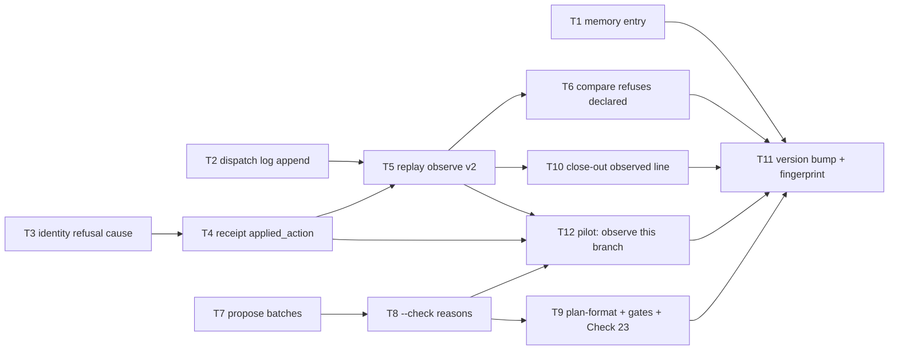

# Plan: Batch review measurement and nudge

Source brief: docs/loom/specs/2026-08-31-batch-review-measurement-and-nudge.md
Goal: Every reviewer fan-out leaves a harness-written record, the replay
    harness consumes those records and refuses typed ones, a plan that leaves
    same-module tasks unbatched or declares a batch larger than four must
    say why, and the packet-identity refusal names its cause — serves
    PURPOSE: a cost claim about review cannot ship unverified, and a
    silent conservative default must pay for itself in one sentence
Stage: sdd:wave-1
Total tasks: 12
Critical-path depth: 5 (≤5)
Execution order: parallel-where-possible
Plan-document-reviewer verdict: PASS (2026-08-31, round 2)

## Task-flow diagram

## Open Questions

N/A — no unresolved question: the edge rule (module), the cap (4), the untracked log, and the no-automatic-fallback rule were each decided by kouko on 2026-08-31 during brainstorming.

## Complexity assessment

- Added complexity: one append in `review_context.py`; one new key in the dispatch receipt; an `observe` subcommand and a `v2` result schema in `task_batch_replay.py`; one new script `propose_review_batches.py` (propose + `--check`); two plan fields, one reviewer check row, one writing-plans gate line, one close-out row.
- Why it is worthwhile: the only existing cost number was typed by hand; after this arc the number is recorded by the harness at the contractual once-per-fan-out call, and the planner's silent choice not to batch — the reason −19% was all the strict rule ever reached — must be written down where the reviewer reads it.
- Removed or avoided complexity: `task-batch-replay-result/v1` stops being an accepted comparison input; no automatic fallback, no runtime batch size setting, no arm changes; the edge rule and cap are two constants in one script.
- Downstream risk: a sealed batch packet freezes this plan's bytes, so any ledger flip or Notes edit between `packet` and `apply-result` — Task 12's edit, or a non-member `done` flip — trips the identity refusal Task 3 rewords; the orchestrator holds all plan writes while a packet is sealed (accepted, discipline not mechanism); a plan authored before this arc has no `Not batched because` lines and would fail the new check — the check applies only to plans whose header postdates the gate (it keys on the `## Review Batches` section plus a `Total tasks:` header, both present in every batch-era plan; older plans are not re-reviewed); a worktree removed before close-out loses its log — the close-out row prints N/A loudly.

## Task 1 — 補 #769 欠的 memory 條目：非 ASCII 路徑跨程序邊界兩次
- **Description**: Add `docs/loom/memory/a-non-ascii-path-crosses-the-process-boundary-twice.md` (type gotcha) and regenerate the store index.
  - Content: pipes decode with the locale encoding while argv encodes with the filesystem encoding; fixing one says nothing about the other; only Linux under a C locale exposes the argv half.
- **Module**: docs/loom/memory (store)
- **Files touched**: docs/loom/memory/a-non-ascii-path-crosses-the-process-boundary-twice.md, docs/loom/memory/README.md
- **Context paths**:
  - docs/loom/memory/a-sealed-review-packet-freezes-the-whole-plan-file-until-apply-result.md (entry shape, frontmatter fields)
  - docs/loom/memory/README.md (§When to record, §Index invariant)
  - loom-code/scripts/batch_review_cli.py (`_run_subprocess` docstring — the two crossings, argv as bytes)
- **Acceptance**:
  - **RED**: `python3 scripts/check_loom_memory_integrity.py` reports the new file has no index line the moment it is written (the PostToolUse hook fires the same check); before the entry exists, `grep -l "process boundary twice" docs/loom/memory/*.md` is empty.
  - **GREEN**: `python3 scripts/check_loom_memory_integrity.py` exit 0 after `--write`; the entry's `description` names both encodings and the Linux-only reachability; `origin:` cites #769.
- **External surfaces**: none.
- **Dependencies**: none
- **Seam**: payload: none
- **Independent**: true
- **Brief item covered**: BI-6
- **Review disposition**: individual
- **Status**: done(a0a6f10f9b28ceb216da22596e435aedf2f6adc3)
- **Gloss**: 把 hotfix 學到的教訓寫進持久記憶，下次不用再在 CI 上發現。

## Task 2 — review_context.py 每次派工在 git-dir 追加一行記錄
- **Description**: In `review_context.py` `main`, after a successful `resolve_context` (never on `--validate`), append one JSON line to `<git-dir>/loom/review-dispatches.jsonl`; stdout is byte-identical to today.
  - Line shape: `{"schema": "review-dispatch-log/v1", "recorded_at": <UTC ISO>, "branch": <symbolic-ref short name or "DETACHED">, "reviewed_sha": …, "plugin_version": …}`; the directory is created as `loom_gate_markers.py` does.
  - The git dir is resolved with `git rev-parse --git-dir` relative to `--repo` (the idiom in `loom_gate_markers.py`), so a worktree logs into its own git dir; an append failure (read-only dir) is reported on stderr and does not change the exit code — the packet still prints.
- **Module**: loom-code/scripts (review_context)
- **Files touched**: loom-code/scripts/review_context.py, loom-code/scripts/test_review_context.py
- **Context paths**:
  - loom-code/scripts/review_context.py (`def main`, `def resolve_context`, `_git`)
  - loom-code/scripts/loom_gate_markers.py (`"""Return \`<git-dir>/loom\` for \`repo\`, or None if not a git repo."""` — the directory idiom to mirror)
  - loom-code/scripts/test_review_context.py (existing fixtures building a git repo and calling `main`)
- **Acceptance**:
  - **RED**: `test_main_appends_one_dispatch_log_line_per_invocation` — run `main(["--repo", repo])` twice on a fixture repo on branch `feat/x`; today no file exists under `<git-dir>/loom/`.
    - After the fix the log has exactly two lines, each parsing to the schema above with `branch == "feat/x"` and `reviewed_sha == HEAD`.
  - **GREEN**: `main(["--validate", packet])` appends nothing; stdout of `--repo` is unchanged (existing `test_review_context.py` assertions on the printed packet stay green); a detached HEAD logs `branch: "DETACHED"`.
    - The docstring carries the grounding cite for `git rev-parse --git-dir` (git-rev-parse(1)) and names the SDD "once per reviewer fan-out" contract as the reason this is the observation point.
- **External surfaces**: git CLI (`rev-parse --git-dir`, `symbolic-ref --short HEAD`) via the module's existing `_git` helper; stdlib json/datetime.
- **Dependencies**: none
- **Seam**: payload: none
- **Independent**: true
- **Brief item covered**: BI-1
- **Review disposition**: individual
- **Status**: done(b8e9c733b7e811e9cebddc945ffc6553a377f2d3)
- **Gloss**: 派工發生的那一刻自動留一行紀錄，沒人需要手填。

## Task 3 — identity 拒絕訊息分辨「成員變了」與「plan 其他文字變了」
- **Description**: In `_bind_receipt_to_packet`, when every member sha still equals the receipt's `member_shas` but `packet_identity` differs, refuse with a message that names the cause and the recovery.
  - Message: the plan text changed outside the batch members (ledger flip or notes edit); recovery: re-seal (`packet`), re-record the dispatch, rebind the unchanged reviewer results. The existing per-member "drifted after dispatch" message stays for the sha case.
- **Module**: loom-code/scripts (batch_review_cli apply-result binding)
- **Files touched**: loom-code/scripts/batch_review_cli.py, loom-code/scripts/test_batch_review_cli.py
- **Context paths**:
  - loom-code/scripts/batch_review_cli.py (`def _bind_receipt_to_packet`, anchor `packet_identity does not match the rebuilt packet`)
  - loom-code/skills/subagent-driven-development/references/conditional-operations.md (§Result file — the recovery sentence the message must agree with)
  - loom-code/scripts/test_batch_review_cli.py (`test_apply_result_refuses_when_member_sha_drifted_after_dispatch`, `_recorded_dispatch_receipt`)
- **Acceptance**:
  - **RED**: `test_apply_result_names_plan_text_drift_when_members_unchanged` — packet + record-dispatch, then append a Notes line to the plan (no ledger change), then `apply-result`: today the reason is the generic "packet_identity does not match".
    - After the fix the reason contains "changed outside the batch members" and "re-seal"; exit stays non-zero; plan bytes and receipt unchanged.
  - **GREEN**: the member-drift test still yields the "drifted after dispatch" message naming the member; the ordering docstring gains the new branch with its cite (the conditional-operations.md recovery paragraph).
- **External surfaces**: stdlib only.
- **Dependencies**: none
- **Seam**: payload: none
- **Independent**: false
- **Brief item covered**: BI-4
- **Review disposition**: batch(cli-receipt)
- **Status**: implemented(fef328581d510398528e616daaef982103c20909)
- **Gloss**: 被拒時一眼看出是誰動了什麼，照訊息做就能復原。

## Task 4 — apply-result 把套用的動作寫進收據（applied_action）
- **Description**: When `apply-result` flips a receipt to `result_applied: true`, also write `applied_action` (`finalize` or `reopen`, the resolution's action) into the same receipt dict, so an observer can count reopens from receipts alone.
  - `_read_dispatch_receipt` tolerates the key's absence (older receipts); `_bind_receipt_to_packet`'s already-applied refusal quotes it when present.
- **Module**: loom-code/scripts (batch_review_cli receipt)
- **Files touched**: loom-code/scripts/batch_review_cli.py, loom-code/scripts/test_batch_review_cli.py
- **Context paths**:
  - loom-code/scripts/batch_review_cli.py (`_cmd_apply_result` flip block — anchor `stored["result_applied"] = True`; `_read_dispatch_receipt`; `_recover_settled_receipt`)
  - loom-code/scripts/review_batch.py (`resolve_aggregate_review` resolution `action` values)
- **Acceptance**:
  - **RED**: `test_apply_result_records_applied_action_in_receipt` — after a finalize the receipt JSON has `applied_action == "finalize"`; after a reopen (existing reopen fixture) `applied_action == "reopen"`; today the key is absent.
  - **GREEN**: a receipt without the key still reads and recovers (existing recovery tests green); `individual_fallback` and `wait_refuse` leave the receipt untouched (no key written).
- **External surfaces**: stdlib only.
- **Dependencies**: Task 3 completes first
- **Seam**:
  - from Task 3: payload: none
  - (ordering only: same file; Task 3 edits the bind function, Task 4 the flip block)
- **Independent**: false
- **Brief item covered**: BI-2
- **Review disposition**: batch(cli-receipt)
- **Status**: implemented(dcf936bda342b7e2087a6b3cc7cb98f04eec5cfd)
- **Gloss**: 收據記下「這批最後是通過還是退回」，reopen 次數就能算。

## Task 5 — task_batch_replay.py observe：從 log 與收據產出 v2 結果檔
- **Description**: Add subcommand `observe --log <jsonl> --branch <name> --corpus <corpus> --out <result> [--receipts <dir>]` that writes a `task-batch-replay-result/v2` file from the dispatch log and receipts.
  - v2 = the v1 case shape plus top-level `provenance: "observed"` and per-case `batch_reopens`.
  - Counts: `review_dispatches` = log lines whose `branch` matches; `review_rounds` = distinct `reviewed_sha` among them; `batch_reopens` = receipts under `--receipts` with `applied_action == "reopen"` (0 without the flag).
  - Log lines are parsed with a shared reader `read_dispatch_log(path)` that validates each line against the `review-dispatch-log/v1` schema Task 2 writes (malformed line → non-zero exit naming the line number); the corpus's single case receives the counts (multi-case attribution is out of scope).
  - `--summary` (makes `--corpus`/`--out` optional) prints exactly one line `observed reviewer fan-outs: N (rounds R, batch reopens B)` and writes no result file — the line the finishing close-out row (Task 10) relays.
- **Module**: loom-code/scripts (task_batch_replay observe)
- **Files touched**: loom-code/scripts/task_batch_replay.py, loom-code/scripts/test_task_batch_replay.py
- **Context paths**:
  - loom-code/scripts/task_batch_replay.py (`RESULT_SCHEMA`, `_RESULT_CASE_KEYS`, `_validate_result_case`, `subparsers.add_parser`)
  - loom-code/scripts/review_context.py (post Task 2 — the log line schema and its writer)
  - loom-code/scripts/batch_review_cli.py (post Task 4 — `applied_action` in the receipt)
- **Acceptance**:
  - **RED**: `test_observe_counts_dispatches_rounds_and_reopens_from_log_and_receipts` — a log with 3 lines for branch `b` (2 distinct shas) plus 1 line for branch `other`, and a receipts dir with one `applied_action: reopen` and one `finalize`: today the subcommand does not exist.
    - After the fix the result file has `review_dispatches == 3`, `review_rounds == 2`, `batch_reopens == 1`, `provenance == "observed"`, schema v2.
  - **GREEN**: a malformed log line refuses naming the line; `--receipts` omitted → `batch_reopens == 0`; `read_dispatch_log` is the only parser of the log in the module; `observe … --summary` on the same fixture prints exactly `observed reviewer fan-outs: 3 (rounds 2, batch reopens 1)` and writes no result file.
- **External surfaces**: stdlib only.
- **Dependencies**: Tasks 2, 4 complete first
- **Seam**:
  - from Task 2: payload: the `review-dispatch-log/v1` line shape; owner: Task 2; probe: test_observe_counts_dispatches_rounds_and_reopens_from_log_and_receipts
  - from Task 4: payload: the receipt's `applied_action` key; owner: Task 4; probe: test_observe_counts_dispatches_rounds_and_reopens_from_log_and_receipts
- **Independent**: false
- **Brief item covered**: BI-2
- **Review disposition**: batch(replay-observed)
- **Status**: pending
- **Gloss**: 從紀錄算出派工數、輪數、退回數——數字不再是人打的。

## Task 6 — compare 拒收 v1 或非 observed 的結果檔
- **Description**: `compare` refuses (non-zero exit, message naming the offending file and field) any baseline or candidate whose schema is `task-batch-replay-result/v1` or whose `provenance` is not `"observed"`.
  - The v2 validator becomes the only accepted result reader for `compare`; `saved_review_dispatches` and the PASS rule are unchanged otherwise.
- **Module**: loom-code/scripts (task_batch_replay compare)
- **Files touched**: loom-code/scripts/task_batch_replay.py, loom-code/scripts/test_task_batch_replay.py
- **Context paths**:
  - loom-code/scripts/task_batch_replay.py (`def compare`, `_validate_result_case`, anchor `"no_review_dispatch_reduction"`)
  - docs/loom/plans/2026-08-31-contract-repair-post-v3.md (§Notes → Task 17 pilot record — the v1 shape that must now be refused; read-only history)
- **Acceptance**:
  - **RED**: `test_compare_refuses_declared_v1_results` — feeding the existing v1 fixtures (the pilot shape) to `compare`: today PASS; after the fix non-zero with a message naming `schema` / `provenance`.
  - **GREEN**: two `observe`-produced v2 files compare exactly as v1 did (existing compare assertions ported to v2 fixtures stay green); a v2 file hand-edited to `provenance: "declared"` refuses.
- **External surfaces**: stdlib only.
- **Dependencies**: Task 5 completes first
- **Seam**:
  - from Task 5: payload: none
  - (ordering only: same file; Task 6 gates on the v2 schema Task 5 introduced — both read the module's own validator)
- **Independent**: false
- **Brief item covered**: BI-9
- **Review disposition**: batch(replay-observed)
- **Status**: pending
- **Gloss**: 手填數字的比較從此跑不過。

## Task 7 — propose_review_batches.py：模組規則聚類、上限 4、依賴序切批
- **Description**: New script `loom-code/scripts/propose_review_batches.py <plan>` that proposes review batches for a plan under the module rule and prints them as JSON.
  - Parse tasks with `check_review_batches.py`'s parsers (lane, dependencies, `Module`, `Files touched`); build an undirected graph over non-mechanical tasks with an edge when two tasks share a review lane AND (have a direct Dependencies edge OR an identical `Module` value).
  - Split each connected component into batches of at most 4 tasks filled in dependency (topological) order; output `{"batches": [{"members": [...], "lane": …, "reason": "module:<value>" | "dependency"}], "singletons": [...]}`.
  - The edge rule and the cap are two module-level constants with a docstring naming the simulation record they were sized from and stating they are planning-time constants, not runtime settings.
- **Module**: loom-code/scripts (propose_review_batches)
- **Files touched**: loom-code/scripts/propose_review_batches.py, loom-code/scripts/test_propose_review_batches.py, loom-code/scripts/test_gate_scripts_fail_loud_on_unreadable_input.py
- **Context paths**:
  - loom-code/scripts/check_review_batches.py (`def _parse_tasks`, `def _projection_files`, `_projection_field_block` — reuse, do not re-implement the grammar)
  - docs/loom/dogfood/2026-08-31-batch-knob-simulation.py (the clustering the simulation ran — the proposer must reproduce variant C at cap 4 on the same input)
  - docs/loom/dogfood/2026-08-31-batch-knob-simulation-per-plan.csv (column `fanouts_c_module_cap4` — variant C, the module rule at cap 4; the us-sec xval plan's value is 5)
- **Acceptance**:
  - **RED**: `test_propose_reproduces_simulation_on_us_sec_xval_plan` — running the proposer on `docs/loom/plans/2026-07-13-us-sec-financial-table-xval.md` yields `len(batches) + len(singletons) == 5`, the `fanouts_c_module_cap4` value the simulation CSV records for that plan; today the script does not exist.
  - **GREEN**: a 5-task same-module component splits 4+1 in dependency order (a task never precedes one of its dependencies in a later batch); mechanical tasks are excluded; two tasks with different lanes never share a batch; a plan with no `Module` lines still clusters by dependency edges.
- **External surfaces**: stdlib only.
- **Reuse-adequacy**:
  - **Observed**: `_parse_tasks(text, errors)` slices the plan into per-Task blocks by heading, appends schema errors (missing Task headings, missing or misplaced `## Review Batches`, duplicate numbers) and returns `dict[int, Task]`; `_projection_files(value, owner, errors)` turns one `Files touched` value into a tuple of safe, de-duplicated repo-relative paths, appending an error and returning `()` on an unsafe list — both exist to validate a declared batch's projection, not to cluster — read loom-code/scripts/check_review_batches.py:156 and read loom-code/scripts/check_review_batches.py:382
  - **Intended**: the proposer imports the sibling module by file path (as `plan_card.py`'s `_review_batch_oracle()` does), calls `_parse_tasks` once on the plan text and reads each `Task`'s lane, dependencies, `Module` and `Files touched` from the returned objects to build the clustering graph; it never re-implements the heading or field grammar, and it treats a non-empty `errors` list as a refusal (non-zero exit naming the errors) rather than clustering a plan the oracle would reject.
- **Dependencies**: none
- **Seam**: payload: none
- **Independent**: true
- **Brief item covered**: BI-3
- **Review disposition**: batch(proposer)
- **Status**: implemented(441c9ecfc429fbb6a088ba965560738234a67e59)
- **Gloss**: 腳本先提議怎麼分批，規劃者從提議出發而不是從全拆出發。

## Task 8 — propose_review_batches.py --check：沒合批與超大批次都要一行理由
- **Description**: Add `--check` mode that exits non-zero on the two deviations from the proposal the brief names, listing each violation with its task or batch ids on stdout.
  - (a) a proposed pair (two tasks in the same proposed batch) is not in the same declared batch and the later task (by task number) lacks a `- **Not batched because**: <non-empty reason>` line.
  - (b) a declared batch has more than 4 members and lacks a `- **Oversized because**: <non-empty reason>` line in its `### Review Batch:` block.
- **Module**: loom-code/scripts (propose_review_batches check)
- **Files touched**: loom-code/scripts/propose_review_batches.py, loom-code/scripts/test_propose_review_batches.py
- **Context paths**:
  - loom-code/scripts/propose_review_batches.py (post Task 7 — the proposal structure)
  - loom-code/scripts/check_review_batches.py (`_parse_batches`, `_review_batch_body` — declared batches and their blocks)
  - loom-code/scripts/check_open_questions.py (the exit-code and message style of sibling plan gates)
- **Acceptance**:
  - **RED**: `test_check_flags_unbatched_proposed_pair_without_reason` — a plan where T1/T2 share lane and Module but both declare `individual` with no reason: today no `--check`; after the fix non-zero naming "Task 1, Task 2".
    - Adding `- **Not batched because**: separate release points` to Task 2 makes it exit 0.
  - **GREEN**: a declared 5-member batch without `Oversized because` exits non-zero naming the batch id, with the line exits 0; a plan whose declared batches equal the proposal exits 0; the two new field names are exported as constants so Task 9's prose test can import them.
- **External surfaces**: stdlib only.
- **Dependencies**: Task 7 completes first
- **Seam**:
  - from Task 7: payload: none
  - (ordering only: same script; `--check` consumes the in-process proposal, no serialized shape crosses)
- **Independent**: false
- **Brief item covered**: BI-3
- **Review disposition**: batch(proposer)
- **Status**: pending
- **Gloss**: 保守不再免費：不合批要說為什麼，合太大也要說為什麼。

## Task 9 — plan-format 兩個欄位、writing-plans 閘門行、reviewer Check 23
- **Description**: Write the two new plan fields, the writing-plans gate line and the reviewer check that make the proposer part of the planning contract.
  - plan-format.md §Review Batches: `Not batched because` and `Oversized because` (grammar, placement, the cap of 4 as a planning-time constant).
  - writing-plans SKILL.md: one gate line running `python3 loom-code/scripts/propose_review_batches.py --check <plan-path>` before review, and one sentence making `propose` the second pass's starting point.
  - plan-document-reviewer-prompt.md: Check 23, the reciprocal of Check 10 (run `--check`; a violation is a gap).
  - Word budget: writing-plans SKILL.md is at 4,114 words (cap 4,500) — net growth ≤ 120 words; put grammar in plan-format.md, not SKILL.md.
- **Module**: loom-code/skills/writing-plans (prose contract)
- **Files touched**: loom-code/skills/writing-plans/references/plan-format.md, loom-code/skills/writing-plans/SKILL.md, loom-code/skills/writing-plans/references/plan-document-reviewer-prompt.md, loom-code/scripts/test_writing_plans_batch_nudge_contract.py
- **Context paths**:
  - loom-code/skills/writing-plans/SKILL.md (the `**Review-Batch gate (unconditional):**` paragraph and the "Review grouping is a second pass" paragraph)
  - loom-code/skills/writing-plans/references/plan-format.md (§Review Batches — "Grouping is eligible only when")
  - loom-code/skills/writing-plans/references/plan-document-reviewer-prompt.md (Check 10 row, Check 22 row — the table shape)
  - loom-code/scripts/propose_review_batches.py (post Task 8 — the exported field-name constants)
- **Acceptance**:
  - **RED**: `test_writing_plans_documents_batch_nudge_fields_and_gate` — asserts plan-format.md contains both field names (imported from the script's constants), SKILL.md's gate list names `propose_review_batches.py --check`, and the reviewer prompt has a `| 23 |` row mentioning it; today all three absent.
  - **GREEN**: `wc -w` SKILL.md ≤ 4,500; `python3 loom-code/scripts/check_contract_citations.py` exit 0; no runtime prose cites this repo's docs/ (the simulation record is cited from the script docstring only, `.py` provenance exemption).
- **External surfaces**: none.
- **Dependencies**: Task 8 completes first
- **Seam**:
  - from Task 8: payload: the two field-name constants and the `--check` CLI contract; owner: Task 8; probe: test_writing_plans_documents_batch_nudge_fields_and_gate
- **Independent**: false
- **Brief item covered**: BI-3
- **Review disposition**: batch(proposer)
- **Status**: pending
- **Gloss**: 規劃者和 reviewer 讀的契約裡有這兩個欄位和這一道閘。

## Task 10 — finishing 收尾卡片印 observed reviewer fan-outs 並蓋進 plan Notes
- **Description**: Add one close-out sub-check row to finishing-a-development-branch that prints the branch's observed reviewer fan-outs from the dispatch log and stamps the line into the plan's `## Notes` before the close-out commit.
  - Mechanism: the row runs `python3 loom-code/scripts/task_batch_replay.py observe --log <git-dir>/loom/review-dispatches.jsonl --branch <branch> --summary` (the flag ships in Task 5) and relays its one line verbatim.
  - Absent log → the row prints `observed reviewer fan-outs: N/A — no dispatch log` loudly, never silently.
  - Word budget: finishing SKILL.md is at 4,025 words — net growth ≤ 80 words.
- **Module**: loom-code/skills/finishing-a-development-branch (prose contract)
- **Files touched**: loom-code/skills/finishing-a-development-branch/SKILL.md, loom-code/scripts/test_finishing_observed_fanouts_contract.py
- **Context paths**:
  - loom-code/skills/finishing-a-development-branch/SKILL.md (close-out sub-checks table — the `Stale-scan relay` row as the shape to copy)
  - loom-code/scripts/task_batch_replay.py (post Task 5 — `observe --summary`, the exact line format)
- **Acceptance**:
  - **RED**: `test_finishing_documents_observed_fanouts_row` — the SKILL.md close-out table has a row naming `review-dispatches.jsonl`, the `--summary` invocation and the N/A line (today absent).
  - **GREEN**: `wc -w` finishing SKILL.md ≤ 4,500; `check_contract_citations.py` exit 0; the row's invocation string matches the argv Task 5 accepts (the contract test runs it against an empty temp log and expects the N/A line).
- **External surfaces**: none.
- **Dependencies**: Task 5 completes first
- **Seam**:
  - from Task 5: payload: the `observe --summary` argv contract and its one-line format; owner: Task 5; probe: test_finishing_documents_observed_fanouts_row
- **Independent**: false
- **Brief item covered**: BI-5
- **Review disposition**: batch(replay-observed)
- **Status**: pending
- **Gloss**: 每個弧收尾時都印出真實的派工次數，並留在 plan 裡。

## Task 11 — loom-code 版本 bump 0.107.1→0.108.0＋dogfood 指紋刷新
- **Description**: Bump loom-code to 0.108.0 on every version surface and refresh the dogfood record's `loom-code candidate SHA-256` line at this task's HEAD.
  - Surfaces: `.claude-plugin/plugin.json`, `.codex-plugin/plugin.json`, `CHANGELOG.md` (entry summarising Tasks 1–10, citing the simulation record), the version-pin test; fingerprint via `_tracked_worktree_fingerprint('loom-code')`; `sync_codex_manifests.py` for the mirror.
- **Module**: loom-code plugin manifest (version surfaces; the dogfood fingerprint line rides the same release commit)
- **Files touched**: loom-code/.claude-plugin/plugin.json, loom-code/.codex-plugin/plugin.json, loom-code/CHANGELOG.md, loom-code/scripts/test_docs_review_blocking_class.py, docs/loom/dogfood/2026-08-27-stage-specific-complexity-gates.md
- **Context paths**:
  - scripts/check_version_bump.py, scripts/sync_codex_manifests.py
  - scripts/test_stage_specific_complexity_behavior_evidence.py (`_tracked_worktree_fingerprint`)
  - docs/loom/memory/loom-code-content-commits-owe-the-dogfood-package-fingerprint-refresh.md
- **Acceptance**:
  - **RED**: `python3 scripts/check_version_bump.py` non-zero on the branch diff and `test_report_binds_baseline_and_final_candidate` red on the stale fingerprint.
  - **GREEN**: `check_version_bump.py` exit 0, `sync_codex_manifests.py --check loom-code` exit 0, full floor `python3 -m pytest loom-code/scripts/ scripts/ -q` 0 failures.
- **External surfaces**: none.
- **Dependencies**: Tasks 1, 6, 9, 10, 12 complete first
- **Seam**:
  - from Task 1: payload: none
  - from Task 6: payload: none
  - from Task 9: payload: none
  - from Task 10: payload: none
  - from Task 12: payload: none
  - (ordering only: the fingerprint and CHANGELOG must see the final tree)
- **Independent**: false
- **Brief item covered**: none — release administration (version bump + fingerprint refresh) delivers no brief outcome
- **Review disposition**: individual
- **Status**: pending
- **Gloss**: 版本與指紋收尾，plugin update 拿得到新機制。

## Task 12 — Pilot：用本分支自己的派工紀錄跑 observe，並對本 plan 跑 propose
- **Description**: Run the new observer and proposer on this arc's own artifacts and record the outcome in this plan's `## Notes` — the first harness-observed number.
  - `task_batch_replay.py observe` against this worktree's `<git-dir>/loom/review-dispatches.jsonl` for branch `batch-review-measurement-and-nudge` (the log Task 2 started writing the moment it landed).
  - `propose_review_batches.py` on this plan: record whether its declared batches match the proposal (they were authored under the same rule) and any `Not batched because` lines it demanded.
  - This task edits only the plan's `## Notes`; it must run AFTER all three review batches have closed (a sealed packet freezes the plan text, and the log needs fan-outs to count) and BEFORE the version bump.
- **Module**: docs/loom/plans (this plan's Notes)
- **Files touched**: docs/loom/plans/2026-08-31-batch-review-measurement-and-nudge.md
- **Context paths**:
  - loom-code/scripts/task_batch_replay.py (post Task 5 — `observe`)
  - loom-code/scripts/propose_review_batches.py (post Task 8 — `propose`, `--check`)
  - docs/loom/plans/2026-08-31-contract-repair-post-v3.md (§Notes → Task 17 pilot record — the record shape, now with observed provenance)
- **Acceptance**:
  - **RED**: `python3 loom-code/scripts/task_batch_replay.py observe --log <git-dir>/loom/review-dispatches.jsonl --branch batch-review-measurement-and-nudge --corpus <corpus> --out <result>` yields `review_dispatches > 0` with `provenance: observed`.
    - Impossible before Tasks 2 and 5 exist; second RED: `propose_review_batches.py --check docs/loom/plans/2026-08-31-batch-review-measurement-and-nudge.md` exits 0.
  - **GREEN**: the plan's Notes carry the observed line (`observed reviewer fan-outs: N (rounds R, batch reopens B)`) and the propose/check outcome; no other file changes.
- **External surfaces**: none.
- **Dependencies**: Tasks 4, 5, 8 complete first
- **Seam**:
  - from Task 4: payload: none
  - from Task 5: payload: the `observe` result file (`task-batch-replay-result/v2`); owner: Task 5; probe: task_batch_replay.py observe
  - from Task 8: payload: none
  - (ordering only: each edge is the last-closing member of one batch — cross-batch `done` means that batch's packet is no longer sealed, so this task's plan edit cannot collide with a sealed packet)
- **Independent**: false
- **Brief item covered**: BI-7
- **Review-weight**: prose
- **Review disposition**: individual
- **Status**: pending
- **Gloss**: 本弧自己就是第一個被真實量測的弧。

## Review Batches

### Review Batch: cli-receipt
- **Members**: Task 3, Task 4
- **Verdict question**: Does the dispatch receipt path now tell an operator and an observer what happened — a plan-text-only drift refused with the re-seal recovery named, a member drift refused naming the member, and the applied action (finalize or reopen) recorded on flip and tolerated when absent — each pinned by a RED test?
- **Review lane**: full
- **Aggregate verification**: inert description — run the batch CLI test module and confirm the two new tests plus the existing finalize, reopen, recovery and refusal tests pass, then replay the packet-identity drift refusal by hand once and read its message.
- **Boundary**: capability: batch-review receipt provenance; exclusions: none; consumable: yes

### Review Batch: replay-observed
- **Members**: Task 5, Task 6, Task 10
- **Verdict question**: Does `task_batch_replay.py` now produce its numbers only from harness-written records — `observe` counting dispatches, rounds and reopens from the log and receipts through one shared reader, `--summary` printing the one line the finishing close-out row relays verbatim, and `compare` refusing any result that is v1 or not `provenance: observed` — with the pilot's typed v1 shape provably refused?
- **Review lane**: full
- **Aggregate verification**: inert description — run the replay test module and the finishing contract test and confirm the observe, summary and refusal tests pass alongside the ported v2 compare fixtures, then feed the historical v1 pilot files to compare and observe the refusal.
- **Boundary**: capability: replay observed provenance; exclusions: none; consumable: yes

### Review Batch: proposer
- **Members**: Task 7, Task 8, Task 9
- **Verdict question**: Does `propose_review_batches.py` reproduce the simulation's module-rule clustering at cap 4 in dependency order on real plans, does `--check` refuse exactly the two deviations the brief names — an unbatched proposed pair without a reason line and an oversized declared batch without one — while exiting 0 on a conforming plan, and do plan-format, the writing-plans gate list and reviewer Check 23 name exactly those fields and that command?
- **Review lane**: full
- **Aggregate verification**: inert description — run the proposer test module and the writing-plans contract test, then run the script on three named historical plans and compare batch counts with the simulation CSV, and run `--check` on this plan itself.
- **Boundary**: capability: review-batch proposer and nudge check; exclusions: none; consumable: yes

## Notes

- Change-folder binding: none — no non-archived `docs/loom/<change-id>/` folder matches branch `batch-review-measurement-and-nudge`; the caller handed a brainstorming brief; the plan derives from the brief (BI- ids).
- Review disposition rationale (authored under the brief's own rule — same lane AND (dependency edge OR same Module), cap 4): Tasks 3+4 (batch_review_cli), 5+6+10 (task_batch_replay and the finishing row that relays its `--summary` line, dependency edge 5→10) and 7+8+9 (propose_review_batches and the writing-plans contract that names it, dependency edge 8→9) are same-lane dependency chains and batch; Task 2 is a one-task module; Task 12 is prose lane with no same-lane neighbour; Task 1 is record-class; Task 11 is release administration. Tasks 9 and 10 carry a `.py` contract test in Files touched, so they run the full lane rather than `Review-weight: prose` (plan-format: prose requires every file to be `.md`). Planned fan-outs: 7 for 12 tasks.
- BI-8 (Decision umbrella), BI-10 (hand-counted Notes line pattern obsolete), BI-11 (simulation record, already committed with the brief at 96af10c9) are delivered by the sum of Tasks 5–12 and by the brief commit; the coverage checker reports them as warnings by design.
- Plan-review round count: round 1 NEEDS_REVISION (4 ⚠️ — double Module values, prose weight with a `.py` test, Task 7 Reuse-adequacy, Task 12 sealed-plan race — plus the CSV note that exposed the uncommitted variant-C run), round 2 PASS at 0cf007e2. Verdict stamped — stamping the verdict, no re-review.
- Task 7 `Files touched` amended during SDD (2026-08-31): `test_gate_scripts_fail_loud_on_unreadable_input.py` added — its script registry fails the floor for any unclassified `loom-code/scripts/*.py`, so the new proposer needs one EXEMPT line there (precedent: check_review_batches.py). Scope change → delta re-review by the plan-document-reviewer, not a silent skip.
