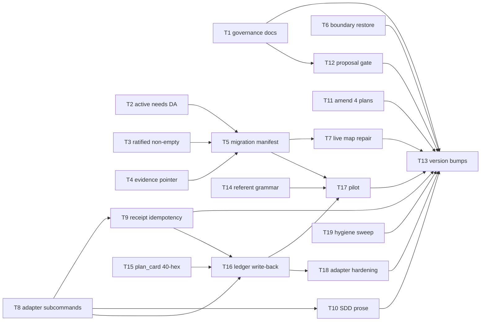

# Plan: Contract repair after Outcome Map v3 + Task Batch Review

Source brief: docs/loom/specs/2026-08-31-contract-repair-post-v3.md
Goal: Repair the defects #765/#766 introduced without reverting either —
    retroactive v3 ratification with recorded decision trail, enforced v3
    invariants, restored cross-store boundary, unblocked live plans, and the
    batch-review adapter entrypoint — serves map family-relocation: its live
    tickets and map are the repaired artifacts (R5)
Stage: sdd:wave-1
Total tasks: 19
Critical-path depth: 5 (≤5)
Execution order: parallel-where-possible
Plan-document-reviewer verdict: PASS (2026-08-31, round 3; R11 amendment PASS round 2)

## Task-flow diagram

## Open Questions

N/A — no unresolved question: all semantic decisions were ratified in the brief (R1–R11); DA content for the live map is drafted from its existing Destination prose (R5).

## Complexity assessment

- Added complexity: one new CLI entrypoint (batch review adapter) with four
  subcommands and a dispatch-receipt file; one new small checker
  (proposal-status intake gate); three validator rules in map_store.py; a
  manifest option in the migrator. R11 (amendment): a git subprocess inside
  plan_card's --set-status write path (T15); apply-result becomes a ledger
  writer (T16); the sealed projection's referent grammar widens from REQ-only
  to every plan-format referent (T14).
- Why it is worthwhile: closes five confirmed governance/operation holes in
  contracts merged <48h ago, before any further arc builds on them; the
  adapter converts the batch-review pipeline from prose-assembly to a single
  executable path, which is what makes the #766 cost saving actually
  collectable.
- Removed or avoided complexity: no revert, no compatibility layer, no
  individual-review default, no CAS simplification (all explicitly rejected
  in the brief).
- Downstream risk: the DA validator (T2) makes currently-valid maps invalid —
  mitigated by T7 repairing the only live map in the same arc before the
  version ships. The receipt file (T8/T9) adds one artifact per batch —
  bounded by batch count. R11: plan_card --set-status now refuses outside a
  git checkout or on an unresolvable ref (accepted — the ledger is always
  inside a repo); apply-result's writes are bounded by the existing CAS +
  plan-directory lock; a wider referent grammar means a typo'd quote still
  seals — the reviewer, not the grammar, catches that.

## Task 1 — Governance ratification records (R1)
- **Description**: Update the v3 proposal status to a ratified line and fill the v3 plan's empty Decision Log with the itemized semantic decisions, each carrying a user-ratified line.
- **Module**: docs/loom (governance records)
- **Files touched**: docs/loom/outcome-map-v3/proposal.md, docs/loom/plans/2026-08-30-outcome-map-v3.md, loom-workflow/skills/decision-map/scripts/test_governance_ratification.py
- **Context paths**:
  - docs/loom/specs/2026-08-31-contract-repair-post-v3.md
  - loom-workflow/docs/skill-governance.md
- **Acceptance**:
  - **RED**: new test_governance_ratification.py asserts proposal.md carries a `Status: ratified — kouko, 2026-08-31` line and the plan's Decision Log has ≥5 entries each containing `user-ratified: kouko, 2026-08-31` — fails on current files.
  - **GREEN**: after the edits, the test passes; `grep -c "user-ratified: kouko, 2026-08-31" docs/loom/plans/2026-08-30-outcome-map-v3.md` ≥5.
- **Dependencies**: none
- **Seam**: payload: none
- **Independent**: true
- **Brief item covered**: "R1 Retroactive v3 ratification. proposal.md moves
    Status: exploration → Status: ratified — kouko, 2026-08-31 … Decision Log
    is filled with the itemized v3 semantic decisions, each tagged
    user-ratified"
- **Review disposition**: individual
- **Status**: done(96eed0df)
- **Gloss**: 把 v3 的空白批准紀錄補成有署名日期的正式裁決軌跡。

## Task 2 — Active requires a Destination Acceptance entry (R3a)
- **Description**: map_store.py validate refuses a v3 map whose state is active with zero DA entries (exit 2), matching the documented activation rule.
- **Module**: loom-workflow/skills/decision-map/scripts/map_store.py
- **Files touched**: loom-workflow/skills/decision-map/scripts/map_store.py, loom-workflow/skills/decision-map/scripts/test_map_store.py
- **Context paths**:
  - loom-workflow/skills/decision-map/references/map-format.md
- **Acceptance**:
  - **RED**: test_map_store.py new case — a valid v3 map with state active and no DA entries fails validate with exit 2.
  - **GREEN**: validate enforces ≥1 DA before active; existing tests stay green.
- **Dependencies**: none
- **Seam**: payload: none
- **Independent**: false
- **Brief item covered**: "R3 v3 invariant enforcement (a) state: active requires
    ≥1 Destination Acceptance entry"
- **Review disposition**: batch(map-side-invariants)
- **Status**: done(7715c6c76fed6fa132e6e8aec20c3973cd7b5f31)
- **Gloss**: 修掉「活著的 map 沒有驗收準則仍然合法」的文件與實作矛盾。

## Task 3 — user-ratified line must be non-empty (R3b)
- **Description**: The user-ratified validator rejects a `user-ratified:` line whose value is empty or whitespace.
- **Module**: loom-workflow/skills/decision-map/scripts/map_store.py
- **Files touched**: loom-workflow/skills/decision-map/scripts/map_store.py, loom-workflow/skills/decision-map/scripts/test_map_store.py
- **Context paths**:
  - loom-workflow/skills/decision-map/scripts/map_store.py (current 1084-1088 region)
- **Acceptance**:
  - **RED**: new test — a ticket carrying `user-ratified:` with empty value fails validation with exit 2.
  - **GREEN**: empty-value lines rejected; well-formed lines pass.
- **Dependencies**: none
- **Seam**: payload: none
- **Independent**: false
- **Brief item covered**: "R3 (b) the user-ratified: line validator rejects empty
    values"
- **Review disposition**: batch(map-side-invariants)
- **Status**: done(b9e791b08c7b487080da3eda494223334c78949e)
- **Gloss**: 批准行不可再被空殼矇混。

## Task 4 — DA evidence must be a resolvable pointer (R3c)
- **Description**: Objective DA evidence validation requires a resolvable pointer (existing commit SHA / PR number / artifact path within the repo), not a bare non-empty string.
- **Module**: loom-workflow/skills/decision-map/scripts/map_store.py
- **Files touched**: loom-workflow/skills/decision-map/scripts/map_store.py, loom-workflow/skills/decision-map/scripts/test_map_store.py
- **Context paths**:
  - loom-workflow/skills/decision-map/references/map-format.md (evidence grammar)
- **Acceptance**:
  - **RED**: new test — a satisfied DA whose evidence is a non-pointer string (e.g. "looks done") fails validate with exit 2.
  - **GREEN**: evidence resolves as a repo-reachable commit/path/PR reference; unresolvable pointers fail with a message naming the criterion.
- **Dependencies**: none
- **Seam**: payload: none
- **Independent**: false
- **Brief item covered**: "R3 (c) objective DA evidence must be a resolvable
    pointer (existing commit SHA / PR number / artifact path — non-empty string
    no longer suffices)"
- **Review disposition**: batch(map-side-invariants)
- **Status**: done(ab217ef093f2d3c7e04d8abb95eea3bb27ce98ae)
- **Gloss**: 驗收證據必須真的查得到，不是一句話。

## Task 5 — Migration manifest for nonterminal tickets (R4)
- **Description**: migrate_map_v3.py accepts an explicit classification manifest (ticket slug → target type) authorizing migration of open/claimed v2 tickets; closed tickets with ambiguous evidence still refuse.
- **Module**: loom-workflow/skills/decision-map/scripts/migrate_map_v3.py
- **Files touched**: loom-workflow/skills/decision-map/scripts/migrate_map_v3.py, loom-workflow/skills/decision-map/scripts/test_migrate_map_v3.py
- **Context paths**:
  - docs/loom/maps/family-relocation/tickets/task-inventory-consumers.md
- **Acceptance**:
  - **RED**: new test — an open v2 task ticket with no closure evidence refuses without a manifest, and migrates to the manifest-declared type with one.
  - **GREEN**: manifest path migrates nonterminal tickets; a closed ticket with ambiguous evidence still refuses even with a conflicting manifest.
- **Dependencies**: Tasks 2, 3, 4 complete first
- **Seam**:
  - from Task 2: payload: none
  - from Task 3: payload: none
  - from Task 4: payload: none
- **Independent**: false
- **Brief item covered**: "R4 nonterminal (open/claimed) v2 tickets may migrate
    via an explicit classification manifest (ticket slug → target type,
    authored at migration time) instead of demanding closure evidence"
- **Review disposition**: batch(map-side-invariants)
- **Status**: done(401d8731fe84ef85cb574c724c30ddfdfcab76fb)
- **Gloss**: 讓遷移器真的能遷移自家的活票。

## Task 6 — Cross-store boundary restored (R6)
- **Description**: Re-add the three deleted boundary rules to map-format.md, cite them from decision-map SKILL.md, add regression tests for both contract sides, and extend check_contract_citations.py to scan loom-workflow.
- **Module**: loom-workflow/skills/decision-map (prose + tests)
- **Files touched**: loom-workflow/skills/decision-map/references/map-format.md, loom-workflow/skills/decision-map/SKILL.md, loom-workflow/skills/decision-map/scripts/test_boundary_contract.py, loom-code/scripts/check_contract_citations.py, loom-code/scripts/test_check_contract_citations.py
- **Context paths**:
  - loom-code/scripts/templates/backlog-README.md (surviving backlog-side copy)
  - loom-workflow/skills/decision-map/scripts/test_skill_doc.py
- **Acceptance**:
  - **RED**: new test_boundary_contract.py asserts map-format.md contains the close-and-cite rule, the release-only rule, and the reopen-on-archive rule, and that SKILL.md cites the section — fails on current tree.
  - **GREEN**: prose present, both-side greps pass, check_contract_citations.py scans loom-workflow and exits 0; reviewer leg — decision-map SKILL.md cites the map-format section without paraphrasing any of the three boundary rules.
- **External surfaces**: stdlib only (argparse, pathlib, re).
- **Dependencies**: none
- **Seam**: payload: none
- **Independent**: true
- **Brief item covered**: "R6 … the three deleted rules return — promotion
    close-and-cite …, map→backlog travel release-only, reopen-promoted
    -entries-on-archive — defined at ONE point in map-format, cited by
    decision-map SKILL.md, with regression tests asserting both … contracts"
- **Review disposition**: individual
- **Status**: done(79ef44b2)
- **Gloss**: 把被刪掉的 map↔backlog 邊界契約補回雙側。

## Task 7 — Live map repair (R5)
- **Description**: Add ratified DA entries to family-relocation MAP.md, migrate its two live tickets via the manifest, and rewrite the relay remnant in task-inventory-consumers.md to direct-execution semantics.
- **Module**: docs/loom/maps/family-relocation
- **Files touched**: docs/loom/maps/family-relocation/MAP.md, docs/loom/maps/family-relocation/tickets/task-inventory-consumers.md, docs/loom/maps/family-relocation/tickets/task-relocate-family-hooks.md
- **Context paths**:
  - docs/loom/maps/family-relocation/MAP.md (Destination prose → DA drafts)
  - loom-workflow/skills/decision-map/scripts/migrate_map_v3.py
- **Acceptance**:
  - **RED**: `map_store.py validate docs/loom/maps/family-relocation --repo-root .` currently passes with zero DA entries while active — after Task 2 it fails; this task makes it pass again WITH DAs present.
  - **GREEN**: validate exit 0; both tickets carry v3 types; grep for the relay phrasing in the tickets dir returns nothing.
- **Dependencies**: Tasks 2, 3, 4, 5 complete first
- **Seam**:
  - from Task 2: payload: none
  - from Task 3: payload: none
  - from Task 4: payload: none
  - from Task 5: payload: the manifest migration of the two live ticket slugs; owner: Task 5; probe: validate exit 0
- **Independent**: false
- **Brief item covered**: "R5 family-relocation MAP.md gains ratified Destination
    Acceptance entries … the two live tickets migrate under R4's manifest; the
    retired relay remnant … is rewritten to direct-execution semantics"
- **Review disposition**: individual
- **Status**: done(1ec9ce3a410bbf31e1ea84af98559f866e376c48)
- **Gloss**: 修復唯一活著的 map，讓它在新不變量下合法。

## Task 8 — Batch review adapter subcommands (R7)
- **Description**: New loom-code/scripts CLI entrypoint exposing ready / packet / record-dispatch / apply-result, wiring review_batch.py's existing sealed-packet and resolve functions behind a CLI on a new call path; tests drive it via a synthetic validated plan.
    - Also documents the subcommand call contract as the executable path in SDD SKILL.md's batch checkpoint (R7's documentation clause).
- **Module**: loom-code/scripts (new entrypoint + replay refactor)
- **Files touched**: loom-code/scripts/batch_review_cli.py, loom-code/scripts/test_batch_review_cli.py, loom-code/scripts/test_gate_scripts_fail_loud_on_unreadable_input.py, loom-code/skills/subagent-driven-development/SKILL.md
- **Context paths**:
  - loom-code/scripts/review_batch.py
  - loom-code/scripts/check_review_batches.py
  - loom-code/skills/subagent-driven-development/SKILL.md (batch checkpoint)
- **Acceptance**:
  - **RED**: new test_batch_review_cli.py — invoking the CLI's `ready` / `packet` subcommands on a synthetic validated plan fails today (no such entrypoint).
  - **GREEN**: `ready` reports batch readiness; `packet` emits a sealed ReviewPacket identical in shape to the library's; `apply-result` routes through resolve_aggregate_review; tests drive all four subcommands on a synthetic validated plan.
- **External surfaces**: stdlib only (argparse, json, hashlib, pathlib).
- **Dependencies**: none
- **Seam**: payload: none
- **Independent**: true
- **Reuse-adequacy**:
  - **Observed**: task_batch_replay.py's main() is a dispatch-metrics comparison CLI over corpus/baseline/candidate JSON result files — it does not build packets or resolve reviews. read loom-code/scripts/task_batch_replay.py:505
  - **Intended**: the new batch_review_cli.py subcommands call review_batch.py's existing sealed-packet and resolve functions on real plan paths as a permanent entrypoint, and apply-result feeds the terminal verdict through resolve_aggregate_review unchanged.
- **Brief item covered**: "R7 one executable orchestrator entrypoint in
    loom-code/scripts (CLI) providing the single assembly-free execution
    path: ready … → packet … → record-dispatch … → apply-result … Documented
    as the executable call contract in subagent-driven-development SKILL.md's
    batch checkpoint"
- **Review disposition**: batch(adapter-cli)
- **Status**: done(ef51a81c9120142d85369592e3937516588e123c)
- **Gloss**: 給 batch review 一條不用 agent 自行拼裝的可執行路徑。

## Task 9 — Dispatch receipt idempotency + readiness rules (R8)
- **Description**: record-dispatch writes a receipt; a second dispatch for a batch whose receipt exists without a terminal result is refused (re-collect instead of re-send); ready operationalizes multi-batch readiness (all members implemented(<sha>) and no member in another non-terminal batch).
- **Module**: loom-code/scripts/batch_review_cli.py
- **Files touched**: loom-code/scripts/batch_review_cli.py, loom-code/scripts/test_batch_review_cli.py
- **Context paths**:
  - loom-code/scripts/review_batch.py (resolve_aggregate_review)
- **Acceptance**:
  - **RED**: new test — record-dispatch twice for the same batch without an intervening apply-result exits non-zero the second time.
  - **GREEN**: receipt refusal works; ready returns not-ready for a member in a second non-terminal batch and ready for a clean one.
- **External surfaces**: stdlib only.
- **Dependencies**: Task 8 completes first
- **Seam**:
  - from Task 8: payload: none
- **Independent**: true
- **Reuse-adequacy**:
  - **Observed**: resolve_aggregate_review (review_batch.py:1101) folds a reviewer's terminal verdict into the batch aggregate and produces the plan-card write; record-dispatch has no receipt counterpart in the existing chain. read loom-code/scripts/review_batch.py:1101
  - **Intended**: Task 8's apply-result subcommand routes the terminal verdict through resolve_aggregate_review unchanged; this task adds the dispatch-receipt record and the re-entry refusal plus the multi-batch readiness rule inside ready.
- **Brief item covered**: "R8 a crash after reviewer dispatch is recoverable via
    the dispatch receipt — re-entry refuses a second dispatch … Multi-batch
    readiness is operationalized inside the ready subcommand"
- **Review disposition**: batch(adapter-cli)
- **Status**: done(ef51a81c9120142d85369592e3937516588e123c)
- **Gloss**: crash 後不再重派 reviewer；多批交錯有明確 ready 判準。

## Task 10 — Whole-branch entry disambiguation (R9)
- **Description**: SDD SKILL.md batch checkpoint gains an unconditional sequence statement: after every batch is finalized (or individually resolved), the run necessarily enters the existing whole-branch review.
- **Module**: loom-code/skills/subagent-driven-development
- **Files touched**: loom-code/skills/subagent-driven-development/SKILL.md, loom-code/scripts/test_subagent_driven_development_batch_review.py
- **Context paths**:
  - loom-code/skills/subagent-driven-development/references/conditional-operations.md
- **Acceptance**:
  - **RED**: extended existing doc-contract test asserts SKILL.md contains the unconditional whole-branch sequence line — fails on current text.
  - **GREEN**: line present; existing batch-review doc tests stay green.
- **Dependencies**: Task 8 completes first
- **Seam**:
  - from Task 8: payload: none
- **Independent**: true
- **Brief item covered**: "R9 after every batch is finalized (or individually
    resolved), the run necessarily enters the existing whole-branch review —
    stated as an unconditional sequence step"
- **Review disposition**: individual
- **Status**: done(381fc3e786a817e3a35e74e95a491573bbb4c690)
- **Gloss**: 消除 interactive 模式是否必然進整支審查的歧義。

## Task 11 — Amend the four live plans (R10)
- **Description**: Add `individual` review dispositions + minimal `## Review Batches` sections to the four nonterminal plans; terminal plans untouched.
- **Module**: docs/loom/plans
- **Files touched**: docs/loom/plans/2026-08-24-cross-host-review-gate-hardening.md, docs/loom/plans/2026-08-24-cross-host-review-gate-hardening-part-2.md, docs/loom/plans/2026-08-24-cross-host-review-gate-hardening-part-3.md, docs/loom/plans/2026-08-24-review-binding-remediation.md
- **Context paths**:
  - loom-code/scripts/check_review_batches.py
- **Acceptance**:
  - **RED**: `check_review_batches.py` exits non-zero on each of the four plans today.
  - **GREEN**: exits 0 on each of the four after amendment; `git diff --stat` shows no other plan files touched.
- **Dependencies**: none
- **Seam**: payload: none
- **Independent**: true
- **Brief item covered**: "R10 the four nonterminal plans … are amended with
    individual review dispositions + a minimal ## Review Batches section.
    Historical/terminal plans are NOT touched"
- **Review disposition**: individual
- **Status**: done(74c3ee2b)
- **Gloss**: 解開被 #766 擋住的四個活 plan。

## Task 12 — Proposal-status intake gate (R2)
- **Description**: New check_proposal_status.py refusing a plan whose source proposal carries a non-ratified status; one line wired into writing-plans intake contract.
- **Module**: loom-code/scripts
- **Files touched**: loom-code/scripts/check_proposal_status.py, loom-code/scripts/test_check_proposal_status.py, loom-code/skills/writing-plans/SKILL.md, loom-code/scripts/test_writing_plans_review_batches.py
- **Context paths**:
  - loom-code/scripts/check_onramp_choice.py (arg/exit-code pattern)
  - docs/loom/outcome-map-v3/proposal.md (ratified target state)
- **Acceptance**:
  - **RED**: new test — checker exits 2 against a fixture proposal with `Status: exploration` (and the writing-plans intake section does not name it).
  - **GREEN**: checker exits 0 on a ratified proposal; SKILL.md intake lists it alongside the onramp/queue gates.
- **External surfaces**: stdlib only.
- **Dependencies**: Task 1 completes first
- **Seam**:
  - from Task 1: payload: none
- **Independent**: false
- **Brief item covered**: "R2 New small checker refusing a plan/change arc whose
    source proposal carries a non-ratified status; wired as one line into the
    existing writing-plans intake contract"
- **Review disposition**: individual
- **Status**: done(1022d71521176074346b243c4726468f99a2d2cb)
- **Gloss**: 讓未經批准的 proposal 狀態從此進不了計畫階段。

## Task 13 — Version bumps + codex mirror sync
- **Description**: Bump loom-workflow and loom-code plugin versions, update CHANGELOG entries, sync codex mirror manifests via the existing sync script.
- **Module**: plugin manifests
- **Files touched**: loom-workflow/.claude-plugin/plugin.json, loom-workflow/.codex-plugin/plugin.json, loom-workflow/CHANGELOG.md, loom-code/.claude-plugin/plugin.json, loom-code/.codex-plugin/plugin.json, loom-code/CHANGELOG.md
- **Context paths**:
  - scripts/sync_codex_manifests.py
  - scripts/check_version_bump.py
- **Acceptance**:
  - **RED**: `python3 scripts/check_version_bump.py --base origin/main --head HEAD` exits non-zero at task start — Tasks 1–12 changed skill content while plugin.json versions stay at the pre-arc values (it exits 0 today because no skill content changed yet on this branch).
  - **GREEN**: both plugin.json versions bumped; CHANGELOGs carry dated entries; sync script exits 0; grep shows no stale version string in README version tables.
- **Dependencies**: Tasks 1, 6, 7, 9, 10, 11, 12, 14, 15, 16, 17, 18, 19 complete first
- **Seam**:
  - from Task 1: payload: none
  - from Task 6: payload: none
  - from Task 7: payload: none
  - from Task 9: payload: none
  - from Task 10: payload: none
  - from Task 11: payload: none
  - from Task 12: payload: none
  - from Task 14: payload: none
  - from Task 15: payload: none
  - from Task 16: payload: none
  - from Task 17: payload: none
  - from Task 18: payload: none
  - from Task 19: payload: none
- **Independent**: false
- **Brief item covered**: "Execution order 6: Version bumps: loom-workflow +
    loom-code (skill/scripts content changed in both; codex mirror manifests
    via the existing sync script)"
- **Review disposition**: individual
- **Status**: pending
- **Gloss**: 版本三表面同步：plugin.json、CHANGELOG、README 版本列。
## Task 14 — Referent grammar widened for batch projections (R11a)
- **Description**: `owned_requirements` accepts every `Brief item covered` referent plan-format admits — REQ-<n>, BI-<n>, or a quote — with non-empty as the only rule, in both the checker's projection and review_batch's projection validator.
- **Module**: loom-code/scripts (batch projection: review_batch validator + check_review_batches feeder)
- **Files touched**: loom-code/scripts/review_batch.py, loom-code/scripts/check_review_batches.py, loom-code/scripts/test_review_batch.py, loom-code/scripts/test_check_review_batches.py
- **Context paths**:
  - loom-code/skills/writing-plans/references/plan-format.md (§Brief item covered — referent kinds a–d)
  - loom-code/scripts/batch_review_cli.py (consumer of the projection)
- **Acceptance**:
  - **RED**: new test — a validated plan whose members cite brief quotes (no REQ- id) is refused by `_validate_execution_projection` with "execution authority member is malformed" today; after the fix it seals.
  - **GREEN**: quote / BI-<n> / REQ-<n> referents all project into owned_requirements; empty referent still refuses; existing REQ-based tests stay green.
- **External surfaces**: stdlib only.
- **Dependencies**: none
- **Seam**: payload: none
- **Independent**: true
- **Brief item covered**: "R11 (a) Referent grammar: owned_requirements accepts every
    Brief item covered referent plan-format admits (REQ-<n>, BI-<n>, quote) —
    non-empty is the only requirement — in both check_review_batches.py and
    review_batch.py's projection validator"
- **Review disposition**: individual
- **Status**: done(881da48ba4fab9b7b0ecf2265c15ea907f65f2ac)
- **Gloss**: 讓引 brief 原句的 plan 也能發出 sealed Packet。

## Task 15 — plan_card writes 40-hex SHAs by construction (R11b)
- **Description**: `plan_card.py --set-status` expands `implemented(<short>)` / `done(<short>)` to the full 40-hex SHA via `git rev-parse` at write time, refusing an unresolvable ref, so the CLI's 40-hex rule is met without operator expansion.
- **Module**: loom-code/scripts/plan_card.py
- **Files touched**: loom-code/scripts/plan_card.py, loom-code/scripts/test_plan_card.py
- **Context paths**:
  - loom-code/scripts/batch_review_cli.py (`_IMPLEMENTED` 40-hex rule)
- **Acceptance**:
  - **RED**: new test — `--set-status "T1=implemented(<7-char sha of a real commit in a tmp repo>)"` writes the short form today; after the fix the ledger holds the 40-hex form and a bogus ref exits non-zero.
  - **GREEN**: short refs expand; 40-hex input passes through unchanged; bogus ref refuses with a message naming the ref; existing plan_card tests green.
- **External surfaces**: git CLI via subprocess (stdlib subprocess; follow the repo's existing git-invocation idiom).
- **Dependencies**: none
- **Seam**: payload: none
- **Independent**: true
- **Brief item covered**: "R11 (b) SHA grammar: plan_card.py --set-status expands
    implemented(<short>)/done(<short>) to the 40-hex form via git rev-parse at
    write time"
- **Review disposition**: individual
- **Status**: done(45a495fd8ad02594e6026e1070e715d22ce656d5)
- **Gloss**: ledger 一寫進去就是 CLI 認得的完整 SHA，不用人手展開。

## Task 16 — apply-result writes the ledger; plan_card single-sourced (R11c)
- **Description**: `apply-result` performs the atomic Batch status update through plan_card's `atomic_batch_status_update` (finalize → members done(<sha>), reopen → owner union pending).
    - A test pins scripts/plan_card.py as the exec shim onto loom-code/scripts/plan_card.py (SSOT already holds; the pin stops a future full copy).
- **Module**: loom-code/scripts/batch_review_cli.py
- **Files touched**: loom-code/scripts/batch_review_cli.py, loom-code/scripts/test_batch_review_cli.py, scripts/test_plan_card_shim.py
- **Context paths**:
  - loom-code/scripts/plan_card.py (`atomic_batch_status_update` :878, `_transition_authority_validator` :636)
  - loom-code/scripts/review_batch.py (`resolve_aggregate_review` :1101 — transition_authority on the resolution)
  - scripts/plan_card.py (the 10-line os.execv shim to pin)
- **Acceptance**:
  - **RED**: new test — `apply-result` on a finalize result leaves member statuses at implemented(<sha>) today; after the fix the plan file reads done(<sha>) for every member under the plan lock, and a reopen result flips owners to pending.
    - New shim test is written against a mutated copy first to prove it discriminates (a full-copy plan_card fails it).
  - **GREEN**: ledger write-back on finalize/reopen with the sealed transition authority; wait_refuse writes nothing; shim test passes on the unchanged scripts/plan_card.py (execv onto loom-code/scripts/plan_card.py, argv/exit passthrough).
- **External surfaces**: stdlib only.
- **Dependencies**: Tasks 8, 9, 15 complete first
- **Seam**:
  - from Task 8: payload: none
  - from Task 9: payload: none
  - from Task 15: payload: the 40-hex status grammar plan_card writes; owner: Task 15; probe: done(<sha>) for every member
- **Reuse-adequacy**:
  - **Observed**: atomic_batch_status_update takes plan_path, batch_id, expected_statuses, replacements and a sealed transition_authority, runs the CAS under the shared plan-directory lock, and returns whether the write happened; no CLI calls it today. read loom-code/scripts/plan_card.py:878
  - **Intended**: apply-result builds expected_statuses from the Packet's member snapshot and replacements from the resolution action, passes the resolution's transition_authority through unchanged, and exits non-zero when the CAS declines.
- **Independent**: false
- **Brief item covered**: "R11 (c) Ledger write-back: apply-result performs the atomic
    Batch status update … through plan_card's atomic_batch_status_update; the
    repo-root scripts/plan_card.py stays the exec shim onto
    loom-code/scripts/plan_card.py it already is … pinned by a test"
- **Review disposition**: individual
- **Status**: implemented(e3becda489a3cd949b0a54ef797b36e37d2111fb)
- **Gloss**: 審完自動翻 ledger；repo-root plan_card 釘死為 shim。

## Task 17 — Pilot: this arc's map-side batch through the CLI (R11d)
- **Description**: Drive this plan's own `map-side-invariants` Batch through ready → packet → record-dispatch → apply-result with a real reviewer fan-out result, as the end-to-end acceptance proof; the run transcript lands in the plan's Notes.
    - Task 5 "completes" here means implemented(<sha>) — the batch member state — since apply-result is what writes its done.
- **Module**: docs/loom/plans (this plan's ledger)
- **Files touched**: docs/loom/plans/2026-08-31-contract-repair-post-v3.md
- **Context paths**:
  - loom-code/scripts/batch_review_cli.py
  - loom-code/skills/subagent-driven-development/SKILL.md (batch checkpoint call contract)
- **Acceptance**:
  - **RED**: `batch_review_cli.py packet --batch map-side-invariants` on this plan refuses today (referent grammar, T14) or the ledger is not written after apply-result (T16).
  - **GREEN**: all four subcommands exit 0 in sequence on this plan; the plan's Task 2–5 statuses read done(<sha>) written by apply-result, not by hand; a `## Notes` entry records the four command lines and their exit codes.
- **Dependencies**: Tasks 5, 14, 15, 16 complete first
- **Seam**:
  - from Task 5: payload: none
  - from Task 14: payload: none
  - from Task 15: payload: none
  - from Task 16: payload: none
- **Independent**: false
- **Brief item covered**: "R11 (d) Pilot: this arc's own map-side-invariants Batch is
    driven through the four CLI steps end to end as the acceptance proof"
- **Review disposition**: individual
- **Status**: pending
- **Gloss**: 用本弧自己的批次真跑一遍，證明省成本的路走得通。

## Task 18 — Adapter hardening: batch_id-keyed refusal, reopen recovery, identity anchor (R12a)
- **Description**: batch_review_cli.py refuses re-dispatch by batch_id across the receipt directory, recovers a reopen-path crash symmetrically with finalize, anchors repository identity on the member sha, and folds the triplicated timeout wrapper and the per-member status re-parse into one each.
- **Module**: loom-code/scripts/batch_review_cli.py
- **Files touched**: loom-code/scripts/batch_review_cli.py, loom-code/scripts/test_batch_review_cli.py
- **Context paths**:
  - loom-code/scripts/batch_review_cli.py (`_cmd_record_dispatch`, `_recover_settled_receipt`, `_repository_identity`, `_run_git`)
- **Acceptance**:
  - **RED**: new tests — record-dispatch with a different `--out` while an unapplied receipt for the same batch sits in that directory succeeds today; a reopen crash (owners pending, receipt unapplied) is not recoverable today; repository identity differs when HEAD moves to a second-root branch today.
  - **GREEN**: same-batch refusal fires regardless of `--out` name; reopen crash recovers idempotently (owners `pending`, non-owners still `implemented(<sha>)` matching the packet); identity is stable under HEAD movement; existing 27 CLI tests green.
    - One timeout wrapper helper; `_member_statuses` called once per build.
- **External surfaces**: git via subprocess (grounded in the file's existing cites).
- **Dependencies**: Task 16 completes first
- **Seam**:
  - from Task 16: payload: none
- **Independent**: false
- **Brief item covered**: "R12 (a) Adapter hardening in batch_review_cli.py: dispatch-receipt
    refusal keyed on batch_id … reopen-path crash recovery symmetric with
    finalize … _repository_identity anchored on the member sha … one shared
    TimeoutExpired→PacketRefused wrapper; _member_statuses computed once"
- **Review disposition**: individual
- **Status**: pending
- **Gloss**: 把審查抓到的 adapter 殘缺一次補齊，讓冪等保護與崩潰恢復在兩條路徑上對稱。

## Task 19 — Hygiene sweep from per-task review notes (R12b)
- **Description**: Land the five small review notes: bare-`ratified` test case, DA artifact-path symlink-escape test, plan_card passthrough file-content assertion, governance test trailing newline + shared extractor, decision-map SKILL.md "Read all three" wording.
- **Module**: loom-code/scripts (tests) + one SKILL.md sentence
- **Files touched**: loom-code/scripts/test_check_proposal_status.py, loom-workflow/skills/decision-map/scripts/test_map_store.py, loom-code/scripts/test_plan_card.py, loom-workflow/skills/decision-map/scripts/test_governance_ratification.py, loom-workflow/skills/decision-map/SKILL.md
- **Context paths**:
  - loom-code/scripts/check_proposal_status.py
  - loom-workflow/skills/decision-map/scripts/map_store.py (`_da_evidence_is_resolvable`)
- **Acceptance**:
  - **RED**: `Status: ratified` (no name/date) has no parametrized case today; no test drives a symlinked artifact path through `_da_evidence_is_resolvable`.
    - `test_set_status_full_forty_hex_sha_passes_through_unchanged` asserts stdout only; test_governance_ratification.py lacks a trailing newline and duplicates the Decision-Log extraction; SKILL.md says "Read all three" while naming two files.
  - **GREEN**: each case added and green; SKILL.md sentence names the two files and the boundary section; both package suites green; `check_contract_citations.py --repo-root .` exit 0.
- **Dependencies**: none
- **Seam**: payload: none
- **Independent**: true
- **Brief item covered**: "R12 (b) Hygiene sweep: bare Status: ratified … symlink-escape test …
    plan_card 40-hex passthrough test asserts file content …
    test_governance_ratification trailing newline + shared Decision-Log
    extractor; decision-map SKILL.md Read all three → names the two files and
    the boundary section"
- **Review disposition**: individual
- **Status**: pending
- **Gloss**: 把每個任務審查留下的小備註一次掃乾淨，不留給下一弧。

## Review Batches

### Review Batch: map-side-invariants
- **Members**: Task 2, Task 3, Task 4, Task 5
- **Verdict question**: Do the v3 validators and migrator together enforce the ratified invariants end-to-end — active-requires-DA, non-empty user-ratified, resolvable DA evidence, and manifest migration for nonterminal tickets — with each RED test red before its fix and the decision-map script package green after?
- **Review lane**: full
- **Aggregate verification**: inert description — run the decision-map scripts pytest package plus the live family-relocation map validate (added in Task 7, not in this batch) and confirm the four new validator/migrator test cases pass against a map fixture that violates each invariant in turn.
- **Boundary**: capability: decision-map v3 invariants; exclusions: none; consumable: yes

### Review Batch: adapter-cli
- **Members**: Task 8, Task 9
- **Verdict question**: Does the batch-review CLI provide the complete assembly-free execution path — ready/packet/record-dispatch/apply-result — with dispatch-receipt idempotency refusal and multi-batch readiness, proven by the replay harness running end-to-end through the CLI?
- **Review lane**: full
- **Aggregate verification**: inert description — run the batch CLI test suite plus task_batch_replay.py through the CLI entrypoint and confirm the double-dispatch refusal and the not-ready member cases fail closed.
- **Boundary**: capability: batch-review adapter; exclusions: none; consumable: yes

## Decision Log

### DL-1 — Both batches route to individual fallback (2026-08-31, SDD wave 1)
- Class: implementation-discovered, below kickoff threshold (reversal cost: none — fallback is the documented fail-closed path; deliverables unchanged).
- Trigger: first real `batch_review_cli.py packet` run on this plan refused with `execution authority member is malformed`. Root cause: `review_batch.py:1261` requires every member `owned_requirements` reference to start with `REQ-`, while plan-format.md §Brief item covered admits quotes, `BI-<n>`, and `REQ-<n>`. This plan cites brief quotes, so no sealed Packet can be issued for it.
- Second seam found on the same run: `batch_review_cli.py:66` `_IMPLEMENTED` demands a 40-hex SHA while `plan_card.py --set-status` accepts short SHAs — ledger values were expanded to full SHAs by the orchestrator.
- Superseded 2026-08-31 by brief R11 (kouko: "做吧") — Tasks 14–17 fix the three seams and re-run the map-side batch through the CLI as the pilot; `adapter-cli` stays on individual fallback (its members are the CLI under repair).
- Decision (original): `adapter-cli` and `map-side-invariants` both take `individual_fallback` (zero Batch ledger mutation; per-task triads). Not fixed here — widening the projection's referent grammar is a change to #766's contract, out of this brief's scope. Filed as follow-up debt in the final summary.

### DL-2 — Task 7's migration leg is moot; DA + relay rewrite remain (2026-08-31, SDD wave 3)
- Class: implementation-discovered stated-fact drift, below kickoff threshold (no product consequence; scope shrinks).
- Fact (Task 5 spec-reviewer, verified by the orchestrator): docs/loom/maps/family-relocation/MAP.md is already `schema_version: 3` and every ticket carries a v3 type (task-inventory-consumers = research/claimed, task-relocate-family-hooks = delivery/open) — #765 shipped them migrated. `preview_migration` short-circuits on already-applied maps, so R5's "the two live tickets migrate under R4's manifest" has nothing to act on.
- Decision: Task 7 delivers the two live defects that remain — zero DA entries on an active map (validate exit 2 today) and the retired relay sentence in task-inventory-consumers.md. R4's manifest path stays shipped and tested (Task 5) for the next v2 map. Task 7's RED/GREEN as written still hold (validate fails today → passes; relay grep empty).
