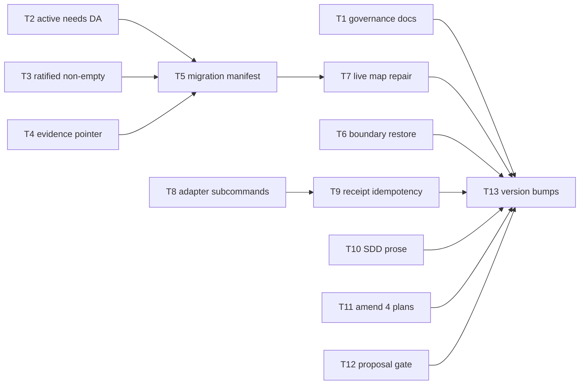

# Plan: Contract repair after Outcome Map v3 + Task Batch Review

Source brief: docs/loom/specs/2026-08-31-contract-repair-post-v3.md
Goal: Repair the defects #765/#766 introduced without reverting either —
    retroactive v3 ratification with recorded decision trail, enforced v3
    invariants, restored cross-store boundary, unblocked live plans, and the
    batch-review adapter entrypoint — serves map family-relocation: its live
    tickets and map are the repaired artifacts (R5)
Stage: sdd:wave-1
Total tasks: 13
Critical-path depth: 4 (≤5)
Execution order: parallel-where-possible
Plan-document-reviewer verdict: PASS (2026-08-31, round 3)

## Task-flow diagram

## Open Questions

N/A — no unresolved question: all semantic decisions were ratified in the brief (R1–R10); DA content for the live map is drafted from its existing Destination prose (R5).

## Complexity assessment

- Added complexity: one new CLI entrypoint (batch review adapter) with four
  subcommands and a dispatch-receipt file; one new small checker
  (proposal-status intake gate); three validator rules in map_store.py; a
  manifest option in the migrator.
- Why it is worthwhile: closes five confirmed governance/operation holes in
  contracts merged <48h ago, before any further arc builds on them; the
  adapter converts the batch-review pipeline from prose-assembly to a single
  executable path, which is what makes the #766 cost saving actually
  collectable.
- Removed or avoided complexity: no revert, no compatibility layer, no
  individual-review default, no CAS simplification (all explicitly rejected
  in the brief).
- Downstream risk: the DA validator (T2) makes currently-valid maps invalid —
  mitigated by T7 repairing the only live map in the same arc before the
  version ships. The receipt file (T8/T9) adds one artifact per batch —
  bounded by batch count.

## Task 1 — Governance ratification records (R1)
- **Description**: Update the v3 proposal status to a ratified line and fill the v3 plan's empty Decision Log with the itemized semantic decisions, each carrying a user-ratified line.
- **Module**: docs/loom (governance records)
- **Files touched**: docs/loom/outcome-map-v3/proposal.md, docs/loom/plans/2026-08-30-outcome-map-v3.md, loom-workflow/skills/decision-map/scripts/test_governance_ratification.py
- **Context paths**:
  - docs/loom/specs/2026-08-31-contract-repair-post-v3.md
  - loom-workflow/docs/skill-governance.md
- **Acceptance**:
  - **RED**: new test_governance_ratification.py asserts proposal.md carries a `Status: ratified — kouko, 2026-08-31` line and the plan's Decision Log has ≥5 entries each containing `user-ratified: kouko, 2026-08-31` — fails on current files.
  - **GREEN**: after the edits, the test passes; `grep -c "user-ratified: kouko, 2026-08-31" docs/loom/plans/2026-08-30-outcome-map-v3.md` ≥5.
- **Dependencies**: none
- **Seam**: payload: none
- **Independent**: true
- **Brief item covered**: "R1 Retroactive v3 ratification. proposal.md moves
    Status: exploration → Status: ratified — kouko, 2026-08-31 … Decision Log
    is filled with the itemized v3 semantic decisions, each tagged
    user-ratified"
- **Review disposition**: individual
- **Status**: pending
- **Gloss**: 把 v3 的空白批准紀錄補成有署名日期的正式裁決軌跡。

## Task 2 — Active requires a Destination Acceptance entry (R3a)
- **Description**: map_store.py validate refuses a v3 map whose state is active with zero DA entries (exit 2), matching the documented activation rule.
- **Module**: loom-workflow/skills/decision-map/scripts/map_store.py
- **Files touched**: loom-workflow/skills/decision-map/scripts/map_store.py, loom-workflow/skills/decision-map/scripts/test_map_store.py
- **Context paths**:
  - loom-workflow/skills/decision-map/references/map-format.md
- **Acceptance**:
  - **RED**: test_map_store.py new case — a valid v3 map with state active and no DA entries fails validate with exit 2.
  - **GREEN**: validate enforces ≥1 DA before active; existing tests stay green.
- **Dependencies**: none
- **Seam**: payload: none
- **Independent**: false
- **Brief item covered**: "R3 v3 invariant enforcement (a) state: active requires
    ≥1 Destination Acceptance entry"
- **Review disposition**: batch(map-side-invariants)
- **Status**: pending
- **Gloss**: 修掉「活著的 map 沒有驗收準則仍然合法」的文件與實作矛盾。

## Task 3 — user-ratified line must be non-empty (R3b)
- **Description**: The user-ratified validator rejects a `user-ratified:` line whose value is empty or whitespace.
- **Module**: loom-workflow/skills/decision-map/scripts/map_store.py
- **Files touched**: loom-workflow/skills/decision-map/scripts/map_store.py, loom-workflow/skills/decision-map/scripts/test_map_store.py
- **Context paths**:
  - loom-workflow/skills/decision-map/scripts/map_store.py (current 1084-1088 region)
- **Acceptance**:
  - **RED**: new test — a ticket carrying `user-ratified:` with empty value fails validation with exit 2.
  - **GREEN**: empty-value lines rejected; well-formed lines pass.
- **Dependencies**: none
- **Seam**: payload: none
- **Independent**: false
- **Brief item covered**: "R3 (b) the user-ratified: line validator rejects empty
    values"
- **Review disposition**: batch(map-side-invariants)
- **Status**: pending
- **Gloss**: 批准行不可再被空殼矇混。

## Task 4 — DA evidence must be a resolvable pointer (R3c)
- **Description**: Objective DA evidence validation requires a resolvable pointer (existing commit SHA / PR number / artifact path within the repo), not a bare non-empty string.
- **Module**: loom-workflow/skills/decision-map/scripts/map_store.py
- **Files touched**: loom-workflow/skills/decision-map/scripts/map_store.py, loom-workflow/skills/decision-map/scripts/test_map_store.py
- **Context paths**:
  - loom-workflow/skills/decision-map/references/map-format.md (evidence grammar)
- **Acceptance**:
  - **RED**: new test — a satisfied DA whose evidence is a non-pointer string (e.g. "looks done") fails validate with exit 2.
  - **GREEN**: evidence resolves as a repo-reachable commit/path/PR reference; unresolvable pointers fail with a message naming the criterion.
- **Dependencies**: none
- **Seam**: payload: none
- **Independent**: false
- **Brief item covered**: "R3 (c) objective DA evidence must be a resolvable
    pointer (existing commit SHA / PR number / artifact path — non-empty string
    no longer suffices)"
- **Review disposition**: batch(map-side-invariants)
- **Status**: pending
- **Gloss**: 驗收證據必須真的查得到，不是一句話。

## Task 5 — Migration manifest for nonterminal tickets (R4)
- **Description**: migrate_map_v3.py accepts an explicit classification manifest (ticket slug → target type) authorizing migration of open/claimed v2 tickets; closed tickets with ambiguous evidence still refuse.
- **Module**: loom-workflow/skills/decision-map/scripts/migrate_map_v3.py
- **Files touched**: loom-workflow/skills/decision-map/scripts/migrate_map_v3.py, loom-workflow/skills/decision-map/scripts/test_migrate_map_v3.py
- **Context paths**:
  - docs/loom/maps/family-relocation/tickets/task-inventory-consumers.md
- **Acceptance**:
  - **RED**: new test — an open v2 task ticket with no closure evidence refuses without a manifest, and migrates to the manifest-declared type with one.
  - **GREEN**: manifest path migrates nonterminal tickets; a closed ticket with ambiguous evidence still refuses even with a conflicting manifest.
- **Dependencies**: Tasks 2, 3, 4 complete first
- **Seam**:
  - from Task 2: payload: none
  - from Task 3: payload: none
  - from Task 4: payload: none
- **Independent**: false
- **Brief item covered**: "R4 nonterminal (open/claimed) v2 tickets may migrate
    via an explicit classification manifest (ticket slug → target type,
    authored at migration time) instead of demanding closure evidence"
- **Review disposition**: batch(map-side-invariants)
- **Status**: pending
- **Gloss**: 讓遷移器真的能遷移自家的活票。

## Task 6 — Cross-store boundary restored (R6)
- **Description**: Re-add the three deleted boundary rules to map-format.md, cite them from decision-map SKILL.md, add regression tests for both contract sides, and extend check_contract_citations.py to scan loom-workflow.
- **Module**: loom-workflow/skills/decision-map (prose + tests)
- **Files touched**: loom-workflow/skills/decision-map/references/map-format.md, loom-workflow/skills/decision-map/SKILL.md, loom-workflow/skills/decision-map/scripts/test_boundary_contract.py, loom-code/scripts/check_contract_citations.py, loom-code/scripts/test_check_contract_citations.py
- **Context paths**:
  - loom-code/scripts/templates/backlog-README.md (surviving backlog-side copy)
  - loom-workflow/skills/decision-map/scripts/test_skill_doc.py
- **Acceptance**:
  - **RED**: new test_boundary_contract.py asserts map-format.md contains the close-and-cite rule, the release-only rule, and the reopen-on-archive rule, and that SKILL.md cites the section — fails on current tree.
  - **GREEN**: prose present, both-side greps pass, check_contract_citations.py scans loom-workflow and exits 0; reviewer leg — decision-map SKILL.md cites the map-format section without paraphrasing any of the three boundary rules.
- **External surfaces**: stdlib only (argparse, pathlib, re).
- **Dependencies**: none
- **Seam**: payload: none
- **Independent**: true
- **Brief item covered**: "R6 … the three deleted rules return — promotion
    close-and-cite …, map→backlog travel release-only, reopen-promoted
    -entries-on-archive — defined at ONE point in map-format, cited by
    decision-map SKILL.md, with regression tests asserting both … contracts"
- **Review disposition**: individual
- **Status**: pending
- **Gloss**: 把被刪掉的 map↔backlog 邊界契約補回雙側。

## Task 7 — Live map repair (R5)
- **Description**: Add ratified DA entries to family-relocation MAP.md, migrate its two live tickets via the manifest, and rewrite the relay remnant in task-inventory-consumers.md to direct-execution semantics.
- **Module**: docs/loom/maps/family-relocation
- **Files touched**: docs/loom/maps/family-relocation/MAP.md, docs/loom/maps/family-relocation/tickets/task-inventory-consumers.md, docs/loom/maps/family-relocation/tickets/task-relocate-family-hooks.md
- **Context paths**:
  - docs/loom/maps/family-relocation/MAP.md (Destination prose → DA drafts)
  - loom-workflow/skills/decision-map/scripts/migrate_map_v3.py
- **Acceptance**:
  - **RED**: `map_store.py validate docs/loom/maps/family-relocation --repo-root .` currently passes with zero DA entries while active — after Task 2 it fails; this task makes it pass again WITH DAs present.
  - **GREEN**: validate exit 0; both tickets carry v3 types; grep for the relay phrasing in the tickets dir returns nothing.
- **Dependencies**: Tasks 2, 3, 4, 5 complete first
- **Seam**:
  - from Task 2: payload: none
  - from Task 3: payload: none
  - from Task 4: payload: none
  - from Task 5: payload: the manifest migration of the two live ticket slugs; owner: Task 5; probe: validate exit 0
- **Independent**: false
- **Brief item covered**: "R5 family-relocation MAP.md gains ratified Destination
    Acceptance entries … the two live tickets migrate under R4's manifest; the
    retired relay remnant … is rewritten to direct-execution semantics"
- **Review disposition**: individual
- **Status**: pending
- **Gloss**: 修復唯一活著的 map，讓它在新不變量下合法。

## Task 8 — Batch review adapter subcommands (R7)
- **Description**: New loom-code/scripts CLI entrypoint exposing ready / packet / record-dispatch / apply-result, wiring review_batch.py's existing sealed-packet and resolve functions behind a CLI on a new call path; tests drive it via a synthetic validated plan.
    - Also documents the subcommand call contract as the executable path in SDD SKILL.md's batch checkpoint (R7's documentation clause).
- **Module**: loom-code/scripts (new entrypoint + replay refactor)
- **Files touched**: loom-code/scripts/batch_review_cli.py, loom-code/scripts/task_batch_replay.py, loom-code/scripts/test_batch_review_cli.py, loom-code/skills/subagent-driven-development/SKILL.md
- **Context paths**:
  - loom-code/scripts/review_batch.py
  - loom-code/scripts/check_review_batches.py
  - loom-code/skills/subagent-driven-development/SKILL.md (batch checkpoint)
- **Acceptance**:
  - **RED**: new test_batch_review_cli.py — invoking the CLI's `ready` / `packet` subcommands on a synthetic validated plan fails today (no such entrypoint).
  - **GREEN**: `ready` reports batch readiness; `packet` emits a sealed ReviewPacket identical in shape to the library's; `apply-result` routes through resolve_aggregate_review; tests drive all four subcommands on a synthetic validated plan.
- **External surfaces**: stdlib only (argparse, json, hashlib, pathlib).
- **Dependencies**: none
- **Seam**: payload: none
- **Independent**: true
- **Reuse-adequacy**:
  - **Observed**: task_batch_replay.py's main() is a dispatch-metrics comparison CLI over corpus/baseline/candidate JSON result files — it does not build packets or resolve reviews. read loom-code/scripts/task_batch_replay.py:505
  - **Intended**: the new batch_review_cli.py subcommands call review_batch.py's existing sealed-packet and resolve functions on real plan paths as a permanent entrypoint, and apply-result feeds the terminal verdict through resolve_aggregate_review unchanged.
- **Brief item covered**: "R7 one executable orchestrator entrypoint in
    loom-code/scripts (CLI) providing the single assembly-free execution
    path: ready … → packet … → record-dispatch … → apply-result … Documented
    as the executable call contract in subagent-driven-development SKILL.md's
    batch checkpoint"
- **Review disposition**: batch(adapter-cli)
- **Status**: pending
- **Gloss**: 給 batch review 一條不用 agent 自行拼裝的可執行路徑。

## Task 9 — Dispatch receipt idempotency + readiness rules (R8)
- **Description**: record-dispatch writes a receipt; a second dispatch for a batch whose receipt exists without a terminal result is refused (re-collect instead of re-send); ready operationalizes multi-batch readiness (all members implemented(<sha>) and no member in another non-terminal batch).
- **Module**: loom-code/scripts/batch_review_cli.py
- **Files touched**: loom-code/scripts/batch_review_cli.py, loom-code/scripts/test_batch_review_cli.py
- **Context paths**:
  - loom-code/scripts/review_batch.py (resolve_aggregate_review)
- **Acceptance**:
  - **RED**: new test — record-dispatch twice for the same batch without an intervening apply-result exits non-zero the second time.
  - **GREEN**: receipt refusal works; ready returns not-ready for a member in a second non-terminal batch and ready for a clean one.
- **External surfaces**: stdlib only.
- **Dependencies**: Task 8 completes first
- **Seam**:
  - from Task 8: payload: none
- **Independent**: true
- **Reuse-adequacy**:
  - **Observed**: resolve_aggregate_review (review_batch.py:1101) folds a reviewer's terminal verdict into the batch aggregate and produces the plan-card write; record-dispatch has no receipt counterpart in the existing chain. read loom-code/scripts/review_batch.py:1101
  - **Intended**: Task 8's apply-result subcommand routes the terminal verdict through resolve_aggregate_review unchanged; this task adds the dispatch-receipt record and the re-entry refusal plus the multi-batch readiness rule inside ready.
- **Brief item covered**: "R8 a crash after reviewer dispatch is recoverable via
    the dispatch receipt — re-entry refuses a second dispatch … Multi-batch
    readiness is operationalized inside the ready subcommand"
- **Review disposition**: batch(adapter-cli)
- **Status**: pending
- **Gloss**: crash 後不再重派 reviewer；多批交錯有明確 ready 判準。

## Task 10 — Whole-branch entry disambiguation (R9)
- **Description**: SDD SKILL.md batch checkpoint gains an unconditional sequence statement: after every batch is finalized (or individually resolved), the run necessarily enters the existing whole-branch review.
- **Module**: loom-code/skills/subagent-driven-development
- **Files touched**: loom-code/skills/subagent-driven-development/SKILL.md, loom-code/scripts/test_subagent_driven_development_batch_review.py
- **Context paths**:
  - loom-code/skills/subagent-driven-development/references/conditional-operations.md
- **Acceptance**:
  - **RED**: extended existing doc-contract test asserts SKILL.md contains the unconditional whole-branch sequence line — fails on current text.
  - **GREEN**: line present; existing batch-review doc tests stay green.
- **Dependencies**: Task 8 completes first
- **Seam**:
  - from Task 8: payload: none
- **Independent**: true
- **Brief item covered**: "R9 after every batch is finalized (or individually
    resolved), the run necessarily enters the existing whole-branch review —
    stated as an unconditional sequence step"
- **Review disposition**: individual
- **Status**: pending
- **Gloss**: 消除 interactive 模式是否必然進整支審查的歧義。

## Task 11 — Amend the four live plans (R10)
- **Description**: Add `individual` review dispositions + minimal `## Review Batches` sections to the four nonterminal plans; terminal plans untouched.
- **Module**: docs/loom/plans
- **Files touched**: docs/loom/plans/2026-08-24-cross-host-review-gate-hardening.md, docs/loom/plans/2026-08-24-cross-host-review-gate-hardening-part-2.md, docs/loom/plans/2026-08-24-cross-host-review-gate-hardening-part-3.md, docs/loom/plans/2026-08-24-review-binding-remediation.md
- **Context paths**:
  - loom-code/scripts/check_review_batches.py
- **Acceptance**:
  - **RED**: `check_review_batches.py` exits non-zero on each of the four plans today.
  - **GREEN**: exits 0 on each of the four after amendment; `git diff --stat` shows no other plan files touched.
- **Dependencies**: none
- **Seam**: payload: none
- **Independent**: true
- **Brief item covered**: "R10 the four nonterminal plans … are amended with
    individual review dispositions + a minimal ## Review Batches section.
    Historical/terminal plans are NOT touched"
- **Review disposition**: individual
- **Status**: pending
- **Gloss**: 解開被 #766 擋住的四個活 plan。

## Task 12 — Proposal-status intake gate (R2)
- **Description**: New check_proposal_status.py refusing a plan whose source proposal carries a non-ratified status; one line wired into writing-plans intake contract.
- **Module**: loom-code/scripts
- **Files touched**: loom-code/scripts/check_proposal_status.py, loom-code/scripts/test_check_proposal_status.py, loom-code/skills/writing-plans/SKILL.md, loom-code/scripts/test_writing_plans_review_batches.py
- **Context paths**:
  - loom-code/scripts/check_onramp_choice.py (arg/exit-code pattern)
  - docs/loom/outcome-map-v3/proposal.md (ratified target state)
- **Acceptance**:
  - **RED**: new test — checker exits 2 against a fixture proposal with `Status: exploration` (and the writing-plans intake section does not name it).
  - **GREEN**: checker exits 0 on a ratified proposal; SKILL.md intake lists it alongside the onramp/queue gates.
- **External surfaces**: stdlib only.
- **Dependencies**: Task 1 completes first
- **Seam**:
  - from Task 1: payload: none
- **Independent**: false
- **Brief item covered**: "R2 New small checker refusing a plan/change arc whose
    source proposal carries a non-ratified status; wired as one line into the
    existing writing-plans intake contract"
- **Review disposition**: individual
- **Status**: pending
- **Gloss**: 讓未經批准的 proposal 狀態從此進不了計畫階段。

## Task 13 — Version bumps + codex mirror sync
- **Description**: Bump loom-workflow and loom-code plugin versions, update CHANGELOG entries, sync codex mirror manifests via the existing sync script.
- **Module**: plugin manifests
- **Files touched**: loom-workflow/.claude-plugin/plugin.json, loom-workflow/.codex-plugin/plugin.json, loom-workflow/CHANGELOG.md, loom-code/.claude-plugin/plugin.json, loom-code/.codex-plugin/plugin.json, loom-code/CHANGELOG.md
- **Context paths**:
  - scripts/sync_codex_manifests.py
  - scripts/check_version_bump.py
- **Acceptance**:
  - **RED**: `python3 scripts/check_version_bump.py --base origin/main --head HEAD` exits non-zero at task start — Tasks 1–12 changed skill content while plugin.json versions stay at the pre-arc values (it exits 0 today because no skill content changed yet on this branch).
  - **GREEN**: both plugin.json versions bumped; CHANGELOGs carry dated entries; sync script exits 0; grep shows no stale version string in README version tables.
- **Dependencies**: Tasks 1, 6, 7, 9, 10, 11, 12 complete first
- **Seam**:
  - from Task 1: payload: none
  - from Task 6: payload: none
  - from Task 7: payload: none
  - from Task 9: payload: none
  - from Task 10: payload: none
  - from Task 11: payload: none
  - from Task 12: payload: none
- **Independent**: false
- **Brief item covered**: "Execution order 6: Version bumps: loom-workflow +
    loom-code (skill/scripts content changed in both; codex mirror manifests
    via the existing sync script)"
- **Review disposition**: individual
- **Status**: pending
- **Gloss**: 版本三表面同步：plugin.json、CHANGELOG、README 版本列。
## Review Batches

### Review Batch: map-side-invariants
- **Members**: Task 2, Task 3, Task 4, Task 5
- **Verdict question**: Do the v3 validators and migrator together enforce the ratified invariants end-to-end — active-requires-DA, non-empty user-ratified, resolvable DA evidence, and manifest migration for nonterminal tickets — with each RED test red before its fix and the decision-map script package green after?
- **Review lane**: full
- **Aggregate verification**: inert description — run the decision-map scripts pytest package plus the live family-relocation map validate (added in Task 7, not in this batch) and confirm the four new validator/migrator test cases pass against a map fixture that violates each invariant in turn.
- **Boundary**: capability: decision-map v3 invariants; exclusions: none; consumable: yes

### Review Batch: adapter-cli
- **Members**: Task 8, Task 9
- **Verdict question**: Does the batch-review CLI provide the complete assembly-free execution path — ready/packet/record-dispatch/apply-result — with dispatch-receipt idempotency refusal and multi-batch readiness, proven by the replay harness running end-to-end through the CLI?
- **Review lane**: full
- **Aggregate verification**: inert description — run the batch CLI test suite plus task_batch_replay.py through the CLI entrypoint and confirm the double-dispatch refusal and the not-ready member cases fail closed.
- **Boundary**: capability: batch-review adapter; exclusions: none; consumable: yes
