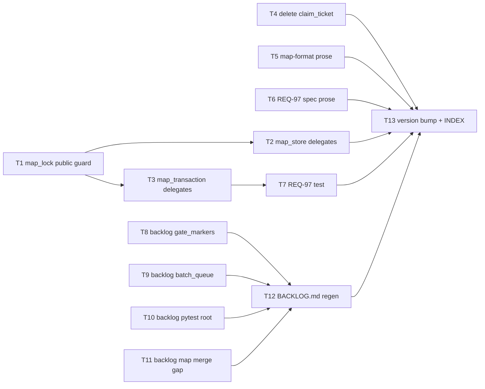

# Plan: decision-map script cleanup (Phase 2)

Source brief: docs/loom/specs/2026-08-31-decision-map-script-cleanup.md
Approved entry: docs/loom/specs/2026-08-31-decision-map-script-cleanup.md (brief, user sign-off 2026-08-31; autonomous execution, PR-open terminal)
Goal: One symlink-guard body in `map_lock.py` parameterized by exception
    class with `map_store` / `map_transaction` delegating, `claim_ticket.py`
    and its test deleted with `map-format.md` and living-spec `REQ-97`
    rewritten to "claims are not transferable", four backlog entries filed,
    loom-workflow bumped to 3.1.1 — serves PURPOSE: a path-safety fix lands
    once instead of drifting across three copies, and a documented behavior
    nothing implements stops being a promise a session could act on
Stage: sdd:wave-2
Steps:
    1. 守衛三合一：map_lock 公開版本、map_store 與 map_transaction 各改一行委派
    2. 拆掉 reclaim：刪 claim_ticket、改寫 map-format 與 REQ-97、補 REQ-97 的真實測試
    3. 立案：四條 backlog 條目與索引重生
    4. 收尾：版本 bump、CHANGELOG、INDEX 重生
Total tasks: 13
Critical-path depth: 4 (≤5)
Execution order: parallel-where-possible
Plan-document-reviewer verdict: PASS (2026-08-31, round 2)

## Task-flow diagram

## Open Questions

N/A — no unresolved question: the brief's Open Questions section is empty; the user ratified deleting `claim_ticket.py` and the REQ-97 rewrite on 2026-08-31.

## Complexity assessment

- Added complexity: one public function on `map_lock.py` with an `error=` parameter that two sibling modules now depend on; one new test file (`test_map_lock.py`); four backlog entries that future `--ready` runs will keep surfacing.
- Why it is worthwhile: the three guard copies are byte-identical apart from the raised type (brief Error bullet) — one body means the next path-safety fix lands once; the reclaim tool is a documented behavior with no entry point and no realistic success path (brief Forward bullet), so removing it closes a promise nothing keeps.
- Removed or avoided complexity: two guard bodies (~20 lines) deleted; `claim_ticket.py` (151 lines) and `test_claim_ticket.py` (206 lines) deleted; two reclaim scenarios removed from the living spec; no CLI, no wiring, no new exception hierarchy.
- Downstream risk: a caller that relied on the private name's exact message text — mitigated by keeping each module's message and type unchanged (Tasks 2/3 GREEN name the 54 existing assertions); `docs/loom/INDEX.md` and `docs/loom/BACKLOG.md` going stale — mitigated by Task 12/13 regenerating both and naming the CI tests that verify them.

## Task 1 — map_lock 公開一份帶例外參數的守衛
- **Description**: In `loom-workflow/skills/decision-map/scripts/map_lock.py`, rename `_assert_no_symlink_components` to public `assert_no_symlink_components(path: Path, error: type[Exception] = MapLockError) -> None`, raising `error(f"refusing path with symlink component: {current}")`.
  - Keep the two in-module callers (`_assert_no_symlink_components(map_dir)` and `(transactions)`) calling the new name with the default.
  - Add `loom-workflow/skills/decision-map/scripts/test_map_lock.py` with two tests: a symlinked component raises the caller-supplied class; the default raises `MapLockError`.
  - Grounding: `map_lock.py` `def _assert_no_symlink_components(path: Path) -> None` and `class MapLockError(RuntimeError)`.
  - Test file follows the sibling-import idiom of `test_map_store.py` (`sys.path` insert of its own directory, then `import map_lock`).
- **Module**: loom-workflow/skills/decision-map/scripts/map_lock.py
- **Files touched**: loom-workflow/skills/decision-map/scripts/map_lock.py, loom-workflow/skills/decision-map/scripts/test_map_lock.py
- **Context paths**:
  - loom-workflow/skills/decision-map/scripts/map_lock.py
  - loom-workflow/skills/decision-map/scripts/test_map_store.py
- **Acceptance**:
  - **RED**: `test_map_lock.py::test_assert_no_symlink_components_raises_caller_supplied_class` fails with `AttributeError` (no public `assert_no_symlink_components`) on HEAD.
  - **GREEN**: both new tests pass; `python3 -m pytest loom-workflow/skills/decision-map/scripts -q` stays green (254 at baseline + 2).
- **Dependencies**: none
- **Independent**: true
- **Brief item covered**: BI-1
- **Review disposition**: batch(symlink-guard)
- **Status**: implemented(b50433ffc861b47221bb49c501b50eba1e22d56a)
- **Gloss**: 守衛本體只剩這一份，要丟哪種例外由呼叫者說了算。

## Task 2 — map_store 的守衛改成一行委派
- **Description**: In `loom-workflow/skills/decision-map/scripts/map_store.py`, replace the body of `_assert_no_symlink_components(path)` with `map_lock.assert_no_symlink_components(path, error=SchemaViolation)`; keep the private name so `map_lifecycle.py` and `migrate_map_v3.py` are untouched.
  - Message text changes from `refusing mutation through symlink component` to `refusing path with symlink component`; confirm via grep that no test in `loom-workflow/` asserts the old phrase (brief Error bullet: 54 assertions pin type, none the text) before relying on it.
  - RED test lives in `test_map_store.py`: create `tmp_path/link -> tmp_path/real` with `os.symlink`, call `map_store._assert_no_symlink_components(tmp_path / "link" / "x")`, assert `SchemaViolation` whose message contains `refusing path with symlink component` (the `map_lock` wording).
  - Why RED on HEAD: map_store's own loop says `refusing mutation through symlink component`, so the message assertion fails until the delegation exists.
- **Module**: loom-workflow/skills/decision-map/scripts/map_store.py
- **Files touched**: loom-workflow/skills/decision-map/scripts/map_store.py, loom-workflow/skills/decision-map/scripts/test_map_store.py
- **Context paths**:
  - loom-workflow/skills/decision-map/scripts/map_store.py
  - loom-workflow/skills/decision-map/scripts/map_lock.py
  - loom-workflow/skills/decision-map/scripts/map_lifecycle.py
- **Acceptance**:
  - **RED**: `test_map_store.py::test_symlink_guard_delegates_to_map_lock` fails on HEAD (message mismatch: map_store's own loop emits `refusing mutation through symlink component`).
  - **GREEN**: the new test passes; every existing `symlink` test in `test_map_store.py`, `test_delivery_binding.py`, `test_map_progress.py`, `test_start_delivery.py` still passes with `SchemaViolation`; `grep -c "current.is_symlink()" map_store.py` = 0.
- **Dependencies**: Task 1 completes first
- **Seam**:
  - from Task 1: payload: `map_lock.assert_no_symlink_components(path, error=...)` signature; owner: Task 1; probe: test_symlink_guard_delegates_to_map_lock
- **Independent**: false
- **Brief item covered**: BI-2
- **Review disposition**: batch(symlink-guard)
- **Status**: implemented(88ef209f09366cb6420333ebde86c997d7880796)
- **Gloss**: map_store 不再自己走路徑，交給 map_lock，丟的還是 SchemaViolation。

## Task 3 — map_transaction 的守衛改成一行委派
- **Description**: In `loom-workflow/skills/decision-map/scripts/map_transaction.py`, replace the body of `_assert_no_symlink_components(path)` with `map_lock.assert_no_symlink_components(path, error=CloseTransactionError)`; keep the private name for its two in-module callers.
  - RED test lives in `test_map_transaction.py`: same symlink fixture as Task 2's test, call `map_transaction._assert_no_symlink_components(tmp_path / "link" / "x")`, assert `CloseTransactionError`.
  - Why RED on HEAD: map_transaction's wording already matches `map_lock`'s, so the test also monkeypatches `map_lock.assert_no_symlink_components` to raise `RuntimeError("delegated")` and asserts that propagates — HEAD's own loop never reaches it.
- **Module**: loom-workflow/skills/decision-map/scripts/map_transaction.py
- **Files touched**: loom-workflow/skills/decision-map/scripts/map_transaction.py, loom-workflow/skills/decision-map/scripts/test_map_transaction.py
- **Context paths**:
  - loom-workflow/skills/decision-map/scripts/map_transaction.py
  - loom-workflow/skills/decision-map/scripts/map_lock.py
- **Acceptance**:
  - **RED**: `test_map_transaction.py::test_symlink_guard_delegates_to_map_lock` fails on HEAD (the monkeypatched `map_lock.assert_no_symlink_components` is never reached by map_transaction's own loop).
  - **GREEN**: the new test passes; existing `symlink` tests in `test_map_transaction.py` still raise `CloseTransactionError`; `grep -c "current.is_symlink()" map_transaction.py` = 0.
- **Dependencies**: Task 1 completes first
- **Seam**:
  - from Task 1: payload: `map_lock.assert_no_symlink_components(path, error=...)` signature; owner: Task 1; probe: test_symlink_guard_delegates_to_map_lock
- **Independent**: false
- **Brief item covered**: BI-3
- **Review disposition**: batch(symlink-guard)
- **Status**: implemented(9259e6c43114840858d87a7e2eb6f6c17f38dae1)
- **Gloss**: map_transaction 同樣交給 map_lock，丟的還是 CloseTransactionError。

## Task 4 — 刪除孤兒 claim_ticket 與其測試
- **Description**: `git rm loom-workflow/skills/decision-map/scripts/claim_ticket.py loom-workflow/skills/decision-map/scripts/test_claim_ticket.py`; no other edit.
  - Deletion task — the acceptance is a diagnostic, not a new test (tdd-iron-law §When NOT to Use: removal with no surviving behavior to pin).
- **Module**: loom-workflow/skills/decision-map/scripts/claim_ticket.py
- **Files touched**: loom-workflow/skills/decision-map/scripts/claim_ticket.py, loom-workflow/skills/decision-map/scripts/test_claim_ticket.py
- **Context paths**:
  - loom-workflow/skills/decision-map/scripts/map_transaction.py
- **Acceptance**:
  - **RED**: diagnostic — on HEAD `grep -rln "import claim_ticket" loom-workflow/` lists `test_claim_ticket.py` (the orphan's only importer exists).
  - **GREEN**: both files absent; `grep -rn "claim_ticket\." loom-workflow/ --include='*.py' --include='*.md'` matches only `map_transaction.claim_ticket`; `python3 -m pytest loom-workflow/skills/decision-map/scripts -q` green with 4 fewer tests.
- **Dependencies**: none
- **Independent**: true
- **Brief item covered**: BI-4
- **Not batched because**: the proposer paired it with Tasks 1–3 by lane and module directory, but a deletion of an orphan module shares no verdict question with the guard extraction.
- **Review disposition**: individual
- **Status**: done(eacf7c95740d8f735c4328f236d23ae90c859027)
- **Gloss**: 拿掉沒人呼叫、也不可能成功的搶票工具。

## Task 5 — map-format.md：認領不可轉手
- **Description**: In `loom-workflow/skills/decision-map/references/map-format.md` §Status and graph, replace the sentence beginning `Reclaim is conservative:` with prose stating a claim is not transferable and an abandoned claimed Ticket leaves `claimed` only through Withdrawal.
  - Name `withdrawn-from: claimed` as the recorded path; keep the surrounding `Claims use ...` sentence and the Withdrawal paragraph unchanged.
- **Module**: loom-workflow/skills/decision-map/references/map-format.md
- **Files touched**: loom-workflow/skills/decision-map/references/map-format.md
- **Context paths**:
  - loom-workflow/skills/decision-map/references/map-format.md
  - loom-workflow/skills/decision-map/SKILL.md
- **Acceptance**:
  - **RED**: diagnostic — `grep -c "Reclaim is conservative" loom-workflow/skills/decision-map/references/map-format.md` = 1 on HEAD.
  - **GREEN**: that count = 0; `grep -c "withdrawn-from: claimed" loom-workflow/skills/decision-map/references/map-format.md` ≥ 2 (the existing frontmatter line plus the new sentence); `python3 -m pytest loom-workflow/skills/decision-map/scripts/test_skill_doc.py -q` green.
- **Review-weight**: prose
- **Dependencies**: none
- **Independent**: true
- **Brief item covered**: BI-10
- **Review disposition**: batch(reclaim-prose)
- **Status**: done(39efd994f34ac00f49fed878d51e37a2129a6fb6)
- **Gloss**: 格式文件不再承諾搶票；棄票只有 Withdrawal 一條路。

## Task 6 — 活規格 REQ-97 改寫
- **Description**: In `docs/loom/outcome-map-v3/specs/outcome-map/spec.md`, rewrite `### Requirement: REQ-97 — Stale claims have conservative recovery` as `### Requirement: REQ-97 — Claims are not transferable`, deleting the two reclaim scenarios.
  - One MUST sentence and two scenarios: a second claim on a `claimed` Ticket is refused and the `claim:` line is unchanged; an abandoned claimed Ticket is withdrawn with `withdrawn-from: claimed`.
  - Keep the id (the living-spec index keys on it); keep REQ-96 and REQ-98 untouched.
- **Module**: docs/loom/outcome-map-v3/specs/outcome-map/spec.md
- **Files touched**: docs/loom/outcome-map-v3/specs/outcome-map/spec.md
- **Context paths**:
  - docs/loom/outcome-map-v3/specs/outcome-map/spec.md
  - loom-workflow/skills/decision-map/references/map-format.md
- **Acceptance**:
  - **RED**: diagnostic — `grep -c "Claim is observably stale" docs/loom/outcome-map-v3/specs/outcome-map/spec.md` = 1 on HEAD.
  - **GREEN**: that count = 0; `grep -c "REQ-97 — Claims are not transferable" docs/loom/outcome-map-v3/specs/outcome-map/spec.md` = 1; the change-folder still validates via `loom-design:spec-expansion`'s documented `validate_spec_output.py` command against `docs/loom/outcome-map-v3` (exit 0).
- **Review-weight**: prose
- **Dependencies**: none
- **Independent**: true
- **Brief item covered**: BI-11
- **Review disposition**: batch(reclaim-prose)
- **Status**: done(383d53090ed76da7f267ba94754cbc7d8d014b70)
- **Gloss**: 活規格跟著改：REQ-97 從「可保守搶回」變成「不可轉手」。

## Task 7 — REQ-97 的真實測試
- **Description**: In `loom-workflow/skills/decision-map/scripts/test_map_transaction.py`, add `test_claim_ticket_refuses_already_claimed_ticket` tagged `# @req: REQ-97`.
  - Build a Map with one `claimed` ticket (`claim: alice, 2026-08-01`), call `map_transaction.claim_ticket` as `bob` with a fresh revision, assert `CloseTransactionError` matching `ticket must be open before claim` and that the ticket bytes are unchanged.
  - Grounding: `map_transaction.py` `raise CloseTransactionError("ticket must be open before claim")`; the same-owner-same-date idempotent branch (`ticket.frontmatter.status == "claimed" and ticket.frontmatter.claim == desired`) must not be hit — use a different owner.
  - Reuse the Map-building helpers already in `test_map_transaction.py`.
- **Module**: loom-workflow/skills/decision-map/scripts/test_map_transaction.py
- **Files touched**: loom-workflow/skills/decision-map/scripts/test_map_transaction.py
- **Context paths**:
  - loom-workflow/skills/decision-map/scripts/test_map_transaction.py
  - loom-workflow/skills/decision-map/scripts/map_transaction.py
- **Acceptance**:
  - **RED**: diagnostic — `grep -c "@req: REQ-97" loom-workflow/skills/decision-map/scripts/test_map_transaction.py` = 0 on HEAD (after Task 4, no test in `loom-workflow/` tags REQ-97); the test is new so the tag is its first appearance.
  - **GREEN**: the test passes; mutation sanity — temporarily changing `!= "open"` to `== "closed"` in `_claim_ticket_locked` makes it fail, then revert.
- **Dependencies**: Task 3 completes first
- **Seam**:
  - from Task 3: payload: none
- **Independent**: false
- **Brief item covered**: BI-12
- **Review disposition**: individual
- **Status**: pending
- **Gloss**: 讓 REQ-97 有一個真的在測「不可轉手」的測試，不是靠別的測試順帶掛名。

## Task 8 — backlog：loom_gate_markers 拆分
- **Description**: Write `docs/loom/backlog/2026-08-31-loom-gate-markers-split.md` per `docs/loom/backlog/README.md`'s frontmatter template (`name`, `description`, `status: open`, `origin`, `start: event — ...`).
  - Body names the three responsibilities (git/marker I/O, verdict parsing, CLI) at `loom-code/scripts/loom_gate_markers.py` (1389 lines) and the Phase 3 audit origin.
- **Module**: docs/loom/backlog/2026-08-31-loom-gate-markers-split.md
- **Files touched**: docs/loom/backlog/2026-08-31-loom-gate-markers-split.md
- **Context paths**:
  - docs/loom/backlog/README.md
  - docs/loom/backlog/2026-08-31-orphan-dispatch-receipt-jams-batch.md
  - loom-code/scripts/loom_gate_markers.py
- **Acceptance**:
  - **RED**: diagnostic — `python3 scripts/backlog_index.py --ready` does not list `2026-08-31-loom-gate-markers-split` on HEAD.
  - **GREEN**: `python3 scripts/backlog_index.py --validate` exits 0 and `--ready` lists the entry with its `event` trigger.
- **Review-weight**: prose
- **Dependencies**: none
- **Independent**: true
- **Brief item covered**: BI-13
- **Review disposition**: batch(backlog-entries)
- **Status**: done(2fd12171156467c225ccdbc1edc22b09848fe7ae)
- **Gloss**: Phase 3 第一項立案：1389 行的 gate marker 檔該拆三段。

## Task 9 — backlog：batch_queue 拆分
- **Description**: Write `docs/loom/backlog/2026-08-31-batch-queue-split.md` per the same template, body naming `loom-design/scripts/pipeline/batch_queue.py` (1369 lines) and its six responsibilities as enumerated from the module's own section comments, and the Phase 3 audit origin.
- **Module**: docs/loom/backlog/2026-08-31-batch-queue-split.md
- **Files touched**: docs/loom/backlog/2026-08-31-batch-queue-split.md
- **Context paths**:
  - docs/loom/backlog/README.md
  - loom-design/scripts/pipeline/batch_queue.py
- **Acceptance**:
  - **RED**: diagnostic — `python3 scripts/backlog_index.py --ready` does not list `2026-08-31-batch-queue-split` on HEAD.
  - **GREEN**: `python3 scripts/backlog_index.py --validate` exits 0 and `--ready` lists the entry.
- **Review-weight**: prose
- **Dependencies**: none
- **Independent**: true
- **Brief item covered**: BI-14
- **Review disposition**: batch(backlog-entries)
- **Status**: done(c8cd893547ef3148a26a2764f10a22e66517db0d)
- **Gloss**: Phase 3 第二項立案：1369 行的 batch_queue 檔混了六種責任。

## Task 10 — backlog：loom-design 統一 pytest root
- **Description**: Write `docs/loom/backlog/2026-08-31-loom-design-unified-pytest-root.md` per the same template.
  - Body cites the per-directory jobs in `.github/workflows/loom-siblings-ci.yml` (`python3 -m pytest loom-design/scripts/interface/ -v` and siblings) and the closed entry `2026-07-30-pytest-module-name-collision-loom-code-scripts-distribute-py-vs-obsidian` as the related module-identity diagnosis.
- **Module**: docs/loom/backlog/2026-08-31-loom-design-unified-pytest-root.md
- **Files touched**: docs/loom/backlog/2026-08-31-loom-design-unified-pytest-root.md
- **Context paths**:
  - docs/loom/backlog/README.md
  - .github/workflows/loom-siblings-ci.yml
  - docs/loom/backlog/2026-07-30-pytest-module-name-collision-loom-code-scripts-distribute-py-vs-obsidian.md
- **Acceptance**:
  - **RED**: diagnostic — `python3 scripts/backlog_index.py --ready` does not list `2026-08-31-loom-design-unified-pytest-root` on HEAD.
  - **GREEN**: `python3 scripts/backlog_index.py --validate` exits 0 and `--ready` lists the entry.
- **Review-weight**: prose
- **Dependencies**: none
- **Independent**: true
- **Brief item covered**: BI-15
- **Review disposition**: batch(backlog-entries)
- **Status**: done(6960225bac63aa431a1b386aac78902539af4e9b)
- **Gloss**: Phase 3 第三項立案：loom-design 的測試該有一個共同的 pytest 根。

## Task 11 — backlog：Map 認領在合併時衝突
- **Description**: Write `docs/loom/backlog/2026-08-31-map-claims-collide-at-merge-not-runtime.md` per the same template.
  - Body states: a Map under `docs/loom/maps/` is a committed file, `map_lock.py`'s `fcntl` lock serializes one checkout only, so two worktrees' claims on one ticket meet as a git merge conflict; candidate directions (claim-before-branch convention, or a merge-time validator) left open.
- **Module**: docs/loom/backlog/2026-08-31-map-claims-collide-at-merge-not-runtime.md
- **Files touched**: docs/loom/backlog/2026-08-31-map-claims-collide-at-merge-not-runtime.md
- **Context paths**:
  - docs/loom/backlog/README.md
  - loom-workflow/skills/decision-map/scripts/map_lock.py
  - loom-workflow/skills/decision-map/SKILL.md
- **Acceptance**:
  - **RED**: diagnostic — `python3 scripts/backlog_index.py --ready` does not list `2026-08-31-map-claims-collide-at-merge-not-runtime` on HEAD.
  - **GREEN**: `python3 scripts/backlog_index.py --validate` exits 0 and `--ready` lists the entry.
- **Review-weight**: prose
- **Dependencies**: none
- **Independent**: true
- **Brief item covered**: BI-16
- **Review disposition**: batch(backlog-entries)
- **Status**: done(46545009300388c03fa373703a6113f7de86c1c5)
- **Gloss**: 把你真正的多 worktree 問題記下來：認領會在合併時撞，不是執行期。

## Task 12 — BACKLOG.md 索引重生
- **Description**: SSOT is the four new entry files `docs/loom/backlog/2026-08-31-*.md` (Tasks 8–11). Run `python3 scripts/backlog_index.py --write` (regenerates `docs/loom/BACKLOG.md` from the entry files, per `docs/loom/backlog/README.md`) and commit the result unmodified.
  - No hand edits (file header: `GENERATED by scripts/backlog_index.py — do not edit by hand`).
- **Module**: docs/loom/BACKLOG.md
- **Files touched**: docs/loom/BACKLOG.md
- **Context paths**:
  - docs/loom/backlog/README.md
  - scripts/backlog_index.py
- **Acceptance**:
  - **RED**: diagnostic — `grep -c "2026-08-31-map-claims-collide-at-merge-not-runtime" docs/loom/BACKLOG.md` = 0 before regeneration.
  - **GREEN**: all four new entries appear under `## open`; `python3 scripts/backlog_index.py --validate` exits 0; `python3 -m pytest scripts/ -q` green (the index-freshness test, if present, passes).
- **Review-weight**: mechanical
- **Dependencies**: Tasks 8, 9, 10, 11 complete first
- **Seam**:
  - from Task 8: payload: none
  - from Task 9: payload: none
  - from Task 10: payload: none
  - from Task 11: payload: none
- **Independent**: false
- **Brief item covered**: BI-17
- **Review disposition**: individual
- **Status**: done(1b9fca5c0d65202481203d645296c3d44f8659ef)
- **Gloss**: 索引是產生出來的，四條新條目進去後跑一次腳本。

## Task 13 — loom-workflow 3.1.1 版本 bump、CHANGELOG、INDEX 重生
- **Description**: Bump `loom-workflow/.claude-plugin/plugin.json` to `3.1.1`, run `python3 scripts/sync_codex_manifests.py loom-workflow` to mirror `.codex-plugin/plugin.json`, and add a `## [3.1.1] — 2026-08-31` CHANGELOG entry.
  - CHANGELOG entry names: guard extraction, claim_ticket removal, REQ-97 rewrite, four backlog entries.
  - Retarget the version pin in `loom-workflow/skills/decision-map/scripts/test_skill_doc.py` (`assert claude_manifest["version"] == "3.1.0"` and the `## [3.1.0]` changelog assertion) to 3.1.1.
  - Last step: regenerate `docs/loom/INDEX.md` with `python3 loom-code/scripts/check-living-spec-index.py --write-index docs/loom/INDEX.md .` so `loom-code/scripts/test_check_living_spec_index.py::test_committed_index_is_current` passes (test population changed by Tasks 1, 4, 7).
  - Reference: `loom-workflow/CHANGELOG.md` `## [3.1.0] — 2026-08-31` entry shape.
- **Module**: loom-workflow/.claude-plugin/plugin.json
- **Files touched**: loom-workflow/.claude-plugin/plugin.json, loom-workflow/.codex-plugin/plugin.json, loom-workflow/CHANGELOG.md, loom-workflow/skills/decision-map/scripts/test_skill_doc.py, docs/loom/INDEX.md
- **Context paths**:
  - scripts/sync_codex_manifests.py
  - loom-workflow/CHANGELOG.md
  - loom-workflow/skills/decision-map/scripts/test_skill_doc.py
- **Acceptance**:
  - **RED**: `python3 scripts/sync_codex_manifests.py --check loom-workflow` passes on HEAD at 3.1.0; after editing only the Claude manifest to 3.1.1 it exits non-zero — that drift is the RED.
  - **GREEN**: `python3 scripts/sync_codex_manifests.py --check loom-workflow` exits 0 at 3.1.1; `python3 -m pytest loom-workflow/skills/decision-map/scripts -q` green including `test_skill_doc.py`; `python3 -m pytest loom-code/scripts/test_check_living_spec_index.py -q` green.
    - `grep -c '"version": "3.1.1"' loom-workflow/.claude-plugin/plugin.json loom-workflow/.codex-plugin/plugin.json` = 1 each; `grep -c "## \[3.1.1\]" loom-workflow/CHANGELOG.md` = 1.
- **Dependencies**: Tasks 2, 4, 5, 6, 7, 12 complete first
- **Seam**:
  - from Task 2: payload: none
  - from Task 4: payload: none
  - from Task 5: payload: none
  - from Task 6: payload: none
  - from Task 7: payload: none
  - from Task 12: payload: none
- **Independent**: false
- **Brief item covered**: BI-7
- **Not batched because**: the proposer paired it with Task 7 by dependency, but release administration closes after every other task and shares no verdict question with the REQ-97 test.
- **Review disposition**: individual
- **Status**: pending
- **Gloss**: 收尾：版本號兩個表面同步、CHANGELOG 記下這次交付、活規格索引重生。

## Review Batches

### Review Batch: symlink-guard
- **Members**: Task 1, Task 2, Task 3
- **Verdict question**: After `map_lock` owns the one guard body, do `map_store` and `map_transaction` delegate to it while every existing symlink assertion still receives its module's own exception type?
- **Review lane**: full
- **Aggregate verification**: inert description — run `python3 -m pytest loom-workflow/skills/decision-map/scripts/test_map_lock.py loom-workflow/skills/decision-map/scripts/test_map_store.py loom-workflow/skills/decision-map/scripts/test_map_transaction.py loom-workflow/skills/decision-map/scripts/test_delivery_binding.py loom-workflow/skills/decision-map/scripts/test_map_progress.py loom-workflow/skills/decision-map/scripts/test_start_delivery.py -q` and confirm `grep -c "current.is_symlink()"` is 1 in `map_lock.py` and 0 in each of `map_store.py` and `map_transaction.py`.
- **Boundary**: capability: shared symlink guard; exclusions: none; consumable: yes

### Review Batch: reclaim-prose
- **Members**: Task 5, Task 6
- **Verdict question**: Do the reference format and the living spec now say the same thing — a claim is not transferable and an abandoned claimed Ticket leaves through Withdrawal — with no surviving reclaim promise?
- **Review lane**: prose
- **Aggregate verification**: inert description — `grep -rn "Reclaim is conservative\|observably stale" loom-workflow/skills/decision-map/references/map-format.md docs/loom/outcome-map-v3/specs/outcome-map/spec.md` returns nothing, and both files state `withdrawn-from: claimed` as the abandonment path.
- **Boundary**: capability: claim non-transferability prose; exclusions: none; consumable: yes

### Review Batch: backlog-entries
- **Members**: Task 8, Task 9, Task 10, Task 11
- **Verdict question**: Does each of the four entries state a checkable `event` start trigger and a body a future planner could pick up without this session's context?
- **Review lane**: prose
- **Aggregate verification**: inert description — `python3 scripts/backlog_index.py --validate` exits 0 and `python3 scripts/backlog_index.py --ready` lists all four `2026-08-31-*` entries with their triggers.
- **Boundary**: capability: Phase 3 and map-gap backlog filing; exclusions: none; consumable: yes

## Decision Log

### DL-1 — Deletion task's reviewer packet cannot satisfy the cat-file existence check (2026-08-31, SDD wave 1)
- Class: packet-side contract collision, below kickoff threshold (review mechanics; no product consequence).
- Fact (orchestrator): SDD step 3 requires `git cat-file -e <reviewed_sha>:<path>` for every declared `Files touched`; Task 4's two paths are deleted at every SHA after its commit, so the check fails by construction for any deletion task.
- Decision: dispatch Task 4's reviewers with the deletion commit as the artifact scope — cross-read the removed content at `<commit>~1:<path>` and prove absence at `<commit>:<path>` — instead of refusing the fan-out; the immutable-SHA principle (no working-tree reads) is preserved. Recorded here rather than briefed; a follow-up to the SDD contract text is a candidate memory/backlog item at close-out.

## Notes

- Kickoff sweep (kickoff-briefing §b): 0 one-way-door decisions — every change here is reverted by `git revert` with no data migration or external contract; no `PRINCIPLES.md` appetite entry exists. Below-threshold decisions route to the Decision Log as SDD discovers them.
- Tasks 4, 7, 12, 13 are individual review: Task 4 is a deletion with a diagnostic acceptance and no shared verdict with the prose rewrite; Task 7 is a code test that would mix lanes with the prose batch; Task 12 is a generated-file regeneration; Task 13 is release administration closing after every other task.
- Task 13 runs the full triad: the CHANGELOG entry is authored prose, so `Review-weight: mechanical` does not apply.
- BI-8 (guard bodies obsolete) is realized by Tasks 2 and 3; BI-9 (reclaim promise obsolete) by Tasks 5 and 6 — obsolescence items are outcomes of the citing tasks, not separately owned, so the coverage script's two warnings are expected.
- Brief identifiers BI-5 and BI-6 were split into BI-10…BI-17 at plan time so each task owns one item (Review Batch packets refuse duplicate requirement authority — backlog `2026-08-31-one-owner-per-requirement-refuses-same-item-batches`).
