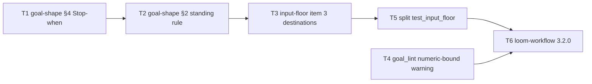

# Plan: goal-create Stop-when repair

Source brief: docs/loom/specs/2026-08-31-goal-create-stop-when.md
Goal: A goal drafted by goal-create carries exactly one mechanical Stop-when
    bound written as a completion condition, resolves every human-dependent
    fork before the run (pre-decided in Constraints or delegated under a
    standing search-decide-record rule that SESSION mode emits by default),
    warns when Stop-when has no numeric bound, and the input-floor test file
    names one claim per test — serves PURPOSE: a contract whose real use
    contradicts its text is a claim that shipped unverified; this arc
    re-grounds the goal contract on seven observed runs and one experiment
Stage: planning
Total tasks: 6
Critical-path depth: 5 (≤5)
Execution order: parallel-where-possible
Plan-document-reviewer verdict: PENDING

## Task-flow diagram

## Open Questions

N/A — no unresolved question: the shape (keep four fields), the bound-as-completion phrasing, the fork rule's two destinations, the syntactic-not-lexical lint, and the test-split rider were each decided by kouko on 2026-08-31 during brainstorming and sign-off.

## Complexity assessment

- Added complexity: one advisory warning code in `goal_lint.py`; one standing Constraints entry every SESSION goal now carries (≈2 lines of goal text per run); two reference paragraphs that a cold reader must apply; ~14 more test function names in one file.
- Why it is worthwhile: 7/7 real goals misused the field the two paragraphs define, with both failure modes observed (early stop, never stops); the experiment on 2026-08-31 showed the repaired phrasing is honoured by the evaluator, so the fix is a text change, not a mechanism.
- Removed or avoided complexity: no stop-word list, no OR-branch counter, no new field, no evaluator-side hook, no change to `FIELD_LABELS` or the tri-language fixtures; the "needs a human → stop and report" exit pattern disappears from drafted goals.
- Downstream risk: a run now decides forks the user might have decided differently — correction moves after the fact (accepted in the brief); the digit warning false-positives on a wall-clock bound spelled in words ("one hour") — advisory only, never blocks; the standing rule is prose, so a blind-run repeat (brief §Alternatives, conditional reversal) is the check that it holds.

## Task 1 — goal-shape §4：Stop-when ＝ 一條寫成完成條件的機械上限
- **Description**: Rewrite `## 4 — Stop-when` in `references/goal-shape.md` so the definition states one mechanical bound phrased as a completion condition, gives the canonical example, and explains why a bare turn clause fails.
  - Required content, each clause checkable by the RED test below:
    | Clause | Must state |
    |---|---|
    | count | exactly one bound — a turn count or a wall-clock limit — never a list of exit conditions |
    | completion | reaching the bound with a status report posted in the conversation counts as the run completing, as a failure report |
    | why | a bare "stop after N turns" is read by the evaluator as permission to stop, not as the condition being met, so it neither releases the run nor bounds it |
    | forks | human-dependent forks are not Stop-when material — pointer to `input-floor.md` §4 item 3 |
    | example | one canonical example containing the word "turn" (the existing pin `"turn" in content_lower` must keep holding) |
  - Keep the `## Provenance and attribution` paragraph byte-identical — `test_goal_shape.py` pins "this skill's own choice" and the "both … require" negative guard.
  - Stay under the reference's current size class (≈750 words → ≤ 900 words).
- **Module**: loom-workflow/skills/goal-create/references/goal-shape.md
- **Files touched**: loom-workflow/skills/goal-create/references/goal-shape.md, loom-workflow/skills/goal-create/scripts/test_goal_shape.py
- **Context paths**:
  - loom-workflow/skills/goal-create/references/goal-shape.md
  - loom-workflow/skills/goal-create/scripts/test_goal_shape.py (`_section`-style helpers, `_paragraph_containing`)
  - docs/loom/specs/2026-08-31-goal-create-stop-when.md (BI-1, Current State Evidence → Boundary)
  - docs/loom/memory/a-list-of-forbidden-words-is-defeated-by-the-word-outside-it.md (bind negations to their object in the new test)
- **Acceptance**:
  - **RED**: `test_stop_when_is_one_bound_written_as_completion` in `test_goal_shape.py` fails today: §4's body has no sentence binding "one" to the bound, none binding "report" to "complet", and no "permission" rationale.
  - **GREEN**: that test and the whole file pass (`python3 -m pytest loom-workflow/skills/goal-create/scripts/test_goal_shape.py -q`); the five clauses above are each asserted within §4's own section text (scoped by heading, not whole-file containment).
- **Dependencies**: none
- **Independent**: false
- **Brief item covered**: BI-1
- **Review disposition**: batch(shape-prose)
- **Status**: pending
- **Gloss**: 讓評估器把「上限到了」讀成「run 完成」，run 才會真的在上限停下——這是今天實驗證明有效的那個措辭。

## Task 2 — goal-shape §2：常設決策規則成為 SESSION 預設帶出的 Constraints 條目
- **Description**: Extend `## 2 — Constraints` in `references/goal-shape.md` with a standing decision rule that SESSION mode emits by default in every drafted goal.
  - The rule is a named sub-heading or bold lead inside §2; its exact name is the Seam payload Task 3 points at.
  - It must say: choices the goal does not pre-decide are the run's to make; the run searches first, decides, and records decision + candidates + sources in a named file; the run never stops to ask.
  - Must say the entry is emitted by default and carries the `derived` provenance tag (anchor: this section) per `input-floor.md` §5, so a user does not have to remember to write it.
  - Must say what stays outside the run: an irreversible or outward-facing act (merge, deploy, send), which is where `Outcome` ends.
  - Do not touch §4 (Task 1 owns it) or the attribution paragraph.
- **Module**: loom-workflow/skills/goal-create/references/goal-shape.md
- **Files touched**: loom-workflow/skills/goal-create/references/goal-shape.md, loom-workflow/skills/goal-create/scripts/test_goal_shape.py
- **Context paths**:
  - loom-workflow/skills/goal-create/references/goal-shape.md
  - loom-workflow/skills/goal-create/references/input-floor.md (§5 tag vocabulary)
  - loom-workflow/skills/goal-create/scripts/test_goal_shape.py
  - docs/loom/specs/2026-08-31-goal-create-stop-when.md (BI-3, BI-2's "only an irreversible or outward-facing act")
- **Acceptance**:
  - **RED**: `test_constraints_carries_the_standing_decision_rule` in `test_goal_shape.py` fails today: §2 contains no "search" / "decide" / "record" sequence, no "default" emission claim, and no `derived` tag mention.
  - **GREEN**: the test passes with each of the four obligations (sequence, never-ask bound to its object, default emission, `derived` tag) asserted inside §2's section text; Task 1's test still passes; file word count ≤ 900.
- **Dependencies**: Task 1 completes first
- **Seam**:
  - from Task 1: payload: none
- **Independent**: false
- **Brief item covered**: BI-3
- **Review disposition**: batch(shape-prose)
- **Status**: pending
- **Gloss**: 以後每份 goal 自帶「分岔自己查、自己決、留紀錄、不回頭問」，不用你每次記得寫。

## Task 3 — input-floor §4 第 3 項：依賴人的分岔有兩個去處、永不當出口
- **Description**: Append the remedy to item 3 of `## 4 — The bar` in `references/input-floor.md`: a human-dependent condition never becomes a `Stop-when` branch; it is pre-decided in `Constraints`, or delegated to the run under the standing rule in `goal-shape.md` §2.
  - Keep item 3's first two sentences byte-identical — `test_input_floor.py` pins "person acting or answering" and the bound negation "not … depend".
  - The remedy stays inside item 3's own list item (the file's tests split on numbered list items), as one or more added sentences, not a new item 4.
  - Name the goal-shape §2 rule by the exact name Task 2 gave it (Seam payload) so the two files point at one rule instead of restating it.
  - File stays ≤ 900 words.
- **Module**: loom-workflow/skills/goal-create/references/input-floor.md
- **Files touched**: loom-workflow/skills/goal-create/references/input-floor.md, loom-workflow/skills/goal-create/scripts/test_input_floor.py
- **Context paths**:
  - loom-workflow/skills/goal-create/references/input-floor.md
  - loom-workflow/skills/goal-create/scripts/test_input_floor.py (`_numbered_list_items`, `_negation_binds`)
  - loom-workflow/skills/goal-create/references/goal-shape.md (after Task 2 — the rule's name)
  - docs/loom/specs/2026-08-31-goal-create-stop-when.md (BI-2)
- **Acceptance**:
  - **RED**: `test_person_dependence_names_its_two_destinations` in `test_input_floor.py` fails today: item 3 mentions neither `Stop-when`, nor `Constraints`, nor `goal-shape.md`.
  - **GREEN**: the test passes and every pre-existing test in the file still passes.
    - Within item 3's own text: "never" binds to `Stop-when` (max gap 4 words via `_negation_binds`); `Constraints` appears; the exact rule name from `goal-shape.md` §2 appears.
    - The probe `test_person_dependence_names_its_two_destinations` reads that rule name from `goal-shape.md` at test time rather than hard-coding it.
- **Dependencies**: Task 2 completes first
- **Seam**:
  - from Task 2: payload: the standing rule's name string as written in `goal-shape.md` §2; owner: Task 2; probe: test_person_dependence_names_its_two_destinations
- **Independent**: false
- **Brief item covered**: BI-2
- **Review disposition**: batch(shape-prose)
- **Status**: pending
- **Gloss**: 把「不准依賴人」補成「那要放哪」——起草 agent 不再把人的裁決塞進 Stop-when 當出口。

## Task 4 — goal_lint：Stop-when 沒有數字就警告（不失敗）
- **Description**: Add an advisory `no-numeric-bound` warning to `goal_lint.py` when the `Stop-when` field contains no digit; update the module docstring's Stop-when sentence to name this one syntactic check.
  - Warning only: `exit_code` stays 0; the check is `re.search(r"\d", content)` on the parsed `Stop-when` content — a syntactic feature, no word list (module docstring already states why).
  - Docstring: replace "`Stop-when` is covered only by the field-presence check" with a sentence naming the field-presence check plus the digit-presence warning, keeping the no-word-list rationale.
  - Tri-language fixtures ("跑滿 20 輪", "20 turns") must not trigger it.
- **Module**: loom-workflow/skills/goal-create/scripts/goal_lint.py
- **Files touched**: loom-workflow/skills/goal-create/scripts/goal_lint.py, loom-workflow/skills/goal-create/scripts/test_goal_lint.py
- **Context paths**:
  - loom-workflow/skills/goal-create/scripts/goal_lint.py (`lint_text`, `LintResult`, `PERSON_DEPENDENT_MARKERS` loop as the warning pattern to mirror)
  - loom-workflow/skills/goal-create/scripts/test_goal_lint.py (`test_floor_fails_structure_and_warns_on_judgment` fixture shape; comment "No hard failure ever fires for Stop-when's content")
  - loom-workflow/skills/goal-create/scripts/test_goal_lint_languages.py (fixtures that must stay warning-free)
- **Acceptance**:
  - **RED**: `test_stop_when_without_a_numeric_bound_warns_but_never_fails` in `test_goal_lint.py` fails today: a goal with `Stop-when: Stop when the work is done.` yields no `no-numeric-bound` warning.
  - **GREEN**: that goal yields exactly one `no-numeric-bound` warning with `exit_code == 0`; `Stop-when: 6 輪到達且已回報——視為完成` and the English 20-turn fixture yield none; `python3 -m pytest loom-workflow/skills/goal-create/scripts -q` all green.
- **Dependencies**: none
- **Independent**: true
- **Brief item covered**: BI-4
- **Review disposition**: individual
- **Not batched because**: no dependency edge and a different Module from every other task; its verdict question (does the linter warn on a digit-less Stop-when without ever failing) shares nothing with the prose batch
- **Status**: pending
- **Gloss**: 起草時漏掉回合數上限會被提醒，但不會擋住合法寫法。

## Task 5 — 拆 test_input_floor 的 359 行測試函式：一個主張一個測試
- **Description**: Split `test_defines_slots_refusal_bar_and_provenance` in `test_input_floor.py` into one test per claim, named for the claim, sharing the file's existing helpers; add a self-guard test that fails if any test function in the file exceeds 50 lines.
  - Regrouping, not a rewrite: every assertion moves verbatim; the file's total `assert` count after this task equals the count immediately before it (55 at plan time + whatever Task 3 added).
  - Split by claim, not by source paragraph (backlog entry `2026-08-28-one-test-function-bundles-fifteen-independent-claims` §Guard).
  - Expected ≈ 12–16 functions covering: two slot names; refusal rule; vague-goal claim; bar clause 1 / 2 / 3; bar-not-mechanical; the three provenance tags; citation boundary; the `required`/`bar` negative guard.
  - The guard test reads this file's own source (precedent: `test_no_unbound_negation_regex_in_this_file`) and asserts no `def test_` body exceeds 50 lines.
- **Module**: loom-workflow/skills/goal-create/scripts/test_input_floor.py
- **Files touched**: loom-workflow/skills/goal-create/scripts/test_input_floor.py
- **Context paths**:
  - loom-workflow/skills/goal-create/scripts/test_input_floor.py
  - docs/loom/backlog/2026-08-28-one-test-function-bundles-fifteen-independent-claims.md
  - domain-teams/skills/code-team/standards/naming-and-functions.md (soft 20 / hard 50 lines)
- **Acceptance**:
  - **RED**: `test_no_test_function_exceeds_fifty_lines` in `test_input_floor.py` fails today: `test_defines_slots_refusal_bar_and_provenance` is 361 lines.
  - **GREEN**: the guard passes; `grep -c "def test_defines_slots_refusal_bar_and_provenance"` is 0; `grep -c "^\s*assert"` equals the pre-task count; `python3 -m pytest loom-workflow/skills/goal-create/scripts/test_input_floor.py -q` green with ≥ 12 more collected tests than before.
- **Dependencies**: Task 3 completes first
- **Seam**:
  - from Task 3: payload: none
  - (ordering only: Task 3 adds a test to the same file; splitting after it avoids a merge on one file)
- **Independent**: false
- **Brief item covered**: BI-8
- **Review disposition**: individual
- **Not batched because**: the proposer pairs it with Task 3 on the shared file, but its verdict question (a pure regrouping that drops no assertion) is a different one from the prose batch's (do the two references now say the right thing), and a review that must count assertions should not be diluted by prose findings
- **Status**: pending
- **Gloss**: 測試壞掉時會直接說是哪一條主張壞了，而不是一個 359 行的名字。

## Task 6 — loom-workflow 版本 bump 3.1.0→3.2.0
- **Description**: Bump loom-workflow to 3.2.0 on every version surface and write the CHANGELOG entry summarising Tasks 1–5.
  - Surfaces: `loom-workflow/.claude-plugin/plugin.json`, `loom-workflow/.codex-plugin/plugin.json` (via `scripts/sync_codex_manifests.py`), `loom-workflow/CHANGELOG.md`, root `README.md` version table row.
  - Minor bump: skill behaviour changes (goal shape contract + linter warning), no breaking schema change.
- **Module**: loom-workflow plugin manifest (version surfaces)
- **Files touched**: loom-workflow/.claude-plugin/plugin.json, loom-workflow/.codex-plugin/plugin.json, loom-workflow/CHANGELOG.md, README.md
- **Context paths**:
  - scripts/check_version_bump.py, scripts/sync_codex_manifests.py
  - loom-workflow/CHANGELOG.md (3.1.0 entry format)
  - README.md (`| [\`loom-workflow\`](loom-workflow/) | 3.1.0 |` row)
- **Acceptance**:
  - **RED**: `python3 scripts/check_version_bump.py` non-zero on the branch diff (skill content changed, version unchanged).
  - **GREEN**: `check_version_bump.py` exit 0 and `python3 scripts/sync_codex_manifests.py --check loom-workflow` exit 0.
    - `grep -c '3.2.0'` ≥ 1 in each of README.md, loom-workflow/.claude-plugin/plugin.json, loom-workflow/.codex-plugin/plugin.json, loom-workflow/CHANGELOG.md.
    - Full floor `python3 -m pytest loom-workflow/skills/goal-create/scripts scripts -q` 0 failures.
- **Dependencies**: Tasks 4, 5 complete first
- **Seam**:
  - from Task 4: payload: none
  - from Task 5: payload: none
  - (ordering only: the CHANGELOG must describe the final tree)
- **Independent**: false
- **Brief item covered**: none — release administration (version bump) delivers no brief outcome
- **Review disposition**: individual
- **Not batched because**: release administration — it is the dependency sink of both chains, so any proposed pairing exists only because it closes the branch, not because it shares a verdict question
- **Status**: pending
- **Gloss**: 版本進 marketplace，`plugin update` 才拿得到新契約。

## Review Batches

### Review Batch: shape-prose
- **Members**: Task 1, Task 2, Task 3
- **Verdict question**: Do `goal-shape.md` and `input-floor.md` now tell a drafting agent one coherent story — Stop-when is one bound that counts as completion, a human fork is pre-decided or delegated under a rule both files name identically and never becomes an exit — with every new claim pinned by a heading-scoped test and every pre-existing pin still green?
- **Review lane**: full
- **Aggregate verification**: inert description — run `test_goal_shape.py` and `test_input_floor.py`, confirm the three new tests and all pre-existing tests pass, then read §4, §2 and item 3 back to back once and check the rule name matches across the two files.
- **Boundary**: capability: goal-create reference contract; exclusions: none; consumable: yes

## Notes

- Change-folder binding: none — no non-archived `docs/loom/<change-id>/` folder matches branch `goal-cerate-r2`; the caller handed a brainstorming brief; the plan derives from the brief (BI- ids).
- Review disposition rationale (same lane AND (dependency edge OR same Module), cap 4): Tasks 1+2+3 are one dependency chain over the two reference files and batch; Task 4 is a one-task module with no edge; Task 5 shares a file with Task 3 but carries a different verdict question (see its `Not batched because`); Task 6 is release administration. Planned fan-outs: 4 for 6 tasks.
- BI-5 (evidence — the 2026-08-31 experiment) is delivered by the brief itself; BI-6 (Decision umbrella) and BI-7 (the exit-branch pattern becoming obsolete) are delivered by the sum of Tasks 1–3; the coverage checker reports them as warnings by design.
- Language: task titles, Gloss and Notes in zh-Hant per the session; Description / Acceptance in English per writing-plans §Language policy.
