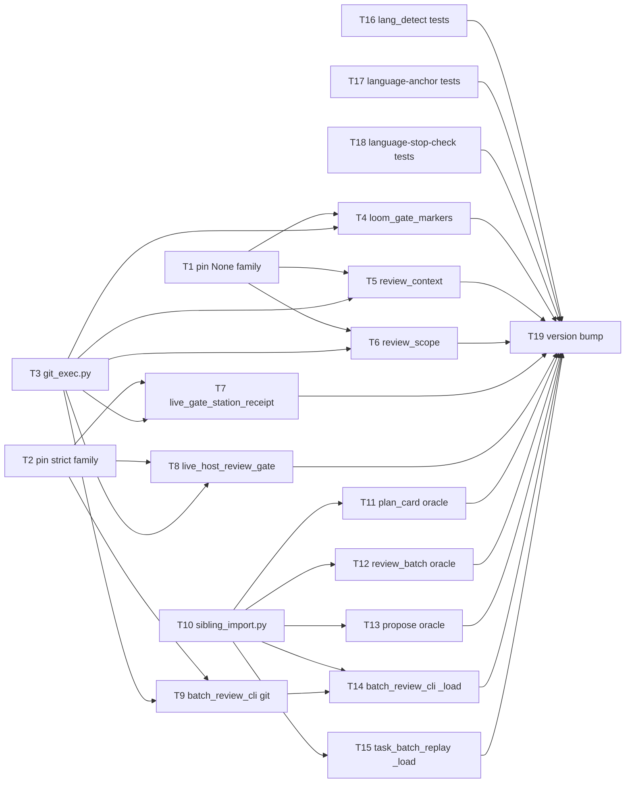

# Plan: loom-code script helper extraction (Phase 1)

Source brief: docs/loom/specs/2026-08-31-loom-code-script-helper-extraction.md
Goal: Six git wrappers pinned by characterization tests, then collapsed onto one
    `git_exec.py` body (call-site behavior unchanged, UTF-8 handling applied to
    all six), five sibling loaders collapsed onto one helper, and the two
    language hooks plus `lang_detect.py` under test — serves PURPOSE: a fix to
    one git call now reaches every git call in the plugin instead of being
    silently re-lost in five sibling copies
Stage: review:round-1
Steps:
    1. 釘住現況：六個 git 包裝的特性測試、新 helper 本體、hook 測試
    2. 搬遷：六個 git 包裝逐檔接上 git_exec、三個 oracle 載入器逐檔接上 helper
    3. 搬遷：batch_review_cli 與 task_batch_replay 的 `_load` 逐檔接上 helper
    4. 收尾：版本 bump 與 CHANGELOG
Total tasks: 19
Critical-path depth: 4 (≤5)
Execution order: parallel-where-possible
Plan-document-reviewer verdict: PASS (2026-08-31, round 3; DL-1 amendment PASS; DL-2 amendment PASS; DL-3 amendment PASS; DL-4 amendment PASS round 2)

## Task-flow diagram

## Open Questions

N/A — no unresolved question: the brief's Open Questions section is empty and the user ratified the UTF-8-to-all-six item (then BI-3, since split into BI-11…BI-15 per DL-4) on 2026-08-31.

## Complexity assessment

- Added complexity: two new sibling modules in `loom-code/scripts/` (`git_exec.py`, `sibling_import.py`) that every git-calling or oracle-loading script now imports; one more file for a relocating script to carry as a per-plugin copy (brief Decision, `heading_window.py` precedent).
- Why it is worthwhile: the six wrapper bodies already disagree (three failure families, UTF-8 fix in one copy only — brief Error/Boundary bullets); one body means the next fix lands once, and the characterization tests turn the undocumented failure contracts into executable ones.
- Removed or avoided complexity: six wrapper bodies (~80 lines) and five loader bodies (~45 lines) deleted; `batch_review_cli._run_subprocess`'s git-specific encoding logic moves to the shared body rather than being copied five more times.
- Downstream risk: a call site whose failure branch is not pinned by Task 1/2 could change shape silently — mitigated by the mutation sanity check in each pin task's GREEN; `sys.modules` name collisions if the loader helper drops a site's unique module name — mitigated by Task 10's RED asserting the name is honored.

## Task 1 — 釘住 None 家族的失敗行為
- **Description**: Add `loom-code/scripts/test_git_wrapper_characterization_none.py` pinning the failure paths of `loom_gate_markers._git`, `review_context._git`, `review_scope._git` against HEAD, one test per branch below.
  - Branches: non-repo `tmp_path` → `None`; failing ref → `None`; `review_scope._git` timeout → `None`; successful empty output → `""` not `None`.
  - Probe names consumed downstream: `test_loom_gate_markers_git_nonrepo_returns_none`, `test_review_context_git_nonrepo_returns_none`, `test_review_scope_git_timeout_returns_none`.
  - Grounding: `loom-code/scripts/loom_gate_markers.py` `"Run git in \`repo\`; return stripped stdout, or None on any failure."`; `review_scope.py` `def _git(repo: Path, *args: str, timeout: float | None = None)`.
  - No existing test reaches these branches (brief Error bullet).
  - Missing-binary case: monkeypatch `subprocess.run` to raise `OSError` (platform-independent) and assert `None`.
- **Module**: loom-code/scripts/test_git_wrapper_characterization_none.py
- **Files touched**: loom-code/scripts/test_git_wrapper_characterization_none.py
- **Context paths**:
  - loom-code/scripts/loom_gate_markers.py
  - loom-code/scripts/review_context.py
  - loom-code/scripts/review_scope.py
  - loom-code/scripts/test_review_scope.py
- **Acceptance**:
  - **RED**: no test in `loom-code/scripts/test_*.py` calls any of the three production `_git` functions on a non-repo path or with a failing ref (grep `_git(` in the four host test files finds only test-local helpers, brief Reverse bullet) — the new file's tests are the first to execute those branches.
  - **GREEN**: the new file passes unchanged against HEAD; mutation sanity — temporarily changing `review_scope._git`'s `except (OSError, subprocess.TimeoutExpired)` to re-raise makes ≥1 test fail, then revert; `python3 -m pytest loom-code/scripts/test_git_wrapper_characterization_none.py -q` all pass.
- **Dependencies**: none
- **Seam**: payload: none
- **Independent**: true
- **Brief item covered**: BI-9
- **Review disposition**: batch(git-exec-extraction)
- **Status**: implemented(95b306e76a9a98efee762412f6c8a09eb9414034)
- **Gloss**: 把三個「失敗回 None」包裝的現況釘成可執行契約，之後搬家有網可接。

## Task 2 — 釘住 raise 家族與 PacketRefused 的失敗行為
- **Description**: Add `loom-code/scripts/test_git_wrapper_characterization_strict.py` pinning the two `live_gate_*` wrappers and `batch_review_cli._run_git` against HEAD, one test per branch below.
  - `live_gate_station_receipt._git` / `live_host_review_gate._git`: non-zero → `subprocess.CalledProcessError`; `OSError` from a monkeypatched `subprocess.run` propagates; `timeout=20` passed.
  - `batch_review_cli._run_git`: non-zero → `PacketRefused` whose message starts `git <args> failed:`; `TimeoutExpired` → `PacketRefused`.
  - Probe names consumed downstream: `test_live_gate_station_receipt_git_raises_called_process_error`, `test_live_host_review_gate_git_raises_called_process_error`, `test_run_git_nonzero_raises_packet_refused`.
  - Grounding: `loom-code/scripts/live_host_review_gate.py` `def _git(repo: Path, *args: str) -> str` uses `check=True, timeout=20`.
  - Grounding: `batch_review_cli.py` `def _run_git(repo_root: Path, *args: str) -> str` raises `rb.PacketRefused`; `_run_subprocess` docstring "folds what were three separate TimeoutExpired->PacketRefused copies".
- **Module**: loom-code/scripts/test_git_wrapper_characterization_strict.py
- **Files touched**: loom-code/scripts/test_git_wrapper_characterization_strict.py
- **Context paths**:
  - loom-code/scripts/live_gate_station_receipt.py
  - loom-code/scripts/live_host_review_gate.py
  - loom-code/scripts/batch_review_cli.py
  - loom-code/scripts/test_batch_review_cli.py
- **Acceptance**:
  - **RED**: no test asserts the exception type raised by the two `live_gate_*` wrappers or by `_run_git` on a non-zero git exit (brief Error bullet: 0 tests exercise these branches) — the new file's assertions are the first.
  - **GREEN**: the new file passes unchanged against HEAD; mutation sanity — temporarily setting `check=False` in `live_host_review_gate._git` makes ≥1 test fail, then revert; `python3 -m pytest loom-code/scripts/test_git_wrapper_characterization_strict.py -q` all pass.
- **Dependencies**: none
- **Seam**: payload: none
- **Independent**: true
- **Brief item covered**: BI-10
- **Review disposition**: batch(git-exec-extraction)
- **Status**: implemented(4eb1e6de9f7ed9050d026976f33f85f3fb4bec0d)
- **Gloss**: 把「失敗就拋例外」的三個包裝釘住例外型別，搬家後不得變成靜默。

## Task 3 — 新增共用 git 本體 git_exec.py
- **Description**: Create `loom-code/scripts/git_exec.py` exposing `run_git(repo, *args, timeout=None, check=False, text=True, strip=True)` — one body, the return/raise shape selected by `check` and `text`.
  - `check=False`: stripped stdout, or `None` on `OSError` / non-zero / `TimeoutExpired`.
  - `check=True`: raises exactly what `subprocess.run(check=True)` raises; `OSError` / `TimeoutExpired` propagate.
  - `text=False`: raw `bytes`, no strip. `strip=False`: unstripped stdout.
  - Encoding: argv handed to `subprocess.run` as UTF-8 `bytes`; when `text=True` pass `encoding="utf-8", errors="surrogateescape"` — transcribe from `batch_review_cli._run_subprocess` (its docstring is the SSOT for why; do not restate it).
  - Sibling-module style: no `__init__.py`, plain `import git_exec` per `loom-code/scripts/heading_window.py`'s documented precedent.
- **Module**: loom-code/scripts/git_exec.py
- **Files touched**: loom-code/scripts/git_exec.py, loom-code/scripts/test_git_exec.py, loom-code/scripts/test_gate_scripts_fail_loud_on_unreadable_input.py
- **Context paths**:
  - loom-code/scripts/batch_review_cli.py
  - loom-code/scripts/test_batch_review_cli.py
  - loom-code/scripts/heading_window.py
- **Acceptance**:
  - **RED**: `test_git_exec.py::test_run_git_hands_utf8_bytes_argv_and_utf8_decoding` fails with `ModuleNotFoundError: git_exec`.
    - The test monkeypatches `subprocess.run`, calls `run_git(tmp_path, "show", "HEAD:src/日本.py")`, and asserts every argv item is `bytes` and kwargs carry `encoding="utf-8"`, `errors="surrogateescape"`.
  - **GREEN**: that test plus one per contract branch pass; `python3 -m pytest loom-code/scripts/test_git_exec.py -q` green.
    - `check=False` → `None` on non-repo / bad ref / monkeypatched `OSError` / `TimeoutExpired`; `check=True` → `CalledProcessError` on bad ref; `text=False` → `bytes`.
    - C-locale subprocess test (env `LC_ALL=C`, `PYTHONCOERCECLOCALE=0`, `PYTHONUTF8=0`, same technique as `test_packet_seals_non_ascii_path_under_c_locale`) decodes a non-ASCII path without `UnicodeDecodeError`.
- **Dependencies**: none
- **Seam**: payload: none
- **Independent**: true
- **Brief item covered**: BI-2
- **Review disposition**: batch(git-exec-extraction)
- **Status**: implemented(7645a42d2a16d06d0181d0db2bb56153f195efa3)
- **Gloss**: 一份 git 呼叫本體，三種回答形狀由 check／text 參數表達，UTF-8 處理只寫一次。

## Task 4 — loom_gate_markers 改接 git_exec
- **Description**: Replace the body of `loom_gate_markers._git` with a one-line delegation to `git_exec.run_git(repo, *args, check=False)`; add `test_loom_gate_markers_git_hands_utf8_bytes_argv` to `test_loom_gate_markers.py` (BI-11).
  - The `_git` name and its call sites stay untouched (brief Out of Scope: no caller rewrite).
- **Module**: loom-code/scripts/loom_gate_markers.py
- **Files touched**: loom-code/scripts/loom_gate_markers.py, loom-code/scripts/test_loom_gate_markers.py
- **Context paths**:
  - loom-code/scripts/git_exec.py
  - loom-code/scripts/test_git_exec.py
  - loom-code/scripts/test_git_wrapper_characterization_none.py
- **Acceptance**:
  - **RED**: `test_loom_gate_markers_git_hands_utf8_bytes_argv` (monkeypatched `subprocess.run` capture, asserting `bytes` argv + `encoding="utf-8"`) fails on HEAD because `loom_gate_markers._git` passes `str` argv with no `encoding=`.
    - Grounding: `loom-code/scripts/loom_gate_markers.py` `def _git(` calls `subprocess.run(` with `capture_output=True, text=True` and no `encoding=`.
  - **GREEN**: the RED test passes; every Task 1 pin for `loom_gate_markers._git` still passes unchanged; the probe `test_loom_gate_markers_git_nonrepo_returns_none` (Task 1) passes against the delegated body; `python3 -m pytest loom-code/scripts/test_loom_gate_markers.py -q` green.
- **Dependencies**: Tasks 1, 3 complete first
- **Seam**:
  - from Task 1: payload: none
  - from Task 3: payload: `run_git(repo, *args, timeout, check=False)` return contract (stripped stdout or `None`); owner: Task 3; probe: test_loom_gate_markers_git_nonrepo_returns_none
- **Independent**: true
- **Brief item covered**: BI-11
- **Review disposition**: batch(git-exec-extraction)
- **Status**: implemented(3d7b90ea97f7b6636ac15d75201f518304e87d1a)
- **Gloss**: gate marker 的 git 包裝搬到共用本體，None 契約不變，補一個 UTF-8 紅燈。

## Task 5 — review_context 改接 git_exec
- **Description**: Replace the body of `review_context._git` with a one-line delegation to `git_exec.run_git(repo, *args, check=False)`; add `test_review_context_git_hands_utf8_bytes_argv` to `test_review_context.py` (BI-12).
  - The `_git` name and its call sites stay untouched (brief Out of Scope: no caller rewrite).
- **Module**: loom-code/scripts/review_context.py
- **Files touched**: loom-code/scripts/review_context.py, loom-code/scripts/test_review_context.py
- **Context paths**:
  - loom-code/scripts/git_exec.py
  - loom-code/scripts/test_git_exec.py
  - loom-code/scripts/test_git_wrapper_characterization_none.py
- **Acceptance**:
  - **RED**: `test_review_context_git_hands_utf8_bytes_argv` (monkeypatched `subprocess.run` capture, asserting `bytes` argv + `encoding="utf-8"`) fails on HEAD because `review_context._git` passes `str` argv with no `encoding=`.
    - Grounding: `loom-code/scripts/review_context.py` `def _git(` calls `subprocess.run(` with `capture_output=True, text=True` and no `encoding=`.
  - **GREEN**: the RED test passes; every Task 1 pin for `review_context._git` still passes unchanged; the probe `test_review_context_git_nonrepo_returns_none` (Task 1) passes against the delegated body; `python3 -m pytest loom-code/scripts/test_review_context.py -q` green.
- **Dependencies**: Tasks 1, 3 complete first
- **Seam**:
  - from Task 1: payload: none
  - from Task 3: payload: `run_git(repo, *args, timeout, check=False)` return contract (stripped stdout or `None`); owner: Task 3; probe: test_review_context_git_nonrepo_returns_none
- **Independent**: true
- **Brief item covered**: BI-12
- **Review disposition**: batch(git-exec-extraction)
- **Status**: implemented(27740591c10db3f32b2f7a56c4cb9dc599422697)
- **Gloss**: review_context 的 git 包裝搬到共用本體，None 契約不變，補一個 UTF-8 紅燈。

## Task 6 — review_scope 改接 git_exec
- **Description**: Replace the body of `review_scope._git` with a one-line delegation to `git_exec.run_git(repo, *args, check=False, timeout=timeout)`; add `test_review_scope_git_hands_utf8_bytes_argv` to `test_review_scope.py` (BI-13).
  - The `_git` name and its call sites stay untouched (brief Out of Scope: no caller rewrite).
- **Module**: loom-code/scripts/review_scope.py
- **Files touched**: loom-code/scripts/review_scope.py, loom-code/scripts/test_review_scope.py
- **Context paths**:
  - loom-code/scripts/git_exec.py
  - loom-code/scripts/test_git_exec.py
  - loom-code/scripts/test_git_wrapper_characterization_none.py
- **Acceptance**:
  - **RED**: `test_review_scope_git_hands_utf8_bytes_argv` (monkeypatched `subprocess.run` capture, asserting `bytes` argv + `encoding="utf-8"`) fails on HEAD because `review_scope._git` passes `str` argv with no `encoding=`.
    - Grounding: `loom-code/scripts/review_scope.py` `def _git(` calls `subprocess.run(` with `capture_output=True, text=True` and no `encoding=`.
  - **GREEN**: the RED test passes; every Task 1 pin for `review_scope._git` still passes unchanged; the probe `test_review_scope_git_timeout_returns_none` (Task 1) passes against the delegated body; `python3 -m pytest loom-code/scripts/test_review_scope.py -q` green.
- **Dependencies**: Tasks 1, 3 complete first
- **Seam**:
  - from Task 1: payload: none
  - from Task 3: payload: `run_git(repo, *args, timeout, check=False)` return contract (stripped stdout or `None`); owner: Task 3; probe: test_review_scope_git_timeout_returns_none
- **Independent**: true
- **Brief item covered**: BI-13
- **Review disposition**: batch(git-exec-extraction)
- **Status**: implemented(9d22a1c6b6cfd99d61a20f074f42aa6e8aa11f5c)
- **Gloss**: review_scope 的 git 包裝搬到共用本體，timeout→None 契約不變，補一個 UTF-8 紅燈。

## Task 7 — live_gate_station_receipt 改接 git_exec
- **Description**: Replace the body of `live_gate_station_receipt._git` with `git_exec.run_git(repo, *args, timeout=20, check=True)`; add `test_live_gate_station_receipt_git_hands_utf8_bytes_argv` to `test_live_gate_station_receipt.py` (BI-14).
  - Exceptions keep propagating exactly as today: `CalledProcessError` on non-zero, `TimeoutExpired`, `OSError`.
- **Module**: loom-code/scripts/live_gate_station_receipt.py
- **Files touched**: loom-code/scripts/live_gate_station_receipt.py, loom-code/scripts/test_live_gate_station_receipt.py
- **Context paths**:
  - loom-code/scripts/git_exec.py
  - loom-code/scripts/test_git_wrapper_characterization_strict.py
  - loom-code/scripts/test_live_gate_station_receipt.py
- **Acceptance**:
  - **RED**: `test_live_gate_station_receipt_git_hands_utf8_bytes_argv` fails on HEAD (`str` argv, no `encoding=`).
    - Grounding: `loom-code/scripts/live_gate_station_receipt.py` `def _git(repo: Path, *args: str) -> str` passes `check=True, capture_output=True, text=True, timeout=20`.
  - **GREEN**: the RED test passes; every Task 2 pin for `live_gate_station_receipt._git` still passes; the probe `test_live_gate_station_receipt_git_raises_called_process_error` (Task 2) passes against the delegated body; `python3 -m pytest loom-code/scripts/test_live_gate_station_receipt.py -q` green.
- **Dependencies**: Tasks 2, 3 complete first
- **Seam**:
  - from Task 2: payload: none
  - from Task 3: payload: `run_git(..., check=True)` raise contract (`CalledProcessError` / `TimeoutExpired` / `OSError` propagate); owner: Task 3; probe: test_live_gate_station_receipt_git_raises_called_process_error
- **Independent**: true
- **Brief item covered**: BI-14
- **Review disposition**: batch(git-exec-extraction)
- **Status**: implemented(4d76d958866226fa1c8ee19296efab50aa268c43)
- **Gloss**: station receipt 的 git 包裝改用共用本體，「失敗就炸」一字不變。

## Task 8 — live_host_review_gate 改接 git_exec
- **Description**: Replace the body of `live_host_review_gate._git` with `git_exec.run_git(repo, *args, timeout=20, check=True)`; add `test_live_host_review_gate_git_hands_utf8_bytes_argv` to `test_live_host_review_gate.py` (BI-15).
  - Exceptions keep propagating exactly as today: `CalledProcessError` on non-zero, `TimeoutExpired`, `OSError`.
- **Module**: loom-code/scripts/live_host_review_gate.py
- **Files touched**: loom-code/scripts/live_host_review_gate.py, loom-code/scripts/test_live_host_review_gate.py
- **Context paths**:
  - loom-code/scripts/git_exec.py
  - loom-code/scripts/test_git_wrapper_characterization_strict.py
  - loom-code/scripts/test_live_host_review_gate.py
- **Acceptance**:
  - **RED**: `test_live_host_review_gate_git_hands_utf8_bytes_argv` fails on HEAD (`str` argv, no `encoding=`).
    - Grounding: `loom-code/scripts/live_host_review_gate.py` `def _git(repo: Path, *args: str) -> str` passes `check=True, capture_output=True, text=True, timeout=20`.
  - **GREEN**: the RED test passes; every Task 2 pin for `live_host_review_gate._git` still passes; the probe `test_live_host_review_gate_git_raises_called_process_error` (Task 2) passes against the delegated body; `python3 -m pytest loom-code/scripts/test_live_host_review_gate.py -q` green.
- **Dependencies**: Tasks 2, 3 complete first
- **Seam**:
  - from Task 2: payload: none
  - from Task 3: payload: `run_git(..., check=True)` raise contract (`CalledProcessError` / `TimeoutExpired` / `OSError` propagate); owner: Task 3; probe: test_live_host_review_gate_git_raises_called_process_error
- **Independent**: true
- **Brief item covered**: BI-15
- **Review disposition**: batch(git-exec-extraction)
- **Status**: implemented(3eca76ff92962234c32362271ad5845f86e62baf)
- **Gloss**: live gate 的 git 包裝改用共用本體，「失敗就炸」一字不變。

## Task 9 — batch_review_cli 改接 git_exec
- **Description**: Route `batch_review_cli._run_subprocess` through `git_exec.run_git` and delete the encoding logic it duplicates; the two `PacketRefused` mappings stay at the call site.
  - Kept at the call site: `_run_subprocess`'s `TimeoutExpired → PacketRefused` and `_run_git`'s non-zero → `PacketRefused`.
  - `_committed_bytes` keeps receiving `bytes` via `text=False`.
  - Every existing `test_batch_review_cli.py` test — including `test_run_subprocess_hands_git_utf8_bytes_argv` and `test_packet_seals_non_ascii_path_under_c_locale` — must pass unchanged; they are this task's behavior oracle.
- **Module**: loom-code/scripts/batch_review_cli.py
- **Files touched**: loom-code/scripts/batch_review_cli.py, loom-code/scripts/test_batch_review_cli.py
- **Context paths**:
  - loom-code/scripts/git_exec.py
  - loom-code/scripts/test_batch_review_cli.py
  - loom-code/scripts/test_git_wrapper_characterization_strict.py
- **Acceptance**:
  - **RED**: `test_batch_review_cli.py::test_run_git_delegates_to_git_exec` fails on HEAD — it monkeypatches `git_exec.run_git` with a sentinel and asserts `batch_review_cli._run_git` returns it (today `_run_git` calls `subprocess.run` directly).
  - **GREEN**: the RED test passes; the probe `test_run_git_nonzero_raises_packet_refused` (Task 2) passes against the delegated body; every pre-existing `test_batch_review_cli.py` test is unchanged.
    - `python3 -m pytest loom-code/scripts/test_batch_review_cli.py loom-code/scripts/test_git_wrapper_characterization_strict.py -q` green.
- **Dependencies**: Tasks 2, 3 complete first
- **Seam**:
  - from Task 2: payload: none
  - from Task 3: payload: `run_git(..., text=False)` bytes return and `check=True` raise contract; owner: Task 3; probe: test_run_git_nonzero_raises_packet_refused
- **Independent**: true
- **Brief item covered**: BI-7
- **Review disposition**: batch(git-exec-extraction)
- **Status**: implemented(5ab940806083811e5681787988c9f1e305710693)
- **Gloss**: 最嚴格的那一份（拒收 packet）也改用共用本體，#769 的測試原封不動當驗收。

## Task 10 — 新增共用兄弟載入 helper sibling_import.py
- **Description**: Create `loom-code/scripts/sibling_import.py` exposing `load_sibling(filename, *, name=None, anchor=__file__)`: resolve `Path(anchor).with_name(filename)`, register in `sys.modules` under `name` (default: file stem), execute, return the module.
  - Raises `ImportError` when the spec or loader is missing — callers wrap that into their own exception type.
  - Grounding, `_load` shape: `batch_review_cli._load`, `task_batch_replay._load` (`"Load a sibling script module without cwd or sys.path coupling."`).
  - Grounding, oracle shape: `plan_card._review_batch_oracle`, `review_batch._review_batch_oracle`, `propose_review_batches._oracle` (`"Load the sibling schema oracle without relying on cwd/sys.path."`).
- **Module**: loom-code/scripts/sibling_import.py
- **Files touched**: loom-code/scripts/sibling_import.py, loom-code/scripts/test_sibling_import.py, loom-code/scripts/test_gate_scripts_fail_loud_on_unreadable_input.py
- **Context paths**:
  - loom-code/scripts/plan_card.py
  - loom-code/scripts/task_batch_replay.py
- **Acceptance**:
  - **RED**: `test_sibling_import.py::test_load_sibling_registers_under_given_name` fails with `ModuleNotFoundError: sibling_import`; it loads `heading_window.py` under `name="probe_alias"` and asserts `sys.modules["probe_alias"]` is that module and `line_leading` is callable on it.
  - **GREEN**: that test plus `test_load_sibling_missing_file_raises_import_error` pass; `python3 -m pytest loom-code/scripts/test_sibling_import.py -q` green.
- **Dependencies**: none
- **Seam**: payload: none
- **Independent**: false
- **Brief item covered**: BI-16
- **Not batched because**: the proposer pairs Task 10 with Task 9 through the Task 9 → Task 14 edge only; the sibling loader answers a different verdict question (module-name / exception-type preservation) from the git body's return/raise contract, so it anchors the sibling-loader batch instead.
- **Review disposition**: batch(sibling-loader)
- **Status**: implemented(26d0aaf3804100d782b0bf3fa2ba3ed147368b6f)
- **Gloss**: 一個載入兄弟模組的 helper，五份複製的唯一模組名與例外型別都保得住。

## Task 11 — plan_card 的 oracle 載入器改接 helper
- **Description**: Replace the body of `plan_card._review_batch_oracle` with `sibling_import.load_sibling("check_review_batches.py", name=<its existing unique name>)`, catching `ImportError` and re-raising `ValueError` with the current message.
  - Grounding: `loom-code/scripts/plan_card.py` `raise ValueError("Review Batch schema oracle cannot be loaded")`.
- **Module**: loom-code/scripts/plan_card.py
- **Files touched**: loom-code/scripts/plan_card.py, loom-code/scripts/test_plan_card.py
- **Context paths**:
  - loom-code/scripts/sibling_import.py
  - loom-code/scripts/test_sibling_import.py
  - loom-code/scripts/test_plan_card.py
- **Acceptance**:
  - **RED**: `test_plan_card.py::test_plan_card_oracle_keeps_name_and_exception_type` fails on HEAD because `plan_card._review_batch_oracle` does not call `load_sibling`.
    - With `load_sibling` monkeypatched to raise `ImportError`: `plan_card._review_batch_oracle()` raises `ValueError`; unpatched: the module lands in `sys.modules` under the existing unique name.
  - **GREEN**: the RED test passes; the probe `test_load_sibling_registers_under_given_name` (Task 10) passes; `grep -c spec_from_file_location loom-code/scripts/plan_card.py` = 0; `python3 -m pytest loom-code/scripts/test_plan_card.py -q` green.
- **Dependencies**: Task 10 completes first
- **Seam**:
  - from Task 10: payload: `load_sibling(filename, name=...)` module return and `ImportError` on missing file; owner: Task 10; probe: test_load_sibling_registers_under_given_name
- **Independent**: true
- **Brief item covered**: BI-17
- **Not batched because**: the proposer chains Task 11 to Task 9 through topological chunking only; Task 11's verdict question is loader-side (module name / exception type), not the git body's return/raise contract, so it stays in the sibling-loader batch.
- **Review disposition**: batch(sibling-loader)
- **Status**: implemented(5f3b13034cdf4702a2601afce482dcee2cac676e)
- **Gloss**: plan_card 的 oracle 載入器改用 helper，唯一模組名與 ValueError 不變。

## Task 12 — review_batch 的 oracle 載入器改接 helper
- **Description**: Replace the body of `review_batch._review_batch_oracle` with `sibling_import.load_sibling("check_review_batches.py", name=<its existing unique name>)`, catching `ImportError` and re-raising `PacketRefused` with the current message.
  - Grounding: `loom-code/scripts/review_batch.py` `raise PacketRefused("Review Batch schema oracle cannot be loaded")`.
- **Module**: loom-code/scripts/review_batch.py
- **Files touched**: loom-code/scripts/review_batch.py, loom-code/scripts/test_review_batch.py
- **Context paths**:
  - loom-code/scripts/sibling_import.py
  - loom-code/scripts/test_sibling_import.py
  - loom-code/scripts/test_review_batch.py
- **Acceptance**:
  - **RED**: `test_review_batch.py::test_review_batch_oracle_keeps_name_and_exception_type` fails on HEAD because `review_batch._review_batch_oracle` does not call `load_sibling`.
    - With `load_sibling` monkeypatched to raise `ImportError`: `review_batch._review_batch_oracle()` raises `PacketRefused`; unpatched: the module lands in `sys.modules` under the existing unique name.
  - **GREEN**: the RED test passes; the probe `test_load_sibling_registers_under_given_name` (Task 10) passes; `grep -c spec_from_file_location loom-code/scripts/review_batch.py` = 0; `python3 -m pytest loom-code/scripts/test_review_batch.py -q` green.
- **Dependencies**: Task 10 completes first
- **Seam**:
  - from Task 10: payload: `load_sibling(filename, name=...)` module return and `ImportError` on missing file; owner: Task 10; probe: test_load_sibling_registers_under_given_name
- **Independent**: true
- **Brief item covered**: BI-18
- **Not batched because**: same as Task 11 — paired with Task 9 by chunk order, not by a shared verdict question; it belongs to the sibling-loader batch.
- **Review disposition**: batch(sibling-loader)
- **Status**: implemented(90598f69467b89a41e69f12ca00ea42de8978148)
- **Gloss**: review_batch 的 oracle 載入器改用 helper，唯一模組名與 PacketRefused 不變；舊本體刪除。

## Task 13 — propose_review_batches 的 oracle 載入器改接 helper
- **Description**: Replace the body of `propose_review_batches._oracle` with `sibling_import.load_sibling("check_review_batches.py", name=<its existing unique name>)`, catching `ImportError` and re-raising `ValueError` with the current message.
  - Grounding: `loom-code/scripts/propose_review_batches.py` `raise ValueError("Review Batch schema oracle cannot be loaded")`.
- **Module**: loom-code/scripts/propose_review_batches.py
- **Files touched**: loom-code/scripts/propose_review_batches.py, loom-code/scripts/test_propose_review_batches.py
- **Context paths**:
  - loom-code/scripts/sibling_import.py
  - loom-code/scripts/test_sibling_import.py
  - loom-code/scripts/test_propose_review_batches.py
- **Acceptance**:
  - **RED**: `test_propose_review_batches.py::test_propose_review_batches_oracle_keeps_name_and_exception_type` fails on HEAD because `propose_review_batches._oracle` does not call `load_sibling`.
    - With `load_sibling` monkeypatched to raise `ImportError`: `propose_review_batches._oracle()` raises `ValueError`; unpatched: the module lands in `sys.modules` under the existing unique name.
  - **GREEN**: the RED test passes; the probe `test_load_sibling_registers_under_given_name` (Task 10) passes; `grep -c spec_from_file_location loom-code/scripts/propose_review_batches.py` = 0; `python3 -m pytest loom-code/scripts/test_propose_review_batches.py -q` green.
- **Dependencies**: Task 10 completes first
- **Seam**:
  - from Task 10: payload: `load_sibling(filename, name=...)` module return and `ImportError` on missing file; owner: Task 10; probe: test_load_sibling_registers_under_given_name
- **Independent**: true
- **Brief item covered**: BI-19
- **Review disposition**: batch(sibling-loader)
- **Status**: implemented(159765df73cf7ff7937b47ae703330ddba81d49c)
- **Gloss**: proposer 的 oracle 載入器改用 helper，唯一模組名與 ValueError 不變。

## Task 14 — batch_review_cli 的 `_load` 改接 helper
- **Description**: Replace the body of `batch_review_cli._load(name, filename)` with `return sibling_import.load_sibling(filename, name=name)`; keep the `_load` name and its `ImportError` on a missing file.
  - Grounding: `loom-code/scripts/batch_review_cli.py` `def _load(name: str, filename: str):` `"Load a sibling script module without cwd or sys.path coupling."`.
- **Module**: loom-code/scripts/batch_review_cli.py
- **Files touched**: loom-code/scripts/batch_review_cli.py, loom-code/scripts/test_batch_review_cli.py
- **Context paths**:
  - loom-code/scripts/sibling_import.py
  - loom-code/scripts/test_sibling_import.py
  - loom-code/scripts/test_batch_review_cli.py
- **Acceptance**:
  - **RED**: `test_batch_review_cli.py::test_batch_review_cli_load_delegates_to_load_sibling` fails on HEAD — it monkeypatches `sibling_import.load_sibling` with a sentinel and asserts `batch_review_cli._load("x", "review_batch.py")` returns it.
  - **GREEN**: the RED test passes; the probe `test_load_sibling_registers_under_given_name` (Task 10) passes; `grep -c spec_from_file_location loom-code/scripts/batch_review_cli.py` = 0; `python3 -m pytest loom-code/scripts/test_batch_review_cli.py -q` green.
- **Dependencies**: Tasks 9, 10 complete first
- **Seam**:
  - from Task 9: payload: none
  - from Task 10: payload: `load_sibling(filename, name=...)` returns the executed module registered under `name`; owner: Task 10; probe: test_load_sibling_registers_under_given_name
- **Independent**: false
- **Brief item covered**: BI-20
- **Review disposition**: batch(sibling-loader)
- **Status**: implemented(01f5352a569d7dfae97b834eef2c48dcb97846a0)
- **Gloss**: batch_review_cli 的 `_load` 改成呼叫 helper，排在 Task 9 之後避免同檔衝突；舊本體刪除。

## Task 15 — task_batch_replay 的 `_load` 改接 helper
- **Description**: Replace the body of `task_batch_replay._load(name, filename)` with `return sibling_import.load_sibling(filename, name=name)`; keep the `_load` name and its `ImportError` on a missing file.
  - Grounding: `loom-code/scripts/task_batch_replay.py` `def _load(name: str, filename: str):` `"Load a sibling script module without cwd or sys.path coupling."`.
- **Module**: loom-code/scripts/task_batch_replay.py
- **Files touched**: loom-code/scripts/task_batch_replay.py, loom-code/scripts/test_task_batch_replay.py
- **Context paths**:
  - loom-code/scripts/sibling_import.py
  - loom-code/scripts/test_sibling_import.py
  - loom-code/scripts/test_task_batch_replay.py
- **Acceptance**:
  - **RED**: `test_task_batch_replay.py::test_task_batch_replay_load_delegates_to_load_sibling` fails on HEAD — it monkeypatches `sibling_import.load_sibling` with a sentinel and asserts `task_batch_replay._load("x", "review_batch.py")` returns it.
  - **GREEN**: the RED test passes; the probe `test_load_sibling_registers_under_given_name` (Task 10) passes; `grep -c spec_from_file_location loom-code/scripts/task_batch_replay.py` = 0; `python3 -m pytest loom-code/scripts/test_task_batch_replay.py -q` green.
- **Dependencies**: Task 10 completes first
- **Seam**:
  - from Task 10: payload: `load_sibling(filename, name=...)` returns the executed module registered under `name`; owner: Task 10; probe: test_load_sibling_registers_under_given_name
- **Independent**: true
- **Brief item covered**: BI-21
- **Review disposition**: batch(sibling-loader)
- **Status**: implemented(90d3b04288e4f81a43b698e28bc27c930c9b9f83)
- **Gloss**: task_batch_replay 的 `_load` 改成呼叫 helper。

## Task 16 — lang_detect.py 補測試
- **Description**: Add `loom-code/scripts/test_lang_detect.py` covering the public functions of `hooks/lang_detect.py`, one test per branch listed below.
  - `detect_script`: ja / zh / en / `None` on empty.
  - `is_harness_injection`: a known injection prefix → True, plain prose → False.
  - `majority_language`: the 2-of-3 rule.
  - `conversation_language` on a temp transcript JSONL: majority ja → `"ja"`, malformed line skipped, missing file → `None`.
  - Load the module by path the way the hooks do (`importlib.util.spec_from_file_location("lang_detect", ...)`) — `hooks/` is not on `scripts/`'s import path (brief Boundary bullet).
- **Module**: loom-code/scripts/test_lang_detect.py
- **Files touched**: loom-code/scripts/test_lang_detect.py
- **Context paths**:
  - loom-code/hooks/lang_detect.py
  - loom-code/scripts/test_git_guard.py
- **Acceptance**:
  - **RED**: `grep -rl "lang_detect" loom-code/scripts/test_*.py` returns nothing on HEAD (brief: `hooks/lang_detect.py` untested); `test_lang_detect.py::test_conversation_language_majority_ja` does not exist.
  - **GREEN**: `python3 -m pytest loom-code/scripts/test_lang_detect.py -q` passes with ≥6 tests, each named for the branch it pins.
- **Dependencies**: none
- **Seam**: payload: none
- **Independent**: true
- **Brief item covered**: BI-5
- **Not batched because**: a hook test file with its own contract; it shares no verdict window with the loader hosts the proposer chunked it beside, so it is reviewed individually.
- **Review disposition**: individual
- **Status**: done(f76dc2f975f62b8ae742f602574d9627fe5ac8c4)
- **Gloss**: 語言偵測核心從零測試變成有網，兩支 hook 的共同地基先釘住。

## Task 17 — language-anchor.py 補測試
- **Description**: Add `loom-code/scripts/test_language_anchor_hook.py` running `hooks/language-anchor.py` as a subprocess with a JSON payload on stdin, one test per branch below.
  - Technique: subprocess + stdin payload, as `test_ask_triage_hook.py` already does for `hooks/ask-triage.py`.
  - Majority zh → stdout JSON carries `hookSpecificOutput.hookEventName == "PostToolUse"` and a zh `additionalContext`; majority ja → ja directive.
  - en / empty / malformed JSON → empty stdout, exit 0.
- **Module**: loom-code/scripts/test_language_anchor_hook.py
- **Files touched**: loom-code/scripts/test_language_anchor_hook.py
- **Context paths**:
  - loom-code/hooks/language-anchor.py
  - loom-code/hooks/hooks.json
  - loom-code/scripts/test_ask_triage_hook.py
- **Acceptance**:
  - **RED**: `grep -rl "language-anchor" loom-code/scripts/test_*.py` returns nothing on HEAD; `test_language_anchor_hook.py::test_zh_majority_emits_zh_directive` does not exist.
  - **GREEN**: `python3 -m pytest loom-code/scripts/test_language_anchor_hook.py -q` passes with ≥4 tests (zh, ja, en-silent, malformed-silent).
- **Dependencies**: none
- **Seam**: payload: none
- **Independent**: true
- **Brief item covered**: BI-5
- **Review disposition**: individual
- **Status**: done(14a7b5101e75b2e84ee7bf98aaa175b59ca963c6)
- **Gloss**: PostToolUse 語言錨 hook 從零測試變成四條分支都有網。

## Task 18 — language-stop-check.py 補測試
- **Description**: Add `loom-code/scripts/test_language_stop_check_hook.py` running `hooks/language-stop-check.py` as a subprocess, one test per branch below.
  - Threshold grounding: `loom-code/hooks/language-stop-check.py` module docstring, `max(10, 0.05 × visible_len)`.
  - zh transcript + final assistant message of ≥200 visible chars with CJK count below the threshold → block output with a zh reason.
  - Same length with CJK count exactly at the threshold → no output, exit 0.
  - Short message → no output; en transcript → no output; malformed → exit 0.
- **Module**: loom-code/scripts/test_language_stop_check_hook.py
- **Files touched**: loom-code/scripts/test_language_stop_check_hook.py
- **Context paths**:
  - loom-code/hooks/language-stop-check.py
  - loom-code/hooks/hooks.json
  - loom-code/scripts/test_ask_triage_hook.py
- **Acceptance**:
  - **RED**: `grep -rl "language-stop-check" loom-code/scripts/test_*.py` returns nothing on HEAD; `test_language_stop_check_hook.py::test_threshold_boundary_at_max_10_or_5pct` does not exist.
  - **GREEN**: `python3 -m pytest loom-code/scripts/test_language_stop_check_hook.py -q` passes with ≥5 tests including the exact-threshold boundary pair (one below → block, one at → silent).
- **Dependencies**: none
- **Seam**: payload: none
- **Independent**: true
- **Brief item covered**: BI-5
- **Not batched because**: each hook test file pins a different hook's contract (Stop vs PostToolUse); one verdict question does not cover both, so both are reviewed individually.
- **Review disposition**: individual
- **Status**: done(730959d5bcc5629c8a1aff7b45978e82b59c881b)
- **Gloss**: Stop 語言檢查 hook 的門檻邊界被釘住，之後調門檻不會靜默改行為。

## Task 19 — loom-code 0.108.1 版本 bump 與 CHANGELOG
- **Description**: Bump `loom-code/.claude-plugin/plugin.json` to `0.108.1`, run `python3 scripts/sync_codex_manifests.py loom-code` to mirror `.codex-plugin/plugin.json`, and add a `## [0.108.1]` CHANGELOG entry.
  - CHANGELOG entry names: the two new modules, the six-to-one / five-to-one collapse, the UTF-8 propagation, the three new hook test files.
  - Also regenerate `docs/loom/INDEX.md` with `python3 loom-code/scripts/check-living-spec-index.py --write-index docs/loom/INDEX.md .` so `test_check_living_spec_index.py::test_committed_index_is_current` passes (DL-3).
  - Last step, after every other loom-code byte is final: re-pin the `loom-code candidate SHA-256:` line in `docs/loom/dogfood/2026-08-27-stage-specific-complexity-gates.md` to `_tracked_worktree_fingerprint("loom-code")` from `scripts/test_stage_specific_complexity_behavior_evidence.py` (DL-2).
  - Reference: `loom-code/CHANGELOG.md` `## [0.108.0] — 2026-08-31` entry shape.
- **Module**: loom-code/.claude-plugin/plugin.json
- **Files touched**: loom-code/.claude-plugin/plugin.json, loom-code/.codex-plugin/plugin.json, loom-code/CHANGELOG.md, docs/loom/dogfood/2026-08-27-stage-specific-complexity-gates.md, docs/loom/INDEX.md
- **Context paths**:
  - scripts/sync_codex_manifests.py
  - loom-code/CHANGELOG.md
- **Acceptance**:
  - **RED**: `python3 scripts/sync_codex_manifests.py --check loom-code` passes on HEAD at 0.108.0; after editing only the Claude manifest to 0.108.1 it exits non-zero (Codex mirror stale) — that drift is the RED.
  - **GREEN**: `python3 scripts/sync_codex_manifests.py --check loom-code` exits 0 at 0.108.1; `python3 -m pytest loom-code/scripts/ scripts/ .claude/hooks/ -q` fully green, including `test_report_binds_baseline_and_final_candidate`.
    - `grep -c '"version": "0.108.1"' loom-code/.claude-plugin/plugin.json loom-code/.codex-plugin/plugin.json` = 1 each; `grep -c "## \[0.108.1\]" loom-code/CHANGELOG.md` = 1.
- **Dependencies**: Tasks 4, 5, 6, 7, 8, 11, 12, 13, 14, 15, 16, 17, 18 complete first
- **Seam**:
  - from Task 4: payload: none
  - from Task 5: payload: none
  - from Task 6: payload: none
  - from Task 7: payload: none
  - from Task 8: payload: none
  - from Task 11: payload: none
  - from Task 12: payload: none
  - from Task 13: payload: none
  - from Task 14: payload: none
  - from Task 15: payload: none
  - from Task 16: payload: none
  - from Task 17: payload: none
  - from Task 18: payload: none
- **Independent**: false
- **Brief item covered**: BI-6
- **Not batched because**: release administration closes after every other task; it has no shared verdict question with the hook tests the proposer chunked it beside.
- **Review disposition**: individual
- **Status**: pending
- **Gloss**: 收尾：版本號三個表面同步、CHANGELOG 記下這次交付。

## Review Batches

### Review Batch: git-exec-extraction
- **Members**: Task 1, Task 2, Task 3, Task 4, Task 5, Task 6, Task 7, Task 8, Task 9
- **Verdict question**: Do the characterization tests pin all three failure families before extraction, and after every wrapper delegates to `git_exec.run_git` does each call site keep its exact return/raise/timeout contract while all six now hand UTF-8 bytes argv with UTF-8 decoding?
- **Review lane**: full
- **Aggregate verification**: inert description — run `python3 -m pytest loom-code/scripts/test_git_exec.py loom-code/scripts/test_git_wrapper_characterization_none.py loom-code/scripts/test_git_wrapper_characterization_strict.py loom-code/scripts/test_batch_review_cli.py loom-code/scripts/test_loom_gate_markers.py loom-code/scripts/test_review_scope.py loom-code/scripts/test_review_context.py loom-code/scripts/test_live_host_review_gate.py loom-code/scripts/test_live_gate_station_receipt.py -q` and confirm each of the six wrapper bodies (`_git` and `_run_git`) is a delegation to `git_exec.run_git` with no direct subprocess call of its own; direct git calls outside the wrappers are out of scope, see Notes.
- **Boundary**: capability: shared git invocation body; exclusions: none; consumable: yes
- **Oversized because**: the nine tasks are one closable window — the characterization tests (1, 2) are meaningless to review without the per-file migrations they guard (4–9), and the shared body (3) is only proven by those migrations; splitting at 4 would put the guard and the guarded change in different verdicts.

### Review Batch: sibling-loader
- **Members**: Task 10, Task 11, Task 12, Task 13, Task 14, Task 15
- **Verdict question**: After the five loader bodies delegate to `sibling_import.load_sibling`, does every host still register its unique `sys.modules` name and raise its own exception type on a missing sibling?
- **Review lane**: full
- **Aggregate verification**: inert description — run `python3 -m pytest loom-code/scripts/test_sibling_import.py loom-code/scripts/test_batch_review_cli.py loom-code/scripts/test_task_batch_replay.py loom-code/scripts/test_plan_card.py loom-code/scripts/test_review_batch.py loom-code/scripts/test_propose_review_batches.py -q` and confirm `grep -l spec_from_file_location loom-code/scripts/*.py` lists only `sibling_import.py` and test files.
- **Boundary**: capability: shared sibling-module loader; exclusions: none; consumable: yes
- **Oversized because**: the helper (10) is only proven by the five hosts that delegate to it (11–15); one verdict question covers all six, and each host task is a near-identical two-line change.

## Decision Log

### DL-1 — New scripts/ modules must be classified in the fail-loud gate test (2026-08-31, SDD wave 1)
- Class: implementation-discovered stated-fact gap, below kickoff threshold (reversal cost: one dict line; no product consequence).
- Fact (Task 16's implementer full-suite run, verified by the orchestrator): `loom-code/scripts/test_gate_scripts_fail_loud_on_unreadable_input.py::test_every_script_here_is_classified` fails for any non-test `.py` added to `loom-code/scripts/` until it is listed in that file's `FAMILY` or `EXEMPT` dict — "No script joins this directory silently."
- Decision: Tasks 3 and 10 each add one `EXEMPT` entry for their new module in the same commit as the module (`heading_window.py`'s entry is the template); both tasks' `Files touched` gain that test file. Tasks 3 and 10 are not at the same dependency level as any other task touching it, and each other's edits are sequential commits to one dict, so `Independent: true` still holds for their wave. Task 10 flips to `Independent: false` (it shares the gate-test file with Task 3 at the same level; Task 10 landed first, Task 3's edit is sequential to it). Plan-document-reviewer amendment review requested for the `Files touched` / `Independent` change.

### DL-2 — loom-code tree fingerprint must be re-pinned at close-out (2026-08-31, SDD wave 1)
- Class: implementation-discovered stated-fact gap, below kickoff threshold (one recorded hash line; no product consequence).
- Fact (every wave-1 implementer's full-suite run; verified by the orchestrator reading the test): `scripts/test_stage_specific_complexity_behavior_evidence.py::test_report_binds_baseline_and_final_candidate` asserts the `loom-code candidate SHA-256:` line in `docs/loom/dogfood/2026-08-27-stage-specific-complexity-gates.md` equals `_tracked_worktree_fingerprint("loom-code")` — any tracked loom-code change turns it red until the line is re-pinned.
- Decision: Task 19 (the last loom-code-touching task) re-pins that line as its final step and its GREEN now names that test; Task 19's `Files touched` gains the dogfood report. Mid-arc implementers report the failure as known and do not touch the report. Plan-document-reviewer amendment review requested.

### DL-3 — living-spec INDEX.md must be regenerated at close-out (2026-08-31, SDD wave 2)
- Class: implementation-discovered stated-fact gap, below kickoff threshold (generated file; no product consequence).
- Fact (wave-2 implementers' full-suite runs; verified by the orchestrator): `loom-code/scripts/test_check_living_spec_index.py::test_committed_index_is_current` compares the committed `docs/loom/INDEX.md` to a fresh `build_index` over the repo; the new test files changed the index's test population, so it reads stale until regenerated.
- Decision: Task 19 regenerates the index as part of close-out (release administration, same class as the fingerprint re-pin); its `Files touched` gains `docs/loom/INDEX.md`. Plan-document-reviewer amendment review requested.

### DL-4 — Brief items split per task so Review Batch packets can seal (2026-08-31, SDD wave 2)
- Class: implementation-discovered contract collision, below kickoff threshold (identifier bookkeeping; scope unchanged).
- Fact (orchestrator, `batch_review_cli.py packet --batch git-exec-extraction`): refused with `ownership proof contains duplicate requirement authority` — members citing one Brief item (BI-1 ×2, BI-3 ×5; sibling-loader would hit BI-4 ×4, BI-8 ×2). Known defect, backlog `2026-08-31-one-owner-per-requirement-refuses-same-item-batches`, whose remedy is per-task clauses.
- Decision: split the brief items per the brief-format identifier rules (split retires both sides): BI-1 → BI-9/BI-10; BI-3 → BI-11…BI-15; BI-4 → BI-16…BI-19; BI-8 → BI-20/BI-21; Tasks 1, 2, 4–8, 10–15 re-cite accordingly. No task scope, RED, or file changes. Plan-document-reviewer amendment review requested; packets re-sealed after PASS.

## Notes

- Tasks 16–18 are individual review: each is a hook test file with its own contract and no shared verdict window with the extraction batches.
- Task 19 runs the full triad: the CHANGELOG entry is authored prose, so `Review-weight: mechanical` does not apply (plan-document-reviewer round 1, Check 16).
- Out of scope, recorded for a follow-up entry: `loom_gate_markers.py` carries five direct `subprocess.run(["git", ...])` calls outside `_git` (`cat-file -t`, `show`, `diff`, `patch-id --stable` with stdin, and one more near `main`), and `live_host_review_gate.py` two (`git clone` at `subprocess.run(["git", "clone", "-q"`, and one near its `TimeoutExpired` handler). They need stdin / bytes shapes `run_git` does not offer in this brief; they keep their current encoding behavior in Phase 1.
- DL-4 amendment reviewed PASS round 2 (2026-08-31) — verdict stamped, no re-review.
- DL-3 amendment reviewed PASS (2026-08-31) — verdict stamped, no re-review.
- DL-2 amendment reviewed PASS (2026-08-31) — verdict stamped, no re-review.
- DL-1 amendment reviewed PASS (2026-08-31) — verdict stamped, no re-review.
- Wave-1 review debt (T16 code-quality PASS_WITH_NOTES, 🟢): three tmp_path tests in `test_lang_detect.py` re-invoke `_load_lang_detect()` instead of the module-scoped fixture — surfaced at PR, not blocking.
- Kickoff sweep (2026-08-31): zero one-way-door decisions (every choice — module names, `run_git` signature, `ImportError` contract — is plugin-private and reversible by a rename); zero unpinned implementation forks; no `docs/loom/PRINCIPLES.md`, so nothing to derive. No kickoff briefing issued.
- Verdict stamped PASS (2026-08-31, round 3) — stamping the verdict, no re-review.
- Round-2 revision (2026-08-31, user-approved after the 2-round cap): each migration task's new test lands in its host's existing test file so `Files touched` sets are disjoint (Check 14); BI tie-break: Tasks 11–13 → BI-4 (RED asserts name/exception preserved), Tasks 14–15 → BI-8 (RED asserts the old `_load` body is replaced).
- Round-1 revision (2026-08-31): per-file split of the migration tasks (Check 4), `Independent: true` on same-level disjoint-file tasks (Check 15 advisory), BI tie-break realigned so BI-7/BI-8 sit on the tasks whose RED asserts the old body is gone (Tasks 9, 12, 14).
