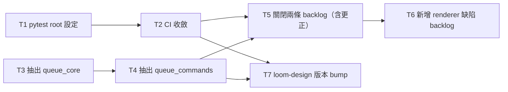

# Plan: loom-design script hygiene

Source brief: docs/loom/specs/2026-09-01-loom-design-script-hygiene.md
Goal: 讓 `python3 -m pytest loom-design/scripts/` 成為單一道綠燈指令（五個 CI job 收斂成一個），並把 `batch_queue.py` 的 CLI handler 抽成獨立模組、留下 argparse ＋ `main` — serves PURPOSE: 一個跑不起來的測試套件是驗證表面上的洞，而 PURPOSE 要求「規劃／規格／契約裡的宣稱不會未經驗證就出貨」；今天這道指令執行零個測試，任何依賴它的宣稱都沒有被驗證過。
Stage: planning
Total tasks: 7
Critical-path depth: 4 (≤5)
Execution order: parallel-where-possible
Plan-document-reviewer verdict: PENDING

## Task-flow diagram

## Open Questions

N/A — no unresolved question: the brief's three open questions were all resolved at brainstorming time (OQ-1, OQ-2, OQ-3), and planning surfaced no new one.

## Complexity assessment

- Added complexity: six new small files under `loom-design/scripts/` (one `pytest.ini`, five `conftest.py`) that must stay in step with the station-directory list, plus two new modules in the pipeline directory that split one import surface into three.
- Why it is worthwhile: the unified root removes a standing verification hole — today the obvious command runs zero tests, so nobody can confirm a loom-design change is safe without knowing five separate commands. The module split makes the region most future edits land in readable on its own.
- Removed or avoided complexity: four hand-maintained CI jobs disappear, and with them the rule that every new station directory needs its own job. Declined: `__init__.py` packaging, basename renames, and any repo-root pytest configuration.
- Downstream risk: the import-mode change is verified locally on pytest 9.0.3 while CI pins Python 3.11, so a version-dependent difference would surface as a red unified job in this branch's own CI run. The split's risk is silent side-effect reordering inside the `next` command's lock span, which the existing reconcile-ordering test pins.

## Task 1 — 統一 pytest root 的設定

- **Description**: Add a scoped pytest configuration so one invocation collects every loom-design station directory without module-basename collisions.
  - Create `loom-design/scripts/pytest.ini` with a `[pytest]` section setting `addopts = --import-mode=importlib`.
  - Create one `conftest.py` in each of the five station directories (`discovery`, `interface`, `pipeline`, `principles`, `spec`).
  - Each `conftest.py` inserts that directory's own absolute path at the front of `sys.path`, preserving the repo's sibling-import convention that `importlib` mode alone breaks.
  - Grounding: `loom-code/scripts/sibling_import.py` documents the convention as "no `__init__.py`, no conftest".
- **Module**: loom-design/scripts
- **Files touched**: loom-design/scripts/pytest.ini, loom-design/scripts/discovery/conftest.py, loom-design/scripts/interface/conftest.py, loom-design/scripts/pipeline/conftest.py, loom-design/scripts/principles/conftest.py, loom-design/scripts/spec/conftest.py, loom-design/scripts/test_unified_pytest_root.py
- **Context paths**:
  - loom-code/scripts/sibling_import.py
  - loom-design/scripts/pipeline/test_pipeline_batch_queue.py
- **Acceptance**:
  - **RED**: `test_unified_pytest_root.py::test_unified_collection_reports_no_errors` fails on HEAD.
    - It runs `python3 -m pytest loom-design/scripts/ --collect-only -q` as a subprocess from the repo root and asserts exit status 0 with no collection error reported.
    - On HEAD that command exits non-zero with eight `import file mismatch` collection errors.
  - **GREEN**: the new test passes, and `python3 -m pytest loom-design/scripts/ -q` reports the whole loom-design suite green in one invocation.
- **External surfaces**: pytest configuration (`addopts`, `--import-mode=importlib`) and `sys.path` manipulation in `conftest.py`. Both are stdlib or pytest surfaces; no third-party dependency is added.
- **Dependencies**: none
- **Independent**: true
- **Brief item covered**: "`python3 -m pytest loom-design/scripts/` runs as ONE green invocation"
- **Review disposition**: batch(unified-root)
- **Status**: pending
- **Gloss**: 讓一道指令就能跑完 loom-design 全部測試 — 補上驗證破洞的第一步。

## Task 2 — CI 收斂成單一 job

- **Description**: Replace the five per-directory loom-design pytest jobs with one unified invocation and remove the comments that forbid it.
  - Collapse the invocations in `loom-pipeline-ci.yml`, `loom-siblings-ci.yml` (three) and `loom-spec-ci.yml` (one) into a single unified pytest step.
  - Rewrite `loom-siblings-ci.yml`'s comment "The suites MUST run as separate pytest invocations" so it describes the unified root.
  - Rewrite `loom-pipeline-ci.yml`'s comment "This suite runs as its OWN pytest invocation" the same way.
- **Module**: .github/workflows
- **Files touched**: .github/workflows/loom-pipeline-ci.yml, .github/workflows/loom-siblings-ci.yml, .github/workflows/loom-spec-ci.yml, scripts/test_loom_design_ci_unified_root.py
- **Context paths**:
  - .github/workflows/loom-pipeline-ci.yml
  - .github/workflows/loom-siblings-ci.yml
  - .github/workflows/loom-spec-ci.yml
- **Acceptance**:
  - **RED**: `test_loom_design_ci_unified_root.py::test_workflows_invoke_loom_design_suite_once` fails on HEAD.
    - It scans every workflow file and asserts exactly one step invokes pytest against a loom-design scripts path.
    - It also asserts no workflow comment claims the suites must run as separate invocations.
    - On HEAD five such invocations and two such comments exist.
  - **GREEN**: the scan finds exactly one loom-design pytest invocation and no separate-invocation comment, and `python3 -m pytest loom-design/scripts/ -q` runs the whole suite green in one invocation.
- **External surfaces**: GitHub Actions workflow YAML. No new action or runner dependency; the existing Python 3.11 setup and `pytest pyyaml` install are reused.
- **Dependencies**: Task 1 completes first
- **Seam**:
  - from Task 1: payload: the `pytest.ini` and five `conftest.py` files that make one invocation collect cleanly; owner: Task 1; probe: `python3 -m pytest loom-design/scripts/ -q`
- **Independent**: false
- **Brief item covered**: "the five per-directory CI jobs collapse to one"
- **Review disposition**: batch(unified-root)
- **Status**: pending
- **Gloss**: CI 從五個 job 變一個，新增 station 不再需要手寫新 job。

## Task 3 — 抽出 queue_core 模組

- **Description**: Move the queue state, freeze gate, worktree lifecycle, reconcile engine and scan helpers out of `batch_queue.py` into a new sibling module `queue_core.py`.
  - Move the state surface: `load_queue`, `load_state`, `save_state`, `_state_lock`, `effective_entries`.
  - Move the gate and worktree surface: `check_frozen`, `ensure_worktree`, `_teardown_worktree`, `_uncommitted_plan_reason`.
  - Move the engine surface: `_append_audit_line`, `_read_wf_terminal_status`, `_parse_iso_timestamp`, `_classify_running_entry`, `_reconcile_running_entries`, `_skip_entry`, `_dispatch_entry`.
  - Move the breaker surface: `_check_circuit_breaker`, `_halt_notice_if_tripped`, `_describe_non_terminal_entry`, and the errors `QueueError`, `_fail`, plus `_test_rmw_sleep`.
  - Move the module-level constants those functions read, and update `test_pipeline_batch_queue.py`'s import block so each name is imported from its new owner. Assertions are not modified.
- **Module**: loom-design/scripts/pipeline
- **Files touched**: loom-design/scripts/pipeline/queue_core.py, loom-design/scripts/pipeline/batch_queue.py, loom-design/scripts/pipeline/test_pipeline_batch_queue.py
- **Context paths**:
  - loom-design/scripts/pipeline/batch_queue.py
  - loom-design/scripts/pipeline/test_pipeline_batch_queue.py
  - loom-design/scripts/pipeline/argv_exec.py
- **Acceptance**:
  - **RED**: `test_pipeline_batch_queue.py::test_queue_core_owns_state_and_engine` fails on HEAD with `ModuleNotFoundError`.
    - It asserts `queue_core` defines `load_queue`, `_state_lock`, `_reconcile_running_entries` and `_check_circuit_breaker`.
    - It also asserts `batch_queue` no longer defines those names in its own module namespace.
  - **GREEN**: the new test passes and `python3 -m pytest loom-design/scripts/pipeline/ -q` is green, including `test_next_reconciles_running_entries_before_normal_scan`, which proves the reconcile-before-scan ordering survived the move.
- **External surfaces**: none beyond the stdlib surface `batch_queue.py` already uses (`fcntl`, `tomllib`, `subprocess`); relocating code adds no dependency.
- **Dependencies**: none
- **Independent**: true
- **Brief item covered**: "`batch_queue.py`'s CLI-handler region moves to its own module; `batch_queue.py` keeps `main` and the argparse wiring"
- **Not batched because**: Tasks 1 and 2 answer whether one pytest invocation runs the whole suite; this task answers whether a module split preserves behaviour. Two verdict questions, not one. The two chains are only transitively connected through the downstream backlog and version-bump sink.
- **Review disposition**: batch(queue-split)
- **Status**: pending
- **Gloss**: 把佇列狀態與排程引擎搬進自己的模組，為下一步騰出空間。

## Task 4 — 抽出 queue_commands 並把 batch_queue 收薄

- **Description**: Move the CLI command handlers into `queue_commands.py` and reduce `batch_queue.py` to argparse wiring plus `main`.
  - Move the seven handlers `_cmd_mark`, `_cmd_mark_running`, `_cmd_reconcile`, `_cmd_reset`, `_cmd_force_fail`, `_cmd_status`, `_cmd_next`.
  - Move the two shared helpers `_resolve_paths_and_validate_id` and `_require_running`; the new module imports what it needs from `queue_core`.
  - Leave `_assert_valid_change_id`, `_build_parser`, `_add_next_subparser` and `main` in `batch_queue.py`, so `argv_exec.py`'s call site and the `status` subprocess contract are untouched.
- **Module**: loom-design/scripts/pipeline
- **Files touched**: loom-design/scripts/pipeline/queue_commands.py, loom-design/scripts/pipeline/batch_queue.py, loom-design/scripts/pipeline/test_pipeline_batch_queue.py
- **Context paths**:
  - loom-design/scripts/pipeline/queue_core.py
  - loom-design/scripts/pipeline/argv_exec.py
  - loom-design/scripts/pipeline/test_pipeline_skill_contract.py
- **Acceptance**:
  - **RED**: `test_pipeline_batch_queue.py::test_batch_queue_is_argparse_and_main_only` fails on HEAD with `ModuleNotFoundError`.
    - It asserts `queue_commands` defines `_cmd_next` and `_cmd_status`.
    - It also asserts `batch_queue` defines neither those names nor `load_queue`, while `batch_queue.main` remains callable.
  - **GREEN**: the new test passes, `python3 -m pytest loom-design/scripts/pipeline/ -q` is green, and running `python3 loom-design/scripts/pipeline/batch_queue.py status` as a subprocess still succeeds end to end through the argparse entry, the handlers and the core.
- **External surfaces**: none beyond the stdlib surface already in use; `argparse` remains the only CLI dependency.
- **Dependencies**: Task 3 completes first
- **Seam**:
  - from Task 3: payload: the state, engine and breaker functions `queue_core` now owns, imported by name; owner: Task 3; probe: `python3 loom-design/scripts/pipeline/batch_queue.py status`
- **Independent**: false
- **Brief item covered**: "leaving `batch_queue.py` as argparse wiring plus `main`, with `argv_exec.py`'s `batch_queue.main` call site and every pinned CLI string unchanged"
- **Not batched because**: same reason as Task 3 — the test-root chain and the module-split chain carry different verdict questions, and are only transitively connected through the downstream backlog and version-bump sink.
- **Review disposition**: batch(queue-split)
- **Status**: pending
- **Gloss**: CLI handler 搬進自己的模組，`batch_queue.py` 只剩指令接線。

## Task 5 — 關閉兩條 backlog，並更正被推翻的宣稱

- **Description**: Close both backlog entries this arc delivers, correcting the factually wrong risk claim instead of closing it silently.
  - Flip `status:` to `closed` on `2026-08-31-loom-design-unified-pytest-root`, with one body line naming this branch as the evidence.
  - Flip `status:` to `closed` on `2026-08-31-batch-queue-split`, with the same kind of evidence line.
  - Correct that entry's sentence "No tests currently pin cross-function state-mutation ordering": 83 tests exist, and the reconcile-ordering test pins exactly that ordering.
  - State the correction in the entry rather than deleting the original claim silently, then regenerate the index with `python3 scripts/backlog_index.py --write`.
- **Module**: docs/loom/backlog
- **Files touched**: docs/loom/backlog/2026-08-31-loom-design-unified-pytest-root.md, docs/loom/backlog/2026-08-31-batch-queue-split.md, docs/loom/BACKLOG.md
- **Context paths**:
  - docs/loom/backlog/README.md
  - scripts/backlog_index.py
- **Acceptance**:
  - **RED**: `python3 scripts/backlog_index.py --ready` lists both entries under the open heading on HEAD, which is the state this task changes.
  - **GREEN**: neither entry appears under the open heading, both read `status: closed`, the batch-queue entry names the reconcile-ordering test in its correction, and re-running the index writer leaves `docs/loom/BACKLOG.md` byte-identical.
- **External surfaces**: none — record-class markdown plus the repo's own `backlog_index.py`.
- **Dependencies**: Tasks 2, 4 complete first
- **Seam**:
  - from Task 2: payload: none
  - from Task 4: payload: none
- **Independent**: false
- **Review-weight**: prose
- **Brief item covered**: "Backlog entries `2026-08-31-loom-design-unified-pytest-root` and `2026-08-31-batch-queue-split` — both close"
- **Review disposition**: batch(backlog-store)
- **Status**: pending
- **Gloss**: 兩條 backlog 關閉，其中一條寫錯的風險宣稱一併更正而不是靜默關掉。

## Task 6 — 新增 renderer 缺陷的 backlog 條目

- **Description**: Record the adjudication-view renderer defect found while producing this arc's brief view.
  - Create `docs/loom/backlog/2026-09-01-adjudication-render-always-embeds-mermaid-bundle.md` with `status: open` and an event-shaped `start:` trigger.
  - State the defect: the renderer embeds a base64 mermaid bundle unconditionally, even for a document containing zero mermaid fences.
  - State the measurement: this arc's brief view was 4,786,423 characters, of which 4,754,803 were that single unused script element.
  - State the remedy evidence: stripping it and the paired initialize call left 31,541 characters with identical rendered content and an unchanged generator stamp.
  - Note that Claude artifacts render mermaid natively, so the bundle is redundant on that delivery surface, then regenerate the index.
- **Module**: docs/loom/backlog
- **Files touched**: docs/loom/backlog/2026-09-01-adjudication-render-always-embeds-mermaid-bundle.md, docs/loom/BACKLOG.md
- **Context paths**:
  - docs/loom/backlog/README.md
  - loom-code/skills/using-loom-code/protocols/adjudication-view.md
- **Acceptance**:
  - **RED**: `python3 scripts/backlog_index.py --ready` lists no entry naming the adjudication-render mermaid defect on HEAD.
  - **GREEN**: the new entry exists with `status: open` and an event-shaped trigger, it appears under the open heading, and re-running the index writer leaves `docs/loom/BACKLOG.md` byte-identical.
- **External surfaces**: none — record-class markdown plus `backlog_index.py`.
- **Dependencies**: Task 5 completes first
- **Seam**:
  - from Task 5: payload: none
- **Independent**: false
- **Review-weight**: prose
- **Brief item covered**: "file a new backlog entry for a renderer defect found this session"
- **Review disposition**: batch(backlog-store)
- **Status**: pending
- **Gloss**: 把這次發現的視圖產生器缺陷記進 backlog，不讓它隨 session 消失。

## Task 7 — loom-design 版本 bump

- **Description**: Bump the loom-design plugin version so the marketplace republishes the changed script content.
  - Raise `loom-design/.claude-plugin/plugin.json` `version` from 0.5.7 to 0.6.0, because this arc adds a new supported invocation rather than only fixing behaviour.
  - Mirror the value into `loom-design/.codex-plugin/plugin.json` using the repo's `sync_codex_manifests.py`.
  - Add a CHANGELOG entry describing the unified test root and the pipeline module split.
- **Module**: loom-design
- **Files touched**: loom-design/.claude-plugin/plugin.json, loom-design/.codex-plugin/plugin.json, loom-design/CHANGELOG.md
- **Context paths**:
  - scripts/check_version_bump.py
  - scripts/sync_codex_manifests.py
- **Acceptance**:
  - **RED**: `python3 scripts/check_version_bump.py --base origin/main --head HEAD` exits non-zero once Tasks 1 through 4 have landed, naming loom-design as changed without a bump.
  - **GREEN**: that command exits 0, `python3 scripts/sync_codex_manifests.py --check --all` exits 0, and both manifests read 0.6.0.
- **External surfaces**: the marketplace plugin manifest contract, mirrored in the Codex manifest. No new external dependency.
- **Dependencies**: Tasks 2, 4 complete first
- **Seam**:
  - from Task 2: payload: none
  - from Task 4: payload: none
- **Independent**: false
- **Brief item covered**: "Two changes, both in `loom-design/`" — shipping changed plugin script content requires the marketplace version bump that publishes it
- **Not batched because**: Tasks 5 and 6 answer whether the backlog store correctly records this arc; this task answers whether the marketplace manifest republishes the changed content. Two verdict questions, and this task is only transitively connected to them through the shared version-bump sink.
- **Review disposition**: individual
- **Status**: pending
- **Gloss**: 把 loom-design 版本推上去，否則 marketplace 不會重新發佈這次的改動。

## Review Batches

### Review Batch: unified-root
- **Members**: Task 1, Task 2
- **Verdict question**: Does one pytest invocation now collect and run the whole loom-design suite without module-basename collisions, and does CI invoke exactly that one command with no remaining comment claiming the suites must run separately?
- **Review lane**: full
- **Aggregate verification**: Run the whole loom-design scripts tree under a single pytest invocation and confirm it is green, then confirm the workflow scan test passes.
- **Boundary**: capability: unified loom-design pytest root; exclusions: none; consumable: yes

### Review Batch: queue-split
- **Members**: Task 3, Task 4
- **Verdict question**: Does splitting the batch-queue module into a core module, a commands module and a thin argparse entry preserve every observable behaviour, including side-effect ordering inside the next command's lock span and both the importable main entry and the status subprocess contract?
- **Review lane**: full
- **Aggregate verification**: Run the pipeline suite with pytest, then run the batch queue status subcommand as a subprocess and confirm it succeeds.
- **Boundary**: capability: batch-queue module split; exclusions: none; consumable: yes

### Review Batch: backlog-store
- **Members**: Task 5, Task 6
- **Verdict question**: Does the backlog store correctly record this arc — both delivered entries closed with the wrong ordering claim corrected rather than dropped, the new renderer-defect entry filed, and the generated index consistent with all three?
- **Review lane**: prose
- **Aggregate verification**: Run the backlog index writer and confirm it leaves the committed index byte-identical, then list ready entries and confirm the expected open and closed membership.
- **Boundary**: capability: backlog store update for this arc; exclusions: none; consumable: yes

## Notes

- Entry artifact: the human-approved brief at `docs/loom/specs/2026-09-01-loom-design-script-hygiene.md`, signed off by kouko on 2026-09-01. No loom-design change-folder is bound: the branch slug matches no change-id directory, and the four non-archived change-folders present all belong to prior shipped arcs unrelated to this scope. Stated loudly rather than silently skipped.
- Out of scope, carried forward: splitting `loom-code/scripts/loom_gate_markers.py` stays open in the backlog with its event trigger intact, deferred because the live `family-relocation` decision map has a claimed ticket naming it and its ownership verdict is still open.
- The root README version-row check reads only the loom-workflow row, and this arc does not change loom-workflow, so no README edit is required.
- Backlog entry `2026-08-31-proposer-chunks-components-linked-only-through-a-sink` names its own start trigger as "the first arc after this one runs `--check` and finds itself writing 'only transitively connected through the version-bump sink' more than twice". This is that first arc, and this plan writes that reason three times (Tasks 3, 4 and 7): the proposer merged the test-root chain with the module-split chain, and the backlog chain with the manifest bump, in both cases joining components that share only a downstream sink. Recorded here as an observation; re-sizing the proposer's cap or edge rule is out of this arc's scope.
