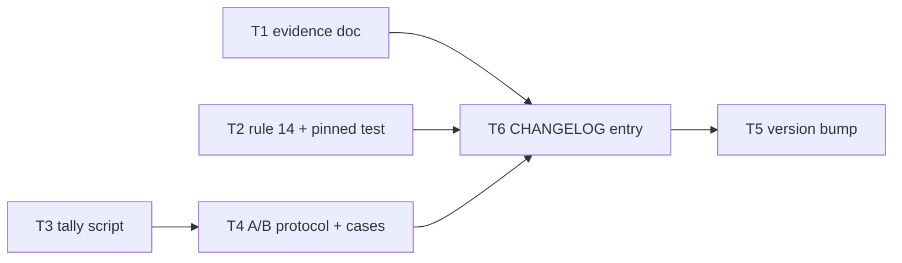

# Plan: prose-edit self-sweep — implementer rule 14 + A/B harness

Source brief: docs/loom/specs/2026-08-31-prose-edit-self-sweep.md
Goal: One new silent self-sweep rule in the implementer contract for all-`.md`
    tasks (five verifiable actions, no checklist output), a pinned contract
    test, the 4-project evidence doc, and an A/B harness with tally script —
    branch unmerged and no effectiveness claim until A/B results exist —
    serves PURPOSE: a claim in a plan, spec, or contract cannot ship
    unverified — the sweep makes the writer verify or downgrade claims in the
    same turn instead of shipping them to review
Stage: sdd:wave-1
Steps:
    1. 證據落地：四專案 docs-review 缺陷成因文件
    2. 契約：implementer 規則 14 + 釘住測試
    3. 量測工具：計分腳本 + A/B 協定與案例清單
    4. 收尾：版本 bump 與 CHANGELOG
Total tasks: 6
Critical-path depth: 4 (≤5)
Execution order: parallel-where-possible
Plan-document-reviewer verdict: PASS (2026-09-01, round 2)

## Task-flow diagram

## Open Questions

N/A — no unresolved question: the brief's two Open Questions are both resolved-at-build-time items (case substitution recorded in the case manifest by Task 4; fire-rate telemetry explicitly N/A for this arc).

## Complexity assessment

- Added complexity: one more numbered rule in the implementer contract (attention budget of every prose-task dispatch), one new scripts/ module (`prose_selfsweep_tally.py`) with a test, and a dogfood directory whose protocol future sessions must keep consistent with the tally script's CLI.
- Why it is worthwhile: 4-project mining (98 findings) shows 75%+ of docs-review findings are edit-consistency defects the writer can catch in the same turn; kumiko branches reached 8 review rounds and dotfiles PR#40 reached 10 — one standing writer-side rule is the audit-prescribed shape (`2026-08-04` audit: a standing mechanism outranks another review round) and costs zero extra model calls.
- Removed or avoided complexity: avoids a second review stage, a weak-model pre-review, and any new mechanical section gate (existing validators already cover section presence / N/A); supersedes the user's original 5-item omission checklist for this lane.
- Downstream risk: rule 14 may under-fire (attention decay at list position 14 — measured by the A/B, with placement-variant (e) recorded in the protocol as the follow-up experiment) or induce hedging ("not verified" spam — counted by the tally's hedge metric); the tally script's cause taxonomy could drift from the evidence doc's — mitigated by Task 4's probe running the tally on a fixture derived from the evidence doc's categories.

## Task 1 — 四專案缺陷成因證據文件
- **Description**: Write `docs/loom/audits/2026-09-01-docs-review-finding-causes.md` consolidating the finding-cause mining across monkey-skills, kumiko-zaiku-app-icons, dotfiles, and youtube-summarize-scraper.
  - Required sections, five headings:
    - `## Method`: sources, dedup rule, the A–K cause taxonomy with one-line definitions.
    - `## Cause distribution`: one table, cause × per-project counts (the 5-column shape already relayed in-session).
    - `## Rounds evidence`: kumiko rounds table; dotfiles PR#40 10-round case.
    - `## Limits`: per-project evidence-grain caveats — dotfiles never dispatched docs-reviewer; yss pre-loom rows are diff-inferred; kumiko extraction non-exhaustive.
    - `## Consumers`: names rule 14 and the A/B protocol as consumers.
  - Source data: copy the three scratchpad tables into an appendix verbatim (they die with the session); monkey-skills' 14 findings cite `docs/loom/audits/2026-08-11-yellow-finding-load-bearing-sample.md` instead of being re-copied.
  - Every number in the distribution table must be recomputed from the appendix rows, not transcribed from the session's chat summary.
- **Module**: docs/loom/audits
- **Files touched**: docs/loom/audits/2026-09-01-docs-review-finding-causes.md
- **Context paths**:
  - /private/tmp/claude-501/-Users-kouko--herdr-worktrees-monkey-skills-doc-writer-r2/68d2bad7-fbf4-417f-8d7d-14baa49e05a1/scratchpad/findings-kumiko.md
  - /private/tmp/claude-501/-Users-kouko--herdr-worktrees-monkey-skills-doc-writer-r2/68d2bad7-fbf4-417f-8d7d-14baa49e05a1/scratchpad/findings-dotfiles.md
  - /private/tmp/claude-501/-Users-kouko--herdr-worktrees-monkey-skills-doc-writer-r2/68d2bad7-fbf4-417f-8d7d-14baa49e05a1/scratchpad/findings-yss.md
  - docs/loom/audits/2026-08-11-yellow-finding-load-bearing-sample.md
  - docs/loom/audits/2026-08-04-docs-review-convergence-experiment.md
- **Acceptance**:
  - RED: `test -f docs/loom/audits/2026-09-01-docs-review-finding-causes.md` fails (file absent).
  - GREEN: file exists with the five required sections plus appendix; every distribution-table count equals a hand-recount of the matching appendix rows (implementer states the recount in its report); no effectiveness claim about rule 14 appears anywhere in the doc.
- **Dependencies**: none
- **Independent**: true
- **Review-weight**: prose
- **Brief item covered**: "Build (1): evidence doc `docs/loom/audits/2026-08-31-docs-review-finding-causes.md` consolidating the 4-project cause distribution."
- **Review disposition**: batch(prose-artifacts)
- **Status**: claimed(@sonnet-implementer-w1a)
- **Gloss**: 把四專案挖出的缺陷成因分布落成 repo 內可引用的證據文件。

## Task 2 — implementer 規則 14「Prose-edit self-sweep」＋釘住測試
- **Description**: Add rule 14 to `loom-code/agents/implementer.md`'s hand-written Role-contract section (immediately after rule 13, before the `BEGIN baseline-v1` managed marker), plus a pinned test in `loom-code/scripts/test_agent_contract.py` written RED-first.
  - Rule heading: `14. **Prose-edit self-sweep — silent, same turn.**` Firing condition: every file in the task's `Files touched` is `.md` authored prose (same precondition wording family as `Review-weight: prose`).
  - Five actions, each a verifiable command or walk, not a judgment:
    - (a) grep restatements of every changed claim; update or delete each copy (same-file preamble, frontmatter description, index line, CHANGELOG, sibling docs).
    - (b) for every sentence asserting the writer's own work ("verified", "swept all N", "unchanged", "tests pass"), re-run the deciding command now, else rewrite as "not verified".
    - (c) walk the doc's own reading path once from the top; move any new text a reader is told to skip before reaching.
    - (d) every agent-facing instruction names a field/verb/file that exists in its target schema or tool, else rewrite.
    - (e) `N/A` entries carry a reason; unresolved items stay labelled open.
  - Silence clause: no checklist output, no tick marks, no self-score, no PASS claim; never fabricate evidence to satisfy (b) — an unverifiable claim becomes a labelled assumption.
  - Cite no `docs/` development record inside the rule text (contract-citation rule); the rule may reference the repo's own files generically ("index line", "CHANGELOG") as store-schema nouns.
  - Test (write it FIRST, watch it fail): follow `test_agent_contract.py`'s existing slice-and-assert style, slicing from `14. **Prose-edit self-sweep` to `<!-- BEGIN baseline-v1`. Assertions:
    - heading exists; all five action markers (a)–(e) present.
    - silence-clause substrings present: "Do not emit", "self-score", "PASS claim".
    - mutation guard: the slice must NOT contain "output the checklist" / "emit a checklist".
    - position guard: `text.index("14. **Prose-edit self-sweep") < text.index("<!-- BEGIN baseline-v1")`.
- **Module**: loom-code/agents
- **Files touched**: loom-code/agents/implementer.md, loom-code/scripts/test_agent_contract.py
- **Context paths**:
  - loom-code/agents/implementer.md
  - loom-code/scripts/test_agent_contract.py
  - loom-code/scripts/distribute.py
  - docs/loom/specs/2026-08-31-prose-edit-self-sweep.md
- **Acceptance**:
  - RED: the new `test_agent_contract.py` test fails against HEAD (`python3 -m pytest loom-code/scripts/test_agent_contract.py -q` — rule 14 absent).
  - GREEN: same command all-pass after the edit; managed blocks proven untouched (distribute verify mode if documented, else re-run distribute + `git diff --exit-code loom-code/agents/`); `python3 loom-code/scripts/check_contract_citations.py` exits 0.
- **Dependencies**: none
- **Independent**: true
- **Brief item covered**: "Build (2): rule 14 \"Prose-edit self-sweep\" in `loom-code/agents/implementer.md` hand-written section, TDD-first via a pinned case in `loom-code/scripts/test_agent_contract.py`."
- **Review disposition**: individual
- **Status**: implemented(3291e4d1bf1fa48f975bb6e67be060ed5df5973f)
- **Gloss**: 契約本體：prose 任務收尾時的靜默五動作自掃，加上釘住位置與措辭的測試。

## Task 3 — A/B 計分腳本 prose_selfsweep_tally.py
- **Description**: Create `loom-code/scripts/prose_selfsweep_tally.py` + `loom-code/scripts/test_prose_selfsweep_tally.py` (RED-first): a stdin/file JSON-in, markdown-table-out tally for A/B runs.
  - Input: a JSON file with one record per run: `{case_id, arm ("A"|"B"), rep, gating_findings: [{cause: "A".."K", class: "instruction"|"evidence"}], hedge_marks: int, draft_tokens: int, review_rounds: int}`.
    - Validation, fail loud: cause codes against the closed A–K set; (case_id, arm, rep) uniqueness; non-zero exit naming the offending record.
  - Output: per-arm totals — first-round gating findings (overall and per cause), hedge-mark counts, mean draft tokens, review rounds — as a markdown table to stdout; no verdict line, no "improved/worse" wording (interpretation stays human).
  - Sibling-module style: plain script, no `__init__.py`, PEP 723 not needed (stdlib only).
- **Module**: loom-code/scripts
- **Files touched**: loom-code/scripts/prose_selfsweep_tally.py, loom-code/scripts/test_prose_selfsweep_tally.py
- **Context paths**:
  - loom-code/scripts/test_agent_contract.py
  - loom-code/scripts/check_open_questions.py
- **Acceptance**:
  - RED: `python3 -m pytest loom-code/scripts/test_prose_selfsweep_tally.py -q` fails (module absent); tests cover: valid two-arm fixture → table with both arms' totals; unknown cause code → non-zero exit naming the record; duplicate (case_id, arm, rep) → non-zero exit.
  - GREEN: same command all-pass; `python3 loom-code/scripts/prose_selfsweep_tally.py <fixture>` prints the table and exits 0.
- **Dependencies**: none
- **Independent**: true
- **Brief item covered**: "Build (3): A/B harness under `docs/loom/dogfood/2026-08-31-prose-selfsweep-ab/` — protocol, 4 historical prose-task cases, tally script `loom-code/scripts/prose_selfsweep_tally.py` + test"
- **Review disposition**: individual
- **Status**: implemented(6e4f44ff3ed41fae4e15069fc45bcc07520e1953)
- **Gloss**: 把 A/B 結果算成表的計分器——只算數，不下判斷。
- **Notes**: fail-loud gate — if `loom-code/scripts/test_gate_scripts_fail_loud_on_unreadable_input.py` classifies new scripts/ modules, register the new module there per its own convention (DL-1 precedent in the 2026-08-31 helper-extraction plan).

## Task 4 — A/B 協定與案例清單
- **Description**: Write `docs/loom/dogfood/2026-09-01-prose-selfsweep-ab/protocol.md` and `cases.md` (single-level directory).
  - protocol.md registers the whole experiment before any run:
    - arms: A = implementer.md at the pre-Task-2 commit (pinned by sha); B = with rule 14. Fixed implementer model sonnet; judge = unchanged `loom-code:docs-reviewer`; 2 reps per arm per case.
    - blind cause-labelling step: the labeller sees findings without arm identity.
    - four registered metrics: first-round preventable gating findings; review rounds; draft token/time delta; hedge marks + fabricated-evidence count.
    - registered non-metric: "more complete-looking sections" is NOT success.
    - the tally command line quotes Task 3's CLI verbatim.
    - interpretation notes: no-effect candidate explanations must include list-position attention decay, naming placement-variant (e) (a separate `## Prose-task duties` section) as the follow-up experiment; no effectiveness claim before results.
  - cases.md: 4 historical prose-task cases (2 kumiko-zaiku-app-icons + 2 monkey-skills).
    - Per case: source project + branch/PR; the reconstructed task text; the pre-state commit sha to check out; the files the task edits.
    - Carries the brief's substitution rule: unreconstructable pre-state → substitute a same-project case, recorded here.
  - Isolation clause restated in protocol.md: no case may come from the sibling worktree's baseline corpus; reviewer prompts are never modified.
- **Module**: docs/loom/dogfood
- **Files touched**: docs/loom/dogfood/2026-09-01-prose-selfsweep-ab/protocol.md, docs/loom/dogfood/2026-09-01-prose-selfsweep-ab/cases.md
- **Context paths**:
  - loom-code/scripts/prose_selfsweep_tally.py
  - docs/loom/specs/2026-08-31-prose-edit-self-sweep.md
  - docs/loom/audits/2026-09-01-docs-review-finding-causes.md
- **Acceptance**:
  - RED: `test -d docs/loom/dogfood/2026-09-01-prose-selfsweep-ab` fails (directory absent).
  - GREEN: both files exist; protocol.md's quoted tally invocation runs against a 2-record inline fixture and exits 0 (probe: `tally-cli-runs`); all 4 pre-state shas verified via `git cat-file -e` in their own repos; no effectiveness claim appears.
- **Dependencies**: Task 3 completes first
- **Seam**:
  - from Task 3: payload: tally CLI invocation line + input JSON record shape; owner: Task 3; probe: tally-cli-runs
- **Independent**: false
- **Review-weight**: prose
- **Brief item covered**: "Build (3): A/B harness under `docs/loom/dogfood/2026-08-31-prose-selfsweep-ab/` — protocol, 4 historical prose-task cases, tally script `loom-code/scripts/prose_selfsweep_tally.py` + test; dispatch runs from the session (implementer arms A/B × 2 reps, sonnet; judge = unchanged `docs-reviewer`; blind cause labelling)."
- **Review disposition**: batch(prose-artifacts)
- **Status**: pending
- **Gloss**: 實驗協定與案例：誰跑、怎麼盲、量什麼、什麼不算贏，全部先登記。

## Task 5 — 版本 bump（兩個 manifest 表面）
- **Description**: Bump the loom-code version string `"version": "0.109.0"` → `"version": "0.110.0"` on the two manifest surfaces.
  - `loom-code/.claude-plugin/plugin.json`: edit the version field literally as quoted above.
  - `loom-code/.codex-plugin/plugin.json`: regenerate via `python3 scripts/sync_codex_manifests.py` (SSOT: the claude-side plugin.json; never hand-edit the codex mirror).
- **Module**: loom-code
- **Files touched**: loom-code/.claude-plugin/plugin.json, loom-code/.codex-plugin/plugin.json
- **Context paths**:
  - scripts/sync_codex_manifests.py
- **Acceptance**:
  - RED: `grep -q '"version": "0.110.0"' loom-code/.claude-plugin/plugin.json` fails at HEAD.
  - GREEN: grep succeeds on both plugin.json files; `python3 -m pytest scripts/test_check_version_bump.py -q` passes; sync verified (`--check` flag if it exists, else re-run sync and `git diff --exit-code loom-code/.codex-plugin`).
- **Dependencies**: Task 6 completes first
- **Seam**:
  - from Task 6: payload: none
- **Independent**: false
- **Review-weight**: mechanical
- **Brief item covered**: "Build (4): CHANGELOG + version bump."
- **Review disposition**: individual
- **Status**: pending
- **Gloss**: 兩個 manifest 表面照字面 bump（codex 鏡射走 sync 腳本）。

## Task 6 — CHANGELOG 0.110.0 條目
- **Description**: Write the new `## [0.110.0] — 2026-09-01` entry at the top of `loom-code/CHANGELOG.md` (Keep-a-Changelog form, matching the file's existing entry style).
  - Content: rule 14 "Prose-edit self-sweep" in the implementer contract; its pinned test in `test_agent_contract.py`; `prose_selfsweep_tally.py` + test; the 4-project evidence doc; the A/B dogfood harness (protocol + cases).
  - Wording must NOT claim effectiveness — the A/B has not run; state that results are pending and the branch is held unmerged.
- **Module**: loom-code
- **Files touched**: loom-code/CHANGELOG.md
- **Context paths**:
  - loom-code/CHANGELOG.md
  - docs/loom/plans/2026-09-01-prose-edit-self-sweep.md
- **Acceptance**:
  - RED: `grep -q '## \[0.110.0\]' loom-code/CHANGELOG.md` fails at HEAD.
  - GREEN: grep succeeds; the entry names all five shipped artifacts; no effectiveness claim ("reduces", "improves", "cuts rounds") appears in the entry.
- **Dependencies**: Tasks 1, 2, 4 complete first
- **Seam**:
  - from Task 1: payload: none
  - from Task 2: payload: none
  - from Task 4: payload: none
- **Independent**: false
- **Review-weight**: prose
- **Brief item covered**: "Build (4): CHANGELOG + version bump."
- **Review disposition**: batch(prose-artifacts)
- **Status**: pending
- **Gloss**: CHANGELOG 條目是編輯性散文——prose lane，明文不宣稱有效。

## Review Batches

Tasks 2, 3, 5 stay individual: Task 2 is the security-adjacent contract edit needing its own full-triad verdict, Task 3 is standalone code, Task 5 is mechanical (self-check lane, no reviewer dispatch).

### Review Batch: prose-artifacts
- **Members**: Task 1, Task 4, Task 6
- **Verdict question**: Do the three prose artifacts (evidence doc, A/B protocol + cases, CHANGELOG entry) describe the same shipped mechanism consistently — counts recomputable from the appendix, registered metrics matching the brief, entry naming all five artifacts — with zero effectiveness claims anywhere?
- **Review lane**: prose
- **Aggregate verification**: inert description — grep all three artifacts for effectiveness-claim wording ("reduces", "improves", "cuts rounds", "有效"); hand-recount one distribution-table column against the appendix rows; run protocol.md's quoted tally invocation against its inline fixture and confirm exit 0.
- **Boundary**: capability: prose record of the self-sweep arc; exclusions: none; consumable: yes

## Notes

- The A/B run itself (16 implementer + judge dispatches) is session work AFTER this plan's tasks complete and is not an SDD task; its results land in the dogfood directory in a follow-up commit on this branch.
- Terminal for this arc: branch complete + whole-branch review PASS + local commits; NO push, NO PR, NO merge until the user releases the isolation hold (sibling worktree baseline).
- The brief names the evidence doc and dogfood dir with date 2026-08-31; actual artifacts use 2026-09-01 (authoring date) — same artifacts, date drift only.
