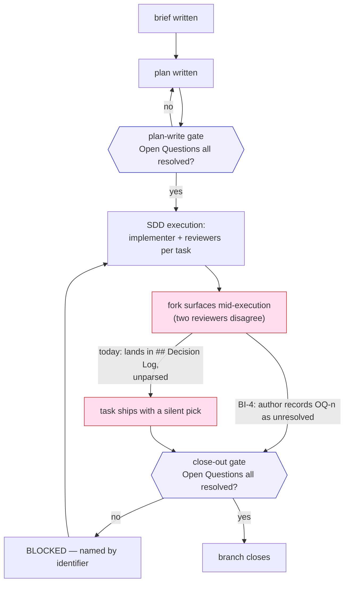

# open-question dispatch gate — brief

> **Phase**: brainstorming output (`brainstorming` → `writing-plans` handoff)
> **Date**: 2026-08-13
> **Author**: agent (Claude Opus 5), with kouko deciding the granularity fork

## Design-side on-ramp

Negative guard — this is a tooling increment to an already-test-covered skill
(`loom-code/skills/writing-plans/`), which is verbatim the reception's
negative-guard row. No design-side detour offered. Backlog ready check ran
(`scripts/backlog_index.py --ready`); its findings are recorded under
§Out of Scope and §Open Questions.

## Problem

When a fork surfaces during planning or execution and nobody resolves it, the
plan has **nowhere to record it**. The question falls into `## Decision Log`,
which no check and no script parses, and the dependent task ships with the
implementer's silent pick — so a known-undecided design question reaches the
user as a whole-branch review finding instead of a planning decision.

> When a fork surfaces mid-arc and I choose not to resolve it yet, I want the
> plan to hold that decision somewhere a gate can see, so I find out at a gate
> rather than in a review finding after the code shipped.

## Users

- **The plan author (agent or human)** — writes `docs/loom/plans/*.md` under
  `writing-plans`. Today has no slot for an unresolved question; the only
  available home is `## Decision Log`, which is unparsed prose.
- **`plan-document-reviewer`** — the ONLY reader that ever opens a live plan
  instance. `docs-reviewer` excludes `docs/**` as record-class
  (`loom-code/agents/docs-reviewer.md:330-340`), so any instance-level
  enforcement must live in this reviewer's prompt or in a script.
- **The implementer subagent** — receives a task whose acceptance depends on an
  unresolved fork and, having no signal that it is unresolved, picks silently.
- **`check_scenario_coverage.py`'s gate slot** — the existing "a markdown
  section declares → per-task fields resolve" machinery whose parser,
  heading-attribution and exit-code convention this change reuses.

## Smallest End State

A plan document carries a `## Open Questions` section that the author cannot
silently omit; each recorded question carries an authored `OQ-<n>` identifier
and a two-valued status token; a mechanical checker fails the plan while any
entry is unresolved, and fails an absent or malformed section; and that checker
runs at **both** the plan-write gate and branch close-out, because the incident
this arc exists to stop was born during execution, after the plan gate had
already passed. `plan-document-reviewer` gains one new check covering the one
thing a script cannot see: an `N/A — none` declaration contradicted by the
plan's own prose.

Success criterion: replaying the 2026-08-13 brief-item-addressability incident
against the shipped gate produces a blocking failure at close-out, naming the
unresolved question by identifier. Non-criterion: we do NOT measure how many
questions authors record, and we do NOT retrofit the 210 existing plans.

- BI-1 — A plan document has a `## Open Questions` section that is
  fill-or-declare: write entries, or write the pinned N/A line with a one-line
  reason. Deleting the heading is a reviewable omission.
- BI-2 — Each recorded question carries an authored, monotonic, never-reused
  `OQ-<n>` identifier and a two-valued machine-readable status token.
- BI-3 — A mechanical checker exits non-zero while any entry is unresolved, and
  exits non-zero on an absent section or a malformed N/A line.
- BI-4 — That checker runs at the plan-write gate AND at branch close-out, so a
  question born during execution is caught before the branch closes.
- BI-5 — `plan-document-reviewer-prompt.md` gains Check 18: an `N/A — none`
  declaration contradicted by hedging language elsewhere in the plan is a gap.
- BI-10 — The anti-copy rider's **reviewer-prompt leg** ships here: a check hint
  in `plan-document-reviewer-prompt.md` that an anti-copy / SSOT-protection
  acceptance criterion needs a reviewer-judgment leg ("no paraphrase
  reproduction of the protected content") alongside its mechanical grep. The
  rider's `writing-plans/SKILL.md` leg does not ship here — see §Out of Scope.

## Current State Evidence

- **Forward**: `check_scenario_coverage.py` is invoked from exactly two prose
  sites and no CI — `loom-code/skills/writing-plans/SKILL.md:253` (the actual
  invocation, both modes, exit-0/1 semantics, Notes-approval escape) and
  `:111` (the gate-ordering sentence); also named in the managed command-surface
  block at `AGENTS.md:54,59`. Zero hits across `.github/workflows/*.yml`. A new
  gate therefore becomes real only by being named in `SKILL.md` — a gate absent
  from that file is a gate nobody runs.
- **Forward (the free-ride option is closed)**: both existing invocations are
  **conditional**, so a new check cannot ride them. `SKILL.md:253` runs
  change-folder mode only inside §Consuming a loom-spec change-folder, and runs
  brief mode only "When the source brief declares `BI-` ids". A plan built from
  a brief with no `BI-` ids and no change-folder therefore runs the script
  **never** — piggybacking would make the open-questions gate skippable by
  declining to declare identifiers. The new gate needs its own unconditional
  invocation, which means roughly 25-30 new words in a file with 1 word of
  headroom; freeing them by deletion is a task, not an afterthought.
- **Reverse**: `loom-code/scripts/distribute.py:1-30` fixes SSOT direction as
  `domain-teams/skills/code-team/{standards,rubrics,checklists}` →
  `loom-code/skills/<skill>/…`, one-way, drift-checked by
  `loom-code/scripts/verify-drift.py:1-16`. All three files this change touches
  — `plan-format.md`, `plan-document-reviewer-prompt.md`,
  `check_scenario_coverage.py` — are **outside** that `ROUTE` set and are
  authored directly in `loom-code/`; there is no upstream copy to keep in step.
- **Error**: `check_scenario_coverage.py` uses exit 0 = pass / 1 = fail
  (docstring `:23-26,:43`; change-folder returns at `:585,:591`; brief mode at
  `:474,:481,:485,:510,:513`), printing dropped-scenario bullets to stderr
  (`:587-590`) and `Error:` / `Warning:` lines plus a coverage summary to stdout
  (`:389-417,:501-507`). `plan-document-reviewer-prompt.md` is binary
  `PASS` / `NEEDS_REVISION` (`:3,10,54`) with `gaps:` mandatory on
  NEEDS_REVISION (`:56`) and advisory-only `notes:` (`:47,68`). It holds 17
  numbered checks; **Check 5 is permanently retired** (`:37`) and never
  reassigned, so a new check must take **18**.
- **Data**: plan grammar is a top-level header block
  (`plan-format.md:26-55`) plus `## Task <N> — <name>` blocks (`:77`) carrying
  `Description / Module / Files touched / Context paths / Acceptance.RED /
  Acceptance.GREEN / External surfaces / Dependencies / Independent / Brief item
  covered / Status / Gloss`. Field-to-task attribution already exists:
  `check_scenario_coverage.py:223` `_enclosing_heading` returns the nearest
  `_HEADING` above a byte offset. Brief mode is four functions —
  `collect_brief_item_ids:270` (harvest `BI-<n>` outside fenced blocks,
  first-wins, warn on reuse), `resolve_plan_brief_citations:327` (error on
  undeclared id / missing citation / reasonless `none —`),
  `brief_item_coverage:421` (which declared ids are cited by ≥1 task),
  `check_brief_coverage:461` (driver + exit code); the `--brief` flag itself is
  declared at `:554-557` (the handoff's `:544-554` covers the surrounding
  argparse block, not the flag).
- **Boundary**: `[FRAGILE]` `loom-code/scripts/test_wp_extraction_pointers.py:484-486`
  pins `writing-plans/SKILL.md` at **≤4250 words and the file is at 4249** — one
  word of headroom, and the ceiling was already raised twice in one day. It is
  the **only** word-cap assertion in that 509-line file. `plan-format.md` and
  `plan-document-reviewer-prompt.md` carry **no ceiling anywhere** (grepped
  `test_plan_fact_grounding.py`, `test_plan_diagram_slot.py`,
  `test_plan_format_progress_fields.py`, `test_sdd_extraction_pointers.py`).
  `[FRAGILE]` `loom-code/agents/docs-reviewer.md:330-340` — contract-class is
  `<plugin>/skills/**`, `agents/*`, `hooks/*`, `scripts/*`; **record-class is
  everything else including `docs/**`**, so generated plan instances are
  invisible to `docs-reviewer` and only `plan-document-reviewer` reads them.
- **Evidence paths**:
  `loom-code/skills/writing-plans/SKILL.md:44,111,253` ·
  `loom-code/skills/writing-plans/references/plan-format.md:5,17,24,26-55,57,74,77,114,122,136,174,195,219,227,239,242,249,254,277,286,303,484,495` ·
  `loom-code/skills/writing-plans/references/plan-document-reviewer-prompt.md:3,10,37,47,54,56,68` ·
  `loom-code/scripts/check_scenario_coverage.py:7,23-26,38,43,223,270,327,389-417,421,461,474,481,485,501-507,510,513,534,544-558,585,587-590,591` ·
  `loom-code/scripts/distribute.py:1-80` ·
  `loom-code/scripts/verify-drift.py:1-16` ·
  `loom-code/scripts/test_wp_extraction_pointers.py:484-486` ·
  `loom-code/scripts/test_sdd_extraction_pointers.py:408-411` ·
  `loom-code/agents/docs-reviewer.md:330-340` ·
  `loom-code/skills/brainstorming/references/handoff-brief-format.md:100,104,128,199,214` ·
  `loom-code/skills/brainstorming/SKILL.md:193` ·
  `AGENTS.md:54,59` ·
  `docs/loom/plans/2026-08-13-brief-item-addressability.md:96,104-106,110,246,354-373` ·
  `docs/loom/memory/optional-template-sections-produce-no-behavior.md` ·
  `docs/loom/memory/contract-class-review-does-not-reach-generated-artifacts.md` ·
  `docs/loom/memory/a-prose-scanner-meets-its-own-vocabulary-first.md` ·
  `docs/loom/memory/widening-a-value-grammar-needs-a-consumer-census-at-plan-time.md` ·
  `docs/loom/memory/an-absence-claim-in-a-plan-is-a-hypothesis-not-a-fact.md`

## Decision

We give the plan a home for an unresolved question and make an unresolved entry
block a gate — at the granularity of "the section and the entry", not "the task
that depends on it". Each entry gets an authored `OQ-<n>` identifier because
cross-document reference (a reviewer saying "OQ-2 still blocks") is what the
existing delta-confirmation machinery consumes, and because it collapses the
four spellings of "resolved" found across the six historical plans that carry
the heading. We deliberately do **not** ship owner or deadline fields: those
exist in NASA/課題管理表 practice precisely because those systems *allow* an
item to remain open through a phase, and a gate that blocks on any open entry
designs that accumulation away — while the extra fields would raise the cost of
recording a question and so feed the one failure mode we can already name
(authors writing nothing). We also do **not** ship a per-task "blocked by OQ-n"
field: three independent prior-art sweeps found zero instances of it anywhere,
its closest analog (requirements-traceability blocked-by links) is the one
practice with documented decay, and replaying the incident shows it changes no
outcome the section-level gate does not already reach.

We also do **not** ship a routing field distinguishing "the agent resolves this"
from "the user must resolve this". The gate blocks on *unresolved*, not on
*needs-user*: an entry the agent is entitled to settle gets settled and its
reasoning recorded, with no user contact at all. A routing field would grow the
grammar again and would be trivially dodged by marking every entry
agent-resolvable. The classification it would encode is already written down
and does not need re-inventing — `~/.claude/rules/judgment-rubrics.md` §3 gives
the test for when an agent must stop and ask (irreversible/outward-facing, OR
two readings differing by >30 min of rework, AND the answer is not already
recorded); `plan-format.md` points at that rule rather than restating it.

Two properties keep the user-interruption cost down without any added field.
First, a `RESOLVED` entry must carry how it was resolved, which is exactly the
recorded-decision that stops the same question being re-asked. Second, the
close-out gate is a **batch point**: unresolved entries accumulate and are
settled in one pass rather than interrupting the moment each fork appears —
strictly fewer interruptions than asking as they arise, and an author who knows
close-out will block is free to ask earlier when that is cheaper. **Monitored
reversal condition**: if the shipped gate produces user-asks that
`judgment-rubrics.md` §3 says should not have been asked, the defect is in the
asking discipline, not in the gate — fix the asking rule, do not weaken the
gate. Whether the gate raises the interruption rate at all cannot be known
before it ships; this is a monitored assumption, not a measured claim.

- BI-6 — A plan records unresolved questions in a gated, identifier-bearing
  section, with no owner field, no deadline field, no routing field, and no
  per-task linkage.

## Out of Scope

- **Per-task `Blocked by: OQ-n` fields** — the rejected fine-grained option.
- **Owner and deadline fields on an entry** — rejected above.
- **The brief-side `## Open Questions` section** (`handoff-brief-format.md:100-104`,
  optional per `brainstorming/SKILL.md:193`). It is a different artifact with a
  different, already-working blocking rule; making it fill-or-declare is its own
  change.
- **Retrofitting the 210 existing plans or the 170 `docs/loom/specs/` files**
  that carry a free-prose `Open Questions` heading. Those are records, not
  contracts; the new grammar binds new plans only.
- **The consumer-census backlog rider**
  (`docs/loom/backlog/2026-08-13-a-widened-field-grammar-has-no-mechanical-consumer-enumeration.md`)
  — its `start:` fired twice on this arc, but it carries an undecided
  sub-question of its own (reviewer check vs authoring instruction) and would
  roughly double this arc. Recorded, not taken.
- **The change-binding-chain integration test rider**
  (`docs/loom/backlog/2026-07-10-change-binding-chain-integration-test.md`) —
  its `start:` is "next loom-code touch", too broad to bind this arc.
- **A slimming / extract-to-references study of `writing-plans/SKILL.md`.**
  `skill-dev-toolkit:skill-refactor` is the shipped tool for this (equivalence
  gate + ≥10% token cut), and a parked arc already exists for it — the
  `slim round 2` leg of
  `docs/loom/backlog/2026-07-14-pocock-loom-roadmap-arcs-c-d-e-remainder.md`,
  which covers `requesting-code-review` (4,325 w), `spec-expansion` (4,113 w)
  and `skill-judge` (5,429 w). `writing-plans` at 4,249 w belongs in that set
  and should be added to it; that entry's own `start:` says the leg is
  schedulable any time. Compression is taste-heavy, and blocking a decided arc
  on it is the wrong order. **Constraint that arc must carry**: extraction is
  safe for elaboration (query patterns, worked examples, anti-pattern lists) but
  not for single-sentence behavior rules — a one-line rule moved into a
  `references/` file loads with the bulk yet does not reliably fire (measured on
  `brainstorming`'s Axis-4 EN/JA-disagreement rule, PR #352). This arc's own
  gate-wiring sentence is such a rule and must stay inline in `SKILL.md`.
- **The anti-copy rider's `writing-plans/SKILL.md` leg**
  (`docs/loom/backlog/2026-07-06-anti-copy-acceptance-greps-pass-paraphrase-copies.md`)
  — the rider's reviewer-prompt leg ships here as BI-10; its one-line addition
  to `SKILL.md` goes with the slimming arc above, because `SKILL.md` has one
  word of headroom and a third ceiling raise is not the plan of record. The
  rider entry is updated to record this split rather than a second flat decline.

## Alternatives Considered

1. **Section-only, no identifiers (coarse)** — rejected: it leaves the four
   competing spellings of "resolved" in place and gives a reviewer nothing to
   name in a delta-scoped confirmation, for a saving of roughly one uniqueness
   check.
2. **Identifiers plus owner and deadline (the mature-practice shape)** —
   rejected: the closure metadata exists to govern items a phase *permits* to
   stay open; a blocking gate removes that permission, and the added authoring
   cost pushes toward the dodge failure. Sources: NASA SEH Appendix C +
   NPR 7123.1A Appendix G (PDR entrance: "no major TBDs or open items"); JP:
   課題管理表の形骸化 report (logmi.jp) — items accumulate when owner/期限 are
   vague, which a blocking gate prevents structurally.
3. **Identifiers plus a per-task blocked-by field (fine-grained)** — rejected:
   zero prior art in three independent sweeps (11 AI coding/SDD tools, 8
   engineering standards/practices, 10 Japanese-language sources); the nearest
   analog (DOORS-style blocked-by traceability) is the only practice with
   recorded decay; and it changes no outcome on the replayed incident.
4. **A prose-only reviewer rule, no script** — rejected: this repo has recorded
   evidence that prose rules requiring *judgment* fail on weak executors while
   prose pointing at a *verifiable action* holds. "Does any task's acceptance
   depend on this question?" is judgment-shaped.
5. **An inferred question→task edge** — rejected: GitHub spec-kit built exactly
   one requirement→task coverage inference (`/analyze`) and shipped it
   STRICTLY READ-ONLY; OpenSpec's severity-graded checks likewise never block
   `archive`. Two independent instances of "build the inference, then de-fang
   it".

Research sources, labelled by language — EN: spec-kit `spec-driven.md` /
`templates/commands/{clarify,analyze}.md`, OpenSpec `docs/concepts.md`,
kiro.dev/docs/specs/best-practices, AWS AI-DLC devops blog, NASA SEH Appendix C,
NODIS NPR 7123.1A Appendix G, IETF draft-reschke-rfc2183-in-http-03,
adr.github.io + MADR, docs.arc42.org/section-11. JA: logmi.jp/main/technology/327599
(課題管理表 formalization decay), qiita.com/nakaok 設計レビュー, monodukuri.com DR
出荷判定, issoh.co.jp 品質ゲート, zenn.dev/gotalab + serverworks Kiro spec mode,
zenn.dev/reyurnible + qiita spec-kit `/clarify`.

**EN/JA disagreement worth recording**: the English engineering-standards
corpus leans fine-grained (numbered TBDs with closure metadata), while the
Japanese practitioner corpus reports numbering as standard **for tracking** yet
found no instance of a task-side blocked-by declaration. The disagreement
resolves once the two are separated: numbering is well-precedented, task
linkage is not.

## What Becomes Obsolete

- BI-7 — Parking an unresolved fork in `## Decision Log` stops being the
  available practice. `## Decision Log` keeps its job (recording decisions);
  the plan-format text that currently lets it absorb non-decisions is what
  changes.
- BI-8 — The slot-presence debt recorded in
  `docs/loom/memory/contract-class-review-does-not-reach-generated-artifacts.md`
  ("a slot-presence check there is the open debt this entry tracks", naming
  `plan-document-reviewer`) closes with Check 18.
- BI-9 — Whatever prose is trimmed from `writing-plans/SKILL.md` to fit the new
  gate wiring inside the 4250-word ceiling is deleted in the same PR — a third
  ceiling raise is not the plan of record.

## Open Questions

None unresolved. Both questions raised during this brainstorming were settled
before `writing-plans`; recorded here in the grammar this arc proposes, so the
brief dogfoods its own design.

1. `OQ-1 [RESOLVED]` — Does this arc touch `writing-plans/SKILL.md`, and does
   the anti-copy rider
   (`docs/loom/backlog/2026-07-06-anti-copy-acceptance-greps-pass-paraphrase-copies.md`)
   ride along? → **Yes it touches `SKILL.md`** — the free-ride option is closed
   (see §Current State Evidence, Forward), so the gate needs its own
   unconditional invocation. **The rider is split**: its reviewer-prompt leg
   ships here as BI-10 (that file has no word ceiling); its `SKILL.md` leg
   moves to the slimming arc. Resolved by the user, 2026-08-13. A second flat
   decline was rejected as an option; the rider entry is updated to record the
   split.
2. `OQ-2 [RESOLVED]` — Is the close-out enforcement leg (BI-4) in scope, given
   it grows the arc beyond the granularity fork already signed off? →
   **Accepted, in scope.** The incident this arc replays was born during
   execution, after the plan-write gate had passed; a plan-write-only gate
   would not stop it, and shipping one would be the enforcement theater this
   repo has already recorded. Resolved by the user, 2026-08-13, together with a
   design constraint: no routing field, batch the resolution at close-out, and
   point at `judgment-rubrics.md` §3 for when an agent must ask rather than
   settle (see §Decision).

## Diagrams

Where the gate fires, and why a plan-write-only gate misses the incident this
arc exists to stop — the red path is the 2026-08-13 replay.

