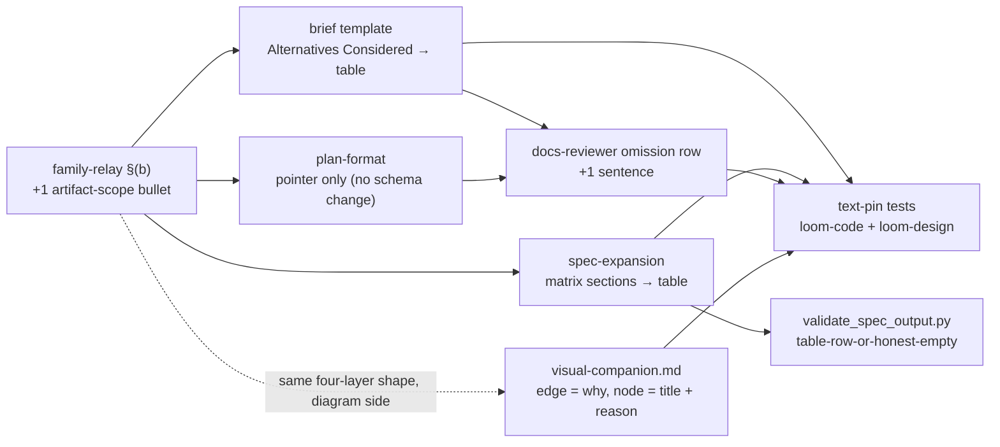

# Artifact-layer table routing — brief

> **Phase**: brainstorming output (`brainstorming` → `writing-plans` handoff)
> **Date**: 2026-08-17
> **Author**: kouko + agent (Fable 5 session)
> **Seed**: Obsidian research note `research/2026-08-17 loom 產出文件的可讀性結構稽核.md`, recommendation 1 ("extend `family-relay.md` §(b)'s routing rule from the conversation layer to the artifact layer"); plus one adjacent rule from its companion inventory note `research/2026-08-17 Obsidian 筆記可讀性規則的來源盤點與整合設計.md` (rules #6/#7 — causal arrow labels + two-layer node text — judged the only Obsidian-side rule that ports cleanly to loom's existing diagram slots)

## Problem

When a loom writer (brainstorming / writing-plans / spec-expansion) puts comparison-shaped content — two or more options weighed on shared axes — into a brief, plan, or spec, that content lands as prose, and the reader has to hold the options in their head to compare them.

- The family already has the rule that fixes this (`family-relay.md` §(b): "≥2 options at a fork → a markdown comparison table"), but it binds only the chat channel; the artifact templates never route the same content to a table.
- Measured: a 231-note human corpus is 97% table-bearing, sits opposite a loom plan corpus that is 3% table-bearing.
- Adding the 2026-08-11 diagram slot did not move that number (0 table rows before and after).

## Users

- **Human adjudicator (kouko)** — reads briefs / plans / specs at the sign-off gates, in zh-Hant via the adjudication view; the comparison content is exactly what they must judge, and prose comparisons are the slowest part to read.
- **Downstream agents** (`writing-plans` consuming a brief; `subagent-driven-development` reading a plan; reviewers reading a spec) — frontier-tier readers, indifferent to table-vs-prose per the seed note's literature; they need the content unambiguous, not necessarily tabular. Constraint: no small-tier model is asked to *write* structured cells here (spec-expansion and brainstorming run at session tier).
- **Template maintainers** — bound by the family anti-copy convention: templates point at the SSOT rule, never restate its body (`family-relay.md:5-9`, pinned by `loom-design/scripts/pipeline/test_family_relay.py:73,96`).

## Smallest End State

- `family-relay.md` §(b) carries one added routing bullet that states the artifact-layer scope of the existing fork→table rule.
- The three artifact templates that own comparison-shaped sections bind it at the writing moment: the brief's `## Alternatives Considered` becomes a comparison-table format, and spec-expansion's `## Path × edge matrix` / `## Cross-object combinations` sections gain a specified markdown-table form checked by the existing validator.
- The docs-reviewer's omission dimension names "comparison-shaped content left in prose where the template routes it to a table" as a finding, mirroring the diagram-slot sentence added on 2026-08-11.
- `visual-companion.md` — the when/how-to-draw reference every diagram slot already points at — gains a diagram-semantics rule (edges carry the causal/why relation as a label; nodes carry two layers, title + the fact or reason supporting it) so the diagrams the slots already force can replace prose instead of sitting beside it.
- Success = every new brief carries the alternatives table (or the pinned honest N/A line when Axis 4 found no alternatives), every new spec proposal renders its two matrix sections as tables (or the existing honest-empty line), and the text pins live in both plugins' test suites.
- Non-criteria: we do not measure human comprehension, and we do not retrofit existing plans/briefs/specs.

- BI-1 — `family-relay.md` §(b) states, in one bullet, that the ≥2-options-on-shared-axes → markdown-table routing applies to written artifacts (brief / plan / spec) as well as chat, with the axes as columns and a load-bearing chosen/rejected-because column; narrative "why" stays prose beside the table.
- BI-2 — The brief template's `## Alternatives Considered` section is a comparison table (columns: alternative · who ships it / source · why rejected), fill-or-declare with the pinned line `N/A — no alternatives found: <one-line reason>`; a loom-code text-pin test guards the wording.
- BI-3 — spec-expansion's `## Path × edge matrix` and `## Cross-object combinations` sections specify a markdown-table body; `validate_spec_output.py` fails when either body has neither a table row nor the section's honest-empty line; a loom-design test covers both branches.
- BI-4 — `docs-reviewer.md`'s omission row names comparison-shaped prose in a table-routed section as an omission, guarded by a text-pin test alongside the existing diagram-omission pin.
- BI-5 — loom-code and loom-design ship the change as a version bump each (plugin.json ×2 per plugin, CHANGELOG entry, codex mirror), per the repo's plugin-release convention.
- BI-9 — `visual-companion.md` carries a diagram-semantics rule for the diagrams the slots force: edge labels state the causal/why relation (not just "connects to"), and node text is two-layer (`title supporting fact or reason`); its own worked examples follow the rule, and a loom-code text-pin test guards the wording. Bare-label diagrams stay valid where a relation genuinely has no "why" (a pure dependency DAG) — the rule is a default, declared as such.

## Current State Evidence

- **Forward**: `visual-companion.md` (`loom-code/skills/brainstorming/references/visual-companion.md`, 125 lines) is the when-to-draw pointer target of every diagram slot — `plan-format.md:70`, `handoff-brief-format.md:119` — and is pinned by `test_plan_diagram_slot.py:122+` (pointer sentence) and `loom-design/scripts/pipeline/test_family_relay.py`; its flowchart example at `:46-62` uses bare-label edges (`-- Yes -->`) and one-layer nodes with a cost sub-line, and its anti-pattern list at `:109-115` has no semantics entry. `family-relay.md` §(b) `loom-code/hooks/family-relay.md:94-103` is preloaded into every session by the reception hook and pointed at by `plan-format.md:68`, `handoff-brief-format.md:117`, `brainstorming/SKILL.md:58,228`, `spec-expansion/SKILL.md:234`; a new bullet is read by all of them at once. Brief writers follow `handoff-brief-format.md:88-92` (Alternatives Considered = numbered list) and its template copy at `:190`; spec writers follow `spec-expansion/SKILL.md:293-294` (`## Path × edge matrix` — "the grid plus the surviving paths/edges", no table form) and `:411-418` (Cross-object combinations — "structurally required", honest-empty line allowed).
- **Reverse**: `family-relay.md` is SSOT by the family anti-copy convention (`family-relay.md:5-9`); pins on its §(b) wording live in `loom-design/scripts/pipeline/test_family_relay.py:57-104,197-210,244-307,363-375`, `test_family_relay_progress_card.py:5`, `loom-design/scripts/interface/test_ascii_ui_patterns.py:35`, `test_comms_metrics.py:276` — none in `loom-code/scripts/`. `validate_spec_output.py:278-286` (`_SEC_PATH_EDGE_MATRIX`, `_SEC_CROSS_OBJECT_COMBINATIONS`) checks heading presence only, via `_section_body` (`:290-300`).
- **Error**: `test_brief_diagram_slot.py:43` and `test_plan_diagram_slot.py:61-112` are the shape of the pins this change adds — count==1 on the pinned N/A prefix and on "Do not delete the section heading". `test_docs_reviewer_diagram_omission.py:33` finds the single `**omission**` row and asserts the appended sentence sits before "Assert only after the full-text read (rule 1)" — the new omission sentence must keep that ordering or the existing test breaks.
- **Data**: brief → `docs/loom/specs/*.md` (parsed top-down by writing-plans; BI identifiers seed requirement lines, `handoff-brief-format.md:121-140`); spec proposal → `proposal.md` validated by `validate_spec_output.py`; plan Decision Log entries are single-line runtime records (`plan-format.md:273-300`) — deliberately not a table target.
- **Boundary**: `[FRAGILE]` `family-relay.md` is a hook-preloaded file whose heading literals are pinned (`test_reception_includes_visual_defaults` asserts `### (b) Visual defaults` at `test_family_relay.py:246,331`) — add a bullet, never rename the heading. `[FRAGILE]` `test_family_relay.py:73,96` forbid downstream seams from restating §(b) rule bodies — the template edits must be format specs with an SSOT pointer, not paraphrases of the bullet.
- **Evidence paths**: `loom-code/hooks/family-relay.md:5-9,94-103`; `loom-code/skills/writing-plans/references/plan-format.md:57-72,68,273-300`; `loom-code/skills/brainstorming/references/handoff-brief-format.md:86-92,106-119,121-140,190,204`; `loom-code/skills/brainstorming/references/visual-companion.md:5-17,46-62,109-115`; `loom-code/scripts/test_plan_diagram_slot.py:122`; `loom-code/skills/brainstorming/SKILL.md:58,228`; `loom-code/agents/docs-reviewer.md:560`; `loom-code/scripts/test_brief_diagram_slot.py:43`; `loom-code/scripts/test_plan_diagram_slot.py:61-112`; `loom-code/scripts/test_docs_reviewer_diagram_omission.py:33`; `loom-design/skills/spec-expansion/SKILL.md:223-234,293-294,403-441`; `loom-design/scripts/spec/validate_spec_output.py:270-300`; `loom-design/scripts/spec/test_spec_expansion_diagram_forms.py:20-45`; `loom-design/scripts/pipeline/test_family_relay.py:57-104,197-210,244-307,363-375`; `docs/loom/memory/optional-template-sections-produce-no-behavior.md`; `docs/loom/memory/imperative-trigger-cards-beat-descriptive-preloads.md`; `docs/loom/plans/2026-08-11-visualization-trigger-layer.md:28-159`; `loom-code/.claude-plugin/plugin.json:3` (0.84.0); `loom-design/.claude-plugin/plugin.json:3` (0.1.0); `loom-design/CHANGELOG.md:9-14`.

## Decision

- We will extend the existing fork→table rule to the artifact layer the same way the 2026-08-11 arc extended the diagram rule: one SSOT sentence in `family-relay.md` §(b), bound at the writing moment by each owning template (brief Alternatives Considered → table; spec matrix sections → table), and made reviewable by one omission-dimension sentence in docs-reviewer plus a mechanical validator check where the section is machine-validated already (spec).
- Reach, stated honestly: docs-reviewer's jurisdiction is contract-class `.md` only (`docs-reviewer.md:330-342` — record-class `docs/**` is exempt), so that sentence gates the *templates* and skill references, not generated brief/plan instances; instance-level enforcement is the spec validator (mechanical, at freeze) plus the human sign-off gates with their adjudication view for briefs and plans — the same reach the 2026-08-11 arc recorded for its diagram-slot sentence (`docs/loom/plans/2026-08-11-visualization-trigger-layer.md` Decision Log 1), and a plan-document-reviewer check for table-routed content stays recorded debt, not scope.
- We will NOT add a prose-only doctrine line and stop there — the repo's own memory records that citable doctrine alone moved behavior 0/2 and an optional template section produced 1/29 compliance; the mechanism must bind where the writer acts.
- We will NOT add tables to the plan schema: the per-task block is already field-structured, the Task-flow diagram already carries dependencies, and a plan-level summary table would duplicate per-task fields (a second source that drifts); plans get the rule only through the shared SSOT pointer and the docs-reviewer dimension.
- We will NOT build a lint that detects comparison-shaped prose — undecidable mechanically; the reviewer dimension is the check.
- The diagram-semantics rule rides along because it lands in one file every slot already points at, costs one edit plus one pin, and is the only rule from the Obsidian inventory that ports without touching a parser; the rest of that inventory (callout roles, TOC, paragraph nets) is explicitly deferred — see Out of Scope.
- The trigger stays shape-based (≥2 options on shared axes), never count-based, so the rule cannot induce decorative tables — the MADR literature's "feature-matrix theater" risk is answered by requiring a load-bearing chosen/rejected-because column and leaving the narrative why in prose.

- BI-6 — The artifact-layer routing rule ships as SSOT sentence + template binding + reviewer dimension + validator check + text pins, never as a doctrine line alone.

## Out of Scope

- Retrofitting existing briefs / plans / specs / memory entries to the new format.
- Plan schema changes (task summary table, Acceptance-as-table) — see Decision; a future arc may revisit once the docs-reviewer dimension has produced findings against plans.
- The seed note's recommendation 2 (memory-entry minimum structure / paragraph-length net) — separate arc; the memory charter's one-fact-per-file shape is not comparison-shaped.
- A mechanical prose-shape lint (Vale-style rules) — undecidable for "comparison-shaped".
- Chat-layer behavior of §(b) — unchanged; only the artifact-scope bullet is added.
- The rest of the Obsidian readability inventory: callout role discipline (GitHub renders only 5 alert types; a `> - BI-n` line breaks `check_scenario_coverage.py:123`'s declaration regex; adjudication split does not model callouts), TOC (H2 units already navigate), paragraph 2–4-sentence net, frontmatter/wikilink rules — revisit after the docs-reviewer table dimension yields its first findings.
- Measuring reader comprehension or re-running the seed note's corpus audit (deferred until ≥30 post-rule artifacts exist, per the note's own §限制).
- The plan-document-reviewer prompt (`plan-document-reviewer-prompt.md`) — the 2026-08-11 precedent wired only docs-reviewer; plans reach the new dimension at whole-branch docs review.

## Alternatives Considered

| Alternative | Who ships it / source | Why rejected |
|---|---|---|
| Doctrine-only: add one sentence to §(b) and rely on preload | The 2026-07-10 preload of §(b) itself (loom-pipeline 0.7.0) | Repo memory `imperative-trigger-cards-beat-descriptive-preloads`: provably-in-context descriptive prose moved behavior 0/2; `optional-template-sections-produce-no-behavior`: 1/29 compliance until the slot became fill-or-declare + reviewer-checked. |
| Narrative pros/cons per option (MADR "Pros and Cons of the Options") | MADR template (adr.github.io/madr); Facile.it engineering blog | Keeps comparison in prose — the exact shape the seed note measured as unreadable; MADR's own commentary warns tables drift into "feature-matrix theater", which we answer with a load-bearing rejected-because column rather than by avoiding tables. JA practice (Zenn/Qiita ADR guides) goes the other way — same-axis comparison tables with the adopted option marked — an EN/JA split we resolve toward the table because the human reader here is the bottleneck. |
| Mechanical prose-shape linter (Vale-style rule flagging comparison prose) | Vale / docs-as-code linting (Contentsquare, Datadog, Elastic) | Vale rules match terms and patterns, not "≥2 options on shared axes"; false positives would gate honest prose. Reviewer judgment + validator-on-structured-sections is the tractable subset. |
| Extend the plan schema too (task summary table, Acceptance table) | Seed note recommendation 1's literal list | Per-task fields already structured; a summary table duplicates them (drift); Task-flow diagram already carries dependencies. Deferred to Out of Scope pending reviewer findings. |

## What Becomes Obsolete

- BI-7 — `handoff-brief-format.md:90`'s "Format: numbered list, each with a one-sentence rejection rationale" for Alternatives Considered is replaced by the table format (deleted in the same PR, along with the template's numbered-list skeleton at `:190`).
- BI-8 — spec-expansion's unspecified "grid" body for `## Path × edge matrix` (`SKILL.md:293-294`) is replaced by the specified table form (same PR).
- BI-10 — `visual-companion.md:46-62`'s bare-edge / one-layer flowchart example is rewritten to follow the new semantics rule (same PR) — the reference must not teach the shape its own rule discourages.

## Open Questions

N/A — no unresolved question: the one fork (include the spec/loom-design leg or ship loom-code only) is settled in Decision — include it, because the spec matrix sections are the only place the check is mechanical, and the two-plugin bump mirrors the 2026-08-11 precedent.

## Design-side on-ramp

Axis 0 negative guard: this is a test-covered increment to existing skill text (not product-shaped, no UI surface) — upstream-artifact walk skipped silently. Backlog ready check ran: COMMITTED-NEXT `2026-08-13-requirement-identity-splits…` and the OPEN queue surfaced; none overlaps this seed. `docs/loom/DIRECTION.md` `## Now` = the same COMMITTED-NEXT item; `## Next` names "loom-code replay matrix" (adjacent, not overlapping). Not offered loom-init — the queue layer already exists.

## Diagrams

Caption: where the one SSOT rule binds — the same four-layer shape the 2026-08-11 diagram-slot arc used, applied to comparison-shaped content.

