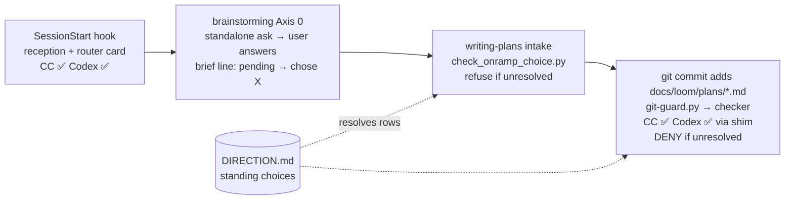

# On-ramp explicit-choice gate — brief

> Design-side on-ramp: not fired — loom-code-internal mechanism increment (a
> git-guard extension + skill/reception wording); no product surface, no UI,
> not multi-state user-facing behavior (negative guard). Backlog ready check:
> run — `DIRECTION.md ## Now` empty; two related OPEN items
> (`2026-07-10-operationalize-product-shaped-in-family-reception`,
> `2026-07-10-on-ramp-row-4-vs-rows-2-3-precedence-unstated`) — neither is
> resolved by this brief (see §Out of Scope). loom-memory recall: run (see
> §Current State Evidence · Memory).

## Problem

When the loom family's design-side on-ramp fires (rows 1–4 of the reception
table), the choice "detour into loom-design first, or go direct to a brief"
is the user's — but today the agent both surfaces the recommendation and
records the answer, so in practice the agent decides. Measured over the 86
briefs in `docs/loom/specs/` that carry a `## Design-side on-ramp` line:
71 not-fired, **8 fired-and-agent-defaulted-direct** ("offered — direct per
repo precedent"), 3 fired-with-an-explicit-user-choice, 4 other. The
2026-08-18 strategy-dag session is the case that made it visible: the
recommendation was one bullet inside a status paragraph, the agent wrote
"user did not object", and the user later asked from scratch whether
loom-design should have owned the work. Job: *when a design-side detour is
recommended, I want the decision to be visibly mine — recorded as my
answer, never as the agent's default — without adding ceremony to
increments where the on-ramp does not fire.*

## Users

kouko, single user, running loom-code on **both Claude Code and Codex CLI**
(Codex 0.139: SessionStart hook honored; PreToolUse fires for Bash only, via
`.codex/hooks/git-guard-shim.sh` → the same `git-guard.py`). Sessions are
long (compaction happens), and briefs are written under
`dev-workflow:brief-before-asking`'s one-decision-per-ask rule, which is
exactly what squeezes the on-ramp out of the ask and into a status bullet.

## Smallest End State

A brief whose on-ramp line records an agent default cannot become a
committed plan. Concretely: (1) `## Design-side on-ramp` gets a canonical
three-state grammar (`not fired — <reason>` / `fired: rows <list> — user
chose <detour|direct>` / `pending`), specified in the brief format reference
(today the field is specified only in brainstorming's Axis 0 prose and no
consumer reads it); (2) a checker script parses that line, treats every
non-canonical wording as unresolved (never as pass — the lookalike lesson),
and honors **repo-level standing choices** recorded in
`docs/loom/DIRECTION.md` (e.g. "row 1: standing direct — this repo
deliberately has no PRINCIPLES.md") so a decision made once for a repo is
not re-asked per arc; (3) `git-guard.py` runs the checker on `git commit`
when a **newly added** `docs/loom/plans/*.md` is staged, resolves the
plan's `**Source brief**:` path, and blocks (exit 2, message names the
exact question to put to the user) when the brief's line is `pending`,
non-canonical, or `fired` without a user/standing choice; (4)
`writing-plans` runs the same checker at intake for early feedback and
refuses to plan on the same conditions; (5) brainstorming Axis 0 and the
reception text change from "surface once, record, proceed either way" to
"surface as a **standalone ask** (host-neutral: `AskUserQuestion` on
Claude Code, or a prose ask whose only question is this), write `pending`
until the user answers, agent may recommend but never records the
answer"; the "never blocking prerequisites" sentence is rewritten to
"never a prerequisite to *run* loom-design — but the *choice* is gated".

- BI-1 — `## Design-side on-ramp` has a canonical three-state grammar owned by `handoff-brief-format.md`; any other wording is unresolved, not pass.
- BI-2 — A checker script (`loom-code/scripts/check_onramp_choice.py`) parses a brief's on-ramp line and returns resolved / unresolved with a user-facing message; standing choices in `docs/loom/DIRECTION.md` resolve the rows they name.
- BI-3 — `git-guard.py` blocks `git commit` when a newly added `docs/loom/plans/*.md` is staged and its `**Source brief**:` brief is unresolved per BI-2; identical behavior on Codex via the existing shim.
- BI-4 — `writing-plans` runs the checker at intake and refuses to plan while the brief is unresolved (same conditions as BI-3, earlier feedback).
- BI-5 — brainstorming Axis 0 requires the recommendation to be a standalone ask, writes `pending` until the user answers, and forbids recording an agent default; the reception's on-ramp section says the same and rewrites the "never blocking prerequisites" sentence.
- BI-6 — `docs/loom/DIRECTION.md` gains a `## On-ramp standing choices` section (format + one worked entry for this repo's row 1, dated), read by BI-2; `loom_init.py` scaffolds the empty section.
- BI-7 — Fire-rate evidence: the checker is run over the existing 86 briefs and the plan/brief pairs, and the counts (blocked / resolved / not-fired) are recorded in the plan's verification step before the gate ships.

## Current State Evidence

- **Forward** — the on-ramp line is write-only: written per `loom-code/skills/brainstorming/SKILL.md:101-112`, never read by `loom-code/skills/writing-plans/SKILL.md` (intake reads Smallest End State / Decision items, runs `check_open_questions.py` at :113 and `check_scenario_coverage.py` at :111/271 — no on-ramp check); `handoff-brief-format.md` has zero mentions of it.
- **Reverse** — producers: brainstorming Axis 0 (`SKILL.md:60-112`); the reception table `loom-code/hooks/family-reception.md:66-87` (row wording; "Recommend ONCE, never nag" :76; "never blocking prerequisites" :87); `test_brainstorming_axis0.py:70-87` asserts only that the skill text mentions the line. Plans point back via `**Source brief**:` (`writing-plans/references/plan-format.md:31`, live example in the strategy-dag plan header).
- **Error** — `git-guard.py` already blocks push/PR on missing markers with exit 2 + stderr (`git-guard.py:1-50`, marker read at :441-459; waiver unlink-first at :441-459); fail-open on malformed input (`:489-492, :570`). The Codex shim fails open with one stderr line on payload-shape mismatch (`.codex/hooks/git-guard-shim.sh:1-40`). New commit-time check must keep both fail-open postures.
- **Data** — brief markdown line (86 briefs, 4 wording families measured 2026-08-18); plan header `**Source brief**:` path (relative to repo root); `<git-dir>/loom/` marker dir (`loom_gate_markers.py:9-11`) — not needed here: the brief line itself is the record. `docs/loom/DIRECTION.md` (`## Now` / `## Next` today; new section added).
- **Boundary** — `[FRAGILE]` Codex PreToolUse fires for Bash only (`docs/loom/codex-verification.md:102-116`), so any enforcement outside a Bash-matched guard is Claude-Code-only; SessionStart reception injection works on both hosts (`references/codex-tools.md:68-83`). `[FRAGILE]` `AskUserQuestion` has no confirmed Codex equivalent → the ask form must be defined host-neutrally.
- **Memory** — `docs/loom/memory/pipeline-enforced-gates-beat-drafter-instructions.md` (prose 22% → gate 67%); `prose-only-enforcement-dies-on-weak-executors.md`; `measure-a-checks-fire-rate-before-building-it.md` (drove BI-7 and the 86-brief measurement above); `section-gate-must-flag-entry-lookalikes-not-just-matches.md` (drove "non-canonical = unresolved").
- **Evidence paths** — `loom-code/skills/brainstorming/SKILL.md:60-112`; `loom-code/skills/brainstorming/references/handoff-brief-format.md:24-141`; `loom-code/skills/writing-plans/SKILL.md:14,43-46,104-113,153,223-271`; `loom-code/skills/writing-plans/references/plan-format.md:31`; `loom-code/hooks/family-reception.md:66-87`; `loom-code/hooks/hooks.json:5-37`; `loom-code/hooks/session-start:67-105`; `loom-code/hooks/git-guard.py:1-50,441-459,489-492,570`; `loom-code/scripts/loom_gate_markers.py:9-11,50-52`; `loom-code/scripts/test_brainstorming_axis0.py:40-175`; `.codex/hooks.json`; `.codex/hooks/git-guard-shim.sh:1-40`; `docs/loom/codex-verification.md:102-116`; `loom-code/skills/using-loom-code/references/codex-tools.md:64-83`; `docs/loom/DIRECTION.md:1-9`; `docs/loom/backlog/2026-07-10-operationalize-product-shaped-in-family-reception.md`; 86 files under `docs/loom/specs/*.md` (grep measurement); `/Users/kouko/.supacode/repos/monkey-skills/strage-dag-skill/docs/loom/specs/2026-08-18-strategy-dag-plugin.md:22-24`.

## Decision

Build the gate where loom-code already has a real door and where Codex
already fires: extend `git-guard.py`'s Bash-matched PreToolUse guard to
check the on-ramp line at commit-time for newly added plans (BI-3), backed
by one portable checker script (BI-2) that `writing-plans` also runs at
intake (BI-4). Make the *choice* the gated thing, not the detour: the user
saying "direct" is the waiver, so no separate waiver file. Give repos a
durable place for a standing choice (BI-6) so a repo that has decided "no
PRINCIPLES.md here" is not re-asked every arc — this is the measured
8-of-11 pattern made honest. Rewrite the prose (BI-5) so the recommendation
is a standalone ask and the brief says `pending` until answered; grammar
canonical in the format reference (BI-1). Ship a fire-rate measurement
before the gate is live (BI-7). We will NOT define "product-shaped", NOT
gate Skill/Write tool calls, NOT touch loom-design's own skills, and NOT
add a PreToolUse-on-Skill hook (Codex-incompatible).

- BI-8 — The user's recorded `direct` is the only bypass; no waiver.json for this gate.
- BI-9 — Enforcement lives only in Bash-matched git-guard + scripts + SessionStart-injected text — surfaces verified on both hosts.

## Out of Scope

- Operationalizing "product-shaped" (backlog `2026-07-10-…-product-shaped…` stays OPEN; this gate checks the *choice*, not the classification).
- Row-precedence rules (backlog `2026-07-10-on-ramp-row-4-vs-rows-2-3…`).
- Gating brainstorming itself (PreToolUse on Skill), Write/Edit hooks, or any Claude-Code-only enforcement.
- Changing loom-design skills, `using-loom-pipeline`, or the pipeline's own on-ramp handling.
- Migrating the 83 historical briefs to the canonical grammar (gate applies to newly added plans; a plan added later for an old brief must update that brief's line — accepted).
- Fixing the strategy-dag worktree brief's "使用者未反對" wording (that branch's own concern).
- Push-time re-check of plan files (commit-time is the door; push already gated by review/verify markers).

## Alternatives Considered

| Alternative | Who ships it / source | Enforcement tier | Codex | Why rejected / adopted |
|---|---|---|---|---|
| A. Prose-only upgrade of reception + Axis 0 (standalone-ask rule, exemption conditions) | Current loom design; JA writeup on ADR guardrails explicitly calls checklists "self-report, not enforcement" ([JA] https://wakatchi.dev/adr-guardrails-as-code/) | prose | ✅ (SessionStart both hosts) | **Adopted as BI-5, insufficient alone** — this failure happened *with* the prose present; loom-memory 22%→67% |
| B1. Checker script invoked by writing-plans at intake only | same tier as `backlog_index.py` / `check_open_questions.py` | script, prose-invoked | ✅ | **Adopted as BI-4 for early feedback**; alone it is skippable by the same executor that skipped the ask |
| B2. git-guard commit-time check on newly added plans (chosen door) | loom-code's own push gate pattern; ADR Guard "required check + explicit waiver" ([EN] https://github.com/architecture-decision-record/architecture-decision-record, secondary); Archgate CLI agent-native lint gates ([EN] https://github.com/archgate/cli) | mechanical (deny) | ✅ via existing shim | **Adopted as BI-3** — reuses the only enforcement surface both hosts fire |
| C. Hard block brainstorming when product-shaped and no design artifacts (PreToolUse on Skill) | LangGraph `interrupt()` philosophy — no path continues without a resume value ([EN] https://docs.langchain.com/oss/python/langgraph/interrupts) | mechanical | ❌ (Codex PreToolUse = Bash only) | Rejected: needs "product-shaped" to be machine-decidable (it is not); Codex-incompatible; collides with harness-audit item 7 (ceremony blocking small requests) |
| D. Separate one-shot `onramp-waiver.json` like the push waiver | loom-code push gate | mechanical | ✅ | Rejected (BI-8): the push waiver exists because markers need a skill run; here the required input is a user utterance — the recorded `direct` *is* the waiver |
| E. Standing choice per repo in DIRECTION.md | judgment-rubrics §3(c) "documented decision beats re-asking"; ADR Guard's scoped watched paths (small-task guard) | data | ✅ | **Adopted as BI-6** — turns the measured "direct per repo precedent" habit into a recorded, gate-readable decision |

EN/JA sources agree (halt-until-resume vs required-check-plus-explicit-waiver; both call self-report insufficient) — no disagreement to surface.

## What Becomes Obsolete

- BI-10 — `family-reception.md:87` "recommendations to surface once, never blocking prerequisites" (as worded) and brainstorming Axis 0's "proceed either way" — replaced by the standalone-ask + `pending` + gated-choice wording (same change as BI-5).
- BI-11 — The de-facto "offered — direct per repo precedent" idiom in briefs — superseded by the standing-choice section (BI-6) plus canonical grammar (BI-1); the 8 historical instances stay as-is (out of scope) but the idiom is no longer producible under the new Axis 0 text.
- The `test_brainstorming_axis0.py:70-87` assertion that requires "proceed either way"-style phrasing (if any exact-phrase assertion conflicts) — updated in the same change, not left red.

## Open Questions

- none

## Diagrams

Where the door sits, and what fires on which host — read left to right; the only deny is the commit-time guard.

