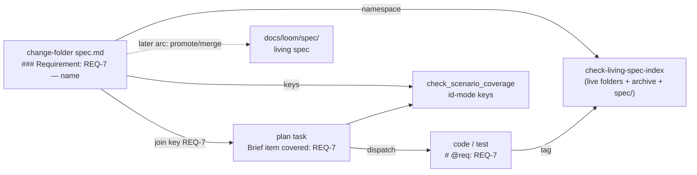

# Brief: give a requirement one identity from its birthplace onward (REQ-n + name)

- Date: 2026-08-18
- Stage: brainstorming output → writing-plans input
- Design-side on-ramp: no criteria row fired (repair of a shipped loom mechanism; no UI surface, no new multi-state behavior) — no detour offered.
- Axis 0 queue check: this arc IS `## Now` (`2026-08-13-requirement-identity-splits-between-birthplace-and-living-spec`, COMMITTED-NEXT, start = "immediately after the brief-item addressability arc ships" — that arc merged as PR #692). One OPEN entry fires on this arc's touch set: `2026-07-06-four-deferred-items-from-the-living-spec-index-slices-paired-regex-locks` (start = "next living-spec script touch"); its item (a) is folded in below, (b)–(d) stay open (see Out of Scope).
- Predecessor: `docs/loom/specs/2026-08-13-brief-item-addressability.md` — this brief mirrors its `BI-<n>` convention shape (authored id + readable text, monotonic never reused, all-or-nothing per document, legacy mode never deprecated, convention pinned by tests over the doc).

## Problem

When a requirement is written for the first time — in a change-folder
`specs/<capability>/spec.md` — it is named by prose (`### Requirement: <name>`),
and everything downstream that wants to point at it must repeat that prose:

- the plan's join key (`<change-id> / Requirement: <name> / Scenario: <name>`)
- the coverage checker's keys
- any future `@req` tag

A prose key breaks under
rewording, cannot disambiguate duplicates (`check_scenario_coverage.py:199-204`
already warns "the join-key grammar is fixed… occurrence indices can't be
added" and continues), and never joins to the `REQ-N` vocabulary the living
spec and its CI gate speak.

Recon reframed the backlog's statement of the defect: there is no split
between two populated vocabularies — there is ONE populated vocabulary (prose
names, ~40 real requirements across two live folders + archive) and one
**documented-but-never-populated** vocabulary (`REQ-N`).

Evidence for the documented-but-never-populated vocabulary:

- zero `### Requirement: REQ-` headers exist outside the skill's own placeholder text
- zero `@req: REQ-N` tags exist in source
- no script ever mints a REQ-N (the archive verb only `mv`s the folder)
- the CI gate's namespace root points at a directory that does not exist (`docs/loom/spec`, singular) — the gate has been vacuously green since it shipped

Meanwhile a third vocabulary already grew to
fill the vacuum: `investing-toolkit/tests/test_exhibit_*.py:13,25,32` carry
`@req:` lines citing a plan path in prose.

The job: **a requirement gets its immutable id where it is born, and every
downstream consumer — plan referent, coverage join key, `@req` tag, CI
namespace — reads that same id**, so the citation chain resolves end to end
for the first time.

## Users

- **Spec authors** (`loom-design:spec-expansion` writers, human or agent) —
  today taught two grammars in one file (`spec-expansion/SKILL.md:397`
  `<name>` vs `:494-511` `REQ-X [active|deferred]`) with no bridging sentence.
  They need one header shape and one minting rule.
- **Plan authors** (`writing-plans`) — today mandated to build the prose join
  key (`writing-plans/SKILL.md:259-261`); the plan's traceability field accepts
  three referent kinds and none of them is a REQ id (`plan-format.md:113-121`).
- **Implementers** (`loom-code/agents/implementer.md:102-127`) — told to emit
  `# @req: <REQ-id>` "when the plan binds work to registered REQ-ids" and never
  to mint one; today no plan ever binds one, so the instruction is inert.
- **The three checkers**: `validate_spec_output.py:47` (presence-only),
  `check_scenario_coverage.py:44-47,100-103,195-219` (name-keyed join,
  duplicate collapse), `check-living-spec-index.py:184,315-333` +
  `living_spec_index.py:21-35` (REQ namespace, dangling-tag rc=1, empty root).
- **The maintainer reading a 6-month-old test tag** — needs `REQ-7` to
  resolve to a requirement text without a rename archaeology.

## Smallest End State

A change-folder requirement header may carry an authored id ahead of its name
— `### Requirement: REQ-<n> — <name>` (status suffix `[active|deferred]`
unchanged, still optional) — and the id, once present, is the join key
everywhere the name used to be. Both `spec.md` grammars in `spec-expansion`
collapse to this one shape (living-spec headers keep `REQ-<n>` and may carry
the ` — <name>` half). Adoption is all-or-nothing per spec file, mirroring
`BI-<n>`: a file with no ids keeps every current behavior (legacy mode, not
deprecated); a file with any id must id every requirement, and duplicates or
non-form ids fail loudly. The CI living-spec gate's namespace is widened to
the requirement headers of live change-folders + archive (+ `docs/loom/spec/`
if it ever exists) so an `@req: REQ-<n>` tag written today resolves today.
Success = a REQ id typed once in a spec header is citable, unchanged, from a
plan task's `Brief item covered`, from a `# @req:` tag, and from the coverage
+ living-spec checkers, with the checkers rejecting a dangling or duplicate
id. Non-criteria: we do not measure adoption or migrate existing folders.

- BI-1 — A change-folder requirement header may declare an authored id in the
  form `REQ-<n> — <name>`; the validator (`validate_spec_output.py`) parses
  id and name, and rejects a non-form id (`REQ1`, `req-1`, `R-1`) or a
  duplicate id within the folder.
- BI-2 — Adoption is all-or-nothing per spec file: any id present ⇒ every
  `### Requirement:` in that file must carry one (error otherwise); no id
  present ⇒ legacy behavior, unchanged, indefinitely.
- BI-3 — Ids are authored, monotonic across the whole repo (next unused =
  highest ever seen across live folders + archive + living root, plus one),
  never renumbered, never reused; split/merge retires both sides. A helper
  (`--next-req-id` on an existing script, or a documented grep) reports the
  next free number; the checkers reject a cross-folder collision at the
  merge boundary.
- BI-4 — `check_scenario_coverage.py` keys id-mode folders by
  `<change-id> / REQ-<n> / Scenario: <name>` and the duplicate-name warning
  path (`:199-219`) no longer applies to them; legacy folders keep the
  prose key.
- BI-5 — The plan's `Brief item covered` field accepts a fourth referent kind
  — a `REQ-<n>` id (optionally with the change-id join key) — and every
  consumer of that field's grammar is either updated or recorded as
  needing no change (`plan-format.md`, `plan-document-reviewer-prompt.md`
  Check 3, `check_scenario_coverage.py` resolver, `plan_card.py` opaque
  read, `test_traceability_generalization.py` single-field rule).
- BI-6 — `check-living-spec-index.py`'s namespace = requirement headers of
  `docs/loom/*/specs/*/spec.md` (live change-folders) + `docs/loom/archive/*/specs/*/spec.md`
  + `docs/loom/spec/*/spec.md` (living root, tolerated absent); the singular
  nonexistent-root bug is fixed; a `# @req: REQ-<n>` tag resolves against
  that namespace and a dangling one still exits 1.
- BI-7 — `spec-expansion/SKILL.md` teaches one header grammar (the `:397` and
  `:494-511` passages reconcile), `writing-plans` §Consuming a loom-design
  change-folder mandates the id key when the folder is in id mode, and
  `implementer.md`'s `@req` guard names the change-folder as a legal
  binding source; the doc-side convention is pinned by tests the way
  `test_brief_item_ids.py` pins `BI-<n>`.
- BI-8 — The paired suffix-vocab regexes in `living_spec_index.py:21-35`
  (deferred item (a)) share one source of the `active|deferred` vocabulary
  so they cannot drift apart when the header grammar changes.

## Current State Evidence

- **Forward** — `loom-design/scripts/spec/validate_spec_output.py:46-47,234-246,504-505`
  (presence + RFC-2119 checks over `### Requirement:`; never reads the
  name); `loom-design/skills/spec-expansion/SKILL.md:397` (birth skeleton,
  `<name>`) vs `:494-511` (`REQ-X [active|deferred]`), unreconciled in one
  file; `loom-code/scripts/archive_change_folder.py:244-300` (mv + stamp
  only — no promote, no REQ mint); `loom-code/agents/implementer.md:102-127`
  (only bridge to `@req`, prose-conditional).
- **Reverse** — `loom-code/scripts/living_spec_index.py:21-23,33-35` (id
  group is `(.+?)` — accepts prose as an id; paired regexes),
  `:45,64,85` (globs `<root>/*/spec.md` — same shape a change-folder emits);
  `loom-code/scripts/living_spec_tags.py:39,88-91`; `living_spec_collect.py:50,126,136,187`;
  `living_spec_drift.py:2`, `living_spec_gitref.py:1,112`;
  `loom-code/scripts/check-living-spec-index.py:184` (root
  `docs/loom/spec`, nonexistent), `:91,284-333`;
  `loom-code/scripts/check_scenario_coverage.py:44-47,100-103,123,132,195-219,271-322,340-419`;
  `loom-code/skills/writing-plans/SKILL.md:225,245,259-261,271`;
  `loom-code/skills/writing-plans/references/plan-format.md:113-121`;
  `plan-document-reviewer-prompt.md:35`; `loom-code/scripts/plan_card.py:423`
  (opaque string — no change).
- **Error** — dangling `@req` → rc=1 (`check-living-spec-index.py:315-333`),
  vacuous today (empty root); duplicate folder requirement names → warning,
  continue (`check_scenario_coverage.py:199-219`); duplicate `BI-<n>` →
  warning, first wins (`:317-322`); unresolvable brief citation → ERROR
  (`:404-419`); a requirement that never gets an id → nothing fires (by
  construction).
- **Data** — 0 real `REQ-N` headers, 0 real `@req: REQ-N` tags; two live
  folders: `docs/loom/2026-07-12-us-sec-primary-source-layer/specs/{operational-kpi,narrative,financial-table-xval}/spec.md`
  (operational-kpi alone: ~32 requirements, `:5`–`:416`, one status-suffixed
  at `:264 … [deferred]` — the only real use of the bracket slot, for
  status not identity) and `docs/loom/2026-07-19-8k-prose-kpi-intake/specs/prose-kpi-intake/spec.md`;
  archive `docs/loom/archive/2026-07-18-2026-07-16-operational-kpi-quarterly/specs/operational-kpi-quarterly/spec.md:5-138`
  (6 requirements); ad-hoc third vocabulary `investing-toolkit/tests/test_exhibit_*.py:13,25,32`.
  BI precedent to mirror: `handoff-brief-format.md:122-131,221-224`;
  `check_scenario_coverage.py:123,132,271-322,340-419,478,557`;
  `test_brief_item_ids.py:102-396`.
- **Boundary** — `[FRAGILE]` tests pinning the grammar:
  `loom-code/scripts/test_living_spec_index.py:35,55-56,83-86,101-130`,
  `test_check_living_spec_index.py:102-181,240,352,583,618,670`,
  `test_living_spec_e2e.py:56-70`, `test_living_spec_tags.py`,
  `test_living_spec_collect.py`, `test_living_spec_drift.py`,
  `test_living_spec_gitref.py`, `test_implementer_req_tag_guard.py`,
  `test_spec_to_code_wiring.py:58`, `test_check_scenario_coverage.py:102`,
  `test_traceability_generalization.py:62-70` (forbids a second
  traceability field — REQ referent must ride inside `Brief item covered`),
  `loom-design/scripts/spec/test_validate_spec_output.py`,
  `test_spec_expansion_skill.py:377`. CI: `.github/workflows/loom-code-ci.yml:125,134,145`
  (structural every push rc=1; `--verify-index` byte-identity vs
  `docs/loom/INDEX.md` — widening the namespace WILL change the rendered
  index; `--check-coverage` merge boundary); `loom-spec-ci.yml:50-53`.
  `check_scenario_coverage.py` is skill-invoked, not CI. Codex mirror:
  hooks/manifests only, no Python scripts. Version bumps: both
  `loom-code/.claude-plugin/plugin.json:3` (0.85.0) and
  `loom-design/.claude-plugin/plugin.json:3` (0.2.0) + `loom-code/CHANGELOG.md`.
- **Evidence paths** — all files named above; full list in the recon
  appendix carried in this session's log (43 files, read 2026-08-18).

## Alternatives Considered (research-grounded)

Sources re-verified 2026-08-18 (EN + JA; JA sources — Qiita/dearsystem Kiro
write-ups — reprint EN mechanics and add no independent detail; no EN/JA
disagreement found).

My take:

- **Recommend**: hybrid `REQ-<n> — <name>`, id authored at birth in the change-folder, global monotonic sequence, uniqueness enforced by the merge-boundary checker.
- **Why**: every long-lived system surveyed converges on immutable-id + mutable-title (StrictDoc/Doorstop `UID`+`TITLE`+auto `MID` built for cross-document moves; DOI+title; git SHA+ref; Jira key+summary), and loom's own plan (`T3` + `## Task 3 — name`) and brief (`BI-<n> — text`) layers already ARE this shape — the convention is proven in-repo twice.
- **Conditional reversal**: if parallel change-folders collide on `REQ-<n>` more than once a quarter, switch minting to reserve-on-create keyed by a central sequencer (the Matrix MSC pattern — PR number as id, spec.matrix.org/proposals) instead of a repo grep.

1. **Name-only, add RENAMED verb + normalization** (OpenSpec's actual
   design: archive applies RENAMED→REMOVED→MODIFIED→ADDED with
   trim/case-insensitive header compare — deepwiki.com/Fission-AI/OpenSpec/6.6-archive-command;
   rename hole issue #1112 sat six days, recurred twice) — rejected: it is
   the design that pays the duplicate-name warning today, and it needs a
   rename algorithm we would have to build and still ships the hole.
2. **Ordinal-only** (Kiro `### Requirement 1/2/3` + numbered EARS criteria —
   github.com/jasonkneen/kiro/…/requirements-phase.md; kiro.dev/docs/specs) —
   rejected: position-derived ids shift on insert/delete — the exact
   failure `BI-<n>`'s "authored, never derived" rule exists to prevent.
3. **Id at spec time, prose downstream** (spec-kit `FR-001` in
   spec-template.md while tasks-template.md tags only `[US1]` — verified:
   the FR id never threads into tasks) — rejected: it is the current state
   here in reverse (an id that exists but nothing cites); the value is in
   the thread, not the id.
4. **Per-change namespace `<change-id>/REQ-1`** — no surveyed tool ships it
   as a first-class feature (OpenSpec #768 covers change-folder prefixes,
   not requirement ids); rejected for now: it solves collisions by making
   the id long-lived-unstable (the id changes meaning when the folder
   archives). Kept as the reversal path's second candidate.
5. **Build the archive→living-spec merge in this arc** (the OpenSpec-style
   promote step that would populate `docs/loom/spec/`) — deferred, not
   rejected: it is a separate mechanism (delta application, MODIFIED/REMOVED
   semantics) with its own brief; this arc makes ids exist and resolvable
   so that a later merge step carries them for free.

## Decision

- Build the hybrid id in the change-folder header, make the id the join key in every consumer that today uses the name, widen the CI namespace to see change-folders so the chain resolves end to end, and pin the convention with doc-schema tests exactly as the `BI-<n>` arc did — one convention doc section (the requirement-id twin of `handoff-brief-format.md §Brief item identifiers`, living in `spec-expansion`), one grammar in three parsers, one minting rule.
- Do NOT build the living-spec promote/merge, do NOT migrate the two live July folders (legacy mode is a first-class state), do NOT add scenario-level ids.
- Trade-off: cross-branch id collisions are handled by grep-then-check rather than a central sequencer, accepted because the path sees ~2 folders/month; the reversal condition above is written down.

- BI-9 — One convention section (form / authored-not-derived / monotonic /
  all-or-nothing / split-merge retire / language) is the SSOT for `REQ-<n>`
  and every parser + skill text points at it rather than restating it.

## Out of Scope

- The archive→living-spec promote/merge step (Alternative 5) — own brief.
- Migrating `docs/loom/2026-07-12-…` and `2026-07-19-…` to id mode — legacy
  mode is not deprecated; a migration is a separate one-pass task per the
  BI all-or-nothing rule.
- Scenario ids (`REQ-3.2`) — scenario names stay prose under an id'd
  requirement; revisit if duplicate scenario names under one requirement
  are ever observed.
- Deferred living-spec items (b) drift-lane tokenization, (c) Rule-of-Three
  `_matched_files`, (d) ready-signal binding — stay OPEN in their backlog
  entry; only (a) is folded (BI-8) because this arc edits those two regexes.
- Converting the three ad-hoc `@req:` prose-path lines in
  `investing-toolkit/tests/test_exhibit_*.py` — recorded, left; they are
  legal today (opaque token) and become a dangling-id error only if someone
  writes them as `REQ-…`.
- Codex-side port — no Python is mirrored under `.codex/`.

## What Becomes Obsolete

- BI-10 — `check_scenario_coverage.py:199-204`'s "join-key grammar is fixed…
  occurrence indices can't be added" comment and the duplicate-name
  warning path become legacy-mode-only; the comment is rewritten to say so
  (deleted for id mode).
- BI-11 — The second, unreconciled header grammar passage in
  `spec-expansion/SKILL.md` (`:397` vs `:494-511`) collapses into one; the
  `test_spec_expansion_skill.py:377` pin is strengthened to assert the
  single shape (a-doc-pin memory: strengthen, don't delete).
- BI-12 — The `docs/loom/spec` singular nonexistent root in
  `check-living-spec-index.py:184` as the sole namespace source.
- The backlog entry's stale `loom-spec/scripts/…` citations → corrected to
  `loom-design/scripts/spec/validate_spec_output.py:47` when the entry is
  closed (backlog hygiene, not a BI).

## Diagrams

Caption: where the id is born and who reads it after this arc (today the
dashed edges do not exist and the CI namespace box is empty).

## Open Questions

None open. Resolved 2026-08-18 by the user before planning:

1. **Header form** — decided: id-first, `### Requirement: REQ-<n> — <name>`
   (status suffix stays in the bracket slot). The name-first
   `<name> [REQ-<n>]` variant was rejected because the bracket slot already
   means status and both in-repo precedents (`BI-1 — text`, `## Task 3 —
   name`) are id-first.
2. **Scope** — decided: BI-6 (CI namespace widened to live change-folders +
   archive + living root) is IN this arc; without it the id resolves nowhere
   in CI.
3. `docs/loom/INDEX.md` — treated as committed-regenerated output of
   `--verify-index`; the PR that widens the namespace regenerates it in the
   same change.
