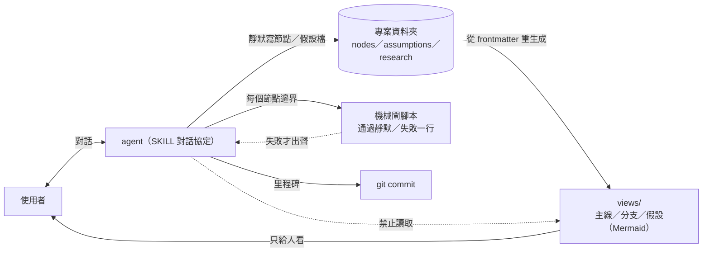
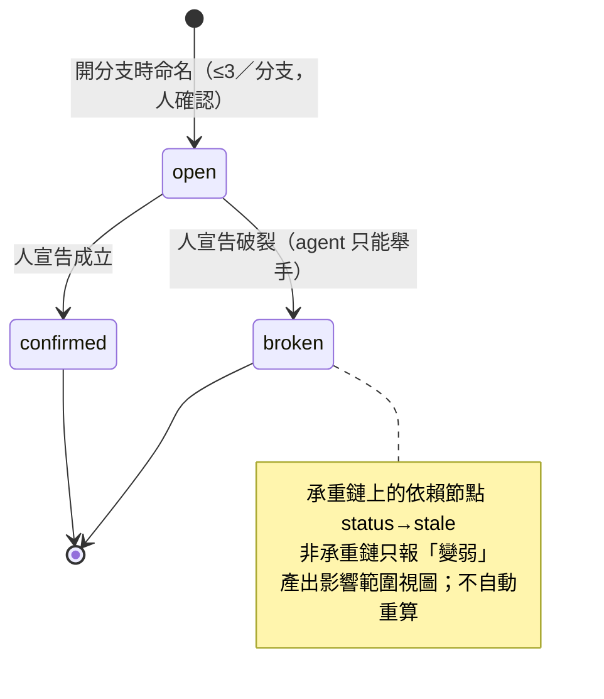

# think-orbit plugin（決策推演 CoT 文件群）— brief

> **Phase**: brainstorming output (`brainstorming` → `writing-plans` handoff)
> **Date**: 2026-08-18
> **Author**: agent (Fable 5) + kouko
> **Upstream artifacts** (vault, not repo — read-only inputs):
> `/Users/kouko/kouko-obsidian-vault/research/2026-08-18 決策推演 plugin v0 設計定案.md`（要做什麼）、
> `…/2026-08-18 決策節點分類法的雙盲一致率實驗.md`（實證）、
> `…/2026-08-17 不可變 DAG 與六類推理節點架構可行性研究.md`（哪些設計站不住）。
> Session handoff: `.claude/handoffs/HANDOFF-2026-08-18-think-orbit-plugin-design.md`.
> **Scope lock**: user chose the FULL v0 scope（「第一個版本就可以完整運作」）over a
> vertical slice; mitigation is task ORDERING (schema + gate + assumption
> propagation first, real-material checkpoint, then views/compile).
> **Working name**: `think-orbit`（branch `strage-dag-skill` 為筆誤；名稱可改，非承重）。
> **Continuous mode**: not named — human-pumped.
> **SPLIT (2026-08-18, user chose A)**: this file is now the UMBRELLA (overview + Alternatives +
> Diagrams SSOT). Plans consume the parts, not this file: Part 1 =
> `2026-08-18-think-orbit-plugin-part-1.md` (schema / gate / propagation / core SKILL / scaffold →
> real-material checkpoint), Part 2 = `2026-08-18-think-orbit-plugin-part-2.md` (views / proposal /
> milestones / release). Reason: full-v0 critical-path depth 6–7 > writing-plans ceiling 5. Each part
> declares its own BI ids and maps back to this file's ids as `[U BI-n]`.
> **Design-side on-ramp**: rows 1（無 PRINCIPLES.md＋產品形態）與 3（多狀態行為＋無 spec）
> fired — offered once; user did not take the detour（五篇 vault 筆記已扮演發現／原則／
> 設計三站；agent 預設 direct，使用者未反對）→ **direct**.
> **Backlog ready check**: run — no COMMITTED-NEXT / OPEN item relates to this seed;
> `DIRECTION.md` Now/Next unrelated. loom-memory recall: run（見 §Current State Evidence）。

## Problem

（Axis 1 — 使用者 2026-08-18 校正後的定案解讀，verbatim：）

> 我想要做的東西 應該是「可以讓使用者與 agent 的討論互動所產生的整個研究、假設與決策過程
> 都可以有一個完整的 CoT 形式的文件群記錄」

Job story：**當**我和 agent 一起就一個商業決策做狀況分析、形成策略、下判斷——而這件事跨越
好幾次相隔數週的工作階段——**我想要**討論裡產生的每一步研究、假設、判斷都自動落成一組小
檔案、串成一條可讀的推理鏈（CoT），**好讓**任何時間點回來都能完整理解「結論是什麼、踩在
什麼上面、什麼變了要重看哪裡」，而不是靠對話記憶或事後補寫。

「在對話裡講過但沒寫進文件＝沒發生」是這個 job 的硬邊界。假設機制（前提破了→標記受影響
節點）是讓這份記錄跨週仍然「活著」的**手段**，不是產品本身（先前 v0 筆記把它抬成「核心」
是 agent 的過度加權，本 brief 修正）。

## Users

- **kouko（唯一使用者）** — 單人做商業／策略決策；在 Claude Code 對話，節點檔放在自己指定的
  專案資料夾（多半是 Obsidian vault 內，Mermaid 可渲染）；來源資料＝本地檔＋Notion／
  Google Drive（經 connector／MCP 存取，**本 plugin 不處理存取**）；會在「手動編輯檔案」與
  「跟 agent 對談」之間不斷來回；讀 LLM 產出的耐受度低——每段 2–4 句、一段一個概念，否則
  認知成本過高（vault 寫作規則）。
- **未來的 agent session（代替使用者續讀）** — 只從節點 frontmatter 現算圖結構，**不得**讀取
  渲染後的視圖檔（有損、會過期）。
- **條件**：價值只在跨階段出現（單次坐下做完的決策，這個 plugin 是純負擔——效用測試已證）；
  agent 只在三處打斷（定目標／開分支問假設／下決定），其餘靜默寫檔。

## Smallest End State

（Axis 3 — 使用者選 **完整 v0**，非最小切片；此節記的是「完整 v0」的邊界。）

一個獨立 plugin `think-orbit` 上架 marketplace 後，使用者在任一資料夾對 agent 說「我要決定
X」，接下來的每次坐下（第一次 ~40 分鐘、續談 ~15 分鐘、編提案 ~10 分鐘）都只是講話：agent
把討論中的每一個推理步驟寫成型別化節點檔（`GOAL / FACT / CLAIM / DECISION`；程序性／社交
內容不落盤），開分支時起草最多三個可證偽假設檔並請使用者確認，每個節點邊界靜默跑機械閘
（出處在文件裡找得到／`inputs` 標了 `load_bearing`／段落形式），使用者宣告某假設破裂時把
依賴節點標 `stale`（不 `dead`、不自動重算）並產出影響範圍視圖，三種 Mermaid 視圖（主線／
分支／假設）由腳本從 frontmatter 重生成，一場對話 4–6 次 git 里程碑 commit。成功判準：
（a）腳本層 pytest 全綠且 CI lane 存在；（b）用使用者**自己的真實素材**跑一輪，產出的節點群
能被使用者在不看對話記錄的情況下讀懂「結論／前提／變了什麼」；（c）主線視圖即該決策的
CoT 可讀版。非判準：不量分類「正確率」（只承諾一致，不承諾正確——人類 IAA 亦僅 0.42–0.88）；
不量 token 成本。

- BI-1 — Node files: a decision project directory holds one markdown file per reasoning node with frontmatter `type` (GOAL|FACT|CLAIM|DECISION), `seq` (monotonic CoT order), `inputs` (list of `{ref, load_bearing: bool}`), `summary` (one line), `status` (current|stale); FACT adds `source` + `quote`; branch members add `branch` + `branch_type` (exclusive|complementary). No draft layer — the file is the artifact.
- BI-2 — Assumption files: `assumptions/<id>.md` with `id`, `status` (open|broken|confirmed), `statement`, `breaks_if`, `source`; named only when a branch opens; ≤3 per branch; agent drafts, user confirms; must pass the falsifiability check ("what event breaks it") or is sent back.
- BI-3 — Research note as FACT: a standalone research note is one FACT node; downstream `inputs` cite its frontmatter `claim` line, and only a changed `claim` notifies dependents (git diff, no hashing).
- BI-4 — Mechanical gate script: runs at every node boundary; checks (i) every external fact cited in the node resolves to a source in the project docs, (ii) every `inputs` entry carries `load_bearing`, (iii) paragraph form (≈2–4 sentences per paragraph); silent on pass, one-line message + non-zero exit on fail; never edits files.
- BI-5 — Assumption-broken propagation: on user-declared `status: broken`, the script marks transitive dependents whose load-bearing chain reaches the assumption as `stale` (non-load-bearing chains are reported as "weakened", not marked), renders the impact view, and recomputes nothing.
- BI-6 — Three derived Mermaid views (mainline / branches / assumptions) regenerated from node frontmatter by script into a `views/` folder; each supports partial rendering (mainline collapses branches into one node; branches expands one branch at a time; assumptions shows one assumption at a time); the views are human-only — the SKILL forbids the agent from reading rendered view files.
- BI-7 — Branch semantics: `branch_type: exclusive` converges by choosing one (losing branches rendered dashed/grey), `complementary` converges by weighing all; contradiction between exclusive branches is by design and never flagged.
- BI-8 — Conversation protocol (SKILL): first sitting (intake sources → agent asks the goal → GOAL confirmed → branches → assumptions → silent node writes), resume sitting (opening line restates last decision + its open assumptions), break-assumption flow (agent raises hand, user declares, offers "direct dependents only" vs "full impact"), three interrupt points only; the agent writes nodes silently for every reasoning step, and the user may hand-edit any file between turns.
- BI-9 — Research rules: project docs answer → infer directly; one missing external fact → verify with at most one agent arm and write result + source into the current note; topic survey or explicit request → standalone research note. Hard rule: any external fact entering the reasoning must be findable in the docs.
- BI-10 — Git milestones: the SKILL commits at 4–6 milestones per sitting (GOAL confirmed, each branch opened, assumption confirmed/broken, DECISION written), message carries the node/assumption ids; no hash chain, no `graph_state.json`.
- BI-11 — Compile proposal: on request, the winning mainline is compiled into a proposal body and rejected branches + reasons into an appendix (a rendering over BI-6's mainline + branches data, not a new node type).
- BI-12 — Repo integration: `think-orbit/` plugin folder with `.claude-plugin/plugin.json` + Codex mirror, tri-language READMEs, marketplace entry, its own CI workflow (pytest over `think-orbit/**` + skill-folder-structure validation), SKILL.md bodies ≤4,500 words self-enforced.
- BI-13 — Real-material checkpoint: after BI-1/2/4/5 land and before BI-6/10/11, the user runs one real decision through the flow; schema changes found there are applied before views/compile are built.

## Current State Evidence

（本 plugin 本身是 greenfield，但它要接進 repo 的既有發佈／CI／慣例流程——以下記接點。）

- **Forward**: 新 plugin 需登錄 `.claude-plugin/marketplace.json`（29 個 entries，例：`:58-60` four-dx-coach 條目形狀）；`scripts/check-marketplace-description-sync.py`（`.github/workflows/skill-structure.yml:105`）會比對 marketplace 描述與 plugin.json；`scripts/check_version_bump.py:2-6`（`skill-structure.yml:327`）要求 skill 內容改動必伴 plugin 版本 bump；`check-plugin-description-skill-coherence.yml:23-27` 對 `**/skills/**` 觸發描述↔skills 資料夾一致性檢查。
- **Reverse**: 無既有 caller——沒有任何 skill 依賴此 plugin。跨 plugin 委派方向唯一：本 plugin 可能呼叫 `research-toolkit:deep-deep-research`（獨立研究筆記）與 `ascii-graph-toolkit`（終端顯示），依 CLAUDE.md「Cross-Plugin Delegation Contract」傳路徑不傳內容。
- **Error**: `skill-structure.yml:39-63` 的 skill 結構掃描**只列名 domain-teams／loom-*／copywriting-toolkit**——新獨立 plugin 不在掃描內（loom-memory `ci-skill-structure-scan-gap-obsidian.md`）；PostToolUse hook `.claude/hooks/validate-skill-folder-structure.sh:1-13` 只擋本機編輯。故 BI-12 要自帶 CI lane（樣板：`tsundoku-ci.yml:10-17,42-52` — paths filter + pytest + 逐 skill 跑 validate hook）；`gha-paths-filter-gates-at-workflow-level.md`：paths filter 在 workflow 層生效。
- **Data**: 節點／假設／視圖檔全部落在**使用者指定的專案資料夾**（repo 外）；plugin 內只有 SKILL 文字、Python 腳本、schema 參考文件與 pytest fixtures。無資料庫、無網路（研究臂由被委派的 skill 自己處理）。
- **Boundary**: `[FRAGILE]` Codex 鏡射 manifest（`scripts/sync_codex_manifests.py:2`；`check_version_bump.py:20` 另有 mirror 檢查）；`[FRAGILE]` 衍生視圖檔＝從節點重生成、永不手改（loom-memory `a-shared-index-file-is-regenerated-from-entries-never-hand-merged.md`）；`[FRAGILE]` 機械閘必須是 harness 跑的腳本而非散文（`pipeline-enforced-gates-beat-drafter-instructions.md` 22%→67%；`prose-only-enforcement-dies-on-weak-executors.md`）；閘的 fail-closed 要顯式早退（`fail-closed-default-must-be-enforced-not-emergent.md`），look-alike 條目要標記不能只認精確語法（`section-gate-must-flag-entry-lookalikes-not-just-matches.md`），檢查真的跑了要可探測（`a-mechanical-check-can-go-green-by-skipping.md`）；新 frontmatter 標記要 producer＋consumer 同一變更接線（`producer-marker-inert-until-consumer-branches-on-it.md`）；節點 id 若由內容衍生會靜默碰撞（`derived-durable-id-slug-is-a-lossy-one-way-door.md`）→ id 由作者命名。
- **Evidence paths**: `.claude-plugin/marketplace.json:58-60`; `.github/workflows/skill-structure.yml:39-63,105,120-129,327`; `.github/workflows/check-plugin-description-skill-coherence.yml:23-27`; `.github/workflows/tsundoku-ci.yml:10-17,42-52`; `scripts/check_version_bump.py:2-20`; `scripts/sync_codex_manifests.py:2,19`; `.claude/hooks/validate-skill-folder-structure.sh:1-13`; `four-dx-coach/.claude-plugin/plugin.json` (whole); `docs/loom/memory/{ci-skill-structure-scan-gap-obsidian, verified-gate-pytest-suite-misses-skill-structure-word-cap, test-must-land-in-the-ci-lane-its-plugin-runs, gha-paths-filter-gates-at-workflow-level, a-shared-index-file-is-regenerated-from-entries-never-hand-merged, optional-template-sections-produce-no-behavior, pipeline-enforced-gates-beat-drafter-instructions, prose-only-enforcement-dies-on-weak-executors, fail-closed-default-must-be-enforced-not-emergent, section-gate-must-flag-entry-lookalikes-not-just-matches, a-mechanical-check-can-go-green-by-skipping, producer-marker-inert-until-consumer-branches-on-it, derived-durable-id-slug-is-a-lossy-one-way-door, headless-branch-plugin-testing-recipe, version-bump-packets-must-name-changelog-entry}.md`; `docs/loom/specs/2026-08-14-loom-doc-language-layering.md:18-26` (language policy for this brief).

## Decision

我們要蓋一個獨立、單人使用、不併入 loom 家族的 plugin `think-orbit`：把使用者與 agent 的
決策討論即時落成型別化節點檔＋假設檔（frontmatter 就是圖），腳本層負責機械閘、假設破裂的
stale 傳播、三種 Mermaid 衍生視圖與提案編譯，SKILL 層負責只打斷三次的對話協定、靜默寫檔、
研究規則與里程碑 commit。**不做**：雜湊鏈／`graph_state.json`／確定性快取（LLM 非確定、git
已是 Merkle DAG）、攻擊邊自動失效（攻擊目標一致率跨語料為零）、輕量研究（出處難追）、
草稿／定稿雙層（使用者一邊對話一邊看實稿）、多人協作／簽核／權限、每型別 JSON Schema、
ATMS 自動剪枝與 Dung 外延。範圍取「完整 v0」而非垂直切片是使用者的選擇；重工風險以任務
排序（格式＋閘＋傳播 → 真實素材檢查點 → 視圖＋提案）壓在前 1/3。三個 agent 預設值待簽核：
文件節點粒度＝需求驅動抽取（整份先當一個 FACT，用進推理的句子才抽節點）；切分粒度＝允許
一段多重角色、不做句內切分；存放位置＝使用者指定資料夾、plugin 不預設路徑。

- BI-14 — Umbrella: `think-orbit` ships as a standalone marketplace plugin delivering BI-1..BI-13, with the three defaults above (extraction-driven node granularity / multi-role paragraphs / user-chosen project dir) recorded as decisions in the plan header.

## Out of Scope

- 併入 loom 家族或共用其 gate／verdict 機制（使用者明示「全新的獨立 plugin」）。
- 存取 Notion／Google Drive 等外部來源——由 connector／MCP 負責，plugin 只讀本地路徑。
- 深度研究管線本身——研究筆記由 `research-toolkit` 產出，本 plugin 只把它當 FACT 引用。
- 矛盾偵測／攻擊邊自動判定（使用者：「你把矛盾偵測看得太重了」）。
- 多使用者、審核流、權限。
- Obsidian 寫作規則整合（HANDOFF P3，走 `obsidian-markdown` skill，另案）。
- 分類「正確率」量測與 benchmark（只承諾一致分類）。
- 每個節點型別一套 JSON Schema 驗證器（三個必填欄位＋FACT 兩欄，用 frontmatter 檢查即可）。

## Alternatives Considered

（Axis 4 — EN＋JA WebSearch，2026-08-18；來源標語言。JA 端對 ADR 組織運用著墨深（含 DevelopersIO 的
ODDR 一詞），但**假設追蹤／依賴失效傳播在 EN、JA 都幾乎空白**——這個缺口本身是發現。）

| Alternative | Who ships it / source | Overlap | Why rejected |
|---|---|---|---|
| ADR 決策記錄（MADR / adr-tools / log4brains） | github.com/adr/madr、github.com/thomvaill/log4brains [EN]；serverworks／StudySapuri／Qiita 運用文、dev.classmethod.jp/articles/oddr [JA] | markdown＋git、一檔一決策 | 只有 DECISION 一種節點，無 FACT/CLAIM/GOAL 依賴邊、無假設、無 stale 傳播 |
| 決策日誌（Farnam Street Decision Journal、Notion Decision Tracker） | fs.blog/decision-journal、notion.com/templates/decision-tracker [EN] | 跨週回顧的價值主張最接近 | 單筆事後回顧表格，無圖、無分支、無假設 |
| 假設地圖／假設登錄（Assumption Mapping） | blog.uxtweak.com、maze.co [EN]；JA 無專屬工具 | 假設是一級物件 | 便利貼／2×2 技法，無 broken 狀態、無下游影響、非 markdown |
| 論證圖（Argdown；Kialo；Argunauts＝Argdown＋LLM） | argdown.org、huggingface.co/blog/ggbetz/argunauts-intro [EN] | **最接近的已出貨產品**：markdown 寫論證＋出圖 | 無節點型別、無假設破裂→stale、無 git 里程碑流程；Kialo 是多人公開辯論平台 |
| Agent 記憶圖（Graphiti/Zep、Mem0） | neo4j.com/blog/…graphiti、arxiv 2501.13956 [EN] | Graphiti 的時間邊「關閉不刪除」最像 stale | 自動 supersession、非使用者宣告；非 markdown 檔、無人讀視圖 |
| Claude 生態 thinking-partner plugin／cc-thinking-skills | claudemarketplaces.com…thinking-partner、github.com/tjboudreaux/cc-thinking-skills [EN] | 決策支援、挑戰假設 | 純對話不落盤、無多階段檔案存放、無閘 |
| Truth Maintenance System（Doyle） | en.wikipedia.org/wiki/Reason_maintenance [EN] | **最接近的機制**：依賴標記＋非單調撤回 | 學界，無 markdown/git 版本；建置系統／試算表式失效是自動重算，與「標 stale 不重算」相反 |
| 垂直切片（只做假設機制）／純對話協定無腳本 | agent 於本次 brainstorming 提出 | — | 使用者選完整 v0；純協定版無機械閘（散文閘實測失守）且 TDD 無落腳點 |

## What Becomes Obsolete

- BI-15 — Nothing in the repo: this is a new plugin; no existing code, runbook, or convention is replaced. (Flag per Axis 5: purely additive by nature — the value case rests on the vault evidence, not on deletion; the plugin's own "不做" column is where deletion-first was applied, upstream.)

## Open Questions

（空——三個預設值已寫成 Decision 待簽核，不阻塞 writing-plans。若使用者在簽核時改變預設值，
改 Decision 段與 BI-14，不新增 Open Question。）

## Diagrams

第一張：一次坐下時，話語如何變成檔案、腳本何時介入（人只在三處被打斷）。

第二張：一個假設的生命週期，與它破裂時對節點狀態的唯一影響。

