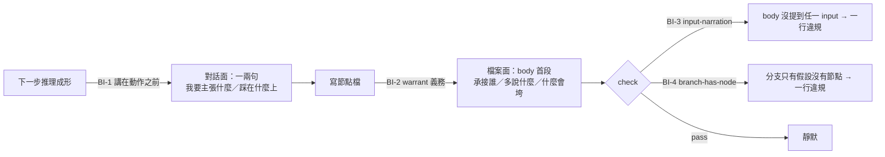

# think-orbit — 透明度兩面對等（對話面＋檔案面）— brief

> **Phase**: brainstorming output (`brainstorming` → `writing-plans` handoff)
> **Date**: 2026-08-19
> **Author**: agent (Opus 5) + kouko
> **Umbrella brief**: `docs/loom/specs/2026-08-18-think-orbit-plugin.md`
> **Evidence**: `docs/loom/dogfood/2026-08-19-think-orbit-real-material.md`（Part 1 Task 12 真實素材檢查點）
> **Sequencing**: 本 arc 先於 `docs/loom/specs/2026-08-18-think-orbit-plugin-part-2.md`。
> Part 2 的三張視圖蓋在節點內容之上；節點的敘事形狀正要改變，先蓋視圖等於蓋在舊形狀上。
> **STATUS**: DRAFT

> **Design-side on-ramp**: fired: rows 2 — user chose direct
> **On-ramp rationale**: 2026-08-19，使用者明選，非 agent 預設；理由：設計依據是真實使用的
> 量測證據，繞設計站會重推已有答案的東西。row 1 為 DIRECTION.md 的 standing direct；
> row 3 未觸發，本 arc 已有 spec。
> **Change-folder binding**: N/A — loom-design 未為本 arc 執行（on-ramp = direct），
> 故無其產出的 change-folder；repo 內兩個非封存 change-folder
> （`2026-07-12-us-sec-primary-source-layer`、`2026-07-19-8k-prose-kpi-intake`）屬 investing-toolkit 舊 arc。
> **Backlog ready check**: run — COMMITTED-NEXT 為空；OPEN 中
> `2026-08-18-loom-decision-trail-as-dag-view-via-think-orbit-render` 的 start 條件
> （T12 檢查點記錄 go）已於本日觸發，但屬另一 arc，不併入本 arc。

## Problem

**Job story**：當我和 agent 一起想一個真實問題時，我想要在**討論當下**就看得懂它為什麼往這裡推，
並且在**事後翻開任一個節點檔**時仍然看得懂那一步憑什麼成立，這樣我才能在推理走偏的當下就攔下來，
而不是三個月後對著一張圖猜自己當初在想什麼。

這正是 plugin 宣稱要解決的問題（總覽 brief 的核心概念：「將 CoT 透明化」），而 0.1.x 沒有做到。
根因是一條規則把三件成本完全不同的事當成同一件禁掉了
（`thinking-session/SKILL.md:44`「Everything else is **silent file writing**. No forms,
no per-node confirmation, no progress narration」）：

| 種類 | 成本來源 | 現況 | 應為 |
|---|---|---|---|
| 流程播報（「我寫了節點 4」） | 噪音 | 禁 | 禁（維持） |
| **推理外顯**（「我要主張 X，因為上一步的 Y」） | 幾乎為零 | **被一併禁掉** | **必須** |
| 打斷（停下等使用者回答） | 使用者的時間 | 三種 | 三種（維持） |

實測後果（檢查點 §F-T12-01，17 個節點）：body 用文字交代自己承接哪個 input 的比例，
受 interrupt 保護的 DECISION 是 **2/2**，靜默寫入的 CLAIM/FACT 是 **0/8**。
分界線精準落在「該步驟有沒有發生過一場把推理講出來的對話」上——靜默不只讓使用者看不到，
它讓推理**根本沒有被 articulate**，因此也沒有東西可以寫進 body。

加成因素：本使用者的全域 CLAUDE.md 要求「結論先行、不要旁白」。該偏好與 skill 的 silent 規則疊加，
agent 更無理由開口。修正必須在 skill 內明寫本 skill 是該偏好的刻意例外。

## Users

同總覽（拿真實素材做思考／規劃的單一擁有者）。本 arc 新增的條件來自檢查點的實跑情境：
使用者在**另一台機器、真實工作、無人指導**下使用，事後才回頭讀節點檔。
因此「當下看得懂」與「事後看得懂」不能互相替代——沒有第三者在旁補述。

## Smallest End State

- BI-1 — Three kinds of speech in the contract (`thinking-session/SKILL.md`, `using-think-orbit/SKILL.md`):
  progress narration stays banned; **reasoning-aloud becomes required**; the three interrupts are unchanged.
  Granularity is stated as **before the action, not after the thought** — you say what you are about to claim
  and what it stands on, then you write the node. One or two sentences, never a form, never awaiting a reply.
  The contract states explicitly that this skill is a deliberate exception to a host-level
  "be terse / no narration" preference, naming the reason (transparency IS the product here).
- BI-2 — Warrant duty on every node body (`references/node-schema.md`, `thinking-session/SKILL.md`):
  a CLAIM/FACT body's first paragraph must answer three things — which upstream node this stands on,
  **restated in prose rather than cited as a bare `ref` id**; what this step adds on top of it;
  what would collapse it. DECISION already satisfies this as a by-product of interrupt (c);
  the duty becomes explicit for every type. The file must stand alone **even though the same reasoning
  was already spoken in the conversation** — the two faces are equal, not substitutes.
- BI-3 — `check` rule `input-narration` (`scripts/dag.py`): a node with non-empty `inputs` whose body
  names **no** load-bearing input's `id` in its prose is a violation, one line per node. A node whose
  inputs are all non-load-bearing must name at least one of them instead — otherwise such a node could
  never satisfy the rule at all.
  Mechanical scope is deliberately narrow — it verifies that the id was named, never whether the
  surrounding sentence is a good explanation. Quality is carried by BI-1, not by the gate.

  **Revised 2026-08-19 after measurement (round-2 review of Task 1).** The rule was first specified as
  "body mentions an input's id OR a keyword from its `summary`". Run against the real project
  (使用者本機的私有專案目錄（路徑不入公開 repo）, 10 nodes carrying `inputs`), the keyword arm
  passes **10 / 10** — including one CLAIM whose body never refers to any of its three
  upstream nodes and merely discusses the same subject. A stoplist of CJK function words does not fix
  this: the reviewer reproduced the same zero-connection match on `他們` and `目前` immediately after 27
  entries were added, and the class of such words is open. The deeper reason the whole approach fails is
  that **lexical overlap cannot separate "narrates its upstream" from "is about the same topic"**, and
  nodes on one reasoning chain are always about the same topic.
  The id arm passes **2 / 10** — exactly the two DECISION nodes the checkpoint identified by hand as the
  ones that do narrate (§F-T12-02).
  **The threshold was corrected a second time, also by measurement.** The first id-arm specification said
  every load-bearing input must be named. Measured, that passes **1 / 10** and the node it passes is a
  FACT, while both DECISION nodes — the two a human judged good — FAIL it: they carry four and three
  load-bearing inputs and name only some. A rule stricter than the best human-authored nodes in the
  corpus is mis-calibrated. Naming **at least one** load-bearing input passes exactly 2 / 10 and exactly
  those two nodes, so that is the shipped threshold. Naming the id is therefore the only discriminator that
  reproduces the human reading, and it is deterministic and language-independent.
  This does not contradict BI-2's "in prose rather than a bare `ref` id": the two good nodes name the id
  INSIDE a sentence — «`<upstream_id>` is tagged non-load-bearing deliberately», the id as the subject of a
  sentence that says something about it. What BI-2 rejects is an id sitting alone in
  frontmatter with no prose around it — not an id used as the subject of a sentence.
- BI-4 — A branch must contain a node (`thinking-session/SKILL.md`, `scripts/dag.py`):
  when a branch opens, each path first gets one CLAIM stating that path's position; assumptions are filed
  under it. New `check` rule `branch-has-node` — a branch id carried only by assumptions is a violation.
  This removes the assumption inflation the checkpoint measured (18 assumptions vs 17 nodes), and
  removes the `branch_type: (?)` rendering **for the assumption-only branches** — not for every branch
  showing `(?)`. `render` falls back to `?` whenever no node in a branch sets `branch_type`, which also
  covers a branch that HAS nodes whose `branch_type` field is simply absent, and no rule requires that
  field. That is why the checkpoint counts 5 branches rendering `(?)` but only 4 as assumption-only:
  the fifth has nodes that omit `branch_type`. Both figures are correct; this arc closes 4 of the 5, and restores the ≤3 cap's meaning (three assumptions supporting one claim,
  not three assumptions standing alone).
- BI-5 — Replace the placeholder worked examples (`thinking-session/SKILL.md`, `references/node-schema.md`):
  every body example currently describes itself (`Body text in short paragraphs.` /
  `Longer body text explaining the goal.` / `Optional body with more detail.`). A worked example is
  prescriptive; ship real bodies that demonstrate the warrant duty instead.
- BI-6 — Release 0.1.4: CHANGELOG entry, version bump, Codex mirror regenerated, CI green.

## Current State Evidence

- **Forward**（對話面規則從哪裡進來）：`think-orbit/skills/using-think-orbit/SKILL.md:25-28`
  宣告三種 interrupt ＋ silent file writing；`think-orbit/skills/thinking-session/SKILL.md:29-46`
  是同一契約的本體（`:44` 為「no progress narration」句），`:66` 追加「you write silently」。
  同檔 `:91`（router）再加「do not narrate the whole graph」。
- **Reverse**（誰產生使用者看到的檔案）：`think-orbit/scripts/dag.py:1057-1059` `_cmd_render`
  是唯一寫 `views/dag.md` 的入口，經 `_write_view`（`:959`）。SSOT 方向為
  frontmatter → 視圖，視圖標頭明寫 regenerate-never-hand-edit 且 agent 不得讀。
- **Error**（機械閘現況）：`think-orbit/scripts/dag.py:569-580` `_CHECK_RULES` 共 11 條規則，
  `check()` 回傳排序後的違規行。現有規則**全部檢查 frontmatter 與檔案結構，無一條檢查 body 與 inputs
  的語意關係**——BI-3 是這一類的第一條。
- **Data**（欄位定義）：`references/node-schema.md:23-30` 節點欄位（`inputs` 為
  `{ref, load_bearing}` 清單）、`:62-67` 假設欄位（`branch` 為選填，缺省即 project-wide）。
  body 在 schema 中**完全沒有結構要求**，僅受 `paragraph-form` 的每段 2–4 句限制。
- **Boundary**：`_rule_assumption_max`（每分支 ≤3 假設）、`_rule_paragraph_form`（段落句數上限）、
  `_rule_mermaid_id_collision`。三者皆為上限型規則；本 arc 新增的兩條是**首次出現的下限型規則**，
  需注意上限與下限並存時的訊息一致性。
- **Evidence paths**：使用者本機的私有專案目錄（路徑不入公開 repo）（真實專案，只讀，不修改）；
  `docs/loom/dogfood/2026-08-19-think-orbit-real-material.md`（量測與推翻紀錄）。

## Decision

修正透明度的**兩個出口**，並承認它們同源：靜默寫入既讓使用者看不到推理，也讓推理沒有被 articulate，
所以 body 沒有東西可寫。對話面（BI-1）與檔案面（BI-2 ~ BI-5）同時做，因為使用者裁定兩面對等
（verbatim：「兩邊都做 討論當下看得懂，事後翻檔案也看得懂」）。

**不做**：節點粒度不動——檢查點證偽了「節點太小」的歸因（body 為 161–474 中文字元、2–4 段，內容不薄），
且合併節點不會讓它們開始交代關聯。粒度是否需調整，留待本 arc 修正後以真實素材重跑一次再判；
該順序可逆，反序不可逆。

**機械化的誠實邊界**：BI-3 只驗「有沒有提到」，擋不住敷衍。這是刻意的——判斷型的品質要求寫成散文
會被弱模型繞過，可查動作的規則才守得住（repo memory:
`weak-model caveats need verifiable action not judgment`）。品質由 BI-1 的對話面保證。

## Out of Scope

- 節點粒度、`≤3 假設/分支` 上限、`paragraph-form` 的 2–4 句規則——皆不動。
- 三張衍生視圖、提案編纂、里程碑 commit、0.2.0 發佈——留在 Part 2。
- **線性閱讀視圖不另做**：Part 2 的 BI-1 mainline view（`render mainline`，依 `seq` 串成 CoT 的可讀版）
  已涵蓋此需求；在此另造一個平行視圖會製造重複實作。
- backlog `2026-08-18-loom-decision-trail-as-dag-view-via-think-orbit-render`——start 條件雖已觸發，屬另一 arc。

## Alternatives Considered

研究於 2026-08-19 以 WebSearch 進行，EN＋JA 雙語各至少一次查詢。

**節點如何獨立可讀（BI-2 的形狀）** — My take: 採 ADR 的 Context/Decision/Consequences 精神，
但只取其最小義務（Context 必須把被引節點的主張重述到讀者不必開檔），不引入整套範本。
Why: 這是唯一有兩個語言社群**各自獨立**收斂到同一診斷的做法。Would reverse if: 節點變成以論辯為主
（互相競爭的主張而非已定案的決定），屆時 Toulmin 的 claim-grounds-warrant 更合適，因為 ADR 的
Decision Outcome 格式會把反駁結構壓平。

| 做法 | 誰在用 | 語言 | 來源 | 取捨 |
|---|---|---|---|---|
| ADR（Nygard 最小四欄） | 業界廣泛，adr-tools | EN | https://cognitect.com/blog/2011/11/15/documenting-architecture-decisions | 「1 決定 1 檔」與本專案「1 節點 1 檔」同構；但 Context 是散文，沒有結構性強制引用上游主張 |
| MADR | adr.github.io 社群範本 | EN | https://adr.github.io/madr/ | 多了 Decision Drivers／Considered Options／Rationale，直接補上本 arc 的缺口；但每節點成本偏高，小步驟會變公文 |
| IBIS / Toulmin warrant | dialogue mapping（Conklin）、修辭學標準 | EN | https://www.lucidchart.com/blog/what-is-dialogue-mapping | **warrant 就是我們缺的那個欄位**，且原生支援反駁節點；但記法較重，無主流工具 |
| Zettelkasten link context | Zettelkasten.de 社群、Obsidian 生態 | EN＋JA（兩邊收斂） | https://zettelkasten.de/posts/what-and-where-is-a-link-context-explained-using-citation-conventions/ | 直接命名本缺陷（「リンクの意味を注釈しておく」）、一句話成本；但純社群慣例，無任何工具強制 |

**研究查無的部分（本身即發現）**：找不到任何工具在 **lint** 這個 rationale 欄位——MADR 是範本、
Zettelkasten 是慣例。BI-3 因此不是抄現成品，是自建；也因此不應期待有現成的正確性參考。

**對話中如何外顯推理（BI-1 的粒度）** — My take: 採「動作之前講一句意圖」，不採任務清單式進度視圖，
也不採原始 CoT 串流。Why: 業界只有兩極——任務清單型進度 UX 與 raw thought stream——
而**協作思考中的中間粒度沒有已出貨的慣例**，這個空白是研究的明確結論；在空白中，
結對程式設計的既有實證（driver 先說出意圖，navigator 才能在錯誤推理走遠前打斷）是最貼近的證據。
Would reverse if: 實跑顯示每步一句仍過密，屆時退到「每個分支／里程碑一段」的較粗粒度。

| 做法 | 誰在用 | 語言 | 來源 | 取捨 |
|---|---|---|---|---|
| 動態任務清單（透明優於聰明） | Anthropic / Claude Code | EN | https://www.anthropic.com/research/building-effective-agents | 已出貨、明確針對不透明失效模式；但那是任務狀態視圖，不交代「這一步為何從上一步來」 |
| Extended thinking 摘要串流 | Anthropic Claude API | EN | https://platform.claude.com/docs/en/build-with-claude/thinking | 模型原生、應用端零工程；但那是模型自述，粒度屬單次呼叫，不是一場會談的決策點 |
| 結對程式設計「邊做邊講意圖」 | XP 實務，日文工程部落格大量記載 | JA | https://zenn.dev/oyasumi731/articles/3cf8a7ca7b231f | 數十年實證，且明確主張**講在動作前**才能讓夥伴及早打斷；但假設雙方持續在場，硬套到每個微步驟會變確認儀式 |
| 進度狀態訊息（「収集中」「要約生成中」） | Microsoft（日文 agent UX 文章） | JA | https://zenn.dev/microsoft/articles/ux-design-for-agents-by-microsoft | 命名了它解決的焦慮（「今、何が起きているのか分からない」）；但接近帶標籤的轉圈圖示，對「為何選這條」無幫助 |

**EN 與 JA 的差異（不是矛盾，值得並記）**：在對話面，EN 來源把問題框成「避免不透明架構」，
解法是可見的計畫清單；JA 來源把問題框成「避免使用者焦慮」，解法是狀態訊息。
兩者都是真實出貨的模式，但解的是相鄰而非同一個問題。在節點可讀性上，EN 與 JA 無分歧。

## What Becomes Obsolete

- `thinking-session/SKILL.md:44` 與 `using-think-orbit/SKILL.md:27-28` 現行的
  「Everything else is silent file writing」句——由 BI-1 的三分類取代，同一次改動中刪除，不留平行版本。
- 四處佔位符 worked example（`SKILL.md:153`、`node-schema.md:132/146/157`）——由 BI-5 的真實範例取代。
- 檢查點 §F-T12-05 記錄的「節點太小」與「範例是佔位符所以 body 都是殘根」兩條推論已被證偽，
  不得在後續 brief 或計畫中復活；引用該節而非重推。

## Open Questions

- OQ-1 [RESOLVED] — BI-3 的 `input-narration` **對 `inputs: []` 的節點完全不適用**（2026-08-19）。
  要求一個沒有上游的節點寫出「這一步不依賴任何上游」，產出的是樣板句而非資訊；而 `type: GOAL`
  這件事本身已經說明了它為什麼沒有上游。規則只在 `inputs` 非空時觸發，與 `fact-source` 規則
  對研究筆記的豁免同一形狀（`dag.py` 既有 `origin == "research"` 豁免）。
- OQ-2 [RESOLVED] — 「說在動作之前」在 headless／非互動情境下**仍然成立，不退化**（2026-08-19）。
  講出來的價值不在於有人聽見，而在於**被說出來的推理才會被寫下來**——檢查點量到的
  2/2 vs 0/8 正是這件事：受打斷保護的節點之所以 body 完整，是因為推理被 articulate 過，
  不是因為有人回應。無人在場時 transcript 就是載體，義務不變。

## Diagrams

同一段推理必須在兩個面各交付一次，兩者皆須獨立成立：

圖的重點是那條分岔不是二選一：`S` 講過**不免除** `B` 要寫，這是使用者裁定「兩面對等」的直接後果。
