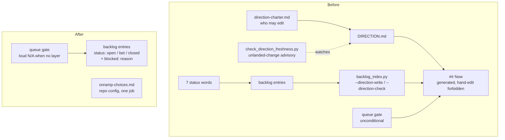

# Dissolve the direction layer — brief

> **Phase**: brainstorming output (`brainstorming` → `writing-plans` handoff)
> **Date**: 2026-08-20
> **Author**: agent (Opus 5) with kouko

## Design-side on-ramp

not fired — deletion-first refactor of shipped loom-code mechanism, not
product-shaped new work.

Rows 2/3 do not fire: no user-facing surface, and the status vocabulary is a
data enum, not multi-state behaviour. Row 1 would in any case be covered by
the standing direct choice recorded in `docs/loom/DIRECTION.md`.

Axis 0 queue check ran: `## Now` is empty (`_(queue empty — bet at the next
close-out)_`); `## Next` carries two themes, neither this one; `--ready` lists
105 OPEN entries, three of which this arc touches (cited under Current State
Evidence).

## Queue relation

unqueued — `## Now` is empty, so `in-queue:` cannot resolve; this arc is
user-initiated from the measurement that closed the previous arc.

## Problem

When I want to know what this repo is working on next, I want one place that
answers it, so that I am not maintaining a generated copy of state the
per-entry files already hold — and not paying for the four mechanisms that
exist only to keep that copy honest.

## Users

- **kouko (solo repo owner)** — runs loom arcs across 12 repos; reads the queue
  at kickoff and writes it at close-out. Every concept in the layer is one he
  personally maintains, in every repo, forever.
- **Agent sessions running loom-code skills** — read `--ready`, read
  `DIRECTION.md`'s `## Now`, and run the queue-relation gate at plan intake.
  Each surface is an independent place a session can be wrong about repo state.
- **Repos adopting loom via `loom_init.py`** — get the whole direction layer
  scaffolded at init, whether or not they will ever place a bet. Ten of the
  twelve loom repos on this machine have never had a queue layer at all.

## Smallest End State

The backlog store is the only record of what the repo is working on. Answering
"what is next" means reading the entries whose status is `bet`; no generated
section, no second file, and no freshness checker stands between the question
and that answer. Success criterion: `docs/loom/DIRECTION.md` no longer exists,
`grep -rn 'direction_freshness\|--direction-write' loom-code/` returns only
frozen historical records, and the full package test suite is green. Explicit
non-criterion: total line count is not the measure — a refactor that deleted
900 lines while leaving the six concepts in place would fail this brief.
<!-- narrative: the non-criterion only means anything against the success criterion it negates, and the success criterion only means anything against the one-store claim it makes checkable -->

- BI-1 — The backlog store's `bet` entries are the only record of what the repo works on next; no generated copy of that state exists anywhere.
- BI-2 — The entry status vocabulary is exactly three words — `open`, `bet`, `closed` — and the "live but not actionable" distinction moves to a `blocked: <reason>` field that the ready query filters on.
- BI-3 — The queue-relation gate resolves against backlog entries, names the available candidates when it cannot resolve, and reports a loud `N/A` at exit 0 in a repo that has no queue layer.
- BI-11 — Every status word and the `blocked:` field carries a written definition — meaning, who sets it, when it flips, what duties attach. The canonical definition block lives in the store charter template (`templates/backlog-README.md`), is instantiated into each repo's `docs/loom/backlog/README.md` (SSOT-and-functional-copy pattern), and every skill surface that reads or flips a status points at that block instead of paraphrasing it.

Seed content for BI-11's definition block (writing-plans lifts this verbatim
rather than letting an implementer invent wording):

| Word | Means | Set by | Flips when | Duties attached |
|---|---|---|---|---|
| `open` | Recorded, not chosen. The default at creation; may stay open forever. | Anyone filing an entry | → `bet` at a betting moment; → `closed` when shipped/superseded/abandoned | Optional `start:` memo (prose trigger, never machine-read). Optional `blocked: <reason>` — present ⇒ excluded from `--ready`. |
| `bet` | Chosen by the user at a close-out betting moment as what the repo works on next. A bet can be lost — dropping one back to `open` is legal and carries no ceremony beyond removing the promotion. | **User only** — agents never promote | → `closed` at that arc's close-out; → `open` if the user withdraws it | Must carry a well-formed `serves:` line (`check_north_star_link.py`); the queue-relation gate resolves `in-queue:`/`displaces:` against live bets. |
| `closed` | This line ended — shipped, superseded, or deliberately abandoned. The reason is one body line naming the evidence (branch/PR/decision), not a status variant. | Agent at close-out, per the user's instruction | Terminal (an entry under `archive/` is `closed` by construction) | Body line naming the evidence. |
| `blocked:` (field, not a status) | Why this `open` entry cannot be picked right now. | Whoever knows the fact | Delete the line when the impediment lifts — the entry re-enters `--ready` | None — it is a filter flag, `--ready` is its only reader. |

## Current State Evidence

- **Forward**: `loom-code/skills/writing-plans/SKILL.md:117` runs the queue gate
  unconditionally at plan intake — verified live against `~/GitHub/komado-Refs`
  (86 briefs, no `docs/loom/`): exit 2, demanding a queue relation for a queue
  that does not exist. `loom-code/skills/finishing-a-development-branch/SKILL.md:185`
  carries the close-out duty that regenerates `## Now` and prompts for a bet.
  `loom-code/skills/brainstorming/SKILL.md:81-82` makes every kickoff read
  `## Now` and `## Next`.
- **Reverse**: `loom-code/scripts/backlog_index.py:603` (`READY_STATUSES`) and
  `:174` (`CLOSED_STATUS_VOCABULARY`) are the two enums every consumer reads.
  `loom-code/scripts/check_onramp_choice.py:147` locates `DIRECTION.md` for the
  standing-choices lookup; `loom-code/hooks/git-guard.py:657-661` fails the
  commit gate when that read raises. `loom-code/scripts/loom_init.py:175`
  scaffolds `DIRECTION.md` into every newly adopting repo.
- **Error**: `loom-code/scripts/check_direction_freshness.py:319` (`main`) exits
  0 / 1 / 2 — resolved / brief unreadable / unresolved. Its
  `build_queue_relation_question` at `:276` returns generic text with literal
  `<entry-name>` placeholders when no entry was named, so the STOP message
  never lists the names the script is already holding.
- **Data**: 139 live entry files under `docs/loom/backlog/`, distribution
  measured 2026-08-20 — OPEN 105, SHIPPED 16, PARKED 12, CLOSED — SUPERSEDED 4,
  UPSTREAM 2, COMMITTED-NEXT 0, archived 0. The `archive/` tier
  (`backlog_index.py:14-21`, invariants iii/iv) has never held an entry.
- **Boundary**: `[FRAGILE]` `loom-code/hooks/git-guard.py:152` embeds the
  standing-choice grammar string in its block message, so the on-ramp text and
  the guard are coupled across two files. `[FRAGILE]` `~/GitHub/kumiko-zaiku-app-icons/docs/loom/DIRECTION.md`
  is a second repo carrying a live non-empty `## Now` with two COMMITTED-NEXT
  entries; it updates its plugin cache independently of this PR.

- **Evidence paths**: `loom-code/scripts/check_direction_freshness.py:63-189`,
  `:192-295`, `:276`, `:319-371`; `loom-code/scripts/backlog_index.py:14-21`,
  `:56-57`, `:119`, `:172-201`, `:603-646`;
  `loom-code/scripts/check_onramp_choice.py:12`, `:131`, `:147`, `:185-188`;
  `loom-code/scripts/loom_init.py:8`, `:128-183`;
  `loom-code/scripts/check_north_star_link.py:28-44`;
  `loom-code/hooks/git-guard.py:152`, `:657-661`;
  `loom-code/hooks/family-reception.md:67-72`;
  `loom-code/hooks/direction-charter.md` (whole, 25 lines);
  `loom-code/skills/writing-plans/SKILL.md:117`;
  `loom-code/skills/finishing-a-development-branch/SKILL.md:185`;
  `loom-code/skills/brainstorming/SKILL.md:81-92`, `:112-114`;
  `loom-code/skills/brainstorming/references/handoff-brief-format.md` (Queue
  relation grammar); `docs/loom/DIRECTION.md` (whole, 22 lines);
  `docs/loom/backlog/2026-08-02-backlog-index-two-frontmatter-readers-disagree-on-duplicate-keys.md`;
  `docs/loom/backlog/2026-08-10-loom-lacks-a-milestone-layer-between-plan-stage-and-direction.md`;
  `docs/loom/backlog/2026-08-10-queue-layer-family-ownership-north-star.md`;
  `docs/loom/audits/2026-08-18-onramp-choice-gate-fire-rate.md`.

## Decision

We delete the materialized view and everything that existed to keep it honest,
and we keep the one gate whose intent survived measurement — after fixing it.
`## Now` goes, along with the two generator verbs, the charter that governed
who may edit the file, and the unlanded-change advisory that fires on
essentially every open branch. `DIRECTION.md` itself dissolves: `## Next`
becomes backlog entries (the same move the previous arc already made for
`## Later`), and `## On-ramp standing choices` moves to its own small file
whose name states its one job. The status vocabulary collapses to three words
with the blocked-ness that PARKED and UPSTREAM were carrying moved into a
field, so nobody has to adjudicate which of those two words a blocked entry
deserves. We do NOT build a milestone layer, do NOT migrate kumiko in this PR,
and do NOT delete the queue-relation gate. One clause survives re-pointed
rather than deleted: the close-out betting prompt — with `## Now` gone it is
the only mechanism that ever creates a `bet`, so it triggers on the store
(no live `bet` at close-out) instead of on `DIRECTION.md`.
<!-- narrative: each deletion names the mechanism that existed to serve the previous one, so the sentences form a single chain from the view to the checker that watched it; splitting them loses the because -->

- BI-4 — loom's queue layer is one store of per-entry files plus the two checks that read it; every artifact that duplicated, governed, or watched that store is gone.
- BI-9 — The close-out betting duty survives `DIRECTION.md`'s deletion re-pointed at the backlog store: when no live `bet` exists at close-out, the user is prompted — `PURPOSE.md` printed first, candidates listed from `--ready` — and only the user flips a `status:` to `bet`; agents never auto-promote.

## Out of Scope

- **Migrating `kumiko-zaiku-app-icons`.** It carries a live non-empty `## Now`
  with two COMMITTED-NEXT entries and is a separate repo with its own PR flow.
  This arc makes the validator fail loudly and name the replacement word, so
  the migration is guided rather than guessed; the migration itself is a
  backlog entry.
- **A milestone layer between plan Stage and the queue.** The open entry
  `2026-08-10-loom-lacks-a-milestone-layer-between-plan-stage-and-direction`
  names three candidate shapes, one of which (option (a)) grows out of
  `DIRECTION.md`'s bets. This arc forecloses (a); it updates that entry's text
  to say so rather than leaving it citing a file that no longer exists.
- **The remaining nits in `2026-08-02-backlog-index-two-frontmatter-readers-disagree-on-duplicate-keys`.**
  Its start condition ("the next substantive edit to `backlog_index.py`") fires
  on this arc. Finding 1 (two frontmatter readers disagree on duplicate keys)
  rides along because the vocabulary change touches both readers; findings 2-4
  do not, and stay open with a note naming this arc as the touch that passed
  them by.
- **Re-homing the queue layer out of loom-code.** The north-star entry
  `2026-08-10-queue-layer-family-ownership-north-star` owns that question; this
  arc changes what the layer contains, not which plugin ships it.
- **Renaming `BACKLOG.md` or changing the store's one-entry-per-file shape.**

## Alternatives Considered

| Alternative | Who ships it / source | Why rejected |
|---|---|---|
| Keep `## Now` but generate it on demand instead of persisting it (a view, not a file) | GitHub Projects' Roadmap layout is a generated projection over Issues, never a stored file — [Mamezou, JA](https://developer.mamezou-tech.com/blogs/2023/03/28/github-projects-new-roadmaps-layout/) | This is what `--ready` already is. Adding a second on-demand view of the same entries re-creates the duplication with extra code. |
| Keep the file, keep hand-maintaining it, drop only the generator | Japanese practitioner reports on Excel/PPT roadmap files — [Lychee Redmine, JA](https://lychee-redmine.jp/blogs/project/tips-road-map-4/) | Both EN and JA sources name **hand-maintained duplicate files** as the drift mechanism; neither found a case of a *generated* view drifting. Dropping the generator moves us toward the failure mode, not away from it. |
| Collapse to 3 statuses and let PARKED/UPSTREAM entries flood the ready query | — | Measured: 14 of 139 entries carry those two words, and `READY_STATUSES` (`backlog_index.py:603`) exists precisely to hide them. A 3-word vocabulary that makes the ready query 14 items noisier is a downgrade. |
| Collapse to 3 statuses, move blocked-ness to a field | Jira's canonical model is 3 categories with nuance in a separate resolution field; GitHub Issues ships 2 states and pushes nuance to labels — [Atlassian Community, EN](https://community.atlassian.com/forums/Jira-questions/Jira-statuses-best-practices/qaq-p/2933359), [GitHub community discussion, EN](https://github.com/orgs/community/discussions/170318) | **Chosen.** Also removes the PARKED-vs-UPSTREAM judgment call: "why is it blocked" has a factual answer where "which of these two words" does not. |
| Make the absent-queue-layer case a silent skip | loom's own `loom-memory` skill does the opposite — `N/A` **with the reason, loudly** | The fail-open literature warns that a check which silently reports success is a known footgun — [GitHub Discussion #44490, EN](https://github.com/orgs/community/discussions/44490); the fail-open/fail-closed split is documented at [Stackademic, EN](https://blog.stackademic.com/designing-apps-for-failure-fail-open-vs-fail-closed-systems-1dce298696f8). A loud N/A is both the literature's answer and loom's own house precedent. |

Research note: EN and JA **disagree** on status-vocabulary size. EN sources
(Linear's own accuracy data, Jira's 3 categories, GitHub's 2 states) converge
on a small closed set; a JA kanban source describes 7-9 stages as normal
([Adobe JP](https://business.adobe.com/jp/blog/basics/kanban-board-examples)).
The disagreement resolves on scope rather than on merit: the JA counts are
*board columns* (workflow stages an item passes through), not a status enum on
a stored record. Both languages agree that dropped nuance belongs in labels or
fields — which is what this arc does.

## What Becomes Obsolete

- BI-5 — `docs/loom/DIRECTION.md`, its template `loom-code/scripts/templates/DIRECTION.md`, and the charter `loom-code/hooks/direction-charter.md` that governed who may edit it.
- BI-6 — `backlog_index.py`'s direction half: `--direction-write`, `--direction-check`, and the five functions behind them.
- BI-7 — `check_direction_freshness.py`'s unlanded-change advisory (`find_unlanded_direction_changes` and its helpers) and the three test files that exist only for it.
- BI-8 — Four status words (`COMMITTED-NEXT`, `PARKED`, `UPSTREAM`, `SHIPPED`) and the archive tier's separate `archived` status, together with the close-out row's `## Now`-regeneration clause and the betting prompt's `DIRECTION.md` trigger condition (the prompt itself survives — BI-9).
- BI-10 — The archive tier's two-invariant machinery (`status: archived` agreement plus the `archived:` date-field check) — never exercised by any entry since the tier shipped; the folder survives as a plain destination whose entries are `closed` and excluded from the index listing.

## Open Questions

(none — the two forks this arc raised are recorded as Decisions above: the
new home for the standing choices, and the `blocked:` field. Both are noted to
the user at the sign-off checkpoint as reversible calls rather than measured
ones.)

## Diagrams

The before/after of what a session must understand to answer "what is next" —
read it as concept count, not file count.

